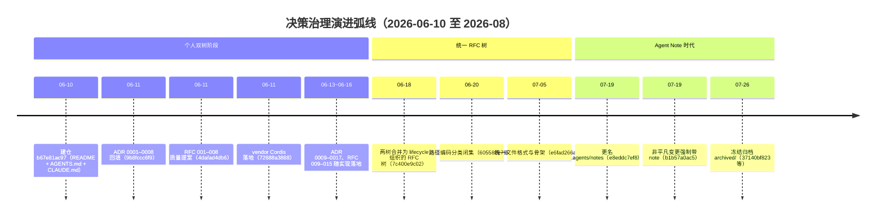
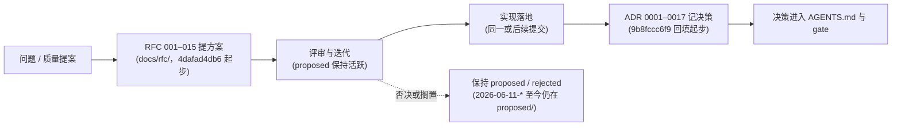
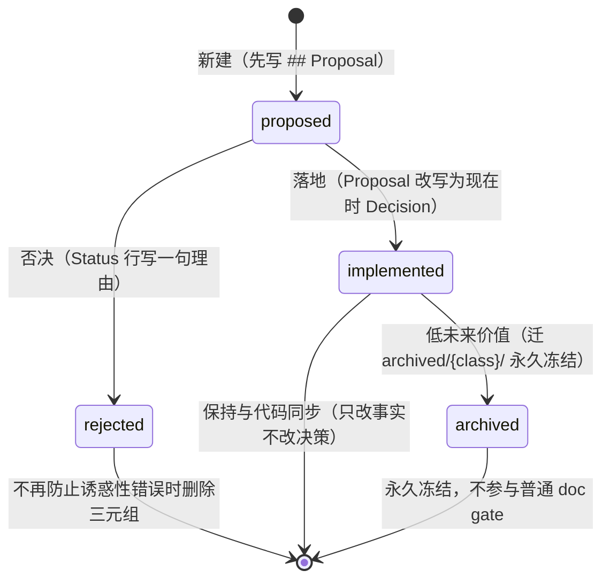
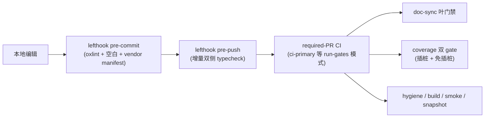
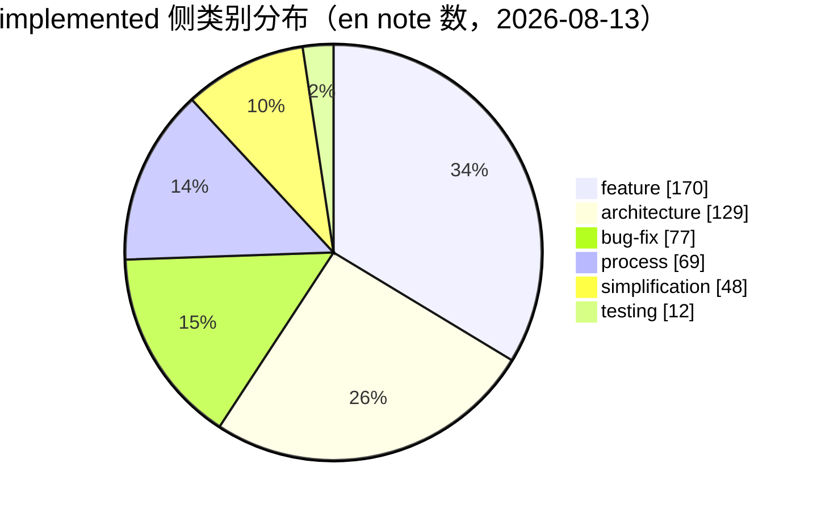

## 架构决策与治理

### 总览

项目的决策治理经历了一条清晰的演进弧线：从 2026-06-10 初始化（`b67e81ac97`）开始的"个人 ADR/RFC"阶段，到 7 月 19 日定型的"Agent Note + 自动化 gate"体系。驱动这条弧线的根本原因写在最早的质量门决策里：**这个代码库主要由 coding agent 开发，agent 遵守机器强制 gate 远比遵守散文约定可靠**（[quality-gates](.agents/notes/implemented/process/2026-06-11-quality-gates.md)，2026-06-11）。

因此治理机制一直在向"可机器检查"的方向收敛：决策记录从两棵命名混乱、格式各异的 `docs/adr/` 与 `docs/rfc/` 树，合并为按生命周期与类别路径编码的 RFC 树（2026-06-18），再更名为 `.agents/notes/`（Agent Note，2026-07-19），并配上一整套 `verify-*` 静态 gate（归入 `doc-sync`）、运行时 invariant 断言与每文件 100% 覆盖率 gate。

到了 8 月中旬，Agent Note 成为仓库的"标准决策层"：任何非平凡变更必须在同一 PR 内新增或更新 Agent Note（`b1b57a0ac5`，2026-07-19），已实施的 note 形成冻结归档（`archived/`，2026-07-26），其格式、分类、链接、双语配对全部由 gate 强制。



**治理弧线的六个阶段**（日期 = 对应提交的合入日）：

| 阶段 | 日期 | 关键提交 | 状态载体 | 治理动作 |
|---|---|---|---|---|
| ADR/RFC 起步 | 06-11 | `9b8fccc6f9` / `4dafad4db6` | `docs/adr/` + `docs/rfc/` | 回填 8 个 ADR、8 个 RFC；质量门规则写入 AGENTS.md |
| 双轨增长 | 06-13 ~ 06-17 | `36a30180b8` 等 | 两树并存 | 先 RFC 提方案、后 ADR 记决策；ADR 0009–0017 随实现落地 |
| 合并统一 | 06-18 | `7c400e9c02` | `docs/rfc/` 单树 | 两树合并为 lifecycle 树，文件名改 `yyyy-mm-dd-topic` |
| 分类闭集 | 06-20 | `605587e79c` | `{lifecycle}/{class}/` | 六个 class 闭集路径编码，新增两个 verify gate |
| 更名 + 强制 | 07-19 | `e8eddc7ef8` / `b1b57a0ac5` | `.agents/notes/` | RFC 更名 Agent Note；非平凡变更必须带 note |
| 冻结归档 | 07-26/27 | `37140bf823` / `6241eb6044` / `8b684fa5d0` | `archived/{class}/` | 低未来价值 note 永久冻结，SHA-256 manifest 封印 |

> [!NOTE]
> 本节所有日期、提交 hash 与 note 路径均来自 git 历史与 `.agents/notes/` 目录实测；无法确认的行一律标注"（待考）"，不臆造。

**术语速查**（定义列表，供后文引用）：

Agent Note
: 仓库唯一的决策记录载体：记录"为什么"与"放弃了什么"，路径 `{lifecycle}/{class}/yyyy-mm-dd-topic-title.md`，7/19 之前叫 RFC。

lifecycle（生命周期）
: note 的顶层状态目录：`proposed/`（实施前评审）、`implemented/`（已落地）、`rejected/`（否决）、`archived/`（冻结归档）。

class（类别）
: note 的二级路径，六个闭集：`feature` / `bug-fix` / `simplification` / `architecture` / `process` / `testing`，由 `scripts/agent-note-tree.ts` 持有。

gate（门禁）
: 可机械检查、非零退出即失败的验证命令；本地廉价检查走 git hooks，穷尽集走 CI 与 `run-gates.ts` 调度器。

seam（能力缝）
: 可替换能力的完整三件套：Service Definition / Service Provider / Consumer，见 [capability-seams](.agents/notes/implemented/architecture/2026-06-13-capability-seams.md)。

> [!TIP]
> 阅读本节时可配合 `.analysis/sections/timeline.md`（阶段划分）与 `.analysis/sections/packages.md`（包结构）对照；本节只讲"决策如何被记录、强制与演化"。

---

### 小节一：早期 ADR/RFC 阶段（6 月中旬）

2026-06-10 仓库初始化（`b67e81ac97` "Initialize repo with README, AGENTS.md, and CLAUDE.md symlink"），次日（06-11）架构与治理文档一天之内成型，形成两棵平行的决策树：

- **`docs/adr/`**：`9b8fccc6f9`（2026-06-11）"Backfill architecture decision records" 回填 **ADR 0001–0008**——0001 vendor-cordis-as-source、0002 microkernel-event-taxonomy、0003 event-sourced-sessions、0004 own-content-block-vocabulary、0005 custom-schema-dsl-over-schemastery、0006 tool-schemas-in-prompt-assembly、0007 quality-gates、0008 tsdown-over-dumble。同一天 `72688a3888` 已把 Cordis 框架包以源码形式 vendor 进仓库。
- **`docs/rfc/`**：`4dafad4db6`（2026-06-11）"Add RFCs for the remaining quality-proposal ideas" 增加 **RFC 001–008**——001 property-based-testing、002 mutation-testing、003 deterministic-and-stress-testing、004 architectural-conformance、005 runtime-validation-and-error-taxonomy、006 doc-sync-and-api-reports、007 supply-chain-and-vendor-drift、008 immutable-public-surfaces，并首次把质量门规则写进 AGENTS.md。

两棵树随后按需增长：RFC 009–011（2026-06-14，`a44f7f3486`，session 持久化与 ACP）、RFC 012（2026-06-15，`1cc6e1caf7`，Code Mode）；ADR 0009–0017 则随实现落地（06-13 至 06-15），形成"先 RFC 提方案、后 ADR 记决策"的双轨节奏——典型如 `36a30180b8`（arg validation，RFC 005 pt 1）、`11a29fdefe`（dev invariants，RFC 005 pt 3 + RFC 008）、`2f6d3b8539`（property tests，RFC 001）、`6a528be569`（doc-sync，RFC 006）、`825b57aff9`（error taxonomy，RFC 005 pt 2）、`df4b7d3d9a`（session persistence）、`b0bc0b5792`（turn-enclosure invariant）、`49e74ed8d0`（pnpm 迁移）。

#### 双轨节奏：先 RFC 提方案，后 ADR 记决策

RFC 与 ADR 的分工在 6 月中旬是清晰的：RFC 回答"要不要做、怎么做"，ADR 回答"决策已定、记录在案"。质量提案通常先以 RFC 编号进入评审，评审通过后随实现提交落地，落地提交再以 ADR 编号回填决策记录。



这套节奏的两条事实证据：其一，RFC 005（runtime-validation-and-error-taxonomy）被拆成三个实现提交（`36a30180b8` pt 1、`825b57aff9` pt 2、`11a29fdefe` pt 3 + RFC 008），每个提交各配一个 ADR（0011 / 0015 / 0012）——一条 RFC 可以对应多个 ADR 落地；其二，ADR 0009 与 0010 在同一个提交 `39b3db4b9c`（2026-06-13 "docs: accuracy sweep, architecture restructure, two ADRs, review skill"）里成对出现——决策批量回填是常态。

**三个决策载体的分工**（RFC / ADR / 后来的 Agent Note 逐维对比，帮助理解"为什么最终只剩一种"）：

| 维度 | RFC（`docs/rfc/`） | ADR（`docs/adr/`） | Agent Note（`.agents/notes/`，7/19 起） |
|---|---|---|---|
| 回答的问题 | 要不要做、怎么做（提案） | 决策已定、记录在案 | 同一问题 + "放弃了什么" |
| 生命周期 | 无路径编码（迁移前） | 无 | `proposed/` / `implemented/` / `rejected/` / `archived/` 四目录 |
| 类别 | 无 | 无 | 六个 class 闭集，路径编码 |
| 命名 | `NNN-topic`（数字序） | `NNNN-topic`（数字序） | `yyyy-mm-dd-topic`（日期序） |
| 文件格式 | 提案模板 | ADR 模板 | 统一骨架 + 强制 Alternatives considered |
| 机器强制 | 无 gate | 无 gate | `verify-agent-note-*` 等全套 gate |
| 最终去向 | 6/18 并入单树 | 6/18 并入单树 | 低价值 implemented → `archived/` 永久冻结 |

三列的演化逻辑：RFC 与 ADR 的边界（"提案" vs "记录"）在单一 tree 里无法从路径区分，统一后由 lifecycle 目录承担；命名从数字序改日期序，是因为"合并树 + 移动目录"会制造编号空洞，而日期序天然稳定、且文件名即首次提出日，可被 gate 交叉核对。

未被采纳的提案则停留在 `proposed/`。到今天（8 月中旬），RFC 002（mutation-testing）、003（deterministic-and-stress-testing）、004（architectural-conformance）、007（supply-chain-and-vendor-drift）与 RFC 006 的 api-reports 部分（`2026-06-11-api-extractor-reports`）、RFC 013（typed-event-schemas）仍然以 proposed note 的形式存在于 `.agents/notes/proposed/`——它们没有被删除，也没有被强制落地，而是作为"待验证的改进方向"持续占位。

#### ADR 0001–0017 全量表

下表把两棵决策树中 ADR 一侧的全部 17 个文件编号逐条列出（git 历史实测）。注意一个历史事实：**ADR 编号 0016 出现了两次**——`0016-session-persistence` 与 `0016-pnpm-over-yarn` 都叫 0016，这正是后来"编号与命名各自为政"被合并掉的原因之一。

| 编号 | 主题 | 日期 | 落地提交 | 现状 note 路径 |
|---|---|---|---|---|
| 0001 | vendor-cordis-as-source | 2026-06-11 | `9b8fccc6f9` 回填；`72688a3888` 落地 | [implemented/process/2026-06-11-vendor-cordis-as-source](.agents/notes/implemented/process/2026-06-11-vendor-cordis-as-source.md) |
| 0002 | microkernel-event-taxonomy | 2026-06-11 | `9b8fccc6f9` | [implemented/architecture/2026-06-11-microkernel-event-taxonomy](.agents/notes/implemented/architecture/2026-06-11-microkernel-event-taxonomy.md) |
| 0003 | event-sourced-sessions | 2026-06-11 | `9b8fccc6f9` | [implemented/architecture/2026-06-11-event-sourced-sessions](.agents/notes/implemented/architecture/2026-06-11-event-sourced-sessions.md) |
| 0004 | own-content-block-vocabulary | 2026-06-11 | `9b8fccc6f9` | [implemented/architecture/2026-06-11-content-block-vocabulary](.agents/notes/implemented/architecture/2026-06-11-content-block-vocabulary.md) |
| 0005 | custom-schema-dsl-over-schemastery | 2026-06-11 | `9b8fccc6f9` | [archived/architecture/2026-06-11-custom-schema-dsl](.agents/notes/archived/architecture/2026-06-11-custom-schema-dsl.md) |
| 0006 | tool-schemas-in-prompt-assembly | 2026-06-11 | `9b8fccc6f9` | [archived/architecture/2026-06-11-tool-schemas-in-prompt-assembly](.agents/notes/archived/architecture/2026-06-11-tool-schemas-in-prompt-assembly.md) |
| 0007 | quality-gates | 2026-06-11 | `9b8fccc6f9` | [implemented/process/2026-06-11-quality-gates](.agents/notes/implemented/process/2026-06-11-quality-gates.md) |
| 0008 | tsdown-over-dumble | 2026-06-11 | `630bbddf9a` | [archived/process/2026-06-11-tsdown-over-dumble](.agents/notes/archived/process/2026-06-11-tsdown-over-dumble.md) |
| 0009 | capability-seams | 2026-06-13 | `39b3db4b9c` | [implemented/architecture/2026-06-13-capability-seams](.agents/notes/implemented/architecture/2026-06-13-capability-seams.md) |
| 0010 | twin-llm-adapters | 2026-06-13 | `39b3db4b9c` | [implemented/architecture/2026-06-13-twin-llm-adapters](.agents/notes/implemented/architecture/2026-06-13-twin-llm-adapters.md) |
| 0011 | runtime-arg-validation | 2026-06-13 | `36a30180b8`（RFC 005 pt 1） | [implemented/architecture/2026-06-11-runtime-arg-validation](.agents/notes/implemented/architecture/2026-06-11-runtime-arg-validation.md) |
| 0012 | dev-invariants-over-deep-readonly | 2026-06-13 | `11a29fdefe`（RFC 005 pt 3 + RFC 008） | [implemented/architecture/2026-06-11-dev-invariants-over-deep-readonly](.agents/notes/implemented/architecture/2026-06-11-dev-invariants-over-deep-readonly.md) |
| 0013 | property-based-testing | 2026-06-14 | `2f6d3b8539`（RFC 001） | [implemented/testing/2026-06-11-property-based-testing](.agents/notes/implemented/testing/2026-06-11-property-based-testing.md) |
| 0014 | doc-sync-enforcement | 2026-06-14 | `6a528be569`（RFC 006） | [archived/process/2026-06-11-doc-sync-enforcement](.agents/notes/archived/process/2026-06-11-doc-sync-enforcement.md) |
| 0015 | structured-error-taxonomy | 2026-06-14 | `825b57aff9`（RFC 005 pt 2） | [implemented/architecture/2026-06-11-structured-error-taxonomy](.agents/notes/implemented/architecture/2026-06-11-structured-error-taxonomy.md) |
| 0016 | session-persistence | 2026-06-15 | `df4b7d3d9a` | [implemented/architecture/2026-06-14-session-persistence](.agents/notes/implemented/architecture/2026-06-14-session-persistence.md) |
| 0016 | pnpm-over-yarn | 2026-06-16 | `49e74ed8d0` | [implemented/process/2026-06-16-pnpm-over-yarn](.agents/notes/implemented/process/2026-06-16-pnpm-over-yarn.md) |
| 0017 | turn-enclosure-invariant | 2026-06-15 | `b0bc0b5792` | [archived/architecture/2026-06-15-turn-enclosure-invariant](.agents/notes/archived/architecture/2026-06-15-turn-enclosure-invariant.md) |

> [!NOTE]
> 上表"日期"列取 note 文件名日期（即首次提出日）与 git 回填提交日期两种口径中最先者；ADR 0001–0008 的回填提交 `9b8fccc6f9` 与 vendor 落地提交 `72688a3888` 为同日（06-11）。ADR 0005/0006/0008/0014/0017 的 note 现已在 `archived/`（详见小节二归档规则）——"已归档"不代表决策失效，只代表其理由不再需要指导未来工作。

#### RFC 001–015 全量表

RFC 一侧共 15 个编号（任务要求覆盖 001–012，git 历史实测到 015）。状态列以今天的 `.agents/notes/` 目录为准：`implemented/` 内存在对应 note 即"已落地"，`proposed/` 内仍存在即"未落地"。

| 编号 | 主题 | 状态 | 关联提交 | 现状 note 路径 |
|---|---|---|---|---|
| 001 | property-based-testing | 已落地 | `2f6d3b8539`（ADR 0013） | [implemented/testing/2026-06-11-property-based-testing](.agents/notes/implemented/testing/2026-06-11-property-based-testing.md) |
| 002 | mutation-testing | 未落地（proposed 至今） | `4dafad4db6` | [proposed/testing/2026-06-11-mutation-testing](.agents/notes/proposed/testing/2026-06-11-mutation-testing.md) |
| 003 | deterministic-and-stress-testing | 未落地（proposed 至今） | `4dafad4db6` | [proposed/testing/2026-06-11-deterministic-and-stress-testing](.agents/notes/proposed/testing/2026-06-11-deterministic-and-stress-testing.md) |
| 004 | architectural-conformance | 未落地（proposed 至今） | `4dafad4db6` | [proposed/process/2026-06-11-architectural-conformance](.agents/notes/proposed/process/2026-06-11-architectural-conformance.md) |
| 005 | runtime-validation-and-error-taxonomy | 已落地（分三部分） | `36a30180b8` / `825b57aff9` / `11a29fdefe` | 见 ADR 0011 / 0015 / 0012 行 |
| 006 | doc-sync-and-api-reports | doc-sync 部分已落地；api-reports 部分未落地 | `6a528be569`（doc-sync）；proposed 保持 | [archived/process/2026-06-11-doc-sync-enforcement](.agents/notes/archived/process/2026-06-11-doc-sync-enforcement.md) + [proposed/process/2026-06-11-api-extractor-reports](.agents/notes/proposed/process/2026-06-11-api-extractor-reports.md) |
| 007 | supply-chain-and-vendor-drift | 未落地（proposed 至今；vendor 基线由 ADR 0001 承担） | `4dafad4db6` | [proposed/process/2026-06-11-supply-chain-and-vendor-drift](.agents/notes/proposed/process/2026-06-11-supply-chain-and-vendor-drift.md) |
| 008 | immutable-public-surfaces | 已落地 | `11a29fdefe`（RFC 005 pt 3 + RFC 008） | 见 ADR 0012 行 |
| 009 | session-persistence-and-resumability | 已落地 | `df4b7d3d9a`（ADR 0016） | 见 ADR 0016-session-persistence 行 |
| 010 | acp-agent-client-protocol | 已落地 | `a44f7f3486`；`b29a8eca71` 移入 implemented | [archived/feature/2026-06-14-acp-agent-client-protocol](.agents/notes/archived/feature/2026-06-14-acp-agent-client-protocol.md) |
| 011 | acp-multi-session | 已落地 | `a44f7f3486`；`b29a8eca71` 移入 implemented | [implemented/feature/2026-06-14-acp-multi-session](.agents/notes/implemented/feature/2026-06-14-acp-multi-session.md) |
| 012 | optional-code-mode | 已落地 | `1cc6e1caf7`；`80585a7cd9`（07-08 重写） | [implemented/feature/2026-06-15-code-mode](.agents/notes/implemented/feature/2026-06-15-code-mode.md) |
| 013 | typed-event-schemas | 未落地（proposed 至今） | `efee449cfe` | [proposed/architecture/2026-06-16-typed-event-schemas](.agents/notes/proposed/architecture/2026-06-16-typed-event-schemas.md) |
| 014 | agent-lifecycle-and-ownership-seams | 已落地 | `7a5886da2d` | [implemented/architecture/2026-06-18-agent-lifecycle-and-ownership-contracts](.agents/notes/implemented/architecture/2026-06-18-agent-lifecycle-and-ownership-contracts.md) |
| 015 | shared-persistence-write-coordinator | 已落地 | `7a5886da2d` | [implemented/architecture/2026-06-18-shared-persistence-write-coordinator](.agents/notes/implemented/architecture/2026-06-18-shared-persistence-write-coordinator.md) |

**RFC 状态的一个规律**：8 个初始 RFC 里恰好一半落地（001 / 005 / 006 部分 / 008），一半至今停留在 proposed（002 / 003 / 004 / 007）；006 则一分为二——doc-sync 部分落地（`6a528be569`，ADR 0014），api-reports 部分（api-extractor-reports）保持 proposed。落地与否与"该提案是否被拆成可机械执行的 gate"高度相关：能变成 gate 的（property tests、arg validation、doc-sync、invariants）都落地了，不能的（mutation testing、stress testing、architectural conformance）都停留在提案。

#### 这一时期最重要的 RFC/ADR 及其结论（6 条）

1. **ADR 0002 微内核事件分类**（→ [2026-06-11-microkernel-event-taxonomy](.agents/notes/implemented/architecture/2026-06-11-microkernel-event-taxonomy.md)）：结论——采用纯 Cordis 事件分类作为扩展点，四种分发模式（waterfall / serial / parallel / emit）各司其职；`dsh-agent-loop` 是唯一具体 loop 插件且本身可替换，核心外的一切（hooks、goal、compaction、sandbox、UI、MCP、skills）都是插件。"万物皆插件"由此从口号变成类型化机制。

2. **ADR 0003 事件溯源 session**（→ [2026-06-11-event-sourced-sessions](.agents/notes/implemented/architecture/2026-06-11-event-sourced-sessions.md)）：结论——Session 是追加式 `SessionEvent` 日志、即唯一事实源，LLM 消息历史由 `deriveMessages()` 派生；**日志即状态**，状态与日志发散在结构上不可能，回放/分叉/遥测由此免费获得。

3. **ADR 0001 vendored Cordis 源码**（→ [2026-06-11-vendor-cordis-as-source](.agents/notes/implemented/process/2026-06-11-vendor-cordis-as-source.md)）：结论——框架层以源码形式 vendored（`vendor/`，`72688a3888`），`vendor/README.md` 作为 manifest 记录上游 SHA 与本地修改日志；依赖框架内部语义（fiber 生命周期、effect 卸载、waterfall 分发）的 agent loop 不被上游 RC 版本波动破坏。

4. **RFC 005 模型边界参数校验 + 统一错误分类**（→ [2026-06-11-runtime-arg-validation](.agents/notes/implemented/architecture/2026-06-11-runtime-arg-validation.md) 与 [2026-06-11-structured-error-taxonomy](.agents/notes/implemented/architecture/2026-06-11-structured-error-taxonomy.md)，`36a30180b8` / `825b57aff9` 落地）：结论——模型生成的 JSON 参数在工具边界经 `validateArgs` 校验，违规抛 `ToolArgsError`（`INVALID_ARGS`），模型收到可纠正的反馈而非崩溃；全系统统一 `HarnessError` 基类（稳定 `code` + `cause` 链），错误端到端可机器路由。

5. **RFC 006 / ADR 0014 doc-sync**（→ [2026-06-11-doc-sync-enforcement](.agents/notes/archived/process/2026-06-11-doc-sync-enforcement.md)，`6a528be569` 落地）：结论——"文档不同步比没有文档更糟"；文档代码块必须编译（`doc-typecheck`），事件分类表与源码 `interface Events` 集合一致（`verify-event-taxonomy`），统一走 `doc-sync` 脚本，本地 pre-push 也执行（`fa7d1df6f2`，同日）。

6. **RFC 008 不可变公开面 / dev invariants**（→ [2026-06-11-dev-invariants-over-deep-readonly](.agents/notes/implemented/architecture/2026-06-11-dev-invariants-over-deep-readonly.md)，`11a29fdefe` 落地）：结论——session 存储边界**总是**深快照 + 冻结（任何部署都成立），关系型断言（序号单调、turn/step 嵌套、工具调用配对等）以可选用 dev 插件提供；明确拒绝"全量 `DeepReadonly<T>` 类型"方案（类型在运行时消失，不是边界）。

#### 6/18 合并：两树并一树的迁移映射

`7c400e9c02`（2026-06-18）把 `docs/adr/` 与 `docs/rfc/` 并为单一 lifecycle 树：18 个已实施文件进 `docs/rfc/implemented/`（文件名改 `yyyy-mm-dd-topic`，尚无 class 子目录），`2026-06-11-api-extractor-reports` 进 `proposed/`。下表"现状路径"为 6/20 分类、7/19 更名后的最终位置（2026-08 目录实测）：

| 6/18 迁移文件名 | 来源 | 现状路径（.agents/notes/，2026-08-13） |
|---|---|---|
| `2026-06-11-content-block-vocabulary` | ADR 0004 | [implemented/architecture](.agents/notes/implemented/architecture/2026-06-11-content-block-vocabulary.md) |
| `2026-06-11-custom-schema-dsl` | ADR 0005 | [archived/architecture](.agents/notes/archived/architecture/2026-06-11-custom-schema-dsl.md) |
| `2026-06-11-dev-invariants-over-deep-readonly` | ADR 0012 | [implemented/architecture](.agents/notes/implemented/architecture/2026-06-11-dev-invariants-over-deep-readonly.md) |
| `2026-06-11-doc-sync-enforcement` | ADR 0014 | [archived/process](.agents/notes/archived/process/2026-06-11-doc-sync-enforcement.md) |
| `2026-06-11-event-sourced-sessions` | ADR 0003 | [implemented/architecture](.agents/notes/implemented/architecture/2026-06-11-event-sourced-sessions.md) |
| `2026-06-11-microkernel-event-taxonomy` | ADR 0002 | [implemented/architecture](.agents/notes/implemented/architecture/2026-06-11-microkernel-event-taxonomy.md) |
| `2026-06-11-property-based-testing` | RFC 001 → ADR 0013 | [implemented/testing](.agents/notes/implemented/testing/2026-06-11-property-based-testing.md) |
| `2026-06-11-quality-gates` | ADR 0007 | [implemented/process](.agents/notes/implemented/process/2026-06-11-quality-gates.md) |
| `2026-06-11-runtime-arg-validation` | ADR 0011 | [implemented/architecture](.agents/notes/implemented/architecture/2026-06-11-runtime-arg-validation.md) |
| `2026-06-11-structured-error-taxonomy` | ADR 0015 | [implemented/architecture](.agents/notes/implemented/architecture/2026-06-11-structured-error-taxonomy.md) |
| `2026-06-11-tool-schemas-in-prompt-assembly` | ADR 0006 | [archived/architecture](.agents/notes/archived/architecture/2026-06-11-tool-schemas-in-prompt-assembly.md) |
| `2026-06-11-tsdown-over-dumble` | ADR 0008 | [archived/process](.agents/notes/archived/process/2026-06-11-tsdown-over-dumble.md) |
| `2026-06-11-vendor-cordis-as-source` | ADR 0001 | [implemented/process](.agents/notes/implemented/process/2026-06-11-vendor-cordis-as-source.md) |
| `2026-06-13-capability-seams` | ADR 0009 | [implemented/architecture](.agents/notes/implemented/architecture/2026-06-13-capability-seams.md) |
| `2026-06-13-twin-llm-adapters` | ADR 0010 | [implemented/architecture](.agents/notes/implemented/architecture/2026-06-13-twin-llm-adapters.md) |
| `2026-06-14-session-persistence` | ADR 0016-session-persistence | [implemented/architecture](.agents/notes/implemented/architecture/2026-06-14-session-persistence.md) |
| `2026-06-15-turn-enclosure-invariant` | ADR 0017 | [archived/architecture](.agents/notes/archived/architecture/2026-06-15-turn-enclosure-invariant.md) |
| `2026-06-16-pnpm-over-yarn` | ADR 0016-pnpm-over-yarn | [implemented/process](.agents/notes/implemented/process/2026-06-16-pnpm-over-yarn.md) |
| `2026-06-18-markdown-cross-link-lint` | 新增（合并日创建） | [implemented/process](.agents/notes/implemented/process/2026-06-18-markdown-cross-link-lint.md) |
| `2026-06-11-api-extractor-reports` | RFC 006 的 api-reports 部分 | [proposed/process](.agents/notes/proposed/process/2026-06-11-api-extractor-reports.md) |

这张表同时回答了"合并之后发生了什么"：5 个早期文件（custom-schema-dsl、tool-schemas-in-prompt-assembly、doc-sync-enforcement、tsdown-over-dumble、turn-enclosure-invariant）在后来的归档行动中进入 `archived/`——它们记录的是已被取代或被更成熟机制吸收的决策；其余 13 个 implemented 文件至今保持 active。RFC 009–015 未出现在此表里：009 的决策由 ADR 0016-session-persistence 承载（已在上表）；010/011（ACP）的 note 于 07-11 由 `b29a8eca71` 补写进 implemented/feature；012（Code Mode）在 07-08 由 `80585a7cd9` 重写后移入 implemented/feature；013（typed-event-schemas）保持 proposed；014/015 于 06-20（`b58f1dd5c8` / `ab02e9acec`）落地并移入 implemented。

---

### 小节二：Agent Note 体系

**为何建立。** 两棵决策树（ADR/RFC）编号与命名各自为政、文件格式混杂（ADR 模板、提案模板、摘要式标题并存），且 6 月中旬团队仅 5–6 人、开发高度依赖 AI agent——按"机械 gate 优于散文"原则，决策记录必须可被 gate 检查，否则会腐烂。

**演进时间线（全部来自 git 历史）：**

| 日期 | 提交 | 事件 |
|---|---|---|
| 2026-06-18 | `7c400e9c02` | 合并 ADR/RFC 两树为一个 **lifecycle 组织的 RFC 树**（`docs/rfc/implemented/...`，文件名改为 `yyyy-mm-dd-topic`），同日创建 `docs/AGENTS.md` 文档规范与 markdown 交叉链接 gate（[2026-06-18-markdown-cross-link-lint](.agents/notes/implemented/process/2026-06-18-markdown-cross-link-lint.md)） |
| 2026-06-20 | `605587e79c` | 路径编码**分类**：`{lifecycle}/{class}/yyyy-mm-dd-topic.md`，六个闭集类别 feature / bug-fix / simplification / architecture / process / testing（`refactor` 刻意缺席，归入 simplification）；新增 `verify-agent-note-classification` 与 `verify-doc-refs` 两个 gate（[2026-06-20-agent-note-classification](.agents/notes/implemented/process/2026-06-20-agent-note-classification.md)） |
| 2026-07-05 | `e6fad266a6` | 统一**文件格式**：`# Agent Note: <title>` + 无日期的 `Status:` 行 + 按 lifecycle 的骨架（implemented 必须是现在时 `## Decision`/`## Consequences`，禁用提案式标题）+ 强制 `## Alternatives considered`；`verify-agent-note-format` gate 一次归一全部语料（[2026-07-05-uniform-agent-note-format](.agents/notes/implemented/process/2026-07-05-uniform-agent-note-format.md)） |
| 2026-07-19 | `e8eddc7ef8` | **"Rename RFCs to Agent Notes"**：`docs/rfc/` 整树迁入 `.agents/notes/`，RFC 正式更名 Agent Note，并补齐 `README.md`（布局、分类、归档、何时写）与各层 `AGENTS.md` |
| 2026-07-19 | `b1b57a0ac5` | 强制规则：**每个非平凡变更必须在同一 PR 内新增或更新 Agent Note**（行为、架构、跨包契约、流程/工具、测试策略、磁盘/线上/配置格式等）；纯机械编辑豁免；由 review 判定语义边界、不加自动化分类 gate（[2026-07-19-require-agent-notes-for-non-trivial-changes](.agents/notes/implemented/process/2026-07-19-require-agent-notes-for-non-trivial-changes.md)） |
| 2026-07-19 | `4779d04af8` | 删除生成的 Agent Note 索引（每分支都重写同一文件 → merge hotspot；改用目录树浏览 + 仓库搜索，`scripts/agent-note-tree.ts` 拥有闭集） |
| 2026-07-26/27 | `37140bf823` / `6241eb6044` / `8b684fa5d0` | 冻结**归档**：低未来价值的 implemented note 迁入 `archived/{class}/` 并永久冻结（`Status: implemented` + `Archived:` 行，`verify-archived-agent-notes` 以 SHA-256 追加式 manifest 封印，只允许 `--write` 追加）；写新 note 必须做 supersession 检查（[2026-07-26-frozen-agent-note-archive](.agents/notes/implemented/process/2026-07-26-frozen-agent-note-archive.md)） |

#### 现状统计（.agents/notes 目录实测，2026-08-13）

| lifecycle | architecture | bug-fix | feature | process | simplification | testing | 小计 |
|---|---|---|---|---|---|---|---|
| proposed/ | 20 | — | 8 | 14 | 4 | 4 | 50 |
| implemented/ | 258 | 154 | 340 | 138 | 96 | 24 | 1010 |
| rejected/ | — | — | 2 | — | 20 | — | 22 |
| archived/ | 28 | 38 | 108 | 40 | 54 | 16 | 284 |
| **合计** | **306** | **192** | **458** | **192** | **174** | **44** | **1366** |

> [!NOTE]
> 上表单位为"文件数"，已含 `.zh.md` 双语配对（每条 en note 都有等量 zh 边车，en = zh 全覆盖）。四个 lifecycle 顶层另有治理文件：`implemented/` 下 `AGENTS.md` + `CLAUDE.md`、`archived/` 下 `AGENTS.md`；把 3 个治理文件计入后，`proposed 50 / implemented 1012 / rejected 22 / archived 285`、全树共 1,369 个文件，与递归实测一致。

**实施侧按类别分布**（en note 数，来自上表的一半）：feature 170 条最多（能力扩张期产物），architecture 129 条次之，bug-fix 77 条、process 69 条、simplification 48 条、testing 12 条最少。rejected 的 22 条几乎全是 simplification（20 条）——"简化提案被否决"是该仓库最常见的否决形态；proposed 的 50 条里 architecture（10 条 en）与 process（7 条 en）占大头，说明架构与流程提案最常处于"待评审"状态。

#### 六个 class 的职责（现行 README 所载）

| Class | 覆盖范围 | 判别问题 |
|---|---|---|
| `feature` | 新的用户或模型可见能力 | 是否新增了能力面？ |
| `bug-fix` | 修正缺陷，或闭合 postmortem 暴露的缺口 | 是否在修错？ |
| `simplification` | 删代码、删行为、删表面积而不加能力 | 是否只减不增？（`refactor` 刻意缺席，归入此类） |
| `architecture` | 关于**已发布源码**的结构决策——包之间如何关联、运行时词汇是什么 | 是否涉及 shipped source 的结构？ |
| `process` | **围绕**代码的工具、策略、工作流——gate、包管理器、vendor——非运行时行为 | 是否涉及代码周围的流程？ |
| `testing` | 测试基础设施与策略 | 是否关于测试本身？ |

`architecture` 与 `process` 的分界线：**architecture 讲的是我们发布的源码，process 讲的是环绕它的工具与流程**。`refactor` 刻意缺席——它与 `simplification` 重叠，后者的判别词"可观察行为是否改变"已经覆盖它。

#### 三条 lifecycle 流转

note 在四个 lifecycle 目录之间移动，每次移动必须同步改 `Status:` 行并满足目标目录的骨架（gate 强制）：



三条流转的要点：

- **proposed → implemented**：`## Proposal` 改写为现在时 `## Decision`，`## Acceptance criteria` 与 `## Risks` 折叠进 `## Consequences`（或现在时 `## Testing`/`## Verification`），删掉计划性语言——这是 `implemented/AGENTS.md` 要求的重写，被 gate 变成机械动作。
  - 重写义务：整份文件保持与 shipped 现状同步（路径、符号、默认值、机制随代码同变，过期事实就地重写、不追加变更历史）。
  - gate 角色：`verify-agent-note-format` 检查 implemented 骨架，`## Proposal`/`## Plan`/`## Migration plan`/`## Acceptance criteria` 标题出现即失败。
- **proposed → rejected**：只在 `Status:` 行加一句理由并冻结文件；否决的 note 只有在"其理由能防止一个诱人的错误"时才保留，否则删除英/中/边车三元组。
  - 判决即事实：`Status: rejected — <why>` 是读者来查的核心内容，理由必须一句话说清。
- **implemented → archived**：只归档 implemented；proposed 永不归档（过时提案 → rejected）；已归档文件永久冻结，不参与普通 doc gate（避免新规则逼着重写历史）。
  - 归档动作清单：移动完整三元组 → 保留 `Status: implemented` → 插入 `Archived:` 行 → 重录边车 → 修复/删除入站链接。

#### 文件格式骨架

现行格式由 `verify-agent-note-format`（`doc-sync` 一员）强制；前 3 行必须是 header block，`Status:` 值必须与所在 lifecycle 目录一致：

```markdown
# Agent Note: <title>

Status: implemented
```

implemented note 的正文骨架（proposed/rejected 各有变体）：

```markdown
## Problem

## Decision
…bespoke 技术章节（包拓扑、wire 契约、schema）…

## Alternatives considered

## Consequences
```

- `Status:` 只有三种形态：`Status: proposed` / `Status: implemented` / `Status: rejected — <why, in one line>`；**不带日期、不带括号**——文件名持有首次提出日期，git 持有其余历史，"以修订形式被接受"是正文内容。
- `## Alternatives considered` **强制**：每个真实备选方案与它输掉的原因，一个备选一个粗体引导段；"未记录备选的决策会被重新诉讼"——这正是 Agent Note 要防止的失败。2026-07-05 之前的旧格式文件可用注释占位：`<!-- agent-note-format: alternatives-not-recorded (pre-format Agent Note) -->`。
- implemented note 拒绝提案式标题：`## Proposal`、`## Plan`、`## Migration plan`、`## Acceptance criteria` 出现在 implemented 里会被 gate 拒绝；`## Testing`、`## Deferred`、`## Related` 只要陈述现在时事实就允许。
- 每条 en note 有 `.zh.md` 边车，结构逐节镜像（i18n 契约），header token（`# Agent Note: ` 与 `Status:` 行）保持英文原样；格式 gate 跳过 `.zh.md`，一致性由配对 gate 检查。

#### Status 与骨架速查

`Status:` 是 note 的机器可读状态，只有三种形态，且必须与所在 lifecycle 目录一致（gate 交叉核对）：

| Status 形态 | 所在目录 | 含义 | 额外内容 |
|---|---|---|---|
| `Status: proposed` | `proposed/` | 提案待评审，未（或部分）实施 | 正文可未来时；`## Proposal` / `## Acceptance criteria` / `## Risks` |
| `Status: implemented` | `implemented/` | 决策已落地，文件与代码现状同步 | 现在时 `## Decision` / `## Consequences`；拒绝提案式标题 |
| `Status: rejected — <why, in one line>` | `rejected/` | 提案被否决 | 唯一带内容的 status；正文保持提案原样冻结 |

| lifecycle | 强制章节 | 允许的时态 | 标题禁忌 |
|---|---|---|---|
| `proposed/` | `## Problem` → `## Proposal` → `## Alternatives considered` → `## Acceptance criteria` → `## Risks` | 未来时（计划、迁移步骤、开放问题） | 无 |
| `implemented/` | `## Problem` → `## Decision` → `## Alternatives considered` → `## Consequences` | 现在时（shipped reality） | `## Proposal` / `## Plan` / `## Migration plan` / `## Acceptance criteria` |
| `rejected/` | `## Problem` + `## Proposal` + Alternatives 强制 | 提案时态原样 | 无（冻结） |

状态行**不带日期、不带括号**：文件名持有首次提出日期，git 持有其余一切，"以修订形式被接受"是正文内容（在陈述决策处说明修订）。rejected 的否决理由是唯一带内容的 status——被否决 note 的判决正是读者来查的事实。

#### 归档规则细表

| 问题 | 规则 |
|---|---|
| 什么能归档 | 只有 `implemented/` note；shipped 决策已完结、其理由不太可能指导未来工作时 |
| 什么不能归档 | `proposed/`（过时提案 → 改为 rejected）；仍具指导价值的 implemented note（保留 active 的条件：备选方案、所有权边界、否定性保证、持久/wire 语义、安全规则、重引入条件仍有用） |
| 归档时做什么 | 移动英/中/边车**完整三元组**到 `archived/{class}/`；保留 `Status: implemented`；在两条语言文件的 status 行正下方插入同一 `Archived: YYYY-MM-DD`；重录边车；修复或删除入站链接——这是归档期间唯一允许的内容变更 |
| 归档后 | 永久冻结：不编辑、不翻译、不重排、不移动、不删除；不作为现行行为依据；doc gate 跳过 archived 源（含其出站链接）；`verify-archived-agent-notes` 以追加式 SHA-256 manifest 封印，只允许 `--write` 追加 |
| 写新 note 前 | 必须做 supersession 检查（搜 active 树里是否已有覆盖同一决策/机制的旧 note），完全被取代的 implemented 三元组在**同一 PR** 里归档，部分被取代的保持 active 并交叉链接 |
| rejected 的存废 | 仅在能防止诱惑性错误时保留，否则删除完整三元组（英/中/边车） |

#### supersession 检查与合并规则

写任何新 note 前必须做 supersession 检查（`.agents/notes/AGENTS.md` 强制）：搜 active 树中是否已有覆盖同一决策/机制的旧 note。结果分三档：

- **完全被取代**（新决策整体覆盖旧决策）：
  - 动作：旧 implemented 三元组在**同一 PR** 内按归档规程迁入 `archived/{class}/`，新 note 与旧归档 note 交叉链接。
  - 判定：新决策覆盖同一决策/机制的完整语义，旧理由不再独立指导未来工作。
- **部分被取代**：
  - 动作：两个 note 都保持 active，交叉链接，并把仍然成立的事实逐条更新到各自文件。
  - 判定：新决策只覆盖部分语义（例如只换了一个传输、默认或实现）。
- **feature 增加被后续删除取代**：
  - 前提：feature 已从生产代码、配置、schema、持久/wire 格式、迁移与兼容行为中完全消失，无文档宣示可用，无测试把它当作受支持行为。
  - 义务：删除方必须保留原始动机、为何不再合理、全量删除之外的备选、放弃的能力、重引入条件与"完全缺席"的验证证据。
  - 反例：移除一个传输/默认/实现/呈现属于部分取代；任何存活的持久数据或兼容处理都算部分取代。

**实施侧 note 的更新纪律**（implemented/AGENTS.md）：路径、符号、默认值、机制必须与代码在同一次变更里保持同步——过期事实就地重写，不追加变更历史；但这**不是**重写决策的许可——推翻决策需要新 note + 交叉链接；完全被取代的旧 note 只能按上面的合并规则删除，删除前必须把每条独特理由、备选、后果、所需验证与具名覆盖缺口转移到接管 note（git 历史不能是理由的唯一副本）。

#### 双语配对机制

zh 边车不是翻译件而是对等权威（equal-authority）：en 与 zh 结构逐节镜像（i18n 契约），机器检查的 header token（`# Agent Note: ` 与 `Status:` 行）在两种语言里保持英文原样；部分文件还带 `.i18n.yaml` 一致性记录边车（7/2 配对 gate 引入时的形态，如 `2026-07-02-bilingual-docs-and-pairing-gate`、`2026-07-17-sdk-follow-up-capabilities` 的边车）。`verify-translation-pairing` 检查配对逐节一致，`--write` 模式重录一致性记录（`pnpm run resolve-translation-pairing-conflicts` 解决冲突）；格式 gate 跳过 `.zh.md`（一致性由配对 gate 负责），归档移动必须携带完整三元组（en + zh + 边车）并重录边车。

> [!IMPORTANT]
> implemented note 必须**与代码现状保持同步**：代码移动文件、重命名包、改默认值时，note 在同一个变更里改事实（路径、名称、结构）——但**绝不改决策本身**。推翻决策需要写新 note 并交叉链接；完全被取代的旧 note 只能按合并规则删除，且必须先把每条独特理由、备选方案、后果、所需验证与具名覆盖缺口转移到接管 note。

> [!WARNING]
> `archived/` 下的 note 是**永久冻结**的历史快照：任何对它的编辑、翻译、重排、移动或删除都被 gate 拒绝，也不应把它当作现行行为依据。可以主动链接进 archived note 引用历史，但永远不要"顺手"清理它。

#### 何时写 note（判定清单）

> [!TIP]
> 判定口诀：**拿不准就写**。被 review 判定为"纯机械编辑"而豁免是可接受的，写多了被要求合并同类项也是可接受的；漏写则违反 `b1b57a0ac5` 的强制规则。

- [ ] 变更是否改变行为、架构、跨文件/跨包契约？
- [ ] 变更是否改变流程或工具（gate、包管理器、vendor、CI）？
- [ ] 变更是否改变测试策略？
- [ ] 变更是否改变磁盘、线上或配置格式？
- [ ] 变更是否涉及维护者可能合理重访的另一个决策？
- [ ] 若全否：是否为纯机械或局部编辑（可豁免）？

任一为"是"→ 同一 PR 内新增或更新 Agent Note；决策已定 → 直接进 `implemented/`；重大未来工作提案 → 先进 `proposed/`。更新"已拥有该决策的 note"即可满足规则，不要造重复 note；note 永远不会被编辑成"另一个决策"——用新 note 取代它，两个 note 交叉链接。

**代表性 note。** 实施侧：`implemented/architecture/2026-06-11-microkernel-event-taxonomy.md`（微内核）、`2026-06-13-capability-seams.md`（能力缝）、`2026-06-14-session-persistence.md`（持久化）、`2026-06-20-branded-ids.md`（branded ID）、`2026-07-05-reconstructable-requests.md`（模型可见即记录）、`2026-07-19-package-owned-invariant-service.md`（invariant 服务契约）；归档侧：`archived/architecture/2026-06-15-turn-enclosure-invariant.md`（turn 封闭，被 2026-07-24 的"上下文注入与 turn 执行分离"决策取代，2026-07-28 归档）、`archived/process/2026-06-11-doc-sync-enforcement.md`。

---

### 小节三：核心架构决策清单

以下每条均来自 git 历史中的真实文件与提交（决策日期 = note 文件名日期，即首次提出日）：

| 决策 | 日期 | 来源文件 | 一句话要点 |
|---|---|---|---|
| 微内核 / 插件化 + 事件分类 | 2026-06-11 | `docs/adr/0002`（`9b8fccc6f9`）→ [2026-06-11-microkernel-event-taxonomy](.agents/notes/implemented/architecture/2026-06-11-microkernel-event-taxonomy.md) | 纯 Cordis 事件分类（waterfall/serial/parallel/emit）即扩展点；`dsh-agent-loop` 是唯一具体 loop 插件且本身可替换 |
| Vendor Cordis 为源码 | 2026-06-11 | `docs/adr/0001`（`9b8fccc6f9`；`72688a3888` 落地）→ [2026-06-11-vendor-cordis-as-source](.agents/notes/implemented/process/2026-06-11-vendor-cordis-as-source.md) | 框架层源码 vendored + manifest 锁 SHA，上游 RC 不能破坏依赖框架内部语义的 loop |
| 事件溯源 session | 2026-06-11 | `docs/adr/0003` → [2026-06-11-event-sourced-sessions](.agents/notes/implemented/architecture/2026-06-11-event-sourced-sessions.md) | 追加式 `SessionEvent` 日志即唯一事实源，历史由 `deriveMessages()` 派生；日志即状态 |
| 自有内容块词汇 | 2026-06-11 | `docs/adr/0004` → [2026-06-11-content-block-vocabulary](.agents/notes/implemented/architecture/2026-06-11-content-block-vocabulary.md) | `dsh-llm` 拥有 provider 中立 content-block 词汇（`ContentBlockMap` 可合并扩展），映射成本留在各适配器 |
| 能力缝三件套 | 2026-06-13 | `docs/adr/0009`（`39b3db4b9c`）→ [2026-06-13-capability-seams](.agents/notes/implemented/architecture/2026-06-13-capability-seams.md) | 可替换能力 = Service Definition / Service Provider / Consumer 三角色，各自独立演化；"seam"专指三件套整体 |
| 双 LLM 适配器 | 2026-06-13 | `docs/adr/0010`（`39b3db4b9c`）→ [2026-06-13-twin-llm-adapters](.agents/notes/implemented/architecture/2026-06-13-twin-llm-adapters.md) | 第一天就上两个真实适配器（direct-fetch 与 pi-ai 库）验证"中性"流词汇，避免单一实现把自家怪癖写进契约 |
| 模型边界参数校验 | 2026-06-13 | `docs/adr/0011`（`36a30180b8`）→ [2026-06-11-runtime-arg-validation](.agents/notes/implemented/architecture/2026-06-11-runtime-arg-validation.md) | `validateArgs` 在工具边界校验模型生成的 JSON，违规抛 `ToolArgsError`，配合属性测试锁死校验器与 `InferArgs` 一致 |
| dev invariants 运行时断言 | 2026-06-13 | `docs/adr/0012`（`11a29fdefe`，RFC 005 pt 3 + RFC 008）→ [2026-06-11-dev-invariants-over-deep-readonly](.agents/notes/implemented/architecture/2026-06-11-dev-invariants-over-deep-readonly.md) | 存储边界深冻结总是开启；关系型断言（序号/turn 嵌套/工具配对/请求重建）由可选 dev 插件提供，拒绝 DeepReadonly 类型方案 |
| 统一错误分类 | 2026-06-14 | `docs/adr/0015`（`825b57aff9`，RFC 005 pt 2）→ [2026-06-11-structured-error-taxonomy](.agents/notes/implemented/architecture/2026-06-11-structured-error-taxonomy.md) | 全系统 `HarnessError` 基类（`code` + `cause` 链），错误可分支路由，结构化字段入 `tool/result` 日志 |
| Session 持久化为抽象服务 | 2026-06-15 | `docs/adr/0016-session-persistence`（`df4b7d3d9a`）→ [2026-06-14-session-persistence](.agents/notes/implemented/architecture/2026-06-14-session-persistence.md) | 持久化是能力缝（JSONL 首后端 + SQLite 第二后端证明可换），`runPersistenceContract` 契约测试锁死两后端语义 |
| Turn 封闭不变量 | 2026-06-15 | `docs/adr/0017`（`b0bc0b5792`）→ [archived 2026-06-15-turn-enclosure-invariant](.agents/notes/archived/architecture/2026-06-15-turn-enclosure-invariant.md) | 每个 session 事件都在 turn 内；turn 成为唯一持久化/崩溃恢复边界（被 2026-07-24 的"上下文注入与 turn 执行分离"语义取代，2026-07-28 归档） |
| Code Mode（RFC 012） | 2026-06-15 | `docs/rfc/012`（`1cc6e1caf7`）→ [2026-06-15-code-mode](.agents/notes/implemented/feature/2026-06-15-code-mode.md) | 模型写 TypeScript 程序对工具注册表编程（`run_code` 传输 + 生成 SDK），`worker_threads` 隔离执行 |
| pnpm 迁移 | 2026-06-16 | `docs/adr/0016-pnpm-over-yarn`（`49e74ed8d0`）→ [2026-06-16-pnpm-over-yarn](.agents/notes/implemented/process/2026-06-16-pnpm-over-yarn.md) | 包管理器从 Yarn 4 迁到 pnpm workspaces |
| Branded ID | 2026-06-20 | [2026-06-20-branded-ids](.agents/notes/implemented/architecture/2026-06-20-branded-ids.md) | `Branded<B>` 零成本名义类型（`SessionId`/`CallId`/`BashTaskId`/`OwnerToken`），跨包 id 防混淆但"不是每个 string 都要 brand" |
| 模型可见即记录 | 2026-07-05 | [2026-07-05-reconstructable-requests](.agents/notes/implemented/architecture/2026-07-05-reconstructable-requests.md) | 每个 LLM 请求可从 session log + 内容寻址对象逐字节重建；`request/header` 全量快照；prefix-cache 稳定性是推论而非管理 |
| Package-owned invariant 服务 | 2026-07-19 | [2026-07-19-package-owned-invariant-service](.agents/notes/implemented/architecture/2026-07-19-package-owned-invariant-service.md) | 每个 workspace 包发布 `./invariant` companion 注册其完整包名，`verify-package-invariants` 强制穷尽；诊断成本在配置里显式可见 |
| 编译器面分离 | 2026-07-22 | [2026-07-22-tsconfig-solution-root-two-aggregates](.agents/notes/implemented/process/2026-07-22-tsconfig-solution-root-two-aggregates.md) | 一个 solution root + host/client 两个 aggregate program，利用"declaration-merge 碰撞只存在于 ts.Program 内"避免合并冲突；仓库级程序一律显式播种 face 配置 |

（另：100% 覆盖率 gate 见 ADR 0007，2026-06-11，详见小节四。）

#### 深潜一：微内核事件分类（ADR 0002）

背景
: "万物皆插件"是产品原则：hooks、/goal、/loop、动态 workflow、compaction、沙箱、权限、UI、持久化、MCP、skills 都必须能作为插件写出，而不修改核心。挑战在于选一个扩展点机制，让这些插件可挂、可卸载、可热重载。

决策
: 纯 Cordis 事件分类。loop 的扩展点是带刻意分发模式的类型化事件：**waterfall**（环绕中间件语义，插件可变换/短路/恢复/包裹：`agent/pre-step`、`agent/request`、`agent/request-error`、`tools/pre-execute`、`tools/execute`、`tools/post-execute`、`llm/stream`、`system-prompt/assemble`）；**serial**（按监听器顺序 await，用于有序检查点如 `agent/turn-stopping`）；**parallel**（await 扇出，每个监听器都必须拿到独立机会，如 `session/flush` 持久化检查点）；**emit**（同步 fire-and-forget 通知，如 inbox 迁移、lifecycle、错误与不可变 `tools/result` 观察）。事件词汇住在契约包（`dsh-agent` 声明 `agent/*` 事件）；`@deepseek-ai/dsh-agent-loop` 是唯一具体 loop 插件且本身可替换，核心外不得依赖它。

后果
: 每个 MVP 功能都映射为一个监听器（feature → mechanism map 是证明义务）；HMR 与卸载免费（监听器与注册都是 Cordis effect）；waterfall 语义（调 `next()` 或短路）不直观、必须写进 AGENTS.md 并有组合测试覆盖；loop 必须防御性——插件异常在 turn 级别被包含，任何扩展点发起的 steering 都不许搁浅（有回归测试）。

备选被拒
: 自研 koa-compose 式中间件栈、显式阶段状态机——两者都会重造 Cordis 原生事件系统已提供的分发、卸载与重载语义。

后续演化
: 事件面按同一分类原则继续生长：06-18 agent lifecycle 与所有权契约（[2026-06-18-agent-lifecycle-and-ownership-contracts](.agents/notes/implemented/architecture/2026-06-18-agent-lifecycle-and-ownership-contracts.md)）、06-30 事件拦截缝（`dc95a7881d`，[2026-06-30-interception-seams](.agents/notes/implemented/feature/2026-06-30-interception-seams.md)）与事件域语义（`05b75abbca`，[2026-06-30-event-domain-semantics](.agents/notes/implemented/architecture/2026-06-30-event-domain-semantics.md)）、07-02 渲染意图并集（`1a57d67058`）——"waterfall/serial/parallel/emit 四模式各司其职"始终是新增事件的分类依据。

关联 note
: `implemented/architecture/2026-06-11-microkernel-event-taxonomy.md`（+ `.zh.md`）

落地提交
: `9b8fccc6f9`（ADR 0002 回填）

#### 深潜二：Vendor Cordis 为源码（ADR 0001）

背景
: 仓库建在 Cordis 框架上，而 Cordis core 当时在 4.0.0-rc.6（release candidate）。harness 依赖框架内部语义（fiber 生命周期、effect 卸载、waterfall 分发），其精确行为关系到 agent loop 的正确性保证——上游一个 RC 版本波动就可能无声破坏。

决策
: 把需要的 Cordis 包（core、loader、include、group、timer、hmr、logger-console）与 cordiverse 基础库（cosmokit、schemastery）以源码形式、扁平化拷入 `vendor/`，保留原始 npm 名使 workspace 解析透明；`pnpm-workspace.yaml` 设 `linkWorkspacePackages: true`，匹配的上游 semver 范围在源码与构建产物执行中都解析到这些钉死的 workspace。真正第三方依赖（js-yaml、chokidar、`@standard-schema/spec`…）留在 npm。`vendor/README.md` 是 manifest：上游仓库 + 每包 commit SHA + 穷尽式本地修改日志；pre-commit 守卫（`scripts/check-vendor-manifest.sh`）拒绝未同步 manifest 的 vendored 改动。

后果
: harness 完全拥有框架层——可审计、可补丁、可钉死，上游 RC 伤不到我们，框架 bug 可在树内修；构建产物与源码测试执行同一代 vendored Cordis，去掉 workspace 链接会静默换成同名的 npm 副本；上游同步是手动规程（manifest 里有文档化流程），修改日志让 diff 面可见；vendored 包保留上游代码风格，lint/strictness gate 排除它们；从第一天就有一个本地补丁：hmr 的 locale-YAML 导入被移除（运行时 YAML 导入 hook 未 vendor）。

备选被拒
: 依赖 npm 包（core 是 RC，内部语义无本地修复路径）；全量传递 vendor（真正第三方依赖留在 npm，只拥有内部语义相关的框架层）。

后续演化
: vendor 侧治理随仓库长大：`rescope-vendor`（`pnpm run rescope-vendor`，vendored 包 rescope 为 `@deepseek-ai/*` 且 `private: true`，08-01 前后落地）与 `verify-vendored-links`（校验 vendored 依赖与 workspace 链接一致）加入 `hygiene` 聚合；`check-vendor-manifest.sh` 继续守住"改 vendored 必须同步 manifest"的 pre-commit 边界。

关联 note
: `implemented/process/2026-06-11-vendor-cordis-as-source.md`（+ `.zh.md`）

落地提交
: `72688a3888`（vendor 落地）；`9b8fccc6f9`（ADR 0001 回填）

#### 深潜三：事件溯源 session（ADR 0003）

背景
: MVP 要求严格的基于事件 trace 与完全可回放的 session（严格的基于事件的 trace、logging 系统，session 完全可回放）。如果状态与日志分开维护，二者必然漂移。

决策
: `Session` 是追加式类型化 `SessionEvent` 日志——唯一事实源；LLM 消息历史从日志**派生**（`deriveMessages()`）；原始 stream chunk 被记录以获得 token 级回放保真，而组装的 `assistant/message` 事件对派生具有权威性。回放/分叉 = 用既有日志播种新 session。追加是同步的（热路径不阻塞 I/O）；`session/event` 是同步通知；持久化插件缓冲 write-behind，在每 turn 结束触发的 `session/flush` 检查点排空。排序契约：loop 在 `agent/pre-step` 前认领 inbox 消息，进入决策后才开 `step/start`，随后追加返回的 `user/message` 批次再派生请求；provider 输出在工具分派前组装并追加为 `assistant/message`——持久日志记录工具实际跟随的消息，回归测试钉死该排序。

后果
: 回放、trace、遥测结构性保证而非后补；持久化是插件关注点，内存 store 随 dsh-session 发布；事件词汇可合并扩展（插件加 compaction 事件等），日志变持久后由 session-persistence 冻结其形状；派生成本随日志长度增长——compaction（dsh-compaction）是既定缓解手段，而非改写日志。

备选被拒
: 可变消息数组 + 事件仅作通知——更简单，但状态与日志会发散；事件溯源下"日志即状态"，发散在结构上不可能。

后续演化
: 事件词汇随后按需合并扩展：06-18 `session surface`（[2026-06-18-session-surface](.agents/notes/implemented/architecture/2026-06-18-session-surface.md)，日志成为唯一表层派生路径）、06-30 `session fork`（`da94bfd37c`，[2026-06-30-session-fork-service](.agents/notes/implemented/feature/2026-06-30-session-fork-service.md)）、08-10 session-log 版本机制（[2026-08-10-session-log-version-mechanism](.agents/notes/implemented/architecture/2026-08-10-session-log-version-mechanism.md)，结构格式变更才 bump `SESSION_FORMAT_VERSION`，会话成员默认 required-on-read）。

关联 note
: `implemented/architecture/2026-06-11-event-sourced-sessions.md`（+ `.zh.md`）

落地提交
: `9b8fccc6f9`（ADR 0003 回填）

#### 深潜四：能力缝三件套（ADR 0009）

背景
: harness 有可替换能力——今天 bash 执行，明天沙箱/远程执行器与别的模型 provider。一个能力有三个变化速率不同的关注点：契约（能力是什么）、实现（怎么跑）、消费 API（模型与其他插件对着什么编程）。打包在一个包里会把三种变化速率耦合：换本地执行器为沙箱执行器会搅动模型看到的工具 schema，哪怕模型侧契约根本没变。这区别于 Cordis 已经用 service + `inject` 回答的"谁提供 vs. 谁需要"（provider 注册 `ctx.shell`，consumer 声明 `inject: ['bash']`）——那个机制不决定包边界，本 note 才决定。

决策
: 可替换能力有**三个角色**：**Service Definition**（Cordis `Service` 与词汇类型，拥有 `ctx.<key>`，只依赖契约所需词汇；可以是抽象类或具体注册表服务，**绝不是 TypeScript `interface`**）；**Service Provider**（提供/注册实现的插件，沙箱与远程 provider 是注册到同一 Definition 的兄弟包）；**Consumer**（模型与插件编程的对象，注入 service key，绝不 import provider 特有类型）。角色名用 Title Case；provider/consumer 的泛指保持小写。Provider 与 Consumer 随后独立演化：沙箱执行器替换 `dsh-bash-local` 不碰工具 schema。角色通常独立成包，但"seam"一词保留给三件套整体；真正共享一个关注点时可以不拆（LLM seam 把 Definition 与 Consumer 折叠进 `dsh-llm`，适配器是 Provider 包）。不要预防性拆分——只有一个 provider 和一个 consumer 的能力保持单包，直到第二个出现。

后果
: 拆角色增加包与样板（package.json、tsconfig、README、注入接线）；换来 Provider 与 Consumer 独立发布与版本化，新后端永不碰模型侧契约。AGENTS.md 与 docs/architecture.md 承载规则，bash 三件套（`dsh-shell` / `dsh-bash-local`+`dsh-bash-sandbox` / `dsh-tool-bash`）是参考模板。

备选被拒
: 总是合并角色（重新耦合独立变化的三个关注点）；混淆 `@cordisjs/plugin-capability`（那是权限/安全服务，与实现可替换是两条轴）。

后续演化
: 三件套模式随后套用到每个能力面：filesystem（06-17，[2026-06-17-filesystem-capability-seam](.agents/notes/implemented/architecture/2026-06-17-filesystem-capability-seam.md)）、compaction（06-18，[2026-06-18-compaction-capability-seam](.agents/notes/implemented/feature/2026-06-18-compaction-capability-seam.md)）、subagent（06-21，`1a81f2cccd`）、web（06-24，`a4091daa3d`）、code-runtime（07-08，Code Mode 深潜）、timeout（07-06，`8615e019d3`）……"能力 = 三件套"成为新增能力面的默认结构，`docs/glossary.md#capability-seam` 是规范入口。

关联 note
: `implemented/architecture/2026-06-13-capability-seams.md`（+ `.zh.md`）

落地提交
: `39b3db4b9c`（ADR 0009）

#### 深潜五：双 LLM 适配器（ADR 0010）

背景
: `dsh-llm` 拥有 provider 中立流式词汇——`StreamChunk` 协议（`block-start`、`text-delta`、`reasoning-delta`、`tool-call-delta`、`block-end`、`usage`、`finish`）与 content-block 类型。针对单一适配器定义的词汇会把该适配器的怪癖烤进"中立"契约：单一实现碰巧做的事变成事实规范，抽象要到第二个 provider 到来才被验证——到那时泄漏已难以修复。

决策
: 第一天就对一个契约发布**两个**适配器，刻意基于不同内部：`dsh-llm-deepseek`（直接 `fetch` + 仓内翻译，SSE 框架委托 `eventsource-parser`）与 `dsh-llm-pi-ai`（同一端点走 `@earendil-works/pi-ai` 库）。它们强制一条规则：**任何 `StreamChunk` 词汇对两个实现都表达不了的东西，就是核心词汇 bug**，立即被抓而不是等到下一个 provider。这对搭档钉死了现在写在 `StreamChunk` 上的约定：usage 在 finish 前发出、finish 后无事发生、tool-call `arguments` 端到端是原始 JSON 字符串、两个认可的失败路径（`stream()` 抛错或 `finish {kind:'error'|'aborted'}`）——其中库后端暴露的分歧是单一 direct-fetch 适配器会藏住的。

后果
: 双倍适配器与 key 门 e2e 维护（都覆盖 V4 Flash 与 Pro 的代表性推理模式），换来持续的 seam 中立性验证与第二个实现示例；两者都用 `apiKey`/`baseURL`/`models`，direct-fetch 暴露 `thinking`/`reasoningEffort`，pi-ai 暴露单一 `reasoning` 级别。

备选被拒
: 单一适配器（"provider 中立"声明无从验证，词汇静默编码 DeepSeek-via-fetch 假设）；mock 第二适配器（不锻炼真实 provider 的 wire 怪癖，证明力低）——双胞胎必须是 real-on-real。

后续演化
: 07-14 按 provider 路由适配器（`e547980d77`，[2026-07-14-provider-routed-llm-adapters](.agents/notes/implemented/architecture/2026-07-14-provider-routed-llm-adapters.md)），同一 `dsh-llm` 契约下按 provider 选实现；deepseek 适配器的 SSE 解析 07-26 换成 `eventsource-parser`（[archived 2026-07-26-eventsource-parser-for-deepseek-sse](.agents/notes/archived/simplification/2026-07-26-eventsource-parser-for-deepseek-sse.md)）——双胞胎的"own fetch/translate internals"身份不包括手搓传输管道。

关联 note
: `implemented/architecture/2026-06-13-twin-llm-adapters.md`（+ `.zh.md`）

落地提交
: `39b3db4b9c`（ADR 0010）

#### 深潜六：模型边界参数校验 + 统一错误分类（RFC 005，ADR 0011 + 0015）

背景
: `defineTool` 通过 `InferArgs<S>` 给工具作者类型化 `execute(args)`——但那是关于"运行时到达的模型生成 JSON"的编译期声明，模型没有义务遵守 schema：缺必需键、字符串当数字、字面量越界都会以"名义上类型正确"到达 `execute`，工具体要么在坏形状上崩溃，要么静默出错。错误侧同样糟糕：工具错误被压平成文本块（名字、code、栈全丢），未来沙箱/重试插件分不清 ENOENT 与 EACCES；非 Error 抛出被 `new Error(String(x))` 包掉丢 code；系统里唯一类型化错误是 `LlmError`，没有共享基类，消费者无处 `instanceof`。

决策
: `validateArgs(spec, args): string[]` 编译 `ParameterSchemaSpec` 并委托共享的 `validateJsonSchemaValue()` 遍历器，返回可读违规；`defineTool` 在定义时快照编译好的参数 schema，在类型化 body 前运行校验；违规抛 `ToolArgsError`（`INVALID_ARGS`），注册表把它作为错误结果返回、模型可纠正。错误侧：`dsh-llm` 里一个 `HarnessError extends Error` 基类（叶子包，人人已依赖，不新增依赖边）：稳定 `code` 与 `message` 分离、`cause` 链（`ErrorOptions`）、`name` 默认子类名；`isHarnessError` 在 seam 收窄。`LlmError`/`ToolArgsError` 继承它并保留 code；`ToolExecutionResult` 增加可选 `error: { name, code }`，loop 把它转发到 `tool/result` session 事件——结构化失败进入日志供重试/沙箱插件与回放使用；模型侧文本块不变；loop 的 `toError` 把非 Error 抛出包成 `code: 'UNKNOWN'` 的 `HarnessError`（原值链为 `cause`），坏抛出也带可路由 code 进 session `error` 事件。

后果
: 模型对自家畸形调用拿到可行动反馈而非不透明崩溃，闭合 `InferArgs` 承诺与运行时现实之间的缝；校验器与 `InferArgs` 必须保持一致——属性测试生成满足 spec 的 args 断言通过 `validateArgs`（定向破坏被拒）机械闭合漂移；错误端到端可机器路由，插件按 `error.code` 分支而非子串匹配 message；`deriveMessages` 不把 `error` 送进模型历史（模型仍看文本块，结构化字段服务代码与回放）；校验成本相对一次模型调用可忽略。

关联 note
: `implemented/architecture/2026-06-11-runtime-arg-validation.md` + `2026-06-11-structured-error-taxonomy.md`（各配 `.zh.md`）

落地提交
: `36a30180b8`（RFC 005 pt 1，ADR 0011）；`825b57aff9`（RFC 005 pt 2，ADR 0015）

#### 深潜七：dev invariants 运行时断言（RFC 005 pt 3 + RFC 008，ADR 0012）

背景
: session 日志需要两种不同保护：每个已存事实的不可变所有权，与跨时间、跨服务契约的事实间关系检查。把两者混在一个可选 dev 插件里会让生产历史脆弱；想用 TypeScript readonly 类型表达两者既不产生运行时边界、也描述不了关系规则。类型在运行时消失、cast 可绕过，递归 `DeepReadonly<T>` 会扩散到每个日志与消息消费者，尽管某些下游请求处理 API 有意处理可变值。

决策
: 责任在"总是开启的存储边界"与"可选的开发断言"之间拆分。**Session 拥有不可变历史**：`Session` 只在一次递归快照通过后接受事件（拒绝不支持的值，产出进入日志的精确分离记录），接受的事件与其全部后代深冻结后才发布；`append()` 返回拥有的冻结事件，`session/event` 观察者拿到同一记录，`session.events` 返回冻结数组快照；种子记录过同一校验/快照/冻结边界。该保证属于 `Session` 而非可选监听器——任何组合都依赖可信历史，生产部署、聚焦测试、自定义嵌入得到相同存储语义，无论是否注册 dev 插件。**派生请求保持分离**：`deriveMessages()` 把日志表面事件投影成分离的深冻结 `Message` 并返回新数组快照，请求组装无法经由派生消息回写日志。**package-owned invariant companion 检查关系**：`dsh-invariants` 只注册可配置的 `ctx.invariants` 服务、零产品检查；每包发布 `./invariant` 所有权 companion；`dsh-session`/`dsh-agent`/`dsh-scope`/`dsh-agent-loop` 最初添加需要 trace 状态或观察别的 seam 的规则：单调序号、turn/step 嵌套、工具调用/结果配对、合法 agent 状态迁移、subject 正确的 scope 分派、loop 构建的请求与从 session-log 前缀重建的请求相等。

后果
: 每个被接受的 live/seed 事件在观察者收到前都从调用方输入分离并深不可变；`session.events` 暴露稳定不可变快照而非私有增长数组；请求侧变更无法经派生消息触达存储历史；dev 构建可开关系断言而不改存储行为，卸载/过滤 companion 不削弱日志不可变；运行时边界每个接受事件付一次递归快照-冻结成本，后续读者与缓存投影复用拥有的不可变记录。

备选被拒
: 全量 `DeepReadonly<T>` 类型（编辑反馈而非运行时保证）；仅 dev 插件时冻结（核心保证变成组合相关）；仅在 `deriveMessages` 时克隆（保护了最常见路径却留下 `session.events`、append 返回值、观察者等可写入口）。

关联 note
: `implemented/architecture/2026-06-11-dev-invariants-over-deep-readonly.md`（+ `.zh.md`）

落地提交
: `11a29fdefe`（RFC 005 pt 3 + RFC 008，ADR 0012）

#### 深潜八：Session 持久化为抽象服务（RFC 009，ADR 0016-session-persistence）

背景
: session 只活在内存。示例 `session-jsonl.ts` 插件（两个示例里逐字节重复）是只写遥测：缓冲 `session/event` 追加 JSON 行，没有读/回放路径、没有崩溃安全（无 fsync、无原子写、fire-and-forget dispose 排空）、没有列表、没有格式版本；磁盘上的过去 session 无法重水合成活 agent，耐久 resume、耐久分叉、宿主侧 session 浏览全不可能。事件溯源模型使追加式日志成为唯一事实源，持久化必须忠于它：直接持久化既有 `SessionEvent`，没有"持久化消息"并行类型；后端必须可换——现在文件存储，以后数据库存储——同一接口。

决策
: 持久化是**能力缝**（Service Definition + 实现，`dsh-shell` 模板），不是 loop 或核心逻辑：**接口**（`dsh-session-persistence`，`ctx.sessionPersistence`）——抽象 `SessionPersistence` 服务（`locate`/`create`/`append`/`prepare`/`load`/`inspect`/`readFrom`/`list`/`listSnapshots`），持久单元就是既有 `SessionEvent`（`{ type, seq, time, data }`）原样复用；**实现**（`dsh-session-persistence-jsonl`）——每 session 一条追加式逻辑 JSONL 日志：`SessionHeader` 行 + 无损表示连续 `SessionEvent` 流的存储记录，`assistant/chunk` delta 连续段默认 packed 行，校验和 Zstandard 帧为默认物理编码。关键耐久选择：**规范耐久日志无损持久化每个 `SessionEvent` 含 `assistant/chunk`**（`seq = log.length` 与 `events[i].seq === i` 校验要求连续逻辑日志，chunk 过滤会留洞、破坏契约与 resume）；**追加式，崩溃 turn 被闭合永不截断**（语义检查点在请求分派前、顶级调用分派前、step 后排空；冷检查保留中断 turn 的连续可解析事件，加风险分级错误结果）；**文件后端为规范，DB 后端为可换证明**（`dsh-session-persistence-sqlite` 是零接口变更的 `SessionPersistence` 子类，过同一 `runPersistenceContract` 套件，专属 application id + 单调 schema 版本）；**元数据在日志之外**（格式版本、cwd、lineage 是存储关注点，放 `SessionHeader`，经只读 `session.header` 附着，永不进 `SessionEventMap`、永不进 `deriveMessages()`）；**`ctx.agents.create()/resume()` 是异步工厂**，resume 跨界经 `prepare()`，loop 不硬注入 `sessionPersistence`（否则非持久 demo 永久 pend），缺服务时 `resume` 明确报错。

后果
: 两个新包与 `dsh-session` 里的元数据契约（`session.header`、`create(id?, options?)`）；买到耐久 resume/fork、读/回放路径、崩溃容忍与宿主侧 session 访问；可复用 `runPersistenceContract` 套件把每个后端锁到同一追加式、连续 seq、惰性物化、逻辑恢复、整数元数据与可序列化语义；持久化全逻辑日志也定了事件保真：每个 `assistant/chunk` 精确存活，哪怕 JSONL 把几个打进一个存储行；SQLite 初始化要么提交完整自有 schema 与 header 身份，要么不留半套 schema 搁浅下次打开。格式版本：header 带 `version`，冷读拒绝非当前版本；预发布格式钉在 `SESSION_FORMAT_VERSION = 0`、无广泛兼容承诺。

备选被拒
: chunk 过滤规范日志（Codex `policy.rs` 形状，破坏连续 seq 契约）；截断崩溃 turn（静默销毁长自主运行的实活）；日志内 `session/meta` 事件当第 0 行（元数据不是可回放状态）；loop 硬注入 `sessionPersistence`（非持久 demo 永久 pend）。

后续演化
: 持久化面持续加厚：06-19 删掉可变 `SessionSummary`（[2026-06-19-drop-mutable-session-summary](.agents/notes/implemented/simplification/2026-06-19-drop-mutable-session-summary.md)）；07-19 校验和 Zstandard 帧成为默认物理编码（[2026-07-19-zstandard-jsonl-session-logs](.agents/notes/implemented/architecture/2026-07-19-zstandard-jsonl-session-logs.md)）；07-21 语义检查点策略（[2026-07-21-semantic-session-checkpoints](.agents/notes/implemented/bug-fix/2026-07-21-semantic-session-checkpoints.md)）；07-28 pre-identity 消息恢复（`2026-07-28-load-pre-identity-session-messages`）；08-05 session preparation 决策（[2026-08-05-session-preparation](.agents/notes/implemented/architecture/2026-08-05-session-preparation.md)）接管"历史检查与 resume 之间复用"的所有权。

关联 note
: `implemented/architecture/2026-06-14-session-persistence.md`（+ `.zh.md`）

落地提交
: `df4b7d3d9a`（ADR 0016-session-persistence）；RFC 009 提出于 `a44f7f3486`

#### 深潜九：Code Mode（RFC 012）

背景
: 注册表原生呈现下，loop 把每个可见能力广告成 JSON-schema 函数定义、模型每 step 一次 `tool-call`、每个中间 `tool-result` 都重回模型上下文。多步工具工作因此 token 重且串行：模型无法组合工具（循环结果集、按中间值分支、扇出、后处理）而不付出每次调用的完整模型往返，且每次往返把整个中间结果拖回上下文。Cloudflare Code Mode 的观察：LLM 写代码比发工具调用更擅长（见过百万行真代码、相对很少 contrived 工具调用痕迹）——模型写一个 TypeScript 程序对着生成的工具 API，程序在沙箱运行时执行，模型只策展打印/返回的内容。

决策
: 三个决策：**Code Mode 是 `ToolRuntime` 的一等呈现模式**（`dsh-tools`，schemastery 校验的 `mode` config：`'native'`/`'code'`/`'both'`；`'code'` 下注册表只贡献保留的 `run_code` 传输 + 生成 SDK `.d.ts`）；**代码执行是能力缝**——`packages/code-runtime/` 的 Service Definition 包 `@deepseek-ai/dsh-code-runtime` 拥有 `ctx.codeRuntime`，runtime 不懂工具（被交给程序与命名 async bindings，报告 `{ value, logs, error? }`），语言与基质是后端属性；**shipped 实现是 `@deepseek-ai/dsh-code-runtime-worker-thread`**——每次 run 一个全新 Node worker 线程，执行 type-strip 后的模型 TypeScript，bindings 经 message port 桥接，空环境、可配置 heap/输出/时间上限、硬终止。信任姿态设计为 bash 等价（无 unsafe-acknowledgement 标志）——harness 已发布执行任意模型写的 shell 命令且环境权威严格更多的 `dsh-bash-local`。

后果
: 切 `'code'` 的部署必须更新 native-only `toolOrder`（这是正确行为：那些名字在该模式 wire 校验宇宙之外）；组装监听器对自己改写的协议消息完整性负责；子分派按提交顺序起步于有界重叠池，每调用上下文经外层结果保留来源、envelope 与元数据；`run_code` 的渲染意图是 `generic` 卡片（程序文本即标题与 rawInput），不声明 `presentResult`（TUI/Web 用通用 raw-content 回退渲染最终 `tool/result.content`）；SDK 前缀可能大到接近原生 schema（尤其 `'both'`），但保持稳定利于 provider 缓存；worker 是容纳（containment）而非安全边界——硬多租户需要 container 级后端（seam 的 `isolation` 描述符为此设计）。

备选被拒
: 零核心改动的加挂 consumer 插件（`agent/request` 在 reconstructable requests 下只准改 call config，事后变换工具列表会依赖监听器顺序）；`node:vm`（不是隔离，原型链逃逸可达宿主 realm，且不能打断热循环）；结果省略/摘要（只解决上下文膨胀一半，仍付每次往返、不能表达循环/分支/join）；纯并行原生分派（并行化模型已在一 step 里决定的调用，无组合能力——两者后来都 shipped，经 `isConcurrencySafe` 分类器）；REPL 持久内核（跨调用状态对 session 日志不可见，破坏"请求是日志纯函数"的可重建性）。

验证与测试
: worker runtime 用真实 worker 测试覆盖：类型化绑定值与失败、每个无损 JSON 完成根、非法与超限输出、精确合并 ledger 边界、compute/wall 预算、敌意绑定流量、空环境、排空到 quiescence；built 包测试在纯 Node 下跑 worker 入口。registry 集成测试覆盖代码生成、全部呈现模式、保留名与限制规则、scoped 可见性、权威组装重写、`toolOrder`、runtime 兼容失败、全管线子分派、parent token 关联、序列化、取消与队列排空、错误传播、日志事件、有序 context 延迟（成功与失败程序）、外层 block 抑制、HMR 清理。with-key e2e：真实模型在一个程序里组合两次 bash 调用、另一个经 Code Mode fs 分派发现嵌套 workspace 指令，验证折叠请求 header、关联分派事件、结果文件、延迟 context 与模型行为。快照：`code-mode-turn`/`both-mode-turn`/`code-mode-workspace-context` 夹具钉死 SDK 文本、header 工具列表、分派事件、延迟 context 与结果卡片。

风险
: worker 不是硬安全边界（posture 与 bash 等价，容纳超出、门禁相同，硬多租户要 `isolation: 'container'` 后端——seam 的设计扩展点而非 TODO）；`stripTypeScriptTypes` 标记 experimental（同一 amaro/swc 引擎、全 engines 区间可用，单私有函数调用，`amaro`/`sucrase` 是直接替换）；SDK prompt 成本在 `'both'` 下接近原生 schema（prefix 稳定 + provider 缓存摊销，每部署一个 mode，不做无条件省 token 的宣称）；`dsh-tools` 注册表范围增长（codegen、工具、桥、事件，按模块分离，`ctx.codeRuntime` 拥有全部实现）。

关联 note
: `implemented/feature/2026-06-15-code-mode.md`（+ `.zh.md`）；配套 `2026-07-20-code-mode-typed-tool-returns`、`2026-07-26-code-mode-live-parallel-dispatch`、`2026-07-31-code-mode-language-dispatch`

落地提交
: `1cc6e1caf7`（RFC 012 提出）；`80585a7cd9`（07-08 重写为 registry-native 设计）

#### 深潜十：模型可见即记录（2026-07-05）

背景
: 请求管线不保证 provider 缓存所需的 prefix 稳定性，session 日志也重建不出模型看到的东西——它省略 model、system prompt 与工具 schema，却允许每次调用改写请求。缓存行为与回放等价因此取决于碰巧加载了哪些插件。参考形状是 MiniCode 的 `LLMClient`：有状态对话客户端，随对话推进追加、绝不重建，只在 system prompt、工具集或 compaction 真正改变模型所见时重置——问题是如何在不放弃事件溯源的前提下拿到这种纪律。

决策
: 原则——**模型可见 ⟺ 持久引用**：任何到达模型请求的东西都能从 session 日志 + 它引用的不可变内容寻址对象重建；检查后果：持有日志、引用附件对象与钉死的代码版本的人逐字节重建每个 loop 请求。**机制**——`deriveMessages()` 缓存：每个表面条目首次可见时经公开的逐事件函数 `deriveEventMessage(event)` 投影一次，表面重写（compaction `replace`）重建；`EpochHeader` 记录请求的非历史状态（call config、渲染 system prompt、工具 schema，空值规范化为缺席），`request/header` 总是写全量快照（reason：`initial`/`resume`/`change`），`foldRequestHeader` 选最新快照，旧 `request/header-delta` 事件与 `fallback` reason 被拒；开放 step 是重建边界——进入的 `user/message` 批次与任何新写 `request/header` 先于请求分派。**强制**——`dsh-agent-loop/invariant` companion 经 `ctx.invariants` 注册，被选中时用全新 `Session` 独立重建每个 loop 请求（live 缓存不能给自己作证），在 `llm/stream` 比较消息与折叠 header 字段；`markAgentLoopRequest()` 在 `dsh-llm` 记录精确冻结请求，进程本地身份让 companion 认出对话工作、把一次性 one-shot 排除在外。Prefix-cache 稳定是推论 #1 而非头条：追加式日志被逐节点纯函数投影 → 只要 header 不变，请求就是前驱的追加扩展；字节精确审计/回放是推论 #2；带可归因漂移的 resume/fork 是推论 #3。

后果
: 日志解释不了的请求不可能被意外构造（loop、监听器都不行；改写已构建请求会抛；每次 header 变更都是耐久、可 diff 的日志事件）；模型可见上下文走日志化消息通道（`agent.inject()` 与工具 `additionalContexts` 进 inbox 供后续认领，`agent/pre-step` 返回必须与本批认领批次同 settle）；仍在 provider 全额付费的是固有且已记录的：compaction、真实 prompt/工具/config 变更（`request/header` reason `change`）、带漂移的进程边界（差异 `resume` 快照）；工具结果裁剪无需新机制（同一 `callId` 下带裁剪 `tool/result` 的单条目表面替换）；日志每 loop 实例多一条 `request/header` 快照 + 真实变更快照，比 delta codec 大但比 chunk 重日志小，保留单一回放表示；`SESSION_FORMAT_VERSION` 保持 `0`，旧 delta 事件被拒而非迁移。

备选被拒
: client 为事实源（字面 MiniCode，日志旁第二个操作真值，漂移无人察觉）；状态化传输 client 镜像日志（复制对话状态、监听器回滚、未记录编辑路径、重建不了 header）；每次调用请求标量（监听器零记账切模型，静默弃保缓存）；detect-and-report（事后抓违规，违规请求仍可构造并发布——拒绝于接口级不可表示）；事件驱动组装（missed-signal bug 类）；自定义 header-delta codec（重复表示与 diff/apply/回退机制）；快照上的叙述性 changed-field 列表（可由快照比较派生，`reason` 因实例边界不可派生而保留）。

关联 note
: `implemented/architecture/2026-07-05-reconstructable-requests.md`（+ `.zh.md`）

落地提交
: `c0808d5126`（2026-07-06 "docs: the governing principle — every LLM request is reconstructable from the session log"）

#### 深潜十一：Package-owned invariant 服务（2026-07-19）

背景
: 运行时不变式检查横跨 session trace、agent 状态、scope 分派与请求重建。全放进一个诊断包会让它 import 无关领域的产品词汇、把测试从所有者身边集中走、且任何产品包增删检查都要中央包改。选择诊断的部署需要的不只是"有没有这个插件"：要携带已知不变式贡献，同时允许全局开关与按包选择；选择在包晚加载/HMR 重载时必须稳定；被禁的贡献不许两个插件静默认领同一包名。包所有权必须穷尽——没有机械仓库规则，新包可以漏掉 companion/依赖/发布接线而对诊断隐形，直到维护者注意到缺口。

决策
: 一个注册表服务 + 包自有贡献：`@deepseek-ai/dsh-invariants` 是产品无关的 Cordis 服务插件，注册 `ctx.invariants`，拥有配置、注册唯一性、子 fiber 生命周期与包归属失败；不 import session/agent/scope/agent-loop 包、不含它们的检查。每个 workspace 包发布 `./invariant` companion 注册其精确完整 npm 名；有有意义事件/可变数据关系的包放检查，否则带所有者解释的空安装器（生成占位与伪造 API 形状断言被 follow-up runtime-contract note 禁止）。配置 `{ enabled?, package_allowlist?, package_blocklist? }`，默认 `enabled: true` 双空表；blocklist 覆盖 allowlist；正则源按 case-sensitive 编译，启动拒绝空白/填充/非法/重复源；零匹配源仍合法（注册顺序、晚加载、HMR 不得改变配置有效性）。注册边界 `ctx.invariants.register(packageName, installer)`：每个完整包名保留一个 active 注册（即使过滤器禁用也保留），返回 effect disposer；启用安装器跑在服务拥有的专用子 fiber，`fail(message)` reporter 抛 `InvariantError`（稳定 code `INVARIANT` + 注册包名）；注册设置事务化——安装器失败则子 fiber 完全卸载、名字释放。初始四个有状态 companion：`dsh-session`（序号、turn/step 封闭、同 step 调用/结果 trace）、`dsh-agent`（agent 状态迁移）、`dsh-scope`（scoped-event carrier 存在与 subject 一致）、`dsh-agent-loop`（模型请求重建）。`verify-package-invariants` 发现每个 workspace 包，拒绝：缺失 companion 源、生成标记、无解释空安装器、非空安装器忽略 reporter、外域/未解析注册名、缺失 `./invariant` 导出或发布文件、缺失 invariant peer/dev 依赖与 project references、漏掉 companion 的 bundle overrides。

后果
: 产品包拥有并测试自己的关系断言，服务保持产品无关；每包付 companion 发布与依赖成本，只有有意义运行时关系的所有者加监听器/trace 状态成本；装诊断的组合可关全局或选包而不改插件树；显式 companion 条目让诊断成本与所有权在 Cordis config 与包导出里可见；一个被选的可执行贡献加一个子 fiber 与其监听器/状态成本，空贡献零监听器成本；session 存储校验/快照/冻结/surface 接受始终开启，不受 invariant 选择影响。

备选被拒
: 全检查留在 `dsh-invariants`（注册表继续 import 每个被查域、所有者变更需中央编辑、包测试脱离其保护契约）；根入口在 `ctx.invariants` 恰好存在时隐式注册（根行为依赖组合顺序与可选服务存在）；运行时自动发现每个 `invariant.ts`（文件系统/包发现不是运行时所有权契约）；对当前已加载包集校验 allow/block（零匹配模式可有意针对晚加载/HMR 贡献）。

验证与测试
: 服务测试覆盖默认值、全局禁用、allow/block 选择、blocklist 优先、锚定、非锚定匹配、大小写敏感、非法配置、零匹配模式、晚注册、重复所有权、disposal、回滚与 HMR 重注册；有可执行检查的所有者把正/负行为测试放在 companion 源旁。组合测试覆盖标准 spine 转发与生成 SDK 条目；loader 测试保全每个 companion namespace；built 纯 Node smoke 练编译后的 subpath 导出。每个 Vitest 配置都挂一个测试宿主：在普通 Cordis 根的第一个插件前显式启用服务，并挂当前测试包的 companion；一个穷尽拓扑一次性挂全部包 companion；gate 测试还执行每个 companion 的 `apply` 函数、验证它以 manifest 名调用 `register`（而非只接受源码文本）。

关联 note
: `implemented/architecture/2026-07-19-package-owned-invariant-service.md` + `2026-07-19-package-invariant-runtime-contracts.md`（各配 `.zh.md`）；简化侧 `2026-08-03-omit-invariants-from-shipped-config`（08-03 `414c310324` 把 invariants 剔出发布配置）

落地提交
: 2026-07-19 重构；07-20 修复提交 `caaa1364ec` / `e80fc3e61b` / `3b7ce2e682`；`414c310324`（08-03 shipped-config 剔除）

#### 深潜十二：编译器面分离（2026-07-22）

背景
: GUI 拆分引入第二个 aggregate program（`tsconfig.client.json`），而根 `tsconfig.json` 继续兼任 host aggregate，`tsconfig.build.json` 还是第三份手维护的全量 emit 图。三重簿记产生四个具体不对称：typecheck 与 build 的 references 列表漂移（`packages/goal/command-goal` 在 typecheck 图里、缺失于 build 图）；lefthook pre-push 只跑 `tsc -b tsconfig.json`，client 侧类型破损过了本地关卡、浮出在 CI；tsserver 只发现名为 `tsconfig.json` 的配置，client 测试文件落在无 discoverable 配置链、退化为 inferred project（无 paths、错 lib/jsx）；vitest 配置指向三种不同解析源（`tsconfig.vitest.json`、根配置、一份手写 alias）。

决策
: 一个 solution root、两个 check unit、一对共享 base、无独立 build/vitest 配置：`tsconfig.json`（solution root：`extends` base、`files: []`、两个 references；整仓 `tsc -b` 图、tsserver 入口、get-tsconfig 消费者最近配置——不成 program）；`tsconfig.base.json`（共享 compilerOptions 与源码 `paths` 图，兼作 vite-tsconfig-paths 解析 facade，无 `include`）；`tsconfig.base.client.json`（浏览器编译形状，client aggregate 与每个 `packages/client/*` 共享）；`tsconfig.host.json`（原根 aggregate 原样搬移：host 包、examples、tests、scripts、website；排除 `packages/client`——成 program）；`tsconfig.client.json`（client 包与测试；extends base.client——成 program）。承重原则：**cordis `Context` declaration-merge 碰撞只存在于 `ts.Program` 内，绝不在模块解析里**——solution 文件不成 program，从同一根引用两个 aggregate 不会撞 merge；vite-tsconfig-paths 只读 `paths`/`include`、丢弃类型，一个 facade 可跨两侧。两条派生纪律：`tsconfig.base.json` 永不获得 `include`/`files`（会漏进每个 extends 包并收窄 facade）；每个仓库级 `ts.Program` 消费者（`scripts/ts-project.ts`、doc-typecheck standalone）显式播种 `tsconfig.host.json`/`tsconfig.client.json`，绝不播种根 solution。`tsconfig.build.json` 与 `tsconfig.vitest.json` 被删；所有 vitest 配置把 vite-tsconfig-paths 指向 `tsconfig.base.json`。

后果
: `docs/development.md#typescript-project-layout` 是权威描述，根 AGENTS.md 承载两条纪律；`ts-build-config` note（06-17）保持对 tsc-first 构建管线（tsc emit、tsdown bundle、`.ts` specifier + `rewriteRelativeImportExtensions`）的所有权，其旧"单根 typecheck 工程"形状被本 note 取代；新增普通包只注册进一个 aggregate 的 references（host 进 host、client 进 client），`api/remotes` 是唯一显式拆分例外（Host 生成契约供 Client 稍后消费，两个具体工程分别注册，包根 solution 不进任一 aggregate）；Host 与 Client 构建阶段必须串行——Client tsc 不能先于 Host tsdown 生成契约。

备选被拒
: 把 `tsconfig.build.json` 改名 `tsconfig.host.json`（build 图是全量 emit 图含全部 client 包，不是 host 图）；vitest 指向根 solution（solution 无 `paths`/`include`，解析变成插件走 references 深度的函数，client aggregate 的 include（仅测试、无 src）会让传递 src→src import 未映射、落回 `exports` 加载模块单例第二副本）；保留 `tsconfig.vitest.json` 专用 facade（仅当 vite-tsconfig-paths 处理不好无 include 配置时作回退）。

关联 note
: `implemented/process/2026-07-22-tsconfig-solution-root-two-aggregates.md`（+ `.zh.md`）

落地提交
: `62125c0dcb`（2026-07-23 "docs(ts): document the solution-root TypeScript project layout"）；配套 `21287abd78`（07-23 双语配对）、`8865548ee2`（08-08 Remote 构建顺序说明）

---

### 小节四：治理自动化

**原则。** [2026-06-11-quality-gates](.agents/notes/implemented/process/2026-06-11-quality-gates.md)（ADR 0007）定调："AGENTS.md 里每个可机械检查的承诺都要有一个非零退出的命令"；Git hooks 只留廉价本地缺陷，CI 跑穷尽集。

> "Agents follow enforced gates far more reliably than prose conventions…" —— quality-gates note 的 Problem 段。早期证据：没通过 typecheck 的测试被 ship 了（vitest 不 typecheck），只有 review 抓住。

质量门清单随之生长：max-strict TypeScript、oxlint、jscpd 跨文件克隆检测、**每文件 100% 覆盖率**（`packages/*/*/src`，v8）、knip/publint/workspace 约束/NodeNext 消费端 typecheck、lefthook pre-commit/pre-push。

| 门禁族 | 覆盖 | 载体 |
|---|---|---|
| 类型 | max-strict TS（`noUncheckedIndexedAccess`、`exactOptionalPropertyTypes`…） | `tsc -b`，`typecheck` 脚本 |
| 静态检查 | oxlint（type-aware TS 规则 + stylistic/SonarJS 插件） | `lint` 脚本 |
| 克隆检测 | jscpd 跨文件 clone（生产 TS + 仓库脚本） | `duplication` 脚本 |
| 覆盖率 | 每文件 100% 行覆盖（`packages/*/*/src`，v8） | `test:coverage`（CI 门） |
| 卫生 | knip（死码/死依赖）、publint（包正确性）、workspace 约束、NodeNext 消费端 | `hygiene` 脚本 |
| 文档 | doc-sync 全家（见下） | `doc-sync` 脚本 |
| hooks | lefthook pre-commit / pre-push | `postinstall` 安装 |

> [!NOTE]
> `test:coverage`（而非 `test`）才是 CI 覆盖率门——`test` 只管单元测试通过，覆盖门单独把关；原因见 docs/testing.md。

#### doc-sync 与 verify-* 家族

`doc-sync` 从 `6a528be569`（2026-06-14，RFC 006 / ADR 0014）起步：`doc-typecheck`（文档代码块必须编译）+ `verify-event-taxonomy`（事件表与源码一致），同日进入本地 pre-push（`fa7d1df6f2`）。随后逐月加码：06-17 `verify-md-wrap`（一行一段）；06-18 `verify-md-links`（交叉链接必须可解析，[2026-06-18-markdown-cross-link-lint](.agents/notes/implemented/process/2026-06-18-markdown-cross-link-lint.md)）；06-20 `verify-agent-note-classification` + `verify-doc-refs`（源码注释里的文档引用也要解析）；06-20 生成式 `verify-cordis-catalog` 取代 `verify-event-taxonomy`；07-02 双语配对 gate（[2026-07-02-bilingual-docs-and-pairing-gate](.agents/notes/implemented/process/2026-07-02-bilingual-docs-and-pairing-gate.md)，zh 边车与 en 逐节一致）；07-04 文档分层与字数预算 `verify-doc-budgets`（`aa36b3b36b`）；07-05 `verify-agent-note-format`；07-06 `verify-export-jsdoc`；07-21 `6fc7dd4c02` 把 doc-sync 路由进 `scripts/run-gates.ts` 调度器（并发、`needs` 依赖、env 注入）。

现行 `doc-sync` 是一个 gate 集合，覆盖 doc-typecheck、catalog 系列（cordis/client/tool/config/persistence）、markdown-wrap/links、doc-refs、package-paths、mermaid、agent-note-classification/format、类型等价、双语配对、字数预算等数十个叶节点。

#### 38 个候选叶门禁全表（doc-sync-gates.txt 实测）

`.analysis/doc-sync-gates.txt` 收录 38 个候选 gate 名；下表逐条给出归属（`doc-sync` 叶 = `scripts/run-gates.ts` 的 `docSyncLeafGates()`；其余 = `check-all`/`ci-primary` 等聚合里的叶）、脚本与通用用途。用途仅按脚本名与仓库常识描述为"校验 X 一致性"级别的通用语义，不编造实现细节。

| gate 名 | 归属 | 脚本（package.json） | 用途（通用描述） |
|---|---|---|---|
| doc-typecheck | doc-sync 叶 | `doc-typecheck`（CI 用 `doc-typecheck:contracts-ready`） | 校验文档代码块可编译 |
| cordis-catalog | doc-sync 叶 | `verify-cordis-catalog` | 校验生成的 Cordis API 目录与源码一致 |
| client-catalog | doc-sync 叶 | `verify-client-catalog` | 校验生成的 client 目录与源码一致 |
| export-jsdoc | doc-sync 叶 | `verify-export-jsdoc` | 校验每个包导出的 JSDoc 完整性 |
| tool-catalog | doc-sync 叶 | `verify-tool-catalog` | 校验生成的工具 schema 目录与源码一致 |
| config-catalog | doc-sync 叶 | `verify-config-catalog` | 校验生成的插件配置目录与源码一致 |
| persistence-catalog | doc-sync 叶 | `verify-persistence-catalog` | 校验持久化日志事件目录与源码一致 |
| doc-graphs | doc-sync 叶 | `verify-doc-graphs` | 校验生成的文档图谱与源码一致 |
| scoped-events | doc-sync 叶 | `verify-scoped-events` | 校验作用域事件语义图与源码一致 |
| markdown-wrap | doc-sync 叶 | `verify-md-wrap` | 校验 Markdown 一行一段 |
| markdown-links | doc-sync 叶 | `verify-md-links` | 校验交叉链接与锚点可解析 |
| public-repository-links | doc-sync 叶 | `verify-public-repository-links` | 校验仓库公开链接有效性 |
| doc-refs | doc-sync 叶 | `verify-doc-refs` | 校验源码注释中的文档引用可解析 |
| package-paths | doc-sync 叶 | `verify-package-paths` | 校验包路径命名一致性 |
| config-source-ownership | doc-sync 叶 | `verify-config-source-ownership` | 校验配置字段的单一来源所有权 |
| package-readme-model-experience | doc-sync 叶 | `verify-package-readme-model-experience` | 校验 README 的 Model Experience 章节 |
| mermaid | doc-sync 叶 | `verify-mermaid` | 校验 mermaid 图语法可解析 |
| agent-note-classification | doc-sync 叶 | `verify-agent-note-classification` | 校验 note 类别属于六类闭集 |
| agent-note-format | doc-sync 叶 | `verify-agent-note-format` | 校验 note 文件格式骨架与 lifecycle 一致 |
| archived-agent-notes | doc-sync 叶 | `verify-archived-agent-notes` | 校验归档闭集、三元组、冻结与 manifest 封印 |
| type-equivalence | doc-sync 叶 | `verify-type-equiv` | 校验类型等价性 |
| skill-invocation-metadata | doc-sync 叶 | `verify-skill-invocation-metadata` | 校验 skill 调用元数据一致性 |
| translation-prompt | doc-sync 叶 | `verify-translation-prompt` | 校验翻译 brief 一致性 |
| translation-pairing | doc-sync 叶 | `verify-translation-pairing` | 校验双语配对逐节一致 |
| doc-budgets | doc-sync 叶 | `verify-doc-budgets` | 校验文档分层与字数预算 |
| package-readme-limitations | doc-sync 叶 | `verify-package-readme-limitations` | 校验 README 的 Known Limitations 章节 |
| module-graph | check-all/ci-* 叶 | `verify-module-graph` | 校验生成的模块图与源码一致 |
| runtime-closure | check-all/ci-* 叶 | `verify-runtime-closure` | 校验运行时闭包约束 |
| cordis-config | check-all/ci-* 叶 | `verify-cordis-config` | 校验 cordis.yml 配置有效性 |
| client-domain-graph | check-all/ci-* 叶 | `verify-client-domain-graph` | 校验 client 领域图一致性 |
| issue-management | check-all/ci-* 叶 | `test:issue-management` | 校验 issue 管理策略测试 |
| duplication | check-all/ci-* 叶 | `duplication`（jscpd） | 校验跨文件克隆检测 |
| typecheck | check-all/ci-* 叶 | `typecheck` | 校验类型检查 |
| lint | check-all/ci-* 叶 | `lint` | 校验静态 lint |
| knip | check-all/ci-* 叶 | `knip` | 校验死代码与死依赖 |
| build | check-all/ci-* 叶 | `build` | 校验构建产物 |
| publint | check-all/ci-* 叶 | `publint` | 校验包发布正确性 |
| node-next-types | check-all/ci-* 叶 | `verify-node-next-types` | 校验 NodeNext 消费端类型检查 |

> [!NOTE]
> 26 个 doc-sync 叶之外，`docSyncLeafGates()` 还含两个未入清单的叶：`docs-site-projection`（vitest 跑 site 投影 spec）与 `docs-site-build`（VitePress 构建，兼作死链检查）——生成式投影与站点构建在 doc-sync 聚合内保持单 gate。

#### 叶门禁的决策溯源：gate → 记录它的 Agent Note

几乎每个 verify gate 都由一条 Agent Note 记录其决策（"gate 自己也是被治理的决策"）。下表来自 git 历史中 `docs/rfc/implemented/` 的建文件提交（全部实测）：

| gate | 记录其决策的 note | 建文件提交 |
|---|---|---|
| markdown-links | [2026-06-18-markdown-cross-link-lint](.agents/notes/implemented/process/2026-06-18-markdown-cross-link-lint.md) | `7c400e9c02` |
| agent-note-classification | [2026-06-20-agent-note-classification](.agents/notes/implemented/process/2026-06-20-agent-note-classification.md) | `605587e79c` |
| cordis-catalog | [2026-06-20-generated-cordis-catalog](.agents/notes/implemented/process/2026-06-20-generated-cordis-catalog.md) | `4e5c08ef82` |
| type-equivalence | [2026-06-20-core-data-structures-catalog](.agents/notes/implemented/process/2026-06-20-core-data-structures-catalog.md)（含 type-equiv 决策） | `d614f3aabf` |
| translation-pairing | [2026-07-02-bilingual-docs-and-pairing-gate](.agents/notes/implemented/process/2026-07-02-bilingual-docs-and-pairing-gate.md) | `4d89bb3e74` / `ec05295a0c` |
| tool-catalog | [2026-07-02-tool-schema-catalog](.agents/notes/implemented/process/2026-07-02-tool-schema-catalog.md) | `df0e7bd5f2` |
| doc-graphs | [2026-07-03-documentation-graph-atlas](.agents/notes/implemented/process/2026-07-03-documentation-graph-atlas.md) | `665c10ff19` |
| persistence-catalog | [2026-07-04-persistence-log-catalog](.agents/notes/implemented/process/2026-07-04-persistence-log-catalog.md) | `232f314c3a` |
| doc-budgets | [2026-07-04-doc-tiers-and-budgets](.agents/notes/implemented/process/2026-07-04-doc-tiers-and-budgets.md) | `aa36b3b36b` |
| agent-note-format | [2026-07-05-uniform-agent-note-format](.agents/notes/implemented/process/2026-07-05-uniform-agent-note-format.md) | `e6fad266a6` |
| config-catalog | [2026-07-06-generated-config-catalog](.agents/notes/implemented/process/2026-07-06-generated-config-catalog.md) | `b0c7eadd23` |
| export-jsdoc | [2026-07-06-export-surface-jsdoc-gate](.agents/notes/implemented/process/2026-07-06-export-surface-jsdoc-gate.md) | `cd9737d569` |
| parallel pre-push（run-gates 前身） | [2026-07-06-parallel-pre-push-gates](.agents/notes/implemented/process/2026-07-06-parallel-pre-push-gates.md) + [2026-07-06-parallel-github-ci-gates](.agents/notes/implemented/process/2026-07-06-parallel-github-ci-gates.md) | `c0af59f804` / `08e09217bf` |
| package-invariants | [2026-07-19-package-owned-invariant-service](.agents/notes/implemented/architecture/2026-07-19-package-owned-invariant-service.md) | 2026-07-19/20 |
| archived-agent-notes | [2026-07-26-frozen-agent-note-archive](.agents/notes/implemented/process/2026-07-26-frozen-agent-note-archive.md) | `37140bf823` 等 |
| mermaid / md-wrap / doc-refs / scoped-events / skill-invocation-metadata | 无独立 note（待考） | — |

#### 生成式 gate：gen-* 与 verify-* 的成对关系

多个 catalog 门是"生成 + 校验"成对设计：`gen-*` 脚本生成文档/图，`verify-*` 以 `--check` 模式重跑并比对（package.json 实测）：

| 生成器 | 校验命令 | 产出 |
|---|---|---|
| `gen-cordis-catalog` | `verify-cordis-catalog` | Cordis API 目录 |
| `gen-client-catalog` | `verify-client-catalog` | client 目录 |
| `gen-config-catalog` | `verify-config-catalog` | 插件配置目录 |
| `gen-tool-catalog` | `verify-tool-catalog` | 工具 schema 目录 |
| `gen-persistence-catalog` | `verify-persistence-catalog` | 持久化事件目录 |
| `gen-doc-graphs` | `verify-doc-graphs` | 文档图谱 |
| `gen-scoped-events` | `verify-scoped-events` | 作用域事件语义图 |
| `gen-module-graph` | `verify-module-graph` | 模块图 |
| `gen-third-party-notices` | `verify-third-party-notices` | THIRD_PARTY_NOTICES（07-30 `19606bc331` 并入 doc-sync） |
| `gen-cordis-api` | `verify-cordis-api` | API 报告 |
| `gen-translation-brief` | （`verify-translation-prompt` 消费） | 翻译 brief |

生成式门取代了 6/14 的手写事件表校验（`verify-event-taxonomy` → `verify-cordis-catalog`，06-20）：不再维护"文档里抄一份、源码里有一份"的双份事实，而是让文档从源码派生、`--check` 保证派生不落后。

#### CI / 本地执行路径

根 `package.json` 的 scripts（`Get-Content package.json | ConvertFrom-Json` 实测）：

```bash
# 本地文档全门（gate 集合，叶列表在 scripts/run-gates.ts）
pnpm run doc-sync

# 本地/CI 主链（run-gates 调度器）
pnpm run check:ci                      # ci-primary
pnpm run check:all                     # check-all（最全本地聚合）
pnpm run check:ci:static               # ci-static
pnpm run check:ci:coverage             # ci-coverage
pnpm run check:ci:snapshot             # ci-snapshot
pnpm run check:ci:artifacts            # ci-artifacts
pnpm run check:ci:consumers            # ci-consumers
pnpm run check:ci:windows-blocking     # ci-windows-blocking
pnpm run check:node-compat             # node-compat

# 单一叶（verify-* 家族均可单独跑）
pnpm run verify-agent-note-format
pnpm run verify-archived-agent-notes
pnpm run verify-md-links
pnpm run verify-doc-budgets
pnpm run verify-package-invariants

# 覆盖率门（CI 门，非 test）
pnpm run test:coverage

# 卫生聚合（knip + publint + constraints + licenses + invariants + cordis-config + node-next + runtime-closure + vendored-links）
pnpm run hygiene
```

git hooks 由 `postinstall = node scripts/install-lefthook.mjs` 安装：pre-commit 做 oxlint 校验与有界重试的安全修复、拒绝暂存空白、检查 vendor manifest；pre-push 增量覆盖两侧 typecheck（`tsc -b tsconfig.json --pretty false`）。本地检查按 `dsh-pre-push-checks` skill 只跑覆盖出站 diff 的最小集，CI 拥有穷尽矩阵。

#### run-gates 调度器

`scripts/run-gates.ts`（890 行）持有 14 个命名聚合（`Mode` 类型字面量，源码实测）：

| 模式 | 构成要点 | 用途 |
|---|---|---|
| `ci-primary` | 共享静态 + typert 契约 → typecheck/lint/doc-typecheck → duplication + coverage 双门 + node-compat smoke + snapshot + doc-sync 叶 + module-graph + knip + build → publint + node-next + built-invariants + built-bin smoke | required-PR 主链 |
| `ci-linux-primary` | ci-primary + web browser snapshot（`built-package-invariants` 前置） | Linux required 补强 |
| `ci-static` | 共享静态 + doc-sync 叶（可带 build 的 doc-typecheck 变体）+ module-graph + knip | 静态门 |
| `ci-lint-contracts-ready` | lint（contracts-ready）+ duplication，不建产物 | 契约就绪 lint |
| `ci-coverage` | 插桩门 + 免插桩重套件门（共享 worker 预算） | 覆盖率门 |
| `ci-snapshot` | build → test:snapshot（keyless 回放） | 快照回放门 |
| `ci-artifacts` | build → publint + node-next + built-invariants + built-bin smoke | 发布产物验证 |
| `ci-consumers` | build → node-compat + publint + lint + 双 snapshot + doc-typecheck（built）+ node-next + smoke | 消费端验证 |
| `ci-windows-blocking` | build + docs:build（生产站点） | Windows required |
| `ci-windows-complete` | blocking + coverage + observational（allowFailure） | Windows required 补强 |
| `ci-windows-observational` | ci-static（own build）+ duplication + publint + node-next + built-invariants + smoke，全部 allowFailure | Windows 观察性信号 |
| `node-compat` | typecheck + build + build:web + 4 个 source smoke（+ CLI lazy-search） | Node 版本兼容 |
| `check-all` | runtime-closure + cordis-config + client-domain-graph + test + issue-management + duplication + snapshot + build + build:web + hygiene + doc-sync（contracts-ready）+ module-graph | 本地最全聚合 |
| `doc-sync` | `docSyncLeafGates()` 全叶（含 docs-site-projection / docs-site-build） | 本地文档全门 |

要点（均来自源码注释与结构，非实现细节之外的事实）：

- 每个 gate 是 `{ id, label, displayCommand, command, args, needs?, env?, allowFailure? }`；执行前校验图：重复 id、未知依赖、依赖环都会拒绝启动；依赖失败 → 下游 gate 标记 skipped 而非误报 pass。
  - 图校验（`validateGateGraph`）：重复 gate id、`needs` 指向未知 gate、依赖环 → 整个聚合拒绝启动。
  - 失败传播：依赖 failed/skipped → 下游 gate 在零执行下标记 skipped，并记录失败依赖名。
- 本地 `doc-sync`/`check-all` 默认并发封顶 4 个 worker——多个 doc gate 各自构建完整 ts.Program，不封顶会在大型宿主上拿墙钟换内存爆炸；`ci-consumers` 例外按 gate 数全并发。
- 跨平台 shell-free：Windows 不能直接 spawn `pnpm.cmd` shim，统一用 `process.execPath` + `npm_execpath` 调起，任何宿主无 shell 依赖。
- 覆盖率拆双 gate：`coverage`（插桩，`DSH_COVERAGE_EXEMPT_ENV=1`）与 `coverage-exempt-heavy`（免插桩重套件），共享 `DSH_COVERAGE_MAX_WORKERS` 预算（约 1/3 给 exempt 侧）；串行参考作业设 `DSH_GATE_CONCURRENCY=1` 让两门完全不重叠。
- CI 的 doc-typecheck 用 `doc-typecheck:contracts-ready` + `DSH_DOC_TYPECHECK_USE_BUILD_OUTPUT=1`，消费已构建产物而非再编译一次；`typert-contracts`（`build:lib:host`）是 typecheck/lint/doc-typecheck 的前置依赖。

#### Invariant 运行时断言

从 `11a29fdefe`（2026-06-13）的 `dsh-invariants` dev 插件 + session 日志冻结起步，`b0bc0b5792`（06-15）加 turn-enclosure 检查；2026-07-19/20 重构为 **package-owned invariant service**（[2026-07-19-package-owned-invariant-service](.agents/notes/implemented/architecture/2026-07-19-package-owned-invariant-service.md)）：`dsh-invariants` 只持有注册表与配置（全局开关 + 包级 allow/block regex），每个包发布自己的 `./invariant` companion（初始四个有状态检查：session 序号/封闭、agent 状态迁移、scope 分发、请求重建），`verify-package-invariants` 拒绝缺失 companion、无解释的空安装器、未用 reporter 的安装器与伪造 API 形状断言（配套 [2026-07-19-package-invariant-runtime-contracts](.agents/notes/implemented/architecture/2026-07-19-package-invariant-runtime-contracts.md)）；2026-08-03 `414c310324` 把 invariants 从发布配置中剔除（[2026-08-03-omit-invariants-from-shipped-config](.agents/notes/implemented/simplification/2026-08-03-omit-invariants-from-shipped-config.md)）——断言属于开发诊断，不进 shipped 产物。

**初始四个有状态 companion（2026-07-19 实测）：**

| Companion 入口 | 注册名 | 拥有检查 |
|---|---|---|
| `@deepseek-ai/dsh-session/invariant` | `@deepseek-ai/dsh-session` | session 序号、turn/step 封闭、同 step 调用/结果 trace |
| `@deepseek-ai/dsh-agent/invariant` | `@deepseek-ai/dsh-agent` | agent 状态迁移 |
| `@deepseek-ai/dsh-scope/invariant` | `@deepseek-ai/dsh-scope` | scoped-event carrier 存在与 subject 一致 |
| `@deepseek-ai/dsh-agent-loop/invariant` | `@deepseek-ai/dsh-agent-loop` | 模型请求重建 |

配置形状（来自 note 的 Config 契约）：

```ts
interface Config {
  enabled?: boolean          // 默认 true
  package_allowlist?: string[]  // 默认 []，正则源
  package_blocklist?: string[]  // 默认 []，覆盖 allowlist
}
```

**invariant 与 AGENTS.md 的对应**：根 AGENTS.md 的"Runtime invariants assert owned relationships"一条（检查权威事件流或可变数据，而非服务/方法存在、插件元数据、固定纯示例；没有可信关系时，带解释的空 companion 是正确的）正是该机制写进常设规则的形态——`verify-package-invariants` 的"拒绝无解释空安装器"把这条散文规则变成了可机械检查的承诺。

#### 覆盖率 gate 的建立与演进

| 日期 | 提交 | 事件 | 效果 |
|---|---|---|---|
| 2026-06-11 | （ADR 0007，`9b8fccc6f9`） | 确立每文件 100% 行覆盖（`packages/*/*/src`，v8） | 质量门清单的一部分；不可达守卫用 `/* v8 ignore */` + 理由 |
| 2026-07-31 | `c368a89dc1` | [2026-07-31-coverage-exempt-heavy-suites](.agents/notes/implemented/process/2026-07-31-coverage-exempt-heavy-suites.md)：CI 覆盖门拆成插桩 + 免插桩两个并行 gate | 重套件（typert 生成器等）只跑正确性、不付插桩税；门段从约 424 秒降到约 96 秒；per-file 100% 阈值本身成为免检花名册的自动守卫 |
| 2026-08-06 | `e5181e94ff` | [2026-08-06-coverage-uncovered-locations](.agents/notes/implemented/process/2026-08-06-coverage-uncovered-locations.md)：自定义 istanbul reporter | 门失败时输出 `<path>:<line>:<col> uncovered <kind>` 的可点击记录；CI 日志自足、无需本地重跑 html 报告 |

#### hook / CI 演化

| 日期 | 提交 / note | 事件 |
|---|---|---|
| 06-14 | `fa7d1df6f2` | doc-sync 进本地 pre-push |
| 07-06 | `fd5931752c` | Windows 测试 job |
| 07-06 | [2026-07-06-parallel-pre-push-gates](.agents/notes/implemented/process/2026-07-06-parallel-pre-push-gates.md) | pre-push gates 并行化 |
| 07-21 | `6fc7dd4c02` | doc-sync 进 run-gates 调度器（并发 + `needs` 依赖 + env 注入） |
| 07-22 | [2026-07-22-fast-local-git-hooks](.agents/notes/implemented/process/2026-07-22-fast-local-git-hooks.md) | 快速本地 git hooks 取代"commit/push 全量"；pre-push 增量两侧 typecheck |
| 07-23 | [2026-07-23-portable-required-pull-request-ci](.agents/notes/implemented/process/2026-07-23-portable-required-pull-request-ci.md) | 可移植 required-PR CI |
| 07-30 | `19606bc331` | THIRD_PARTY_NOTICES 生成并入 doc-sync |
| 08-08 | [2026-08-08-native-windows-pull-request-ci](.agents/notes/implemented/process/2026-08-08-native-windows-pull-request-ci.md) | 原生 Windows required-PR CI |

截至 8 月中旬，CI 主链路由 `run-gates.ts` 的 `ci-primary`/`ci-coverage`/`ci-snapshot` 等模式编排，`doc-sync` 与 `hygiene` 既是本地命令也是 CI 叶节点。Windows 侧分三层：`ci-windows-blocking`（build + 生产站点）为 required，`ci-windows-complete`（含覆盖率）为 required 补充，`ci-windows-observational`（doc-sync/静态全套，allowFailure）为观察性。



#### 收束

治理体系在 65 天内从"两个手写文档目录"长成"机器强制的决策层"：

- **决策记录**（Agent Note）——格式、分类、链接、双语配对全部 gate 强制，低价值记录冻结归档；
- **静态门**（doc-sync 全家）——文档代码块、catalog 系列、链接、预算、note 格式等数十个叶节点，`run-gates.ts` 调度器统一编排；
- **运行时断言**（invariant service）——存储边界深冻结始终开启，关系型断言由各包自有的 `./invariant` companion 提供，所有权机械穷尽；
- **质量门**（100% 覆盖率 + hooks + CI 矩阵）——每文件 100% 行覆盖，插桩/免插桩双门，可点击失败记录，Windows 原生 required CI。

每一层都由 git 可追踪的提交与 note 记录在案；这本身即是"agent-first 仓库"对"如何防止 agent 写出无理由代码"的回答——**把理由变成文件，把文件变成 gate，把 gate 变成非零退出**。



---

*本节事实口径：commit hash 与日期来自 git log（`--date=short`）与既有章节；note 路径来自 `.agents/notes/` 目录实测（2026-08-13）；gate 名与脚本来自 `doc-sync-gates.txt`、`package.json` 与 `scripts/run-gates.ts`。无法确认的条目已标注"（待考）"或引用其唯一出处。*
