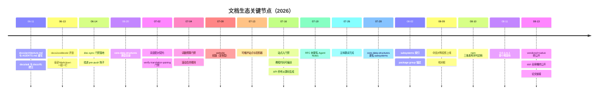
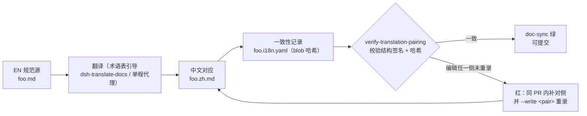
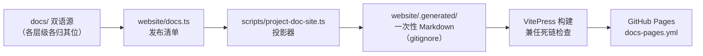
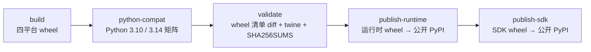
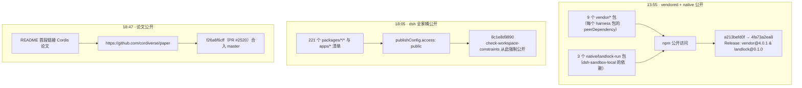

## 文档、示例与发布

### 总览

DeepSeek Harness 把"文档即产品"做成了三条相互咬合的机制，分别对应仓库里的三块地盘：

- **`docs/` 是分层的双语知识库**——英文为生成与事实的权威、中文为等权的对应翻译，二者由 `verify-translation-pairing` 等近三十个 `doc-sync` 门禁在提交时机械校验。
- **`website/` 不复制文档**——用 VitePress 把选定的 `docs/` 源投射成站点，任何漂移都由投影器与构建门禁兜底。
- **`examples/` 把"示例即测试"制度化**——每个可运行 `cordis.yml` 都有无密钥的 Loader 冒烟与有密钥的 e2e。

这一体系在 8 月中旬收口为公开发布：`@deepseek-ai/dsh` 全家桶于 2026-08-13 转为 npm 公开访问，README 同日挂上 Cordis 论文《A Programming Paradigm for Spatiotemporal Composability》的链接。

从提交规模看，文档是这个仓库最重要的"第二产品线"：docs-prefixed 提交共 1513 个，占全部 12293 个提交的约 12%，其中约一半（755 个）由 Tianyi Cui 提交。

#### 关键规模数字

| 指标 | 数值 | 说明 |
|---|---|---|
| `docs/` 子目录 | 7 | cookbook、cordis-api、cordis-tutorial、i18n、postmortem、subsystems、user |
| `docs/` Markdown 总数 | 215 | 实测，含根层 37 个 |
| `docs/` 双语对 | 105 | 105 个 `.zh.md` + 105 个 `.i18n.yaml`（实测）|
| 全仓库双语三元组 | 1078 | 排除 vendor/ 与 node_modules/ 后实测 |
| doc-sync 叶子门禁 | 28 | `scripts/run-gates.ts` 的 `docSyncLeafGates` |
| website 投影记录 | 166 | 每 locale 83 页 × 2（推算自 `website/docs.ts`）|
| examples 可运行叶子 | 6 | acp-agent、headless-agent、jsonrpc-agent、mcp-memory、web-cordis、web-schedule |
| docs-prefixed 提交 | 1513 | 占 12293 个提交的约 12% |
| 其中 Tianyi Cui | 755 | 约占一半 |

#### 关键节点时间线



#### 三阶段分期

把 06-10 到 08-13 的文档生态史放进三阶段看，节奏非常清晰：

| 阶段 | 时间 | 主题 | 代表事件 |
|---|---|---|---|
| 建立期 | 06-10 → 06-30 | 起步与门禁 | architecture/adr/rfc/cookbook 开张；doc-sync 落地；core-data-structures 目录 |
| 制度化期 | 07-01 → 07-31 | 双语、站点、标准 | 07-02 双语契约；07-04 预算；07-09/07-13 站点转身；07-16 入门禁；07-19 notes 更名；07-28 subsystems 更名 |
| 收口期 | 08-01 → 08-13 | 校对、公开、论文 | 08-04/08-09 校对轮；08-10 发布序列定稿；08-11 首发；08-13 三级公开 + 论文 |

三个阶段各约三到四周，递进关系一目了然：先把内容立起来（建立期），再把内容制度化（制度化期），最后把制度化的结果推向公众（收口期）。docs-prefixed 提交的 1513 个数字横跨整个窗口，但密度随阶段上升——收口期（08-10 → 08-13）的文档提交几乎每天都有 README 与 i18n 的落点。

#### 三条机制的咬合方式

`docs/` 双语知识库
: 分层（AGENTS 指令 → architecture 地图 → subsystems 参考 → cookbook how-to → user 指南），英文为事实权威、中文为等权对应，近三十个 `doc-sync` 门禁机械校验配对、结构、预算与链接。

`website/` 投影站点
: `website/docs.ts` 发布清单 + `scripts/project-doc-site.ts` 投影器 + VitePress 构建；站点只保留配置与清单，Markdown 全部留在 `docs/` 各自的层级里，禁止任何复制型文档树。

`examples/` 示例即测试
: 六个可运行 `cordis.yml` 叶子；每个叶子都有无密钥 Loader 冒烟与有密钥 e2e 两类冒烟，直接针对 postmortem 0001 的 ACP 默认导出丢失事故。

> [!NOTE]
> **双语是"等权配对"而非"翻译副本"**：`foo.md` 与 `foo.zh.md` 平起平坐，任何一侧都可以是作者侧；约束二者的是"必须说同一件事"与机械校验的结构签名，而不是谁先谁后。这条契约从 07-03 的"等权配对"提交起就是仓库文档的地基。

#### 三条机制的落地检查点

| 机制 | 核心文件 | 机械保障 |
|---|---|---|
| 双语知识库 | docs/ 分层树（215 md）| 28 个 doc-sync 叶子门禁：配对、预算、链接、代码块编译、生成目录新鲜度 |
| 投影站点 | website/docs.ts + scripts/project-doc-site.ts | docs-site-projection / docs-site-build 门禁 + 构建兼任死链检查 |
| 示例即测试 | examples/<agent>/cordis.yml（6 叶子）| 无密钥 Loader 冒烟 + 有密钥 e2e（vitest e2e 与 snapshot 配置）|

#### 本章阅读地图

本章按仓库的三块文档地盘与一条发布线展开：

- **docs/ 体系**
  - 起步（06-11 → 06-14）与 doc-sync 门禁家族
  - 参考层两次重组与 subsystems 页全表
  - 目录全景（实测）与 docs/AGENTS.md 文档标准
- **i18n 双语策略**
  - 三元组配对机制与 blob 哈希指纹
  - 滚动规则、翻译收尾与覆盖数据
- **website 站点**
  - 从复制到投影的两次转身
  - docs.ts 清单结构与站点演进时间线
- **examples 示例体系**
  - 六个示例叶子全表
  - "示例即测试"双类冒烟机制
- **python/ 与 native/**
  - 两个 Python 发行物与 wheel 平台表
  - Landlock 源记录子树
- **README / CONTRIBUTING 演进**
  - README 从两段简介到产品入口
- **公开发布与论文**
  - 三级公开流程图与发布序列表
- **发布时间线**
  - 0.0.1-rc.1 → 0.1.0-rc.5 全表与相邻间隔分析

---

### docs/ 体系：从 cookbook 到 subsystems 到 doc-sync 门禁

#### 起步：architecture、ADR/RFC 与 cookbook（06-11 → 06-14）

文档体系起步于 2026-06-11，与架构本身几乎同步。

`cacfae3cae` "Document the architecture and rewrite AGENTS.md" 写出 320 行的 `docs/architecture.md`，覆盖分层、服务图、事件分类、session/turn/step 生命周期、Cordis waterfall 语义与扩展 cookbook——这份文件至今仍是"改 `packages/` 前必读"的有序地图。

同日的 `9b8fccc6f9` "Backfill architecture decision records" 与 `4dafad4db6` "Add RFCs for the remaining quality-proposal ideas" 分别建立 `docs/adr` 与 `docs/rfc`（RFC 001–012）两条决策记录树。

06-18 的 `7c400e9c02` "docs: unify ADR/RFC trees into one lifecycle-organized RFC tree" 把两者合并成一个按生命周期组织的 RFC 树；07-19 的 `e8eddc7ef8` "Rename RFCs to Agent Notes" 再把整个树迁入 `.agents/notes/`，从此决策记录与文档知识库分家。

教程层在 06-13 开张：`e98c1c5d42` "Add examples/coding-agent and the docs cookbook" 开了 `docs/cookbook/`；同日的 `066f94c7e0` 把全部 Markdown 重排为"一段一行"（今天由 `verify-md-wrap` 门禁守护）；`39b3db4b9c` "accuracy sweep, architecture restructure, two ADRs, review skill" 做了第一轮准确性清扫。

起步期三天的产物定型了今天 docs/ 的骨架：地图（architecture）、决策记录（后迁 notes）、教程（cookbook）、格式纪律（一段一行）。

##### 起步期提交明细（06-11 → 06-14）

| 日期 | 提交 | 提交信息 | 产物 |
|---|---|---|---|
| 06-11 | `cacfae3cae` | Document the architecture and rewrite AGENTS.md | 320 行 docs/architecture.md |
| 06-11 | `9b8fccc6f9` | Backfill architecture decision records | docs/adr |
| 06-11 | `4dafad4db6` | Add RFCs for the remaining quality-proposal ideas | docs/rfc（RFC 001–012）|
| 06-13 | `e98c1c5d42` | Add examples/coding-agent and the docs cookbook | docs/cookbook/ + coding-agent |
| 06-13 | `066f94c7e0` | （重排全部 Markdown 为一段一行；提交信息原文（待考））| 全库排版纪律，后由 verify-md-wrap 守护 |
| 06-13 | `39b3db4b9c` | accuracy sweep, architecture restructure, two ADRs, review skill | 第一轮准确性清扫 |
| 06-14 | `6a528be569` | build: doc-sync gates — typecheck doc code blocks + verify event taxonomy (RFC 006 pts 1-2) | 首个 doc-sync 门禁 |
| 06-14 | `fa7d1df6f2` | build: run doc-sync gates in the local pre-push hook too | lefthook pre-push 钩子 |

06-14 的门禁先于 07-02 的双语配对与 07-04 的预算门禁，说明"文档必须机械可验证"的纪律在双语制度落地前就已经成立。

#### 门禁：doc-sync 从 06-14 落地并持续扩张

门禁在 06-14 落地：`6a528be569` "build: doc-sync gates — typecheck doc code blocks + verify event taxonomy (RFC 006 pts 1-2)" 让 CI 编译文档里的每个 ts 代码块，并核对架构文档的事件分类表。

`fa7d1df6f2` "build: run doc-sync gates in the local pre-push hook too" 把同一脚本挂进 lefthook pre-push，让文档门禁在推送到 CI 之前就在本地跑一遍。

此后门禁按需扩张：07-02 双语配对、07-04 词数预算、07-16 站点构建、07-30 第三方声明生成。

今天的 `scripts/run-gates.ts` 中 `docSyncLeafGates` 列出 28 个叶子门禁，覆盖 doc-typecheck、三张生成目录（tool/config/persistence-catalog）、markdown-wrap/markdown-links、type-equivalence、doc-budgets、translation-pairing、docs-site-build 等（已对照源码逐一核对）。

##### doc-sync 叶子门禁全表（28 项）

| 门禁 | 脚本 | 作用 | 引入 |
|---|---|---|---|
| doc-typecheck | `doc-typecheck` | 编译文档内每个 fenced ts 代码块 | 06-14 `6a528be569` |
| cordis-catalog | `verify-cordis-catalog` | 生成 Cordis API 目录并检查新鲜度 | （待考）|
| client-catalog | `verify-client-catalog` | 生成客户端目录并检查新鲜度 | （待考）|
| export-jsdoc | `verify-export-jsdoc` | 强制导出函数式 API 的 JSDoc `@param`/`@returns` | （待考）|
| tool-catalog | `verify-tool-catalog` | 工具目录与真实工具面一致 | （待考）|
| config-catalog | `verify-config-catalog` | 配置目录与真实 Config 面一致 | （待考）|
| persistence-catalog | `verify-persistence-catalog` | 持久化事件目录与真实事件一致 | （待考）|
| doc-graphs | `verify-doc-graphs` | 文档图谱（gen-doc-graphs）新鲜度 | （待考）|
| scoped-events | `verify-scoped-events` | 作用域事件目录新鲜度 | （待考）|
| markdown-wrap | `verify-md-wrap` | 一段一行（单物理行段落）| 06-13 `066f94c7e0` 重排后（门禁提交待考）|
| markdown-links | `verify-md-links` | Markdown 链接目标与 `#fragment` 锚点有效 | 06-18（Agent Note `2026-06-18-markdown-cross-link-lint` 佐证）|
| public-repository-links | `verify-public-repository-links` | 公开仓库链接检查 | （待考）|
| doc-refs | `verify-doc-refs` | TypeScript 注释中的 `docs/*.md` 引用有效 | （待考）|
| package-paths | `verify-package-paths` | 文档中 package 路径规范 | （待考）|
| config-source-ownership | `verify-config-source-ownership` | 配置字段归属源码检查 | （待考）|
| package-readme-model-experience | `verify-package-readme-model-experience` | 包 README 的模型体验面检查 | （待考）|
| mermaid | `verify-mermaid` | 全部 mermaid 图语法校验 | （待考）|
| agent-note-classification | `verify-agent-note-classification` | Agent Note 分类（implemented/process/…）合法 | （待考）|
| agent-note-format | `verify-agent-note-format` | Agent Note 头块与生命周期骨架 | （待考）|
| archived-agent-notes | `verify-archived-agent-notes` | 冻结归档三元组完整与封印 | （待考）|
| type-equivalence | `verify-type-equiv` | subsystems 页粘贴类型与源码漂移检查 | （待考，subsystems 页 07-30 起）|
| skill-invocation-metadata | `verify-skill-invocation-metadata` | 技能调用元数据检查 | （待考）|
| translation-prompt | `verify-translation-prompt` | 翻译提示模板双方向渲染与示例 | （待考）|
| translation-pairing | `verify-translation-pairing` | 双语三元组哈希与结构签名 | 07-02 `4d89bb3e74` |
| doc-budgets | `verify-doc-budgets` | 词数预算与清单 | 07-04 `aa36b3b36b` |
| docs-site-projection | 投影器 spec + 片段 spec | `project-doc-site.spec.ts` 与 `verify-doc-site-fragments.spec.ts` | 07-16 `6ce9f16030` |
| docs-site-build | `docs:build` | VitePress 构建兼任死链检查 | 07-16 `6ce9f16030` |
| package-readme-limitations | `verify-package-readme-limitations` | 包 README 局限性声明检查 | （待考）|

##### 门禁家族分组（按守护对象）

28 个叶子门禁按守护对象分十个家族：

| 家族 | 门禁 | 守护什么 |
|---|---|---|
| 编译族 | doc-typecheck | 文档内 fenced ts 代码块可编译、粘贴类型块与源码一致 |
| 生成目录族 | cordis-catalog、client-catalog、tool-catalog、config-catalog、persistence-catalog、doc-graphs、scoped-events | 生成目录/图与真实源码新鲜度一致，禁止手编 |
| 链接族 | markdown-wrap、markdown-links、public-repository-links、doc-refs | 一段一行、链接目标与锚点有效、公开仓库链接、TS 注释中的 docs 引用 |
| 包面族 | package-paths、config-source-ownership、package-readme-model-experience、package-readme-limitations | 包路径、配置归属、README 的模型体验与局限性声明 |
| Agent Note 族 | agent-note-classification、agent-note-format、archived-agent-notes | 分类合法、头块与生命周期骨架、归档三元组封印 |
| 配对族 | translation-pairing、translation-prompt | 双语三元组一致性、翻译提示模板双方向渲染 |
| 预算族 | doc-budgets | 词数预算与清单 manifest |
| 站点族 | docs-site-projection、docs-site-build | 投影器输出正确、构建成功且无死链 |
| 类型族 | type-equivalence、export-jsdoc | 粘贴类型等价、导出函数式 API 的 JSDoc |
| 结构族 | mermaid、skill-invocation-metadata | 图语法、技能调用元数据 |

这十族覆盖了文档可能漂移的每一个方向：代码块过时、目录失新、链接断裂、双语失配、预算超支、站点失真、Agent Note 格式失范——"文档即产品"的机械保障就建立在这张网上。

仓库维护的 doc-sync 门禁清单（`.analysis/doc-sync-gates.txt`）共 38 项：除上表 28 个叶子门禁外，还串上 module-graph、runtime-closure、cordis-config、client-domain-graph 等文档面脚本，以及 typecheck、lint、knip、build、publint、node-next-types 等编译与静态检查依赖；`docs-site-projection` 与 `docs-site-build` 两个站点门禁由 run-gates 单独接线，`docs:build` 同时兼任全站死链检查。

##### doc-sync 门禁演进时间线

| 日期 | 事件 | 提交 / 依据 |
|---|---|---|
| 06-14 | doc-typecheck + 事件分类核对入门禁 | `6a528be569` |
| 06-14 | 门禁挂进 lefthook pre-push | `fa7d1df6f2` |
| 06-18 | markdown-links 交叉链接 lint 落地 | Agent Note `2026-06-18-markdown-cross-link-lint` 佐证 |
| 07-02 | 双语配对门禁 | `4d89bb3e74` |
| 07-04 | 词数预算门禁 | `aa36b3b36b` |
| 07-16 | 站点投影 + 构建门禁 | `6ce9f16030` |
| 07-30 | 第三方声明生成 | 原文记载（具体提交待考）|
| 08-03 | subsystems 页锚定 package group | Agent Note `2026-08-03-package-anchored-subsystem-pages` |
| 08-08 | 自动配对合并 merge driver | Agent Note `2026-08-08-automatic-translation-pairing-merges` |

门禁家族随时间"按需扩张"而非一次性设计：每一次新机制（双语、预算、站点、生成目录）都带着自己的门禁入列，28 个叶子门禁是 06-14 到 08 月上旬累积的结果。

#### 参考层：从扁平目录到 subsystems 页

参考层在 6–8 月完成两次重组。

06-20 的 `0f7abc9808` "docs(core-data-structures): catalog the core data structures" 建了类型目录；07-28 的 `ba3125234a` "docs: rename core-data-structures/ to subsystems/" 把它改名 `subsystems/`。

07-30 的 `f7323354bb` "generate each subsystem's cordis surface into its own page; delete the flat catalogs" 是第二次重组的关键：让每页自带 Typert 生成的 Cordis API 区域，并删除扁平目录。

08-02 的 `2886ba45db` 与 `aa0ca6c836` 再给它 README 索引、并把每页锚定到所属 package group。

结果是今天的形态：`subsystems/` 共 92 个 md（46 个英文页 + 46 个中文页），其中 45 页各讲一个子系统、`README.md` 是索引，每页结构统一为"是什么 + 移动的数据结构 + 生成的 Cordis API 区域"。

> [!TIP]
> **subsystems 页的 Cordis API 区域是生成物，不是手写内容**：`gen-cordis-api` 从源码生成，`verify-cordis-catalog` 检查新鲜度；改类型要改源码，页面区域随生成器刷新，手编会被门禁挡下。同样的"生成目录不可手编"纪律适用于 tool/config/persistence 三张目录与 module-graph。

##### subsystems 页全表（46 页）

页面能力摘录自 `docs/subsystems/README.md` 的 Owns 列（压缩转述）：

| 页面 | 覆盖能力 |
|---|---|
| README | 索引与组织说明；各页锚定所属 package group 的导读 |
| core | `packages/core` 控制 agent 循环：逐包循环描述、AgentHandle 创建与所有权、投递/取消/拦截契约、全仓类型模式（`…Map → derived-union`、branded id）|
| llm-streaming | `packages/llm` 对话类型：Message/ContentBlock、组装后的模型请求、StreamChunk 线上协议与适配器契约、BlockAssembler、LlmAdapter 提供者契约 |
| token-meter | 不可变标量与位置回放计量，含 consumed-log 修订 |
| scope | 作用域注册身份、派发载体、owned Scope 上下文 |
| typert | 远程调用描述符、lookup/Context 声明、Typert 注册表、Host Gateway/Client API 边界 |
| goal | 持久化目标身份、生命周期快照、激活、变更记录与轮次归属 |
| schedule | 会话级提醒记录、持久化迁移、活动视图、普通会话投递 |
| commands | 人类命令注册服务：定义、适配器发现、直接调用、结果与解析视图 |
| session | SessionEventMap 变体目录、TurnTrigger/TurnEndReason、deriveMessages()、执行围栏与独立事件 |
| persistence | 持久化能力缝：SessionPersistence、JSONL+SQLite 后端、session/flush、崩溃恢复、SessionHeader |
| settings | 用户设置能力缝：SettingsNamespace 注册、分层解析（默认 → composition base → 用户文档）、owner 作用域、热提交 |
| credentials | 凭据能力缝：配置中的 CredentialRef 引用（非值）、按操作解析、UI 安全 CredentialInfo、提供者源层 |
| session-query | 逻辑记录、有界精确事件读取、关系追踪、语义过滤/文档与全文结果分页 |
| feedback | 生命周期绑定逐消息反馈记录、乐观版本、边车持久化与 Host Remote 契约 |
| session-title | 持久化标题快照、引用源消息 seq、异步提供者契约 |
| session-reference | 结构化跨会话引用：SessionReferenceInput/Candidate、准备好的消息上下文、稳定错误分类 |
| system-prompt | 按装配上下文、工具提供者结果、提示词分节与协作式组装 |
| tools | ToolDefinition 全字段、schema DSL、ToolExecution/ToolResult、工具展示 UI 类型、受守卫的执行流水线 |
| user-questions | UI 支撑的人类问答能力缝：AskUserQuestionRequest、答案/选项词汇、提供者 API、错误分类 |
| approval | 一次性用户审批能力缝：ApprovalRequest、ApprovalOutcome、按会话策略、审计事件与回答者契约 |
| attachment | 持久化图像身份与元数据、校验输入、验证读取、AttachmentStore 能力缝 |
| shell | bash 执行器能力缝：ShellExecRequest/Spec、ShellRunResult、后台 ShellProcess 句柄 |
| subprocess | 子进程能力缝：全显式 SubprocessSpawnSpec、偏移输出读取器、未分类 SubprocessOutcome、DSH_* 环境词汇 |
| terminal | 持久终端 id、后端/会话契约、发送就绪、有界读取、owner 可见快照 |
| sandbox | 按会话策略解析与进程围栏能力缝：文件效应模式、执行/提供者策略、ConfinedArgv、强制与 fail-closed 错误 |
| code-runtime | 代码执行能力缝：CodeRunRequest/Result、绑定命名空间、捕获日志、CodeRunFailure 分类 |
| extensions | 版本化动态 Cordis 插件与包、Host/Client 激活、审批、运行时检查与生命周期拆除 |
| filesystem | 文件系统能力缝：FsTarget、读/写/编辑结果、观察文件状态、FsErrorCode |
| lsp | LSP 导航能力缝：LspQueryRequest/Result、LspProvider/Service、四类操作、LspError |
| skills | 技能服务：发现优先级、SkillSummary/SkillDefinition、会话前缀目录、模型侧 skill 加载 |
| compaction | 压缩能力缝：compaction/* 会话事件、CompactionResult、CompactionEngine 接口 |
| subagent | 子代理能力缝：命名提供者注册表、SubagentStartRequest/Result/Run、启动时 vs 运行时能力拆分 |
| web | Web 访问能力缝：WebSearchRequest/Result、WebFetchRequest/Result、WebFetchBody、提供者可用性、WebError |
| spill | spill 存储能力缝：SaveTextSpill、SpillOwner/SpillSource、SpillRef、branded SpillLocator |
| workflow | 工作流能力缝：WorkflowStartRequest、WorkflowMeta、WorkflowRun/Result、workflow/* 事件载荷、WorkflowError 致命性 |
| jobs | 后台任务运行时：branded JobId、生产者契约、消费者视图、ctx.jobs 服务行为 |
| permission-presets | 权限预设层：PresetSpec/PresetOption、派生的 custom 状态、只记录 permission/preset 事件 |
| plan | 计划模式：只记录 plan/mode 状态、待选刷新、PlanModeConfig、exit_plan_mode 评审弧 |
| invariants | 运行时不变式注册表：选择 Config、InvariantInstaller/InvariantFailure、空伴契约 |
| web-server | HTTP 载体：WebRouteKind/WebRoute、匹配顺序、可认领 fallback 席位、索引 tap |
| storage | 存储子系统：后端契约 StorageBackend、StorageForms、DomainSpec/Domain、domain/changed |
| workspace | 工作区注册表：Workspace/WorkspaceId、注册与解析、会话 cwd 关系 |
| client-modules | web 插件表：dsh.client 声明、WebBootGraph 线上组合、bundle 路由与索引 tap |
| session-projection | 投影能力缝：SessionProjectionMap、纯 ProjectionDefinition 单元、ProjectionSnapshot 一致切面、变更馈送 |
| session-telemetry | 出站会话上报能力缝：SessionTelemetryRecord/Severity、SessionTelemetrySink 契约、session-telemetry/record 脱敏瀑布 |

页面上粘贴的类型声明与其 JSDoc 由 `verify-type-equiv` 做源等价检查：普通块保留完整声明，`public-api` 块保留剥离方法体的公开类声明；Cordis 服务与事件则走每页的生成 Cordis API 区域。

#### 目录全景（实测 2026-08-13）

`docs/` 七个子目录 + 根层共 215 个 md（实测），双语配对情况与子目录分工如下：

| 位置 | md 数 | 双语对 | 内容定位 |
|---|---|---|---|
| docs/ 根层 | 37 | 18 对 + AGENTS.md（单语）| 地图、开发、测试、生成参考、概念 |
| cookbook/ | 16 | 8 | 分步 how-to：加 package/tool/LLM adapter/对话节点、扩展模式 |
| cordis-api/ | 11 | 5 对 + inherited.md（单语）| Cordis 核心 API 参考：context/events/fiber/registry/service + 继承面 |
| cordis-tutorial/ | 16 | 8 | 七课时 Cordis 手把手教程（index + 01–07）|
| i18n/ | 7 | 2 对 + 3 单语 | 双语契约文档：README、translation-rules、terminology、style-samples、translation-prompt |
| postmortem/ | 10 | 5 | 事故复盘：README 索引 + 编号复盘（0001 为 ACP 默认导出事故）|
| subsystems/ | 92 | 46 | 每子系统一页参考 + README 索引（45 页 + README）|
| user/ | 26 | 13 | 产品向指南（首页、guide、develop），由网站发布 |

一致性校验：各子目录对数之和 = 18+8+5+8+2+5+46+13 = 105，与实测的 105 个 `.zh.md` 完全吻合；215 = 105 对 × 2 + 5 个单语文件（AGENTS.md、cordis-api/inherited.md、i18n 的 terminology/style-samples/translation-prompt 三份天然双语或机器消费文件）。

根层 18 对文件按职能分五类：

- 有序地图与行为：architecture、agent-lifecycle、tool-execution-pipeline、event-producer-consumer、capability-seams
- 开发与质量：development、testing、defensive-patterns、rescope（vendored 重命名映射）
- 概念与术语：cordis-primer、glossary、api-gateway（远程 BFF 网关）
- 生成参考：config-catalog、tool-catalog、persistence-catalog、module-graph、graph-atlas
- 站点样式：web-styling

`docs/AGENTS.md` 是唯一的单语指令文件（与根 AGENTS.md 一致，仅英文维护），它本身就是"文档标准"。

##### 子目录细节（清单来自 website/docs.ts 与目录实测）

cookbook/ 共 8 对，其中 5 页被网站投影（docs.ts 实载；其余 3 对内容（待考））：

| 页面 | 内容 |
|---|---|
| adding-a-package | 新增 Package 的分步指南 |
| adding-a-tool | 新增 Tool 的分步指南 |
| adding-an-llm-adapter | 新增 LLM Adapter 的分步指南 |
| extension-cookbook | 扩展模式 |
| adding-a-conversation-node | 新增 Conversation Node |

cordis-tutorial/ 七课时（docs.ts 实载标题）：

| 课时 | 文件 | 标题（中文 / 英文）|
|---|---|---|
| 总览 | index.md | 总览 / Overview |
| 1 | 01-first-plugin.md | 第一个插件 / Your first plugin |
| 2 | 02-lifecycle-and-effects.md | 生命周期与副作用 / Lifecycle and effects |
| 3 | 03-services.md | 服务 / Services |
| 4 | 04-events.md | 事件 / Events |
| 5 | 05-config.md | 配置 / Configuration |
| 6 | 06-composition-and-hmr.md | 组合与热重载 / Composition and HMR |
| 7 | 07-into-the-harness.md | 进入 Harness / Into the harness |

user/ 产品向指南（docs.ts 实载 13 页）：

| 分组 | 页面 |
|---|---|
| 首页 | index（DeepSeek Harness 首页）|
| 入门 | guide/index（使用 Web UI 快速入门）、guide/providers（配置模型）、guide/python-sdk（Python）|
| 基础 | develop/basic/{index, tool, config, publish}：第一个插件、开发 Tool、插件配置、打包与安装 |
| 框架能力 | develop/framework/{index, service, events}：插件与生命周期、服务与依赖、事件系统 |
| 实战 | develop/practice/{index, llm-adapter}：能力的三层拆分、LLM 适配器 |

cordis-api/（docs.ts 实载 6 页）：

| 页面 | 内容 |
|---|---|
| context.md | Context |
| events.md | Events |
| fiber.md | Fiber |
| registry.md | Plugin Registry |
| service.md | Service |
| inherited.md | 继承接口面（单语镜像，双 locale 投影英文源）|

postmortem/ 共 5 对：README 索引 + 编号复盘；已知 0001 为 ACP 默认导出丢失事故（examples/AGENTS.md 与 testing 文档引用），其余编号的完整清单与日期（待考）。

##### cookbook 与 user 的分工

`docs/AGENTS.md` 的层级分类对这两个教程向目录做了明确分工：

- **cookbook/** 是贡献者内部的分步 how-to（加 package、加 tool、加 LLM adapter、加 conversation node、扩展模式），每篇带编号验证步骤，设计理由链接到各自 Agent Note——读者是仓库开发者。
- **user/** 是产品向指南（首页、Web UI 快速入门、配置模型、插件开发三阶、Cordis 教程），由文档网站发布——读者是外部使用者。

判断一篇新教程放哪里的口诀：给"在这个仓库里干活的人"看 → cookbook；给"用这个产品的人"看 → user/。两者都归 tutorial 形态，但前置知识与读者起点完全不同。

##### doc-sync 在 CI 与本地的工作分工

`doc-sync` 是 pnpm 根脚本（`tsx scripts/run-gates.ts doc-sync`），贡献者本地跑文档变更、CI 全量跑（i18n README 原话："contributors run locally for documentation changes and CI runs exhaustively"）。本地的价值是秒级反馈——改了一对翻译就只验那一对；CI 的价值是穷尽——每个 PR 的每个门禁全量过一遍，谁也不能漏。

#### docs/AGENTS.md：文档标准本身

07-04 的 `aa36b3b36b` "feat(doc-standards): documentation tiers, budgets, and the ceiling gate" 定下文档标准（层级分类、词数预算、slop 清单），`docs/AGENTS.md` 成为这份标准本身，配套技能 `dsh-doc-standards` 与 `dsh-prose-standard` 承载执行细则。

标准的核心是"一事实一归属"的层级分类（tier taxonomy）：

- **根 AGENTS.md**：常驻指令，每条一到三行并链接归属地；不承载故事、示例与流程。
- **子树 AGENTS.md**（packages/examples/docs/notes）：该子树的专属指令；不重复仓库级规则。
- **architecture.md**：有序地图——组合、核心包、循环、能力缝、扩展点；改 `packages/` 前必读。
- **subsystems/**：每子系统一页的类型定义、语义与生成 Cordis API；不写行为叙述。
- **Agent Notes**：活动决策记录（为什么、放弃了什么、怎么验证）；implemented/ 用现在时写已落地事实。
- **postmortem/**：事故故事——唯一允许"战争叙事"的层级。
- **cookbook/**：带编号验证步骤的分步教程；设计理由链接到 Agent Note。
- **user/**：产品向指南，由文档网站发布。
- **包 README**：每包契约——配置、语义、局限、扩展点、模型体验。
- **生成参考**（subsystems 的 cordis-surface 区域、cordis-api、tool/config/persistence-catalog、module-graph）：从源码再生、新鲜度门禁守护；中文对等走配对流程，生成英文源不可手编。

写作规则要点（节选自 docs/AGENTS.md）：

- 写当前状态，不写变更史：避免 "previously/now/no longer"、PR、提交与栈位；变更故事进提交、PR、Agent Note 或 postmortem。
- 每个非平凡变更必须在同一 PR 内带至少一个 Agent Note；纯机械/局部修改豁免。
- 一段一行（`verify-md-wrap`）；编辑器软换行，物理行即段落。
- fenced `ts` 块必须可编译（`doc-typecheck`）；粘贴的完整类型声明用 `ts type-equiv`、剥离方法体的公开类用 `ts public-api`，并注册进清单防漂移。
- 重塑已文档化类型时，所属 subsystems 页必须同变更更新；`verify-type-equiv` 抓已粘贴类型的漂移。
- 双语对同变更更新：术语表引导、单程主动代理工作、保留未动正文、重录哈希；`dsh-translate-docs` 仅显式调用。
- 注释与 JSDoc 写完整契约而非推理记录：保留行为、失败、时序、所有权、异常与后果；删叙述、测试走读与代码复述。
- 直写：点名行为者与已记录事实；`seam` 只用于定义过的能力缝；指名具体检查、类型、API 或行为，不用隐喻词。

词数预算是硬门禁（`verify-doc-budgets`，清单在 `scripts/doc-budgets.manifest.json`）：

| 文档 | 词数上限 |
|---|---|
| 根 AGENTS.md | 1600 |
| architecture.md | 1800 |
| 子树 AGENTS.md | 600（packages/AGENTS.md 650、docs/AGENTS.md 1250）|
| packages/README.md | 600 |

门禁变红按 relocate-condense-raise 顺序处理：先搬走到更高层级（留一行链接）、再压缩、最后才提高上限并解释 manifest 差异；上限是护栏不是压缩目标，低于目标保留至少 5% 余量。

slop 清单（禁项，逐条可 grep）：同规则多归属、叙述历史（previously/now/renamed/PR/提交）、实现状态标注（"implemented!"）、手抄目录/JSDoc/测试清单、推理记录（分步实现叙述、明显分支证明、测试走读）、同语义重复复述、段落墙、强调通胀、implemented/ Agent Note 里的 spec 语（should/迁移计划/验收清单）。

交叉引用一律用相对 Markdown 路径而非裸文件名或编号，`verify-md-links` 拒绝缺失目标与失效 `#fragment` 锚点。

##### 层级归属速查

- 缺陷 → postmortems；理由 → Agent Notes；流程 → cookbooks；类型定义 → subsystems；包契约 → READMEs；常驻指令 → 根 AGENTS.md（附理由链接）。
- 作者顺序（标准规定的落笔次序）：
  1. 定位文档在树中的位置；
  2. 设定允许的细节层级；
  3. 判定 tutorial 还是 reference；
  4. 教程按前置条件与难度排序概念；
  5. 搬走归属下层的细节，用链接替换下层解释。

---

### i18n 双语策略

#### 契约确立：从配对到等权（07-02 → 07-03）

双语制度在 07-02 确立：`4d89bb3e74` "docs: bilingual docs contract, translation skill, and pairing gate"（Ziya）建立 EN→ZH 配对契约——兄弟文件 `foo.md`/`foo.zh.md` 加一致性记录 `foo.i18n.yaml`，英文为规范、中文为等权对应，用 blob 哈希指纹做新鲜度校验，配套 `dsh-translate-docs` 技能与 `verify-translation-pairing` 门禁，并顺手翻译了 `README.zh.md` 与两篇 i18n 文档做 dogfood。

07-03 的一串提交把它打磨成"等权配对"：`ec05295a0c` "equal-authority pairing with sidecar consistency records"、`a899226397` "harden pairing gate per review — structural signature, not counts"、`50a32cdcb1` 扩展术语表。

"等权"是这一契约的灵魂：任何一侧都可以是作者侧（中文先写的 Agent Note 与英文先写的一样合法），对侧从它翻译；没有谁高于谁，绑定二者的是"必须说同一件事"。

#### 三元组与 blob 哈希指纹机制

一份配对文档是三个兄弟文件，同目录存放，没有 locale 目录、没有独立翻译仓库、没有中英夹杂文件：

- `foo.md`——英文规范源（或中文作者侧）；
- `foo.zh.md`——中文对应；
- `foo.i18n.yaml`——一致性记录。

`foo.i18n.yaml` 保存两侧最后一次确认一致的完整 git blob 哈希：

```yaml
foo.md: 3f786850e387550fdab836ed7e6dc881de23001b
foo.zh.md: 89e6c98d92887913cadf06b2adb97f26cde4849b
```

关键设计是 **blob 哈希而非 commit 哈希**：记录对同一 PR 内被编辑的文件也可计算（`git hash-object foo.md`），一致性是纯内容比较。

`--write` 在记录前把快照存进本地 Git 对象库，并在内容寻址的 `refs/dsh/translation-pairing/snapshots/` ref 下钉住每个不同 blob，防止 GC 失效恢复指针——记录到的哈希能还原任一侧最后一次确认的文本。

因此修复失同步的一对时，是按编辑侧的 diff 最小化修补对侧，**绝不整篇重译**；日常由代理直接单程修补，显式调用扩展工作流时可用 `gen-translation-brief` 按最窄安全粒度组装更新，`--apply` 可做结构校验后的仅代码围栏拼接。

合并时由安装的 `dsh-translation-pairing` Git merge driver 自动合成新记录：仅当 Git 默认文本合并对两侧记录的 owner-blob 三元组都成功、且合并后的对保留必需切换器与结构签名时；其余情况保持普通冲突，`resolve-translation-pairing-conflicts` 用同样的 fail-closed 操作处理已停止的合并（机制见 Agent Note `2026-08-08-automatic-translation-pairing-merges`）。

语言切换器规则：中文文件在 H1 之后立即用 `[English](foo.md) | 中文` 回链；英文作者源对称回链，列在清单里的生成英文源省略该行以保持与生成器输出字节一致。

结构镜像规则：标题深度与顺序、列表种类、有序列表起点、列表项数、表格行列数、链接目标与逐字代码块逐一对应（`translation-rules.md` 规定全部保留规则）；既有 Markdown 门禁（`verify-md-wrap`、`verify-md-links`）原样作用于 `.zh.md`。

#### 翻译流程（mermaid flowchart）



`verify-translation-pairing`（doc-sync 成员，贡献者本地跑、CI 全量跑）机械执行三件事：

1. 范围内每份文档都有完整配对；README 按不区分大小写的 basename 发现（`missions/readme.md` 也在范围）。
2. 已存在的每个配对产物完整且一致：三文件齐全、两侧当前 blob 哈希等于记录值、中文侧与每个英文作者源带切换器（清单内生成英文源豁免）、结构签名按序一致（标题深度、逐字代码块、表格行列、列表种类与项数、除切换器外的每个链接目标）。
3. 列为 excluded 的文件完全没有 `.zh.md` 与 `.i18n.yaml`；`.agents/notes/archived/` 冻结树由专属 verifier 要求并封印完整既有三元组。

`--list` 打印全范围配对状态（missing/out-of-sync/ok）且永不失败；`<pair...>` 指定检查单对（三个文件中任一个或裸 stem 即可命名），更新循环秒级验证自己的对，但 PR 级的绿必须以无参全量形式为准。

##### 结构签名与术语表

`verify-translation-pairing` 校验的"结构签名"逐项对应（i18n README 实载）：

- 标题深度与顺序；
- 逐字代码块（info 字符串与内容字节一致）；
- 表格行数与列数；
- 列表种类、有序列表起点与列表项数；
- 除切换器外的每个链接目标。

任一项失配即红——签名不判断语义，语义正确性是评审者的半份契约。

`i18n/terminology.md` 是术语的词汇权威（source of truth）：日常对侧更新要求代理先加载术语表再单程改写，首用注解随文重定位、未动正文保持原样；`style-samples.md` 提供风格样例（天然双语），`translation-rules.md` 规定全部保留规则。

> [!IMPORTANT]
> **门禁的诚实上限**：绿灯只代表"这一对在这些确切内容上被确认一致"，不代表确认本身可靠——它检查哈希与 Markdown 结构，判断不了两侧是否真的说同一件事、措辞是否准确地道，那是评审者的半份契约。重录一对敷衍的对侧能过门禁，但不能过评审。

#### 滚动规则与翻译收尾

07-04 的 `f5774a2a26` "feat(i18n): new documents merge bilingual — the requiredSince date frontier" 把契约升级为滚动规则：文件名带日期的文档（如 RFC）凡在 2026-07-05 截止线之后必须成对合并，新文档不许再扩大翻译欠账；之前的 07-04 RFC 波次被祖父条款豁免。

07-26 完成主体翻译：`30db52fa4b` "docs: translate remaining non-README documentation" 与 `226dc7a249` "docs: translate remaining READMEs" 把 apps/cli、examples 等 README 与剩余正文全部补成双语。

08-04 与 08-09 进入校对轮：`2db712eec7` "docs(i18n): proofread active Chinese documentation"、`7ff0cbcb7e` "docs: complete Chinese proofreading and generated reference pairing"；08-12/08-13 又有多轮 README 人工润色（`7e4b8b1676` "human-polish key Chinese READMEs"、`952c6c3c9c` "finish README fidelity review"），`964b1dde52`（08-12）润色贡献指南措辞。

#### 双语覆盖数据（实测）

| 范围 | md 数 | .zh.md | .i18n.yaml | 说明 |
|---|---|---|---|---|
| docs/ 根层 | 37 | 36 | 18 | 18 对 + 单语 AGENTS.md |
| docs/ 全树 | 215 | 105 | 105 | 105 对 + 5 个单语文件 |
| 全仓库（排除 vendor/ 与 node_modules/）| — | 1078 | 1078 | 双语三元组总数 |

1078 的构成（推断，比例实测）：docs/ 内 105 对约占 9.7%，其余约 973 对来自全部非 vendor README（packages/*、examples、apps、python）、`.agents/notes/` 活动笔记与根 CONTRIBUTING——也就是说，仓库里"给人读的每一份 Markdown"几乎都在配对范围内，双语不是 docs/ 的特权而是全仓纪律。i18n README 的原始表述是"this repo's documentation is read by people and agents both inside and outside the company, so every document in scope is maintained in English and Simplified Chinese"——配对范围的设计动机是"内外都有人读"。

配对范围：根 CONTRIBUTING、所有非 vendor README、`.agents/notes/**`、`docs/**`、`python/**` 下的每份活动文档；README 匹配不区分大小写且覆盖未来目录，无需再改清单。

排除清单（永不配对，门禁拒绝为它们出现 `.zh.md` 或 `.i18n.yaml`）：

| 排除文件 | 理由 |
|---|---|
| cordis-api/inherited.md | 生成而无已评审中文对等，两个 locale 都投影英文源 |
| docs/AGENTS.md、notes/**/AGENTS.md 及其 CLAUDE.md 指令软链 | 代理指令，与根 AGENTS.md 一样仅英文维护 |
| i18n/terminology.md、i18n/style-samples.md | 天然双语 |
| i18n/translation-prompt.md | 自动流水线的提示模板，正文被机器逐字消费 |
| .agents/notes/archived/ | 冻结历史三元组，由 verify-archived-agent-notes 封印 |

生成英文参考与图谱在具备已评审中文对等时参与配对：生成器仍是英文事实源，新鲜度门禁与配对门禁各自独立执行；重新生成导致英文变化时，配对保持 out-of-sync 直到中文对等更新重录。生成英文源不带切换器（否则生成器变陈旧），其中文对等仍回链英文源，且只允许改写会让译文失真的自我指涉生成/维护语句。

分工：日常对侧由工作代理在加载术语表后一次单程直接更新，不调翻译技能、不生成简报、不跑独立翻译评审、不委托子代理；`dsh-translate-docs` 扩展工作流保留这些重机制仅供显式调用。`scripts/translation-prompt.ts` 把提交的模板（注入术语，自带校准规则）渲染成双向并解析三段式响应，`verify-translation-prompt` 在 doc-sync 中演练两个方向与示例。

##### 契约演进里程碑

| 日期 | 提交 | 事件 |
|---|---|---|
| 07-02 | `4d89bb3e74` | 双语契约 + 翻译技能 + 配对门禁（Ziya）|
| 07-03 | `ec05295a0c` | 等权配对 + 边车一致性记录 |
| 07-03 | `a899226397` | 门禁加固：结构签名而非计数 |
| 07-03 | `50a32cdcb1` | 术语表扩展 |
| 07-04 | `f5774a2a26` | 滚动规则：07-05 截止线后新文档必须成对合并 |
| 07-26 | `30db52fa4b` / `226dc7a249` | 主体翻译：非 README 正文 + 全部 README |
| 08-04 | `2db712eec7` | 校对活动中文档 |
| 08-09 | `7ff0cbcb7e` | 中文校对完成 + 生成参考配对 |
| 08-12/08-13 | `7e4b8b1676` / `952c6c3c9c` | README 人工润色 + 保真度评审 |

##### 校验命令形态

| 命令 | 行为 |
|---|---|
| `pnpm run verify-translation-pairing` | 全量校验（doc-sync 与 CI 所跑的形式）|
| `pnpm run verify-translation-pairing --list` | 打印全范围状态（missing / out-of-sync / ok），永不失败 |
| `pnpm run verify-translation-pairing <pair...>` | 只校验指定对（任一文件或裸 stem 命名）|
| `pnpm run verify-translation-pairing --write <pair>` | 重录两侧 blob 哈希（评审认可的确认动作）|
| `pnpm run resolve-translation-pairing-conflicts` | fail-closed 处理已停止合并的配对记录 |
| `pnpm run gen-translation-brief <pair>` | 按最窄安全粒度组装更新简报（扩展工作流）|

> "Pairs merge whole: a PR never lands one language without the other two files."——i18n 配对契约的原始表述：一个 PR 永远不会只落地一种语言而不带另外两个文件。这条规则把"双语"从愿望变成每次合并的机械事实。

---

### website 站点

#### 从复制到投影（07-09 → 07-13）

站点由 `87a1774fef` "feat: add docs website"（lintianle，07-09）引入，最初的形态是把设计论文、开发指南与 API 参考以中文 Markdown 树直接复制进 `website/zh-CN/`——复制型站点。

07-13 的 `d2f810e9fe` "feat(docs): build maintainable documentation site"（Yichen Jiang）改造成可维护形态：内容从 `website/zh-CN/` 移入 `docs/user/`，新增 `scripts/project-doc-site.ts` 投影器与配套 Agent Note，站点只保留配置与清单。

从此"站点投影、不复制"成为硬边界：07-22 的 `e844125d7d` "docs: enforce canonical website projection" 把边界写进门禁，`website/AGENTS.md` 明文禁止任何复制型文档树（`website/zh-CN/`、`website/en/`、`website/api/` 一律不许出现）。

投影而不是复制的根本理由是**单一事实源**：如果站点里有一份复制的 `architecture.md`，那么文档作者改 docs/ 里的原稿时，站点副本要么默默变陈旧（读者看到旧架构），要么需要手工同步（每次变更都要记得两处都改）。投影器把"同步"变成构建步骤：`docs.ts` 清单说清楚"哪个源投到哪个路由"，`project-doc-site.ts` 每次构建时重新生成，任何漂移（源被移动、翻译缺失、路由改名）都会被 spec 或构建门禁当场抓住——复制型站点时代的"双份维护税"被一笔勾销。

07-13 的配套 Agent Note 与 07-22 的门禁共同留下了一条可审计的边界：`website/` 只允许 VitePress 配置、展示资产与发布清单，连 `website/AGENTS.md` 本身都是该子树唯一维护的 Markdown——`pnpm docs:check` 会拒绝任何额外非忽略 Markdown。

#### 入门禁与三连强化（07-16）

07-16 的 `6ce9f16030` "website: wire the site into the repo gates; make every tutorial example compile" 把站点接入 pnpm workspace 与 `run-gates`，VitePress 构建兼任死链检查，并把 55 个 ts 代码块改成可独立编译——编译器当场揪出 5 个编造的事件名与若干错形 API。

同一天还有三连：

- `da26138592` "gate every yaml config example against the real plugin surface"——每个 yaml 配置示例对照真实插件面；
- `efba9fab0a` "generate the API reference from source (cordis + all 15 harness services)"——从源码生成 API 参考；
- `4c49677469`——设计论文的 TeX 渲染（mathjax3）。

07-20 的 `734a45cf66` "ci: deploy documentation to GitHub Pages" 加了 `docs-pages.yml` 部署。

此后站点按双语源扩充：07-22 `21456a36ca` 加七课时的 Cordis 手把手教程、07-23 `22325d3d51` 上 Cordis primer、07-24 `ac93d00541` 上翻译后的 core data pages、08-09 `5096db61b2` "project existing Chinese translations" 让已有中文对等投影上线。

#### 投影机制：清单、投影器、临时产物



发布链路的每一步都有门禁兜底：投影器自身的 spec（`project-doc-site.spec.ts`）、片段校验（`verify-doc-site-fragments.spec.ts`）、构建死链检查、以及 `verify-doc-site-fragments` 的锚点完整性。

今天的 `website/docs.ts` 是发布清单：每个源按 `root`（中文）/`en` 双 locale 投射，缺翻译时两侧都投影可用源；`website/AGENTS.md` 明文禁止任何复制型文档树，`.generated/`、`.cache/`、`.dist/` 一概不提交。

##### docs.ts 清单结构（示意）

真实类型与函数名摘自 `website/docs.ts`，行级细节见源码：

```ts
/** 站点 locale：root（中文）与 en 双路由树。 */
export type DocsLocale = 'root' | 'en'
/** 投影进 VitePress 源树的一页。 */
export interface DocsPage {
  locale: DocsLocale          // 归属路由树
  contentLocale: 'zh-CN' | 'en-US'  // 当前投影的源语言
  source: string              // 仓库内规范 Markdown 源
  route: string               // VitePress 路由（含 .md 后缀）
  label: string               // 侧边栏导航名
  sidebar: DocsSidebar | null // 侧边栏集合
  section: string             // 侧边栏分组
  order: number               // 组内稳定顺序
  outline?: number | readonly [number, number] | 'deep' | false
  sourceAliases?: string[]    // 解析到本页的其他仓库路径
}
const homeAndGuide = pairedPages([...])          // 首页 + 快速入门（user/index、guide/*）
const develop = pairedPages([...])               // 开发三阶：basic / framework / practice
const cordisTutorial = pairedPages([...])        // 七课时教程（docs/cordis-tutorial/）
const subsystemsReference = subsystemGroups.flatMap(...)  // 七组子系统引用
const reference = [...pairedPages([...])]        // 概念 / 生成参考 / Cordis API / cookbook
export const docsPages: DocsPage[] = [...]
```

`pairedPages()` 把 `foo.md` 对自动展开成 `{ root: foo.zh.md, en: foo.md }` 的双 locale 记录并互加 sourceAliases；`mirroredPages()` 处理单语镜像（如 inherited.md 两侧都投影英文源）；`sectionSpec`/`orderedPages`/`routeLink`/`landingLink` 提供分组排序、路由链接与导航落点派生——导航目标由清单推导而非手写，首页改名重排不会留下断链。

##### 站点内容分组（每 locale 页数推算自 docs.ts）

| 内容分组 | 页数 | 源 | 说明 |
|---|---|---|---|
| 首页与快速入门 | 4 | docs/user/{index,guide/*} | 首页、Web UI 快速入门、配置模型、Python |
| 插件开发 | 9 | docs/user/develop/** | 基础 4 + 框架能力 3 + 实战 2 |
| Cordis 七课时教程 | 8 | docs/cordis-tutorial/ | index + 01–07 |
| Cordis primer | 1 | docs/cordis-primer.md | 概念区 |
| subsystems 参考 | 43 | docs/subsystems/ | 七组分组；attachment/extensions/feedback 三页未入站 |
| 概念参考 | 4 | architecture、capability-seams、agent-lifecycle、tool-execution-pipeline | |
| 生成参考 | 3 | config/tool/persistence-catalog | |
| Cordis API | 6 | docs/cordis-api/ | context/events/fiber/registry/service + inherited（单语镜像）|
| cookbook | 5 | docs/cookbook/ | 加 package/tool/LLM adapter/对话节点、扩展模式 |
| 合计 | 83 × 2 = 166 | | 双 locale 共 166 条投影记录 |

subsystems 参考按 7 组折叠进侧边栏（总览、内核与作用域、会话与持久化、模型与上下文、执行与工具、策略与交互、平台与接入），默认折叠以防 43 页把其他分组挤出首屏；`docs/subsystems/` 目录里的 attachment、extensions、feedback 三页在仓库内完整维护但未投影入站。

##### 站点内容类别与门禁对照

| 站点内容类别 | 对应门禁 / 机制 |
|---|---|
| 教程与示例代码块 | doc-typecheck：55 个 ts 代码块可独立编译（07-16 `6ce9f16030`）|
| yaml 配置示例 | 对照真实插件面（07-16 `da26138592`）|
| API 参考 | 从源码生成（07-16 `efba9fab0a`）+ cordis/config/tool/persistence catalog 新鲜度门禁 |
| 页面链接与锚点 | docs:build 死链检查 + verify-doc-site-fragments |
| 投影产物本身 | project-doc-site.spec.ts + verify-doc-site-fragments.spec.ts（docs:check 所跑）|
| 双语路由 | 缺翻译时两侧投影可用源（docs.ts 注释明示的意图行为）|

##### docs.ts 关键函数职责（源码注释转述）

| 函数 | 职责 |
|---|---|
| `pairedPages()` | 把 `foo.md` 对展开成 `{ root: foo.zh.md, en: foo.md }` 的双 locale 记录并互加 sourceAliases |
| `mirroredPages()` | 单语源按双 locale 镜像投影（如 inherited.md）|
| `sectionSpec()` | 返回分组在 locale 侧边栏的位置；未声明分组直接抛错，防止静默排到最前 |
| `orderedPages()` | 按分组位置 + order 排好一个 sidebar 集合的页序 |
| `routeLink()` | 把 route 去掉 `.md`/`index.md` 后缀得到站点链接 |
| `landingLink()` | 由集合首页推导导航落点而非手写——首页改名重排不会留下断导航 |

> [!TIP]
> **站点"禁止复制"是门禁强制，不是约定**：`website/AGENTS.md` 明文禁止 locale/route/API 复制树，`docs:check` 会拒绝任何额外的非忽略 Markdown；改站点内容的正道是改 `docs/` 源与 `docs.ts` 清单，再跑 `pnpm docs:check` 验证投影。

#### 站点演进时间线表

| 日期 | 提交 | 事件 |
|---|---|---|
| 07-09 | `87a1774fef` | 初版：中文 Markdown 树复制进 website/zh-CN/（复制型）|
| 07-13 | `d2f810e9fe` | 可维护形态：内容移入 docs/user/，新增投影器与 Agent Note |
| 07-16 | `6ce9f16030` | 接入 workspace 与 run-gates；55 个 ts 代码块可独立编译（揪出 5 个编造事件名）|
| 07-16 | `da26138592` | 每个 yaml 配置示例对照真实插件面 |
| 07-16 | `efba9fab0a` | API 参考从源码生成（cordis + 15 个 harness 服务）|
| 07-16 | `4c49677469` | 设计论文 TeX 渲染（mathjax3）|
| 07-20 | `734a45cf66` | GitHub Pages 部署（docs-pages.yml）|
| 07-22 | `e844125d7d` | 强制"站点只投影、不复制"边界 |
| 07-22 | `21456a36ca` | 七课时 Cordis 手把手教程 |
| 07-23 | `22325d3d51` | Cordis primer 上线 |
| 07-24 | `ac93d00541` | 翻译后的 core data pages 上线 |
| 08-09 | `5096db61b2` | 已有中文对等投影上线（project existing Chinese translations）|

##### 侧边栏集合与子系统分组

六个 sidebar 集合（每 locale 三个，docs.ts 实载）：

| 集合 | 分组 |
|---|---|
| zh-guide / en-guide | 入门（首页、Web UI 快速入门、配置模型）+ SDK（Python）|
| zh-develop / en-develop | 基础、框架能力、实战、Cordis 框架教程 |
| zh-reference / en-reference | 概念、生成参考、Cordis API、开发手册、总览 + 六个折叠的子系统分组 |

subsystems 参考的七组分法（docs.ts 实载）：

| 分组（中 / 英）| 页数 | 页面 |
|---|---|---|
| 总览 / Overview | 1 | README |
| 内核与作用域 / Core and scopes | 3 | core、scope、invariants |
| 会话与持久化 / Sessions and persistence | 8 | session、session-query、session-reference、session-title、session-projection、persistence、spill、session-telemetry |
| 模型与上下文 / Model and context | 4 | llm-streaming、token-meter、system-prompt、compaction |
| 执行与工具 / Execution and tools | 12 | tools、shell、subprocess、terminal、jobs、filesystem、lsp、code-runtime、web、skills、workflow、subagent |
| 策略与交互 / Policy and interaction | 8 | approval、permission-presets、sandbox、plan、user-questions、commands、goal、schedule |
| 平台与接入 / Platform and access | 7 | web-server、typert、client-modules、storage、workspace、settings、credentials |

侧边栏分组默认折叠的设计理由写进了 docs.ts 注释：subsystem 分组合计 43 页，展开会把引用侧边栏其他分组挤出首屏（"a flat list of every subsystem pushed the rest of the reference sidebar below the fold"）。

---

### examples 示例体系

#### 从演示到"示例即测试"

`examples/` 从"演示"长成了"示例即测试"。

起点是 06-11 的 `53d1ef4a74` "Add runnable echo-agent example"——一个用 `cordis.yml` 串起 mock LlmAdapter、echo tool、stdio 聊天 UI 与 JSONL 持久化的全栈演示。

06-13 的 `e98c1c5d42` 加了 coding-agent 与配套 cookbook；06-16 的 `fb9636db44` 加了 ACP bridge 示例（从编辑器经 JSON-RPC stdio 驱动 coding agent，acp-agent 目录的最早提交）。

06-19 的 `072f97c184` "refactor(examples): extract reusable logic into tested packages" 是转折点：把示例里的可复用逻辑抽进 `packages/` 接受覆盖率门禁，同时 `examples/AGENTS.md` 确立"每个示例都有无密钥 + 有密钥两类冒烟"的约定（前者用 Loader 启动真实 `cordis.yml` 断言输出与干净退出，直接针对 postmortem 0001 的 ACP 默认导出丢失事故）。

示例目录随后按产品面扩张并收敛为六个叶子：07-16 `8d35092e26` 隔离 headless-agent、07-17 `5ed531acba` 让示例与测试跑在构建产物上、07-19 `a1c85447b8` 把 DSBench 组合改名为 jsonrpc-agent、07-27 `826c6fd243` 出现 web-cordis（自指型 Cordis 生命周期工具演示）、07-31 `7e929d3d50` 加 mcp-memory 覆盖层、08-05 `f7e7851e3f` 加 web-schedule（持久化提醒）。

#### 六个示例叶子全表

六叶子的目录最早提交与能力（能力描述来自提交信息与目录实测，功能细节（待考）处未确认）：

| 示例 | 诞生提交 | 日期 | 能力与目录实测 |
|---|---|---|---|
| acp-agent | `fb9636db44` | 06-16 | ACP bridge：从编辑器经 JSON-RPC stdio 驱动编码代理；目录含约 24 组 `*.cordis.yml`/`*.cordis.snapshot.yml` 快照对（advanced、code-mode、pty、fs、web、retry、session-query、subagent-* 等）、composition.md 与两个 fixture 服务器（pty-snapshot-backend.mjs、web-fetch-fixture-server.mjs）；前身为 echo-agent（06-11 `53d1ef4a74`）与 coding-agent（06-13 `e98c1c5d42`）|
| headless-agent | `8d35092e26` | 07-16 | 无头代理（headless）示例；目录含 12 组快照对（advanced、compaction、credentials、goal、pty、ralph、retry、semantic-checkpoint、subagent-*、workspace-context-resume）与 e2b.cordis.yml（E2B 沙箱场景）、composition.md |
| jsonrpc-agent | `a1c85447b8` | 07-19 | 由 DSBench 组合改名而来；JSON-RPC 客户端骨架：cordis.yml + 快照 + minimal.cordis.yml + minimal.py 最小客户端 |
| web-cordis | `826c6fd243` | 07-27 | 自指型 Cordis 生命周期工具演示（web 能力）；目录仅 cordis.yml + 双语 README |
| mcp-memory | `7e929d3d50` | 07-31 | 通用记忆 MCP 覆盖层：engram / mcp-reference-memory / memorix 三种 overlay cordis.yml |
| web-schedule | `f7e7851e3f` | 08-05 | 持久化定时提醒（schedule 能力）：cordis.yml + 双语 README |

`examples/` 目录本身是 workspace 成员之一但不是构建目标，README 与 AGENTS.md 均双语维护；每个叶子还带自己的 `package.json`（仅元数据）与 `README.i18n.yaml` 配对。

#### "示例即测试"机制

`examples/AGENTS.md` 定义的双类冒烟是硬约定：

- **无密钥（keyless）**：经 Loader 启动真实 `cordis.yml`，驱动后断言输出与干净退出——抓手挂测试漏掉的无效 Loader 导出（postmortem 0001 的事故类型）；进程冒烟用 `@deepseek-ai/dsh-loader-smoke` 做 Loader 启动解析，终端测试在伪终端里包一层启动。
- **有密钥（with-key）**：发真实模型提示并验证外部状态（而非模型的自述），无 `DEEPSEEK_API_KEY` 自行跳过。

配套约束：

- 可复用逻辑一律抽进 `packages/`，接受每文件覆盖率与 README 门禁；示例只留 `cordis.yml` 接线、演示产物与 e2e/快照场景。
- 每个检入的测试 Cordis 配置住在对应 `examples/<agent>/` 叶子下；包属配置映射到 `examples/<agent>/tests/fixtures/<group>/<package>/cordis.yml`，驱动器与断言包内自持，并在根 `tsconfig.json` references 与 `examples/package.json` 双声明。
- `examples/AGENTS.md` 不盘点示例测试——`tests/` 树与根脚本才是权威。
- 目录实测显示快照机制：acp-agent、headless-agent、jsonrpc-agent 携带 `*.cordis.snapshot.yml` 与 `*.cordis.yml` 成对文件（键无关重放），而 mcp-memory、web-cordis、web-schedule 只带单个 `cordis.yml`——前者是快照场景密集的叶子，后者是纯接线演示。

> [!IMPORTANT]
> **"示例即测试"是产品纪律，不是装饰**：每个示例都必须能无密钥自证（Loader 冒烟断言输出与干净退出）并有密钥时验证真实外部状态。这条纪律诞生于 postmortem 0001 的 ACP 默认导出丢失事故——文档示例如果只是给人看的，这种回归会在发布前溜走。

##### 示例演化时间线

| 日期 | 提交 | 事件 |
|---|---|---|
| 06-11 | `53d1ef4a74` | echo-agent：mock LlmAdapter + echo tool + stdio 聊天 UI + JSONL 持久化 |
| 06-13 | `e98c1c5d42` | coding-agent + 配套 cookbook |
| 06-16 | `fb9636db44` | ACP bridge（acp-agent 目录的最早提交）|
| 06-19 | `072f97c184` | 可复用逻辑抽进 packages/；examples/AGENTS.md 确立双类冒烟约定 |
| 07-16 | `8d35092e26` | headless-agent 隔离 |
| 07-17 | `5ed531acba` | 示例与测试跑在构建产物上 |
| 07-19 | `a1c85447b8` | DSBench 组合更名 jsonrpc-agent |
| 07-27 | `826c6fd243` | web-cordis（Cordis 生命周期工具演示）|
| 07-31 | `7e929d3d50` | mcp-memory 记忆 MCP 覆盖层 |
| 08-05 | `f7e7851e3f` | web-schedule 持久化提醒 |

##### 叶子目录文件实测（2026-08-13）

| 示例 | 配置 / 快照文件 | 其他 |
|---|---|---|
| acp-agent | 25 份 `*.cordis.yml` + 24 份 `*.cordis.snapshot.yml` | composition.md、pty-snapshot-backend.mjs、web-fetch-fixture-server.mjs |
| headless-agent | 14 份 `*.cordis.yml` + 12 份快照 | composition.md、e2b.cordis.yml（无快照）|
| jsonrpc-agent | cordis.yml/cordis.snapshot.yml + minimal.cordis.yml/minimal.snapshot.cordis.yml | minimal.py 最小 JSON-RPC 客户端 |
| mcp-memory | engram / mcp-reference-memory / memorix 三份 overlay cordis.yml | — |
| web-cordis | cordis.yml | — |
| web-schedule | cordis.yml | — |

##### 叶子详情

acp-agent
: ACP bridge 的当代形态。目录里 25 份 `*.cordis.yml` 覆盖 advanced、agent-instructions、background-job-admission、both-mode、child-question、code-mode、code-mode-workspace-context、cordis-tools、depth-two、fs、image、image-text-route、partial-landlock、product-subagent-both、product-subagent-codex、pty、retry、session-query、session-sandbox-root、session-title、subagent-continuable-inheritance、subagent-durability-failure、subagent-report-quiet、web 等场景，24 张 `*.cordis.snapshot.yml` 快照一一配对；两个 fixture 服务器（pty-snapshot-backend.mjs、web-fetch-fixture-server.mjs）为快照提供后端与网络桩；composition.md 讲解组合。快照场景名本身就是能力清单：图像路由、PTY、部分 Landlock、子代理可续继承、会话查询与标题、web 抓取。

headless-agent
: 无头（无 UI）代理的参考组合。12 张快照对覆盖 advanced、compaction、credentials、goal、pty、ralph、retry、semantic-checkpoint、subagent-diagnostic、subagent-inheritance、subagent-settlement、workspace-context-resume，另有 e2b.cordis.yml（E2B 沙箱）无快照；composition.md 讲解组合。场景名暴露产品面：Ralph 循环、语义检查点、子代理诊断/继承/结算、工作区上下文恢复。

jsonrpc-agent
: 从 DSBench 组合改名而来，是最小的 JSON-RPC 客户端参考：cordis.yml + cordis.snapshot.yml + minimal.cordis.yml + minimal.snapshot.cordis.yml + minimal.py（Python 最小客户端骨架）——用 5 个文件讲清 JSON-RPC 接线。

web-cordis
: 自指型演示：用 web 能力呈现 Cordis 生命周期工具本身（`826c6fd243` "feat(web): present Cordis lifecycle tools"），目录只有一个 cordis.yml 加双语 README。

mcp-memory
: 通用记忆 MCP 覆盖层（`7e929d3d50` "add generic memory MCP overlays"）：engram / mcp-reference-memory / memorix 三份 overlay cordis.yml 分别挂不同记忆 MCP 服务。

web-schedule
: schedule 能力的落地演示（`f7e7851e3f` "feat(schedule): add durable after reminders"）：持久化提醒的完整 cordis.yml 接线。

六个叶子的命名谱系也反映产品线演进：最早的 acp-agent 承载"编辑器驱动编码代理"的愿景，中段的 headless/jsonrpc 服务无头自动化与 JSON-RPC 协议，末段三个（web-cordis、mcp-memory、web-schedule）分别对应 web、skill/MCP、schedule 三条新能力——每个新能力缝落地时都顺手带一个可运行叶子。

快照密度是"示例即测试"的可见度指标：三个早期叶子（acp-agent、headless-agent、jsonrpc-agent）携带数十组 `cordis.snapshot.yml` 键无关重放场景，三个后期叶子（mcp-memory、web-cordis、web-schedule）以纯接线演示为主——不是后者的测试义务更轻，而是它们的场景由上游 packages/ 的 e2e 与快照承担。

---

### python/ 与 native/

#### Python SDK：两个发行物与四条 wheel

Python SDK 于 07-11 启动：`ade150b719` "python: deepseek-harness SDK and runtime carrier packages" 建立 `deepseek-harness-sdk`（高层 turns API + 低层 JSON-RPC 客户端）与 `deepseek-harness-runtime-bin`（捆绑运行时二进制与默认配置）两个发行物，`bd831db80b` "single-exe: closure manifest, build pipeline, and CI workflow" 配套单文件运行时的闭包清单与构建流水线。

07-13 的 `5d913a796a` "jsonrpc: harden Python SDK lifecycle and protocol" 加固协议，`283ac7f097` "close runtime packaging and platform wheels" 与 `cdd11ac587` "ci: validate and publish Python runtime wheels" 收口平台 wheel 并在 CI 验证发布。

08-10 补文档与发行名（`20139a3fb7` "docs(sdk): add minimal Python example"、`299cafad01` "fix(python): rename SDK distribution"、`4481637684` "fix(python): package the minimal runtime closure"），08-11 的 `4445de9921` "Prepare Python SDK public PyPI publication" 建 `python-release.yml`，08-12 `08941c71e3` 强制 Python 运行时必须走发布路径。

发行物（实测 `python/` 下有 `sdk/` 与 `sdk-runtime/` 两个 pyproject）：

| 发行物 | 目录 | 职责 |
|---|---|---|
| deepseek-harness-sdk | python/sdk/ | 高层 turns API + 低层 JSON-RPC 客户端；`py3-none-any` 纯 Python wheel |
| deepseek-harness-runtime-bin | python/sdk-runtime/ | 捆绑运行时二进制与默认配置；平台特定 wheel |

wheel 平台表（实测自 `python-release.yml` 的产物清单）：

| wheel | 平台 | 说明 |
|---|---|---|
| `deepseek_harness_runtime_bin-*-py3-none-manylinux_2_28_x86_64.whl` | Linux x64 | node24-linux-x64 构建目标 |
| `deepseek_harness_runtime_bin-*-py3-none-manylinux_2_28_aarch64.whl` | Linux arm64 | node24-linux-arm64 构建目标 |
| `deepseek_harness_runtime_bin-*-py3-none-macosx_14_0_arm64.whl` | macOS arm64 | node24-macos-arm64 构建目标 |
| `deepseek_harness_sdk-*-py3-none-any.whl` | 纯 Python | 平台无关 |

##### python/ 目录实测

| 路径 | 内容 |
|---|---|
| python/sdk/ | deepseek-harness-sdk 发行物（pyproject.toml）|
| python/sdk-runtime/ | deepseek-harness-runtime-bin 发行物（pyproject.toml）|
| python/README.md + README.zh.md + README.i18n.yaml | 双语入口（配对范围成员）|
| python/development.md + development.zh.md + development.i18n.yaml | 开发文档（双语）|

SDK 与运行时是"瘦客户端 + 厚运行时"的分工：`deepseek-harness-sdk` 只负责 turns 高层 API 与 JSON-RPC 协议，`deepseek-harness-runtime-bin` 捆绑单文件运行时与默认配置——SDK 纯 Python 平台无关，运行时按三平台出 wheel。

发布纪律（`python-release.yml` 实测）：

- 构建四个 wheel（job 名即 "Build four wheels"），在 ubuntu 上用 Python 3.10 与 3.14 矩阵做兼容性验证（安装 SDK 后跑 `smoke-python-runtime.py --scenario sdk-default`）。
- 发布仅接受手动触发且必须从 `python-v*` 标签运行；要求仓库变量 `PYPI_PUBLISHER_REPOSITORY` 与 `PUBLIC_PYPI_RELEASE_ENABLED=true` 双重开关。
- 校验产物：四 wheel 清单 diff、单个 wheel 小于 100MB（公开 PyPI 默认上限）、`twine check` 元数据校验、`sha256sum` 记录并复验。
- 发布分两步：`publish-runtime`（环境 pypi-runtime）先传不可变运行时 wheel，`publish-sdk`（环境 pypi）依赖前者再传 SDK——SDK 上传失败时 "re-run failed jobs" 从断点续跑，不重写已上传的运行时文件；两者都用 OIDC 认证但 `attestations: false`（公开证明会泄露私有发布仓库身份）。
- 配套工作流：`build-exe-for-python-sdk.yml` 负责单文件可执行构建。

##### Python 里程碑

| 日期 | 提交 | 事件 |
|---|---|---|
| 07-11 | `ade150b719` | SDK + runtime-bin 两个发行物 |
| 07-11 | `bd831db80b` | 单文件运行时闭包清单 + 构建流水线 |
| 07-13 | `5d913a796a` | 加固 SDK 生命周期与协议 |
| 07-13 | `283ac7f097` / `cdd11ac587` | 收口平台 wheel；CI 验证与发布 |
| 08-10 | `20139a3fb7` / `299cafad01` / `4481637684` | 最小示例、发行名改名、最小运行时闭包打包 |
| 08-11 | `4445de9921` | python-release.yml（四平台 wheel，python-v* 标签手动发布）|
| 08-12 | `08941c71e3` | 强制运行时走发布路径 |

##### 发布流水线（python-release.yml job 依赖）



##### native/landlock-run

`native/landlock-run` 是 `@deepseek-ai/node-addon-landlock-run` 的源记录子树。Landlock 是 Linux 内核的沙箱机制（按文件系统效应自限制），`landlock-run` 提供"自限制后执行"的启动器；`dsh-sandbox-local` 把它声明为依赖，是公开消费的真正阻塞点之一（见"公开发布与论文"一节）。

发布序列为 `landlock-run-v<version>` 标签 + `landlock-run-release.yml` 工作流；08-13 与 vendored 框架同批转公开（`a213befd0f`，13:55），随后 14:38 的 `4fa73a2ea8` 合入 "Release: vendor@4.0.1 & landlock@0.1.0"。

#### native/：Landlock 源记录子树

`native/` 是 07-14 的 `0a486f09c9` "chore: adopt node-addon-landlock-run source as native/ subtree" 引入的：把 Landlock 自限制后执行启动器作为 `@deepseek-ai/node-addon-landlock-run` 的源记录子树。

07-20 的 `801289adf2` 与 `a3f792ea9f` 对齐 probe CLI 契约与发布指引。

它构成三条发布序列之一（dsh / vendor / native），08-13 与 vendored 框架一起转为公开（见下）。实测 `native/` 现含 `landlock-run/` 子树与双语 README（`README.md`/`README.zh.md` + `README.i18n.yaml`）；发布工作流为 `landlock-run-release.yml`（标签 `landlock-run-v<version>`）。

---

### README / CONTRIBUTING 演进

#### README：从一行简介到产品入口

README 从一行项目简介长成产品入口。

06-10 的 `b67e81ac97` "Initialize repo with README, AGENTS.md, and CLAUDE.md symlink" 只有"DeepSeek Harness group 的 monorepo"与"DeepSeek Code"两段。

06-11 的 `cacfae3cae` 与 06-14 的 `40298c2847` "docs: compact README guidance"、`0853f52f49` "docs: split README guidance by audience" 开始按受众拆分指引。

07-04 的 `ed022780a2` "docs: rebrand README for DeepSeek Harness SDK" 把过时的 'DeepSeek Code' 换成 'DeepSeek Harness SDK'，demo 命令改为 `demo:agent`/`demo:acp`。

08-11 的 `59e98ca8dd` "docs: add contribution guide" 新增 `CONTRIBUTING.md`（同日 `2f4bf08798` 加中文版）；08-12 的 `04fe477e7e` "docs: make Web UI the primary onboarding path" 把 `npx @deepseek-ai/dsh web` 变成第一入口。

08-13 收尾：`a2de7703d7` "docs: refresh root README and sync Chinese counterpart" 定稿开发者预览声明与社区章节，`8502a38cb6` 加本地化社区渠道，`c905c4694e` "Adopt MIT for DSH packages" 全面换 MIT，`0ae8f27b93` "docs: add link to preview paper" 挂上论文链接。

README 版本演进表（提交史实测）：

| 时间 | 提交 | 形态 |
|---|---|---|
| 06-10 | `b67e81ac97` | 初始化：两段简介（monorepo + DeepSeek Code）|
| 06-11 / 06-14 | `cacfae3cae`、`40298c2847`、`0853f52f49` | 按受众拆分指引（compact / split by audience）|
| 07-04 | `ed022780a2` | rebrand 为 DeepSeek Harness SDK；demo 命令改名 |
| 08-11 | `59e98ca8dd`（+`2f4bf08798` 中文）| CONTRIBUTING.md 诞生 |
| 08-12 | `04fe477e7e` | Web UI 成为第一 onboarding 路径 |
| 08-12/08-13 | `8a6c3736e4`、`0f13ffa458`、`4c49e7109b`、`a2d0f7f411` 等 | 高频打磨：链接、分离贡献与许可证、命名契约 |
| 08-13 | `a2de7703d7`、`2af84c9a2c`、`797ea7c574` | 定稿刷新与中文对等同步 |
| 08-13 | `8502a38cb6`、`a37e19471e` | 本地化社区渠道 |
| 08-13 | `c905c4694e` | MIT 换牌 |
| 08-13 | `0ae8f27b93` | 论文链接挂上 README 首段 |

08-12 到 08-13 发布前，README 经历了一段发布冲刺式的密集提交：`e091593866`（替换 URL）、`93b400a1de`（合并禁用遥测默认分支）、`4c49e7109b`（把 dsh 与仓库构建分离）、`0f13ffa458`（显式链接 Web UI 指南索引）、`8a6c3736e4`（贡献链接与许可证分离）——入口页的每一次改动都紧跟产品发布节奏。

CONTRIBUTING 时间线：08-11 英文版 `59e98ca8dd`，同日中文版 `2f4bf08798`，08-12 措辞润色 `964b1dde52`；它也是配对范围的常驻成员（根 CONTRIBUTING 双语对）。

##### 08-11 → 08-13 README 提交冲刺（git log 实测）

| 日期 | 提交 | 提交信息 |
|---|---|---|
| 08-11 | `8a6c3736e4` | docs: separate contribution links from license |
| 08-12 | `04fe477e7e` | docs: make Web UI the primary onboarding path |
| 08-12 | `0f13ffa458` | docs: link Web UI guide index explicitly |
| 08-12 | `4c49e7109b` | fix(cli): separate dsh from repository build |
| 08-12 | `93b400a1de` | Merge branch 'codex/disable-telemetry-default' into master |
| 08-12 | `e091593866` | replace url |
| 08-13 | `a2d0f7f411` | refactor: apply repository naming contract |
| 08-13 | `a2de7703d7` | docs: refresh root README and sync Chinese counterpart |
| 08-13 | `2af84c9a2c` | docs: follow-up README wording and community section flattening |
| 08-13 | `797ea7c574` | docs: restore the Run section heading and retarget guide links |
| 08-13 | `c905c4694e` | Adopt MIT for DSH packages |
| 08-13 | `8502a38cb6` | docs: add localized community channels |
| 08-13 | `a37e19471e` | docs: refine localized community links |
| 08-13 | `0ae8f27b93` | docs: add link to preview paper |

这张表说明入口页在公开发布前后的"临门一脚"密集度：08-11 到 08-13 三天内 14 次触及 README，从受众分流、Web UI 优先、命名契约、MIT、社区渠道一路排到论文链接。

---

### 公开发布与论文

#### 发布机制定稿（08-10）

发布机制在 08-10 定稿：Agent Note `2026-08-10-npm-release-sequences` 记录三条独立发布序列（dsh 全家桶 / vendored 框架 / native），并点名两个硬障碍——217 个 workspace 清单 `private: true`、933 条手写 `peerDependencies: ^0.0.1`（semver 会排除任何 prerelease 版本）。

08-11 的 `9840d39ba0` "feat(release): rehearse a vendored publication with a prerelease" 用 rc.1 prerelease 试演 vendored 发布，同日 `b64c3ac1ba` 发出 `0.0.1-rc.1`——全家桶的第一个预发布，经 PR #2220 "Release: dsh@0.0.1-rc.1" 合入。

08-13 上午的命名契约与 MIT 换牌（`a2d0f7f411` "refactor: apply repository naming contract"、`c905c4694e`）为公开铺路。

预演是这条发布线最值得注意的方法论：`9840d39ba0` 用 rc.1 prerelease 试演 vendored 发布，`b64c3ac1ba` 随即发 0.0.1-rc.1 全家桶预发布——在真正公开之前，发布流水线已经完整跑过两轮（vendored 试演 + 全家桶首发）。prerelease 在这里不是"提前给用户尝鲜"，而是**把发布当成 CI 一样练**：每个 `release(dsh):` 提交正文为空、只统一升版本，PR 合入即触发一次可审计的发布动作，等 08-13 按下公开开关时，每一步都已经跑过无数遍。

#### 三级公开（08-13 下午）



08-13 下午完成三级公开：

1. **vendored + native**（13:55）：`a213befd0f` "build(release): publish the vendored framework and the native packages publicly" 先把九个 `vendor/*` 与三个 `native/landlock-run` 包转公开——它们是公开消费的真正阻塞点：每个 harness 包都把 vendored 框架声明为 peerDependency，`dsh-sandbox-local` 把 Landlock 入口声明为依赖；14:38 的 `4fa73a2ea8` 合入 "Release: vendor@4.0.1 & landlock@0.1.0"。
2. **dsh 全家桶**（18:05）：`8c1e8d9890` "build(release): publish the dsh family publicly" 把 221 个 `packages/*/*` 与 `apps/*` 清单全部置为 `publishConfig.access: public`，`check-workspace-constraints` 从此强制每个发布成员公开。
3. **论文公开**（18:47）：`0ae8f27b93` 删掉入库的 PDF、改在 README 首段链接 Cordis 论文（`https://github.com/cordiverse/paper`），`f26a6f6cff`（PR #2520）18:47 合入 master。

发布序列表：

| 步骤 | 时间 | 提交 / PR | 内容 |
|---|---|---|---|
| 定稿 | 08-10 | Agent Note `2026-08-10-npm-release-sequences` | 三条发布序列 + 两个硬障碍（217 private / 933 条 ^0.0.1）|
| 试演 | 08-11 | `9840d39ba0` | vendored prerelease 试演 |
| 首发 | 08-11 | `b64c3ac1ba`（PR #2220）| 0.0.1-rc.1 全家桶首个预发布 |
| 铺路 | 08-13 上午 | `a2d0f7f411`、`c905c4694e` | 命名契约 + MIT 换牌 |
| 第一级 | 08-13 13:55 | `a213befd0f` → `4fa73a2ea8` | 9 个 vendor + 3 个 native 转公开；Release: vendor@4.0.1 & landlock@0.1.0 |
| 第二级 | 08-13 18:05 | `8c1e8d9890` | 221 个清单 publishConfig.access: public |
| 论文线 | 07-31 → 08-13 | `ea93cf85f1` → `0ae8f27b93` | 1.2MB PDF 入库 → 删除并改链 `cordiverse/paper` |
| 收口 | 08-13 18:47 | `f26a6f6cff`（PR #2520）| 论文链接合入 master |

##### 三条发布序列对比

| 序列 | 标签 | 工作流 | 版本线 | 08-13 状态 |
|---|---|---|---|---|
| dsh 全家桶 | `dsh-v<version>` | release.yml | 全家桶统一版本（当前 0.1.0-rc.5）| 221 清单转公开（`8c1e8d9890`）|
| vendored 框架 | 每包独立版本线 | release-vendor.yml | 每个 vendor 包独立 | 9 包转公开（vendor@4.0.1）|
| native | `landlock-run-v<version>` | landlock-run-release.yml | landlock-run 独立 | 3 包转公开（landlock@0.1.0）|

##### release 脚本（root-scripts.txt 实测）

| 脚本 | 作用 |
|---|---|
| `release:dsh` / `release:vendor` | `scripts/release/bump.ts --family dsh|vendor` 统一升版本 |
| `release:verify` | 发布前校验 |
| `release:pack` | 打包 |
| `release:verify-packed-install` | 验证打包后安装 |
| `release:publish` | 发布 |
| `publish:npm-baseline` | npm 发布基线 |

##### 公开发布前的待办清单（08-13 实况）

- [x] 命名契约落地（`a2d0f7f411`）
- [x] MIT 换牌（`c905c4694e`）
- [x] vendored 9 包 + native 3 包转公开（`a213befd0f`，13:55）
- [x] 合入 Release: vendor@4.0.1 & landlock@0.1.0（`4fa73a2ea8`，14:38）
- [x] dsh 全家桶 221 清单置 `publishConfig.access: public`（`8c1e8d9890`，18:05）
- [x] 论文链接挂上 README 首段（`0ae8f27b93`，18:47 经 PR #2520 合入）
- [x] feat/npm-public（PR #2519）19:38 合入成为 HEAD（0.1.0-rc.5）

论文线同期推进：07-31 的 `ea93cf85f1` "docs: add cordis paper" 曾把 1.2MB 的 `docs/cordis-paper.pdf` 入库；08-13 的 `0ae8f27b93` "docs: add link to preview paper" 删掉 PDF、改在 README 首段链接 Cordis 论文（`https://github.com/cordiverse/paper`）；`f26a6f6cff`（PR #2520）18:47 合入 master。

---

### 发布时间线（0.0.1-rc.1 → 0.1.0-rc.5）

| 版本 | 提交 | 时间 | 内容 |
|---|---|---|---|
| 0.0.1-rc.1 | `b64c3ac1ba` | 08-11 03:04 | 全家桶首个预发布：全部 `packages/*/*` + `apps/*` 与 workspace root 从 0.0.1 统一升到 0.0.1-rc.1，经 PR #2220 合入；按 release 笔记，prerelease 驱动一次真实（受限）发布 |
| 0.0.1-rc.2 | `5ca7be5dcb` | 08-11 22:39 | 相隔 577 个提交，经 PR #2286 合入；窗口内含 background-first 可续子代理、minimal profiles、produced-files 目录、multimodal UI、web plugin config、schedule 栈与命名契约提案（`a767cd357f`） |
| 0.0.1-rc.3 | `1e99f20963` | 08-13 02:53 | 相隔 340 个提交，经 PR #2438 合入；窗口含仓库命名契约落地（`a2d0f7f411`）、MIT 换牌（`c905c4694e`）、self-modification 动态插件运行时与 UI（`4064198560`）、slot 系统 + typert 生成器（`0367506471`） |
| 0.0.1-rc.4 | `a90d9af1b2` | 08-13 05:02 | 相隔 7 个提交的修补发布 |
| 0.0.1-rc.5 | `3e8a1cfa33` | 08-13 05:58 | 相隔 10 个提交，经 PR #2447 合入 |
| 0.1.0-rc.1 | `22ab3beac1` | 08-13 15:56 | 0.0.x → 0.1.0 次版本跃迁，相隔 95 个提交，经 PR #2495 合入；窗口含 vendored/native 公开发布（`a213befd0f`、`4fa73a2ea8`）、README 刷新与本地化社区渠道（`a2de7703d7`、`8502a38cb6`）、丢弃 beta 欢迎横幅（`54cc6033a6`） |
| 0.1.0-rc.2 | `60b04b6ef7` | 08-13 17:17 | 相隔 31 个提交，经 PR #2507 合入；窗口含 onboarding 模态流、按平台拆分 CI failover |
| 0.1.0-rc.3 | `8a954b2eca` | 08-13 18:39 | 相隔 11 个提交，经 PR #2521 合入 |
| 0.1.0-rc.5 | `abe560f81e` | 08-13 18:43 | 相隔 5 个提交（0.1.0-rc.4 未发布，rc.3 直接跳到 rc.5）；窗口含 dsh 全家桶转公开（`8c1e8d9890`）与论文链接（`0ae8f27b93`），经 PR #2519（feat/npm-public）19:38 合入成为 HEAD；当前 root 与 apps/cli 版本即 0.1.0-rc.5 |

说明：每个 `release(dsh):` 提交本身只是把发布家族的所有 package.json 与 workspace root 统一升到同一版本（含 lockfile），正文为空；上表"内容"列取自相邻两次发布之间的提交窗口与同日发布流水线事件。发布序列的版本/标签/工作流在 Agent Note `2026-08-10-npm-release-sequences` 中定义为三条独立序列：dsh（`dsh-v<version>` 标签，`release.yml`）、vendored（每个包独立版本线）、native（`landlock-run-v<version>`）。

#### 相邻版本间隔分析

| 间隔 | 提交数 | 时长 | 特征 |
|---|---|---|---|
| 0.0.1-rc.1 → rc.2 | 577 | 08-11 03:04 → 22:39（约 19.6 小时）| 最长窗口：主要功能开发（子代理、profiles、multimodal UI 等）|
| rc.2 → rc.3 | 340 | 08-11 22:39 → 08-13 02:53（约 28 小时）| 命名契约、MIT、self-modification 动态运行时、slot/typert |
| rc.3 → rc.4 | 7 | 08-13 02:53 → 05:02（约 2 小时）| 修补发布 |
| rc.4 → rc.5 | 10 | 08-13 05:02 → 05:58（约 56 分钟）| 修补发布 |
| rc.5 → 0.1.0-rc.1 | 95 | 08-13 05:58 → 15:56（约 10 小时）| 0.1.0 次版本跃迁 + vendored/native 公开 |
| 0.1.0-rc.1 → rc.2 | 31 | 08-13 15:56 → 17:17（约 1.4 小时）| onboarding 模态流、CI failover 拆分 |
| rc.2 → rc.3 | 11 | 08-13 17:17 → 18:39（约 1.4 小时）| |
| rc.3 → rc.5 | 5 | 08-13 18:39 → 18:43（约 4 分钟）| 收口：dsh 转公开 + 论文链接；0.1.0-rc.4 未发布 |

读这张表：全部 1076 个间隔提交里，577 + 340 = 917 个（约 85%）发生在 rc.1 → rc.3 窗口——公开发布当天（08-13）的提交密度极高，五个版本（rc.3 → rc.5 → 0.1.0-rc.1 → rc.2 → rc.3 → rc.5）在 15.8 小时内连发，间隔从 577 个提交一路缩到 5 个，最终在 18:43 收口为 0.1.0-rc.5。

发布相关的工作流（`.github/workflows/` 实测 15 个中的相关者）：`release.yml`（dsh 序列）、`release-vendor.yml`（vendored 序列）、`landlock-run-release.yml`（native 序列）、`python-release.yml`（PyPI）、`build-exe-for-python-sdk.yml`（单文件运行时）、`docs-pages.yml`（文档站点）。

##### release(dsh) 提交明细（git log 实测）

| 提交 | 版本 | 日期 |
|---|---|---|
| `b64c3ac1ba` | 0.0.1-rc.1 | 08-11 03:04 |
| `5ca7be5dcb` | 0.0.1-rc.2 | 08-11 22:39（经 PR #2286，merge `38f99f04f1`）|
| `1e99f20963` | 0.0.1-rc.3 | 08-13 02:53 |
| `a90d9af1b2` | 0.0.1-rc.4 | 08-13 05:02 |
| `3e8a1cfa33` | 0.0.1-rc.5 | 08-13 05:58 |
| `22ab3beac1` | 0.1.0-rc.1 | 08-13 15:56（经 PR #2495，merge `d8f5b0507d`）|
| `60b04b6ef7` | 0.1.0-rc.2 | 08-13 17:17 |
| `8a954b2eca` | 0.1.0-rc.3 | 08-13 18:39 |
| `abe560f81e` | 0.1.0-rc.5 | 08-13 18:43（0.1.0-rc.4 未发布，rc.3 直接跳到 rc.5）|

发布家族汇总：0.0.1 系列 5 个预发布 + 0.1.0 系列 4 个预发布（rc.4 跳过）= 9 次 `release(dsh):` 提交；最后一次 `abe560f81e` 之后 root 与 apps/cli 版本停留在 0.1.0-rc.5。

##### 发布节奏统计

| 维度 | 数值 |
|---|---|
| 发布总数 | 9 次 release(dsh) 提交（0.0.1 系列 5 + 0.1.0 系列 4）|
| 日期分布 | 08-11 两次（03:04、22:39）；08-13 七次（02:53 → 18:43）|
| 最长间隔 | rc.1 → rc.2：577 提交 / 约 19.6 小时 |
| 最短间隔 | rc.3 → rc.5：5 提交 / 约 4 分钟 |
| 累计间隔提交 | 1076（577 + 340 + 7 + 10 + 95 + 31 + 11 + 5）|
| 前两窗口占比 | 917 / 1076 ≈ 85% |

解读：08-13 是发布冲刺日——从 02:53 的 rc.3 到 18:43 的 rc.5，15.8 小时内连发 6 个版本，中间穿插 vendored/native 公开（13:55）与 dsh 全家桶公开（18:05），18:47 论文链接合入收口。prerelease 在这里是"发布流水线的干跑 + 功能窗口的闸门"：版本号每跳一次，就是一次可审计的发布练习，而最终公开不过是把练习过的动作放行。

---

### 小结：文档生态的闭环

把这一章串起来看，文档生态不是"写文档"的杂务，而是一条与产品同寿命的自动化流水线：

- **写**：分层知识库 + 一事实一归属 + 词数预算 + slop 清单（docs/AGENTS.md 自 07-04 起成为标准本身）。
- **翻**：等权双语三元组 + blob 哈希指纹 + 结构签名（07-02 契约，07-03 等权化，07-26 主体翻译，08-04/08-09 校对轮）。
- **验**：28 个 doc-sync 叶子门禁（06-14 起步）在提交时机械校验代码块、目录、链接、配对、预算与站点。
- **展**：VitePress 投影站点（07-09 → 07-13 可维护化 → 07-16 入门禁）只投影不复制，兼任死链检查。
- **证**：六个 examples 叶子把示例变成测试（06-11 起步，06-19 制度化，postmortem 0001 驱动）。
- **发**：08-13 三级公开（vendor+native → dsh 全家桶 → 论文链接）让这套体系从仓库内部走向 npm 与 PyPI 的公共消费。

docs-prefixed 提交共 1513 个、占全部 12293 个提交的约 12%（其中约一半 755 个由 Tianyi Cui 提交）——这 12% 不是文档的附庸，而是"文档即产品"这条产品线的真实工作量。

---

### 附录：本章关键提交索引（按日期）

| 日期 | 提交 | 提交信息（或主题）| 归属 |
|---|---|---|---|
| 06-10 | `b67e81ac97` | Initialize repo with README, AGENTS.md, and CLAUDE.md symlink | README |
| 06-11 | `cacfae3cae` | Document the architecture and rewrite AGENTS.md | docs |
| 06-11 | `9b8fccc6f9` | Backfill architecture decision records | docs |
| 06-11 | `4dafad4db6` | Add RFCs for the remaining quality-proposal ideas | docs |
| 06-11 | `53d1ef4a74` | Add runnable echo-agent example | examples |
| 06-13 | `e98c1c5d42` | Add examples/coding-agent and the docs cookbook | docs/examples |
| 06-13 | `066f94c7e0` | 全部 Markdown 一段一行重排 | docs |
| 06-13 | `39b3db4b9c` | accuracy sweep, architecture restructure, two ADRs, review skill | docs |
| 06-14 | `6a528be569` | build: doc-sync gates — typecheck doc code blocks + verify event taxonomy | 门禁 |
| 06-14 | `fa7d1df6f2` | build: run doc-sync gates in the local pre-push hook too | 门禁 |
| 06-14 | `40298c2847` / `0853f52f49` | compact / split README guidance by audience | README |
| 06-16 | `fb9636db44` | feat(acp): ACP bridge — drive the coding agent from an editor over JSON-RPC stdio | examples |
| 06-18 | `7c400e9c02` | docs: unify ADR/RFC trees into one lifecycle-organized RFC tree | docs |
| 06-19 | `072f97c184` | refactor(examples): extract reusable logic into tested packages | examples |
| 06-20 | `0f7abc9808` | docs(core-data-structures): catalog the core data structures | docs |
| 07-02 | `4d89bb3e74` | docs: bilingual docs contract, translation skill, and pairing gate | i18n |
| 07-03 | `ec05295a0c` / `a899226397` / `50a32cdcb1` | 等权配对 / 结构签名 / 术语表 | i18n |
| 07-04 | `f5774a2a26` | feat(i18n): new documents merge bilingual — the requiredSince date frontier | i18n |
| 07-04 | `aa36b3b36b` | feat(doc-standards): documentation tiers, budgets, and the ceiling gate | docs |
| 07-04 | `ed022780a2` | docs: rebrand README for DeepSeek Harness SDK | README |
| 07-09 | `87a1774fef` | feat: add docs website | website |
| 07-11 | `ade150b719` / `bd831db80b` | python: SDK and runtime carrier packages / single-exe closure manifest | python |
| 07-13 | `d2f810e9fe` | feat(docs): build maintainable documentation site | website |
| 07-13 | `5d913a796a` / `283ac7f097` / `cdd11ac587` | 加固 SDK / 收口 wheel / CI 验证发布 | python |
| 07-14 | `0a486f09c9` | chore: adopt node-addon-landlock-run source as native/ subtree | native |
| 07-16 | `6ce9f16030` | website: wire the site into the repo gates; make every tutorial example compile | website |
| 07-16 | `da26138592` | gate every yaml config example against the real plugin surface | website |
| 07-16 | `efba9fab0a` | generate the API reference from source (cordis + all 15 harness services) | website |
| 07-16 | `4c49677469` | 设计论文 TeX 渲染（mathjax3）| website |
| 07-16 | `8d35092e26` | fix(examples): isolate headless agent example | examples |
| 07-17 | `5ed531acba` | 示例与测试跑在构建产物上 | examples |
| 07-19 | `e8eddc7ef8` | Rename RFCs to Agent Notes | docs |
| 07-19 | `a1c85447b8` | refactor(examples): rename DSBench composition to jsonrpc-agent | examples |
| 07-20 | `734a45cf66` | ci: deploy documentation to GitHub Pages | website |
| 07-20 | `801289adf2` / `a3f792ea9f` | 对齐 probe CLI 契约与发布指引 | native |
| 07-22 | `e844125d7d` | docs: enforce canonical website projection | website |
| 07-22 | `21456a36ca` | 七课时 Cordis 手把手教程 | website |
| 07-23 | `22325d3d51` | Cordis primer | website |
| 07-24 | `ac93d00541` | 翻译后的 core data pages | website |
| 07-26 | `30db52fa4b` / `226dc7a249` | translate remaining non-README documentation / READMEs | i18n |
| 07-27 | `826c6fd243` | feat(web): present Cordis lifecycle tools | examples |
| 07-28 | `ba3125234a` | docs: rename core-data-structures/ to subsystems/ | docs |
| 07-30 | `f7323354bb` | generate each subsystem's cordis surface into its own page; delete the flat catalogs | docs |
| 07-31 | `7e929d3d50` | feat(examples): add generic memory MCP overlays | examples |
| 07-31 | `ea93cf85f1` | docs: add cordis paper | 论文 |
| 08-02 | `2886ba45db` / `aa0ca6c836` | subsystems README 索引 + package group 锚定 | docs |
| 08-04 | `2db712eec7` | docs(i18n): proofread active Chinese documentation | i18n |
| 08-05 | `f7e7851e3f` | feat(schedule): add durable after reminders | examples |
| 08-09 | `7ff0cbcb7e` | docs: complete Chinese proofreading and generated reference pairing | i18n |
| 08-09 | `5096db61b2` | project existing Chinese translations | website |
| 08-10 | `20139a3fb7` / `299cafad01` / `4481637684` | Python 最小示例 / 发行名改名 / 最小运行时闭包 | python |
| 08-11 | `4445de9921` | Prepare Python SDK public PyPI publication | python |
| 08-11 | `59e98ca8dd` / `2f4bf08798` | add contribution guide（+ 中文版）| README |
| 08-11 | `9840d39ba0` | feat(release): rehearse a vendored publication with a prerelease | 发布 |
| 08-11 | `b64c3ac1ba` | release(dsh): 0.0.1-rc.1（PR #2220）| 发布 |
| 08-11 | `5ca7be5dcb` | release(dsh): 0.0.1-rc.2（PR #2286）| 发布 |
| 08-12 | `04fe477e7e` | docs: make Web UI the primary onboarding path | README |
| 08-12 | `08941c71e3` | 强制 Python 运行时走发布路径 | python |
| 08-12 | `7e4b8b1676` / `952c6c3c9c` | human-polish key Chinese READMEs / README fidelity review | i18n |
| 08-13 | `1e99f20963` | release(dsh): 0.0.1-rc.3（PR #2438）| 发布 |
| 08-13 | `a90d9af1b2` / `3e8a1cfa33` | release(dsh): 0.0.1-rc.4 / rc.5 | 发布 |
| 08-13 | `a2d0f7f411` | refactor: apply repository naming contract | 发布 |
| 08-13 | `c905c4694e` | Adopt MIT for DSH packages | 发布 |
| 08-13 | `22ab3beac1` | release(dsh): 0.1.0-rc.1（PR #2495）| 发布 |
| 08-13 | `a213befd0f` | build(release): publish the vendored framework and the native packages publicly | 发布 |
| 08-13 | `4fa73a2ea8` | Release: vendor@4.0.1 & landlock@0.1.0 | 发布 |
| 08-13 | `60b04b6ef7` / `8a954b2eca` / `abe560f81e` | release(dsh): 0.1.0-rc.2 / rc.3 / rc.5 | 发布 |
| 08-13 | `8c1e8d9890` | build(release): publish the dsh family publicly | 发布 |
| 08-13 | `a2de7703d7` / `8502a38cb6` | refresh root README and sync Chinese counterpart / localized community channels | README |
| 08-13 | `0ae8f27b93` | docs: add link to preview paper | 论文 |
| 08-13 | `f26a6f6cff` | PR #2520：论文链接合入 master（18:47）| 论文 |

