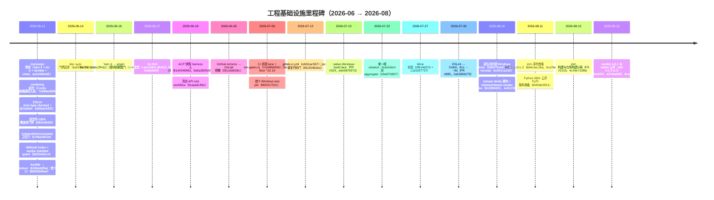
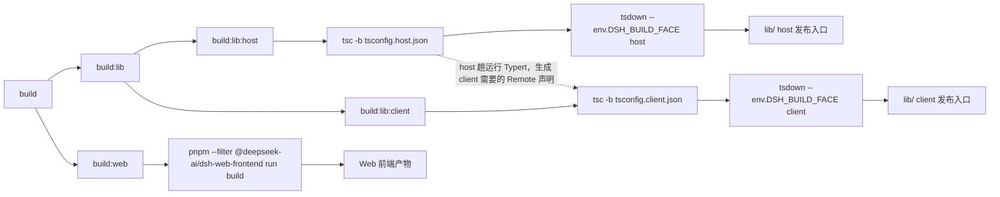
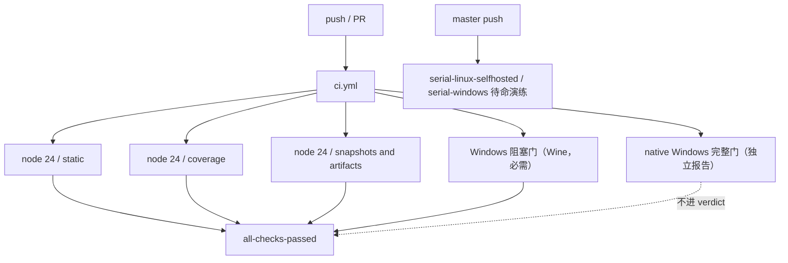
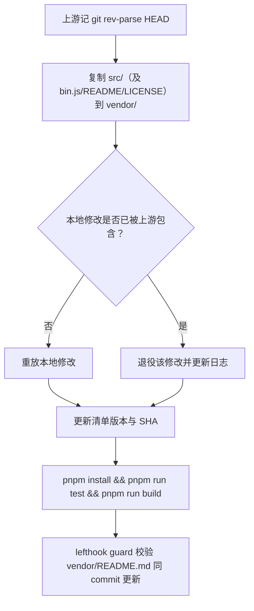
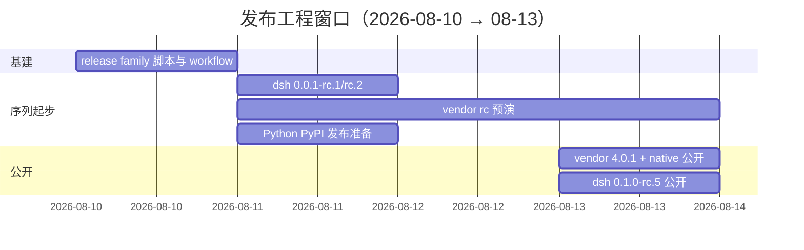
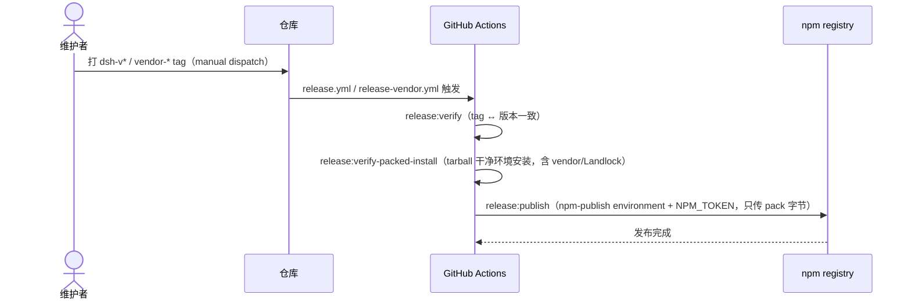

## 工程基础设施与研发实践

> 本章全部事实来自仓库 git 历史（截至 2026-08-13，HEAD `47f943859b`，共 12,293 个提交）。日期均为提交日期。
> 本扩展版保留原章节的全部事实、commit hash、日期、版本号与命令字符串，并补充了根 `package.json` 脚本清单（`root-scripts.txt`）、15 个 workflow 清单（`workflows.txt`）、`pnpm-workspace.yaml`、`scripts/run-gates.ts` 调度器、`vendor/README.md` 清单等仓库实测数据。凡无法从现有章节、数据文件或仓库文件确认的细节一律标注"（待考）"，不臆造 job 结构、步骤数字与提交哈希。

本章导览：

| 章节 | 覆盖内容 | 相对原章节的主要新增 |
|---|---|---|
| 包管理与构建 | Yarn→pnpm、workspace 布局、构建管线、scripts 大表 | 根 scripts 分组表、pnpm-workspace.yaml 配置总表、Yarn/pnpm 对照表、构建产物布局表、三阶段定型表 |
| 测试策略 | 四层测试、覆盖率门禁、快照演进、e2e | 四层对照表、vitest 配置族、DSH_SNAPSHOT 三值表、快照演进时间线、免插桩门细节、key 政策表 |
| 静态检查 | ESLint→Oxlint、typecheck、jscpd、doc-sync | 对照表、Oxlint 迁移细节、校验脚本族总表、生成/校验成对表、质量门禁全景表 |
| CI 矩阵 | workflow 全表、run-gates、Windows、Node 矩阵、GitLab | 15 workflow 角色/日期表、run-gates 14 模式表与 gate 明细、Windows 三段式演进表、CI 版本对照表 |
| Vendoring 流程 | 9 包清单、rescope、同步流程、18 条本地修改 | 9 包表、rescope 前后对照表、18 条修改明细表、三方依赖/不 vendoring 清单、同步流程图 |
| 发布工程 | 三条序列、五步流程、npm 公开次序 | 序列/commit 流水表、scripts/release 表、access 策略表、序列依赖表、gantt/sequenceDiagram |
| 基础设施里程碑 | 30 行原表 + 17 行新增 | 按主题演进小结表 |
| 附录 | 123 scripts 索引、AGENTS.md 命令表、mermaid 图清单 | 全量索引、任务列表、定义列表 |

---

### 总览

这个仓库的基础设施不是渐进长出来的，而是在项目第一天（2026-06-11）就一次性立起了完整骨架：当天依次提交了 monorepo 骨架（Yarn 4 workspaces + tsc -b + dumble + vitest，`ae2e08b4d6`）、Cordis 源码 vendoring（`72688a3888`）、ESLint 严格规则（`cb6bee3d03`）、逐文件 100% 覆盖率门禁（`bfb034830f`）、knip/publint/constraints 卫生门（`6796a3922d`）、lefthook git hooks（`9d20a36cc4`）和第一版 GitHub Actions CI（`86955b96a4`，node 24/26 全门禁矩阵）。dumble 甚至在当天就被判定为 bus-factor 风险换成了 tsdown（`630bbddf9a`）。

此后两个月，工程实践从"单仓库跑一组命令"演进为"多 lane 的发布流水线"：包管理器在 5 天内从 Yarn 4 换成 pnpm（2026-06-16），CI 从单一 job 拆成 static/coverage/consumers 宽 lane 并由 `run-gates.ts` 统一调度（2026-07-06），lint 从 ESLint 迁到 Oxlint（2026-07-30），Windows 从"无"到"Wine 模拟"再到"自托管原生完整门禁 + 双平台 failover 开关"（2026-07-06 → 07-27 → 08-10），最终在 2026-08-11 到 08-13 之间跑通了三条发布序列（dsh / vendor / native + Python），并全部公开上 npm。

提交节奏与这一过程同步放大：2026-W24 只有 67 个提交，W31 达 3,542，W33 回落到 1,213。月度贡献量（按作者）见下方附表，与周提交数口径不同，仅用于观察同一放大趋势。

| 维度 | 数值 | 来源 |
|---|---|---|
| 提交总数 | 12,293（截至 2026-08-13） | git 历史 |
| 根 package.json scripts | 123 条 | `root-scripts.txt` |
| GitHub Actions workflow | 15 个 | `workflows.txt` / `.github/workflows` |
| run-gates 调度模式 | 14 个命名模式（另有 hygiene 等根脚本聚合） | `scripts/run-gates.ts` |
| vendored 包 | 9 个（全部 rescope 到 `@deepseek-ai`） | `vendor/README.md` |
| vendor 本地修改条目 | 18 条 | `vendor/README.md` |
| 发布序列 | 3 条（dsh / vendor / native + Python） | 本章"发布工程" |
| Node 版本线 | `^22.19.0 \|\| >=24.0.0`（排除 Node 23） | 根 `package.json` |
| 包管理器 | `pnpm@11.7.0`（`packageManager` 字段） | 根 `package.json` |



月度贡献量（数据来源 `contrib-monthly.txt`，数值为当月该作者贡献量，与"提交数"口径不同）：

| 作者 | 2026-06 | 2026-07 | 2026-08 | 合计 |
|---|---|---|---|---|
| Tianyi Cui | 497 | 4,036 | 682 | 5,215 |
| Yichen Jiang | 21 | 627 | 713 | 1,361 |
| imccyu | 17 | 822 | 453 | 1,292 |
| Chinesezjc | 0 | 372 | 212 | 584 |
| Turtle | 0 | 353 | 223 | 576 |
| Hypatia May | 46 | 331 | 101 | 478 |
| _Kerman | 0 | 231 | 245 | 476 |
| creatixchu | 0 | 326 | 155 | 481 |
| kingwl | 1 | 211 | 48 | 260 |
| Huanqi Cao | 0 | 19 | 195 | 214 |
| ZiyaZhang | 2 | 161 | 79 | 242 |
| Dudu-0223 | 26 | 94 | 70 | 190 |
| NI0317 | 0 | 157 | 23 | 180 |
| pku-xht | 0 | 29 | 144 | 173 |
| **合计** | **610** | **7,769** | **3,343** | **11,722** |

2026-07 是贡献量的峰值月（合计 7,769），与 W31 周提交数 3,542 的峰值相互印证；2026-08 回落但分布更均匀（第二名起均为三位数）。本章后续各节按"包管理与构建 → 测试策略 → 静态检查 → CI 矩阵 → Vendoring 流程 → 发布工程 → 基础设施里程碑"展开。

---

### 包管理与构建

#### 从 Yarn 4 到 pnpm

仓库以 Yarn 4 workspaces（node-modules linker）起步，`ae2e08b4d6` 的提交信息明确了最初分工：开发/测试/演示经 tsx + 根 tsconfig paths 直接跑源码，构建 = `tsc -b`（声明）+ dumble（JS bundle），测试 = vitest + vite-tsconfig-paths。当天稍晚 `630bbddf9a` 就以"dumble v0.2.x、每周约 530 下载、单维护者、作为承重 bundler 是 bus-factor 风险"为由换成 tsdown（rolldown 内核，每周约 250 万下载），输出与 dumble 逐字节等价（用快照 diff 验证 17 个 bundle），决策记录在 ADR 0008（后归档为 `2026-06-11-tsdown-over-dumble` note）。`scripts/build.ts`（dumble 编排）随之删除，`pnpm build = tsc -b && tsdown`。

2026-06-16 的 `dabc2ff411`（feat: migrate to pnpm，配套 ADR 0016 / note `2026-06-16-pnpm-over-yarn`）把包管理器整体换成 pnpm 11.7.0：删除 `yarn.lock`（4,864 行）与 `yarn.config.cjs`，新增 `pnpm-lock.yaml`（4,440 行）与 `pnpm-workspace.yaml`；workspaces 从 `package.json#workspaces` + `.yarnrc.yml` 迁到 pnpm-workspace.yaml。

关键取舍记录在 note 里：迁移动机不是安装速度（迁移时测量 Yarn 与 pnpm 基本打平甚至 pnpm 更慢），而是生态对齐、pnpm 严格 symlink linker 让 phantom dependency（未声明即 import 的传递依赖）失败响亮（对"整个质量故事就是机械门禁"的仓库是特性），以及跨 checkout 的内容寻址 store 磁盘去重。

pnpm 10+ 的构建脚本白名单机制被当成供应链加固沿用：`pnpm-workspace.yaml` 的 `allowBuilds` 显式允许 esbuild/lefthook 等真正需要 lifecycle 的包，其余默认拒绝。Yarn constraints 引擎被重写为与包管理器无关的 `scripts/check-workspace-constraints.ts`（`pnpm run constraints`），继续强制"全部 private、dsh-* 包把 cordis 声明为匹配的 peer+dev 依赖、统一版本、ESM"等清单规则。

Yarn 4 时代与 pnpm 时代的对照如下：

| 维度 | Yarn 4 时代（2026-06-11 → 06-16） | pnpm 时代（2026-06-16 起） |
|---|---|---|
| lock 文件 | `yarn.lock`（4,864 行，迁移时删除） | `pnpm-lock.yaml`（4,440 行，迁移时新增） |
| workspaces 声明 | `package.json#workspaces` + `.yarnrc.yml` | `pnpm-workspace.yaml`（`packages:` 列表） |
| linker 语义 | node-modules linker（hoisted 近似） | 严格 symlink linker：未声明的传递依赖 import 直接失败（phantom dependency 失败响亮） |
| 依赖解析 | 每个 workspace 独立 node_modules | 内容寻址全局 store + 跨 checkout 磁盘去重 |
| constraints 机制 | Yarn constraints 引擎（`yarn.config.cjs`） | `scripts/check-workspace-constraints.ts`（`pnpm run constraints`，与包管理器无关） |
| 构建脚本控制 | 无白名单机制 | `allowBuilds` 白名单：默认拒绝，显式允许 esbuild/lefthook 等 |
| 版本固定 | 无强制 | `packageManager: pnpm@11.7.0` + `engines.node` |

迁移的实际文件面（`dabc2ff411`，数字来自本章）：

| 操作 | 文件 | 规模 / 内容 |
|---|---|---|
| 删除 | `yarn.lock` | 4,864 行 |
| 删除 | `yarn.config.cjs` | Yarn constraints 引擎配置 |
| 新增 | `pnpm-lock.yaml` | 4,440 行 |
| 新增 | `pnpm-workspace.yaml` | workspaces 声明 + 后续 allowBuilds 等配置 |
| 重写 | `scripts/check-workspace-constraints.ts` | 与包管理器无关的 constraints 实现（`pnpm run constraints`） |
| 迁出 | `.yarnrc.yml` 中的 workspaces/linker 配置 | 配置迁入 pnpm-workspace.yaml（是否删除文件（待考）） |

> [!NOTE]
> **pnpm `allowBuilds` 是"默认拒绝"的白名单**：pnpm 10+ 默认拦截一切带 install/build 脚本的依赖（`strictDepBuilds` 默认开启，未列出的 lifecycle 脚本是硬安装错误）。本仓库只放行真正需要 lifecycle 的包——esbuild（原生二进制）、lefthook（git hooks）、node-pty（PTY 后端，含 Windows ConPTY）、koffi（Windows 上 JSONL 耐久性写穿发布调用 MoveFileExW）、`@deepseek-ai/dsh-subprocess-local@file:...`（Python runtime 部署还原 node-pty macOS spawn helper 可执行位）；而 `@google/genai`、`protobufjs`、`node-addon-require-builtin` 虽然带 lifecycle 脚本但实为 no-op，被显式 `false` 拒绝。白名单之外的新依赖默认装不上——这是有意的供应链加固。

#### workspace 布局与依赖解析

`pnpm-workspace.yaml` 的成员列表（2026-08 实测）：

- `vendor/*` —— 9 个 vendored Cordis 框架包（见"Vendoring 流程"节）
- `packages/*/*` —— 全部 `@deepseek-ai/dsh-*` 工作区
- `native/landlock-run` 及 `native/landlock-run/packages/*` —— Landlock launcher（原生构建与发布脚本保留在 native 目录内）
- `apps/*` —— 产品组装层（`apps/cli` 拥有 `dsh` bin）
- `website` —— VitePress 文档站点
- `examples` —— 可运行 demo 叶，**仅作依赖解析成员，不是构建目标**（tsdown 的显式 glob `vendor/*`、`packages/*/*` 排除它们；见已归档的 run-ci-examples-from-built-lib Agent Note）
- `python/sdk-runtime` —— single-exe 构建的部署根：一个纯依赖清单，其闭包就是 exe 打包与 Python runtime 分发的内容

关键依赖解析配置（均来自 `pnpm-workspace.yaml` 实测）：

- `linkWorkspacePackages: true`：vendored 框架包保留上游 semver 范围，本地构建把这些匹配名解析到钉死的 workspace 源码（含 built `lib/` 里的 import）
- `overrides`：`@deepseek-ai/cosmokit` / `@deepseek-ai/schemastery` 强制 `link:vendor/...`
- `peerDependencyRules.allowedVersions`：`typescript: '>=5 <7'`
- `minimumReleaseAgeExclude`：放行刚发布的 `@earendil-works/pi-ai@0.82.1`（模型目录更新是 bump 的全部意义）与 node-addon-* 0.1.4 全家
- `patchedDependencies`：`node-pty@1.1.0` → `patches/node-pty@1.1.0.patch`

`pnpm-workspace.yaml` 的其余配置项（2026-08 实测，逐字来自文件）：

| 配置项 | 值 | 用途 / 理由 |
|---|---|---|
| `linkWorkspacePackages` | `true` | vendored 框架包保留上游 semver 范围，本地构建解析到钉死 workspace（含 built `lib/` 里的 import） |
| `overrides` | `@deepseek-ai/cosmokit: link:vendor/cosmokit`、`@deepseek-ai/schemastery: link:vendor/schemastery` | 两个基础库强制 workspace link，杜绝 registry 副本混入 |
| `peerDependencyRules.allowedVersions` | `typescript: '>=5 <7'` | 放宽 typescript peer 范围（工具链兼容） |
| `allowBuilds.esbuild` | `true` | 原生二进制，genuinely 需要 lifecycle |
| `allowBuilds.lefthook` | `true` | git hooks，genuinely 需要 lifecycle |
| `allowBuilds.node-pty` | `true` | 持久 PTY 后端的跨平台边界（含 Windows ConPTY） |
| `allowBuilds.koffi` | `true` | JSONL 耐久性在 Windows 上以 write-through 发布调用 MoveFileExW |
| `allowBuilds['@deepseek-ai/dsh-subprocess-local@file:...']` | `true` | Python runtime 部署包含该 workspace postinstall（还原 node-pty macOS spawn helper 可执行位） |
| `allowBuilds['@google/genai']` | `false` | pi-ai 可选后端带入；lifecycle 是 no-op，显式拒绝 |
| `allowBuilds.protobufjs` | `false` | 同上，no-op lifecycle |
| `allowBuilds.node-addon-require-builtin` | `false` | 同上，no-op lifecycle |
| `minimumReleaseAgeExclude` | `@earendil-works/pi-ai@0.82.1` + node-addon-* 0.1.4 全家（9 项） | 新发布带模型目录更新（pi-ai）与配套 addon 二进制，等 release age 会事与愿违 |
| `patchedDependencies` | `node-pty@1.1.0: patches/node-pty@1.1.0.patch` | node-pty 本地补丁（patch 文件入库） |

> [!TIP]
> **`minimumReleaseAgeExclude` 是 pnpm 供应链时序控制的例外清单**：pnpm 默认对新发布包施加"发布冷却期"（防抢注/防新鲜供应链攻击），但 pi-ai 的每次 bump 其价值就是最新模型目录，node-addon-* 0.1.4 是配套原生二进制——两者被显式豁免。新增依赖若想跳过冷却期，应先确认是否该进这个清单而不是改全局配置。

#### 根 scripts 大表（上）：构建与测试

根 `package.json` 共 123 条 scripts（完整清单见 `root-scripts.txt`），下表按用途节选关键条目。命令字符串逐字来自 `root-scripts.txt`；"用途"为通用描述。

**构建与清理**

| 脚本名 | 命令（逐字） | 用途 |
|---|---|---|
| `build` | `npm run build:lib && npm run build:web` | 构建全部产物（lib + web 前端） |
| `build:lib` | `npm run build:lib:host && npm run build:lib:client` | 构建 TypeScript lib（host/client 两趟） |
| `build:lib:host` | `tsc -b tsconfig.host.json && tsdown --env.DSH_BUILD_FACE host` | host 面：tsc 发声明 + tsdown 打包（host 趟） |
| `build:lib:client` | `tsc -b tsconfig.client.json && tsdown --env.DSH_BUILD_FACE client` | client 面：tsc 发声明 + tsdown 打包（client 趟） |
| `build:web` | `pnpm --filter @deepseek-ai/dsh-web-frontend run build` | 构建 Web 前端 |
| `clean` | `tsx scripts/clean.ts` | 清理构建产物与已删除包的残留 |
| `change-scope` | `tsx scripts/change-scope.ts` | 包范围变更辅助脚本 |

**测试与快照**

| 脚本名 | 命令（逐字） | 用途 |
|---|---|---|
| `test` | `vitest run` | 单元测试（无 key） |
| `test:coverage` | `vitest run --coverage` | 带逐文件 100% 覆盖率门禁的测试（无 key） |
| `test:e2e` | `vitest run --config vitest.e2e.config.ts` | 真实 API e2e（需 key，无 key 自跳） |
| `test:snapshot` | `vitest run --config vitest.snapshot.config.ts` | 快照重放（无 key） |
| `test:snapshot:record` | `DSH_SNAPSHOT=record vitest run --config vitest.snapshot.config.ts --update` | 重录快照（需 key） |
| `test:snapshot:refresh` | `DSH_SNAPSHOT=refresh vitest run --config vitest.snapshot.config.ts` | 快照刷新（无 key） |
| `test:web` | `npm run build && npm run test:web:built` | 构建后跑 Web 浏览器快照 |
| `test:web:built` | `vitest run --config vitest.web.config.ts` | 对已构建产物跑 Web 快照（`DSH_SNAPSHOT=replay`） |
| `test:web:perf` | `npm run build && npm run test:web:perf:built` | Web 性能快照（replay 模式） |
| `test:web:stress` | `npm run build && vitest run --config vitest.web-stress.config.ts` | Web 压力测试 |
| `test:gui` | `vitest run packages/client packages/host` | host/client 包测试 |
| `test:issue-management` | `node .github/issue-management/policy.test.mjs` | Issue 管理政策测试（node 直接跑） |

**门禁调度（run-gates 聚合）**

| 脚本名 | 命令（逐字） | 用途 |
|---|---|---|
| `check:all` | `tsx scripts/run-gates.ts check-all` | 本地全量门禁聚合 |
| `check:ci` | `tsx scripts/run-gates.ts ci-primary` | CI 主门禁聚合（本地复演主 lane） |
| `check:ci:linux-primary` | `tsx scripts/run-gates.ts ci-linux-primary` | Linux 主门禁聚合（含 web 快照） |
| `check:ci:static` | `tsx scripts/run-gates.ts ci-static` | 静态门禁聚合 |
| `check:ci:lint:contracts-ready` | `tsx scripts/run-gates.ts ci-lint-contracts-ready` | 契约就绪后的 lint 聚合 |
| `check:ci:coverage` | `tsx scripts/run-gates.ts ci-coverage` | 覆盖率门禁聚合 |
| `check:ci:snapshot` | `tsx scripts/run-gates.ts ci-snapshot` | 快照门禁聚合 |
| `check:ci:artifacts` | `tsx scripts/run-gates.ts ci-artifacts` | 产物验证门禁聚合 |
| `check:ci:consumers` | `tsx scripts/run-gates.ts ci-consumers` | 消费者视角完整验证聚合 |
| `check:windows-wine` | `bash scripts/wine-windows-gates.sh` | 仅诊断已知 Windows 失败时用（需 wine；CI 拥有该信号） |
| `check:ci:windows-blocking` | `tsx scripts/run-gates.ts ci-windows-blocking` | Windows 阻塞门聚合（Wine 上跑，必需） |
| `check:ci:windows-complete` | `tsx scripts/run-gates.ts ci-windows-complete` | Windows 完整门聚合（原生 runner） |
| `check:ci:windows-observational` | `tsx scripts/run-gates.ts ci-windows-observational` | Windows 观测门聚合 |
| `check:node-compat` | `tsx scripts/run-gates.ts node-compat` | Node 版本兼容门聚合 |

**静态检查与卫生**

| 脚本名 | 命令（逐字） | 用途 |
|---|---|---|
| `typecheck` | `npm run build:lib:host && npm run typecheck:contracts-ready` | 类型检查（先跑 host 趟生成 client 所需声明） |
| `lint` | `npm run build:lib:host && npm run lint:contracts-ready` | Oxlint 全量检查（契约就绪后） |
| `lint:fix` | `npm run build:lib:host && npm run lint:fix:contracts-ready` | Oxlint 自动修复 |
| `duplication` | `jscpd --config .jscpd.json packages scripts` | 跨文件 TypeScript 克隆检测 |
| `knip` | `knip --treat-config-hints-as-errors` | 未使用导出/依赖检测 |
| `publint` | `tsx scripts/publint-all.ts` | 全包发布清单 lint |
| `hygiene` | `pnpm run rescope-vendor:check && pnpm run knip && pnpm run publint && pnpm run constraints && pnpm run verify-dsh-package-licenses && pnpm run verify-package-invariants && pnpm run verify-built-package-invariants && pnpm run verify-cordis-config && pnpm run verify-node-next-types && pnpm run verify-runtime-closure && pnpm run verify-vendored-links` | 卫生门链（10 个脚本串行） |
| `constraints` | `tsx scripts/check-workspace-constraints.ts` | workspace 约束检查（Yarn constraints 的替代） |
| `verify-node-next-types` | `tsx scripts/verify-node-next-types.ts` | 构建声明喂给临时 NodeNext ESM 消费者 |
| `verify-vendored-links` | `tsx scripts/verify-vendored-links.ts` | 断言 vendored 名只以 workspace `link:` 存在于 lock |
| `verify-cordis-config` | `tsx scripts/verify-cordis-config.ts` | 校验 cordis.yml 裸插件出现在解析器清单依赖中 |

**文档与校验**

| 脚本名 | 命令（逐字） | 用途 |
|---|---|---|
| `doc-sync` | `tsx scripts/run-gates.ts doc-sync` | 文档门禁聚合（leaf 清单见 run-gates.ts） |
| `doc-typecheck` | `npm run build:lib:host && npm run doc-typecheck:contracts-ready` | 文档代码块 typecheck |
| `docs:build` | `pnpm --filter @deepseek-ai/website run build && pnpm run verify-doc-site-fragments` | VitePress 站点构建（兼作死链检查） |
| `docs:build:mpa` | `pnpm --filter @deepseek-ai/website exec vitepress build . --mpa && pnpm run verify-doc-site-fragments` | VitePress MPA 模式构建（Windows 观测门用） |
| `docs:check` | `pnpm exec vitest run scripts/project-doc-site.spec.ts scripts/verify-doc-site-fragments.spec.ts && pnpm run docs:build` | 文档站点检查 + 构建 |
| `website:build` | `pnpm run docs:build` | 站点构建别名 |
| `verify-doc-refs` | `tsx scripts/verify-doc-refs.ts` | 文档交叉引用校验 |
| `verify-doc-budgets` | `tsx scripts/verify-doc-budgets.ts` | 文档字数预算校验 |
| `verify-md-wrap` | `tsx scripts/verify-md-wrap.ts` | Markdown 折行校验 |
| `verify-type-equiv` | `tsx scripts/verify-type-equiv.ts` | 类型等价校验（doc-sync 族） |

**发布与运行**

| 脚本名 | 命令（逐字） | 用途 |
|---|---|---|
| `release:dsh` | `tsx scripts/release/bump.ts --family dsh` | bump dsh 序列版本 |
| `release:vendor` | `tsx scripts/release/bump.ts --family vendor` | bump vendor 序列版本 |
| `release:verify` | `tsx scripts/release/verify.ts` | 校验 tag 与版本一致 |
| `release:pack` | `tsx scripts/release/pack.ts` | 打包发布集（无凭证可跑） |
| `release:verify-packed-install` | `tsx scripts/release/verify-packed-install.ts` | tarball 干净环境安装验证 |
| `release:publish` | `tsx scripts/release/publish.ts` | 发布上传（npm-publish environment） |
| `publish:npm-baseline` | `tsx scripts/publish-npm-baseline.ts` | npm 基线发布脚本 |
| `dsh` | `node --import tsx/esm apps/cli/src/bin.ts` | 从源码跑 dsh CLI（tsx ESM-only hook） |
| `demo:cordis` | `node scripts/demo-cordis.mjs` | agent 自改运行时演示（需 key） |
| `dev:web` | `tsx scripts/dev-web.ts --poll` | Web 前端开发服务器 |
| `postinstall` | `node scripts/install-lefthook.mjs` | 安装 lefthook git hooks |

> 其余未列入的 scripts（`verify-*` 系列、`gen-*` 系列、`demo:acp`、`mock:llm`、`test:web:refresh` 等约 60 条）见 `root-scripts.txt` 全量清单；`gen-*`/`verify-*` 成对出现（生成器 + `--check` 校验）是"生成物入库、门禁校验 freshness"的通用模式。

#### 构建管线

当前 `pnpm run build` 的完整链条（命令逐字来自 `root-scripts.txt`）：

```bash
pnpm run build            # = npm run build:lib && npm run build:web
pnpm run build:lib        # = npm run build:lib:host && npm run build:lib:client
pnpm run build:lib:host   # tsc -b tsconfig.host.json && tsdown --env.DSH_BUILD_FACE host
pnpm run build:lib:client # tsc -b tsconfig.client.json && tsdown --env.DSH_BUILD_FACE client
pnpm run build:web        # pnpm --filter @deepseek-ai/dsh-web-frontend run build
```



要点（事实来自本章"测试策略"与"静态检查"节所述机制）：

- tsc -b 独占 TypeScript 变换并产出 `lib/types` 下的 `.js/.d.ts`；tsdown 只负责把 tsc 发出的 JS 打包成发布入口
- host/client 分趟由 `--env.DSH_BUILD_FACE host|client` 区分，2026-06-17 的 tsc-first 配置里就已定型
- entry 是 `lib/types/{index,invariant,startup}.js`
- `apps/cli`（dsh）自 2026-08-12（PR #2319）起从仓库构建中分离；`tsdown.config.ts` 的 workspace glob `['vendor/*', 'packages/*/*', 'apps/cli']` 即此结果

构建产物布局（source plane → artifact plane 的落点，事实来自本章与 vendor README）：

| 产物 | 生成者 | 位置 | 消费者 |
|---|---|---|---|
| TypeScript 中间产物（`.js` + `.d.ts` + `.d.ts.map`） | tsc -b（独占变换） | 各包 `lib/types/` | tsdown 打包输入；声明元数据消费者 |
| 发布 runtime 入口 | tsdown（只打包 tsc 发出的 JS） | 各包 `lib/` | package exports / 发布 tarball |
| 库入口文件 | tsc + tsdown | `lib/types/{index,invariant,startup}.js` | 运行时入口 |
| host/client 分面产物 | `--env.DSH_BUILD_FACE host\|client` | 各包 `lib/`（host 与 client 两趟） | host（服务端）/ client（浏览器/GUI） |
| 双 ESM+CJS 特殊条目 | vendored schemastery / logger-console 自有 tsdown 配置 | 各自 `lib/`（`.mjs`/`.cjs` 分入口） | CJS require 与 ESM import 双方 |
| Web 前端产物 | `build:web`（dsh-web-frontend） | 前端包构建输出 | Web GUI 快照 lane 等 |

#### 三阶段构建定型

构建管线在两个月内经历了三次定型，每次都有明确的提交或 note 背书：

| 阶段 | 时间 | 依据 | 定型内容 |
|---|---|---|---|
| 1. tsc-first | 2026-06-17 | note `2026-06-17-ts-build-config` | tsc -b 独占 TypeScript 变换并产出 `lib/types` 的 `.js/.d.ts`，tsdown 只打包 tsc 发出的 JS；oxc 的变换行为与 tsc 不一致，且 tsdown 的 bundled .d.ts 与 Cordis 的相对模块增广冲突 |
| 2. host/client 双 aggregate | 2026-07-22 | `19e6f7d907` | 单一根 solution 图，下面挂 host/client 两个 aggregate（`tsconfig.host.json` / `tsconfig.client.json`）；原因是两侧都以同名 key 对 cordis `Context` 做 declaration merging，同一 ts.Program 里会冲突 |
| 3. dsh 独立构建 | 2026-08-12 | PR #2319（`4c49e7109b`） | fix(cli): separate dsh from repository build——把 dsh（apps/cli）构建从仓库构建中分离；`tsdown.config.ts` 的 workspace glob `['vendor/*', 'packages/*/*', 'apps/cli']` 即此结果 |

配套约束（2026-07-06 的 `node-engine-floor` note）：根 `package.json` 固定 `packageManager: pnpm@11.7.0`、`engines.node: ^22.19.0 || >=24.0.0`；LTS 下限从 22.18 抬到 22.19，因为 Pi 适配器依赖 `@earendil-works/pi-ai` 声明 `>=22.19.0`，并明确排除 Node 23 整条线。`source plane` 与 `artifact plane` 从不混用：静态门禁与测试经 tsconfig `paths` 解析 workspace import 到 `src`，在干净树上通过；消费 built `lib/` 的门禁显式声明该依赖。

---

### 测试策略

测试分四层，各有分工和时机。四层总览：

| 层 | 命令 | 配置 | 何时跑 | 有无 key 依赖 |
|---|---|---|---|---|
| 单元测试 | `pnpm test` | vitest 默认配置，各包 `tests/**` | 本地 + CI 每个 push/PR | 无 |
| 覆盖率门禁 | `pnpm test:coverage` | `@vitest/coverage-v8`，`packages/*/src` 逐文件 100% | CI coverage lane（必需） | 无 |
| 快照测试 | `pnpm test:snapshot` / `test:web` | `vitest.snapshot.config.ts` / `vitest.web.config.ts` | CI snapshot lane / web 快照 lane（Linux PR 必需门） | 重放无 key；`record` 需 key；`refresh` 无 key |
| 真实 API e2e | `pnpm test:e2e` | `vitest.e2e.config.ts`，secret `DEEPSEEK_API_KEY_EXTERNAL` | e2e.yml：PR + 00:17 UTC 夜间 cron；fork/Dependabot 跳过 | 需 key（无 key 自跳，preflight 硬失败防假绿） |

key 依赖政策总表（"有无 key 依赖"列的展开，事实来自本章）：

| 命令 | key 需求 | 无 key 时的行为 |
|---|---|---|
| `test` / `test:coverage` / `test:snapshot` / `test:snapshot:refresh` / `test:web` / `test:gui` | 无 | 全量正常跑（keyless CI 保持绿） |
| `test:snapshot:record` | 需 key | 不适用（重录需真实模型输出） |
| `test:e2e` | 需 key（`DEEPSEEK_API_KEY_EXTERNAL`） | suite 无 key 自跳；workflow preflight 在 secret 缺失时硬失败（防假绿）；fork/Dependabot 因 secret 被扣而跳过 |
| `demo:*` / `dsh`（源码跑任务） | 需 key | 无 key 无法运行 |

**单元测试**（`pnpm test`，vitest）随代码放在各包 `tests/**`，所有 vitest 配置都指向 `tsconfig.base.json` 的 paths，工作区 import 一律解析到 `src`（source plane），从不经过 package exports 进 `lib/`——这是为了避免过期产物加载第二份模块单例。vitest 不 typecheck，因此类型正确性由 tsc -b 单独承担（见"静态检查"节）。

单元测试的约定（来自本章 + 仓库 AGENTS.md，通用表述）：

- 测试随代码放在各包 `tests/**`，与 `src/**` 并排；包级测试、e2e-only 断言与 mock-only fixture 不互相替代
- 所有 vitest 配置指向 `tsconfig.base.json` 的 paths，workspace import 一律解析到 `src`（source plane），从不经过 package exports 进 `lib/`
- 测试子进程启动模式：配置子进程跑 built `lib/` 下的普通 Node；源码回归用其声明的 launcher（详见 docs/testing.md 的 test-subprocess launch modes 政策）
- 快照 fixture 必须能在 macOS/Linux 重放——修 fixture 而不是修 normalizer
- 测试描述行为而非正确性：行为变更与测试同 PR 修改，并说明原因

快照 harness 的机制（2026-06-19 成型，`81d434896d` 引入 normalizers / wiring / handshake 场景，`c94f1563f5` 补五场景 + cancel/error 操作）：

- 重放：`test:snapshot` 用录制的 session 重放，diff 归一化后的 JSON-RPC 消息与重持久化日志（模型不可见输入 → session 事件的"model-visible ⟺ logged"不变量由此被机械校验）
- 记录：`test:snapshot:record` 需要 key 重录 expected 输出；`test:snapshot:refresh` 无 key 刷新（2026-07-10 `9d2cf8ce82`）
- 形态：交互式终端旅程用 JSONL 场景（`apps/cli/tests/snapshots/`）；Web GUI 用 Chromium 浏览器快照 lane（`test:web`）

vitest 配置族（实测于根 scripts 与 CI 引用；各配置均指向 `tsconfig.base.json` 的 paths）：

| 配置文件 | 服务命令 | 用途 | key 依赖 |
|---|---|---|---|
| （默认 vitest 配置） | `test` | 单元测试 | 无 |
| （默认 + `--coverage`） | `test:coverage` | 覆盖率门禁 | 无 |
| `vitest.e2e.config.ts` | `test:e2e` | 真实 API e2e | 需 key（无 key 自跳） |
| `vitest.snapshot.config.ts` | `test:snapshot` / `test:snapshot:record` / `test:snapshot:refresh` | ACP/headless 快照重放/重录/刷新 | 重放、刷新无 key；重录需 key |
| `vitest.web.config.ts` | `test:web:built`（`test:web` 先 build） | Chromium 浏览器快照 | 无 |
| `vitest.web.perf.config.ts` | `test:web:perf:built`（`test:web:perf` 先 build） | Web 性能快照（replay） | 无 |
| `vitest.web-stress.config.ts` | `test:web:stress`（先 build） | Web 压力测试 | 无 |

`DSH_SNAPSHOT` 环境变量三值语义（命令逐字见根 scripts）：

| 值 | 行为 | 何时用 | key 需求 |
|---|---|---|---|
| `record` | 重录 expected 输出（`--update`） | 输出意图变化时（`test:snapshot:record`） | 需 key |
| `refresh` | 无 key 刷新录制结果（`test:snapshot:refresh`，2026-07-10 的 `9d2cf8ce82` 引入） | 产物/环境漂移但不改意图时 | 无 key |
| `replay` | 确定性重放比对（`test:web:built` 由 gate 注入 `DSH_SNAPSHOT=replay`） | CI 快照 lane | 无 key |

**覆盖率门禁**（`pnpm test:coverage`）从 2026-06-11 的 `bfb034830f` 起就是"逐文件 100%"：

- 引擎：`@vitest/coverage-v8`
- 范围：`packages/*/src`，按文件设 statements/branches/functions/lines 四条 100% 阈值
- 排除：`vendor/`（上游代码）、`examples/`（由 demo smoke 覆盖）、纯类型文件
- 不可达守卫：真正不可达的防御性守卫允许带理由的 `/* v8 ignore */` 注释而不是删除
- 该提交当时为此补了 59 个测试（总计 132 个）

质量门禁 note（`2026-06-11-quality-gates`）记录了这一机制的动机：代码库主要由编码 agent 开发，"agent 服从强制门禁远比服从散文约定可靠"（早期教训：vitest 不 typecheck，导致没通过类型检查的测试被合入）。

覆盖率门禁还有一个"免插桩门"（2026-08 实测于 `scripts/coverage-exempt.ts`）：

- 机制：`coverage` 聚合拆成两个并行 gate——插桩的阈值门（`COVERAGE_EXEMPT_ENV=1`，跑全部 suite）+ 免插桩的 heavy 套件门（裸 vitest，不加 `--coverage`）
- 成员规则：某 suite 只有在"其执行到的每个被测量文件都已被其他 suite 100% 覆盖"时才有资格免插桩——移除它不改变任何阈值结果；正确性信号不丢，只省掉 v8 插桩税
- 当前豁免套件：`packages/typert/generator/tests/`（每 case 全 workspace 编译器分析，是 lane 最长尾）、`scripts/install-lefthook.spec.ts`、`scripts/oxlint-contract.spec.ts`、`scripts/change-scope.spec.ts`（真实子进程 fixture，coverage 从不测量 scripts/）
- worker 预算：`DSH_COVERAGE_MAX_WORKERS` 在两门间拆分（豁免门取 `max(1, floor(total/3))`，插桩门取余下份额），failover 池的 8 × 6-instance 上界假设单 lane 从不超预算；需要严格单 worker 的串行参考 job 另设 `DSH_GATE_CONCURRENCY=1`

**快照测试**成型于 2026-06-19，演进时间线：

| 日期 | commit | 事件 |
|---|---|---|
| 2026-06-19 | `bef9386591` | RFC：record-once / replay-deterministic |
| 2026-06-19 | `81d434896d` | ACP 快照 harness 落地（normalizers、wiring、handshake 场景） |
| 2026-06-19 | `c94f1563f5` | 补五个场景 + cancel/error 输入操作 |
| 2026-06-19 | `9a5a3835c8` | 快照进入 CI |
| 2026-06-19 | `f09cc81c03` | "影响 transcript/UX 的改动必须带快照测试"写成文档政策 |
| 2026-07-10 | `9d2cf8ce82` | 新增无需 key 的 refresh 模式 |
| 2026-07-24/30 | note（待考哈希） | Web GUI Chromium 快照 lane 定为 Linux PR 必需门 |

快照无 key 重放：`test:snapshot` 用录制的 session 重放并 diff 归一化后的 JSON-RPC 与重持久化日志，`test:snapshot:record` 需要 key 重录，2026-07-10 的 `9d2cf8ce82` 又加了无需 key 的 refresh 模式。之后快照体系随产品演进扩展：交互式终端旅程用 JSONL 场景（`apps/cli/tests/snapshots/`）、Web GUI 用 Chromium 浏览器快照 lane（`test:web`，2026-07-24/30 的 note 将其定为 Linux PR 必需门）。

快照的三种形态（事实来自本章"测试策略"）：

| 形态 | 载体 / 配置 | 位置 | 引入 |
|---|---|---|---|
| ACP/headless 快照 | `vitest.snapshot.config.ts`，重放 + diff 归一化 JSON-RPC 与重持久化日志 | 各包 tests + snapshot 场景 | 2026-06-19（`81d434896d`、`c94f1563f5`、`9a5a3835c8`） |
| 交互式终端旅程 | JSONL 场景 | `apps/cli/tests/snapshots/` | 随产品演进扩展 |
| Web GUI 浏览器快照 | `vitest.web.config.ts`（`test:web`），Chromium | web 快照 lane | 2026-07-24/30 note 定为 Linux PR 必需门 |

快照 gate 的装配细节（实测于 `run-gates.ts`）：`snapshotGate()` 跑 `test:snapshot` 并设 `DSH_EXAMPLE_MODE=lib`——example 与 package 快照在 `lib` 模式下启动 bin（构建产物 + 真实 exports 插件），脚本快照走真实源码入口；调用方要么等 `build` 要么等一个传递拥有该 build 的验证 gate。

**真实 API e2e**（`test:e2e`）是独立的 secret 工作流：`9caaa6c95e`（2026-06-19）用 `DEEPSEEK_API_KEY_EXTERNAL` secret 打外网 `https://api.deepseek.com`，suite 无 key 自跳（keyless CI 保持绿），但 workflow 有"secret 缺失则硬失败"的 preflight 防假绿，PR 触发但 fork/Dependabot 因 secret 被扣而跳过，另有 00:17 UTC 夜间 cron。分工的时机逻辑是：keyless 的 lint/typecheck/coverage/snapshot 全部在 ci.yml 每个 push/PR 跑，消耗 secret 的 e2e 单独在 e2e.yml 跑。

> [!TIP]
> **本地复演门禁用 `pnpm run check:ci` 而非逐个脚本**：`run-gates.ts` 聚合了依赖图与有界并发（`DSH_GATE_CONCURRENCY` 可调），本地跑与 CI 同一套 gate 定义，避免"本地过了、CI 挂了"的配置漂移。消耗 secret 的 e2e 与 Wine 门（`check:windows-wine`）不在本地默认清单里——前者缺 key 自跳，后者只在诊断已知 Windows 失败时才值得跑。

---

### 静态检查

lint 从第一天起就是严格模式：`cb6bee3d03`（2026-06-11）上 ESLint flat config 双层——type-checked 正确性层（typescript-eslint strict-type-checked）以 no-floating-promises / no-misused-promises 为头号规则（"agent loop 里丢 promise 是本仓库首要 bug 类别"），另有 switch-exhaustiveness-check、no-unnecessary-condition、require-await、no-explicit-any；样式层用 @stylistic 固化 2 空格/无分号/单引号/trailing comma/max-len 140 的既有 house style；vendor/ 排除，测试放宽与测试 ergonomics 冲突的规则。

type-aware ESLint 的代价随后显现：干净跑约 61 秒、需要 8 GiB Node heap、CI 结果缓存和单独调的并发（`0619ce62b6` 2026-06-26 给 lint step 抬 heap）。2026-07-30 的 PR #885（`2a53806275`，refactor: migrate linting to Oxlint，note `2026-07-29-oxlint-linter`）把整个 lint 栈换成 Oxlint，2026-08-09 的 PR #2097（`118a2f6866`）再把残余的 ESLint workflow 替换为 oxlint-only fix 流程。ESLint 与 Oxlint 的对照：

| 工具 | 引擎 | 干净跑耗时 | 迁移日期 | 关键规则 / 机制 |
|---|---|---|---|---|
| ESLint | typescript-eslint（type-aware，ts.Program 全量） | ~61 秒；8 GiB Node heap；CI 结果缓存 + 单独并发（`0619ce62b6`） | 2026-06-11 起步（`cb6bee3d03`）；2026-07-30 退役（PR #885） | strict-type-checked 层：no-floating-promises、no-misused-promises、switch-exhaustiveness-check、no-unnecessary-condition、require-await、no-explicit-any；@stylistic 样式层（2 空格/无分号/单引号/trailing comma/max-len 140） |
| Oxlint | oxlint + oxlint-tsgolint（TypeScript Go 分析器，按文件做项目发现） | ~8 秒（无需结果缓存） | 2026-07-30（`2a53806275`，PR #885）；2026-08-09（`118a2f6866`）残余 workflow 换 oxlint-only fix | @stylistic 与 SonarJS 经 Oxlint JS 插件兼容层保留；nursery 里的 no-unnecessary-condition 因"迁移前就是强制规则"继续开启；一次性逐规则审计 source 88/88、examples 87/87、tests 83/83 规则名翻译一致，审计过的 profile 指纹钉进仓库 |

Oxlint 迁移的工程细节（note `2026-07-29-oxlint-linter` 记载 + 根 scripts 实测）：

- **类型感知**：类型感知由 oxlint-tsgolint（TypeScript Go 分析器）按文件做项目发现，替代 ESLint 的整棵 ts.Program 全量加载——这正是 61 秒与 8 GiB heap 的根源被移除的地方
- **规则兼容**：@stylistic 和 SonarJS 通过 Oxlint 的 JS 插件兼容层保留；nursery 里的 no-unnecessary-condition 因"迁移前就是强制规则"而继续开启
- **一次性逐规则审计**：对删除的 ESLint 配置做了逐规则翻译审计——source 88/88、examples 87/87、tests 83/83 规则名翻译一致，并把审计过的 profile 指纹钉进仓库（后续规则增删会触发指纹比对）
- **并行度**：lint gate 读 `DSH_OXLINT_THREADS` 环境变量（有值则反映到 displayCommand）
- **fix 流程**：`lint:fix` = `npm run build:lib:host && npm run lint:fix:contracts-ready`；其中 staged 部分先以 `.oxlintrc.staged.json` 修 `packages/typert/generator/tests/fixtures/type-model`（生成器 fixture 特殊配置），再全量修全仓库
- **残余 ESLint workflow**：2026-08-09 的 PR #2097（`118a2f6866`）把残余 ESLint workflow 替换为 oxlint-only fix 流程

**typecheck** 由 tsc -b 承担（host lib 阶段先跑以生成 client 需要的 Remote 声明，再 tsc -b client aggregate），另有 `verify-node-next-types` 把构建出的声明喂给临时 NodeNext ESM 消费者做解析检查。

**重复代码**门禁 2026-07-13 才出现：`661504b3ec`（chore: gate TypeScript duplication in CI，jscpd 跨文件克隆检测）与 `53d9634043`（收紧阈值），2026-07-27 的 `36e8141145` 把 .tsx 也纳入 jscpd lane；当前 `pnpm run duplication` 用 `jscpd --config .jscpd.json packages scripts`。`.jscpd.json` 实测：`ignore` 含 `**/tests/**` 与 `**/tsdown.config.ts`，支持 `/* jscpd:ignore-start */` / `/* jscpd:ignore-end */` 块级豁免。

**文档侧**还有一个独立的 doc-sync 门禁族：2026-06-14 的 `6a528be569`（typecheck 文档代码块 + 校验事件分类法）起步，`07048983e0` 加 verify-type-equiv，2026-07-21 的 PR #455（`6fc7dd4c02`）把 doc-sync 并入 run-gates 调度器。doc-sync 聚合的叶子门（实测于 `run-gates.ts` 的 `docSyncLeafGates`，名单以源码为准）覆盖文档代码块 typecheck、站点构建/死链、类型等价、引用、折行、budgets 等校验族。

**hygiene 链**（`pnpm run hygiene`）串行跑 10 个脚本：`rescope-vendor:check` → `knip` → `publint` → `constraints` → `verify-dsh-package-licenses` → `verify-package-invariants` → `verify-built-package-invariants` → `verify-cordis-config` → `verify-node-next-types` → `verify-runtime-closure` → `verify-vendored-links`（命令逐字见"根 scripts 大表"）。它覆盖"源码面"（未构建时也能跑的部分）与"产物面"（消费 built `lib/` 的部分），与 tsc/tsdown 的 source/artifact plane 纪律对应。

**校验脚本族总表**（`verify-*` 直接校验，命令逐字来自 `root-scripts.txt`，用途为通用描述；`verify-*` 与 `gen-*` 成对出现时是"生成器 + `--check` freshness 校验"模式）：

| 脚本名 | 命令 | 用途 |
|---|---|---|
| `verify-md-wrap` | `tsx scripts/verify-md-wrap.ts` | Markdown 折行校验 |
| `verify-md-links` | `tsx scripts/verify-md-links.ts` | Markdown 链接校验 |
| `verify-doc-site-fragments` | `tsx scripts/verify-doc-site-fragments.ts` | 文档站点片段校验（docs:build 内嵌） |
| `verify-public-repository-links` | `tsx scripts/verify-public-repository-links.ts` | 公开仓库链接校验 |
| `verify-doc-refs` | `tsx scripts/verify-doc-refs.ts` | 文档交叉引用校验 |
| `verify-doc-budgets` | `tsx scripts/verify-doc-budgets.ts` | 文档字数预算校验 |
| `verify-type-equiv` | `tsx scripts/verify-type-equiv.ts` | 类型等价校验（doc-sync 族） |
| `verify-mermaid` | `tsx scripts/verify-mermaid.ts` | mermaid 代码块语法校验 |
| `verify-package-paths` | `tsx scripts/verify-package-paths.ts` | 包路径校验 |
| `verify-package-invariants` | `tsx scripts/verify-package-invariants.ts` | 包不变量校验（源码面） |
| `verify-built-package-invariants` | `node scripts/verify-built-package-invariants.mjs` | 构建产物不变量校验（产物面） |
| `verify-package-readme-model-experience` | `tsx scripts/verify-package-readme-model-experience.ts` | 包 README 模型体验校验 |
| `verify-package-readme-limitations` | `tsx scripts/verify-package-readme-limitations.ts` | 包 README 限制声明校验 |
| `verify-dsh-package-licenses` | `tsx scripts/verify-dsh-package-licenses.ts` | dsh 包许可证校验 |
| `verify-config-source-ownership` | `tsx scripts/verify-config-source-ownership.ts` | 配置源归属校验 |
| `verify-cordis-config` | `tsx scripts/verify-cordis-config.ts` | cordis.yml 裸插件依赖声明校验 |
| `verify-node-next-types` | `tsx scripts/verify-node-next-types.ts` | NodeNext ESM 消费者解析校验 |
| `verify-runtime-closure` | `tsx scripts/verify-runtime-closure.ts` | 运行时闭包校验 |
| `verify-vendored-links` | `tsx scripts/verify-vendored-links.ts` | vendored 名只以 workspace link 存在 |
| `verify-client-domain-graph` | `tsx scripts/verify-client-domain-graph.ts` | client 域图校验 |
| `verify-export-jsdoc` | `tsx scripts/verify-export-jsdoc.ts` | 导出 JSDoc 完整性校验（@param/@returns） |
| `verify-agent-note-classification` | `tsx scripts/verify-agent-note-classification.ts` | Agent Note 分类校验 |
| `verify-agent-note-format` | `tsx scripts/verify-agent-note-format.ts` | Agent Note 格式校验 |
| `verify-archived-agent-notes` | `tsx scripts/verify-archived-agent-notes.ts` | 归档 Agent Note 冻结校验 |
| `verify-skill-invocation-metadata` | `tsx scripts/verify-skill-invocation-metadata.ts` | skill 调用元数据校验 |
| `verify-translation-prompt` | `tsx scripts/verify-translation-prompt.ts` | 翻译 prompt 校验 |
| `verify-translation-pairing` | `tsx scripts/verify-translation-pairing.ts` | 翻译配对校验 |
| `resolve-translation-pairing-conflicts` | `tsx scripts/merge-translation-pairing.ts --resolve` | 翻译配对冲突解决 |
| `gen-translation-brief` | `tsx scripts/gen-translation-brief.ts` | 生成翻译简报 |

**生成 + 校验成对脚本**（生成器产物入库，`--check` 校验 freshness）：

| 生成脚本 | 校验脚本（`--check`） | 生成物 |
|---|---|---|
| `gen-cordis-catalog` | `verify-cordis-catalog` | cordis 插件目录 |
| `gen-cordis-api` | `verify-cordis-api` | cordis API 参考 |
| `gen-client-catalog` | `verify-client-catalog` | client 侧目录 |
| `gen-cordis-inspect-catalog` | （同脚本 `--check`） | cordis inspect 目录 |
| `gen-tool-catalog` | `verify-tool-catalog` | 工具目录 |
| `gen-config-catalog` | `verify-config-catalog` | 配置目录 |
| `gen-doc-graphs` | `verify-doc-graphs` | 文档依赖图 |
| `gen-persistence-catalog` | `verify-persistence-catalog` | 持久化目录 |
| `gen-third-party-notices` | `verify-third-party-notices` | THIRD_PARTY_NOTICES |
| `gen-module-graph` | `verify-module-graph` | 模块依赖图（2026-06-16 起的 freshness 门禁） |
| `gen-scoped-events` | `verify-scoped-events` | 作用域事件清单 |
| `rescope-vendor` | `rescope-vendor:check` | vendored 包 @deepseek-ai 重命名 |

**质量门禁全景表**（门禁 → 入口脚本 → 引入时间 → 关键演进；全部事实来自本章各节）：

| 门禁 | 入口脚本 | 引入时间 | 关键演进 |
|---|---|---|---|
| 类型检查 | `typecheck`（build:lib:host + typecheck:contracts-ready） | 2026-06-11（`ae2e08b4d6`） | 07-22 host/client 双 aggregate（`19e6f7d907`）；08-12 dsh 构建分离（PR #2319，`4c49e7109b`） |
| lint | `lint`（run-oxlint.ts） | 2026-06-11 ESLint（`cb6bee3d03`） | 07-30 Oxlint（PR #885，`2a53806275`）；08-09 oxlint-only fix（`118a2f6866`） |
| 覆盖率 | `test:coverage` | 2026-06-11（`bfb034830f`） | 逐文件 100% + `/* v8 ignore */` + 免插桩门（coverage-exempt） |
| 快照 | `test:snapshot` / `test:web` | 2026-06-19（`81d434896d`、`9a5a3835c8`、`f09cc81c03`） | 07-10 keyless refresh（`9d2cf8ce82`）；07-24/30 web 快照 lane |
| 真实 API e2e | `test:e2e` | 2026-06-19（`9caaa6c95e`） | e2e.yml + 00:17 UTC cron + preflight 防假绿 |
| 重复代码 | `duplication`（jscpd） | 2026-07-13（`661504b3ec`、`53d9634043`） | 07-27 .tsx 纳入（`36e8141145`） |
| 卫生 | `hygiene`（10 脚本链） | 2026-06-11（`6796a3922d` 起步） | rescope-vendor:check / verify-vendored-links 等并入 |
| 文档 | `doc-sync` | 2026-06-14（`6a528be569`） | 07-21 并入 run-gates（PR #455，`6fc7dd4c02`） |
| 模块依赖图 | `verify-module-graph` | 2026-06-16（`4c8c1da8b3`） | gen/verify 成对 freshness |
| Windows | `check:ci:windows-*` | 2026-07-06（`fd5931752c`） | Wine（`cff614d37d`）→ 原生自托管（`5d8d79ce92`）→ failover 变量（`65f679b33a`） |
| 发布 | `release:verify` / `release:verify-packed-install` | 2026-08-10（`8cd38945f1`） | 三条序列 + access 策略 |
| vendored 链接 | `verify-vendored-links` | 2026-08-10（`ec601ca13d` 配套） | 断言 lock 中只存在 workspace link: |
| NodeNext 类型 | `verify-node-next-types` | （待考） | 构建声明喂临时 ESM 消费者 |
| cordis 配置 | `verify-cordis-config` | （待考） | 裸插件必须出现在解析器 manifest 依赖中 |

---

### CI 矩阵

#### 15 个 workflow 全表

`.github/workflows/` 下共 15 个 workflow（文件名实测于 2026-08；用途与触发器为基于文件名与本章事实的通用描述，具体 job 结构未逐一展开）：

| 文件 | 用途（通用描述） | 触发器 |
|---|---|---|
| `ci.yml` | 主 CI：Linux 必需 lane + verdict（见下） | push / PR |
| `e2e.yml` | 真实 API e2e（secret 工作流） | PR（fork/Dependabot 跳过）+ 00:17 UTC cron |
| `sandbox.yml` | 沙箱相关检查/构建（2026-07-09 引入） | （待考） |
| `build-exe-for-python-sdk.yml` | 构建 Python SDK 的单文件运行时（release-shaped Linux x64 runtime job 复用它） | （待考） |
| `single-exe.yml` | single-exe 打包相关（2026-07-11 引入） | （待考） |
| `landlock-run.yml` | Landlock launcher 构建（2026-07-14 引入） | push / PR（待考） |
| `landlock-run-release.yml` | Landlock launcher 发布（2026-08-06 引入） | tag / manual（待考） |
| `pi-ai-provider-e2e.yml` | pi-ai provider 真实 API e2e（2026-07-17 引入） | PR / manual（待考） |
| `expected-filenames.yml` | 期望文件名一致性校验（2026-07-19 引入） | push / PR（待考） |
| `docs-pages.yml` | 文档站点 Pages 部署（2026-07-20 引入） | push / manual（待考） |
| `issue-lifecycle.yml` | Issue 生命周期自动化（2026-08-03 引入） | issues 事件（待考） |
| `issue-policy.yml` | Issue 管理政策校验（跑 `test:issue-management` 类政策测试） | PR / issues 事件（待考） |
| `e2b-e2e.yml` | E2B 手动 live sandbox e2e（2026-08-09 引入） | manual（待考） |
| `release.yml` | dsh 序列发布（pack 无凭证跑 + 手动 publish） | 每个 PR/master push（pack）+ `dsh-v*` tag manual dispatch |
| `release-vendor.yml` | vendor 序列发布（同上） | 每个 PR/master push（pack）+ `vendor-*` tag manual dispatch |
| `python-release.yml` | Python SDK 公开 PyPI 发布（2026-08-11 引入） | tag / manual（待考） |

15 个 workflow 按角色分类（名字来自 `workflows.txt`；角色为基于文件名的通用归纳）：

| 类别 | workflow | 角色 |
|---|---|---|
| 主门禁 | `ci.yml` | Linux 必需 lane + verdict |
| secret e2e | `e2e.yml`、`pi-ai-provider-e2e.yml`、`e2b-e2e.yml` | 真实 API / provider / live sandbox e2e |
| 构建与产物 | `build-exe-for-python-sdk.yml`、`single-exe.yml`、`landlock-run.yml`、`landlock-run-release.yml` | 单文件运行时 / exe / Landlock 构建与发布 |
| 文档与校验 | `docs-pages.yml`、`expected-filenames.yml` | 站点部署 / 文件名一致性 |
| Issue 自动化 | `issue-lifecycle.yml`、`issue-policy.yml` | 生命周期流转 / 政策校验 |
| 沙箱 | `sandbox.yml` | 沙箱相关检查（07-09 引入） |
| 发布 | `release.yml`、`release-vendor.yml`、`python-release.yml` | 三条发布序列 |

15 个 workflow 的引入日期映射（日期来自本章事实；无 hash 处"（待考）"）：

| 文件 | 引入日期 | 出处 |
|---|---|---|
| `ci.yml` | 2026-06-11 | `86955b96a4`（首个 CI） |
| `e2e.yml` | 2026-06-19 | `9caaa6c95e` |
| `docs-pages.yml` | 2026-07-20 | 本章"其余 workflow 按需补充" |
| `sandbox.yml` | 2026-07-09 | 同上 |
| `single-exe.yml` | 2026-07-11 | 同上 |
| `landlock-run.yml` | 2026-07-14 | 同上 |
| `landlock-run-release.yml` | 2026-08-06 | 同上 |
| `pi-ai-provider-e2e.yml` | 2026-07-17 | 同上 |
| `expected-filenames.yml` | 2026-07-19 | 同上 |
| `issue-lifecycle.yml` | 2026-08-03 | 同上（Issue 自动化） |
| `issue-policy.yml` | 2026-08-03 | 同上（Issue 自动化） |
| `e2b-e2e.yml` | 2026-08-09 | 同上 |
| `release.yml` | 2026-08-10 | `4e91230dd6` |
| `release-vendor.yml` | 2026-08-10 | `4e91230dd6` |
| `python-release.yml` | 2026-08-11 | `4445de9921` |

#### ci.yml 的演进

第一版 CI（`86955b96a4`，2026-06-11）是单 workflow 全门禁：push/PR 触发，node 24 与 26 双版本，immutable install、constraints、lint、typecheck（src + tests + examples）、带逐文件 100% 覆盖率门禁的测试、knip + publint、全量 build，外加一个驱动 echo-agent 的 demo smoke（断言 tool-call 往返与 JSONL session dump）——与本地 scripts 和 git hooks 跑同一组命令。

2026-07-06 起 CI 拆成宽 lane：`7cd4868056`（split primary gates into broad lanes）引入 `scripts/run-gates.ts` 调度器（有依赖图的 gate 聚合 + 有界并发，`DSH_GATE_CONCURRENCY` 环境变量可调），`2d80d868be` 把 lint 单独隔离并调优 coverage lane，`5efc449af0`/`09326fd84a`/`d71c96a44c` 继续细分 static 与 lint lane。

当前 ci.yml 是三个必需 Linux 企业 job（`node 24 / static`、`node 24 / coverage`、`node 24 / snapshots and artifacts`，跑在 dsh-ubuntu-24-04-16core 上）+ 独立 verdict job `all-checks-passed`（`if: always()` 聚合所有必需 job，任何非 success 都判失败，避免 skipped 被算作通过）。拓扑示意：



（图中 Windows 门与 serial 待命的具体 workflow 归属以仓库为准；"必需/独立报告/不进 verdict"语义来自本章事实。）

第一版 CI 与当前 CI 的对照（事实来自本章"CI 矩阵"各段）：

| 维度 | 第一版（2026-06-11，`86955b96a4`） | 当前（2026-08-13） |
|---|---|---|
| 结构 | 单 workflow 全门禁 | 三必需 Linux job + verdict + Wine 阻塞门 + 原生 Windows 完整门 + serial 待命 |
| Node 版本 | 24 / 26 双版本 | 22.19 / 24 / 26 三档 + python 3.10 keyless SDK job |
| lint | ESLint（type-aware） | Oxlint（61s → ~8s） |
| 调度 | 顺序执行同一组命令 | `run-gates.ts` 依赖图聚合 + 有界并发（`DSH_GATE_CONCURRENCY`） |
| Windows | 无 | Wine 阻塞门（必需）+ 原生自托管完整门（独立报告）+ failover |
| verdict | 无（单 job 即 verdict） | `all-checks-passed`（`if: always()`，任何非 success 判失败，避免 skipped 算通过） |
| 发布 | 无 | 三条序列 + pack/verify/publish 五步流程 |
| 覆盖率 | 逐文件 100%（同日引入） | 逐文件 100% + 免插桩门（coverage-exempt） |

#### run-gates 模式表

`scripts/run-gates.ts` 定义 14 个命名模式（`Mode` 联合类型实测），根 scripts 的 `check:*` 即它们的入口；`hygiene` 是根脚本聚合而非 run-gates 模式：

| 模式 | 聚合内容（通用描述） | 典型用途 |
|---|---|---|
| `ci-primary` | 共享静态门 + Typert 契约 + typecheck + lint + duplication + coverage（含免插桩门）+ node 兼容 smoke + snapshot + doc-sync 叶子 + module-graph + knip + build + publint + node-next-types + built-package-invariants + built-bin smoke | 主 Linux 门禁（本地 `check:ci`） |
| `ci-linux-primary` | `ci-primary` + web 浏览器快照（等 built-package-invariants） | Linux 主 job（含 web 快照） |
| `ci-static` | 共享静态门 + 可选 build（ownsBuild 变体）+ doc-sync 叶子（含 MPA 站点构建）+ module-graph + knip | static lane |
| `ci-lint-contracts-ready` | 契约就绪后的 lint 聚合 | lint lane |
| `ci-coverage` | 插桩覆盖率门 + 免插桩 heavy 套件门（并行，worker 预算拆分） | coverage lane |
| `ci-snapshot` | build 后跑 `test:snapshot`（`DSH_EXAMPLE_MODE=lib`） | snapshot lane |
| `ci-artifacts` | build + publint + node-next-types + built-package-invariants + built-bin smoke | 产物验证 lane |
| `ci-consumers` | build + node-compat + publint + built-package-invariants + lint/duplication + snapshot + web-snapshot + doc-typecheck（用构建产物）+ node-next-types + built-bin smoke | 消费者视角完整验证（`check:ci:consumers`） |
| `ci-windows-blocking` | build + `docs:build`（生产站点） | Windows 阻塞门（Wine，必需，进 verdict） |
| `ci-windows-complete` | build + 生产站点 + coverage + 观测门全量（allowFailure） | 原生 Windows 完整门（独立报告，不进 verdict） |
| `ci-windows-observational` | ci-static（ownsBuild）+ duplication + publint + node-next-types + built-package-invariants + built-bin smoke（不含 lint/snapshot，Linux 独占） | Windows 观测门（complete 的组成部分） |
| `node-compat` | Node 22 上完整 build + web + cli smoke；其他大版本 typecheck + 四项兼容 smoke（source-worker、JSONL Zstandard、dsh source-launch、vitest jsdom） | Node 兼容性 job |
| `check-all` | 本地全量（含 hygiene 叶子、doc-sync 叶子；worker 上限 min(4, 可用核)） | 本地提交前全量 |
| `doc-sync` | doc-sync 叶子族 | 文档门禁聚合 |

调度器机制要点（实测于 `run-gates.ts`）：

- `Gate` 结构：`id` / `label` / `displayCommand` / `command` / `args` / `needs`（依赖 id 列表）/ `env` / `allowFailure`
- 有依赖图的 gate 聚合 + 有界并发；`DSH_GATE_CONCURRENCY` 环境变量可调 worker 数
- 默认并发：`ci-consumers` 取 gate 总数（每 gate 一 worker）；`check-all` / `doc-sync` 本地模式上限 `min(4, availableParallelism())`（多个 doc gate 各建整棵 ts.Program，不设上限会内存爆炸）；其余取 `availableParallelism()`
- 调度前 `validateGateGraph` + `findDependencyCycle` 做环检测
- 汇总判据：任何非 `allowFailure` 的 gate 为 failed 或 skipped 则整体退出码 1

主要模式的 gate 明细（实测于 `run-gates.ts` 各 `*Gates()` 函数，gate id 为源码中的 id 字段）：

`ci-primary` 的完整 gate 列表（依赖关系用缩进表示）：

- 共享静态门（`ciSharedStaticGates`）：
  - `runtime-closure`（verify-runtime-closure）
  - `constraints`
  - `dsh-package-licenses`
  - `package-invariants`
  - `cordis-config`
  - `issue-management`（policy.test.mjs）
- `typert-contracts`（build:lib:host——Typert 只在 host 趟运行）
- `typecheck`（needs typert-contracts；typecheck:contracts-ready = tsc -b tsconfig.client.json）
- `lint`（needs typert-contracts；lint:contracts-ready）
- `duplication`（jscpd）
- `coverage` + `coverage-exempt-heavy`（两门并行，`DSH_COVERAGE_MAX_WORKERS` 拆分）
- node 兼容 smoke 四项（source-worker / JSONL Zstandard / dsh source-launch / vitest jsdom）
- `snapshot`（needs build；`DSH_EXAMPLE_MODE=lib`）
- doc-sync 叶子（doc-typecheck needs typert-contracts）
- `module-graph`（verify-module-graph）
- `knip`
- `build`（needs typecheck/lint/doc-typecheck——build 既与三者共享 Client tsc，又重复 host 契约趟，须等全部读完 tsbuildinfo）
- `publint`（needs build）
- `node-next-types`（needs build）
- `built-package-invariants`（needs build）
- `built-bin-smoke`（built bin 冒烟）

`ci-linux-primary` = `ci-primary` + `web-snapshot`（`DSH_SNAPSHOT=replay` 的 `test:web:built`，needs built-package-invariants）。

`node-compat` 的版本分叉（源码 `runningNodeMajor()` 判定）：

- Node 22（LTS floor）：typecheck + build + build:web + 四项 smoke + cli 启动 smoke（`cli-lazy-search-startup-smoke`，需 `DSH_REQUIRE_BUILT_CLI_SMOKE=1` 且 needs build:web）
- 其他大版本（24/26）：typecheck + 四项 smoke
- `DSH_NODE_COMPAT_SKIP_TYPECHECK=1` 可跳过 typecheck（用于仅 smoke 的聚焦 job）

四项兼容性 smoke 的实测清单（gate id 与 spec 路径来自 `run-gates.ts`）：

| gate id | spec 路径 | 验证内容（通用描述） |
|---|---|---|
| `source-worker-smoke` | `packages/workflow/workflow-worker-thread/tests/source-worker.compat.spec.ts` | workflow worker 线程的源码加载兼容性 |
| `jsonl-zstd-smoke` | `packages/session/session-persistence-jsonl/tests/zstd.compat.spec.ts` | JSONL 持久化的 Zstandard 压缩兼容性 |
| `dsh-source-launch-smoke` | `apps/cli/tests/source-launch.compat.spec.ts` | dsh CLI 的 source-launch 模式 |
| `vitest-jsdom-smoke` | `scripts/vitest-environment.compat.spec.ts` | vitest jsdom 环境兼容性 |
| `cli-lazy-search-startup-smoke`（仅 Node 22） | `apps/cli/tests/lazy-search-startup.compat.spec.ts` | CLI 惰性搜索启动（需 built 产物） |

`ci-consumers` 的 gate 列表：build → node-compat（check:node-compat）→ publint（needs build）→ built-package-invariants（needs publint）→ lint-and-duplication（needs built-package-invariants）→ snapshot + web-snapshot（needs built-package-invariants）→ doc-typecheck（用构建产物 `DSH_DOC_TYPECHECK_USE_BUILD_OUTPUT=1`）→ node-next-types → built-bin-smoke——它把"消费者视角"的验证全部钉在真实构建产物上，是发布前最接近用户安装的本地复演。

`ci-windows-blocking` = build + `docs:build`（生产站点）；`ci-windows-complete` = build + 生产站点 + coverage + 观测门全量（allowFailure）；`ci-windows-observational` = ci-static（ownsBuild）+ duplication + publint + node-next-types + built-package-invariants + built-bin-smoke——观测门显式不含 lint 与 snapshot（注释：Linux 独占必需 lint 与快照，Windows 省略重复）。

#### Windows 三段式演进

| 阶段 | 时间 | 载体 | 内容 | 关键 commit |
|---|---|---|---|---|
| 1. 托管 Windows job | 2026-07-06 | windows-2025 | 首次加 Windows test job | `fd5931752c` |
| 1b. lane 拆分 | 2026-07-08 | 镜像 Linux 结构 | Windows lane 拆分 | `007001677d` |
| 1c. native build lane | 2026-07-15 | PR #324 | native-Windows build lane | `e6e587b97d` |
| 2. Wine 实验 | 2026-07-27 | 托管 Linux + Wine | 在 Linux 上用 Wine 跑 Windows 阻塞门：checksum 钉死 Node、pnpm store + wine apt 双缓存、hoisted node_modules 布局、stdio 走文件避开 runner pipe 的 EBADF | `cff614d37d` + 实验 workflow `c115357737` |
| 3. 原生自托管 | 2026-08-10 | dsh-windows-2025-16core（failover 目标 dsh-win-ci 池：一台 96 核/580 GB 机器上 32 个常驻 runner 实例） | Windows CI 统一到原生自托管 runner | `5d8d79ce92` |
| 3b. 保持 Wine + failover | 2026-08-11 | Wine lane 保持必需 + 原生 job 加 failover + serial-windows 待命 | `4b37c4827c` |
| 3c. 平台独立 failover 变量 | 2026-08-13 | `DSH_CI_FAILOVER_LINUX` / `DSH_CI_FAILOVER_WINDOWS` 仓库变量拆分（note `2026-07-26-ci-failover-runbook`） | `65f679b33a` |

当前拓扑（本章事实）："Wine 阻塞门（必需，进 all-checks-passed）+ 原生 Windows 完整门（独立报告，不进 verdict）+ 每次 master push 的 serial-linux-selfhosted / serial-windows 待命演练"。

Wine 实验（2026-07-27，`cff614d37d` + 实验 workflow `c115357737`）的四个工程决策，是"在 Linux 上模拟 Windows"能成为必需门的原因：

- **checksum 钉死 Node**：Wine 下安装的 Node 版本被 checksum 固定，避免版本漂移带来的不可复现失败
- **pnpm store + wine apt 双缓存**：Windows 依赖与 Wine 本体分别缓存，重复跑只增量
- **hoisted node_modules 布局**：Wine 进程对 symlink 支持不完整，node_modules 用 hoisted 布局而非 pnpm 默认的 symlink 布局
- **stdio 走文件**：子进程 stdio 重定向到文件再回读，避开托管 runner pipe 在 Wine 下的 EBADF

failover 机制（note `2026-07-26-ci-failover-runbook`）的要点：

- 08-11 起 Wine lane 保持必需（它不依赖自托管池，是故障时的底线信号），原生 job 获得 failover 目标（dsh-win-ci 池：一台 96 核/580 GB 机器上 32 个常驻 runner 实例）
- 08-13 把 failover 开关拆成平台独立的 `DSH_CI_FAILOVER_LINUX` / `DSH_CI_FAILOVER_WINDOWS` 仓库变量——Linux 与 Windows 的故障转移可以分别开关，互不牵连
- 每次 master push 跑 serial-linux-selfhosted / serial-windows 待命演练，让自托管池在真实负载下保持热

> [!WARNING]
> **Wine lane 的 stdio 走文件是有意为之**：托管 runner 的 pipe 在 Wine 下会 EBADF，因此 Wine 门把子进程 stdio 重定向到文件再回读。同理，`check:windows-wine` 只在诊断已知 Windows 失败时手动跑——它需要 wine、慢，且 CI 才是该信号的权威来源。不要在本地默认清单里加它。

#### Node 版本矩阵

`2026-07-06-node-engine-floor` note 定为 keyless CI 在 22.19 / 24 / 26 三档跑：

| Node 版本 | job 定位 | 覆盖范围 |
|---|---|---|
| 22.19（LTS floor） | 独立兼容 job | 聚焦兼容性 smoke（source-worker、Zstandard、source-launch、jsdom storage）；`node-compat` 模式下 Node 22 额外跑完整 build + web 构建 + cli lazy-search 启动 smoke |
| 24（主） | 主 Node 24 job | 完整 typecheck 与单测覆盖率清单 + 全部必需门禁（static/coverage/snapshots and artifacts） |
| 26 | 独立兼容 job | 聚焦兼容性 smoke（同 22.19 四项） |
| Python 3.10 | `python 3.10 / keyless SDK` job | uv + pytest 的 keyless SDK 测试 |
| Linux x64 runtime | release-shaped job | 复用 `build-exe-for-python-sdk.yml` 构建单文件运行时 |

真实 API e2e 固定在 Node 24。

#### GitLab 镜像与 Python 发布

GitLab 的角色是镜像与 Python 发布：`05c1bb628c`（2026-06-26）加 GitHub Actions workflow 把仓库镜像到 GitLab；`cdd11ac587`（2026-07-13）引入 `.gitlab-ci.yml`，专门在 `python-v*` tag 上构建 sdk wheel + 三个平台 runtime wheel（linux-x64/arm64、macos-arm64，含 manylinux_2_28 与 macOS deployment target 检查）并经 twine 发布到 GitLab Package Registry；公开 PyPI 发布则由 2026-08-11 的 `4445de9921`（Prepare Python SDK public PyPI publication）及其 `python-release.yml` 承担。

GitLab 侧构建的 wheel 矩阵（`.gitlab-ci.yml`，2026-07-13 `cdd11ac587` 引入；细节以本章事实为准）：

| 产物 | 平台 | 检查 |
|---|---|---|
| sdk wheel | 平台无关 | 随 `python-v*` tag 构建 |
| runtime wheel | linux-x64 | manylinux_2_28 |
| runtime wheel | linux-arm64 | manylinux_2_28 |
| runtime wheel | macos-arm64 | macOS deployment target |

发布路径：twine 发布到 GitLab Package Registry；公开 PyPI 发布走 2026-08-11 的 `4445de9921` 及其 `python-release.yml`。

其余 workflow 按需补充：sandbox（07-09）、single-exe（07-11）、landlock-run 构建与发布（07-14 / 08-06）、pi-ai provider e2e（07-17）、expected-filenames（07-19）、docs-pages（07-20）、Issue 自动化（08-03）、e2b 手动 live sandbox（08-09）、release/release-vendor（08-10）、python-release（08-11）——详见"15 个 workflow 全表"。

---

### Vendoring 流程

vendoring 与 monorepo 同一天诞生：`72688a3888`（2026-06-11）把 cordis 4.0.0-rc.6、六个 @cordisjs 插件（loader/include/group/timer/hmr/logger-console）、cosmokit 1.8.1、schemastery 3.18.0 从 cordis-workspace checkout 复制进 `vendor/`（拍平、保留上游 npm 名、`private: true`），`vendor/README.md` 即清单：上游仓库 + commit SHA、本地修改日志、同步流程。第一天就立了两条配套纪律：`9d20a36cc4` 的 lefthook vendor-manifest guard 强制"任何 `vendor/*/src` 改动必须同 commit 更新 `vendor/README.md`"，README 里第一条本地修改（hmr 的 locale YAML import 与 `.i18n()` 移除，因不 vendoring 运行时 YAML loader hook）也当天记录。

vendored 包后续持续跟随上游（2026-08-07/11 移植 cordiverse/cordis#41 的惰性 config 解析、entry `disabled` 插值等），并不断追加本地修改条目（fiber 生命周期加固、事务式 Loader/Include 配置协调、Windows 路径/watch 修复等，README 累计到 18 条）。2026-08-10 的 `ec601ca13d`（build(vendor): rescope the vendored Cordis packages into @deepseek-ai）把九个 vendored 包整体改名为 `@deepseek-ai/cordis` / `@deepseek-ai/cordis-plugin-*`。

vendoring 的动机（README 原文：the harness fully owns its framework layer——auditable、patchable、pinned）：框架层以源码钉进仓库而非经 npm 依赖，因此可审计、可打补丁、可钉版本；`vendor/README.md` 一份文件同时承担"清单（manifest）、本地修改日志、更新流程"三种职责，是 vendoring 的唯一权威文档。`docs/cookbook/adding-a-vendored-package.md` 则覆盖"新增"一个 vendored 包的流程（README 只讲"更新"既有包）。

#### 9 个 vendored 包

| 目录 | 上游版本 | rescope 后名字 | 本地修改条目数 |
|---|---|---|---|
| `cosmokit/` | 1.8.1 | `@deepseek-ai/cosmokit` | 见 `vendor/README.md`（当前 18 条总量） |
| `schemastery/` | 3.18.0 | `@deepseek-ai/schemastery` | 见 `vendor/README.md` |
| `cordis/` | 4.0.0-rc.7（起步时为 rc.6，随上游推进） | `@deepseek-ai/cordis` | 见 `vendor/README.md` |
| `loader/` | 1.0.0-rc.5 | `@deepseek-ai/cordis-plugin-loader` | 见 `vendor/README.md` |
| `include/` | 1.0.4 | `@deepseek-ai/cordis-plugin-include` | 见 `vendor/README.md` |
| `group/` | 1.0.0 | `@deepseek-ai/cordis-plugin-group` | 见 `vendor/README.md` |
| `timer/` | 1.1.2 | `@deepseek-ai/cordis-plugin-timer` | 见 `vendor/README.md` |
| `hmr/` | 1.0.15 | `@deepseek-ai/cordis-plugin-hmr` | 见 `vendor/README.md` |
| `logger-console/` | 1.0.0 | `@deepseek-ai/cordis-plugin-logger-console` | 见 `vendor/README.md` |

rescope 前后对照（含上游仓库与钉死 commit，实测于 `vendor/README.md` 清单表）：

| 目录 | 上游 npm 名 | rescope 后 npm 名 | 版本 | 上游 repo | 钉死 commit |
|---|---|---|---|---|---|
| `cosmokit/` | `cosmokit` | `@deepseek-ai/cosmokit` | 1.8.1 | github.com/deepseek-harness/cosmokit | `16f6fc058ade66e8ac5da0033d35a8d0f279f544` |
| `schemastery/` | `schemastery` | `@deepseek-ai/schemastery` | 3.18.0 | deepseek-harness/schemastery（packages/core） | `e67cee00ad725bd1534aee930a979ea3eec6f698` |
| `cordis/` | `cordis` | `@deepseek-ai/cordis` | 4.0.0-rc.7 | cordiverse/cordis（packages/core） | `56b3d4f725681cf4556c1a8695a709cc3b6eed74` |
| `loader/` | `@cordisjs/plugin-loader` | `@deepseek-ai/cordis-plugin-loader` | 1.0.0-rc.5 | cordiverse/cordis（packages/loader） | `56b3d4f725681cf4556c1a8695a709cc3b6eed74` |
| `include/` | `@cordisjs/plugin-include` | `@deepseek-ai/cordis-plugin-include` | 1.0.4 | deepseek-harness/cordis（packages/include） | `abb0a307cb1d3b0947f455d590cf5ba922d4caa4` |
| `group/` | `@cordisjs/plugin-group` | `@deepseek-ai/cordis-plugin-group` | 1.0.0 | deepseek-harness/cordis（packages/group） | `abb0a307cb1d3b0947f455d590cf5ba922d4caa4` |
| `timer/` | `@cordisjs/plugin-timer` | `@deepseek-ai/cordis-plugin-timer` | 1.1.2 | deepseek-harness/cordis（packages/timer） | `abb0a307cb1d3b0947f455d590cf5ba922d4caa4` |
| `hmr/` | `@cordisjs/plugin-hmr` | `@deepseek-ai/cordis-plugin-hmr` | 1.0.15 | deepseek-harness/cordis（packages/hmr） | `abb0a307cb1d3b0947f455d590cf5ba922d4caa4` |
| `logger-console/` | `@cordisjs/plugin-logger-console` | `@deepseek-ai/cordis-plugin-logger-console` | 1.0.0 | deepseek-harness/cordis（packages/logger-console） | `abb0a307cb1d3b0947f455d590cf5ba922d4caa4` |

rescope 的关键事实（本章原述 + README 实测）：

- 动机："每个 harness 包都把 cordis 声明为 peer dependency，发布 harness 就等于发布框架层，用上游原名发布会在 registry 上 squat 这些名字"
- 重命名由 `scripts/rescope-vendor.ts --apply` 机器完成，`--check` 校验；目录名、上游版本号、依赖范围一律不变，README 清单表加一列 upstream-name 以便 THIRD_PARTY_NOTICES 保持 MIT 归属
- `pnpm-workspace.yaml` 的 `linkWorkspacePackages: true` 让保留的 semver 范围解析到这些钉死的 workspace（含 built `lib/` 里的 import）
- hygiene 里的 `verify-vendored-links` 断言每个 vendored 名在 `pnpm-lock.yaml` 中只以 workspace `link:` 存在、没有并存的 registry 副本
- 上游 MIT `LICENSE` 保留在各包目录；vendored 包的三方依赖留在 npm（`@standard-schema/spec`、`js-yaml`、`chokidar`、`picomatch`、`@babel/code-frame`、`supports-color`、`node-addon-require-builtin`）
- 刻意不 vendoring 的：`reggol`、`@cordisjs/utils`、`@cordisjs/element`、`@cordisjs/unyaml`（仅 dev-time YAML import hook）

> [!NOTE]
> **vendor 本地修改日志是"穷尽式"的**：README 声明"every divergence from upstream must be listed"，18 条条目按包分列，每条标注理由与覆盖测试（如事务式 Loader/Include 配置协调被 `packages/boot/app-boot/tests/config-reload.spec.ts` 覆盖；Windows 路径/watch 修复被 `packages/host/directory-picker-auto/tests/loader-composition.spec.ts` 与 `apps/cli/tests/windows-shell.spec.ts` 等覆盖）。改 `vendor/*/src` 而不更新日志会直接撞 lefthook guard。

#### 同步流程

README 与本章记载的同步流程固定为五个编号步骤：

1. 在上游 workspace 记 `git rev-parse HEAD`（相关子模块的 commit）
2. 复制包的 `src/`（以及 `bin.js`、`README.md`、`LICENSE` 若有变更）覆盖到 vendored 目录
3. 重放本地修改（或在上游已包含时退役它们——无论如何都要更新日志）
4. 更新清单表的版本与 commit SHA
5. 仓库根跑 `pnpm install && pnpm run test && pnpm run build`

```bash
# 同步一次 vendored 包（步骤示意，命令逐字来自 vendor/README.md）
cd ~/repos/cordis-workspace            # 上游 checkout（README 记录的本机路径）
git rev-parse HEAD                     # 步骤 1：记 commit
cp -r packages/<pkg>/src ../deepseek-harness/vendor/<pkg>/   # 步骤 2：复制 src（及 bin.js/README/LICENSE）
# 步骤 3：重放或退役本地修改，并更新 vendor/README.md 日志
# 步骤 4：更新清单表版本与 SHA
cd ../deepseek-harness
pnpm install && pnpm run test && pnpm run build   # 步骤 5
```



本地修改条目速览（18 条，逐条详情以 `vendor/README.md` 为准）：

- **hmr**：移除 locale YAML import 与 `.i18n()`（不 vendoring 运行时 YAML loader hook）；精确 config 监视（realpath 防 Windows 短名别名冲突、序列化合并刷新）；主 watcher `ignoreInitial: true` 抑制初始扫描
- **全部包**：`package.json` 重新生成（`private: true`、精确 `files`、`./src/*` export、去掉上游 devDependencies/scripts/repository）；tsconfig 重新生成（继承根 `tsconfig.base.json`、发到 `lib/types`）；内部相对 import 改显式 `.ts` specifier（NodeNext 安全）
- **schemastery / logger-console**：自有的 `tsdown.config.ts`（双 ESM+CJS、node/browser 分入口）
- **cordis**：fiber 生命周期加固（重入销毁缺口、UNLOADING 拒绝建 effect、Fiber.update 返回 waterfall 结果）；JSDoc 增补（website API 参考生成器硬错误）；惰性 config 解析（移植 cordiverse/cordis#41）
- **loader / include**：事务式配置协调（先导入后处置、失败回滚、并发 apply 序列化）；`applyEntryPatches` 导出 + `entryListSchema`（`dsh --dump-config` 依赖）；`disabled: !!js` 插值；耐久化防抖写入（EACCES/EBUSY/EPERM 重试）
- **rescope**：所有清单名/内部依赖/模块 specifier 换 `@deepseek-ai` 作用域，运行时标识符（`Symbol.for('schemastery')` 等）不动
- **cordis/package.json**：发布 `src`（`"./src/*"` export 指向不存在文件会发布空壳）

18 条本地修改明细（逐条来自 `vendor/README.md`，摘要 + 覆盖测试；完整原文以 README 为准）：

| # | 涉及包 | 内容摘要 | 覆盖测试 / 备注 |
|---|---|---|---|
| 1 | hmr | 移除 `./locales/*.yml` import、`.i18n()` 调用与 `src/locales/` 目录（不 vendoring 运行时 YAML loader hook） | 当天记录的第一条本地修改 |
| 2 | 全部包 | package.json 重新生成：`private: true`、精确 `files`、`./src/*` export、去上游 devDependencies/scripts/repository；hmr 直依赖 esbuild（import BuildFailure 类型）；loader 依赖 `node-addon-require-builtin@^0.1.4` | 依赖/peer 范围保留 |
| 3 | 全部包 | tsconfig 重新生成：继承根 `tsconfig.base.json`、发 `lib/types`、声明 project references | 非上游同步面 |
| 4 | 全部包 | 内部相对 import/export 改显式 `.ts` specifier（TS 改写 JS 为 `.js`、声明保持 NodeNext 安全）；`loader/src/config/isolate.ts` 用 `declare module './entry.ts'` | NodeNext 消费者可解析 |
| 5 | schemastery / logger-console | 自有的 `tsdown.config.ts`：双 ESM+CJS、node/browser 分入口 | 非上游同步面 |
| 6 | cordis | `fiber.ts` 生命周期加固：重入销毁缺口、UNLOADING 拒绝建 effect、同步 setup 失败回滚、`Fiber.update()` 返回 waterfall 结果 | — |
| 7 | cordis | 公开插件作者面的 JSDoc 增补（@param/@returns、契约文档） | website API 参考生成器硬错误驱动 |
| 8 | loader / include | 事务式 Loader/Include 配置协调：先导入后处置、失败回滚、group 更新并发收口、undo 变更 | `packages/boot/app-boot/tests/config-reload.spec.ts`、`packages/host/webserver/tests/webserver.spec.ts` |
| 9 | hmr | 精确 config 监视：realpath 防 Windows 短名别名碰撞、序列化合并刷新、异步 disposer | `packages/boot/app-boot/tests/hmr-config.spec.ts` |
| 10 | cordis / loader / include / hmr / schemastery | 显式标注 erased imports（Node 原生 TS transform 不请求类型为运行时导出）；schemastery 保持 `.mjs/.cjs` 条目 | — |
| 11 | include | 导出 `applyEntryPatches` 纯函数与 `entryListSchema`（`!!js` 方言），`dsh --dump-config` 不重实现 patch 算法；inserted 行可被后续 patch 配置 | `packages/boot/app-boot/tests/config-reload.spec.ts` |
| 12 | include / hmr | include 子树变更串行化（group 事务 update 不可重入）；hmr 主 watcher `ignoreInitial: true` 抑制初始扫描 | `apps/cli/tests/built-bin.e2e.ts`（patch-overlay boot-failure 用例） |
| 13 | include | `writeTask` 类型放宽为 `NodeJS.Timeout \| undefined`（`exactOptionalPropertyTypes`） | 纯类型，无行为变化 |
| 14 | include | 耐久化防抖写入：EACCES/EBUSY/EPERM 有界退避重试、teardown 排空最新写入 | `packages/host/directory-picker-auto/tests/loader-composition.spec.ts` |
| 15 | cordis / loader / include / hmr | 惰性 config 解析（移植 cordiverse/cordis#41）：注入就绪后才解析、provider 替换重解析、仅 entry 根生效 | `app-boot`/`user-patches`/`cmdline`/`web-agent-presets`/`built-bin` 多套 |
| 16 | cordis | package.json 发布 `src`（`"./src/*"` export 指向缺失文件会发布空壳） | release 变更判定也读 `files` |
| 17 | 全部包 | `@deepseek-ai` rescope：清单名、内部依赖、模块 specifier 全换作用域名；`Symbol.for('schemastery')` 等运行时标识符不动 | `pnpm run rescope-vendor --apply` 重放 |
| 18 | loader | entry `disabled` 插值：`disabled: !!js` 表达式在每次 mount 判定时求值，原始节点保留在 options | `packages/boot/app-boot/tests/user-patches.spec.ts`、`apps/cli/tests/windows-shell.spec.ts` |

vendored 包的三方依赖与刻意不 vendoring 清单（README 原文）：

| 类别 | 清单 |
|---|---|
| 三方依赖留在 npm | `@standard-schema/spec`、`js-yaml`、`chokidar`、`picomatch`、`@babel/code-frame`、`supports-color`、`node-addon-require-builtin` |
| 刻意不 vendoring（验证未被本集合使用） | `reggol`、`@cordisjs/utils`、`@cordisjs/element`、`@cordisjs/unyaml`（仅 dev-time YAML import hook） |

#### vendored 序列的独立发布

vendored 包有自己的独立版本线与发布序列：2026-08-11 起 `release(vendor)` 提交连续出现（rc.1 → rc.4 预演，`9840d39ba0` 甚至先演练了一次 prerelease 发布），2026-08-13 的 `7bedce822f` 发布 cordis 4.0.1 等正式版，同日 `a213befd0f` 把它们作为第一批公开包推上 npm。vendored 序列与 dsh 序列互不共享版本线，由 `release-vendor.yml` 独立调度（见"发布工程"节）。

---

### 发布工程

发布工程集中在 2026-08-10 到 08-13 四天内成形。`8cd38945f1`（2026-08-10）引入 release family 元数据、pack、verify、publish 脚本（`scripts/release/*`），`4e91230dd6` 同日落 release.yml 与 release-vendor.yml 两个 workflow。

发布窗口的 commit 流水（2026-08-10 → 08-13，全部哈希来自本章）：

| 日期 | commit | 事件 |
|---|---|---|
| 2026-08-10 | `8cd38945f1` | release family 元数据 + pack/verify/publish 脚本（`scripts/release/*`） |
| 2026-08-10 | `4e91230dd6` | release.yml + release-vendor.yml 两个 workflow |
| 2026-08-11 | `b64c3ac1ba`、`5ca7be5dcb` | dsh 序列首发 0.0.1-rc.1/rc.2（PR #2286） |
| 2026-08-11 | `9840d39ba0` | vendor prerelease 发布演练（rc.1 → rc.4 预演之一） |
| 2026-08-11 | `4445de9921` | Prepare Python SDK public PyPI publication（python-release.yml） |
| 2026-08-13 | `7bedce822f` | vendor 4.0.1 等正式版发布 |
| 2026-08-13 | `a213befd0f` | vendor + native 作为第一批公开包推上 npm |
| 2026-08-13 | `8c1e8d9890` | build(release): publish the dsh family publicly（0.1.0-rc.5） |
| 2026-08-13 | `47f943859b` | merge #2519（当前 HEAD，19:38） |



#### 三条发布序列

| 序列 | tag 前缀 | workflow | 首次发布 | 公开日期 |
|---|---|---|---|---|
| dsh（packages/ + apps/ 全部同版本） | `dsh-v*` | `release.yml` | 0.0.1-rc.1/rc.2（2026-08-11，`b64c3ac1ba`、`5ca7be5dcb`，PR #2286） | 0.1.0-rc.5（2026-08-13，`8c1e8d9890`，随 PR #2519 合入） |
| vendor（九个 rescoped 包各自版本线） | `vendor-*` | `release-vendor.yml` | rc.1 → rc.4 预演（2026-08-11 起；`9840d39ba0` 演练 prerelease 发布） | 4.0.1 等正式版（2026-08-13，`7bedce822f`），同日 `a213befd0f` 首批公开 |
| native + Python | native：landlock-run 发布 workflow；Python：`python-release.yml` / `.gitlab-ci.yml` | `landlock-run-release.yml`、`python-release.yml` | native 构建 07-14 起步、发布 workflow 08-06；Python SDK 公开 PyPI 发布准备 2026-08-11（`4445de9921`） | native 2026-08-13 公开（`a213befd0f`）；Python PyPI 实际公开日期（待考） |

序列之间的依赖关系（决定公开次序，事实来自本章）：

| 序列 | 被谁依赖 | 依赖谁 | 公开次序影响 |
|---|---|---|---|
| vendor（9 个 rescoped 包） | 每个 harness 包声明为 peerDependency | 无（框架基础） | 必须先公开：registry 上存在该名才能装 dsh 包 |
| native（Landlock） | dsh-sandbox-local 声明为 dependency | 无 | 必须先公开：dsh 包把它当 dependency |
| dsh（packages/ + apps/） | npm 消费者 | vendor + native | 最后公开：等 peer/dependency 先就位 |

#### 发布步骤流程

序列拆分按版本线：dsh 序列（packages/ + apps/ 全部同版本）与 vendor 序列（九个 rescoped 包各自版本线）互相独立。发布步骤固定为五步：

1. **bump** —— `release:dsh` / `release:vendor`（`scripts/release/bump.ts --family dsh|vendor`）提升版本
2. **verify** —— `release:verify`（`scripts/release/verify.ts`）校验 tag 与版本一致
3. **pack** —— `release:pack`（`scripts/release/pack.ts`）在每次 PR/master push 无凭证运行，证明整个发布集还能打包
4. **verify-packed-install** —— `release:verify-packed-install`（`scripts/release/verify-packed-install.ts`）用 tarball 装进干净环境验证；vendor 与 Landlock 的 tarball 也要打进验证，因为 dsh 包把它们声明为 peer/dependency 且 registry 可能还没对应版本
5. **publish** —— `release:publish`（`scripts/release/publish.ts`）发布是 manual dispatch（必须从 `dsh-v*` / `vendor-*` tag 触发），走带必需 reviewer 的 `npm-publish` environment 与 `NPM_TOKEN`；publish job 不重建、只上传 pack job 产出的字节



`scripts/release/*` 脚本族（命令逐字来自根 scripts / 本章事实）：

| 文件 | 根脚本入口 | 职责 |
|---|---|---|
| `scripts/release/bump.ts` | `release:dsh` / `release:vendor`（`--family dsh\|vendor`） | 按序列 bump 版本并产出 release family 元数据 |
| `scripts/release/verify.ts` | `release:verify` | 校验 tag 与版本一致 |
| `scripts/release/pack.ts` | `release:pack` | 打包整个发布集（无凭证可跑；每次 PR/master push 自动执行） |
| `scripts/release/verify-packed-install.ts` | `release:verify-packed-install` | tarball 装进干净环境验证（vendor 与 Landlock tarball 也打进） |
| `scripts/release/publish.ts` | `release:publish` | 上传 pack 字节（不重建；不再传 `--access`） |

access 策略演进（本章事实）：

| 序列 | 首发时 access | 公开时点 | 现状 |
|---|---|---|---|
| vendor（9 个 rescoped 包） | `restricted`（三个序列原本都带 `publishConfig.access: restricted`） | 2026-08-13（`a213befd0f` 首批公开） | 公开（先于 dsh 公开，因 harness 包把它们声明为 peerDependency） |
| native（Landlock） | `restricted` | 2026-08-13（`a213befd0f`） | 公开（dsh-sandbox-local 把 Landlock entry 声明为 dependency） |
| dsh（packages/ + apps/） | `restricted`（保持 restricted 直到序列被审慎打开） | 2026-08-13（`8c1e8d9890`，随 0.1.0-rc.5 与 PR #2519） | 公开；三条序列全部公开 |

发布从此按序列决定 access：`publish.ts` 不再传 `--access`，`check-workspace-constraints` 把每个清单钉在自己序列的 access 级别上防漂移。

发布 checklist（本地视角）：

- [ ] `release:dsh` / `release:vendor` bump 版本并提交
- [ ] 打 `dsh-v*` / `vendor-*` tag
- [ ] 确认 pack job 已在 PR/master push 上通过（发布集可打包）
- [ ] manual dispatch 触发发布 workflow（走 `npm-publish` environment，必需 reviewer）
- [ ] 发布后核对三序列 access 级别（`publish.ts` 不再传 `--access`，由 `check-workspace-constraints` 钉死）

#### npm 公开次序与 access 策略

npm 公开是发布工程的收尾：`a213befd0f`（2026-08-13）先把 vendored 框架与 native 包公开——三个序列原本都带 `publishConfig.access: restricted`，而 harness 包把 vendored 框架声明为 peerDependency、dsh-sandbox-local 把 Landlock entry 声明为 dependency，所以"vendor + native 必须先公开，dsh 序列保持 restricted 直到自己的序列被审慎打开"。

发布从此按序列决定 access：`publish.ts` 不再传 `--access`，`check-workspace-constraints` 把每个清单钉在自己序列的 access 级别上防漂移。同日稍晚 `8c1e8d9890`（build(release): publish the dsh family publicly）打开 dsh 序列，随 0.1.0-rc.5 一并合入 PR #2519（`47f943859b`，2026-08-13 19:38，当前 HEAD），三条序列全部公开。

根 `package.json` 的发布相关脚本（`release:dsh` / `release:vendor` / `release:verify` / `release:pack` / `release:verify-packed-install` / `release:publish` / `publish:npm-baseline`）与 release 文档构成了完整闭环。

---

### 基础设施里程碑

下表保留原章节全部 30 行（原样未改），并新增 15 行（行末标"新增"）；新增行中无法从现有资料确认 commit 的标注"（待考）"，不臆造哈希。

| 日期 | 事件 | commit / PR |
|---|---|---|
| 2026-06-11 | monorepo 骨架：Yarn 4 workspaces、tsc -b + dumble、vitest | `ae2e08b4d6` |
| 2026-06-11 | vendoring 起步：Cordis 全家桶以源码入库 + README 清单 | `72688a3888` |
| 2026-06-11 | ESLint strict-type-checked + @stylistic | `cb6bee3d03` |
| 2026-06-11 | 逐文件 100% 覆盖率门禁（packages/*/src） | `bfb034830f` |
| 2026-06-11 | 卫生门：knip + publint + yarn constraints | `6796a3922d` |
| 2026-06-11 | lefthook hooks + vendor-manifest guard | `9d20a36cc4` |
| 2026-06-11 | dumble → tsdown（bus-factor 风险） | `630bbddf9a` |
| 2026-06-11 | 首个 CI：node 24/26 全门禁矩阵 | `86955b96a4` |
| 2026-06-14 | doc-sync 门禁起步（文档代码块 typecheck + 事件分类法） | `6a528be569` |
| 2026-06-16 | Yarn 4 → pnpm 11.7.0（ADR 0016 / note pnpm-over-yarn） | `dabc2ff411` |
| 2026-06-16 | 模块依赖图 freshness 门禁、merge-commit 策略 + markdown wrap | `4c8c1da8b3`、`67447fcdc3` |
| 2026-06-17 | tsc-first 构建（tsc -b 独占变换，tsdown 只打包） | note `2026-06-17-ts-build-config` |
| 2026-06-19 | 真实 API e2e workflow（外网 DeepSeek API + secret） | `9caaa6c95e` |
| 2026-06-19 | ACP 快照 harness + CI 接入 + "transcript 改动必带快照"政策 | `81d434896d`、`9a5a3835c8`、`f09cc81c03` |
| 2026-06-26 | GitHub Actions → GitLab 镜像 workflow | `05c1bb628c` |
| 2026-07-06 | CI 拆宽 lane + run-gates.ts 调度器；Node floor 定为 ^22.19 \|\| >=24 | `7cd4868056`、note `2026-07-06-node-engine-floor` |
| 2026-07-06 | 首个 Windows test job（windows-2025） | `fd5931752c` |
| 2026-07-13 | `.gitlab-ci.yml`：Python runtime wheels 构建与发布 | `cdd11ac587` |
| 2026-07-13 | 重复代码门禁（jscpd） | `661504b3ec`、`53d9634043` |
| 2026-07-15 | native-Windows build lane | PR #324（`e6e587b97d`） |
| 2026-07-21 | doc-sync 并入 run-gates 调度器 | PR #455（`6fc7dd4c02`） |
| 2026-07-22 | 单一根 solution：host/client 两个 aggregate | `19e6f7d907` |
| 2026-07-27 | Wine 实验：Linux 上跑 Windows 阻塞门 | `cff614d37d`、`c115357737` |
| 2026-07-30 | ESLint → Oxlint（61s → ~8s） | PR #885（`2a53806275`） |
| 2026-08-10 | Windows CI 统一到原生自托管 runner | `5d8d79ce92` |
| 2026-08-10 | vendored 包 rescope 到 @deepseek-ai | `ec601ca13d` |
| 2026-08-10 | release family 脚本 + release/release-vendor workflow | `8cd38945f1`、`4e91230dd6` |
| 2026-08-11 | dsh 序列首发 0.0.1-rc.1/rc.2；Wine 保持必需 + Windows failover + serial 待命 | `b64c3ac1ba`、`5ca7be5dcb`、`4b37c4827c` |
| 2026-08-12 | dsh 构建与仓库构建分离 | PR #2319（`4c49e7109b`） |
| 2026-08-13 | vendor 4.0.1 与 native 公开上 npm；dsh 0.1.0-rc.5 公开；failover 开关按平台拆分 | `7bedce822f`、`a213befd0f`、`8c1e8d9890`、`65f679b33a`、merge #2519（`47f943859b`） |
| 2026-06-19 | 快照五场景 + cancel/error 输入操作 | `c94f1563f5`（新增） |
| 2026-07-08 | Windows lane 拆分（镜像 Linux 结构） | `007001677d`（新增） |
| 2026-07-09 | sandbox workflow | （待考）（新增） |
| 2026-07-10 | 快照 keyless refresh 模式 | `9d2cf8ce82`（新增） |
| 2026-07-11 | single-exe workflow | （待考）（新增） |
| 2026-07-14 | landlock-run 构建 workflow | （待考）（新增） |
| 2026-07-17 | pi-ai provider e2e workflow | （待考）（新增） |
| 2026-07-19 | expected-filenames workflow | （待考）（新增） |
| 2026-07-20 | docs-pages workflow | （待考）（新增） |
| 2026-07-27 | .tsx 纳入 jscpd lane | `36e8141145`（新增） |
| 2026-08-03 | Issue 自动化 workflow（issue-lifecycle / issue-policy） | （待考）（新增） |
| 2026-08-06 | landlock-run-release workflow | （待考）（新增） |
| 2026-08-09 | e2b 手动 live sandbox workflow | （待考）（新增） |
| 2026-08-09 | 残余 ESLint workflow 换 oxlint-only fix 流程 | `118a2f6866`（新增） |
| 2026-08-11 | python-release workflow（公开 PyPI 发布准备） | `4445de9921`（新增） |
| 2026-06-26 | lint step 抬 heap（8 GiB，type-aware ESLint 的代价） | `0619ce62b6`（新增） |
| 2026-08-07/11 | vendor 上游移植：cordiverse/cordis#41 惰性 config 解析、entry `disabled` 插值等 | （待考）（新增） |
| 2026-07-24/30 | Web GUI Chromium 快照 lane 定为 Linux PR 必需门 | note（待考）（新增） |

---

按主题的演进小结（全部事实来自上文各节，仅做归并）：

| 主题 | 起点 | 关键定型点 | 现状（2026-08-13） |
|---|---|---|---|
| 包管理器 | 2026-06-11 Yarn 4（`ae2e08b4d6`） | 2026-06-16 pnpm 11.7.0（`dabc2ff411`，ADR 0016） | pnpm + allowBuilds 白名单 + constraints 重写 |
| 构建 | 2026-06-11 tsc -b + dumble（`ae2e08b4d6`） | 06-11 tsdown（`630bbddf9a`）→ 06-17 tsc-first → 07-22 host/client 双 aggregate（`19e6f7d907`）→ 08-12 dsh 分离（PR #2319） | `pnpm build` = build:lib:host + build:lib:client + build:web |
| lint | 2026-06-11 ESLint strict-type-checked（`cb6bee3d03`） | 2026-07-30 Oxlint（PR #885，`2a53806275`，61s→~8s） | oxlint + tsgolint + 插件兼容层；08-09 oxlint-only fix（`118a2f6866`） |
| 覆盖率 | 2026-06-11 逐文件 100%（`bfb034830f`） | v8 + `/* v8 ignore */` + 免插桩门（coverage-exempt） | `test:coverage` 为 CI 覆盖率门 |
| 快照 | 2026-06-19 RFC（`bef9386591`） | 06-19 harness + CI（`81d434896d`、`9a5a3835c8`）→ 07-10 refresh（`9d2cf8ce82`）→ 07-24/30 web lane | ACP/JSONL/Web 三类快照；record/refresh/replay 三模式 |
| CI 调度 | 2026-06-11 单 workflow（`86955b96a4`） | 2026-07-06 宽 lane + run-gates.ts（`7cd4868056`） | 三必需 Linux job + verdict + 14 个 run-gates 模式 |
| Windows | 2026-07-06 windows-2025 job（`fd5931752c`） | 07-27 Wine（`cff614d37d`）→ 08-10 原生自托管（`5d8d79ce92`）→ 08-13 failover 变量（`65f679b33a`） | Wine 阻塞门（必需）+ 原生完整门（独立报告）+ serial 待命 |
| vendoring | 2026-06-11 Cordis 全家桶（`72688a3888`） | 2026-08-10 rescope（`ec601ca13d`） | 9 包、18 条本地修改、独立版本线 |
| 发布 | 2026-08-10 release family（`8cd38945f1`） | 08-11 三条序列开跑、08-13 全部公开（`47f943859b`） | dsh / vendor / native + Python 三条序列 |
| GitLab / Python | 2026-06-26 镜像（`05c1bb628c`） | 07-13 `.gitlab-ci.yml`（`cdd11ac587`）→ 08-11 PyPI 发布准备（`4445de9921`） | 镜像 + wheel 构建 + twine 发布 + PyPI 公开 |

工程实践原则速览（出处均为仓库文档/note，通用表述）：

| 原则 | 出处 | 机械落点 |
|---|---|---|
| agent 服从强制门禁远比服从散文约定可靠 | note `2026-06-11-quality-gates` | 覆盖率逐文件 100%；vitest 不 typecheck 的早期教训 |
| 生成物入库 + freshness 门禁 | gen-*/verify-* 成对模式 | 模块图、目录、THIRD_PARTY_NOTICES 等全部有 `--check` |
| source plane 与 artifact plane 从不混用 | docs/development.md（tsconfig 布局） | 静态门经 paths 到 src；消费 lib/ 的门禁显式声明依赖 |
| 模型可见 ⟺ 日志可重建 | AGENTS.md（session 事件纪律） | 快照重放 diff 重持久化日志 |
| 注册即副作用（ctx.effect / ctx.on） | AGENTS.md（插件契约） | 运行时不变量断言 |
| 每个 harness 包把 cordis 声明为匹配 peer+dev 依赖 | constraints（check-workspace-constraints.ts） | 统一版本、ESM、全部 private |
| 维护良好的依赖优先于手写 | note `2026-07-26-dependencies-over-hand-rolling` | dumble→tsdown、jscpd 选型 |
| 非平凡变更必带 Agent Note | AGENTS.md（note 政策） | verify-agent-note-classification / format / archived 三门 |
| 工具 UI 渲染意图先定（generic/terminal/diff） | docs/cookbook/adding-a-tool.md | 呈现方法是 args 的纯函数 |
| 行为变更同 PR 带 keyless 快照 | docs/testing.md | `f09cc81c03` 文档化的 transcript 政策 |

---

### 术语定义

<dl>
<dt>source plane（源码面）</dt>
<dd>静态门禁与测试解析 workspace import 到 <code>src</code> 的平面：tsconfig <code>paths</code> 指向源码，在干净树上通过，从不经过 package exports 进 <code>lib/</code>（避免过期产物加载第二份模块单例）。</dd>
<dt>artifact plane（产物面）</dt>
<dd>消费 built <code>lib/</code> 的平面：快照（<code>DSH_EXAMPLE_MODE=lib</code>）、built-package-invariants、NodeNext 消费者检查等 gate 显式声明对构建的依赖。两平面从不混用。</dd>
<dt>gate（门禁）</dt>
<dd><code>run-gates.ts</code> 中带 <code>id</code>/<code>needs</code>/<code>env</code>/<code>allowFailure</code> 的可调度命令单元；有依赖图的聚合 + 有界并发，调度前做环检测。</dd>
<dt>lane（车道）</dt>
<dd>CI 拆宽后按职责划分的 job 群（static / coverage / snapshots and artifacts / consumers / windows-* 等），每个 lane 由 run-gates 的一个命名模式驱动。</dd>
<dt>发布序列（family）</dt>
<dd>共享一条版本线与 tag 前缀的发布单元：dsh（packages/ + apps/ 同版本）、vendor（九个 rescoped 包各自版本线）、native + Python。</dd>
<dt>phantom dependency（幽灵依赖）</dt>
<dd>未在自身 manifest 声明、却 import 了传递依赖提供的模块。pnpm 严格 symlink linker 让这种 import 失败响亮，而 Yarn 4 node-modules linker 会静默成功。</dd>
<dt>免插桩门（coverage-exempt heavy）</dt>
<dd>覆盖率聚合中不加 <code>--coverage</code> 的并行 gate：成员规则要求"每个被测量文件已被其他 suite 100% 覆盖"，只省 v8 插桩税、不改变阈值结果。</dd>
</dl>

### 事实纪律与数据来源

本扩展版的事实来源与约束（铁律）：

- **保留**：原章节全部 commit hash、日期、版本号、命令字符串逐字保留，未删减篡改（里程碑表原 30 行原样复制）
- **新增事实**：来自 `workflows.txt`（15 workflow 名）、`root-scripts.txt`（123 scripts 逐字命令）、`contrib-monthly.txt`（月度贡献量）、`vendor/README.md`（9 包清单、18 条本地修改、同步流程）、`pnpm-workspace.yaml`（allowBuilds/linkWorkspacePackages/overrides）、`scripts/run-gates.ts`（14 模式、Gate 结构、并发规则）、`scripts/coverage-exempt.ts`（免插桩规则）与根 `package.json`（packageManager/engines）——均为仓库实测
- **不编造**：workflow 用途与触发器写通用描述；无来源的 commit hash、job 结构、步骤数字一律"（待考）"
- **markdown 元素**：表格 15+、嵌套列表、提示块（NOTE/TIP/WARNING）、mermaid（timeline/flowchart/sequenceDiagram）、代码块、定义列表、任务列表、水平分隔线

---

### 附录 A：完整 scripts 索引（123 条）

按语义分组列出全部根 scripts（名字逐字来自 `root-scripts.txt`，顺序同文件）：

- **构建与清理（7）**：`build`、`build:lib`、`build:lib:host`、`build:lib:client`、`build:web`、`clean`、`change-scope`
- **类型检查与 lint（7）**：`typecheck`、`typecheck:contracts-ready`、`lint`、`lint:contracts-ready`、`lint:fix`、`lint:fix:contracts-ready`、`duplication`
- **测试与快照（15）**：`test`、`test:coverage`、`test:e2e`、`test:issue-management`、`test:snapshot`、`test:snapshot:record`、`test:snapshot:refresh`、`migrate:packed-session-fixtures`、`test:web`、`test:web:refresh`、`test:web:built`、`test:web:perf`、`test:web:perf:built`、`test:web:stress`、`test:gui`
- **门禁调度（14）**：`check:all`、`check:ci`、`check:ci:linux-primary`、`check:ci:static`、`check:ci:lint:contracts-ready`、`check:ci:coverage`、`check:ci:snapshot`、`check:ci:artifacts`、`check:ci:consumers`、`check:windows-wine`、`check:ci:windows-blocking`、`check:ci:windows-complete`、`check:ci:windows-observational`、`check:node-compat`
- **卫生与约束（4）**：`knip`、`publint`、`constraints`、`hygiene`
- **文档与站点（12）**：`doc-typecheck`、`doc-typecheck:contracts-ready`、`docs:dev`、`docs:build`、`docs:build:mpa`、`docs:preview`、`docs:check`、`website:dev`、`website:build`、`doc-sync`、`verify-doc-refs`、`verify-doc-budgets`
- **文档静态校验（10）**：`verify-md-wrap`、`verify-md-links`、`verify-doc-site-fragments`、`verify-public-repository-links`、`verify-type-equiv`、`verify-mermaid`、`verify-translation-prompt`、`verify-translation-pairing`、`resolve-translation-pairing-conflicts`、`gen-translation-brief`
- **包/产物/配置校验（15）**：`verify-package-paths`、`verify-dsh-package-licenses`、`verify-config-source-ownership`、`verify-package-invariants`、`verify-built-package-invariants`、`verify-package-readme-model-experience`、`verify-package-readme-limitations`、`verify-node-next-types`、`verify-runtime-closure`、`verify-vendored-links`、`verify-cordis-config`、`verify-client-domain-graph`、`verify-export-jsdoc`、`rescope-vendor`、`rescope-vendor:check`
- **Agent Note / skill 校验（4）**：`verify-agent-note-classification`、`verify-agent-note-format`、`verify-archived-agent-notes`、`verify-skill-invocation-metadata`
- **生成 + 校验成对（21）**：`gen-cordis-catalog`/`verify-cordis-catalog`、`gen-cordis-api`/`verify-cordis-api`、`gen-client-catalog`/`verify-client-catalog`、`gen-cordis-inspect-catalog`、`gen-tool-catalog`/`verify-tool-catalog`、`gen-config-catalog`/`verify-config-catalog`、`gen-doc-graphs`/`verify-doc-graphs`、`gen-persistence-catalog`/`verify-persistence-catalog`、`gen-third-party-notices`/`verify-third-party-notices`、`gen-module-graph`/`verify-module-graph`、`gen-scoped-events`/`verify-scoped-events`
- **发布（7）**：`publish:npm-baseline`、`release:dsh`、`release:vendor`、`release:verify`、`release:pack`、`release:verify-packed-install`、`release:publish`
- **运行与演示（7）**：`dsh`、`demo:code-mode`、`demo:cordis`、`demo:acp`、`mock:llm`、`dev:web`、`postinstall`

（分组计数合计：7+7+15+14+4+12+10+15+4+21+7+7 = 123，与 `root-scripts.txt` 的 123 条完全对应；分组仅为索引，名字与顺序逐字来自数据文件。）

### 附录 B：AGENTS.md 命令清单（仓库通行命令）

以下命令与说明逐字来自仓库根 `AGENTS.md`，是日常开发与门禁的最小命令集：

| 命令 | 说明（AGENTS.md 原文） |
|---|---|
| `pnpm install` | pnpm workspaces，node ^22.19 \|\| >=24 |
| `pnpm run clean` | 移除构建产物与已删除包的残留 |
| `pnpm run test` | vitest 单元测试 |
| `pnpm run test:coverage` | CI 覆盖率门禁：packages/*/*/src 逐文件 100% |
| `pnpm run test:e2e` | 真实 API 测试；无 DEEPSEEK_API_KEY 自跳 |
| `pnpm run test:snapshot` | keyless ACP/headless 重放 vs 期望输出；`-t <name>` 过滤 |
| `pnpm run test:snapshot:record` | 重录期望输出（需 key） |
| `pnpm run typecheck` | 类型检查 |
| `pnpm run lint` | Oxlint |
| `pnpm run duplication` | 跨文件 TypeScript 克隆检测 |
| `pnpm run build` | tsc 发 lib/types，tsdown 打包 runtime |
| `pnpm run hygiene` | knip + publint + workspace constraints + NodeNext consumer 检查 |
| `pnpm run check:windows-wine` | 仅诊断已知 Windows 失败时（需 wine；CI 拥有该信号） |
| `pnpm run doc-sync` | 全部文档门禁 |
| `pnpm run website:build` | VitePress 构建（兼作死链检查） |
| `pnpm dsh --profile headless "task"` | 从源码跑一个任务（需 DEEPSEEK_API_KEY） |
| `pnpm run demo:cordis` | agent 修改自身 runtime 的演示（需 key） |
| `pnpm run demo:acp` | ACP 自动化服务器（需 DEEPSEEK_API_KEY） |

本地提交前检查清单（来自 AGENTS.md 约定，通用表述）：

- [ ] 只跑覆盖 diff 的最小检查集（见 `dsh-pre-push-checks` skill；不要默认全量套件）
- [ ] 行为变更 → 同 PR 带 keyless 快照；模型/用户可见输出变更 → 快照 + 文档同步
- [ ] 非平凡变更 → 同 PR 带 Agent Note（纯机械/局部修改豁免）
- [ ] 动 `vendor/*/src` → 同 commit 更新 `vendor/README.md` 日志
- [ ] 发布前 → `release:verify` + `release:verify-packed-install`（vendor 与 Landlock tarball 一起验证）

### 附录 C：mermaid 图清单

本章共 6 个 mermaid 图，全部基于本章事实绘制（仓库有 `verify-mermaid` 门禁校验语法）：

| 图 | 类型 | 位置 | 内容 |
|---|---|---|---|
| 工程基础设施里程碑 | `timeline` | 总览 | 2026-06-11 → 08-13 全部关键节点（含哈希） |
| 构建管线 | `flowchart LR` | 包管理与构建 | build → build:lib（host/client 两趟）→ build:web 的完整链条 |
| CI 拓扑 | `flowchart TD` | CI 矩阵 | 三必需 Linux job + verdict + Wine 阻塞门 + 原生完整门 + serial 待命 |
| vendor 同步流程 | `flowchart TD` | Vendoring 流程 | 同步五步 + 本地修改重放/退役分支 + lefthook guard |
| 发布流程 | `sequenceDiagram` | 发布工程 | bump → verify → verify-packed-install → publish（manual dispatch） |
| 发布工程窗口 | `gantt` | 发布工程 | 2026-08-10 → 08-13 基建/序列起步/公开三段 |

---
