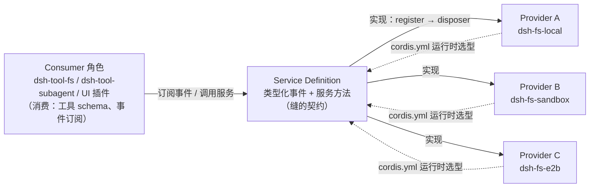
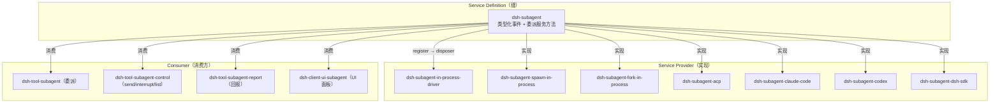

## 包与能力演进

### 总览

包体系遵循一条明确的设计模型——**能力缝（capability seam）**：一类可替换能力 = Service Definition（抽象服务）/ Service Provider（提供方实现）/ Consumer（模型侧工具等消费方）三角色，各自独立演化（决策记录：[2026-06-13-capability-seams](.agents/notes/implemented/architecture/2026-06-13-capability-seams.md)）。从 6/11 的 2 个抽象服务包起步，到 8/13 定格为 **49 个包组、219 个 workspace 包**（组级首个提交/提交数见 [包组总表](#包组总表)，统计口径见下文 [!NOTE]），每个能力都以"缝"为单位整体落位，从不只做一角。三角色的分工如下：

- **Service Definition（抽象服务）**
  : 定义类型化事件与服务方法，是"缝"的契约面——声明谁可注入、谁可监听、事件如何合并扩展（typed event declaration merging）。它只描述能力，不实现能力。
- **Service Provider（提供方实现）**
  : 通过 `ctx.effect()` / `ctx.on()` 注册实现，`register()` 返回 disposer。同一缝可挂多个 provider（本地实现、沙箱后端、云适配器），由配置（cordis.yml）选型。
- **Consumer（消费方）**
  : 把缝的能力翻译给具体消费面——模型侧工具 schema、UI 渲染、传输协议、回放/查询视图。工具 schema 的 UI render intent（`generic` / `terminal` / `diff`）也是 Consumer 的设计责任。



一个"缝"的完整性纪律在 AGENTS.md 与 packages/AGENTS.md 中被反复强调：*能力缝完整时必含三角色，只做一角即视为半成品；新行为走文档化的扩展点，改动 `agent-loop` 必须同步更新 docs/architecture.md。*

这条纪律直接塑造了包布局——打开任意一组，几乎都能在同一组目录内同时找到 seam、provider 与 tool/UI 消费方三件套。

三条结构性重组主线贯穿全程：

- **6/20 模块化层级化**：扁平 `packages/` → `<group>/<pkg>` 两级，`core` 由此诞生。
- **7/30 包重组三连**：溶解 `ui/`、更名 `sdk/` → `scaffold/`、折叠 session 家族、`timeout/` 并入 `guard/`。
- **8/13 仓库命名契约**（`a2d0f7f411`，PR #2302，3,281 个文件）：task→job、bash→shell、pty→terminal 等词汇收敛，同时把 compaction / identity / jobs / shell / terminal / test-support / runtime-diagnostics / extensions 落位为正式包组。

三次重组各自配了"重组前 → 重组后"对照表，见 [三次结构性重组](#三次结构性重组)。

> [!NOTE] 统计口径
> 本文的 **219 个 workspace 包** 指 `.analysis/workspace-packages.txt` 中全部 `@deepseek-ai/dsh-*` npm 名（实测于各 `packages/<group>/<pkg>/package.json`）；**49 个包组** 指 `packages/<group>/<pkg>` 两级目录的组级目录数，与 `.analysis/packages-first-commit.txt` 的 49 个组条目一一对应。`apps/` 下的 CLI 与 Web 应用壳不在 workspace-packages.txt 中，故不计入 219。早期文本（如本文档 8/13 前的版本）记作"44+ 组、100+ 子包"，本文按实测数据精确为 49 组 / 219 包。

> [!WARNING] 命名契约前后包名不一致
> 8/13 命名契约（`a2d0f7f411`）前后，部分包的 npm 名与目录名并不一致，引用旧文档或旧 hash 时务必核对：bash 族**组目录**已更名为 `shell/`，缝包与环境包采用新名（`dsh-bash` → `dsh-shell`、`dsh-bash-env` → `dsh-shell-env`）；而 local/sandbox provider 与命令工具**保留了旧 npm 名**——实测 `dsh-bash-local`、`dsh-bash-sandbox`、`dsh-pwsh-local`、`dsh-pwsh-sandbox`、`dsh-tool-bash`、`dsh-tool-pwsh` 至今仍存在（目录在 `packages/shell/` 下），并新增了 `dsh-tool-bash-persistent`。同理，`task` 词汇已收敛为 `job`（`dsh-jobs` 组、`dsh-tool-jobs`），`pty` 收敛为 `terminal`（`dsh-terminal` 组）。跨组前缀也有例外：`dsh-client-ui-cordis` 实际在 `extensions/` 组，`dsh-client-test-runtime` 实际在 `test-support/` 组，`dsh-token-meter` 在 `llm/` 组，`dsh-persona` 在 `preset/` 组，`dsh-headless` 在 `bundle/` 组。

> [!TIP] 阅读线索
> 读包图时按"缝"读：一个能力 = Service Definition + Provider + Consumer，三者在组内或近邻落位（如 `fs` / `fs-local` / `tool-fs`）。若某组只见一角，通常是该角色尚在演化或已被并入邻组（如 `timeout/` 7/30 并入 `guard/`）。8/13 之后，AGENTS.md 与 packages/README.md 的组表（早期文本记 44+ 组，实测 49 组）即为现行权威形态。

**包体系形态速览**（全部数字实测于 `.analysis/workspace-packages.txt` 与 `.analysis/packages-first-commit.txt`）：

| 形态 | 数值 | 说明 |
|---|---|---|
| 包组总数 | 49 | 组级目录，与 packages-first-commit.txt 条目一一对应 |
| workspace 包总数 | 219 | 全部 `@deepseek-ai/dsh-*` npm 名 |
| 单组最大 | client（39） | 占总数约 18% |
| 多子包组（5+ 包） | 12 组 / 124 包 | client、session、subagent、shell、core、host、fs、util、web、test-support、llm、interaction |
| 单包组 | 8 个 | acp、identity、mcp、plan、runtime-diagnostics、schedule、todo、workspace |
| 工具包（`dsh-tool-*`） | 22 个 | 分布在 15 个组，外加中枢 `dsh-tools` |
| 提交数前三 | client 2,241 / core 1,564 / subagent 641 | 全库提交分布（组级口径） |

命名契约（`@deepseek-ai/dsh-<pkg>` ↔ `packages/<group>/<pkg>`）在 49 组中整体成立，例外清单见文末 [附：跨组命名例外与统计校验](#附跨组命名例外与统计校验)。

---

### 包组总表

下表为 49 个包组的完整清单。首个提交/日期/提交数取自 `.analysis/packages-first-commit.txt`；子包数按 `.analysis/workspace-packages.txt` 中该组实测 npm 包计数；代表子包按组内目录列举，多余部分以"等 N 个"省略。

| 包组 | 首个提交 | 日期 | 提交数 | 子包数 | 职责（代表子包） | 关键演进 |
|---|---|---|---|---|---|---|
| acp | `fb9636db44` | 06-16 | 128 | 1 | 自动化专用 Agent Client Protocol 服务器（`acp`） | 最早的外部协议面之一 |
| api | `bb61dc13f2` | 08-07 | 69 | 2 | 远程 BFF 组装 + Typert RPC gateway（`api-gateway`、`api-remotes`） | 8/7 补齐远程面；api-remotes 是全库唯一拆分多聚合的包 |
| attachment | `cb4c11b869` | 07-23 | 36 | 2 | 持久附件身份/校验/内容寻址存储（`attachment`、`attachment-local`） | 内容寻址存储 |
| boot | `3fc35c91ff` | 07-30 | 116 | 2 | 共享 app-bin 粘合（`app-boot`、`cmdline`） | 7/30 重组三连落位 |
| bundle | `2365b2c54f` | 08-06 | 238 | 3 | 可安装的 `dsh --profile` 补丁层（`base`、`headless`、`web-app`） | 每个 profile 的第一补丁层是 `dsh-base` |
| client | `a6a3807a07` | 07-19 | 2241 | 39 | Web 浏览器半：shell、wire、对象服务、slots、ui-* 插件（`connection`、`runtime`、`modules`、`schema-form`、`web`、`web-react` 等 33 个） | 全库最大组（2,241 提交）；7/30 曾溶解旧 `ui/` 组 |
| code-runtime | `6da6f04016` | 07-08 | 125 | 2 | 代码执行能力族：seam + worker 线程 provider + Code Mode Consumer（`code-runtime`、`code-runtime-worker-thread`） | 7/8 落地 |
| compaction | `a2d0f7f411` | 08-13 | 11 | 4 | 压缩能力：seam + basic provider + 工具结果剪枝（`compaction`、`compaction-basic`、`compaction-tool-result-pruner`、`command-compact`） | 8/13 由既有代码改名/重组落地 |
| context | `a9d74932b1` | 07-14 | 309 | 4 | 模型可见请求上下文（`time-context`、`tmux-context`、`agent-instructions`、`session-reference`） | 7/14 落地 |
| core | `d02e9f1bd6` | 06-20 | 1564 | 8 | 产品 API 主轴：agent / agent-loop / session / system-prompt / tools / scope（`agent`、`agent-loop`、`session`、`system-prompt`、`tools`、`scope`、`agent-default-model`、`agent-tool-presentation`） | 6/20 模块化重组诞生；提交数全库第二 |
| credentials | `3a794495ad` | 07-29 | 68 | 2 | 凭据引用能力（`credentials`、`credentials-local`） | env-over-.env provider |
| e2b | `e7b682f1f6` | 07-28 | 71 | 3 | E2B POC：云沙箱 + FS/subprocess 适配器（`e2b`、`fs-e2b`、`subprocess-e2b`） | 7/28 的 POC 探索 |
| examples | `6f77da4c8c` | 07-15 | 392 | 3 | 演示 bundle（`agent-spine-demo`、`acp-demo`、`sdk-jsonrpc-demo`） | 与 sdk 同日诞生 |
| extensions | `4064198560`（内容）/ `a2d0f7f411`（正式组） | 08-12 / 08-13 | 28 | 4 | agent 运行时自修改：动态插件运行时与 UI（`tool-cordis`、`ui-cordis`、`cordis-client-runner`、`cordis-host-runner`） | 内容诞生于 8/12，8/13 落位正式组 |
| feedback | `0ccd3ed463` | 07-29 | 43 | 2 | 人类反馈（`command-feedback`、`message-feedback`） | 8/10 加持久后端 |
| fs | `5e01564afb` | 06-22 | 335 | 7 | 文件系统能力族：seam + local + sandbox + 观察策略（`fs`、`fs-local`、`fs-sandbox`、`fs-observation-policy`、`tool-fs`、`tool-fs-search`、`tool-str-replace-editor`） | 6/22 落地 |
| goal | `a525776015` | 07-19 | 209 | 4 | 同会话目标持久化（`goal`、`goal-round-driver`、`command-goal`、`tool-goal`） | 与 client/host 同日诞生 |
| guard | `db26ef479d` | 07-08 | 119 | 2 | 循环卫生：重复调用提醒 + 工具超时执行器（`repeat-tool-reminder`、`timeout-policy`） | 7/30 `timeout/` 并入 |
| hooks | `65165b5d54` | 07-01 | 240 | 3 | Claude Code / Codex 钩子桥 + 共享线协议库（`hook-protocol`、`hooks-claude-code`、`hooks-codex`） | 7/1 落地 |
| host | `a6a3807a07` | 07-19 | 899 | 8 | Web 宿主半：API gateway + HTTP 路由（`webserver`、`apiproxy`、`frontend-static`、`plugin-inventory`、`directory-picker` 等 3 个） | 与 client 同日诞生 |
| identity | `a2d0f7f411` | 08-13 | 10 | 1 | 匿名身份（`anonymous-user-id`） | 遥测/反馈关联 |
| interaction | `3fc35c91ff` | 07-30 | 42 | 5 | 审批/交互能力：permission、commands、ask-user（`commands`、`permission-presets`、`tool-ask-user`、`user-approval`、`user-questions`） | 7/30 重组落位 |
| jobs | `a2d0f7f411` | 08-13 | 11 | 3 | 后台任务（`jobs`、`jobs-local`、`tool-jobs`） | 8/13 task→job 词汇收敛落位 |
| llm | `d5a1d9bb75` | 06-11 | 518 | 5 | LLM 能力：Service Definition/Consumer + DeepSeek providers（`llm`、`llm-deepseek`、`llm-pi-ai`、`llm-retry`、`token-meter`） | 全库最早（与 session 并列）；ADR 0010 双实现 |
| lsp | `d0029d8d60` | 07-16 | 105 | 3 | 语言服务器能力族：seam + 通用 stdio provider + `lsp` 工具（`lsp`、`lsp-stdio`、`tool-lsp`） | 7/16 落地 |
| mcp | `1fbe7c39d4` | 07-07 | 78 | 1 | MCP 客户端（`mcp-client`） | 7/15 合入 |
| plan | `f4185122dc` | 07-22 | 110 | 1 | 计划模式作为记录状态（`plan-mode`） | 7/22 落地 |
| preset | `18fe174897` | 08-03 | 117 | 2 | 每会话 agent 组合（`agent-presets`、`persona`） | 8/3 落地 |
| runtime-diagnostics | `a2d0f7f411` | 08-13 | 10 | 1 | 运行时诊断（`invariants`） | 8/13 落位 |
| sandbox | `7b8c3a9b40` | 07-09 | 199 | 4 | 进程约束缝：bwrap / Landlock / Seatbelt 后端（`sandbox`、`sandbox-local`、`sandbox-policy`、`sandbox-windows-acl`） | 7/9 落地 |
| schedule | `a229b42e24` | 08-05 | 62 | 1 | 会话本地定时跟进（`schedule`） | durable after / 绝对时间 |
| sdk | `42b07a7022` | 07-15 | 160 | 3 | 进程外运行时 SDK：JSON-RPC 协议 + TS 客户端 + 服务器插件（`sdk-protocol`、`sdk-server`、`sdk-client`） | 7/15 落地 |
| session | `d5a1d9bb75` | 06-11 | 120 | 13 | 持久会话数据：persistence / projection / titles / telemetry（`session`、`session-persistence`、`session-persistence-jsonl`、`session-persistence-sqlite`、`session-projection`、`session-title` 等 7 个） | 7/30 折叠 12 包入组 |
| session-query | `aa1dc0e2c7` | 07-10 | 199 | 4 | 会话检索族（`session-query`、`session-query-sqlite`、`session-log-export`、`tool-session-query`） | 语料/血缘/语义过滤/FTS |
| settings | `ec0786e099` | 07-28 | 89 | 2 | 用户设置能力（`settings`、`settings-file`） | file provider |
| shell | `a2d0f7f411` | 08-13 | 14 | 9 | bash 能力：Service Definition + local/pwsh providers + shell Consumers（`shell`、`shell-env`、`bash-local`、`bash-sandbox`、`pwsh-local`、`tool-bash`、`tool-pwsh` 等 2 个） | 内容自 6/12（`8b5a3ef730`），8/13 定名 shell 族 |
| skill | `6292d52236` | 07-10 | 222 | 4 | 技能注册表 + 本地实现 + 目录/加载工具（`skill`、`skill-filesystem`、`skill-badge`、`tool-skill`） | 7/10 落地 |
| spill | `463b72ce96` | 07-08 | 80 | 3 | 工具结果溢出存储（`spill`、`spill-local`、`spill-policy`） | 7/8 落地 |
| storage | `e90b0d51df` | 07-24 | 54 | 4 | 非会话存储枢纽（`storage`、`storage-domain`、`storage-json`、`storage-sqlite`） | 7/24 落地 |
| subagent | `1a81f2cccd` | 06-21 | 641 | 11 | 子代理能力缝：Service Definition + providers + delegation Consumers（`subagent`、`subagent-in-process-driver`、`subagent-spawn-in-process`、`subagent-fork-in-process`、`subagent-acp`、`subagent-claude-code` 等 5 个） | 6/21 落地；提交数全库第三 |
| subprocess | `fc566119a7` | 07-26 | 98 | 2 | 子进程能力族 + 本地进程树 provider（`subprocess`、`subprocess-local`） | 7/26 落地 |
| terminal | `a2d0f7f411` | 08-13 | 10 | 3 | PTY 终端族（`terminal`、`terminal-bash`、`tool-terminal`） | 8/13 pty→terminal 定名 |
| test-support | `a2d0f7f411` | 08-13 | 12 | 6 | 测试支撑（`acp-snapshot`、`agent-loop-testkit`、`client-runtime`、`llm-mock-server`、`llm-replay`、`loader-smoke`） | 8/13 落位；LLM 侧测试工具在此组 |
| todo | `46e31d8481` | 06-29 | 161 | 1 | `todo_write` 模型侧工具（`tool-todo`） | 6/29 落地 |
| typert | `f773985e71` | 07-28 | 85 | 4 | 类型图生成 / 加载 / 运行时注册表（`typert-generator`、`typert-loader`、`typert-protocol`、`typert-registry`） | 7/28 落地 |
| util | `d6a2ab30c8` | 06-21 | 150 | 7 | 零依赖工具库（`brand`、`atomic-write`、`home-paths`、`launch-environment`、`native-command`、`output-retention`、`timeout`） | Branded 类型起源 |
| web | `d01f5f73b7` | 06-25 | 167 | 6 | Web 能力族：seam + 搜索/抓取 provider + 模型侧工具（`web`、`web-fetch-http`、`web-search-deepseek`、`web-search-exa`、`web-search-perplexity`、`tool-web`） | 6/25 落地 |
| workflow | `1d43ea3cd5` | 07-05 | 171 | 4 | 工作流能力：seam + worker 线程引擎 + 模型侧工具（`workflow`、`workflow-worker-thread`、`tool-workflow`、`tool-ralph`） | 7/5 落地 |
| workspace | `013e6f8769` | 07-24 | 50 | 1 | 工作区实体（`workspace`） | 7/24 落地 |

组内目录与 npm 名的一般映射规则是 `packages/<group>/<pkg>` ↔ `@deepseek-ai/dsh-<pkg>`，但存在几类实测例外，引用时以 package.json 为准：

```text
packages/<group>/<pkg>          # 目录两级
@deepseek-ai/dsh-<pkg>          # npm 名（规则形态）
dsh-bash-local                  # 例外：目录 shell/bash-local，保留旧名
dsh-client-ui-cordis            # 例外：目录 extensions/ui-cordis，带 client- 前缀
dsh-client-test-runtime         # 例外：目录 test-support/client-runtime，带 client- 前缀
dsh-token-meter                 # 例外：目录 llm/token-meter，无 llm- 前缀
dsh-persona / dsh-headless      # 例外：目录 preset/persona、bundle/headless
```

按子包数分布看，包体系呈"两头重"结构（合计校验：49 组、219 包，见文末附节）：

- **`client`（39）单组独占近 1/5**（39/219 ≈ 18%），是全库唯一的巨型组。
- **多子包组（5 个包以上）共 12 个**：client（39）、session（13）、subagent（11）、shell（9）、core（8）、host（8）、fs（7）、util（7）、web（6）、test-support（6）、llm（5）、interaction（5），合计 124 包。
- **其余 37 组为 1–4 个包的"小而整"形态**（合计 95 包，均值约 2.6）——这与"一个能力 = 一个缝 = 少数几个角色包"的设计一致。

多子包组往往意味着该领域已被拆成多个并列角色：session 是持久化/投影/标题/遥测四个角色族，subagent 是 provider 多样化（进程内三形态 + 四个外部适配器），shell 是双壳双后端 + 三个工具，client 则是 31 个 ui-* 插件加 8 个基础设施包。

---

### 按领域分节

下面按领域把 49 个组重新组织为 12 节。每节给出：诞生信息、子包清单表、3–6 个关键里程碑（commit hash + 日期 + 主题）、一段演进要点。领域与包组的对应关系速查如下：

| 领域（节） | 覆盖包组 |
|---|---|
| 1. 核心循环 | core（8 包） |
| 2. LLM 族 | llm、test-support（llm-replay / llm-mock-server） |
| 3. 工具层 | 22 个 `dsh-tool-*` + 中枢 `dsh-tools`（15 个组） |
| 4. 执行与沙箱 | shell、subprocess、code-runtime、sandbox、terminal、e2b |
| 5. 文件与 LSP | fs、lsp |
| 6. 会话数据 | session、session-query、storage、workspace、attachment、spill |
| 7. 子代理与编排 | subagent、workflow、jobs、goal、schedule、plan |
| 8. 技能与上下文 | skill、context、preset（persona）、llm（token-meter） |
| 9. 安全与治理 | guard、sandbox、interaction、credentials、settings、identity |
| 10. Web GUI 两半 | client、host、web、interaction |
| 11. 外部协议 | sdk、acp、hooks、mcp、examples |
| 12. 发布与自举 | bundle、boot、api、typert、extensions、test-support、util、runtime-diagnostics |

同一包组可能出现在多个领域（如 test-support 同时服务 LLM 测试与发布质量门、interaction 同时服务安全与 GUI 命令面），上表取主视角归属。

#### 1. 核心循环（core/*）

**诞生**：`core` 组诞生于 6/20 的模块化层级重组（`d02e9f1bd6` "Reorganize packages into a modular hierarchy"），把此前扁平落位的产品 API 包收拢为 `packages/core/`。它是全库提交数第二的组（1,564 提交，仅次于 client 的 2,241）。

| 子包 | 职责 |
|---|---|
| `agent` | Agent 接口与注册表 |
| `agent-loop` | 默认驱动，唯一具体 loop 且可替换 |
| `agent-default-model` | 默认模型选择 |
| `agent-tool-presentation` | 工具向模型的表现层（schema 呈现） |
| `session` | 会话类型与日志接口（core 层） |
| `system-prompt` | 系统提示词组装 |
| `tools` | 作用域化工具注册表与守卫执行管线 |
| `scope` | 每 agent 作用域注册原语 |

**关键里程碑**：

- **`d02e9f1bd6`（06-20）**：模块化层级重组，`core` 组诞生；次日 `d6a2ab30c8` 抽出 `dsh-brand`（util 组首个包，Branded 类型起源）。
- **7/30 折叠**（`7e445c3a67`）：session 家族 12 包折叠入 `packages/session/`，core 层的 `session` 保持"会话类型与日志接口"，持久层职责移出。
- **`a2d0f7f411`（08-13）**：命名契约把 task→job 等词汇收敛进 agent-loop / tools 的契约面；此后 AGENTS.md 规定"改动 `agent-loop` 必须同步更新 docs/architecture.md"。
- **8/13 发布系列**：`1e99f20963` → `abe560f81e` 之间 core 随全库经历 `0.0.1-rc.3` → `0.1.0-rc.5` 七个 rc 发布（详见 [发布与自举](#12-发布与自举bundlebootapitypertextensionstest-supportutilruntime-diagnostics)）。

**演进要点**：core 是"产品 API 主轴"——`agent` 定义 Agent 是什么，`agent-loop` 定义默认的驱动循环（唯一具体 loop，可整体替换），`session` 定义模型可见状态如何被记录（"模型可见 ⟺ 已记录"契约），`tools` 定义工具如何被作用域化注册并由守卫管线执行，`scope` 提供每 agent 的注册原语。它不直接产生能力，而是所有能力的挂载点；因此 AGENTS.md 明令"新行为走文档化扩展点，不改 agent-loop"。

---

#### 2. LLM 族（llm/* 与 LLM 侧 test-support）

**诞生**：`llm` 是**全库最早的两个包组之一**（与 `session` 并列），首个提交 `d5a1d9bb75`（06-11），从"抽象服务接口包（LLM 流词汇、session 日志）"起步。提交数 518。

| 子包 | 职责 |
|---|---|
| `llm` | provider 中立消息/流词汇 + 适配器缝（Service Definition） |
| `llm-deepseek` | DeepSeek 真实适配器 provider |
| `llm-pi-ai` | pi-ai 真实适配器 provider |
| `llm-retry` | 重试策略 |
| `token-meter` | replay-aware token 计量服务（`ctx.tokenMeter`） |
| `llm-replay`（test-support 组） | 无 key 的请求回放 |
| `llm-mock-server`（test-support 组） | 本地 mock 服务器 |

**关键里程碑**：

- **`d5a1d9bb75`（06-11）**：llm 与 session 同日首提交，2 个抽象服务包起步。
- **ADR 0010 双实现**（6 月）：第一天就上 `deepseek` 与 `pi-ai` 两个真实适配器，以验证"中性"词汇——避免单一实现把自家怪癖写进契约（现有章节明确记载）。
- **`a5a83bd1d9`（08-13）**：`fix(llm-pi-ai): withhold OAuth-only providers from the configurable directory`——pi-ai 侧把仅 OAuth 的 provider 从可配置目录中隐藏。
- **`a2d0f7f411`（08-13）**：命名契约；同日起 `llm-replay` / `llm-mock-server` 归入 test-support 组（LLM 侧测试工具不在 llm 组内，属跨组事实）。
- **`8c1e8d9890`（08-13）**：dsh 家族公开发布，llm 系包以 `0.1.0-rc.5` 公开。

**演进要点**：llm 组的演进主线是"词汇中性化"——先有 provider 中立词汇（消息/流），再双实现验证，随后补重试与 token 计量；测试侧用 mock-server 与 replay 支撑无 key 的确定性验证（test:snapshot 机制）。`token-meter` 的"replay-aware"定位说明 token 计量必须与回放路径一致，才能保证快照可复现。

---

#### 3. 工具层（dsh-tools 与全部 dsh-tool-*）

**诞生**：工具注册表 `dsh-tools` 随 core 诞生（`d02e9f1bd6`，06-20）；第一个独立工具包是 `todo`（`46e31d8481`，06-29，`todo_write`）。此后每个能力缝都以"模型侧工具 Consumer"为第三角落地，形成 22 个 `dsh-tool-*` 包 + 1 个中枢，分布在 14 个组中。

| 工具包 | 所在组 | 能力 |
|---|---|---|
| `dsh-tools` | core | 作用域化工具注册表与守卫执行管线（工具层中枢，非 tool-* 前缀） |
| `dsh-tool-ask-user` | interaction | 向用户提问并等待回答 |
| `dsh-tool-bash` | shell | 执行一次 bash 命令 |
| `dsh-tool-bash-persistent` | shell | 在持久 bash 会话中执行 |
| `dsh-tool-call-timeout-policy` | guard | 工具调用超时策略：tools/execute 包装，在 exec.signal 上设置 per-tool 期限，超时返回 TOOL_TIMEOUT |
| `dsh-tool-cordis` | extensions | 自指 Cordis 插件定义/挂载/卸载（`cordis_define` 工具） |
| `dsh-tool-fs` | fs | 模型侧文件系统工具 |
| `dsh-tool-fs-search` | fs | 文件搜索工具 |
| `dsh-tool-goal` | goal | 同会话目标工具 |
| `dsh-tool-jobs` | jobs | 后台任务工具 |
| `dsh-tool-lsp` | lsp | 语言服务器工具 |
| `dsh-tool-pwsh` | shell | 执行 PowerShell 命令 |
| `dsh-tool-ralph` | workflow | Ralph 新鲜代理迭代循环工具 |
| `dsh-tool-session-query` | session-query | 会话检索工具 |
| `dsh-tool-skill` | skill | 技能目录/加载工具 |
| `dsh-tool-str-replace-editor` | fs | 字符串替换编辑器工具 |
| `dsh-tool-subagent` | subagent | 委派子代理（delegation Consumer） |
| `dsh-tool-subagent-control` | subagent | 续谈控制：`send_message` / `interrupt_agent` / `list_agents`（实测 package.json 描述） |
| `dsh-tool-subagent-report` | subagent | 子代理结果回报（`report` 工具） |
| `dsh-tool-terminal` | terminal | 持久终端工具 |
| `dsh-tool-todo` | todo | `todo_write` 任务清单 |
| `dsh-tool-web` | web | Web 搜索/抓取工具 |
| `dsh-tool-workflow` | workflow | 工作流编排工具 |

**关键里程碑**：

- **`46e31d8481`（06-29）**：`todo_write` 落地，第一个独立工具包。
- **`db26ef479d`（07-08）**：guard 组诞生，工具执行管线开始有"守卫"（重复调用提醒、超时执行器）。
- **`2a40cbf8ef`（07-30）**：`timeout/` 并入 `guard/`，超时策略固化为工具执行的横切能力（今日 `dsh-tool-call-timeout-policy`）。
- **`a2d0f7f411`（08-13）**：task→job 词汇收敛（`tool-jobs` 定名）、bash→shell（`tool-bash` / `tool-pwsh` 保留旧名，新增 `tool-bash-persistent`）。

**演进要点**：工具层遵循"一个能力缝 → 一个模型侧工具"的配对律，工具包与被消费的缝同组相邻（`tool-fs` 在 fs 组、`tool-subagent` 在 subagent 组）。工具的 UI render intent（`generic` / `terminal` / `diff`）在设计期决定，呈现方法是 `args` 的纯函数；这些纪律把"工具"从一次性脚本提升为一等公民包。

工具不是孤立存在的——它们与能力缝、UI 消费方构成"缝 → 工具 → UI"三级配对，下表给出三个典型配对（包名均为实测）：

| 能力缝（Seam） | 模型侧工具（Tool Consumer） | UI 消费方（UI Consumer） |
|---|---|---|
| `dsh-subagent` | `dsh-tool-subagent` / `dsh-tool-subagent-control` / `dsh-tool-subagent-report` | `dsh-client-ui-subagent` |
| `dsh-fs` | `dsh-tool-fs` / `dsh-tool-fs-search` / `dsh-tool-str-replace-editor` | `dsh-client-ui-workspace`、`dsh-client-ui-attachment` |
| `dsh-skill` | `dsh-tool-skill` | `dsh-client-ui-skill` |

一个缝可以同时服务多个工具与多个 UI 面；反过来，一个工具只属于一个缝（没有"缝合怪"工具）。这条"配对律"是 8/13 之后包布局自查的第一条经验法则。

---

#### 4. 执行与沙箱（shell / subprocess / code-runtime / sandbox / terminal / e2b）

**诞生**：执行面按"粒度"分三层演进——命令层（bash 缝 `8b5a3ef730`，06-12）、进程层（subprocess `fc566119a7`，07-26）、代码层（code-runtime `6da6f04016`，07-08）；约束面有 sandbox（`7b8c3a9b40`，07-09）与 E2B 云沙箱 POC（`e7b682f1f6`，07-28）；交互面有 PTY 终端族（terminal，8/13 定名）。

| 组 | 子包 | 职责 |
|---|---|---|
| shell（原 bash） | `shell`、`shell-env` | bash 能力缝 + 环境变量注入 |
| shell | `bash-local`、`bash-sandbox`、`pwsh-local`、`pwsh-sandbox` | local/sandbox 双后端 × bash/pwsh 双壳 |
| shell | `tool-bash`、`tool-bash-persistent`、`tool-pwsh` | 一次性/持久会话/ PowerShell 三个模型侧工具 |
| subprocess | `subprocess`、`subprocess-local` | 子进程能力族 + 本地进程树 provider |
| code-runtime | `code-runtime`、`code-runtime-worker-thread` | 代码执行 seam + worker 线程 provider |
| sandbox | `sandbox`、`sandbox-local`、`sandbox-policy`、`sandbox-windows-acl` | 进程约束缝 + 策略 + Windows ACL 后端 |
| terminal | `terminal`、`terminal-bash`、`tool-terminal` | 持久 PTY 终端族 |
| e2b | `e2b`、`fs-e2b`、`subprocess-e2b` | E2B 云沙箱 + FS/subprocess 适配器 |

**关键里程碑**：

- **`8b5a3ef730`（06-12）**：bash 执行接缝三件套（seam + local 实现 + 模型侧工具），全库第一个"执行类"缝。
- **`7b8c3a9b40`（07-09）**：sandbox 进程约束缝，bwrap / Landlock / Seatbelt 后端。
- **`fc566119a7`（07-26）**：subprocess 能力族，本地进程树 provider。
- **`e7b682f1f6`（07-28）**：E2B POC，把 fs 与 subprocess 适配到云沙箱。
- **`c29246ae31`（08-12）**：`fix(pwsh): resolve Store app execution aliases`；次日 `29d420f1ee` 补 `fix(pwsh): accept link-shaped candidates and sync the README contract`——pwsh 侧持续打磨 Windows 下的可执行文件解析。
- **`a2d0f7f411`（08-13）**：pty→terminal 词汇收敛，terminal 组定名。

**演进要点**：执行层是"能力缝"纪律贯彻最彻底的领域之一——`dsh-shell` 的 request/spec 拆分（显式 `resolve(request): Spec`，绝不在 `run()` 内隐藏默认值）被 AGENTS.md 树为包边界的模板。沙箱侧从 Linux 三后端扩展到 Windows ACL，cloud 侧以 E2B POC 探路；命名契约后"bash 族"以 shell 组形态存在，但 provider 子包保留了 `dsh-bash-*` / `dsh-pwsh-*` 旧 npm 名（见总览 [!WARNING]）。

---

#### 5. 文件与 LSP（fs/*、lsp/*）

**诞生**：fs 能力族 `5e01564afb`（06-22），lsp 能力族 `d0029d8d60`（07-16）。fs 提交数 335，lsp 105。

| 组 | 子包 | 职责 |
|---|---|---|
| fs | `fs` | 文件系统 seam（Service Definition） |
| fs | `fs-local` | 本地文件系统实现 |
| fs | `fs-sandbox` | 沙箱后端 |
| fs | `fs-observation-policy` | 文件观察策略 |
| fs | `tool-fs`、`tool-fs-search`、`tool-str-replace-editor` | 文件工具、搜索工具、字符串替换编辑器工具 |
| lsp | `lsp` | 语言服务器能力族 seam |
| lsp | `lsp-stdio` | 通用 stdio provider |
| lsp | `tool-lsp` | `lsp` 模型侧工具 |

**关键里程碑**：

- **`5e01564afb`（06-22）**：fs 能力族诞生（seam + local + sandbox + 观察策略）。
- **`d0029d8d60`（07-16）**：lsp 能力族诞生（seam + 通用 stdio provider + `lsp` 工具）。
- **`0c708cb10d`（07-24）**：`refactor: replace overloaded surface terminology`（fs 路径上的表面术语清理）。
- **`a2d0f7f411`（08-13）**：命名契约同步 fs/lsp 词汇；两族以 0.1.0-rc 系列随全库发布。

**演进要点**：fs 是"策略与实现分离"的样板——读写能力归 seam，观察策略独立成包（`fs-observation-policy`），沙箱约束独立成后端，工具侧再按交互形态拆成读写工具、搜索工具、字符串替换编辑器三个 Consumer（后者体现"工具的 UI render intent 是设计的一部分"）。lsp 则验证"通用 stdio provider"模式：一个协议适配器可服务多个语言服务器。

---

#### 6. 会话数据（session/*、session-query/*、storage、workspace、attachment、spill）

**诞生**：会话日志接口与 session 组同源（`d5a1d9bb75`，06-11，全库最早）；spill 溢出存储 `463b72ce96`（07-08）；会话检索族 `aa1dc0e2c7`（07-10）；附件 `cb4c11b869`（07-23）；存储枢纽 `e90b0d51df` 与工作区 `013e6f8769`（07-24）；7/30 折叠把 session 家族 12 包并为 `packages/session/` 一组。

| 组 | 子包 | 职责 |
|---|---|---|
| session | `session` | 会话日志格式与版本机制（`SESSION_FORMAT_VERSION`） |
| session | `session-persistence`、`session-persistence-jsonl`、`session-persistence-sqlite` | 持久化双后端 |
| session | `session-projection`、`session-projection-cache` | 投影 + 缓存 |
| session | `session-title`、`session-title-llm`、`session-title-first-prompt-llm`、`session-title-all-prompts-llm` | 标题三种策略 |
| session | `session-telemetry`、`session-telemetry-otel` | 遥测 + OpenTelemetry 后端 |
| session | `session-stats`、`session-checkpoint-policy` | 统计、检查点策略 |
| session-query | `session-query`、`session-query-sqlite`、`session-log-export`、`tool-session-query` | 语料/血缘/语义过滤/FTS 检索族 + 导出 + 工具 |
| storage | `storage`、`storage-domain`、`storage-json`、`storage-sqlite` | 非会话存储枢纽（域/格式/后端） |
| workspace | `workspace` | 工作区实体 |
| attachment | `attachment`、`attachment-local` | 持久附件身份/校验/内容寻址 |
| spill | `spill`、`spill-local`、`spill-policy` | 工具结果溢出存储 |

**关键里程碑**：

- **`d5a1d9bb75`（06-11）**：session 与 llm 同日首提交（抽象服务接口包）。
- **`7e445c3a67`（07-30）**：`fold the session family into packages/session/`——session 家族 12 包折叠为一组（persistence / projection / titles / telemetry 等角色族）。
- **`aa1dc0e2c7`（07-10）**：session-query 检索族落地（199 提交）。
- **`62a437c082`（08-12）**：`review: address ds-review-bot findings on session-stats`——session-stats 包在发布前经受评审打磨。
- **`a2d0f7f411`（08-13）**：命名契约；`SESSION_FORMAT_VERSION` 保持 0 且无兼容承诺，SQLite 用单调 `SCHEMA_VERSION`。

**演进要点**：会话数据层贯彻"模型可见 ⟺ 已记录"铁律——任何到达模型请求的输入都必须能从会话日志重建。持久化走双后端（jsonl / sqlite），投影负责派生视图，telemetry 走 OpenTelemetry，标题给出三种 LLM 策略，检索族提供语料、血缘、语义过滤与 FTS 四类能力。7/30 折叠把 12 个角色包收拢为一组，是"组内多角色"形态的极致样本（13 子包，全库第二多）。

**需要区分两个 "session"**：`packages/core/session`（`dsh-session`）是会话类型与日志接口——定义 `SessionEventMap`、`SESSION_FORMAT_VERSION` 等契约，属于产品 API 主轴；`packages/session/`（session 组，13 包）是持久会话数据的实现面——persistence / projection / titles / telemetry 等角色族。7/30 折叠把后者的 12 个包收拢为一组，而 core 层的接口包保持原位。搜索代码或文档时，"dsh-session" 指 core 层接口，"session 组"指持久化实现面。

---

#### 7. 子代理与编排（subagent/*、workflow/*、jobs、goal、schedule、plan）

**诞生**：subagent 能力缝 `1a81f2cccd`（06-21，registry + provider + model-facing tool 三件套，641 提交，全库第三）；workflow `1d43ea3cd5`（07-05）；goal `a525776015`（07-19，与 GUI 同日）；plan `f4185122dc`（07-22）；schedule `a229b42e24`（08-05）；jobs 8/13 随 task→job 词汇落位。

| 组 | 子包 | 职责 |
|---|---|---|
| subagent | `subagent` | 子代理能力缝（Service Definition） |
| subagent | `subagent-in-process-driver`、`subagent-spawn-in-process`、`subagent-fork-in-process` | 进程内三形态 driver |
| subagent | `subagent-acp`、`subagent-claude-code`、`subagent-codex`、`subagent-dsh-sdk` | 外部代理适配器（ACP / Claude Code / Codex / dsh SDK） |
| subagent | `tool-subagent`、`tool-subagent-control`、`tool-subagent-report` | 委派、续谈控制、结果回报三个工具 |
| workflow | `workflow`、`workflow-worker-thread`、`tool-workflow`、`tool-ralph` | 工作流 seam + worker 线程引擎 + 工作流/Ralph 工具 |
| goal | `goal`、`goal-round-driver`、`command-goal`、`tool-goal` | 同会话目标持久化 + 轮驱动 + 命令/工具 |
| jobs | `jobs`、`jobs-local`、`tool-jobs` | 后台任务 + 本地实现 + 工具 |
| plan | `plan-mode` | 计划模式作为记录状态（登录的 plan 协作状态） |
| schedule | `schedule` | 会话本地定时跟进（durable after / 绝对时间） |

**关键里程碑**：

- **`1a81f2cccd`（06-21）**：subagent 三件套落地（registry + provider + model-facing tool），6 月即确立"委派"能力缝。
- **`1d43ea3cd5`（07-05）**：workflow 能力：seam + worker 线程引擎 + 模型侧工具。
- **`f4185122dc`（07-22）**：plan 模式作为记录状态落地（plan 协作状态进会话日志）。
- **`a229b42e24`（08-05）**：schedule 会话本地定时（durable after / 绝对时间）。
- **`095fde4ffd`（08-12）**：`test(claude-code): isolate ambient Anthropic model env`——claude-code 适配器测试与外界模型环境隔离。
- **`a2d0f7f411`（08-13）**：task→job 词汇收敛，jobs 组落位。

**演进要点**：subagent 是"provider 多样化"的极致——进程内三形态（in-process driver / spawn / fork）加四个外部适配器（ACP / Claude Code / Codex / dsh SDK），工具侧拆出委派、控制、回报三个 Consumer。编排层则各司其职：workflow 管多代理脚本化编排（含 worker 线程 provider 与 Ralph 工具），goal 管同会话目标持久化，jobs 管后台任务，schedule 管定时跟进，plan 把"计划"做成记录状态而非运行时模式——这是"状态入日志"纪律在编排面的体现。

---

#### 8. 技能与上下文（skill/*、context、persona、token-meter）

**诞生**：skill 能力族 `6292d52236`（07-10，技能注册表 + 本地实现 + 目录/加载工具）；context 请求上下文 `a9d74932b1`（07-14）；persona 随 preset 组诞生（`18fe174897`，08-03）。

| 组 | 子包 | 职责 |
|---|---|---|
| skill | `skill` | 技能注册表（Service Definition） |
| skill | `skill-filesystem` | 本地技能文件系统实现 |
| skill | `skill-badge` | 技能徽章 |
| skill | `tool-skill` | 技能目录/加载工具 |
| context | `time-context`、`tmux-context` | 时间上下文、tmux 上下文 |
| context | `agent-instructions` | 工作区指令 |
| context | `session-reference` | 会话引用上下文 |
| preset | `agent-presets`、`persona` | 每会话 agent 组合、部署人设（persona 实为 preset 组包） |
| llm | `token-meter` | token 计量服务（replay-aware，跨组引用） |

**关键里程碑**：

- **`6292d52236`（07-10）**：skill 三件套落地（注册表 + 本地实现 + 目录/加载工具），222 提交。
- **`a9d74932b1`（07-14）**：context 落地（模型可见请求上下文：工作区指令、时间上下文），309 提交。
- **`18fe174897`（08-03）**：preset 落地——每会话 agent 组合（preset cordis.yml），persona 作为组合产物同组收纳。
- **`a2d0f7f411`（08-13）**：命名契约；技能目录与文档站（docs/skills）对齐。

**演进要点**：技能与上下文共同回答"模型每次看到什么"。skill 侧是典型三件套（registry / impl / tool）；context 侧按来源拆包（时间、tmux 会话、工作区指令、会话引用），全部是"模型可见输入"，因此必须与会话日志联动（"新的模型可见输入需要 session 事件"）。persona 与 agent-presets 同属 preset 组——人设不是独立能力，而是"每会话 agent 组合"的产物；token-meter 则因计量依赖 LLM 流词汇而驻留 llm 组，两处均为跨组命名例外的实证。

---

#### 9. 安全与治理（guard、sandbox-policy、permission-presets、credentials、settings、identity）

**诞生**：guard 循环卫生 `db26ef479d`（07-08）；sandbox 策略随 sandbox 组（`7b8c3a9b40`，07-09）；credentials `3a794495ad`（07-29）；settings `ec0786e099`（07-28）；interaction 组（含 permission-presets）7/30 落位（`3fc35c91ff`）；identity 8/13 落位。

| 组 | 子包 | 职责 |
|---|---|---|
| guard | `repeat-tool-reminder` | 重复调用提醒（循环卫生） |
| guard | `timeout-policy` | 工具调用超时策略（`dsh-tool-call-timeout-policy`） |
| sandbox | `sandbox-policy`、`sandbox-windows-acl` | 进程约束策略 + Windows ACL 后端 |
| interaction | `permission-presets` | 权限预设 |
| interaction | `user-approval`、`tool-ask-user`、`user-questions`、`commands` | 审批、提问、问询、命令 |
| credentials | `credentials`、`credentials-local` | 凭据引用（env-over-.env provider） |
| settings | `settings`、`settings-file` | 用户设置能力 + file provider |
| identity | `anonymous-user-id` | 匿名身份（遥测/反馈关联） |

**关键里程碑**：

- **`db26ef479d`（07-08）**：guard 组诞生——循环卫生（重复调用提醒、工具超时执行器）。
- **`7b8c3a9b40`（07-09）**：sandbox 进程约束缝，策略与后端分层（policy 独立成包）。
- **`2a40cbf8ef`（07-30）**：`timeout/` 并入 `guard/`，超时从独立组收敛为执行管线守卫。
- **`3a794495ad`（07-29）**：credentials 凭据引用（env-over-.env），密钥不进会话日志。
- **`a2d0f7f411`（08-13）**：identity 落位；AGENTS.md 定下"Never commit credentials"与 CI e2e 无 key 自跳过的纪律。

**演进要点**：安全与治理是"分层而非单点"的：循环卫生在 guard（超时、重复提醒），进程约束在 sandbox（策略 + 后端），授权交互在 interaction（permission-presets、user-approval），凭据在 credentials（引用而非明文），用户偏好与身份在 settings / identity。这些包几乎都不产生模型可见的新能力，而是约束既有能力——与"注册即副作用、守卫执行管线"的架构取向一致。

---

#### 10. Web GUI 两半（client/*、host/*、web/*、interaction）

**诞生**：7/19 的 GUI 骨架提交 `a6a3807a07` 一次创建 `apps/web`、`apps/cli` 与 `packages/client`、`packages/host`——浏览器半（client，2,241 提交，全库最大）与宿主半（host，899 提交）自此并行增长；goal 同日诞生（`a525776015`）。web 能力族更早（`d01f5f73b7`，06-25）。配套四篇 GUI 设计笔记（分层与 RPC 协议、web 客户端架构、样式系统、测试系统）。

| 组 | 子包 | 职责 |
|---|---|---|
| client | `connection`、`runtime`、`modules`、`hmr`、`locale`、`schema-form` | 浏览器半基础设施（wire、运行时、模块、热更新、本地化、表单） |
| client | `web`、`web-react` | 渲染壳（Web + React 绑定） |
| client | `ui-*`（31 个插件） | 见下方 ui-* 全表 |
| host | `webserver`、`apiproxy`、`frontend-static` | 宿主半核心（HTTP 路由、API 代理、静态前端） |
| host | `plugin-inventory`、`directory-picker`、`directory-picker-auto/browse/native` | 插件清单、目录选择器三形态 |
| web | `web`、`web-fetch-http`、`web-search-deepseek`、`web-search-exa`、`web-search-perplexity`、`tool-web` | Web 能力族（seam + fetch/搜索 provider + 工具） |
| interaction | `commands`、`user-questions` | 命令面与问询面（GUI 消费方） |

client 组 31 个 `ui-*` 插件全表（另有 `ui-cordis` 在 extensions 组）：

| ui-* 插件 | 职责（按名） |
|---|---|
| `ui-agent-preset`、`ui-settings`、`ui-settings-general`、`ui-settings-models`、`ui-settings-plugins`、`ui-settings-plugin-inventory` | agent 预设与设置面板族 |
| `ui-conversation`、`ui-message-feedback`、`ui-input-trigger`、`ui-trajectory` | 对话、反馈、输入触发、轨迹 |
| `ui-subagent`、`ui-goal`、`ui-plan`、`ui-jobs`、`ui-workflow-run`、`ui-skill` | 子代理/目标/计划/任务/工作流/技能面板 |
| `ui-permission-presets`、`ui-user-questions` | 权限预设、问询 |
| `ui-attachment`、`ui-workspace`、`ui-deliverables`、`ui-directory-picker-browse`、`ui-directory-picker-native` | 附件、工作区、交付物、目录选择器 |
| `ui-layout`、`ui-sidebar`、`ui-slots`、`ui-primitives`、`ui-theme`、`ui-tool`、`ui-model-selection`、`ui-commands`、`ui-cordis`（extensions 组） | 布局、侧栏、插槽系统、原语、主题、工具卡片、模型选择、命令、Cordis 动态插件卡片 |

**关键里程碑**：

- **`a6a3807a07`（07-19）**：GUI 骨架提交——一次创建 `apps/web`、`apps/cli` 与 `packages/client`、`packages/host`。
- **`3fc35c91ff`（07-30）**：`dissolve ui/ and rename sdk/ to scaffold/`——溶解旧 `ui/` 组（当时 ui/ 语义与今日 client 组不同），client 组成为浏览器半唯一归属。
- **`fc90114ad9`（08-13）**：`fix(web): add English onboarding copy`；同日 `0f1c29c751` `test(web): cover onboarding branches`——上线前补齐引导流程与覆盖。
- **`8c1e8d9890`（08-13）**：dsh 家族公开发布，GUI 两半随 `0.1.0-rc.5` 公开。

**演进要点**：GUI 采用"两半"架构——浏览器半（client）承载 shell、wire、对象服务、slots 与 ui-* 插件，宿主半（host）承载 API gateway 与 HTTP 路由，中间以 RPC 协议沟通（四篇 GUI 设计笔记分别记录分层与 RPC 协议、web 客户端架构、样式系统、测试系统）。ui-* 插件 31+1 个按功能域拆分（设置族、会话族、编排族、文件族、壳族），与后端能力缝一一呼应（ui-subagent ↔ tool-subagent ↔ subagent seam 是"缝"在 UI 面的第三角）。

---

#### 11. 外部协议（sdk/*、acp/*、hooks/*、mcp）

**诞生**：acp `fb9636db44`（06-16，最早的协议面之一）；hooks `65165b5d54`（07-01）；mcp `1fbe7c39d4`（07-07，7/15 合入）；sdk `42b07a7022`（07-15）与 examples `6f77da4c8c`（07-15）同日。

| 组 | 子包 | 职责 |
|---|---|---|
| sdk | `sdk-protocol`、`sdk-server`、`sdk-client` | JSON-RPC 协议、服务器插件、TS 客户端（进程外运行时 SDK） |
| acp | `acp` | 自动化专用 Agent Client Protocol 服务器 |
| hooks | `hook-protocol` | 共享线协议库（Claude Code / Codex 钩子桥的公共部分） |
| hooks | `hooks-claude-code`、`hooks-codex` | Claude Code / Codex 钩子桥 |
| mcp | `mcp-client` | MCP 客户端 |
| examples | `agent-spine-demo`、`acp-demo`、`sdk-jsonrpc-demo` | 三个演示 bundle（agent spine + CLI/ACP/JSON-RPC bins） |

**关键里程碑**：

- **`fb9636db44`（06-16）**：ACP 服务器落地（自动化专用 Agent Client Protocol）。
- **`65165b5d54`（07-01）**：hooks 落地——Claude Code / Codex 钩子桥 + 共享线协议库。
- **`1fbe7c39d4`（07-07）**：MCP 客户端（7/15 合入）。
- **`42b07a7022`（07-15）**：sdk 落地——JSON-RPC 协议 + TS 客户端 + 服务器插件；同日 examples 落地。
- **`3fc35c91ff`（07-30）**：`rename sdk/ to scaffold/`——早期" sdk "语义与今日进程外 SDK 不同，7/30 更名后今日 sdk 组为进程外运行时 SDK（历史语义澄清）。

**演进要点**：外部面共有四条协议线——ACP（自动化）、JSON-RPC SDK（进程外运行时）、Claude Code / Codex hooks（钩子桥）、MCP（客户端接入）。hooks 组把"线协议"抽成独立包（`hook-protocol`），两个桥各自适配；sdk 的语义在 7/30 经历过一次"改名澄清"（旧 sdk/ → scaffold/），提醒读者注意 7/30 之前文档中的 "sdk" 指代不同对象。

---

#### 12. 发布与自举（bundle/*、boot、api/*、typert/*、extensions、test-support、util、runtime-diagnostics）

**诞生**：util `d6a2ab30c8`（06-21，全库最早的工具库）；typert `f773985e71`（07-28）；boot / interaction 7/30 落位（`3fc35c91ff`）；extensions 内容诞生 8/12（`4064198560`）、8/13 正式落位；bundle `2365b2c54f`（08-06）；api `bb61dc13f2`（08-07）。

| 组 | 子包 | 职责 |
|---|---|---|
| util | `brand`、`atomic-write`、`home-paths`、`launch-environment`、`native-command`、`output-retention`、`timeout` | 零依赖工具库（Branded 类型、原子写、路径、启动环境、原生命令、输出保留、超时原语） |
| boot | `app-boot`、`cmdline` | 共享 app-bin 粘合、命令行入口 |
| bundle | `base`、`headless`、`web-app` | 可安装 profile 补丁层：base 为每个 profile 的第一补丁层，headless 为无 Host/HTTP/浏览器的一次性 runner，web-app 为浏览器面补丁层 |
| api | `api-gateway`、`api-remotes` | 远程 BFF 组装 + Typert RPC gateway |
| typert | `typert-generator`、`typert-loader`、`typert-protocol`、`typert-registry` | 类型图生成、加载、协议、运行时注册表 |
| extensions | `tool-cordis`、`ui-cordis`、`cordis-client-runner`、`cordis-host-runner` | agent 自修改：动态插件定义工具、UI 卡片、双端 runner |
| test-support | `acp-snapshot`、`agent-loop-testkit`、`client-runtime`、`llm-mock-server`、`llm-replay`、`loader-smoke` | 无 key 快照、loop 测试套件、jsdom 插槽运行时、mock/replay、加载冒烟 |
| runtime-diagnostics | `invariants` | 运行时不变量（事件/数据关系断言） |

**关键里程碑**：

- **`d6a2ab30c8`（06-21）**：`dsh-brand` 抽出（util 组首个包）——Branded 类型成为跨边界 id 的标准。
- **`3fc35c91ff`（07-30）**：boot / interaction 等组随重组三连落位。
- **`f773985e71`（07-28）**：typert 落地——类型图生成/加载/运行时注册表，为 api 的 RPC gateway 提供类型基础。
- **`2365b2c54f`（08-06）**：bundle 落地——可安装的 `dsh --profile` 补丁层。
- **`bb61dc13f2`（08-07）**：api 落地——远程 BFF 组装 + Typert RPC gateway。
- **8/13 发布当日序列**（全部实测于 git log）：
  - [x] `1e99f20963` — release(dsh): 0.0.1-rc.3
  - [x] `a90d9af1b2` — release(dsh): 0.0.1-rc.4
  - [x] `3e8a1cfa33` — release(dsh): 0.0.1-rc.5
  - [x] `c905c4694e` — Adopt MIT for DSH packages
  - [x] `22ab3beac1` — release(dsh): 0.1.0-rc.1
  - [x] `60b04b6ef7` — release(dsh): 0.1.0-rc.2
  - [x] `8a954b2eca` — release(dsh): 0.1.0-rc.3
  - [x] `a213befd0f` — build(release): publish the vendored framework and the native packages publicly
  - [x] `8c1e8d9890` — build(release): publish the dsh family publicly
  - [x] `abe560f81e` — release(dsh): 0.1.0-rc.5

**演进要点**：这组回答"harness 如何发布自己"。自举链自底向上：util 提供零依赖原语 → typert 生成类型图 → api 组装远程 BFF → bundle 把整套组合成可安装的 profile 补丁层（base 是每个 profile 的第一层，headless 是免浏览器的一次性 runner，web-app 是浏览器面补丁层）；extensions 让 agent 能挂载/卸载自己的插件（自指 Cordis 工具集）；test-support 提供无 key 快照（acp-snapshot、llm-replay）与冒烟（loader-smoke）支撑发布质量门；runtime-diagnostics 用 `invariants` 把"注册即副作用、事件即真相"的运行时契约变成可断言检查。8/13 当天 10 个发布/许可提交与命名契约同日完成，随后 dsh 家族以 `0.1.0-rc.5` 公开——"命名契约"与"公开发布"同天落地，是 8/13 作为里程碑日的双重含义。

---

### 三次结构性重组

#### 6/20 模块化层级化（`d02e9f1bd6`）

**主题**："Reorganize packages into a modular hierarchy"。扁平 `packages/` 重组为 `<group>/<pkg>` 两级，`packages/core` 由此诞生；次日 `d6a2ab30c8` 抽出 `dsh-brand`。

| 重组前 | 重组后 | 说明 |
|---|---|---|
| 扁平 `packages/xxx`（抽象服务包） | `packages/llm/`、`packages/session/` | 抽象服务包保留独立组 |
| 产品 API 包（agent / agent-loop / tools / system-prompt 等） | `packages/core/*` | core 组诞生，成为产品 API 主轴 |
| 零依赖工具（brand 等） | `packages/util/*` | util 组（`d6a2ab30c8` 抽出 dsh-brand） |
| bash 族 | `packages/bash/*`（当时形态） | 执行缝组内落位，8/13 后为 shell 组 |

这是"目录形态"的重组：不改变能力边界，只把包从一维扁平变成二维分组，为后续每个能力缝的组内三件套落位提供物理空间。

**影响面**：

- 全部既有包迁移到 `<group>/<pkg>` 两级目录，`packages/README.md` 的组表自此存在。
- `core` 成为产品 API 主轴，也是后续所有能力缝的挂载点（8/13 后 AGENTS.md 明令"改动 agent-loop 需同步更新 docs/architecture.md"）。
- `util` 组同日起步（次日 `d6a2ab30c8` 抽出 `dsh-brand`），零依赖工具库与产品包分离。

#### 7/30 包重组三连（单日 887 提交峰值的一部分）

**主题**：三连击在同一天完成，是 7/30 全库 887 提交（实测全库单日最高）的一部分。

1. **`3fc35c91ff` "dissolve ui/ and rename sdk/ to scaffold/"** —— 溶解 `ui/` 组并把 `sdk/` 更名 `scaffold/`。当时 sdk 语义与今日进程外 SDK 不同，改名澄清语义；`ui/` 溶解后浏览器半职责归 client 组。

| 重组前 | 重组后 | 说明 |
|---|---|---|
| `ui/` 组 | 溶解 | 浏览器半统一归 `client/` |
| `sdk/` 组 | `scaffold/` | 早期 "sdk" 语义与今日不同，更名澄清 |
| —— | `packages/boot/`、`packages/interaction/`（同日落位） | boot 与 interaction 以 `3fc35c91ff` 为首提交 |

2. **`7e445c3a67` "fold the session family into packages/session/"** —— session 家族 12 个包折叠为一组。

| 重组前 | 重组后 | 说明 |
|---|---|---|
| session 家族 12 包（persistence / projection / titles / telemetry 等散置） | `packages/session/` 一组 | 今日组内 13 子包，全库第二多 |
| core 层 session | `packages/core/session` | 保持"会话类型与日志接口"，持久层职责移出 |

3. **`2a40cbf8ef`** —— 把 `timeout/` 并入 `guard/`、`cordis/` 更名 `self-modification/`。

| 重组前 | 重组后 | 说明 |
|---|---|---|
| `timeout/` 组 | `guard/` 组 | 超时从独立组收敛为执行管线守卫（今日 guard/ 含 repeat-tool-reminder 与 timeout-policy）；通用超时原语沉淀 `util/timeout`（dsh-timeout） |
| `cordis/` 组 | `self-modification/` | 自指 Cordis 工具集更名；8/13 后以 `extensions/` 组形态存在（tool-cordis、ui-cordis、cordis-client-runner、cordis-host-runner） |

**影响面**：

- 三连击合计影响 6 个以上组（ui/、sdk/、session 家族、timeout/、cordis/ 与同日新落位的 boot/、interaction/）。
- 两次重组的性质不同：`3fc35c91ff` 与 `7e445c3a67` 是"语义澄清与折叠"（改名、并组），`2a40cbf8ef` 是"能力归位"（超时归执行管线守卫、自修改更名）。
- 7/30 之后包图基本稳定，8/13 只需做词汇级收敛即可完成最终对齐。

#### 8/13 仓库命名契约（`a2d0f7f411`，PR #2302，3,281 个文件）

**主题**：全库词汇收敛——task→job（含 Agent Note、docs/subsystems、apps/web 快照）、bash→shell、pty→terminal 等；同时把 compaction / identity / jobs / shell / terminal / test-support / runtime-diagnostics / extensions 落位为正式包组。此后 AGENTS.md 与 packages/README.md 的组表即为现行形态。

| 重组前（词汇/目录） | 重组后（词汇/目录） | 说明 |
|---|---|---|
| `dsh-bash`（缝） | `dsh-shell` | 缝包更名 |
| `dsh-bash-env` | `dsh-shell-env` | 环境包更名 |
| `bash/` 组目录 | `shell/` 组目录 | 组目录更名（实测） |
| `dsh-bash-local`、`dsh-bash-sandbox`、`dsh-pwsh-local`、`dsh-pwsh-sandbox`、`dsh-tool-bash`、`dsh-tool-pwsh` | 保留旧 npm 名 | provider 与工具包未改名（实测 package.json） |
| `task` 词汇 | `job` 词汇 | `jobs` 组、`tool-jobs` 落位 |
| `pty` 词汇 | `terminal` 词汇 | `terminal` 组、`tool-terminal` 落位 |
| —— | compaction / identity / test-support / runtime-diagnostics 组 | 由既有代码改名/重组落地（各组 10–14 提交） |

**影响面**：

- 3,281 个文件、PR #2302，覆盖 Agent Note、docs/subsystems、apps/web 快照与全部包目录。
- 8 个组（compaction / identity / jobs / shell / terminal / test-support / runtime-diagnostics / extensions）以 `a2d0f7f411` 为组级首个提交正式落位。
- 与公开发布同日完成：命名契约（`a2d0f7f411`）当天还有 10 个发布/许可提交，dsh 家族以 `0.1.0-rc.5` 公开——"对齐"与"发布"互为前提，是 8/13 作为里程碑日的双重含义。

---

### 能力缝实例：subagent

subagent 是"缝"纪律最完整的样本（11 个包，全库第三大组）。下图展示 seam / impl / tool 三者关系：`dsh-subagent` 定义缝，七个 provider 实现它，三个工具消费它，`dsh-client-ui-subagent` 在 UI 面消费它。



以 fs 为第二个实例做三件套映射（表格式）：

- **Service Definition**
  : `dsh-fs`——类型化事件与服务方法，声明"文件系统能做什么"。
- **Service Provider**
  : `dsh-fs-local`（本机）、`dsh-fs-sandbox`（沙箱约束）、`dsh-fs-e2b`（E2B 云沙箱适配器，e2b 组）。
- **Consumer**
  : `dsh-tool-fs`（读写）、`dsh-tool-fs-search`（搜索）、`dsh-tool-str-replace-editor`（字符串替换编辑）、`dsh-fs-observation-policy`（观察策略层，策略式消费）、`dsh-client-ui-workspace` 等 UI 面。

两例的共同模式：**缝只声明契约，实现可替换，消费方按面拆包**——这正是"能力缝"三件套从 6/11 两个抽象服务包一路演化到 49 组 219 包的组织学动力。

---

### 演进叙事

#### 6 月：内核与首批能力缝

开局即定调：*每个能力都按"缝"整体落位*。6/11 先立 llm/session 两个抽象服务（`d5a1d9bb75`），随后一周一个能力缝地推进：

- **6/12**：bash 执行接缝三件套（seam + local + tool，`8b5a3ef730`）——第一个"执行类"缝。
- **6/16**：ACP bridge（`fb9636db44`）——第一个外部协议面。
- **6/20**：模块化重组（`d02e9f1bd6`），扁平 `packages/` → `<group>/<pkg>`，`core` 组诞生。
- **6/21**：subagent 能力缝（registry + provider + model-facing tool，`1a81f2cccd`）；同日抽出 `dsh-brand`（`d6a2ab30c8`，util 组首个包）。
- **6/22**：fs 能力族（`5e01564afb`）。
- **6/25**：web 能力族（`d01f5f73b7`）。
- **6/29**：todo 工具（`46e31d8481`）——第一个独立工具包。

**月结**：6 月建立了两条此后从未动摇的原则——能力以缝为单位整体落位，包以 `<group>/<pkg>` 组织。署名贡献者合计 610 提交（contrib-monthly.txt，14 人口径）。

#### 7 月：长程能力与 GUI 两半

7 月是包体系的"井喷月"，上旬几乎每天一个新能力缝，中旬 GUI 两半登场，下旬组合层陆续补齐：

- **7/1**：hooks 落地（`65165b5d54`）——Claude Code / Codex 钩子桥 + 共享线协议库。
- **7/5**：workflow 落地（`1d43ea3cd5`）。
- **7/7**：MCP 客户端（`1fbe7c39d4`，7/15 合入）。
- **7/8**：code-runtime / guard / spill 同日落地（`6da6f04016` / `db26ef479d` / `463b72ce96`）。
- **7/9**：sandbox 进程约束缝（`7b8c3a9b40`）。
- **7/10**：session-query / skill 落地（`aa1dc0e2c7` / `6292d52236`）。
- **7/14**：context 落地（`a9d74932b1`）。
- **7/15**：sdk 与 examples 同日落地（`42b07a7022` / `6f77da4c8c`）。
- **7/16**：lsp 落地（`d0029d8d60`）。
- **7/19**：GUI 骨架提交（`a6a3807a07`）一次创建 `apps/web`、`apps/cli` 与 `packages/client`、`packages/host`；goal 同日诞生（`a525776015`）。
- **7/22–7/30**：plan（`f4185122dc`）、attachment（`cb4c11b869`）、storage / workspace（`e90b0d51df` / `013e6f8769`）、subprocess（`fc566119a7`）、typert / e2b / settings（`f773985e71` / `e7b682f1f6` / `ec0786e099`）、credentials / feedback（`3a794495ad` / `0ccd3ed463`）陆续落位。
- **7/30**：重组三连（`3fc35c91ff` / `7e445c3a67` / `2a40cbf8ef`），boot / interaction 同日落位。

**节奏与规模**：7/27–7/31 连续五天单日提交超过 500（实测：7/27 为 595、7/28 为 539、7/29 为 589、7/30 为 887、7/31 为 672），7/30 的 887 是全库单日峰值；全月合计 7,769 提交，占 6–8 月合计（11,722）的约 66%。浏览器半（client，2,241 提交，全库最大）与宿主半（host，899 提交）自此并行增长，配套四篇 GUI 设计笔记（分层与 RPC 协议、web 客户端架构、样式系统、测试系统）。

#### 8 月：组合层与发布面

8 月把"产品面"补齐，并在同一天完成命名契约与公开发布：

- **8/3**：preset（`18fe174897`）——每会话 agent 组合。
- **8/5**：schedule（`a229b42e24`）——会话本地定时跟进。
- **8/6**：bundle（`2365b2c54f`）——可安装的 `dsh --profile` 补丁层。
- **8/7**：api（`bb61dc13f2`）——远程 BFF 组装 + Typert RPC gateway。
- **8/12**：extensions（`4064198560`）——agent 运行时自修改，自指 Cordis 工具集。
- **8/13**：命名契约（`a2d0f7f411`，PR #2302，3,281 个文件）把全部词汇与目录对齐，与公开发布同日完成。

**发布当日序列**：8/13 当天 10 个发布/许可提交（`1e99f20963` → `abe560f81e`，含 MIT 采用 `c905c4694e` 与公开发布 `8c1e8d9890`、`a213befd0f`）把 dsh 家族以 `0.1.0-rc.5` 推到 npm（详见 [发布与自举](#12-发布与自举bundlebootapitypertextensionstest-supportutilruntime-diagnostics) 的任务清单）。8 月署名贡献者合计 3,343 提交，其中 8/10（396）与 8/11（473）仍是发布前的高强度冲刺日。

**整体节奏小结**：6 月 610 提交（奠基）→ 7 月 7,769 提交（井喷，约 66%）→ 8 月 3,343 提交（收敛与发布）；8/13 后仓库进入稳定期，包图以 49 组 / 219 包定格。

---

### 附：跨组命名例外与统计校验

**实测的跨组命名例外**（目录 ≠ npm 前缀推断）：

- `packages/shell/bash-local` → `@deepseek-ai/dsh-bash-local`（保留旧名）
- `packages/shell/bash-sandbox` → `@deepseek-ai/dsh-bash-sandbox`（保留旧名）
- `packages/extensions/ui-cordis` → `@deepseek-ai/dsh-client-ui-cordis`（带 client- 前缀）
- `packages/test-support/client-runtime` → `@deepseek-ai/dsh-client-test-runtime`（带 client- 前缀）
- `packages/llm/token-meter` → `@deepseek-ai/dsh-token-meter`（无 llm- 前缀）
- `packages/preset/persona` → `@deepseek-ai/dsh-persona`（无 preset- 前缀）
- `packages/bundle/base|headless|web-app` → `dsh-base` / `dsh-headless` / `dsh-web-app`（无 bundle- 前缀）
- `packages/util/timeout` → `@deepseek-ai/dsh-timeout`（通用超时原语，guard 组另有 `dsh-tool-call-timeout-policy`）

**统计校验**：49 组子包数合计 = 219（与 workspace-packages.txt 的 219 行一致）；组级首个提交条目 49 个（与 packages-first-commit.txt 的 49 行一致）；提交数前三组为 client（2,241）、core（1,564）、subagent（641），与全库提交分布相符（全部数字均来自上述两个数据文件，未另行估算）。
