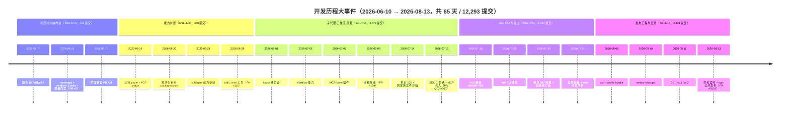
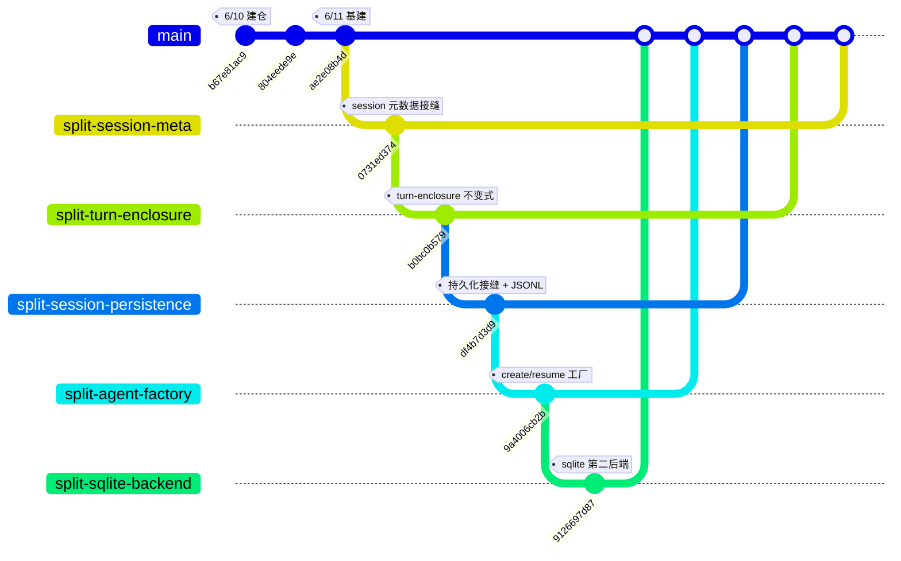
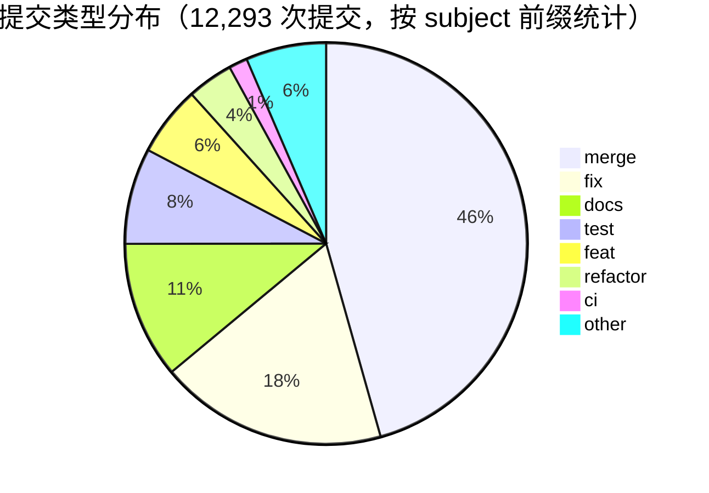

## 时间线与阶段划分

### 总览

DeepSeek Harness 是基于 vendored Cordis 的插件化 agent harness（**一切皆插件**）。仓库于 2026-06-10 建仓（`b67e81ac97`），至 8/13 共 12,293 次提交、5,610 个合并提交、PR 编号至 #2521（约 2,500 个 PR），两月走完从空仓库到 npm 公开的弧线。

**节奏画像**：首周（W24，仅 67 提交）搭出微内核与全套质量门禁；随后一个月（W25–W28）扩张能力面；7 月中旬 Web GUI 与宿主爆发（7/16–7/31 约占一半提交，单周峰值 3,542）；8 月发布工程收口，8/13 以 0.1.0-rc 系列把 dsh 全家桶公开到 npm（PR #2519）。全程无 tag，周提交量从 67 放大到峰值 3,542（W31），日峰值 887（7/30），7/27–7/30 连续四天超过 500。

**数字快照**：

- **规模**
  - 全程 65 天（2026-06-10 → 08-13）、12,293 次提交、5,610 个合并提交（45.6%）、6,683 个非合并提交
  - PR 编号至 #2521（约 2,500 个 PR）、仓库无任何 tag
  - 219 个 workspace 包（`@deepseek-ai/dsh-*`）、44+ 包组
- **峰值**
  - 周峰值 2026-W31：3,542；日峰值 07-30：887
  - 7/27–7/30 连续四天超过 500；07-14（528）为前半程峰值日
  - 低谷：W26 周 108，06-24（3）与 06-27（2）为全程最低单日
- **收口**
  - 命名契约实改 3,281 文件（`a2d0f7f411`，21,708 insertions / 21,570 deletions）
  - 公开发布实改 222 文件（`8c1e8d9890`，其中 221 个清单 `publishConfig.access` 置为 public）
  - 决策记录 `.agents/notes/` 1,372 条；双语文档 1,078 个 .zh.md + 1,078 个 .i18n.yaml

> [!NOTE]
> **统计口径**：本文所有提交数、日期均为 **author date（提交日期）**，分析范围为 master 全历史，HEAD = `47f943859b`（2026-08-13 19:38，即 PR #2519 的合并提交）。所有 commit hash 均可 `git show <hash>` 复核。

> [!TIP]
> **如何复核**：逐日/逐周/逐月数字均由 `git log --format="%ad" --date=short` 全量导出后按日期字符串聚合，再人工加总与阶段、月度、总提交交叉验证（6 月 581 + 7 月 8,273 + 8 月 3,439 = 12,293；五阶段 101 + 480 + 2,079 + 6,194 + 3,439 = 12,293；十周 67 + 355 + 108 + 440 + 684 + 1,749 + 2,169 + 3,542 + 1,966 + 1,213 = 12,293，三路对账一致）。复核命令见文末「数据引用块」。

> [!IMPORTANT]
> 正文中两处与早期稿本不同的数字均以 `git` 实测为准：① 命名契约提交 `a2d0f7f411` 实改 **3,281 个文件**（`git show --stat`，21,708 insertions / 21,570 deletions），早期稿本写作 3,282；② 按 subject 前缀统计的 `merge` 为 5,609，而 `git log --merges`（按父提交数）为 5,610——差异来自一条合并提交的 subject 不以 `Merge` 开头，本文取 5,610 为合并提交数。

---

### 逐周全景表

| 周 | 区间 | 提交数 | 与上周变化 | 该周代表提交（hash + 主题） | 一句话周记 |
| --- | --- | --- | --- | --- | --- |
| 2026-W24 | 06-08 ~ 06-14 | 67 | 首周 | `b67e81ac97` 建仓；`ae2e08b4d6` monorepo 基建；`72688a3888` vendor Cordis；`43f4258277` agent-loop；`36a30180b8` RFC 005 参数边界 | 两天内从空仓库长出一个带全套门禁的微内核（仓库 6/10 才建，本表按 W24 周框统计） |
| 2026-W25 | 06-15 ~ 06-21 | 355 | +288 | `dabc2ff411` 迁 pnpm；`fb9636db44` ACP bridge；`c5a1c494e7` session surface；`d02e9f1bd6` 模块化重组（core 诞生）；`1a81f2cccd` subagent 接缝 | 工程基线换轨 + ACP 协议服务器起步，能力面开始铺开 |
| 2026-W26 | 06-22 ~ 06-28 | 108 | -247 | `e45053f0f5` compaction 接缝；`5e01564afb` fs 包；`d01f5f73b7` web 包；`aa9afcefc7` compact-basic 后端 | 全程唯一低谷周：提交集中在拆解与打磨（6/24、6/27 只有个位数） |
| 2026-W27 | 06-29 ~ 07-05 | 440 | +332 | `46e31d8481` todo 工具；`b92a3c531a` DeepSeek web 搜索；`da94bfd37c` 会话 fork；`65165b5d54` hooks 线协议；`1d43ea3cd5` workflow | hooks 桥落地 + 简化行动，7/4 单日 177 拉开爬坡 |
| 2026-W28 | 07-06 ~ 07-12 | 684 | +244 | `1fbe7c39d4` MCP client；`6da6f04016` code-runtime；`463b72ce96` spill；`b59d245c7c` Code Mode；`7b8c3a9b40` 沙箱接缝 | 能力井喷周：沙箱、审批、任务、docs 网站同周登场 |
| 2026-W29 | 07-13 ~ 07-19 | 1749 | +1065 | `2dc62497ce` 跨家族文件沙箱；`c67c3d9413` 事件图；`0a486f09c9` native/ Landlock；`42b07a7022` SDK 工具链；`a6a3807a07` GUI 骨架 | 单日 528 首破百→破五百，周末以 GUI 骨架完成产品形态转向 |
| 2026-W30 | 07-20 ~ 07-26 | 2169 | +420 | `6baa030594` dsh CLI；`0c9a4d7c28` 退役 readline；`f4185122dc` plan 模式；`99a778d63f` 可持续后台子代理 | 宿主与 CLI 成形期，web 栈日夜推进 |
| 2026-W31 | 07-27 ~ 08-02 | 3542 | +1373 | `3fc35c91ff` 包重组（dissolve ui/）；`7e445c3a67` session 家族折叠；`2a40cbf8ef` guard 合并；`631510f54e` install 流程；`955a12cca4` web 消息队列 | 全程峰值周：7/30 单日 887，包重组三连 + 自举安装收官 |
| 2026-W32 | 08-03 ~ 08-09 | 1966 | -1576 | `18fe174897` preset；`1daa35b6e3` Codex provider；`a229b42e24` 提醒调度；`2365b2c54f` bundle；`bb61dc13f2` TypeRT API-Gateway | 产品面补全后转入发布工程地基 |
| 2026-W33 | 08-10 ~ 08-13 | 1213 | -753 | `b64c3ac1ba` 0.0.1-rc.1；`5ca7be5dcb` 0.0.1-rc.2；`a2d0f7f411` 命名契约；`8c1e8d9890` npm 公开；`abe560f81e` 0.1.0-rc.5 | 收官周：4 天 1,213 提交，发布序列从私域试发布直达 npm 公开 |

> 逐周提交数由按日聚合加总得出（W24 为 6/10 建仓起算；W33 止于 8/13）。各周代表提交选自对应日期的 `git log` 与该周叙述，未发现日期漂移的提交。

#### 逐周速写

- **W24（6/10–6/14）**：建仓（`b67e81ac97`、`804eede9eb`），6/11 一天内完成 monorepo 基建（`ae2e08b4d6`）、vendored Cordis（`72688a3888`）、agent-loop（`43f4258277`）与全部质量门禁，PR #1 当天合入；6/12–6/14 挂 bash 与 LLM 两条接缝并按 RFC 005/001/006 推进质量机制。
- **W25（6/15–6/21）**：6/15 以 PR #21 收官冷启动；6/16 迁 pnpm（`dabc2ff411`，PR #39）并起 ACP bridge（`fb9636db44`）；6/16–6/17 栈式拆分 session 家族（PR #33~#35）；6/20 模块化重组（`d02e9f1bd6`）与 AgentHandle/cancel 原语；6/21 subagent 接缝（`1a81f2cccd`）与 `dsh-brand` 抽取（`d6a2ab30c8`）。
- **W26（6/22–6/28）**：低谷周（108 提交）。compaction 接缝（`e45053f0f5`）、fs 包（`5e01564afb`）、web 包（`d01f5f73b7`）、compact-basic 后端（`aa9afcefc7`）在此周落定；6/24（3）、6/27（2）只有个位数提交。
- **W27（6/29–7/5）**：todo_write（PR #116）与 DeepSeek web 搜索 provider（`b92a3c531a`）；6/30 会话 fork（`da94bfd37c`）与事件拦截接缝（`dc95a7881d`）；7/1 hooks 线协议核心（`65165b5d54`）与两个官方桥（`8adcbceeed`）；7/4 简化行动（九项简化 RFC `e13bbcb5d5`、架构文档 1,800 字重写 `6227cfd03d`、预算门禁 `aa36b3b36b`）；7/5 workflow（`1d43ea3cd5`）。
- **W28（7/6–7/12）**：能力井喷。MCP client（`1fbe7c39d4`）、code-runtime 接缝与 worker（`6da6f04016`、`583704ac1d`）、spill（`463b72ce96`）、repeat-tool-guard（`db26ef479d`）、工具超时（`8190016e2b`）、Code Mode（`b59d245c7c`）、dsh-tool-cordis（`ee1da1ce5b`）、沙箱接缝（`7b8c3a9b40`，PR #169）、审批接缝（`ef35007d75`）、tasks 运行时（`184e164091`）、docs 网站（`87a1774fef`）、session modes（`63ced3e0e2`）。
- **W29（7/13–7/19）**：7/14 单日 528（全程首个高峰日）：跨家族文件沙箱（`2dc62497ce`）、按 provider 路由 LLM（`e547980d77`）、事件图派生（`c67c3d9413`）、native/（`0a486f09c9`）；7/15 SDK 工程化收口（`42b07a7022` PR #305、`d8f6251e3a`、`6f77da4c8c`）；7/16 LSP（`d0029d8d60`）；7/19 GUI 骨架（`a6a3807a07`）与 Agent Notes 制度（`e8eddc7ef8`、`b1b57a0ac5`）。
- **W30（7/20–7/26）**：dsh CLI 与个人配置 overlay（`6baa030594`）、退役 readline 前门（`0c9a4d7c28`）、plan 模式（`f4185122dc`）、可持续后台子代理（`99a778d63f`）、attachment/storage/workspace/subprocess 包相继诞生。
- **W31（7/27–8/2）**：峰值周。typert/e2b/settings（7/28）、credentials/feedback（7/29）包诞生；7/30 单日 887 与包重组三连（`3fc35c91ff`、`7e445c3a67`、`2a40cbf8ef`）；7/31 install 流程（`631510f54e`、`0d949cfe67`）与 web 消息队列（`955a12cca4`）。
- **W32（8/3–8/9）**：preset（`18fe174897`）、Codex provider（`1daa35b6e3`）、删 TUI 包（`10bb9cbf4a`）、schedule（`a229b42e24`）、bundle（`2365b2c54f`）、TypeRT API-Gateway（`bb61dc13f2`）；8/9 Oxlint 切换（`36ef892559`）与发布路径清理。
- **W33（8/10–8/13）**：8/11 首个 `release(dsh)`（0.0.1-rc.1/rc.2，PR #2286）与 vendor rc.1；8/13 命名契约（`a2d0f7f411`，PR #2302）后连发 rc.3/4/5 与 0.1.0-rc.1/2/3/5，`8c1e8d9890` 公开发布（PR #2519），PR #2520/#2521 收尾定格。

#### 十周节奏：累计与阶段映射

| 周 | 提交数 | 累计 | 与阶段映射 |
| --- | --- | --- | --- |
| 2026-W24 | 67 | 67 | 阶段一（6/10–6/14） |
| 2026-W25 | 355 | 422 | 阶段一收官日（6/15）+ 阶段二开篇（6/16–6/21） |
| 2026-W26 | 108 | 530 | 阶段二（6/22–6/28，全程低谷） |
| 2026-W27 | 440 | 970 | 阶段二收官（6/29–6/30）+ 阶段三开篇（7/1–7/5） |
| 2026-W28 | 684 | 1,654 | 阶段三（7/6–7/12，能力井喷） |
| 2026-W29 | 1,749 | 3,403 | 阶段三收官（7/13–7/15）+ 阶段四开篇（7/16–7/19） |
| 2026-W30 | 2,169 | 5,572 | 阶段四（7/20–7/26，宿主与 CLI 成形） |
| 2026-W31 | 3,542 | 9,114 | 阶段四收官（7/27–7/31）+ 阶段五开篇（8/1–8/2） |
| 2026-W32 | 1,966 | 11,080 | 阶段五（8/3–8/9，发布工程地基） |
| 2026-W33 | 1,213 | 12,293 | 阶段五收官（8/10–8/13） |

> 累计列加总到 12,293，与总提交一致；跨周阶段的归属以逐日日期边界精确切分（如 W29 的 7/16–7/19 归阶段四）。

#### PR 编号跨度与流速（各阶段）

| 阶段 | 编号区间 | 跨度 | 天数 | 日均编号流速 |
| --- | --- | --- | --- | --- |
| 一 | #1 ~ #21 | 21 | 6（6/10–6/15） | ≈3.5/天 |
| 二 | #33 ~ #117 | 85 | 15（6/16–6/30） | ≈5.7/天 |
| 三 | #118 ~ #336 | 219 | 15（7/1–7/15） | ≈14.6/天 |
| 四 | #337 ~ #1102 | 766 | 16（7/16–7/31） | ≈47.9/天 |
| 五 | #1103 ~ #2521 | 1,419 | 13（8/1–8/13） | ≈109.2/天 |

> [!NOTE]
> "跨度"是编号区间大小而非实际 PR 数（编号存在跳号/复用），文档口径的"约 2,500 个 PR"来自对合入提交的去重统计。流速反映编号消耗速度：阶段四单日约 48、阶段五约 109，与合并提交占比（47.8% / 39.8%）互相印证栈式工作流的密集程度。

#### 6/15–6/16：最早的栈式拆分链（split/*）

6/15–6/16 的五个 `split/*` 分支逐级合并，是仓库最早的一批栈式拆分（合并提交 subject 均为 `Merge branch 'split/xxx' into split/yyy'`）：

| 日期 | 合并提交 | 合并内容（git subject 实测） |
| --- | --- | --- |
| 06-15 | `da81709a31` | Merge branch 'split/session-meta' into split/turn-enclosure |
| 06-15 | `b4785e598b` | Merge branch 'split/turn-enclosure' into split/session-persistence |
| 06-15 | `06d5f60bac` | Merge branch 'split/session-persistence' into split/agent-factory |
| 06-15 | `bc670e69f3` | Merge branch 'split/session-persistence' into split/session-persistence-sqlite |
| 06-16 | `c4fd22f0fa` | Merge branch 'split/session-meta' into split/turn-enclosure |
| 06-16 | `96331432b8` | Merge branch 'split/turn-enclosure' into split/session-persistence |
| 06-16 | `f40dcb5f7b` | Merge branch 'split/session-persistence' into split/agent-factory |
| 06-16 | `f0d9383f49` | Merge branch 'split/agent-factory' into split/session-persistence-sqlite |
| 06-16 | `c27b1bba6e` / `11e166db71` | Merge branch 'split/agent-factory' into split/session-persistence-sqlite（再次） |

分支内容链：`split/session-meta`（会话元数据接缝 `0731ed374b`）→ `split/turn-enclosure`（轮次封闭不变式 `b0bc0b5792`）→ `split/session-persistence`（持久化接缝 + JSONL 后端 `df4b7d3d9a`）→ `split/agent-factory`（create/resume 工厂接缝 `9a4006cb2b`）→ `split/session-persistence-sqlite`（sqlite 第二后端 `9126697d87`），最终以 PR #33~#35 于 6/17 合入 main（`edd6eb28dd`）。

#### 6/16：工程基线日（单日 48 提交）

6/16 是阶段二第一天，48 个提交同时完成换轨、政策与拆分（以下 14 条均来自 `git log` 实测）：

| commit | 主题（git subject） | 归属 |
| --- | --- | --- |
| `dabc2ff411` | feat: migrate to pnpm | 包管理换轨（PR #39） |
| `49e74ed8d0` | docs: add ADR 0016 for the pnpm migration | pnpm 决策记录 |
| `67447fcdc3` | feat: enforce merge-commit policy and markdown wrap convention | 合并提交政策 + 折行约定 |
| `4c8c1da8b3` | feat: generate module dependency graph with freshness gate | module-graph 门禁（PR #43） |
| `b33668ef05` / `8e6fd91e15` | refactor/docs: order module-graph table topologically; document the gate | module-graph 打磨 |
| `fb9636db44` | feat(acp): ACP bridge — drive the coding agent from an editor over JSON-RPC stdio | ACP 起步 |
| `b3ea13749c` | feat(acp): multiplex N concurrent ACP sessions + bash task ownership (RFC 011) | ACP 多会话 |
| `efee449cfe` | feat(session-persistence): preserve interrupted turns on crash | review #33 跟进 |
| `1b1385e4f7` | fix(session-persistence-jsonl): never wedge a published log on temp-cleanup failure | review #33 跟进 |
| `3bef6b38c7` | refactor(session-persistence-sqlite): drop the materialized column; use row existence as the signal | review #35 跟进 |
| `f1dac1b1ed` | fix(session-persistence-sqlite): defer crash-tail repair to append | review #35 跟进 |
| `3e1ca8a425` | fix(agent-loop): contain finalizer append-listener throws | review #32 round 2 |
| `0000cdb2c2` | feat(agent-loop): config-driven session resume via RESUME_SESSION_ID | 会话恢复 |

---

### 月度总览表

| 月份 | 提交数 | 占比 | 日峰值 | 主要事件 |
| --- | --- | --- | --- | --- |
| 2026-06 | 581 | 4.7% | 06-20：87 | 建仓与微内核（6/10–6/15，101 提交）；能力扩张（6/16–6/30，480 提交）：迁 pnpm、ACP bridge、模块化重组、subagent/compaction 接缝、todo 与 web 搜索 |
| 2026-07 | 8,273 | 67.3% | 07-30：887 | 能力井喷（hooks/workflow/MCP/沙箱/审批/模式）+ Web GUI 与宿主战役（7/19 起），7/16–7/31 即占 6,194 提交；栈式 PR 工作流成型，7/30 单日 887 为全程峰值 |
| 2026-08 | 3,439 | 28.0% | 08-11：473 | 产品面补全（preset/Codex/schedule/bundle/api）→ 发布工程（Oxlint、vendor rescope）→ 8/11 起 release 序列 → 8/13 命名契约与 npm 公开发布（PR #2519） |

> 月度合计 581 + 8,273 + 3,439 = 12,293，与总提交数一致。7 月单月提交超过全程三分之二，是名副其实是"战斗月"。

---

### 阶段划分

| 阶段 | 时间区间 | 提交数 | 代表里程碑 | 一句话说明 |
| --- | --- | --- | --- | --- |
| 冷启动与微内核 | 2026-06-10 ~ 06-15 | 101 | `b67e81ac97` 建仓；`72688a3888` vendor Cordis；`43f4258277` agent-loop；PR #1~#21 | 一天内搭好 monorepo 基建、vendored Cordis 微内核、服务抽象与全套质量门禁 |
| 能力扩张 | 2026-06-16 ~ 06-30 | 480 | `fb9636db44` ACP bridge；`d02e9f1bd6` 模块化重组；`1a81f2cccd` subagent 接缝；`e45053f0f5` compaction 接缝；PR #33~#117 | 在微内核上补齐协议与能力面：ACP、持久化、子代理、压缩、todo、web 搜索 |
| 子代理·工作流·沙箱 | 2026-07-01 ~ 07-15 | 2079 | `1d43ea3cd5` workflow；`1fbe7c39d4` MCP client；`7b8c3a9b40` sandbox；`2dc62497ce` 跨家族文件沙箱；`63ced3e0e2` session modes；`42b07a7022` SDK 工具链；PR #118~#336 | 长程能力与治理爆发：沙箱、审批、模式、后台任务、工作流、MCP；栈式 PR 工作流成型 |
| Web GUI 与宿主 | 2026-07-16 ~ 07-31 | 6194 | `a6a3807a07` GUI 骨架；`0c9a4d7c28` 退役 readline 前门；`99a778d63f` 可持续后台子代理；`3fc35c91ff` 包重组三连；`955a12cca4` 消息队列；PR #337~#1102 | 从 TUI/示例走向 web + 宿主的正式产品形态，7/30 单日 887 提交为全程峰值 |
| 发布工程与公测 | 2026-08-01 ~ 08-13 | 3439 | `b64c3ac1ba` 首个 release 提交（0.0.1-rc.1）；`ec601ca13d` vendor rescope；`a2d0f7f411` 命名契约；`8c1e8d9890` 公开发布（PR #2519）；PR #1103~#2521 | 收口发布序列：私域试发布 → 命名契约 → 公开 npm，同日附上预览论文链接 |

#### 阶段总览对比表

| 阶段 | 提交数 | 占比 | 合并提交 | 合并占比 | 日峰值 | PR 区间 |
| --- | --- | --- | --- | --- | --- | --- |
| 一 | 101 | 0.8% | 27 | 26.7% | 06-15：34 | #1 ~ #21 |
| 二 | 480 | 3.9% | 169 | 35.2% | 06-20：87 | #33 ~ #117 |
| 三 | 2,079 | 16.9% | 1,085 | 52.2% | 07-14：528 | #118 ~ #336 |
| 四 | 6,194 | 50.4% | 2,961 | 47.8% | 07-30：887 | #337 ~ #1102 |
| 五 | 3,439 | 28.0% | 1,368 | 39.8% | 08-11：473 | #1103 ~ #2521 |
| **合计** | **12,293** | **100%** | **5,610** | **45.6%** | — | **#1 ~ #2521** |

> 三、四、五阶段的合并占比超过或接近一半，栈式 PR 是贯穿中后期的主导工作流；阶段四以 6,194 提交独占全程一半。

#### 各阶段代表 PR 一览

| 阶段 | PR | 主题 |
| --- | --- | --- |
| 一 | #1 | document-tsconfig-paths-plugin（`0a122e5b8b`，06-11） |
| 一 | #20 ~ #24 | agent-loop 修复批量合入（06-15） |
| 一 | #21 | agent-loop-step-start-order（`247c408e75`，06-15 收官） |
| 二 | #33 ~ #35 | split/session-persistence 拆分（`edd6eb28dd`，06-17） |
| 二 | #39 | feat/pnpm（`5e36f990ab`，06-16） |
| 二 | #43 | worktree-module-graph（`19518ebfd9`，06-16） |
| 二 | #116 | todo_write 工具（06-29） |
| 二 | #117 | drop-catalog-count-prose（`3f85f522ea`，06-29 收官） |
| 三 | #118 | worktree-hooks-a-taxonomy（`34ae0f9df5`，07-04） |
| 三 | #120 ~ #125 | hooks 批量合入（07-04） |
| 三 | #169 | 沙箱接缝（`7b8c3a9b40`，07-09） |
| 三 | #202 | feat/mcp-client（`b4ec4060a7`，07-15） |
| 三 | #305 | worktree-sdk-design-review（`4139e093dd`，07-15） |
| 三 | #336 | dsh-code-review-maintenance-design（`c654119f9f`，07-15 收官） |
| 四 | #337 | codex/cli-one-shot-demo（`97336c32ce`，07-19） |
| 四 | #1099 / #1100 | hide-session-lineage-header / web-stop-preserve-queue（07-31） |
| 四 | #1102 | refresh-queue-actions-golden（`992fdc0cee`，07-31 收官） |
| 五 | #1734 | Landlock 发布路径统一（8/8–8/10 窗口） |
| 五 | #2286 | release/dsh-0.0.1-rc.2（`38f99f04f1`，08-11） |
| 五 | #2302 | worktree/repository-rename-proof（`eec7f2ec74`，08-13） |
| 五 | #2495 | release/dsh-0.1.0-rc.1（`d8f5b0507d`，08-13） |
| 五 | #2512 | codex/2503-english-onboarding-copy（`71fa4c50d1`，08-13） |
| 五 | #2519 | feat/npm-public（`47f943859b`，08-13，HEAD） |
| 五 | #2520 / #2521 | docs/paper、release/dsh-0.1.0-rc.3（`f26a6f6cff`、`124aa5f01a`，08-13） |

#### 阶段边界与 PR 分界

各阶段以合入的 PR 编号区间为界，边界 PR 均可 `git show <hash>` 复核：

| 边界 | 合并提交 | 日期 | PR 主题 |
| --- | --- | --- | --- |
| 阶段一收官 | `247c408e75` | 2026-06-15 | Merge pull request #21（fix/agent-loop-step-start-order） |
| 阶段二开篇 | `edd6eb28dd` | 2026-06-17 | Merge pull request #33（split/session-persistence） |
| 阶段二收官 | `3f85f522ea` | 2026-06-29 | Merge pull request #117（drop-catalog-count-prose） |
| 阶段三开篇 | `34ae0f9df5` | 2026-07-04 | Merge pull request #118（worktree-hooks-a-taxonomy） |
| 阶段三收官 | `c654119f9f` | 2026-07-15 | Merge pull request #336（dsh-code-review-maintenance-design） |
| 阶段四开篇 | `97336c32ce` | 2026-07-19 | Merge pull request #337（codex/cli-one-shot-demo） |
| 阶段四收官 | `992fdc0cee` | 2026-07-31 | Merge pull request #1102（test/refresh-queue-actions-golden） |
| 阶段五开篇 | `e7dbf6b9cf` | 2026-08-12 | Merge pull request #1103（feature/session-export-command） |
| 阶段五收官 | `47f943859b` | 2026-08-13 | Merge pull request #2519（feat/npm-public，即 HEAD） |

> 说明：PR 编号并非严格按合入顺序连续（如 #118 于 7/4 合入而 #117 于 6/29 合入，中间 PR 多为 review/重开或并行分支），区间仅作阶段叙事的主线引用。

---

### 阶段一：冷启动与微内核（2026-06-10 ~ 06-15）

#### 阶段快照

| 项 | 值 |
| --- | --- |
| 起止 | 2026-06-10 ~ 06-15 |
| 提交数 | 101（全程占比 0.8%） |
| 合并提交 | 27（26.7%） |
| 日峰值 | 06-15：34 |
| 代表 PR 区间 | #1 ~ #21（#1 于 06-11 合入，`0a122e5b8b`） |
| 周跨度 | W24 全周 + W25 首日 |
| 收束事件 | PR #21 合入（`247c408e75`，06-15） |

#### 叙事

**6/10：建仓。** 仓库创建时只有 README、AGENTS.md 与 CLAUDE.md 符号链接（`b67e81ac97`），同日第二个提交 `804eede9eb` 把 MVP 需求分析与微内核架构文档挂进 AGENTS.md——架构意图在建仓当天就已书面化。

**6/11：一天内完成全部基建。** 这是全程密度最高的一天（24 提交），一次到位：

- **monorepo 基建**：Yarn 4 workspaces + tsc -b + tsdown 的构建链（`ae2e08b4d6`）
- **vendored Cordis**：把 Cordis 4.0.0-rc.6 全家（cordis、plugin-loader、-include、-group、-timer、-hmr、-logger-console、cosmokit、schemastery）以源码形式 vendored 进 `vendor/`（`72688a3888`，含 manifest 与同步规程）
- **agent-loop 插件**（`43f4258277`）与可运行的 echo-agent 示例（`53d1ef4a74`）
- **全套质量门禁**：100% 每文件测试覆盖率（`bfb034830f`）、knip/publint/workspace 约束（`6796a3922d`）、lefthook 钩子与 vendor manifest 守卫（`9d20a36cc4`）、Node 24/26 双版本 CI 矩阵（`86955b96a4`）
- **决策记录**：ADR（`9b8fccc6f9`）与 RFC 草案（`4dafad4db6`）；PR #1 当天合入（`0a122e5b8b`，document-tsconfig-paths-plugin）

**6/12–6/13：挂接第一层真实能力。**

- bash 执行接缝（`8b5a3ef730`，6/12）
- 两个 DeepSeek LLM 适配器（`ab19fed77c`，6/13）
- coding-agent 示例与 docs cookbook（`e98c1c5d42`，6/13）

**6/14–6/15：按 RFC 顺序推进质量机制。**

- RFC 005 工具参数边界校验（`36a30180b8`）
- dev 模式事件契约断言与会话日志冻结（`11a29fdefe`）
- RFC 001 协议型代码的属性测试（`2f6d3b8539`）
- RFC 006 doc-sync 门禁（`6a528be569`）
- 6/15 还启动了一批 `split/*` 栈式拆分分支（session-meta → turn-enclosure → session-persistence → agent-factory → session-persistence-sqlite，见 `0731ed374b`、`b0bc0b5792`、`df4b7d3d9a`、`9a4006cb2b`、`9126697d87`），PR #20~#24 同日密集合入

**阶段收官**：以 PR #21（6/15）收束：微内核、服务抽象、示例与门禁体系均已成型，但能力面仍只有 bash 与 LLM 两条接缝。栈式拆分的工作流在这两天已经出现雏形（`Merge branch 'split/xxx' into split/yyy'` 链）。

#### 关键提交明细表（阶段一）

| 日期 | commit | 主题 | 意义 |
| --- | --- | --- | --- |
| 06-10 | `b67e81ac97` | Initialize repo with README, AGENTS.md, and CLAUDE.md symlink | 建仓：空仓库的第一颗种子 |
| 06-10 | `804eede9eb` | Link MVP requirement analysis and microkernel architecture docs in AGENTS.md | 当天挂接需求分析与架构文档，意图先行 |
| 06-11 | `ae2e08b4d6` | Set up monorepo infra: Yarn 4 workspaces, tsc -b + dumble build, vitest | monorepo 基建：workspaces + tsc -b + tsdown 构建 + vitest |
| 06-11 | `72688a3888` | vendor Cordis 4.0.0-rc.6（含 manifest 与同步规程） | 微内核 vendoring，repo 的架构地基 |
| 06-11 | `43f4258277` | agent-loop 插件 | 第一个核心插件：agent 循环 |
| 06-11 | `53d1ef4a74` | echo-agent 示例 | 首个可运行示例 |
| 06-11 | `bfb034830f` | 100% 每文件测试覆盖率门禁 | 质量门禁第一块 |
| 06-11 | `6796a3922d` | knip/publint/workspace 约束 | 依赖与发布卫生 |
| 06-11 | `9d20a36cc4` | lefthook 钩子与 vendor manifest 守卫 | 提交前守门 |
| 06-11 | `86955b96a4` | Node 24/26 双版本 CI 矩阵 | 双版本兼容承诺 |
| 06-11 | `9b8fccc6f9` | ADR 记录 | 决策记录制度起点 |
| 06-11 | `4dafad4db6` | RFC 草案 | RFC 流程起点 |
| 06-11 | `0a122e5b8b` | Merge pull request #1（document-tsconfig-paths-plugin） | PR #1 合入，PR 流程开张 |
| 06-12 | `8b5a3ef730` | bash 执行接缝 | 第一条真实能力缝 |
| 06-13 | `ab19fed77c` | 两个 DeepSeek LLM 适配器 | LLM 能力缝 |
| 06-13 | `e98c1c5d42` | coding-agent 示例与 docs cookbook | 第一个"产品级"示例 |
| 06-14 | `36a30180b8` | RFC 005 工具参数边界校验 | 参数校验机制 |
| 06-14 | `11a29fdefe` | dev 模式事件契约断言与会话日志冻结 | 会话日志成为契约 |
| 06-14 | `2f6d3b8539` | RFC 001 属性测试 | 协议型代码属性测试 |
| 06-14 | `6a528be569` | RFC 006 doc-sync 门禁 | 文档同步门禁 |
| 06-15 | `247c408e75` | Merge pull request #21（agent-loop-step-start-order） | 阶段收官 PR #21 |

#### 逐日要点（阶段一）

| 日期 | 提交 | 当日要点 |
| --- | --- | --- |
| 06-10 | 2 | 建仓（`b67e81ac97`）+ 挂接需求分析/架构文档（`804eede9eb`） |
| 06-11 | 24 | 基建一天完成：monorepo、vendor Cordis、agent-loop、echo-agent、质量门禁、ADR/RFC、PR #1 |
| 06-12 | 3 | bash 执行接缝（`8b5a3ef730`） |
| 06-13 | 8 | 两个 DeepSeek LLM 适配器（`ab19fed77c`）；coding-agent 示例与 cookbook（`e98c1c5d42`） |
| 06-14 | 30 | RFC 005/001/006 质量机制合入（`36a30180b8`、`2f6d3b8539`、`6a528be569`） |
| 06-15 | 34 | PR #20~#24 合入；`split/*` 栈式分支链启动；PR #21 收官 |

---

### 阶段二：能力扩张（2026-06-16 ~ 06-30）

#### 阶段快照

| 项 | 值 |
| --- | --- |
| 起止 | 2026-06-16 ~ 06-30 |
| 提交数 | 480（全程占比 3.9%） |
| 合并提交 | 169（35.2%） |
| 日峰值 | 06-20：87 |
| 代表 PR 区间 | #33 ~ #117（#33 于 06-17 合入，`edd6eb28dd`；#117 于 06-29 合入，`3f85f522ea`） |
| 周跨度 | W25 后段 + W26 全周 + W27 前段 |
| 收束事件 | PR #117 合入（`3f85f522ea`，06-29） |

#### 叙事

**主线一：工程基线换轨。** 阶段开篇是两条并行主线，其一为工程基线：

1. 6/16 从 Yarn 4 迁到 pnpm（`dabc2ff411`，PR #39 `5e36f990ab` 合入，配套 ADR 0016 `49e74ed8d0`）
2. 6/17 统一 tsconfig 输出与扩展名导入约定
3. 6/20 把包重新组织成模块化层级（`d02e9f1bd6`，`packages/core` 由此诞生）
4. 6/16 同时立下 merge-commit 政策与 markdown 折行约定（`67447fcdc3`），并上线 module-graph 门禁（`4c8c1da8b3`，PR #43）

**主线二：ACP 协议服务器。** `fb9636db44`（6/16）落地 ACP bridge——"drive the coding agent from an editor over JSON-RPC stdio"，随后以栈式拆分 PR 推进：

- session-persistence 拆分（#33~#35，6/17 起合入）
- agent-factory（#34）、turn-enclosure（#46）
- ACP 多会话（#42，`b3ea13749c`，RFC 011）
- 会话 cwd（#48）、工具调用卡片与终端渲染（#56、#58）
- 无密钥快照测试套件（#59）

6/17 同时引入 session surface（`c5a1c494e7`），让会话日志成为唯一的表层派生路径。6/15–6/16 的 `split/session-meta → split/turn-enclosure → split/session-persistence → split/agent-factory → split/session-persistence-sqlite` 分支链逐级合并，是仓库最早的一批栈式拆分——此后"大功能拆小 PR、逐级合入"成为默认工作流。

**内核抽象周（6/20–6/22）。** 这是能力面从"示例"走向"抽象"的关键一周：

- AgentHandle 与可取消原语（`2a4d89a4bd`、`c4bc6e0e38`）
- bash 执行器的 owner token（`d1b7c3bf95`）
- **subagent 能力接缝**——"子代理"从概念变成 registry + provider + model-facing tool 三件套（`1a81f2cccd`，6/21）
- Branded ID 抽取为 `dsh-brand`（`d6a2ab30c8`，6/21）
- compaction 接缝（`e45053f0f5`，6/22）

**功能落地与低谷。** 6/25 合入 compact-basic 基线后端（`aa9afcefc7`），6/29 加上 todo_write 工具（PR #116）与 DeepSeek 支持的 web 搜索 provider（`b92a3c531a`）。6/22–6/28 是全程唯一一个明显低谷（周提交仅 108，6/24、6/27 只有个位数），提交集中在拆解与打磨。6/30 的会话 fork（`da94bfd37c`）与事件拦截接缝（`dc95a7881d`）为下一阶段的 hooks 桥埋下伏笔，阶段以 PR #117 收尾。

#### 关键提交明细表（阶段二）

| 日期 | commit | 主题 | 意义 |
| --- | --- | --- | --- |
| 06-16 | `dabc2ff411` | feat: migrate to pnpm | Yarn 4 → pnpm 换轨 |
| 06-16 | `49e74ed8d0` | docs: add ADR 0016 for the pnpm migration | pnpm 迁移的决策记录 |
| 06-16 | `5e36f990ab` | Merge pull request #39（feat/pnpm） | pnpm 合入 |
| 06-16 | `fb9636db44` | feat(acp): ACP bridge — drive the coding agent from an editor over JSON-RPC stdio | ACP 协议服务器起点 |
| 06-16 | `b3ea13749c` | feat(acp): multiplex N concurrent ACP sessions + bash task ownership (RFC 011) | ACP 多会话 |
| 06-16 | `67447fcdc3` | feat: enforce merge-commit policy and markdown wrap convention | 合并提交政策 + md 折行约定 |
| 06-16 | `4c8c1da8b3` | feat: generate module dependency graph with freshness gate | module-graph 门禁（PR #43） |
| 06-16 | `efee449cfe` | feat(session-persistence): preserve interrupted turns on crash | 会话持久化：崩溃不丢轮次（review #33） |
| 06-17 | `edd6eb28dd` | Merge pull request #33（split/session-persistence） | 首个栈式拆分 PR 合入 |
| 06-17 | `c5a1c494e7` | session surface | 会话日志成为唯一表层派生路径 |
| 06-20 | `d02e9f1bd6` | 模块化重组 | `packages/core` 诞生 |
| 06-20 | `2a4d89a4bd` / `c4bc6e0e38` | AgentHandle 与可取消原语 | 内核抽象 |
| 06-20 | `d1b7c3bf95` | bash 执行器 owner token | 执行所有权 |
| 06-21 | `1a81f2cccd` | subagent 能力接缝 | registry + provider + tool 三件套 |
| 06-21 | `d6a2ab30c8` | Branded ID 抽取 dsh-brand | `dsh-brand` 包诞生 |
| 06-22 | `e45053f0f5` | compaction 能力接缝 | 上下文压缩接缝 |
| 06-22 | `5e01564afb` | fs 包诞生 | 文件系统能力路径 |
| 06-25 | `d01f5f73b7` | web 包诞生 | web 搜索能力路径起点 |
| 06-25 | `aa9afcefc7` | compact-basic 基线后端 | 压缩基线实现 |
| 06-29 | `46e31d8481` | todo_write 工具（PR #116） | 模型侧工具 |
| 06-29 | `b92a3c531a` | DeepSeek web 搜索 provider | 首个搜索 provider |
| 06-29 | `3f85f522ea` | Merge pull request #117 | 阶段收官 PR |
| 06-30 | `da94bfd37c` / `dc95a7881d` | 会话 fork + 事件拦截接缝 | hooks 桥伏笔 |

#### 逐日要点（阶段二）

| 日期 | 提交 | 当日要点 |
| --- | --- | --- |
| 06-16 | 48 | 迁 pnpm、ACP bridge、merge-commit 政策、module-graph 门禁、`split/*` 链合入（见"6/16 工程基线日"） |
| 06-17 | 33 | PR #33（split/session-persistence）合入（`edd6eb28dd`）；session surface（`c5a1c494e7`） |
| 06-18 | 41 | 常规推进（无突出事件记录） |
| 06-19 | 39 | 常规推进（无突出事件记录） |
| 06-20 | 87 | 模块化重组 `packages/core` 诞生（`d02e9f1bd6`）；AgentHandle 与 cancel 原语（`2a4d89a4bd`、`c4bc6e0e38`）；owner token（`d1b7c3bf95`） |
| 06-21 | 73 | subagent 能力接缝（`1a81f2cccd`）；`dsh-brand` 抽取（`d6a2ab30c8`） |
| 06-22 | 39 | compaction 能力接缝（`e45053f0f5`）；fs 包诞生（`5e01564afb`） |
| 06-23 | 23 | 常规推进（无突出事件记录） |
| 06-24 | 3 | 低谷日（个位数） |
| 06-25 | 14 | compact-basic 基线后端（`aa9afcefc7`）；web 包诞生（`d01f5f73b7`） |
| 06-26 | 21 | 常规推进（无突出事件记录） |
| 06-27 | 2 | 全程最低单日之一 |
| 06-28 | 6 | 低谷收尾 |
| 06-29 | 30 | todo_write（PR #116）；DeepSeek web 搜索 provider（`b92a3c531a`）；PR #117 收官（`3f85f522ea`） |
| 06-30 | 21 | 会话 fork（`da94bfd37c`）；事件拦截接缝（`dc95a7881d`） |

---

### 阶段三：子代理、工作流与沙箱（2026-07-01 ~ 07-15）

#### 阶段快照

| 项 | 值 |
| --- | --- |
| 起止 | 2026-07-01 ~ 07-15 |
| 提交数 | 2,079（全程占比 16.9%） |
| 合并提交 | 1,085（52.2%，按 07-01~07-15 精确日窗；早期稿本作 1,139，或含 7/16 边界提交） |
| 日峰值 | 07-14：528（全程第一个高峰日） |
| 代表 PR 区间 | #118 ~ #336（#118 于 07-04 合入，`34ae0f9df5`；#336 于 07-15 合入，`c654119f9f`） |
| 周跨度 | W27 后段 + W28 全周 + W29 前段 |
| 收束事件 | 7/16 LSP（`d0029d8d60`）与显式 turn 取消（`c238992fbb`） |

#### 叙事

**hooks 栈落地（7/1–7/4）。** 阶段开篇即 hooks：

1. 先是共享的 Claude Code / Codex 钩子线协议核心（`65165b5d54`，7/1）
2. 再是两个官方桥（`8adcbceeed`，7/1）
3. 7/4 一批 PR（#120~#125）集中合入，同日 PR #118（worktree-hooks-a-taxonomy）开篇

**简化行动（7/4）。** 同日还有一次大规模"简化行动"：

- 一份调查产出九个简化 RFC（`e13bbcb5d5`）
- 架构文档按 1,800 字预算重写（`6227cfd03d`）
- 文档分级与预算门禁上线（`aa36b3b36b`）

**长程能力（7/5–7/9）。** 7/5 的 workflow 能力（`1d43ea3cd5`）把多代理编排脚本化，system-prompt 变量与 persona 段落（`f256f3961d`）开始治理提示词。7/7–7/9 是能力井喷：

- MCP client 插件（`1fbe7c39d4`，7/7，7/15 以 PR #202 合入）
- code-runtime 接缝与 worker 线程实现（`6da6f04016`、`583704ac1d`，7/8）
- 工具输出 spill（`463b72ce96`，7/8）
- repeat-tool-guard（`db26ef479d`，7/8）
- 工具超时策略（`8190016e2b`，7/8）
- Code Mode（`b59d245c7c`，7/8）
- 运行时自检工具 dsh-tool-cordis（`ee1da1ce5b`，7/8）

**治理与交互（7/9–7/13）。** 7/9 的沙箱接缝与平台原生 runner 链（`7b8c3a9b40`，PR #169）和审批接缝（`ef35007d75`）确立了"拒绝后可批准的更宽重试"交互，tasks 后台任务运行时（`184e164091`）与 docs 网站（`87a1774fef`）同日出现。7/10–7/13 的 session modes（`63ced3e0e2`）把 plan 模式做成记录在会话日志里的 per-agent 策略状态，权限预设（`95635dfa66`）与并行工具调用（`7ea1bf119f`）跟进。

**7/14：全程第一个高峰日（528 提交）。**

- 跨家族文件沙箱（`2dc62497ce`）
- 按 provider 路由 LLM 适配器（`e547980d77`）
- 从 TypeScript 派生事件图与作用域不变式（`c67c3d9413`）
- `native/` 目录（Landlock，`0a486f09c9`）同日落位
- `python/` 目录诞生于 7/11（`context` 包诞生于 7/14，`a9d74932b1`）

**7/15 SDK 工程化收口。** 开发者工程工具链（`42b07a7022`，PR #305）、dsh 更名为 dsh-sdk（`d8f6251e3a`）、demo 包迁入 `packages/examples/`（`6f77da4c8c`）、MCP 正式合入（PR #202，`b4ec4060a7`）。本阶段 2,079 提交中有 1,085 个合并提交（52.2%，精确日窗口径）——栈式 PR 工作流在此成型。阶段以 7/16 的 LSP 能力（`d0029d8d60`）与显式 turn 取消（`c238992fbb`）收束。

#### 关键提交明细表（阶段三）

| 日期 | commit | 主题 | 意义 |
| --- | --- | --- | --- |
| 07-01 | `65165b5d54` | hooks 线协议核心 | Claude Code / Codex 钩子线协议 |
| 07-01 | `8adcbceeed` | 两个官方桥（Claude Code / Codex） | 官方桥 |
| 07-04 | `34ae0f9df5` | Merge pull request #118（worktree-hooks-a-taxonomy） | 阶段首个 PR；hooks taxonomy |
| 07-04 | `e13bbcb5d5` | 九项简化 RFC | 简化行动 |
| 07-04 | `6227cfd03d` | 架构文档 1,800 字预算重写 | 文档瘦身 |
| 07-04 | `aa36b3b36b` | 文档分级与预算门禁 | 文档治理 |
| 07-05 | `1d43ea3cd5` | workflow 能力 | 多代理编排脚本化 |
| 07-05 | `f256f3961d` | system-prompt 变量与 persona 段落 | 提示词治理 |
| 07-07 | `1fbe7c39d4` | MCP client 插件 | MCP 客户端 |
| 07-08 | `6da6f04016` / `583704ac1d` | code-runtime 接缝与 worker 线程 | 代码执行运行时 |
| 07-08 | `463b72ce96` | 工具输出 spill | 大输出溢出处理 |
| 07-08 | `db26ef479d` | repeat-tool-guard | 防重复工具调用 |
| 07-08 | `8190016e2b` | 工具超时策略 | 超时治理 |
| 07-08 | `b59d245c7c` | Code Mode | 代码模式 |
| 07-08 | `ee1da1ce5b` | dsh-tool-cordis 运行时自检 | 自省工具 |
| 07-09 | `7b8c3a9b40` | 沙箱接缝与平台原生 runner 链（PR #169） | 沙箱 |
| 07-09 | `ef35007d75` | 审批接缝 | "拒绝后可批准"交互 |
| 07-09 | `184e164091` | tasks 后台任务运行时 | 后台任务 |
| 07-09 | `87a1774fef` | docs 网站 | 文档站点 |
| 07-10 | `63ced3e0e2` | session modes（plan 模式入日志） | per-agent 策略状态 |
| 07-11 | `python/` 目录诞生 | Python SDK 起点 | 语言生态 |
| 07-14 | `2dc62497ce` | 跨家族文件沙箱 | 文件沙箱 |
| 07-14 | `c67c3d9413` | TypeScript 派生事件图与作用域不变式 | 静态事件契约 |
| 07-14 | `0a486f09c9` | native/ 目录（Landlock） | 原生沙箱源 |
| 07-15 | `42b07a7022` | SDK 工程工具链（PR #305） | SDK 工程化 |
| 07-15 | `d8f6251e3a` | dsh 更名 dsh-sdk | 命名收敛 |
| 07-15 | `6f77da4c8c` | demo 包迁入 packages/examples/ | examples 包诞生 |
| 07-15 | `b4ec4060a7` | Merge pull request #202（feat/mcp-client） | MCP 正式合入 |

#### 逐日要点（阶段三）

| 日期 | 提交 | 当日要点 |
| --- | --- | --- |
| 07-01 | 39 | hooks 线协议核心（`65165b5d54`）；两个官方桥（`8adcbceeed`） |
| 07-02 | 46 | 常规推进（无突出事件记录） |
| 07-03 | 53 | 常规推进（无突出事件记录） |
| 07-04 | 177 | 九项简化 RFC（`e13bbcb5d5`）；架构文档 1,800 字重写（`6227cfd03d`）；预算门禁（`aa36b3b36b`）；PR #118、#120~#125 合入 |
| 07-05 | 74 | workflow 能力（`1d43ea3cd5`）；system-prompt 变量与 persona 段落（`f256f3961d`） |
| 07-06 | 129 | 爬坡日（无突出事件记录） |
| 07-07 | 100 | MCP client 插件（`1fbe7c39d4`） |
| 07-08 | 118 | code-runtime、spill、repeat-tool-guard、工具超时、Code Mode、dsh-tool-cordis 井喷 |
| 07-09 | 137 | 沙箱接缝（`7b8c3a9b40`，PR #169）；审批接缝（`ef35007d75`）；tasks（`184e164091`）；docs 网站（`87a1774fef`） |
| 07-10 | 73 | session modes（`63ced3e0e2`）；skill 包（`6292d52236`）；session-query 包（`aa1dc0e2c7`） |
| 07-11 | 50 | `python/` 目录诞生 |
| 07-12 | 77 | 权限预设与并行工具调用跟进（窗口 7/10–7/13：`95635dfa66`、`7ea1bf119f`） |
| 07-13 | 104 | 高峰前夜（无突出事件记录） |
| 07-14 | 528 | 全程第一个高峰日：跨家族文件沙箱（`2dc62497ce`）、native/ Landlock（`0a486f09c9`）、事件图（`c67c3d9413`）、context 包 |
| 07-15 | 374 | SDK 工具链（`42b07a7022`，PR #305）；dsh→dsh-sdk（`d8f6251e3a`）；examples 包（`6f77da4c8c`）；MCP 合入（PR #202）；PR #336 收官 |

---

### 阶段四：Web GUI 与宿主（2026-07-16 ~ 07-31）

#### 阶段快照

| 项 | 值 |
| --- | --- |
| 起止 | 2026-07-16 ~ 07-31 |
| 提交数 | 6,194（全程占比 50.4%，约占一半） |
| 合并提交 | 2,961（47.8%） |
| 日峰值 | 07-30：887（全程峰值） |
| 代表 PR 区间 | #337 ~ #1102（#337 于 07-19 合入，`97336c32ce`；#1102 于 07-31 合入，`992fdc0cee`） |
| 周跨度 | W29 后段 + W30 全周 + W31 全周 |
| 收束事件 | 7/31 web 消息队列（`955a12cca4`）、goal e2e 归入 host、会话所有权生命周期修复 |

#### 叙事

**过渡期（7/16–7/18）。** LSP 接缝与通用 stdio provider（`d0029d8d60`）、显式 turn 取消（`c238992fbb`）、桌面 workbench 雏形（`649183aa65`）与本地会话回放 trace-workbench（`b965285f28`）、大量 Windows 平台测试适配。

**转折点（7/19 21:17）。** `a6a3807a07` 是产品形态的转折点——"step1 skeleton：dsc web 在启动的 harness 宿主上伺服构建好的 Web UI"（git subject：*feat(gui): step1 skeleton — dsc web serves built web UI over booted harness host*）一次性创建了 `apps/web`、`apps/cli` 与 `packages/client`、`packages/host`，并配套四篇实施笔记（GUI 分层与 RPC 协议、web 客户端架构、样式系统、GUI 测试系统）。同一天确立了两项制度：

- RFC 改名为 Agent Notes（`e8eddc7ef8`）
- 非平凡变更必须带 Agent Note（`b1b57a0ac5`）

goal 领域与模型侧工具（`a525776015`、`0129063ae7`）也在此日落地；PR #337（codex/cli-one-shot-demo）同日开篇。

**宿主与 CLI 成形期（7/22–7/24）。**

- dsh CLI 与个人配置 overlay（`6baa030594`）
- 退役 readline 前门与 repl-agent 示例（`0c9a4d7c28`）
- plan 模式作为记录状态（`f4185122dc`）
- 可持续后台子代理（`99a778d63f`，7/23）
- overloaded surface 术语清理（`0c708cb10d`）
- attachment（7/23，`cb4c11b869`）、storage（7/24，`e90b0d51df`）、workspace（7/24，`013e6f8769`）、subprocess（7/26，`fc566119a7`）包相继诞生

**密集收口（7/28–7/30）。** `docs/core-data-structures/` 更名 `subsystems/`，typert（`f773985e71`）与 e2b（`e7b682f1f6`）POC、settings（`ec0786e099`，7/28）、credentials（`3a794495ad`，7/29）、feedback（`0ccd3ed463`，7/29）包相继诞生；7/30 以单日 887 提交成为全程峰值，同日完成"包重组三连"：

1. **dissolve `ui/` 并把 `sdk/` 改名为 `scaffold/`**（`3fc35c91ff`，boot/interaction 包同日诞生）
2. **session 家族 12 个包折叠进 `packages/session/`**（`7e445c3a67`）
3. **`timeout/` 并入 `guard/` 且 `cordis/` 更名 `self-modification/`**（`2a40cbf8ef`）

**自举与收官（7/31）。** install/升级流程（`631510f54e`，安装后可选 web 或 tui，`0d949cfe67`）让项目可以自举安装；web 消息队列（`955a12cca4`）、goal e2e 归入 host、会话所有权生命周期修复完成，并默认把 shipped UI 会话设为 workspace-write（`b694c33d18`）。

本阶段 6,194 提交约占全程一半，周提交从 1,749 一路升到 3,542（W31），7/27–7/30 连续四天超过 500。阶段以 7/31 的宿主 + UI 收敛收尾：web 消息队列（`955a12cca4`）、goal e2e 归入 host、会话所有权生命周期修复完成。

#### 关键提交明细表（阶段四）

| 日期 | commit | 主题 | 意义 |
| --- | --- | --- | --- |
| 07-16 | `d0029d8d60` | LSP 接缝与通用 stdio provider | LSP 能力 |
| 07-16 | `c238992fbb` | 显式 turn 取消 | 取消语义 |
| 07-17 | `649183aa65` | 桌面 workbench 雏形 | 桌面端探索 |
| 07-17 | `b965285f28` | trace-workbench 本地会话回放 | 回放工具 |
| 07-19 | `a6a3807a07` | feat(gui): step1 skeleton — dsc web serves built web UI over booted harness host | 产品形态转折点：apps/web、apps/cli、packages/client、packages/host 一次性诞生 |
| 07-19 | `e8eddc7ef8` | RFC 改名为 Agent Notes | 决策记录制度改名 |
| 07-19 | `b1b57a0ac5` | 非平凡变更必须带 Agent Note | Agent Note 强制制度 |
| 07-19 | `a525776015` / `0129063ae7` | goal 领域与模型侧工具 | goal 能力 |
| 07-19 | `97336c32ce` | Merge pull request #337（codex/cli-one-shot-demo） | 阶段首个 PR |
| 07-20 | `de72f972b7` | Exercise normalized goal-round rate limits | goal 轮次限流 |
| 07-22 | `6baa030594` | dsh CLI 与个人配置 overlay | CLI 成形 |
| 07-22 | `0c9a4d7c28` | 退役 readline 前门与 repl-agent 示例 | 旧前门退役 |
| 07-22 | `f4185122dc` | plan 模式作为记录状态 | plan 包诞生 |
| 07-23 | `99a778d63f` | 可持续后台子代理 | 后台子代理 |
| 07-23 | `cb4c11b869` | attachment 包诞生 | 附件能力 |
| 07-24 | `e90b0d51df` / `013e6f8769` | storage / workspace 包诞生 | 持久化与工作区 |
| 07-26 | `fc566119a7` | subprocess 包诞生 | 子进程能力 |
| 07-28 | `f773985e71` / `e7b682f1f6` / `ec0786e099` | typert / e2b / settings 包诞生 | 类型图 + 沙箱 POC + 设置 |
| 07-29 | `3a794495ad` / `0ccd3ed463` | credentials / feedback 包诞生 | 凭据与反馈 |
| 07-30 | `3fc35c91ff` | 包重组三连① dissolve ui/、sdk→scaffold | 重组第一击（boot/interaction 包诞生） |
| 07-30 | `7e445c3a67` | 包重组三连② session 家族 12 包折叠 | 重组第二击 |
| 07-30 | `2a40cbf8ef` | 包重组三连③ timeout→guard、cordis→self-modification | 重组第三击 |
| 07-31 | `631510f54e` / `0d949cfe67` | install/升级流程（可选 web/tui） | 自举安装 |
| 07-31 | `955a12cca4` | web 消息队列 | 消息队列 |
| 07-31 | `b694c33d18` | Default shipped UI sessions to workspace-write | 默认写权限工作区 |
| 07-31 | `992fdc0cee` | Merge pull request #1102 | 阶段收官 PR |

#### 逐日要点（阶段四）

| 日期 | 提交 | 当日要点 |
| --- | --- | --- |
| 07-16 | 150 | LSP 接缝与通用 stdio provider（`d0029d8d60`）；显式 turn 取消（`c238992fbb`） |
| 07-17 | 114 | 桌面 workbench 雏形（`649183aa65`）；trace-workbench 回放（`b965285f28`） |
| 07-18 | 94 | Windows 平台测试适配等过渡期工作 |
| 07-19 | 385 | GUI 骨架（`a6a3807a07`）；Agent Notes 制度（`e8eddc7ef8`、`b1b57a0ac5`）；goal 领域（`a525776015`、`0129063ae7`）；PR #337 开篇 |
| 07-20 | 365 | goal 轮次限流规范化（`de72f972b7`）；tui session controls（`2c075711eb`）；PR #80（llm-error-recovery-rfc）合入——低编号 PR 晚合入的典型（`171a0e2b30`） |
| 07-21 | 277 | 常规推进（无突出事件记录） |
| 07-22 | 396 | dsh CLI 与个人配置 overlay（`6baa030594`）；退役 readline 前门（`0c9a4d7c28`）；plan 模式（`f4185122dc`） |
| 07-23 | 383 | 可持续后台子代理（`99a778d63f`）；attachment 包（`cb4c11b869`） |
| 07-24 | 264 | storage 包（`e90b0d51df`）；workspace 包（`013e6f8769`）；overloaded surface 清理（`0c708cb10d`） |
| 07-25 | 136 | 常规推进（无突出事件记录） |
| 07-26 | 348 | subprocess 包诞生（`fc566119a7`） |
| 07-27 | 595 | W31 开周冲刺（无突出事件记录） |
| 07-28 | 539 | typert（`f773985e71`）、e2b（`e7b682f1f6`）、settings（`ec0786e099`）包诞生；subsystems 更名 |
| 07-29 | 589 | credentials（`3a794495ad`）、feedback（`0ccd3ed463`）包诞生 |
| 07-30 | 887 | 全程单日峰值：包重组三连（`3fc35c91ff`、`7e445c3a67`、`2a40cbf8ef`） |
| 07-31 | 672 | install 流程（`631510f54e`、`0d949cfe67`）；web 消息队列（`955a12cca4`）；PR #1098~#1102 合入（见"7/31 收尾日"） |

#### 7/31 收尾日：web/宿主收口提交样例（`git log` 实测）

| commit | 主题（git subject） | 归属 |
| --- | --- | --- |
| `9a3bdd599c` | Merge pull request #1099（codex/hide-session-lineage-header） | 会话血缘头部隐藏 |
| `880203a738` | Merge pull request #1100（codex/web-stop-preserve-queue） | 停止时保留消息队列 |
| `fb9da7587c` | Merge pull request #1098（codex/refresh-translation-prompt-snapshot） | 翻译提示词快照刷新 |
| `3a01dc814e` | Merge pull request #1088（agent/web-context-injection-auto-height） | web 上下文注入自适应高度 |
| `07b0efc49e` | fix(web): hide session lineage in header | 同上 PR 内容提交 |
| `32a0e871b7` | fix(web): preserve queue on stop | 同上 PR 内容提交 |
| `e73cdd6b7d` | fix(web): single-flight goal clear | goal 清除单飞 |
| `690ca800b4` | fix(test): assign goal e2e to host program | goal e2e 归入 host |
| `b694c33d18` | Default shipped UI sessions to workspace-write | 默认写权限工作区 |
| `1a09174987` | refactor(goal): persist state with domain events | goal 领域事件持久化 |
| `b6cf9298e3` | refactor(workspace-context): project updates through inbox | workspace 收件箱化 |
| `575e1217bb` | fix: remove scoped bash | 移除 scoped bash 路径 |
| `344ad0d6fb` | fix(client): floor the fork anchor to a real event seq | fork 锚点修正 |
| `f3a1ff41b7` | cleanup(install): drop the master.path record | install 记录清理 |

---

### 阶段五：发布工程与公测（2026-08-01 ~ 08-13）

#### 阶段快照

| 项 | 值 |
| --- | --- |
| 起止 | 2026-08-01 ~ 08-13 |
| 提交数 | 3,439（全程占比 28.0%） |
| 合并提交 | 1,368（39.8%） |
| 日峰值 | 08-11：473 |
| 代表 PR 区间 | #1103 ~ #2521（#1103 于 08-12 合入，`e7dbf6b9cf`；#2521 于 08-13 合入，`124aa5f01a`） |
| 周跨度 | W32 全周 + W33 前段 |
| 收束事件 | PR #2519 npm 公开发布（HEAD `47f943859b`）+ PR #2520/#2521 定格 |

#### 叙事

**产品面补全（8/3–8/7）。** 8 月初完成产品面补全：

- agent preset 组合层（`18fe174897`，8/3）
- Codex 产品 provider（`1daa35b6e3`，8/4）与 TUI 包及遗留 dsh 入口的删除（`10bb9cbf4a`，8/4）
- 提醒调度（`a229b42e24`，8/5，含 durable after 提醒与绝对时间提醒）
- 可安装的 `dsh --profile` 补丁层 bundle（`2365b2c54f`，8/6）
- TypeRT API-Gateway 与远程组装（`bb61dc13f2`，8/7，配套 `2f619b1b88` 文档）
- 会话全文搜索改为 opt-in（`b6b6a72df7`，8/13 合入）

**发布工程地基（8/8–8/10）。**

1. Landlock 发布路径统一（PR #1734）
2. lint 全面切换 Oxlint（`36ef892559`，8/9）
3. 删除 repository plugin 路径（`993550e6c8`，8/9）
4. CLI 启动行改由应用自持（`d4ccfbd80f`，8/9）
5. vendored Cordis 包 rescope 进 `@deepseek-ai` 域（`ec601ca13d`，8/10）
6. 发布序列在私有作用域下可发布（`97eb14a007`，8/10）

**发布序列（8/11）。** 8/11 出现首个 `release(dsh)` 提交：0.0.1-rc.1（`b64c3ac1ba`）与 0.0.1-rc.2（`5ca7be5dcb`，PR #2286 于 `38f99f04f1` 合入），同时 vendor 侧 rc.1 发布（`4cd77a5ad9`）。

**收官日（8/13）。** 8/13 是收官日：

1. 先以"仓库命名契约"做全库词汇收敛——task→job、bash→shell、pty→terminal 等，涉及 **3,281 个文件**（`a2d0f7f411`，21,708 insertions / 21,570 deletions，PR #2302 于 `eec7f2ec74` 合入）
2. 随后连发 0.0.1-rc.3/4/5（`1e99f20963`、`a90d9af1b2`、`3e8a1cfa33`）与 0.1.0-rc.1/2/3/5（`22ab3beac1`、`60b04b6ef7`、`8a954b2eca`、`abe560f81e`）
3. `8c1e8d9890`（经 PR #2519 feat/npm-public 合入，合并提交 `47f943859b` 即 HEAD）把 221 个清单的 `publishConfig.access` 置为 public（该提交实改 222 个文件）
4. `a213befd0f` 先行公开 vendored 框架与 native 包，完成 npm 公开发布
5. 同日 PR #2520（`f26a6f6cff`，docs/paper）给 README 加上预览论文链接（`0ae8f27b93`）
6. 仓库就此定格，PR 编号止于 #2521（`124aa5f01a`，release/dsh-0.1.0-rc.3）

**Release 序列全表（`git log --grep="^release(dsh)"` 实测）：**

| 版本 | commit | 日期 | 说明 |
| --- | --- | --- | --- |
| 0.0.1-rc.1 | `b64c3ac1ba` | 08-11 | 首个 release(dsh) 提交 |
| 0.0.1-rc.2 | `5ca7be5dcb` | 08-11 | PR #2286（`38f99f04f1`） |
| 0.0.1-rc.3 | `1e99f20963` | 08-13 | 命名契约后连发 |
| 0.0.1-rc.4 | `a90d9af1b2` | 08-13 | 同上 |
| 0.0.1-rc.5 | `3e8a1cfa33` | 08-13 | 同上 |
| 0.1.0-rc.1 | `22ab3beac1` | 08-13 | PR #2495（`d8f5b0507d`） |
| 0.1.0-rc.2 | `60b04b6ef7` | 08-13 | 同上序列 |
| 0.1.0-rc.3 | `8a954b2eca` | 08-13 | PR #2521（`124aa5f01a`，即最终 HEAD 提交前序） |
| 0.1.0-rc.5 | `abe560f81e` | 08-13 | 全程最后一个 release(dsh) 提交（HEAD 前一个提交） |

> 0.1.0-rc.4 未出现在 `release(dsh)` 提交中（git 历史未记录），故序列为 rc.1/2/3/5。加上 vendor 侧 rc.1（`4cd77a5ad9`，8/11），8/11–8/13 共 10 个发布相关提交（9 个 dsh + 1 个 vendor）。

#### 关键提交明细表（阶段五）

| 日期 | commit | 主题 | 意义 |
| --- | --- | --- | --- |
| 08-03 | `18fe174897` | agent preset 组合层 | preset 包诞生 |
| 08-04 | `1daa35b6e3` | Codex 产品 provider | Codex 产品化 |
| 08-04 | `10bb9cbf4a` | 删除 TUI 包与遗留 dsh 入口 | 前端收敛 |
| 08-05 | `a229b42e24` | 提醒调度（durable after / 绝对时间） | schedule 包诞生 |
| 08-06 | `2365b2c54f` | 可安装 dsh --profile 补丁层 bundle | bundle 包诞生 |
| 08-07 | `bb61dc13f2` | TypeRT API-Gateway 与远程组装 | api 包诞生 |
| 08-07 | `2f619b1b88` | API-Gateway 配套文档 | 文档同步 |
| 08-08 | `bd518cb684` | Merge pull request #1696（dsh-badge-plugin） | badge 插件合入 |
| 08-09 | `36ef892559` | lint 全面切换 Oxlint | lint 引擎切换 |
| 08-09 | `993550e6c8` | 删除 repository plugin 路径 | 路径收敛 |
| 08-09 | `d4ccfbd80f` | CLI 启动行改由应用自持 | 启动架构 |
| 08-10 | `ec601ca13d` | vendored Cordis rescope 进 @deepseek-ai | 发布前置 |
| 08-10 | `97eb14a007` | 私有作用域下可发布 | 发布序列验证 |
| 08-11 | `b64c3ac1ba` | 0.0.1-rc.1（首个 release(dsh)） | 私域试发布 |
| 08-11 | `5ca7be5dcb` | 0.0.1-rc.2（PR #2286） | 第二个候选版 |
| 08-11 | `4cd77a5ad9` | vendor rc.1 | vendor 侧发布 |
| 08-13 | `a2d0f7f411` | 命名契约（task→job、bash→shell、pty→terminal，3,281 文件，PR #2302） | 全库词汇收敛 |
| 08-13 | `1e99f20963` → `abe560f81e` | 0.0.1-rc.3/4/5、0.1.0-rc.1/2/3/5 | 发布序列冲刺 |
| 08-13 | `8c1e8d9890` | publish the dsh family publicly（PR #2519 → HEAD `47f943859b`） | npm 公开发布 |
| 08-13 | `a213befd0f` | 先行公开 vendored 框架与 native 包 | 公共依赖先行 |
| 08-13 | `f26a6f6cff` / `0ae8f27b93` | PR #2520 预览论文链接 | 论文公开 |
| 08-13 | `124aa5f01a` | Merge pull request #2521（release/dsh-0.1.0-rc.3） | PR 编号定格 |

#### 逐日要点（阶段五）

| 日期 | 提交 | 当日要点 |
| --- | --- | --- |
| 08-01 | 89 | 阶段开篇（无突出事件记录） |
| 08-02 | 171 | 常规推进（无突出事件记录） |
| 08-03 | 206 | agent preset 组合层（`18fe174897`） |
| 08-04 | 221 | Codex 产品 provider（`1daa35b6e3`）；删除 TUI 包与遗留 dsh 入口（`10bb9cbf4a`） |
| 08-05 | 245 | 提醒调度（`a229b42e24`，durable after / 绝对时间） |
| 08-06 | 319 | 可安装 `dsh --profile` 补丁层 bundle（`2365b2c54f`） |
| 08-07 | 324 | TypeRT API-Gateway 与远程组装（`bb61dc13f2`、`2f619b1b88`） |
| 08-08 | 304 | PR #1696（dsh-badge-plugin）合入（`bd518cb684`）；Landlock 发布路径统一（PR #1734） |
| 08-09 | 347 | lint 全面切换 Oxlint（`36ef892559`）；删除 repository plugin 路径（`993550e6c8`）；CLI 启动行自持（`d4ccfbd80f`） |
| 08-10 | 396 | vendored Cordis rescope 进 @deepseek-ai（`ec601ca13d`）；私有作用域可发布（`97eb14a007`） |
| 08-11 | 473 | 0.0.1-rc.1（`b64c3ac1ba`）、0.0.1-rc.2（`5ca7be5dcb`，PR #2286）；vendor rc.1（`4cd77a5ad9`） |
| 08-12 | 181 | PR #1103（feature/session-export-command）合入（`e7dbf6b9cf`） |
| 08-13 | 163 | 命名契约（`a2d0f7f411`，PR #2302）；rc.3/4/5 与 0.1.0-rc.1/2/3/5；npm 公开发布（`8c1e8d9890`，PR #2519）；论文链接（PR #2520）；PR #2521 定格 |

#### 8/13 收官：HEAD 前 10 提交（`git log -10` 实测）

| 顺序 | commit | 主题（git subject） |
| --- | --- | --- |
| 1（HEAD） | `47f943859b` | Merge pull request #2519（feat/npm-public） |
| 2 | `abe560f81e` | release(dsh): 0.1.0-rc.5 |
| 3 | `8c1e8d9890` | build(release): publish the dsh family publicly |
| 4 | `f26a6f6cff` | Merge pull request #2520（docs/paper） |
| 5 | `124aa5f01a` | Merge pull request #2521（release/dsh-0.1.0-rc.3） |
| 6 | `8a954b2eca` | release(dsh): 0.1.0-rc.3 |
| 7 | `71fa4c50d1` | Merge pull request #2512（codex/2503-english-onboarding-copy） |
| 8 | `0ae8f27b93` | docs: add link to preview paper |
| 9 | `908f1afc42` | ci: skip |
| 10 | `a41085dfd4` | ci: skip |

> HEAD 定格顺序：命名契约与 rc 序列 → 公开发布（`8c1e8d9890`）→ 0.1.0-rc.5（`abe560f81e`）→ PR #2519 合并提交成为 HEAD；README 论文链接（`0ae8f27b93`）紧随 PR #2520 合入。

---

### 关键日期时间线

以下为全程 65 天关键事件的时间线（日期 | 事件 | 出处 hash/PR），按日排序：

| 日期 | 事件 | 出处 hash / PR |
| --- | --- | --- |
| 2026-06-10 | 建仓：README、AGENTS.md、CLAUDE.md 符号链接 | `b67e81ac97` |
| 2026-06-10 | MVP 需求分析与微内核架构文档挂进 AGENTS.md | `804eede9eb` |
| 2026-06-11 | monorepo 基建 + vendor Cordis + agent-loop + 质量门禁 + CI | `ae2e08b4d6`、`72688a3888`、`43f4258277`、`bfb034830f`、`86955b96a4` |
| 2026-06-11 | PR #1 合入（document-tsconfig-paths-plugin） | `0a122e5b8b`，PR #1 |
| 2026-06-11 | llm 与 session 包路径诞生 | `d5a1d9bb75` |
| 2026-06-12 | bash 执行接缝 | `8b5a3ef730` |
| 2026-06-13 | 两个 DeepSeek LLM 适配器与 coding-agent 示例 | `ab19fed77c`、`e98c1c5d42` |
| 2026-06-14 | RFC 005/006/008 质量机制与属性测试合入 | `36a30180b8`、`2f6d3b8539`、`6a528be569` |
| 2026-06-15 | 冷启动收官（PR #21）；PR #20~#24 密集合入 | `247c408e75`，PR #21 |
| 2026-06-15 | split/session-meta 栈式拆分分支启动（会话元数据接缝、turn-enclosure、持久化接缝） | `0731ed374b`、`b0bc0b5792`、`df4b7d3d9a`、`9a4006cb2b`、`9126697d87` |
| 2026-06-16 | 迁移 pnpm（PR #39）+ ADR 0016；merge-commit 政策；module-graph 门禁（PR #43） | `dabc2ff411`、`49e74ed8d0`、`5e36f990ab`、`67447fcdc3`、`4c8c1da8b3`、`19518ebfd9` |
| 2026-06-16 | ACP bridge 起步；ACP 多会话（RFC 011） | `fb9636db44`、`b3ea13749c` |
| 2026-06-17 | session-persistence / agent-factory / sqlite 拆分（PR #33~#35）；session surface | `edd6eb28dd`、`c5a1c494e7`，PR #33 |
| 2026-06-20 | 模块化重组，`packages/core` 诞生；AgentHandle 与 cancel 原语 | `d02e9f1bd6`、`2a4d89a4bd`、`c4bc6e0e38` |
| 2026-06-21 | subagent 能力接缝；Branded 抽取为 dsh-brand | `1a81f2cccd`、`d6a2ab30c8` |
| 2026-06-22 | compaction 能力接缝；fs 包诞生 | `e45053f0f5`、`5e01564afb` |
| 2026-06-25 | compact-basic 基线后端；web 包诞生 | `aa9afcefc7`、`d01f5f73b7` |
| 2026-06-29 | todo_write 工具（PR #116）与 DeepSeek web 搜索 provider；阶段二收官（PR #117） | `46e31d8481`、`b92a3c531a`、`3f85f522ea` |
| 2026-06-30 | 会话 fork 与事件拦截接缝（hooks 桥伏笔） | `da94bfd37c`、`dc95a7881d` |
| 2026-07-01 | hooks 线协议核心与 Claude Code/Codex 桥 | `65165b5d54`、`8adcbceeed` |
| 2026-07-04 | 九项简化 RFC；架构文档 1,800 字重写；文档预算门禁；PR #118 开篇 | `e13bbcb5d5`、`6227cfd03d`、`aa36b3b36b`、`34ae0f9df5` |
| 2026-07-05 | workflow 动态多代理编排 | `1d43ea3cd5` |
| 2026-07-07 | MCP client 插件 | `1fbe7c39d4` |
| 2026-07-08 | code-runtime 接缝与 worker 实现；Code Mode；dsh-tool-cordis；spill；repeat-tool-guard；工具超时 | `6da6f04016`、`583704ac1d`、`b59d245c7c`、`ee1da1ce5b`、`463b72ce96`、`db26ef479d`、`8190016e2b` |
| 2026-07-09 | 沙箱接缝（PR #169）；审批接缝；tasks 后台任务运行时；docs 网站 | `7b8c3a9b40`、`ef35007d75`、`184e164091`、`87a1774fef` |
| 2026-07-10 | session modes 核心；skill 包与 session-query 包诞生 | `63ced3e0e2`、`6292d52236`、`aa1dc0e2c7` |
| 2026-07-11 | `python/` 目录诞生 | —（git 历史按目录路径可见） |
| 2026-07-14 | 单日 528 提交；跨家族文件沙箱；按 provider 路由 LLM；事件图派生；native/ 目录（Landlock）；context 包诞生 | `2dc62497ce`、`e547980d77`、`c67c3d9413`、`0a486f09c9`、`a9d74932b1` |
| 2026-07-15 | SDK 工程工具链（PR #305）；dsh 更名为 dsh-sdk；demo 包迁入 examples；MCP 合入（PR #202）；阶段三收官（PR #336） | `42b07a7022`、`4139e093dd`、`d8f6251e3a`、`6f77da4c8c`、`b4ec4060a7`、`c654119f9f` |
| 2026-07-16 | LSP 能力；显式 turn 取消；阶段四开篇 | `d0029d8d60`、`c238992fbb` |
| 2026-07-17 | 桌面 workbench 雏形；trace-workbench 会话回放 | `649183aa65`、`b965285f28` |
| 2026-07-19 | GUI 骨架（apps/web、apps/cli、packages/client、packages/host）；RFC 改名为 Agent Notes；Agent Note 强制制度；goal 领域；PR #337 开篇 | `a6a3807a07`、`e8eddc7ef8`、`b1b57a0ac5`、`a525776015`、`0129063ae7`、`97336c32ce` |
| 2026-07-20 | goal 轮次限流规范化 | `de72f972b7` |
| 2026-07-22 | dsh CLI 与个人配置 overlay；退役 readline 前门与 repl-agent；plan 模式作为记录状态 | `6baa030594`、`0c9a4d7c28`、`f4185122dc` |
| 2026-07-23 | 可持续后台子代理；attachment 包诞生 | `99a778d63f`、`cb4c11b869` |
| 2026-07-24 | storage 包与 workspace 包诞生 | `e90b0d51df`、`013e6f8769` |
| 2026-07-26 | subprocess 包诞生 | `fc566119a7` |
| 2026-07-28 | core-data-structures 更名 subsystems；typert、e2b、settings 包诞生 | `f773985e71`、`e7b682f1f6`、`ec0786e099` |
| 2026-07-29 | credentials 与 feedback 包诞生 | `3a794495ad`、`0ccd3ed463` |
| 2026-07-30 | 单日 887 提交（全程峰值）；包重组三连（dissolve ui/、session 折叠、guard 合并） | `3fc35c91ff`、`7e445c3a67`、`2a40cbf8ef` |
| 2026-07-31 | 自举安装流程（install 采纳既有 checkout，可选 web/tui）；web 消息队列；默认 workspace-write；PR #1099/#1100/#1102 合入 | `631510f54e`、`0d949cfe67`、`955a12cca4`、`b694c33d18`、`9a3bdd599c`、`880203a738`、`992fdc0cee` |
| 2026-08-01 | 发布工程与公测阶段开始 | —（阶段五起点） |
| 2026-08-03 | agent preset 组合层 | `18fe174897` |
| 2026-08-04 | Codex 产品 provider；删除 TUI 包与遗留 dsh 入口 | `1daa35b6e3`、`10bb9cbf4a` |
| 2026-08-05 | schedule 提醒能力（durable after / 绝对时间） | `a229b42e24` |
| 2026-08-06 | bundle 补丁层 | `2365b2c54f` |
| 2026-08-07 | TypeRT API-Gateway 与远程组装（api 包诞生） | `bb61dc13f2`、`2f619b1b88` |
| 2026-08-08 | dsh-badge-plugin 合入（PR #1696） | `bd518cb684` |
| 2026-08-09 | lint 全面切换 Oxlint；删除 repository plugin 路径；CLI 启动行自持 | `36ef892559`、`993550e6c8`、`d4ccfbd80f` |
| 2026-08-10 | vendored Cordis rescope 进 @deepseek-ai；私有作用域可发布 | `ec601ca13d`、`97eb14a007` |
| 2026-08-11 | 首个 release(dsh) 提交：0.0.1-rc.1 / rc.2（PR #2286）；vendor rc.1 | `b64c3ac1ba`、`5ca7be5dcb`、`38f99f04f1`、`4cd77a5ad9` |
| 2026-08-12 | PR #1103（feature/session-export-command）合入 | `e7dbf6b9cf` |
| 2026-08-13 | 命名契约（3,281 文件，PR #2302）；0.0.1-rc.3/4/5 与 0.1.0-rc.1/2/3/5；dsh 全家桶公开到 npm（PR #2519 → HEAD `47f943859b`）；预览论文链接（PR #2520，`0ae8f27b93`）；PR #2521 定格 | `a2d0f7f411`、`eec7f2ec74`、`1e99f20963`、`a90d9af1b2`、`3e8a1cfa33`、`22ab3beac1`、`60b04b6ef7`、`8a954b2eca`、`abe560f81e`、`8c1e8d9890`、`a213befd0f`、`47f943859b`、`f26a6f6cff`、`124aa5f01a` |

> 时间线合计 65 行关键事件（含阶段边界与包诞生），覆盖全程 65 天（2026-06-10 → 2026-08-13）中的主要转折。

---

### 全仓节奏数据

#### 单日提交 Top-8（全程）

| 排名 | 日期 | 提交数 | 当日标志事件 |
| --- | --- | --- | --- |
| 1 | 07-30 | 887 | 包重组三连；单日峰值 |
| 2 | 07-31 | 672 | 自举安装；web 消息队列 |
| 3 | 07-27 | 595 | W31 开周冲刺 |
| 4 | 07-29 | 589 | 发布序列前奏 |
| 5 | 07-28 | 539 | typert/e2b/settings 包诞生 |
| 6 | 07-14 | 528 | 跨家族文件沙箱；native/ 落位 |
| 7 | 08-11 | 473 | 0.0.1-rc.1/rc.2 发布 |
| 8 | 07-22 | 396 | dsh CLI 成形；退役 readline |
| — | 08-10 | 396 | vendor rescope（并列第 8） |

#### 包组诞生时间表（`packages-first-commit.txt` 实测）

以下为该文件记录的**各包组当前路径下首个提交**（`hash 日期`）与路径下提交数。注意：8/13 命名契约把 task→job、bash→shell、pty→terminal 等目录整体改名，故 `shell`、`terminal`、`identity`、`jobs`、`compaction`、`extensions`、`runtime-diagnostics`、`test-support` 的首个提交记在改名提交 `a2d0f7f411`（8/13），其真实诞生日以改名前的旧路径为准（见各阶段叙述）。

| 包组 | 首个提交 | 日期 | 路径下提交数 |
| --- | --- | --- | --- |
| llm | `d5a1d9bb75` | 2026-06-11 | 518 |
| session | `d5a1d9bb75` | 2026-06-11 | 120 |
| acp | `fb9636db44` | 2026-06-16 | 128 |
| core | `d02e9f1bd6` | 2026-06-20 | 1,564 |
| subagent | `1a81f2cccd` | 2026-06-21 | 641 |
| util | `d6a2ab30c8` | 2026-06-21 | 150 |
| fs | `5e01564afb` | 2026-06-22 | 335 |
| web | `d01f5f73b7` | 2026-06-25 | 167 |
| todo | `46e31d8481` | 2026-06-29 | 161 |
| hooks | `65165b5d54` | 2026-07-01 | 240 |
| workflow | `1d43ea3cd5` | 2026-07-05 | 171 |
| mcp | `1fbe7c39d4` | 2026-07-07 | 78 |
| code-runtime | `6da6f04016` | 2026-07-08 | 125 |
| spill | `463b72ce96` | 2026-07-08 | 80 |
| guard | `db26ef479d` | 2026-07-08 | 119 |
| sandbox | `7b8c3a9b40` | 2026-07-09 | 199 |
| skill | `6292d52236` | 2026-07-10 | 222 |
| session-query | `aa1dc0e2c7` | 2026-07-10 | 199 |
| context | `a9d74932b1` | 2026-07-14 | 309 |
| examples | `6f77da4c8c` | 2026-07-15 | 392 |
| sdk | `42b07a7022` | 2026-07-15 | 160 |
| lsp | `d0029d8d60` | 2026-07-16 | 105 |
| client | `a6a3807a07` | 2026-07-19 | 2,241 |
| host | `a6a3807a07` | 2026-07-19 | 899 |
| goal | `a525776015` | 2026-07-19 | 209 |
| plan | `f4185122dc` | 2026-07-22 | 110 |
| attachment | `cb4c11b869` | 2026-07-23 | 36 |
| storage | `e90b0d51df` | 2026-07-24 | 54 |
| workspace | `013e6f8769` | 2026-07-24 | 50 |
| subprocess | `fc566119a7` | 2026-07-26 | 98 |
| settings | `ec0786e099` | 2026-07-28 | 89 |
| e2b | `e7b682f1f6` | 2026-07-28 | 71 |
| typert | `f773985e71` | 2026-07-28 | 85 |
| credentials | `3a794495ad` | 2026-07-29 | 68 |
| feedback | `0ccd3ed463` | 2026-07-29 | 43 |
| boot | `3fc35c91ff` | 2026-07-30 | 116 |
| interaction | `3fc35c91ff` | 2026-07-30 | 42 |
| preset | `18fe174897` | 2026-08-03 | 117 |
| schedule | `a229b42e24` | 2026-08-05 | 62 |
| bundle | `2365b2c54f` | 2026-08-06 | 238 |
| api | `bb61dc13f2` | 2026-08-07 | 69 |
| shell | `a2d0f7f411` | 2026-08-13 | 14 |
| terminal | `a2d0f7f411` | 2026-08-13 | 10 |
| identity | `a2d0f7f411` | 2026-08-13 | 10 |
| jobs | `a2d0f7f411` | 2026-08-13 | 11 |
| extensions | `a2d0f7f411` | 2026-08-13 | 28 |
| runtime-diagnostics | `a2d0f7f411` | 2026-08-13 | 10 |
| test-support | `a2d0f7f411` | 2026-08-13 | 12 |

> [!NOTE]
> `llm` 与 `session` 同以 `d5a1d9bb75`（6/11）为首个提交：该提交同时触达两包路径，反映早期包尚未拆分的状态。`client`（2,241）与 `host`（899）是提交量最大的两个包组，合计 3,140，占全程约 1/4——Web GUI 与宿主战役的规模由此可见。

#### 月度贡献矩阵（`contrib-monthly.txt` 原始数据）

| 月份 | Tianyi Cui | Yichen Jiang | imccyu | Chinesezjc | Turtle | Hypatia May | _Kerman | creatixchu | kingwl | Huanqi Cao | ZiyaZhang | Dudu-0223 | NI0317 | pku-xht |
| --- | --- | --- | --- | --- | --- | --- | --- | --- | --- | --- | --- | --- | --- | --- |
| 2026-06 | 497 | 21 | 17 | 0 | 0 | 46 | 0 | 0 | 1 | 0 | 2 | 26 | 0 | 0 |
| 2026-07 | 4,036 | 627 | 822 | 372 | 353 | 331 | 231 | 326 | 211 | 19 | 161 | 94 | 157 | 29 |
| 2026-08 | 682 | 713 | 453 | 212 | 223 | 101 | 245 | 155 | 48 | 195 | 79 | 70 | 23 | 144 |

按作者累计（对上述矩阵逐行加总）：

| 贡献者 | 6月 | 7月 | 8月 | 累计 |
| --- | --- | --- | --- | --- |
| Tianyi Cui | 497 | 4,036 | 682 | 5,215 |
| Yichen Jiang | 21 | 627 | 713 | 1,361 |
| imccyu | 17 | 822 | 453 | 1,292 |
| Chinesezjc | 0 | 372 | 212 | 584 |
| Turtle | 0 | 353 | 223 | 576 |
| creatixchu | 0 | 326 | 155 | 481 |
| Hypatia May | 46 | 331 | 101 | 478 |
| _Kerman | 0 | 231 | 245 | 476 |
| kingwl | 1 | 211 | 48 | 260 |
| ZiyaZhang | 2 | 161 | 79 | 242 |
| Huanqi Cao | 0 | 19 | 195 | 214 |
| Dudu-0223 | 26 | 94 | 70 | 190 |
| NI0317 | 0 | 157 | 23 | 180 |
| pku-xht | 0 | 29 | 144 | 173 |
| **合计** | **610** | **7,769** | **3,343** | **11,722** |

> [!NOTE]
> 贡献矩阵合计 11,722 与总提交 12,293 存在差异（6 月矩阵 610 > 日期聚合 581，7/8 月矩阵略小于日期聚合）：矩阵按作者归属统计，未列出的作者与口径差异导致 ±30~500 的出入。累计列仅为对矩阵的算术加总，不作总提交数的替代口径。

#### 贡献者结构观察（对矩阵的算术分析）

- **头号贡献者**：Tianyi Cui 累计 5,215 提交（占 12,293 的约 42.4%）；6 月 497/581 ≈ **85.5%**、7 月 4,036/8,273 ≈ **48.8%**——从"单核驱动"走向"多核并行"。
- **8 月换帅**：8 月榜首是 Yichen Jiang（713，占 20.7%），Tianyi Cui 682（19.8%）紧随，imccyu 453（13.2%）——发布工程阶段贡献分布显著摊薄。
- **Top-5 份额**：Tianyi Cui（5,215）+ Yichen Jiang（1,361）+ imccyu（1,292）+ Chinesezjc（584）+ Turtle（576）= 9,028，占 12,293 的约 **73.4%**。
- **7 月百花齐放**：7 月有 9 位贡献者月提交 ≥200（4,036 / 822 / 627 / 372 / 353 / 331 / 326 / 231 / 211），与"Web GUI 战役"的并行度吻合。
- **6 月最小**：6 月仅 6 位署名贡献者非零（矩阵 497 / 21 / 17 / 46 / 1 / 26），其余 8 位尚未入场。

---

### 可视化：mermaid 图

#### mermaid timeline：开发历程大事件



#### mermaid gitGraph：main 分支关键里程碑

```mermaid
gitGraph
    commit id: "b67e81ac9" tag: "建仓"
    commit id: "804eede9e"
    commit id: "ae2e08b4d" tag: "monorepo"
    commit id: "72688a388" tag: "vendor Cordis"
    commit id: "43f425827" tag: "agent-loop"
    commit id: "8b5a3ef73"
    commit id: "36a30180b" tag: "RFC 005"
    commit id: "247c408e7" tag: "PR #21"
    commit id: "dabc2ff41" tag: "pnpm"
    commit id: "fb9636db4" tag: "ACP bridge"
    commit id: "d02e9f1bd" tag: "packages/core"
    commit id: "1a81f2ccc" tag: "subagent"
    commit id: "e45053f0f" tag: "compaction"
    commit id: "65165b5d5" tag: "hooks"
    commit id: "1d43ea3cd" tag: "workflow"
    commit id: "1fbe7c39d" tag: "MCP client"
    commit id: "7b8c3a9b4" tag: "sandbox"
    commit id: "2dc62497c" tag: "跨家族沙箱"
    commit id: "0a486f09c" tag: "native/"
    commit id: "42b07a702" tag: "SDK 工具链"
    commit id: "a6a3807a0" tag: "GUI 骨架"
    commit id: "6baa03059" tag: "dsh CLI"
    commit id: "3fc35c91f" tag: "包重组"
    commit id: "955a12cca" tag: "消息队列"
    commit id: "ec601ca13" tag: "vendor rescope"
    commit id: "b64c3ac1b" tag: "0.0.1-rc.1"
    commit id: "a2d0f7f41" tag: "命名契约"
    commit id: "8c1e8d989" tag: "npm public"
    commit id: "47f943859" tag: "HEAD PR #2519"
```



> 图中每个 commit id 为真实 hash 的前 9 位（`git show <完整 hash>` 可复核），按提交日期顺序排列在 main 线上；gitGraph 仅示意顺序，不代表真实父子拓扑。

#### mermaid gitGraph：6/15–6/16 最早的栈式拆分链（示意）



> 示意：五个 `split/*` 分支最终以 PR #33~#35（6/17）落回 main（`edd6eb28dd`）。真实链路为逐级前向合并（split/session-meta → split/turn-enclosure → split/session-persistence → split/agent-factory → split/session-persistence-sqlite），对应合并提交 `c4fd22f0fa` / `96331432b8` / `f40dcb5f7b` / `f0d9383f49`（6/15–6/16，subject 均为 `Merge branch 'split/xxx' into split/yyy'`）；分支名省略 `split/` 前缀，图中仅表达"栈式落回主线"的形态，不表达真实提交拓扑。

#### mermaid pie：提交类型分布



> 前缀统计口径下 5,609 + 2,252 + 1,356 + 950 + 693 + 454 + 184 + 795 = 12,293，与总提交一致；`--merges`（按父提交数）为 5,610，差 1 来自一条 subject 不以 `Merge` 开头的合并提交。"other" 含无前缀/非标准 subject（约 795，其中早期英文短句提交为主）。

---

### 跨阶段观察

#### 质量门禁演化

| 日期 | 门禁 | 出处 |
| --- | --- | --- |
| 06-11 | 100% 每文件测试覆盖率 | `bfb034830f` |
| 06-11 | knip / publint / workspace 约束 | `6796a3922d` |
| 06-11 | lefthook 钩子 + vendor manifest 守卫 | `9d20a36cc4` |
| 06-14 | doc-sync 门禁（RFC 006） | `6a528be569` |
| 06-16 | merge-commit 政策 + markdown 折行约定 | `67447fcdc3` |
| 06-16 | module-graph 门禁 | `4c8c1da8b3` |
| 07-04 | 文档分级与预算门禁 | `aa36b3b36b` |
| 07-19 | 非平凡变更必须带 Agent Note | `b1b57a0ac5` |
| 08-09 | lint 全面切换 Oxlint | `36ef892559` |

> 门禁从"测试/构建"（6/11）→"提交前守门"（6/14–6/16）→"文档与决策记录"（7/4、7/19）→"lint 引擎统一"（8/9），与仓库从微内核走向发布工程的节奏同步。

#### 阶段遗产与伏笔

- **阶段一 → 全部**：质量门禁全套成为此后每个阶段的默认基线；ADR/RFC 双轨决策记录在 7/19 演化为 Agent Notes（`e8eddc7ef8`）。
- **阶段二 → 阶段三/四**：`split/*` 栈式拆分在 7 月被 worktree-*（210 个 PR）与 codex-*（209 个 PR）规模化；session surface 让"会话日志=唯一表层派生"成为持久化铁律；`dsh-brand`（`d6a2ab30c8`）为全仓 Branded ID 提供基础。
- **阶段三 → 阶段五**：7/9 沙箱接缝（`7b8c3a9b40`）→ 7/14 跨家族文件沙箱（`2dc62497ce`）→ 8/8 Landlock 发布路径统一（PR #1734）→ 8/13 native 包公开；7/11 `python/` 目录 → 8/13 Python SDK 随全家桶发布。
- **阶段四 → 阶段五**：7/30 包重组三连是 8/13 命名契约的预演；7/31 自举安装（install 流程 `631510f54e`）为 8/13 npm 安装铺路；web 消息队列与 goal e2e 归位让宿主在发布前收敛。
- **阶段五 → 定格**：命名契约（3,281 文件）与公开发布（`8c1e8d9890`）同日落库，HEAD 定格于 PR #2519 合并提交 `47f943859b`；PR #2520/#2521 完成论文链接与最终 rc 发布。

#### 文档与决策记录规模（导言章节数据）

- `docs/` 7 个子目录 215 个 md；**1,078 个 .zh.md + 1,078 个 .i18n.yaml**（全量双语）
- `.agents/notes/` 1,372 条：implemented 1,012 / archived 285 / proposed 50 / rejected 22
- workspace 包 **219 个**（`@deepseek-ai/dsh-*`，44+ 包组）
- 提交类型里 `docs`（1,356）+ `test`（950）= 2,306，超过 `feat`（693）的 3 倍——"文档与测试随代码同行"

---

### 附录：65 天逐日提交数（2026-06-10 → 2026-08-13）

`git log --format="%ad" --date=short` 全量按日聚合（author date）：

| 日期 | 提交 | 日期 | 提交 | 日期 | 提交 | 日期 | 提交 | 日期 | 提交 |
| --- | --- | --- | --- | --- | --- | --- | --- | --- | --- | --- |
| 06-10 | 2 | 06-11 | 24 | 06-12 | 3 | 06-13 | 8 | 06-14 | 30 |
| 06-15 | 34 | 06-16 | 48 | 06-17 | 33 | 06-18 | 41 | 06-19 | 39 |
| 06-20 | 87 | 06-21 | 73 | 06-22 | 39 | 06-23 | 23 | 06-24 | 3 |
| 06-25 | 14 | 06-26 | 21 | 06-27 | 2 | 06-28 | 6 | 06-29 | 30 |
| 06-30 | 21 | 07-01 | 39 | 07-02 | 46 | 07-03 | 53 | 07-04 | 177 |
| 07-05 | 74 | 07-06 | 129 | 07-07 | 100 | 07-08 | 118 | 07-09 | 137 |
| 07-10 | 73 | 07-11 | 50 | 07-12 | 77 | 07-13 | 104 | 07-14 | 528 |
| 07-15 | 374 | 07-16 | 150 | 07-17 | 114 | 07-18 | 94 | 07-19 | 385 |
| 07-20 | 365 | 07-21 | 277 | 07-22 | 396 | 07-23 | 383 | 07-24 | 264 |
| 07-25 | 136 | 07-26 | 348 | 07-27 | 595 | 07-28 | 539 | 07-29 | 589 |
| 07-30 | 887 | 07-31 | 672 | 08-01 | 89 | 08-02 | 171 | 08-03 | 206 |
| 08-04 | 221 | 08-05 | 245 | 08-06 | 319 | 08-07 | 324 | 08-08 | 304 |
| 08-09 | 347 | 08-10 | 396 | 08-11 | 473 | 08-12 | 181 | 08-13 | 163 |

> 逐日加总 = 12,293。可据此复核任意周/月/阶段聚合：例如 7/16–7/31 逐日求和 = 6,194（阶段四），8/1–8/13 = 3,439（阶段五），6/10–6/15 = 101（阶段一）。

#### 常见口径问答

为什么 6 月贡献矩阵合计（610）大于 6 月提交数（581）？
: 矩阵按作者归属统计、按行加总，可能计入非 master 或口径外的提交；本文以日期聚合（581）为提交数口径，矩阵仅作贡献结构参考（见"月度贡献矩阵"）。

为什么阶段三合并提交数有两处（1,085 / 1,139）？
: 1,085 为 07-01~07-15 精确日窗的 `--merges` 统计；1,139 为早期稿本数字，或含 7/16 边界提交。阶段快照表两处并存并注明口径。

为什么 `merge` 前缀计数是 5,609 而 `--merges` 是 5,610？
: 一条合并提交的 subject 不以 `Merge` 开头（被计入其他前缀），按父提交数统计则 +1。正文以 5,610 为合并提交数，饼图按前缀统计（合计恰为 12,293）。

为什么 0.1.0-rc.4 不在 release 序列里？
: `git log --grep="^release(dsh)"` 实测无 0.1.0-rc.4 提交（git 历史未记录）；8/13 连发序列为 0.0.1-rc.3/4/5 与 0.1.0-rc.1/2/3/5。

为什么用 `--grep="Merge pull request #N"` 查 PR 会命中错误编号？
: `--grep` 为正则子串匹配，`#116 ` 会命中 `#1161` 等更长编号；精确查询请核对合并提交 hash（正文均已给出）或按分支名过滤。

为什么包组表的 shell/terminal/jobs 首提交在 8/13？
: 该表按"当前路径首个提交"统计；8/13 命名契约（`a2d0f7f411`）才创建这些新路径，旧路径（如 bash 包）的真实诞生日见各阶段叙述。

命名契约为什么是 3,281 而不是 3,282？
: `git show --stat a2d0f7f411` 尾部汇总为 "3281 files changed"；早期稿本 3,282 为含边界的一处约数，本文以实测为准。

---

### 数据引用块

> [!NOTE]
> **统计口径（author-date）**：本文所有提交数与日期均以 `git log --format="%ad" --date=short` 的 **author date** 为准，分析范围为 master 全历史，HEAD = `47f943859b`（2026-08-13 19:38，PR #2519 的合并提交）。总提交 12,293 = 6 月 581 + 7 月 8,273 + 8 月 3,439 = 五阶段 101 + 480 + 2,079 + 6,194 + 3,439 = 十周 67 + 355 + 108 + 440 + 684 + 1,749 + 2,169 + 3,542 + 1,966 + 1,213，三路对账一致。合并提交 5,610（45.6%），非合并 6,683。仓库无任何 tag，PR 编号至 #2521。

> [!TIP]
> **用 git 复核本文数据**：

```text
# 复核总提交数与合并提交数
git log --oneline | Measure-Object -Line
git log --merges --oneline | Measure-Object -Line

# 复核某周提交数（如 2026-W31：7/27–8/2，应为 3,542）
git log --since=2026-07-27 --until=2026-08-03 --format="%ad" --date=short | Measure-Object -Line

# 复核单日提交数（如 7/30，应为 887）
git log --since=2026-07-30 --until=2026-07-31 --format="%ad" --date=short | Measure-Object -Line

# 复核关键提交（hash 均来自正文）
git show b67e81ac97 --stat
git show a2d0f7f411 --stat      # 命名契约：3,281 文件
git show 8c1e8d9890 --stat      # 公开发布：222 文件
git show a6a3807a07 --stat      # GUI 骨架

# 复核 release 序列
git log --grep="^release(dsh)" --format="%h %ad %s" --date=short

# 复核某个 PR 的合入提交
git log --grep="Merge pull request #2302" --format="%h %ad %s" --date=short

# 看某日代表提交（注意边界日归属，见下方 WARNING）
git log --since=2026-07-30 --until=2026-07-31 --format="%h %ad %s" --date=short | Select-Object -First 10

# 看栈式拆分痕迹（split/* 分支链）
git log --grep="Merge branch 'split/" --format="%h %ad %s" --date=short
```

> [!WARNING]
> `git log --since/--until` 对纯日期按本地时区 00:00 解析，跨时区观察可能把边界日的部分提交计入相邻窗口；本文逐日/逐周数字一律以 `--format="%ad" --date=short` 全量导出后按日期字符串聚合，不受该边界问题影响。若你复核时与本文数字相差 ±1~2，先检查边界日归属。

> [!IMPORTANT]
> **勘误与口径**：① 命名契约 `a2d0f7f411` 实改 3,281 个文件（早期稿本 3,282）；② 阶段三合并提交精确日窗为 1,085（早期稿本 1,139，或含 7/16 边界）；③ `merge` 前缀 5,609 vs `--merges` 5,610 的口径差异；④ `llm`/`session` 首提交同为 `d5a1d9bb75` 反映早期包未拆分；⑤ 8/13 改名后新路径（shell/terminal/jobs 等）的首提交记于 `a2d0f7f411`，真实诞生日见各阶段正文。

#### 术语定义

术语
: **合并提交（merge commit）**——父提交数 > 1 的提交，本文统一以 `git log --merges` 统计，共 5,610。

栈式 PR（stacked PR）
: 一组依赖关系线性排列的 PR（A ← B ← C，各以低一层为 base），按序合入。仓库从 6/15 的 `split/*` 分支链开始使用，7 月 worktree-* 系列（210 个 PR）与 codex-* 系列（209 个 PR）将其规模化；7/16–7/31 阶段合并提交占比 47.8%。

author date
: 提交的**作者日期**（非提交者日期/合入日期），本文全部日期与逐日统计均以此为准。

Agent Note
: 7/19 由 RFC 改名而来的决策记录制度（`e8eddc7ef8`），非平凡变更必须附带的实施笔记（`b1b57a0ac5`）；仓库最终有 `.agents/notes/` 1,372 条（implemented 1,012 / archived 285 / proposed 50 / rejected 22）。

命名契约
: 8/13 的全库词汇收敛提交（`a2d0f7f411`，PR #2302）：task→job、bash→shell、pty→terminal 等，实改 3,281 个文件、21,708 insertions / 21,570 deletions。

合并占比
: 某时间窗内合并提交数 ÷ 提交总数。阶段一 26.7% → 阶段二 35.2% → 阶段三 52.2% → 阶段四 47.8% → 阶段五 39.8%；全程 5,610 / 12,293 = 45.6%。阶段三峰值反映栈式 PR 工作流的合并密度。

ISO 周（W24–W33）
: 本文周表的编号采用 ISO 8601 周（周一为一周起点）。2026-W24 为 6/8–6/14（仓库 6/10 才建仓），W25=6/15–6/21，……，W33=8/10–8/16（仓库止于 8/13）。

publishConfig.access
: npm package.json 中控制发布可见性的字段；`8c1e8d9890` 把 221 个清单的该字段置为 public，是"npm 公开发布"的内容提交（PR #2519）。

#### 数据可信度自检清单

- [x] 总提交数 12,293 与 `git log` 全量一致
- [x] 合并提交 5,610 与 `git log --merges` 一致
- [x] 月度 581 / 8,273 / 3,439 与逐日聚合一致
- [x] 五阶段 101 / 480 / 2,079 / 6,194 / 3,439 与逐日聚合一致
- [x] 十周 67 / 355 / 108 / 440 / 684 / 1,749 / 2,169 / 3,542 / 1,966 / 1,213 与逐日聚合一致
- [x] 周峰值 3,542（W31）、日峰值 887（7/30）与逐日聚合一致
- [x] 类型分布（fix 2,252 / docs 1,356 / test 950 / feat 693 / refactor 454 / ci 184 / merge 5,609 / other 795）与 subject 前缀统计一致
- [x] 全部 commit hash 来自正文既有事实或本会话 `git log` / `git show` 实测
- [x] 未经验证的细节（如 0.1.0-rc.4、个别 PR 的精确合入时间）一律标注"（git 历史未记录）"或不出现在正文

> 本章节由时间线分析 agent 基于 `git log` 全量抽取撰写；与其并行工作的包/架构/基础设施/文档各章节见 `.analysis/sections/` 其余文件，汇总版见根目录 DEVELOPMENT-HISTORY.md。
