# DeepSeek Harness 开发历程

> 一份基于 git 历史的完整开发史分析 · 2026-06-10 → 2026-08-13
>
> 本文档由多个分析 agent 并行剖析仓库 git 历史后汇总撰写。所有日期均为提交日期，所有 commit hash 均可直接 `git show <hash>` 复核。统计口径：master 分支全历史，HEAD = `47f943859b`（2026-08-13）。

> [!WARNING] 免责声明
> 本文档为基于公开 git 历史的独立分析，与 DeepSeek 及其关联方无隶属或背书关系，不代表 DeepSeek 官方立场。文中统计与结论仅反映截至 HEAD `47f943859b`（2026-08-13）的仓库快照，不保证绝对准确，后续变更可能使部分内容过时；本文仅供参考，不构成任何形式的保证或建议。

## 项目速览

| | |
|---|---|
| **是什么** | DeepSeek 开源的 agent harness，**一切皆插件**，基于 vendored Cordis 框架 |
| **时间跨度** | 65 天（2026-06-10 建仓 → 2026-08-13 npm 公开发布） |
| **规模** | 12,293 提交 / 5,610 合并 / ≈2,500 PR / 40+ 贡献者 |
| **代码体量** | 219 个 workspace 包（44+ 包组）、1,372 条 Agent Note、215 个双语文档 |
| **终点形态** | `npx @deepseek-ai/dsh web` 即可运行的 Web GUI 产品 + 3 条 npm 发布序列 |
| **一句话** | 从"README + 一个 agent loop"到公开产品，全程 9 周，峰值单日 887 提交 |

## 目录

1. [导言与数据方法](#导言与数据方法)
2. [时间线与阶段划分](#时间线与阶段划分)
3. [包与能力演进](#包与能力演进)
4. [架构决策与治理](#架构决策与治理)
5. [工程基础设施与研发实践](#工程基础设施与研发实践)
6. [文档、示例与发布](#文档示例与发布)
7. [贡献者与团队演化](#贡献者与团队演化)
8. [总结](#总结)
9. [附录](#附录)

---


## 导言与数据方法

DeepSeek Harness（`dsh`）是 DeepSeek 推出的开源 agent harness，采用**"一切皆插件"**的架构，运行在 vendored 的 Cordis 框架之上（Cordis 的设计见论文 *A Programming Paradigm for Spatiotemporal Composability*）。本文档从 git 历史出发，完整还原该项目从 2026-06-10 建仓到 2026-08-13 npm 公开发布约 65 天的开发历程。

> [!NOTE]
> 本文档由多个分析 agent 并行剖析仓库 git 历史后汇总撰写。**所有日期均为提交日期（author date）**，所有 commit hash 均可直接 `git show <hash>` 复核。统计口径：master 分支全历史，HEAD = `47f943859b`（2026-08-13 19:38）。

### 数据与方法

| 项 | 值 |
|---|---|
| 分析范围 | `git log` 全历史（master，截至 HEAD `47f943859b`，2026-08-13） |
| 总提交数 | 12,293 |
| 合并提交数 | 5,610（占比 45.6%；PR 编号至 #2521） |
| 非合并提交数 | 6,683 |
| 包体量 | 44+ 包组，**219 个 workspace 包**（`@deepseek-ai/dsh-*`） |
| 文档体量 | docs/ 7 个子目录 215 个 md；**1,078 个 .zh.md + 1,078 个 .i18n.yaml**（全量双语） |
| 决策记录 | `.agents/notes/` 1,372 条（implemented 1,012 / archived 285 / proposed 50 / rejected 22） |
| 周提交峰值 | 2026-W31（7/27–8/2）：3,542 |
| 日提交峰值 | 2026-07-30：887 |
| 主要分支工作流 | GitHub 官方 stacked-PR（worktree-* 210 个 PR）+ Codex 辅助开发（codex-* 209 个 PR；约 1,886 条提交消息提及 codex） |
| 发布 | 无 tag；8/11–8/13 连发 0.0.1-rc.1 → 0.1.0-rc.5 共 9 个 `release(dsh)` 提交，8/13 全部公开到 npm |

### 提交量月度分布

| 月份 | 提交数 | 占比 | 主题 |
|---|---|---|---|
| 2026-06 | 581 | 4.7% | 冷启动、微内核、质量门禁、首批能力缝 |
| 2026-07 | 8,273 | 67.3% | 能力井喷 + Web GUI 战役（含 7/30 单日 887 峰值） |
| 2026-08 | 3,439 | 28.0% | 产品收口、命名契约、发布工程、npm 公开 |

### 提交类型分布（非合并提交，按 conventional-commit 前缀）

| 类型 | 数量 | 说明 |
|---|---|---|
| `fix` | 2,252 | 修复（约占非合并提交的 1/3） |
| `docs` | 1,356 | 文档（"文档即产品"的真实写照） |
| `test` | 950 | 测试 |
| `feat` | 693 | 新功能 |
| `refactor` | 454 | 重构 |
| `ci` | 184 | CI 配置 |
| `chore` | 162 | 杂务 |
| `cleanup` / `style` / `perf` / `build` / `release` 等 | 632 | 其余类型 |
| 其他（无前缀/非标准） | ~360 | 含部分早期英文短句提交 |

> [!TIP]
> 观察：`docs` + `test` 合计 2,306，超过 `feat`（693）的 3 倍——这个仓库把"文档与测试随代码同行"执行到了极致。

### 分析方法

```text
git log 全量抽取
      │
      ├─ 1. 时间线与阶段划分  → 按周/月/日聚合提交密度，定位结构性里程碑
      ├─ 2. 包与能力演进      → 每包组首个提交 + 219 个 workspace 包盘点
      ├─ 3. 架构决策与治理    → docs/adr|rfc → .agents/notes 迁移、verify-* 门禁
      ├─ 4. 工程基础设施      → 构建/测试/CI/vendoring/发布流水线
      └─ 5. 文档生态与发布    → docs/website/examples/python/native/README/论文
              │
              └─ 汇总 → 交叉校验 → 本主文档（个别数字二次核验，如命名契约实际 3,281 个文件）
```

各分析 agent 产出的原始章节经汇总与交叉校验后合入本主文档，本主文档为最终汇总与扩充版本。


## 时间线与阶段划分

### 总览

DeepSeek Harness 是基于 vendored Cordis 的插件化 agent harness（**一切皆插件**）。仓库于 2026-06-10 建仓（`b67e81ac97`），至 8/13 共 12,293 次提交、5,610 个合并提交、PR 编号至 #2521（约 2,500 个 PR），两月走完从空仓库到 npm 公开的弧线。

**节奏画像**：首周（W24，仅 67 提交）搭出微内核与全套质量门禁；随后一个月（W25–W28）扩张能力面；7 月中旬 Web GUI 与宿主爆发（7/16–7/31 约占一半提交，单周峰值 3,542）；8 月发布工程收口，8/13 以 0.1.0-rc 系列把 dsh 全家桶公开到 npm（PR #2519）。全程无 tag，周提交量从 67 放大到峰值 3,542（W31），日峰值 887（7/30），7/27–7/30 连续四天超过 500。

**数字快照**：

- **规模**
  - 全程 65 天（2026-06-10 → 08-13）、12,293 次提交、5,610 个合并提交（45.6%）、6,683 个非合并提交
  - PR 编号至 #2521（约 2,500 个 PR）、仓库无任何 tag
  - 219 个 workspace 包（`@deepseek-ai/dsh-*`）、44+ 包组
- **峰值**
  - 周峰值 2026-W31：3,542；日峰值 07-30：887
  - 7/27–7/30 连续四天超过 500；07-14（528）为前半程峰值日
  - 低谷：W26 周 108，06-24（3）与 06-27（2）为全程最低单日
- **收口**
  - 命名契约实改 3,281 文件（`a2d0f7f411`，21,708 insertions / 21,570 deletions）
  - 公开发布实改 222 文件（`8c1e8d9890`，其中 221 个清单 `publishConfig.access` 置为 public）
  - 决策记录 `.agents/notes/` 1,372 条；双语文档 1,078 个 .zh.md + 1,078 个 .i18n.yaml

> [!NOTE]
> **统计口径**：本文所有提交数、日期均为 **author date（提交日期）**，分析范围为 master 全历史，HEAD = `47f943859b`（2026-08-13 19:38，即 PR #2519 的合并提交）。所有 commit hash 均可 `git show <hash>` 复核。

> [!TIP]
> **如何复核**：逐日/逐周/逐月数字均由 `git log --format="%ad" --date=short` 全量导出后按日期字符串聚合，再人工加总与阶段、月度、总提交交叉验证（6 月 581 + 7 月 8,273 + 8 月 3,439 = 12,293；五阶段 101 + 480 + 2,079 + 6,194 + 3,439 = 12,293；十周 67 + 355 + 108 + 440 + 684 + 1,749 + 2,169 + 3,542 + 1,966 + 1,213 = 12,293，三路对账一致）。复核命令见文末「数据引用块」。

> [!IMPORTANT]
> 正文中两处与早期稿本不同的数字均以 `git` 实测为准：① 命名契约提交 `a2d0f7f411` 实改 **3,281 个文件**（`git show --stat`，21,708 insertions / 21,570 deletions），早期稿本写作 3,282；② 按 subject 前缀统计的 `merge` 为 5,609，而 `git log --merges`（按父提交数）为 5,610——差异来自一条合并提交的 subject 不以 `Merge` 开头，本文取 5,610 为合并提交数。

---

### 逐周全景表

| 周 | 区间 | 提交数 | 与上周变化 | 该周代表提交（hash + 主题） | 一句话周记 |
| --- | --- | --- | --- | --- | --- |
| 2026-W24 | 06-08 ~ 06-14 | 67 | 首周 | `b67e81ac97` 建仓；`ae2e08b4d6` monorepo 基建；`72688a3888` vendor Cordis；`43f4258277` agent-loop；`36a30180b8` RFC 005 参数边界 | 两天内从空仓库长出一个带全套门禁的微内核（仓库 6/10 才建，本表按 W24 周框统计） |
| 2026-W25 | 06-15 ~ 06-21 | 355 | +288 | `dabc2ff411` 迁 pnpm；`fb9636db44` ACP bridge；`c5a1c494e7` session surface；`d02e9f1bd6` 模块化重组（core 诞生）；`1a81f2cccd` subagent 接缝 | 工程基线换轨 + ACP 协议服务器起步，能力面开始铺开 |
| 2026-W26 | 06-22 ~ 06-28 | 108 | -247 | `e45053f0f5` compaction 接缝；`5e01564afb` fs 包；`d01f5f73b7` web 包；`aa9afcefc7` compact-basic 后端 | 全程唯一低谷周：提交集中在拆解与打磨（6/24、6/27 只有个位数） |
| 2026-W27 | 06-29 ~ 07-05 | 440 | +332 | `46e31d8481` todo 工具；`b92a3c531a` DeepSeek web 搜索；`da94bfd37c` 会话 fork；`65165b5d54` hooks 线协议；`1d43ea3cd5` workflow | hooks 桥落地 + 简化行动，7/4 单日 177 拉开爬坡 |
| 2026-W28 | 07-06 ~ 07-12 | 684 | +244 | `1fbe7c39d4` MCP client；`6da6f04016` code-runtime；`463b72ce96` spill；`b59d245c7c` Code Mode；`7b8c3a9b40` 沙箱接缝 | 能力井喷周：沙箱、审批、任务、docs 网站同周登场 |
| 2026-W29 | 07-13 ~ 07-19 | 1749 | +1065 | `2dc62497ce` 跨家族文件沙箱；`c67c3d9413` 事件图；`0a486f09c9` native/ Landlock；`42b07a7022` SDK 工具链；`a6a3807a07` GUI 骨架 | 单日 528 首破百→破五百，周末以 GUI 骨架完成产品形态转向 |
| 2026-W30 | 07-20 ~ 07-26 | 2169 | +420 | `6baa030594` dsh CLI；`0c9a4d7c28` 退役 readline；`f4185122dc` plan 模式；`99a778d63f` 可持续后台子代理 | 宿主与 CLI 成形期，web 栈日夜推进 |
| 2026-W31 | 07-27 ~ 08-02 | 3542 | +1373 | `3fc35c91ff` 包重组（dissolve ui/）；`7e445c3a67` session 家族折叠；`2a40cbf8ef` guard 合并；`631510f54e` install 流程；`955a12cca4` web 消息队列 | 全程峰值周：7/30 单日 887，包重组三连 + 自举安装收官 |
| 2026-W32 | 08-03 ~ 08-09 | 1966 | -1576 | `18fe174897` preset；`1daa35b6e3` Codex provider；`a229b42e24` 提醒调度；`2365b2c54f` bundle；`bb61dc13f2` TypeRT API-Gateway | 产品面补全后转入发布工程地基 |
| 2026-W33 | 08-10 ~ 08-13 | 1213 | -753 | `b64c3ac1ba` 0.0.1-rc.1；`5ca7be5dcb` 0.0.1-rc.2；`a2d0f7f411` 命名契约；`8c1e8d9890` npm 公开；`abe560f81e` 0.1.0-rc.5 | 收官周：4 天 1,213 提交，发布序列从私域试发布直达 npm 公开 |

> 逐周提交数由按日聚合加总得出（W24 为 6/10 建仓起算；W33 止于 8/13）。各周代表提交选自对应日期的 `git log` 与该周叙述，未发现日期漂移的提交。

#### 逐周速写

- **W24（6/10–6/14）**：建仓（`b67e81ac97`、`804eede9eb`），6/11 一天内完成 monorepo 基建（`ae2e08b4d6`）、vendored Cordis（`72688a3888`）、agent-loop（`43f4258277`）与全部质量门禁，PR #1 当天合入；6/12–6/14 挂 bash 与 LLM 两条接缝并按 RFC 005/001/006 推进质量机制。
- **W25（6/15–6/21）**：6/15 以 PR #21 收官冷启动；6/16 迁 pnpm（`dabc2ff411`，PR #39）并起 ACP bridge（`fb9636db44`）；6/16–6/17 栈式拆分 session 家族（PR #33~#35）；6/20 模块化重组（`d02e9f1bd6`）与 AgentHandle/cancel 原语；6/21 subagent 接缝（`1a81f2cccd`）与 `dsh-brand` 抽取（`d6a2ab30c8`）。
- **W26（6/22–6/28）**：低谷周（108 提交）。compaction 接缝（`e45053f0f5`）、fs 包（`5e01564afb`）、web 包（`d01f5f73b7`）、compact-basic 后端（`aa9afcefc7`）在此周落定；6/24（3）、6/27（2）只有个位数提交。
- **W27（6/29–7/5）**：todo_write（PR #116）与 DeepSeek web 搜索 provider（`b92a3c531a`）；6/30 会话 fork（`da94bfd37c`）与事件拦截接缝（`dc95a7881d`）；7/1 hooks 线协议核心（`65165b5d54`）与两个官方桥（`8adcbceeed`）；7/4 简化行动（九项简化 RFC `e13bbcb5d5`、架构文档 1,800 字重写 `6227cfd03d`、预算门禁 `aa36b3b36b`）；7/5 workflow（`1d43ea3cd5`）。
- **W28（7/6–7/12）**：能力井喷。MCP client（`1fbe7c39d4`）、code-runtime 接缝与 worker（`6da6f04016`、`583704ac1d`）、spill（`463b72ce96`）、repeat-tool-guard（`db26ef479d`）、工具超时（`8190016e2b`）、Code Mode（`b59d245c7c`）、dsh-tool-cordis（`ee1da1ce5b`）、沙箱接缝（`7b8c3a9b40`，PR #169）、审批接缝（`ef35007d75`）、tasks 运行时（`184e164091`）、docs 网站（`87a1774fef`）、session modes（`63ced3e0e2`）。
- **W29（7/13–7/19）**：7/14 单日 528（全程首个高峰日）：跨家族文件沙箱（`2dc62497ce`）、按 provider 路由 LLM（`e547980d77`）、事件图派生（`c67c3d9413`）、native/（`0a486f09c9`）；7/15 SDK 工程化收口（`42b07a7022` PR #305、`d8f6251e3a`、`6f77da4c8c`）；7/16 LSP（`d0029d8d60`）；7/19 GUI 骨架（`a6a3807a07`）与 Agent Notes 制度（`e8eddc7ef8`、`b1b57a0ac5`）。
- **W30（7/20–7/26）**：dsh CLI 与个人配置 overlay（`6baa030594`）、退役 readline 前门（`0c9a4d7c28`）、plan 模式（`f4185122dc`）、可持续后台子代理（`99a778d63f`）、attachment/storage/workspace/subprocess 包相继诞生。
- **W31（7/27–8/2）**：峰值周。typert/e2b/settings（7/28）、credentials/feedback（7/29）包诞生；7/30 单日 887 与包重组三连（`3fc35c91ff`、`7e445c3a67`、`2a40cbf8ef`）；7/31 install 流程（`631510f54e`、`0d949cfe67`）与 web 消息队列（`955a12cca4`）。
- **W32（8/3–8/9）**：preset（`18fe174897`）、Codex provider（`1daa35b6e3`）、删 TUI 包（`10bb9cbf4a`）、schedule（`a229b42e24`）、bundle（`2365b2c54f`）、TypeRT API-Gateway（`bb61dc13f2`）；8/9 Oxlint 切换（`36ef892559`）与发布路径清理。
- **W33（8/10–8/13）**：8/11 首个 `release(dsh)`（0.0.1-rc.1/rc.2，PR #2286）与 vendor rc.1；8/13 命名契约（`a2d0f7f411`，PR #2302）后连发 rc.3/4/5 与 0.1.0-rc.1/2/3/5，`8c1e8d9890` 公开发布（PR #2519），PR #2520/#2521 收尾定格。

#### 十周节奏：累计与阶段映射

| 周 | 提交数 | 累计 | 与阶段映射 |
| --- | --- | --- | --- |
| 2026-W24 | 67 | 67 | 阶段一（6/10–6/14） |
| 2026-W25 | 355 | 422 | 阶段一收官日（6/15）+ 阶段二开篇（6/16–6/21） |
| 2026-W26 | 108 | 530 | 阶段二（6/22–6/28，全程低谷） |
| 2026-W27 | 440 | 970 | 阶段二收官（6/29–6/30）+ 阶段三开篇（7/1–7/5） |
| 2026-W28 | 684 | 1,654 | 阶段三（7/6–7/12，能力井喷） |
| 2026-W29 | 1,749 | 3,403 | 阶段三收官（7/13–7/15）+ 阶段四开篇（7/16–7/19） |
| 2026-W30 | 2,169 | 5,572 | 阶段四（7/20–7/26，宿主与 CLI 成形） |
| 2026-W31 | 3,542 | 9,114 | 阶段四收官（7/27–7/31）+ 阶段五开篇（8/1–8/2） |
| 2026-W32 | 1,966 | 11,080 | 阶段五（8/3–8/9，发布工程地基） |
| 2026-W33 | 1,213 | 12,293 | 阶段五收官（8/10–8/13） |

> 累计列加总到 12,293，与总提交一致；跨周阶段的归属以逐日日期边界精确切分（如 W29 的 7/16–7/19 归阶段四）。

#### PR 编号跨度与流速（各阶段）

| 阶段 | 编号区间 | 跨度 | 天数 | 日均编号流速 |
| --- | --- | --- | --- | --- |
| 一 | #1 ~ #21 | 21 | 6（6/10–6/15） | ≈3.5/天 |
| 二 | #33 ~ #117 | 85 | 15（6/16–6/30） | ≈5.7/天 |
| 三 | #118 ~ #336 | 219 | 15（7/1–7/15） | ≈14.6/天 |
| 四 | #337 ~ #1102 | 766 | 16（7/16–7/31） | ≈47.9/天 |
| 五 | #1103 ~ #2521 | 1,419 | 13（8/1–8/13） | ≈109.2/天 |

> [!NOTE]
> "跨度"是编号区间大小而非实际 PR 数（编号存在跳号/复用），文档口径的"约 2,500 个 PR"来自对合入提交的去重统计。流速反映编号消耗速度：阶段四单日约 48、阶段五约 109，与合并提交占比（47.8% / 39.8%）互相印证栈式工作流的密集程度。

#### 6/15–6/16：最早的栈式拆分链（split/*）

6/15–6/16 的五个 `split/*` 分支逐级合并，是仓库最早的一批栈式拆分（合并提交 subject 均为 `Merge branch 'split/xxx' into split/yyy'`）：

| 日期 | 合并提交 | 合并内容（git subject 实测） |
| --- | --- | --- |
| 06-15 | `da81709a31` | Merge branch 'split/session-meta' into split/turn-enclosure |
| 06-15 | `b4785e598b` | Merge branch 'split/turn-enclosure' into split/session-persistence |
| 06-15 | `06d5f60bac` | Merge branch 'split/session-persistence' into split/agent-factory |
| 06-15 | `bc670e69f3` | Merge branch 'split/session-persistence' into split/session-persistence-sqlite |
| 06-16 | `c4fd22f0fa` | Merge branch 'split/session-meta' into split/turn-enclosure |
| 06-16 | `96331432b8` | Merge branch 'split/turn-enclosure' into split/session-persistence |
| 06-16 | `f40dcb5f7b` | Merge branch 'split/session-persistence' into split/agent-factory |
| 06-16 | `f0d9383f49` | Merge branch 'split/agent-factory' into split/session-persistence-sqlite |
| 06-16 | `c27b1bba6e` / `11e166db71` | Merge branch 'split/agent-factory' into split/session-persistence-sqlite（再次） |

分支内容链：`split/session-meta`（会话元数据接缝 `0731ed374b`）→ `split/turn-enclosure`（轮次封闭不变式 `b0bc0b5792`）→ `split/session-persistence`（持久化接缝 + JSONL 后端 `df4b7d3d9a`）→ `split/agent-factory`（create/resume 工厂接缝 `9a4006cb2b`）→ `split/session-persistence-sqlite`（sqlite 第二后端 `9126697d87`），最终以 PR #33~#35 于 6/17 合入 main（`edd6eb28dd`）。

#### 6/16：工程基线日（单日 48 提交）

6/16 是阶段二第一天，48 个提交同时完成换轨、政策与拆分（以下 14 条均来自 `git log` 实测）：

| commit | 主题（git subject） | 归属 |
| --- | --- | --- |
| `dabc2ff411` | feat: migrate to pnpm | 包管理换轨（PR #39） |
| `49e74ed8d0` | docs: add ADR 0016 for the pnpm migration | pnpm 决策记录 |
| `67447fcdc3` | feat: enforce merge-commit policy and markdown wrap convention | 合并提交政策 + 折行约定 |
| `4c8c1da8b3` | feat: generate module dependency graph with freshness gate | module-graph 门禁（PR #43） |
| `b33668ef05` / `8e6fd91e15` | refactor/docs: order module-graph table topologically; document the gate | module-graph 打磨 |
| `fb9636db44` | feat(acp): ACP bridge — drive the coding agent from an editor over JSON-RPC stdio | ACP 起步 |
| `b3ea13749c` | feat(acp): multiplex N concurrent ACP sessions + bash task ownership (RFC 011) | ACP 多会话 |
| `efee449cfe` | feat(session-persistence): preserve interrupted turns on crash | review #33 跟进 |
| `1b1385e4f7` | fix(session-persistence-jsonl): never wedge a published log on temp-cleanup failure | review #33 跟进 |
| `3bef6b38c7` | refactor(session-persistence-sqlite): drop the materialized column; use row existence as the signal | review #35 跟进 |
| `f1dac1b1ed` | fix(session-persistence-sqlite): defer crash-tail repair to append | review #35 跟进 |
| `3e1ca8a425` | fix(agent-loop): contain finalizer append-listener throws | review #32 round 2 |
| `0000cdb2c2` | feat(agent-loop): config-driven session resume via RESUME_SESSION_ID | 会话恢复 |

---

### 月度总览表

| 月份 | 提交数 | 占比 | 日峰值 | 主要事件 |
| --- | --- | --- | --- | --- |
| 2026-06 | 581 | 4.7% | 06-20：87 | 建仓与微内核（6/10–6/15，101 提交）；能力扩张（6/16–6/30，480 提交）：迁 pnpm、ACP bridge、模块化重组、subagent/compaction 接缝、todo 与 web 搜索 |
| 2026-07 | 8,273 | 67.3% | 07-30：887 | 能力井喷（hooks/workflow/MCP/沙箱/审批/模式）+ Web GUI 与宿主战役（7/19 起），7/16–7/31 即占 6,194 提交；栈式 PR 工作流成型，7/30 单日 887 为全程峰值 |
| 2026-08 | 3,439 | 28.0% | 08-11：473 | 产品面补全（preset/Codex/schedule/bundle/api）→ 发布工程（Oxlint、vendor rescope）→ 8/11 起 release 序列 → 8/13 命名契约与 npm 公开发布（PR #2519） |

> 月度合计 581 + 8,273 + 3,439 = 12,293，与总提交数一致。7 月单月提交超过全程三分之二，是名副其实是"战斗月"。

---

### 阶段划分

| 阶段 | 时间区间 | 提交数 | 代表里程碑 | 一句话说明 |
| --- | --- | --- | --- | --- |
| 冷启动与微内核 | 2026-06-10 ~ 06-15 | 101 | `b67e81ac97` 建仓；`72688a3888` vendor Cordis；`43f4258277` agent-loop；PR #1~#21 | 一天内搭好 monorepo 基建、vendored Cordis 微内核、服务抽象与全套质量门禁 |
| 能力扩张 | 2026-06-16 ~ 06-30 | 480 | `fb9636db44` ACP bridge；`d02e9f1bd6` 模块化重组；`1a81f2cccd` subagent 接缝；`e45053f0f5` compaction 接缝；PR #33~#117 | 在微内核上补齐协议与能力面：ACP、持久化、子代理、压缩、todo、web 搜索 |
| 子代理·工作流·沙箱 | 2026-07-01 ~ 07-15 | 2079 | `1d43ea3cd5` workflow；`1fbe7c39d4` MCP client；`7b8c3a9b40` sandbox；`2dc62497ce` 跨家族文件沙箱；`63ced3e0e2` session modes；`42b07a7022` SDK 工具链；PR #118~#336 | 长程能力与治理爆发：沙箱、审批、模式、后台任务、工作流、MCP；栈式 PR 工作流成型 |
| Web GUI 与宿主 | 2026-07-16 ~ 07-31 | 6194 | `a6a3807a07` GUI 骨架；`0c9a4d7c28` 退役 readline 前门；`99a778d63f` 可持续后台子代理；`3fc35c91ff` 包重组三连；`955a12cca4` 消息队列；PR #337~#1102 | 从 TUI/示例走向 web + 宿主的正式产品形态，7/30 单日 887 提交为全程峰值 |
| 发布工程与公测 | 2026-08-01 ~ 08-13 | 3439 | `b64c3ac1ba` 首个 release 提交（0.0.1-rc.1）；`ec601ca13d` vendor rescope；`a2d0f7f411` 命名契约；`8c1e8d9890` 公开发布（PR #2519）；PR #1103~#2521 | 收口发布序列：私域试发布 → 命名契约 → 公开 npm，同日附上预览论文链接 |

#### 阶段总览对比表

| 阶段 | 提交数 | 占比 | 合并提交 | 合并占比 | 日峰值 | PR 区间 |
| --- | --- | --- | --- | --- | --- | --- |
| 一 | 101 | 0.8% | 27 | 26.7% | 06-15：34 | #1 ~ #21 |
| 二 | 480 | 3.9% | 169 | 35.2% | 06-20：87 | #33 ~ #117 |
| 三 | 2,079 | 16.9% | 1,085 | 52.2% | 07-14：528 | #118 ~ #336 |
| 四 | 6,194 | 50.4% | 2,961 | 47.8% | 07-30：887 | #337 ~ #1102 |
| 五 | 3,439 | 28.0% | 1,368 | 39.8% | 08-11：473 | #1103 ~ #2521 |
| **合计** | **12,293** | **100%** | **5,610** | **45.6%** | — | **#1 ~ #2521** |

> 三、四、五阶段的合并占比超过或接近一半，栈式 PR 是贯穿中后期的主导工作流；阶段四以 6,194 提交独占全程一半。

#### 各阶段代表 PR 一览

| 阶段 | PR | 主题 |
| --- | --- | --- |
| 一 | #1 | document-tsconfig-paths-plugin（`0a122e5b8b`，06-11） |
| 一 | #20 ~ #24 | agent-loop 修复批量合入（06-15） |
| 一 | #21 | agent-loop-step-start-order（`247c408e75`，06-15 收官） |
| 二 | #33 ~ #35 | split/session-persistence 拆分（`edd6eb28dd`，06-17） |
| 二 | #39 | feat/pnpm（`5e36f990ab`，06-16） |
| 二 | #43 | worktree-module-graph（`19518ebfd9`，06-16） |
| 二 | #116 | todo_write 工具（06-29） |
| 二 | #117 | drop-catalog-count-prose（`3f85f522ea`，06-29 收官） |
| 三 | #118 | worktree-hooks-a-taxonomy（`34ae0f9df5`，07-04） |
| 三 | #120 ~ #125 | hooks 批量合入（07-04） |
| 三 | #169 | 沙箱接缝（`7b8c3a9b40`，07-09） |
| 三 | #202 | feat/mcp-client（`b4ec4060a7`，07-15） |
| 三 | #305 | worktree-sdk-design-review（`4139e093dd`，07-15） |
| 三 | #336 | dsh-code-review-maintenance-design（`c654119f9f`，07-15 收官） |
| 四 | #337 | codex/cli-one-shot-demo（`97336c32ce`，07-19） |
| 四 | #1099 / #1100 | hide-session-lineage-header / web-stop-preserve-queue（07-31） |
| 四 | #1102 | refresh-queue-actions-golden（`992fdc0cee`，07-31 收官） |
| 五 | #1734 | Landlock 发布路径统一（8/8–8/10 窗口） |
| 五 | #2286 | release/dsh-0.0.1-rc.2（`38f99f04f1`，08-11） |
| 五 | #2302 | worktree/repository-rename-proof（`eec7f2ec74`，08-13） |
| 五 | #2495 | release/dsh-0.1.0-rc.1（`d8f5b0507d`，08-13） |
| 五 | #2512 | codex/2503-english-onboarding-copy（`71fa4c50d1`，08-13） |
| 五 | #2519 | feat/npm-public（`47f943859b`，08-13，HEAD） |
| 五 | #2520 / #2521 | docs/paper、release/dsh-0.1.0-rc.3（`f26a6f6cff`、`124aa5f01a`，08-13） |

#### 阶段边界与 PR 分界

各阶段以合入的 PR 编号区间为界，边界 PR 均可 `git show <hash>` 复核：

| 边界 | 合并提交 | 日期 | PR 主题 |
| --- | --- | --- | --- |
| 阶段一收官 | `247c408e75` | 2026-06-15 | Merge pull request #21（fix/agent-loop-step-start-order） |
| 阶段二开篇 | `edd6eb28dd` | 2026-06-17 | Merge pull request #33（split/session-persistence） |
| 阶段二收官 | `3f85f522ea` | 2026-06-29 | Merge pull request #117（drop-catalog-count-prose） |
| 阶段三开篇 | `34ae0f9df5` | 2026-07-04 | Merge pull request #118（worktree-hooks-a-taxonomy） |
| 阶段三收官 | `c654119f9f` | 2026-07-15 | Merge pull request #336（dsh-code-review-maintenance-design） |
| 阶段四开篇 | `97336c32ce` | 2026-07-19 | Merge pull request #337（codex/cli-one-shot-demo） |
| 阶段四收官 | `992fdc0cee` | 2026-07-31 | Merge pull request #1102（test/refresh-queue-actions-golden） |
| 阶段五开篇 | `e7dbf6b9cf` | 2026-08-12 | Merge pull request #1103（feature/session-export-command） |
| 阶段五收官 | `47f943859b` | 2026-08-13 | Merge pull request #2519（feat/npm-public，即 HEAD） |

> 说明：PR 编号并非严格按合入顺序连续（如 #118 于 7/4 合入而 #117 于 6/29 合入，中间 PR 多为 review/重开或并行分支），区间仅作阶段叙事的主线引用。

---

### 阶段一：冷启动与微内核（2026-06-10 ~ 06-15）

#### 阶段快照

| 项 | 值 |
| --- | --- |
| 起止 | 2026-06-10 ~ 06-15 |
| 提交数 | 101（全程占比 0.8%） |
| 合并提交 | 27（26.7%） |
| 日峰值 | 06-15：34 |
| 代表 PR 区间 | #1 ~ #21（#1 于 06-11 合入，`0a122e5b8b`） |
| 周跨度 | W24 全周 + W25 首日 |
| 收束事件 | PR #21 合入（`247c408e75`，06-15） |

#### 叙事

**6/10：建仓。** 仓库创建时只有 README、AGENTS.md 与 CLAUDE.md 符号链接（`b67e81ac97`），同日第二个提交 `804eede9eb` 把 MVP 需求分析与微内核架构文档挂进 AGENTS.md——架构意图在建仓当天就已书面化。

**6/11：一天内完成全部基建。** 这是全程密度最高的一天（24 提交），一次到位：

- **monorepo 基建**：Yarn 4 workspaces + tsc -b + tsdown 的构建链（`ae2e08b4d6`）
- **vendored Cordis**：把 Cordis 4.0.0-rc.6 全家（cordis、plugin-loader、-include、-group、-timer、-hmr、-logger-console、cosmokit、schemastery）以源码形式 vendored 进 `vendor/`（`72688a3888`，含 manifest 与同步规程）
- **agent-loop 插件**（`43f4258277`）与可运行的 echo-agent 示例（`53d1ef4a74`）
- **全套质量门禁**：100% 每文件测试覆盖率（`bfb034830f`）、knip/publint/workspace 约束（`6796a3922d`）、lefthook 钩子与 vendor manifest 守卫（`9d20a36cc4`）、Node 24/26 双版本 CI 矩阵（`86955b96a4`）
- **决策记录**：ADR（`9b8fccc6f9`）与 RFC 草案（`4dafad4db6`）；PR #1 当天合入（`0a122e5b8b`，document-tsconfig-paths-plugin）

**6/12–6/13：挂接第一层真实能力。**

- bash 执行接缝（`8b5a3ef730`，6/12）
- 两个 DeepSeek LLM 适配器（`ab19fed77c`，6/13）
- coding-agent 示例与 docs cookbook（`e98c1c5d42`，6/13）

**6/14–6/15：按 RFC 顺序推进质量机制。**

- RFC 005 工具参数边界校验（`36a30180b8`）
- dev 模式事件契约断言与会话日志冻结（`11a29fdefe`）
- RFC 001 协议型代码的属性测试（`2f6d3b8539`）
- RFC 006 doc-sync 门禁（`6a528be569`）
- 6/15 还启动了一批 `split/*` 栈式拆分分支（session-meta → turn-enclosure → session-persistence → agent-factory → session-persistence-sqlite，见 `0731ed374b`、`b0bc0b5792`、`df4b7d3d9a`、`9a4006cb2b`、`9126697d87`），PR #20~#24 同日密集合入

**阶段收官**：以 PR #21（6/15）收束：微内核、服务抽象、示例与门禁体系均已成型，但能力面仍只有 bash 与 LLM 两条接缝。栈式拆分的工作流在这两天已经出现雏形（`Merge branch 'split/xxx' into split/yyy'` 链）。

#### 关键提交明细表（阶段一）

| 日期 | commit | 主题 | 意义 |
| --- | --- | --- | --- |
| 06-10 | `b67e81ac97` | Initialize repo with README, AGENTS.md, and CLAUDE.md symlink | 建仓：空仓库的第一颗种子 |
| 06-10 | `804eede9eb` | Link MVP requirement analysis and microkernel architecture docs in AGENTS.md | 当天挂接需求分析与架构文档，意图先行 |
| 06-11 | `ae2e08b4d6` | Set up monorepo infra: Yarn 4 workspaces, tsc -b + dumble build, vitest | monorepo 基建：workspaces + tsc -b + tsdown 构建 + vitest |
| 06-11 | `72688a3888` | vendor Cordis 4.0.0-rc.6（含 manifest 与同步规程） | 微内核 vendoring，repo 的架构地基 |
| 06-11 | `43f4258277` | agent-loop 插件 | 第一个核心插件：agent 循环 |
| 06-11 | `53d1ef4a74` | echo-agent 示例 | 首个可运行示例 |
| 06-11 | `bfb034830f` | 100% 每文件测试覆盖率门禁 | 质量门禁第一块 |
| 06-11 | `6796a3922d` | knip/publint/workspace 约束 | 依赖与发布卫生 |
| 06-11 | `9d20a36cc4` | lefthook 钩子与 vendor manifest 守卫 | 提交前守门 |
| 06-11 | `86955b96a4` | Node 24/26 双版本 CI 矩阵 | 双版本兼容承诺 |
| 06-11 | `9b8fccc6f9` | ADR 记录 | 决策记录制度起点 |
| 06-11 | `4dafad4db6` | RFC 草案 | RFC 流程起点 |
| 06-11 | `0a122e5b8b` | Merge pull request #1（document-tsconfig-paths-plugin） | PR #1 合入，PR 流程开张 |
| 06-12 | `8b5a3ef730` | bash 执行接缝 | 第一条真实能力缝 |
| 06-13 | `ab19fed77c` | 两个 DeepSeek LLM 适配器 | LLM 能力缝 |
| 06-13 | `e98c1c5d42` | coding-agent 示例与 docs cookbook | 第一个"产品级"示例 |
| 06-14 | `36a30180b8` | RFC 005 工具参数边界校验 | 参数校验机制 |
| 06-14 | `11a29fdefe` | dev 模式事件契约断言与会话日志冻结 | 会话日志成为契约 |
| 06-14 | `2f6d3b8539` | RFC 001 属性测试 | 协议型代码属性测试 |
| 06-14 | `6a528be569` | RFC 006 doc-sync 门禁 | 文档同步门禁 |
| 06-15 | `247c408e75` | Merge pull request #21（agent-loop-step-start-order） | 阶段收官 PR #21 |

#### 逐日要点（阶段一）

| 日期 | 提交 | 当日要点 |
| --- | --- | --- |
| 06-10 | 2 | 建仓（`b67e81ac97`）+ 挂接需求分析/架构文档（`804eede9eb`） |
| 06-11 | 24 | 基建一天完成：monorepo、vendor Cordis、agent-loop、echo-agent、质量门禁、ADR/RFC、PR #1 |
| 06-12 | 3 | bash 执行接缝（`8b5a3ef730`） |
| 06-13 | 8 | 两个 DeepSeek LLM 适配器（`ab19fed77c`）；coding-agent 示例与 cookbook（`e98c1c5d42`） |
| 06-14 | 30 | RFC 005/001/006 质量机制合入（`36a30180b8`、`2f6d3b8539`、`6a528be569`） |
| 06-15 | 34 | PR #20~#24 合入；`split/*` 栈式分支链启动；PR #21 收官 |

---

### 阶段二：能力扩张（2026-06-16 ~ 06-30）

#### 阶段快照

| 项 | 值 |
| --- | --- |
| 起止 | 2026-06-16 ~ 06-30 |
| 提交数 | 480（全程占比 3.9%） |
| 合并提交 | 169（35.2%） |
| 日峰值 | 06-20：87 |
| 代表 PR 区间 | #33 ~ #117（#33 于 06-17 合入，`edd6eb28dd`；#117 于 06-29 合入，`3f85f522ea`） |
| 周跨度 | W25 后段 + W26 全周 + W27 前段 |
| 收束事件 | PR #117 合入（`3f85f522ea`，06-29） |

#### 叙事

**主线一：工程基线换轨。** 阶段开篇是两条并行主线，其一为工程基线：

1. 6/16 从 Yarn 4 迁到 pnpm（`dabc2ff411`，PR #39 `5e36f990ab` 合入，配套 ADR 0016 `49e74ed8d0`）
2. 6/17 统一 tsconfig 输出与扩展名导入约定
3. 6/20 把包重新组织成模块化层级（`d02e9f1bd6`，`packages/core` 由此诞生）
4. 6/16 同时立下 merge-commit 政策与 markdown 折行约定（`67447fcdc3`），并上线 module-graph 门禁（`4c8c1da8b3`，PR #43）

**主线二：ACP 协议服务器。** `fb9636db44`（6/16）落地 ACP bridge——"drive the coding agent from an editor over JSON-RPC stdio"，随后以栈式拆分 PR 推进：

- session-persistence 拆分（#33~#35，6/17 起合入）
- agent-factory（#34）、turn-enclosure（#46）
- ACP 多会话（#42，`b3ea13749c`，RFC 011）
- 会话 cwd（#48）、工具调用卡片与终端渲染（#56、#58）
- 无密钥快照测试套件（#59）

6/17 同时引入 session surface（`c5a1c494e7`），让会话日志成为唯一的表层派生路径。6/15–6/16 的 `split/session-meta → split/turn-enclosure → split/session-persistence → split/agent-factory → split/session-persistence-sqlite` 分支链逐级合并，是仓库最早的一批栈式拆分——此后"大功能拆小 PR、逐级合入"成为默认工作流。

**内核抽象周（6/20–6/22）。** 这是能力面从"示例"走向"抽象"的关键一周：

- AgentHandle 与可取消原语（`2a4d89a4bd`、`c4bc6e0e38`）
- bash 执行器的 owner token（`d1b7c3bf95`）
- **subagent 能力接缝**——"子代理"从概念变成 registry + provider + model-facing tool 三件套（`1a81f2cccd`，6/21）
- Branded ID 抽取为 `dsh-brand`（`d6a2ab30c8`，6/21）
- compaction 接缝（`e45053f0f5`，6/22）

**功能落地与低谷。** 6/25 合入 compact-basic 基线后端（`aa9afcefc7`），6/29 加上 todo_write 工具（PR #116）与 DeepSeek 支持的 web 搜索 provider（`b92a3c531a`）。6/22–6/28 是全程唯一一个明显低谷（周提交仅 108，6/24、6/27 只有个位数），提交集中在拆解与打磨。6/30 的会话 fork（`da94bfd37c`）与事件拦截接缝（`dc95a7881d`）为下一阶段的 hooks 桥埋下伏笔，阶段以 PR #117 收尾。

#### 关键提交明细表（阶段二）

| 日期 | commit | 主题 | 意义 |
| --- | --- | --- | --- |
| 06-16 | `dabc2ff411` | feat: migrate to pnpm | Yarn 4 → pnpm 换轨 |
| 06-16 | `49e74ed8d0` | docs: add ADR 0016 for the pnpm migration | pnpm 迁移的决策记录 |
| 06-16 | `5e36f990ab` | Merge pull request #39（feat/pnpm） | pnpm 合入 |
| 06-16 | `fb9636db44` | feat(acp): ACP bridge — drive the coding agent from an editor over JSON-RPC stdio | ACP 协议服务器起点 |
| 06-16 | `b3ea13749c` | feat(acp): multiplex N concurrent ACP sessions + bash task ownership (RFC 011) | ACP 多会话 |
| 06-16 | `67447fcdc3` | feat: enforce merge-commit policy and markdown wrap convention | 合并提交政策 + md 折行约定 |
| 06-16 | `4c8c1da8b3` | feat: generate module dependency graph with freshness gate | module-graph 门禁（PR #43） |
| 06-16 | `efee449cfe` | feat(session-persistence): preserve interrupted turns on crash | 会话持久化：崩溃不丢轮次（review #33） |
| 06-17 | `edd6eb28dd` | Merge pull request #33（split/session-persistence） | 首个栈式拆分 PR 合入 |
| 06-17 | `c5a1c494e7` | session surface | 会话日志成为唯一表层派生路径 |
| 06-20 | `d02e9f1bd6` | 模块化重组 | `packages/core` 诞生 |
| 06-20 | `2a4d89a4bd` / `c4bc6e0e38` | AgentHandle 与可取消原语 | 内核抽象 |
| 06-20 | `d1b7c3bf95` | bash 执行器 owner token | 执行所有权 |
| 06-21 | `1a81f2cccd` | subagent 能力接缝 | registry + provider + tool 三件套 |
| 06-21 | `d6a2ab30c8` | Branded ID 抽取 dsh-brand | `dsh-brand` 包诞生 |
| 06-22 | `e45053f0f5` | compaction 能力接缝 | 上下文压缩接缝 |
| 06-22 | `5e01564afb` | fs 包诞生 | 文件系统能力路径 |
| 06-25 | `d01f5f73b7` | web 包诞生 | web 搜索能力路径起点 |
| 06-25 | `aa9afcefc7` | compact-basic 基线后端 | 压缩基线实现 |
| 06-29 | `46e31d8481` | todo_write 工具（PR #116） | 模型侧工具 |
| 06-29 | `b92a3c531a` | DeepSeek web 搜索 provider | 首个搜索 provider |
| 06-29 | `3f85f522ea` | Merge pull request #117 | 阶段收官 PR |
| 06-30 | `da94bfd37c` / `dc95a7881d` | 会话 fork + 事件拦截接缝 | hooks 桥伏笔 |

#### 逐日要点（阶段二）

| 日期 | 提交 | 当日要点 |
| --- | --- | --- |
| 06-16 | 48 | 迁 pnpm、ACP bridge、merge-commit 政策、module-graph 门禁、`split/*` 链合入（见"6/16 工程基线日"） |
| 06-17 | 33 | PR #33（split/session-persistence）合入（`edd6eb28dd`）；session surface（`c5a1c494e7`） |
| 06-18 | 41 | 常规推进（无突出事件记录） |
| 06-19 | 39 | 常规推进（无突出事件记录） |
| 06-20 | 87 | 模块化重组 `packages/core` 诞生（`d02e9f1bd6`）；AgentHandle 与 cancel 原语（`2a4d89a4bd`、`c4bc6e0e38`）；owner token（`d1b7c3bf95`） |
| 06-21 | 73 | subagent 能力接缝（`1a81f2cccd`）；`dsh-brand` 抽取（`d6a2ab30c8`） |
| 06-22 | 39 | compaction 能力接缝（`e45053f0f5`）；fs 包诞生（`5e01564afb`） |
| 06-23 | 23 | 常规推进（无突出事件记录） |
| 06-24 | 3 | 低谷日（个位数） |
| 06-25 | 14 | compact-basic 基线后端（`aa9afcefc7`）；web 包诞生（`d01f5f73b7`） |
| 06-26 | 21 | 常规推进（无突出事件记录） |
| 06-27 | 2 | 全程最低单日之一 |
| 06-28 | 6 | 低谷收尾 |
| 06-29 | 30 | todo_write（PR #116）；DeepSeek web 搜索 provider（`b92a3c531a`）；PR #117 收官（`3f85f522ea`） |
| 06-30 | 21 | 会话 fork（`da94bfd37c`）；事件拦截接缝（`dc95a7881d`） |

---

### 阶段三：子代理、工作流与沙箱（2026-07-01 ~ 07-15）

#### 阶段快照

| 项 | 值 |
| --- | --- |
| 起止 | 2026-07-01 ~ 07-15 |
| 提交数 | 2,079（全程占比 16.9%） |
| 合并提交 | 1,085（52.2%，按 07-01~07-15 精确日窗；早期稿本作 1,139，或含 7/16 边界提交） |
| 日峰值 | 07-14：528（全程第一个高峰日） |
| 代表 PR 区间 | #118 ~ #336（#118 于 07-04 合入，`34ae0f9df5`；#336 于 07-15 合入，`c654119f9f`） |
| 周跨度 | W27 后段 + W28 全周 + W29 前段 |
| 收束事件 | 7/16 LSP（`d0029d8d60`）与显式 turn 取消（`c238992fbb`） |

#### 叙事

**hooks 栈落地（7/1–7/4）。** 阶段开篇即 hooks：

1. 先是共享的 Claude Code / Codex 钩子线协议核心（`65165b5d54`，7/1）
2. 再是两个官方桥（`8adcbceeed`，7/1）
3. 7/4 一批 PR（#120~#125）集中合入，同日 PR #118（worktree-hooks-a-taxonomy）开篇

**简化行动（7/4）。** 同日还有一次大规模"简化行动"：

- 一份调查产出九个简化 RFC（`e13bbcb5d5`）
- 架构文档按 1,800 字预算重写（`6227cfd03d`）
- 文档分级与预算门禁上线（`aa36b3b36b`）

**长程能力（7/5–7/9）。** 7/5 的 workflow 能力（`1d43ea3cd5`）把多代理编排脚本化，system-prompt 变量与 persona 段落（`f256f3961d`）开始治理提示词。7/7–7/9 是能力井喷：

- MCP client 插件（`1fbe7c39d4`，7/7，7/15 以 PR #202 合入）
- code-runtime 接缝与 worker 线程实现（`6da6f04016`、`583704ac1d`，7/8）
- 工具输出 spill（`463b72ce96`，7/8）
- repeat-tool-guard（`db26ef479d`，7/8）
- 工具超时策略（`8190016e2b`，7/8）
- Code Mode（`b59d245c7c`，7/8）
- 运行时自检工具 dsh-tool-cordis（`ee1da1ce5b`，7/8）

**治理与交互（7/9–7/13）。** 7/9 的沙箱接缝与平台原生 runner 链（`7b8c3a9b40`，PR #169）和审批接缝（`ef35007d75`）确立了"拒绝后可批准的更宽重试"交互，tasks 后台任务运行时（`184e164091`）与 docs 网站（`87a1774fef`）同日出现。7/10–7/13 的 session modes（`63ced3e0e2`）把 plan 模式做成记录在会话日志里的 per-agent 策略状态，权限预设（`95635dfa66`）与并行工具调用（`7ea1bf119f`）跟进。

**7/14：全程第一个高峰日（528 提交）。**

- 跨家族文件沙箱（`2dc62497ce`）
- 按 provider 路由 LLM 适配器（`e547980d77`）
- 从 TypeScript 派生事件图与作用域不变式（`c67c3d9413`）
- `native/` 目录（Landlock，`0a486f09c9`）同日落位
- `python/` 目录诞生于 7/11（`context` 包诞生于 7/14，`a9d74932b1`）

**7/15 SDK 工程化收口。** 开发者工程工具链（`42b07a7022`，PR #305）、dsh 更名为 dsh-sdk（`d8f6251e3a`）、demo 包迁入 `packages/examples/`（`6f77da4c8c`）、MCP 正式合入（PR #202，`b4ec4060a7`）。本阶段 2,079 提交中有 1,085 个合并提交（52.2%，精确日窗口径）——栈式 PR 工作流在此成型。阶段以 7/16 的 LSP 能力（`d0029d8d60`）与显式 turn 取消（`c238992fbb`）收束。

#### 关键提交明细表（阶段三）

| 日期 | commit | 主题 | 意义 |
| --- | --- | --- | --- |
| 07-01 | `65165b5d54` | hooks 线协议核心 | Claude Code / Codex 钩子线协议 |
| 07-01 | `8adcbceeed` | 两个官方桥（Claude Code / Codex） | 官方桥 |
| 07-04 | `34ae0f9df5` | Merge pull request #118（worktree-hooks-a-taxonomy） | 阶段首个 PR；hooks taxonomy |
| 07-04 | `e13bbcb5d5` | 九项简化 RFC | 简化行动 |
| 07-04 | `6227cfd03d` | 架构文档 1,800 字预算重写 | 文档瘦身 |
| 07-04 | `aa36b3b36b` | 文档分级与预算门禁 | 文档治理 |
| 07-05 | `1d43ea3cd5` | workflow 能力 | 多代理编排脚本化 |
| 07-05 | `f256f3961d` | system-prompt 变量与 persona 段落 | 提示词治理 |
| 07-07 | `1fbe7c39d4` | MCP client 插件 | MCP 客户端 |
| 07-08 | `6da6f04016` / `583704ac1d` | code-runtime 接缝与 worker 线程 | 代码执行运行时 |
| 07-08 | `463b72ce96` | 工具输出 spill | 大输出溢出处理 |
| 07-08 | `db26ef479d` | repeat-tool-guard | 防重复工具调用 |
| 07-08 | `8190016e2b` | 工具超时策略 | 超时治理 |
| 07-08 | `b59d245c7c` | Code Mode | 代码模式 |
| 07-08 | `ee1da1ce5b` | dsh-tool-cordis 运行时自检 | 自省工具 |
| 07-09 | `7b8c3a9b40` | 沙箱接缝与平台原生 runner 链（PR #169） | 沙箱 |
| 07-09 | `ef35007d75` | 审批接缝 | "拒绝后可批准"交互 |
| 07-09 | `184e164091` | tasks 后台任务运行时 | 后台任务 |
| 07-09 | `87a1774fef` | docs 网站 | 文档站点 |
| 07-10 | `63ced3e0e2` | session modes（plan 模式入日志） | per-agent 策略状态 |
| 07-11 | `python/` 目录诞生 | Python SDK 起点 | 语言生态 |
| 07-14 | `2dc62497ce` | 跨家族文件沙箱 | 文件沙箱 |
| 07-14 | `c67c3d9413` | TypeScript 派生事件图与作用域不变式 | 静态事件契约 |
| 07-14 | `0a486f09c9` | native/ 目录（Landlock） | 原生沙箱源 |
| 07-15 | `42b07a7022` | SDK 工程工具链（PR #305） | SDK 工程化 |
| 07-15 | `d8f6251e3a` | dsh 更名 dsh-sdk | 命名收敛 |
| 07-15 | `6f77da4c8c` | demo 包迁入 packages/examples/ | examples 包诞生 |
| 07-15 | `b4ec4060a7` | Merge pull request #202（feat/mcp-client） | MCP 正式合入 |

#### 逐日要点（阶段三）

| 日期 | 提交 | 当日要点 |
| --- | --- | --- |
| 07-01 | 39 | hooks 线协议核心（`65165b5d54`）；两个官方桥（`8adcbceeed`） |
| 07-02 | 46 | 常规推进（无突出事件记录） |
| 07-03 | 53 | 常规推进（无突出事件记录） |
| 07-04 | 177 | 九项简化 RFC（`e13bbcb5d5`）；架构文档 1,800 字重写（`6227cfd03d`）；预算门禁（`aa36b3b36b`）；PR #118、#120~#125 合入 |
| 07-05 | 74 | workflow 能力（`1d43ea3cd5`）；system-prompt 变量与 persona 段落（`f256f3961d`） |
| 07-06 | 129 | 爬坡日（无突出事件记录） |
| 07-07 | 100 | MCP client 插件（`1fbe7c39d4`） |
| 07-08 | 118 | code-runtime、spill、repeat-tool-guard、工具超时、Code Mode、dsh-tool-cordis 井喷 |
| 07-09 | 137 | 沙箱接缝（`7b8c3a9b40`，PR #169）；审批接缝（`ef35007d75`）；tasks（`184e164091`）；docs 网站（`87a1774fef`） |
| 07-10 | 73 | session modes（`63ced3e0e2`）；skill 包（`6292d52236`）；session-query 包（`aa1dc0e2c7`） |
| 07-11 | 50 | `python/` 目录诞生 |
| 07-12 | 77 | 权限预设与并行工具调用跟进（窗口 7/10–7/13：`95635dfa66`、`7ea1bf119f`） |
| 07-13 | 104 | 高峰前夜（无突出事件记录） |
| 07-14 | 528 | 全程第一个高峰日：跨家族文件沙箱（`2dc62497ce`）、native/ Landlock（`0a486f09c9`）、事件图（`c67c3d9413`）、context 包 |
| 07-15 | 374 | SDK 工具链（`42b07a7022`，PR #305）；dsh→dsh-sdk（`d8f6251e3a`）；examples 包（`6f77da4c8c`）；MCP 合入（PR #202）；PR #336 收官 |

---

### 阶段四：Web GUI 与宿主（2026-07-16 ~ 07-31）

#### 阶段快照

| 项 | 值 |
| --- | --- |
| 起止 | 2026-07-16 ~ 07-31 |
| 提交数 | 6,194（全程占比 50.4%，约占一半） |
| 合并提交 | 2,961（47.8%） |
| 日峰值 | 07-30：887（全程峰值） |
| 代表 PR 区间 | #337 ~ #1102（#337 于 07-19 合入，`97336c32ce`；#1102 于 07-31 合入，`992fdc0cee`） |
| 周跨度 | W29 后段 + W30 全周 + W31 全周 |
| 收束事件 | 7/31 web 消息队列（`955a12cca4`）、goal e2e 归入 host、会话所有权生命周期修复 |

#### 叙事

**过渡期（7/16–7/18）。** LSP 接缝与通用 stdio provider（`d0029d8d60`）、显式 turn 取消（`c238992fbb`）、桌面 workbench 雏形（`649183aa65`）与本地会话回放 trace-workbench（`b965285f28`）、大量 Windows 平台测试适配。

**转折点（7/19 21:17）。** `a6a3807a07` 是产品形态的转折点——"step1 skeleton：dsc web 在启动的 harness 宿主上伺服构建好的 Web UI"（git subject：*feat(gui): step1 skeleton — dsc web serves built web UI over booted harness host*）一次性创建了 `apps/web`、`apps/cli` 与 `packages/client`、`packages/host`，并配套四篇实施笔记（GUI 分层与 RPC 协议、web 客户端架构、样式系统、GUI 测试系统）。同一天确立了两项制度：

- RFC 改名为 Agent Notes（`e8eddc7ef8`）
- 非平凡变更必须带 Agent Note（`b1b57a0ac5`）

goal 领域与模型侧工具（`a525776015`、`0129063ae7`）也在此日落地；PR #337（codex/cli-one-shot-demo）同日开篇。

**宿主与 CLI 成形期（7/22–7/24）。**

- dsh CLI 与个人配置 overlay（`6baa030594`）
- 退役 readline 前门与 repl-agent 示例（`0c9a4d7c28`）
- plan 模式作为记录状态（`f4185122dc`）
- 可持续后台子代理（`99a778d63f`，7/23）
- overloaded surface 术语清理（`0c708cb10d`）
- attachment（7/23，`cb4c11b869`）、storage（7/24，`e90b0d51df`）、workspace（7/24，`013e6f8769`）、subprocess（7/26，`fc566119a7`）包相继诞生

**密集收口（7/28–7/30）。** `docs/core-data-structures/` 更名 `subsystems/`，typert（`f773985e71`）与 e2b（`e7b682f1f6`）POC、settings（`ec0786e099`，7/28）、credentials（`3a794495ad`，7/29）、feedback（`0ccd3ed463`，7/29）包相继诞生；7/30 以单日 887 提交成为全程峰值，同日完成"包重组三连"：

1. **dissolve `ui/` 并把 `sdk/` 改名为 `scaffold/`**（`3fc35c91ff`，boot/interaction 包同日诞生）
2. **session 家族 12 个包折叠进 `packages/session/`**（`7e445c3a67`）
3. **`timeout/` 并入 `guard/` 且 `cordis/` 更名 `self-modification/`**（`2a40cbf8ef`）

**自举与收官（7/31）。** install/升级流程（`631510f54e`，安装后可选 web 或 tui，`0d949cfe67`）让项目可以自举安装；web 消息队列（`955a12cca4`）、goal e2e 归入 host、会话所有权生命周期修复完成，并默认把 shipped UI 会话设为 workspace-write（`b694c33d18`）。

本阶段 6,194 提交约占全程一半，周提交从 1,749 一路升到 3,542（W31），7/27–7/30 连续四天超过 500。阶段以 7/31 的宿主 + UI 收敛收尾：web 消息队列（`955a12cca4`）、goal e2e 归入 host、会话所有权生命周期修复完成。

#### 关键提交明细表（阶段四）

| 日期 | commit | 主题 | 意义 |
| --- | --- | --- | --- |
| 07-16 | `d0029d8d60` | LSP 接缝与通用 stdio provider | LSP 能力 |
| 07-16 | `c238992fbb` | 显式 turn 取消 | 取消语义 |
| 07-17 | `649183aa65` | 桌面 workbench 雏形 | 桌面端探索 |
| 07-17 | `b965285f28` | trace-workbench 本地会话回放 | 回放工具 |
| 07-19 | `a6a3807a07` | feat(gui): step1 skeleton — dsc web serves built web UI over booted harness host | 产品形态转折点：apps/web、apps/cli、packages/client、packages/host 一次性诞生 |
| 07-19 | `e8eddc7ef8` | RFC 改名为 Agent Notes | 决策记录制度改名 |
| 07-19 | `b1b57a0ac5` | 非平凡变更必须带 Agent Note | Agent Note 强制制度 |
| 07-19 | `a525776015` / `0129063ae7` | goal 领域与模型侧工具 | goal 能力 |
| 07-19 | `97336c32ce` | Merge pull request #337（codex/cli-one-shot-demo） | 阶段首个 PR |
| 07-20 | `de72f972b7` | Exercise normalized goal-round rate limits | goal 轮次限流 |
| 07-22 | `6baa030594` | dsh CLI 与个人配置 overlay | CLI 成形 |
| 07-22 | `0c9a4d7c28` | 退役 readline 前门与 repl-agent 示例 | 旧前门退役 |
| 07-22 | `f4185122dc` | plan 模式作为记录状态 | plan 包诞生 |
| 07-23 | `99a778d63f` | 可持续后台子代理 | 后台子代理 |
| 07-23 | `cb4c11b869` | attachment 包诞生 | 附件能力 |
| 07-24 | `e90b0d51df` / `013e6f8769` | storage / workspace 包诞生 | 持久化与工作区 |
| 07-26 | `fc566119a7` | subprocess 包诞生 | 子进程能力 |
| 07-28 | `f773985e71` / `e7b682f1f6` / `ec0786e099` | typert / e2b / settings 包诞生 | 类型图 + 沙箱 POC + 设置 |
| 07-29 | `3a794495ad` / `0ccd3ed463` | credentials / feedback 包诞生 | 凭据与反馈 |
| 07-30 | `3fc35c91ff` | 包重组三连① dissolve ui/、sdk→scaffold | 重组第一击（boot/interaction 包诞生） |
| 07-30 | `7e445c3a67` | 包重组三连② session 家族 12 包折叠 | 重组第二击 |
| 07-30 | `2a40cbf8ef` | 包重组三连③ timeout→guard、cordis→self-modification | 重组第三击 |
| 07-31 | `631510f54e` / `0d949cfe67` | install/升级流程（可选 web/tui） | 自举安装 |
| 07-31 | `955a12cca4` | web 消息队列 | 消息队列 |
| 07-31 | `b694c33d18` | Default shipped UI sessions to workspace-write | 默认写权限工作区 |
| 07-31 | `992fdc0cee` | Merge pull request #1102 | 阶段收官 PR |

#### 逐日要点（阶段四）

| 日期 | 提交 | 当日要点 |
| --- | --- | --- |
| 07-16 | 150 | LSP 接缝与通用 stdio provider（`d0029d8d60`）；显式 turn 取消（`c238992fbb`） |
| 07-17 | 114 | 桌面 workbench 雏形（`649183aa65`）；trace-workbench 回放（`b965285f28`） |
| 07-18 | 94 | Windows 平台测试适配等过渡期工作 |
| 07-19 | 385 | GUI 骨架（`a6a3807a07`）；Agent Notes 制度（`e8eddc7ef8`、`b1b57a0ac5`）；goal 领域（`a525776015`、`0129063ae7`）；PR #337 开篇 |
| 07-20 | 365 | goal 轮次限流规范化（`de72f972b7`）；tui session controls（`2c075711eb`）；PR #80（llm-error-recovery-rfc）合入——低编号 PR 晚合入的典型（`171a0e2b30`） |
| 07-21 | 277 | 常规推进（无突出事件记录） |
| 07-22 | 396 | dsh CLI 与个人配置 overlay（`6baa030594`）；退役 readline 前门（`0c9a4d7c28`）；plan 模式（`f4185122dc`） |
| 07-23 | 383 | 可持续后台子代理（`99a778d63f`）；attachment 包（`cb4c11b869`） |
| 07-24 | 264 | storage 包（`e90b0d51df`）；workspace 包（`013e6f8769`）；overloaded surface 清理（`0c708cb10d`） |
| 07-25 | 136 | 常规推进（无突出事件记录） |
| 07-26 | 348 | subprocess 包诞生（`fc566119a7`） |
| 07-27 | 595 | W31 开周冲刺（无突出事件记录） |
| 07-28 | 539 | typert（`f773985e71`）、e2b（`e7b682f1f6`）、settings（`ec0786e099`）包诞生；subsystems 更名 |
| 07-29 | 589 | credentials（`3a794495ad`）、feedback（`0ccd3ed463`）包诞生 |
| 07-30 | 887 | 全程单日峰值：包重组三连（`3fc35c91ff`、`7e445c3a67`、`2a40cbf8ef`） |
| 07-31 | 672 | install 流程（`631510f54e`、`0d949cfe67`）；web 消息队列（`955a12cca4`）；PR #1098~#1102 合入（见"7/31 收尾日"） |

#### 7/31 收尾日：web/宿主收口提交样例（`git log` 实测）

| commit | 主题（git subject） | 归属 |
| --- | --- | --- |
| `9a3bdd599c` | Merge pull request #1099（codex/hide-session-lineage-header） | 会话血缘头部隐藏 |
| `880203a738` | Merge pull request #1100（codex/web-stop-preserve-queue） | 停止时保留消息队列 |
| `fb9da7587c` | Merge pull request #1098（codex/refresh-translation-prompt-snapshot） | 翻译提示词快照刷新 |
| `3a01dc814e` | Merge pull request #1088（agent/web-context-injection-auto-height） | web 上下文注入自适应高度 |
| `07b0efc49e` | fix(web): hide session lineage in header | 同上 PR 内容提交 |
| `32a0e871b7` | fix(web): preserve queue on stop | 同上 PR 内容提交 |
| `e73cdd6b7d` | fix(web): single-flight goal clear | goal 清除单飞 |
| `690ca800b4` | fix(test): assign goal e2e to host program | goal e2e 归入 host |
| `b694c33d18` | Default shipped UI sessions to workspace-write | 默认写权限工作区 |
| `1a09174987` | refactor(goal): persist state with domain events | goal 领域事件持久化 |
| `b6cf9298e3` | refactor(workspace-context): project updates through inbox | workspace 收件箱化 |
| `575e1217bb` | fix: remove scoped bash | 移除 scoped bash 路径 |
| `344ad0d6fb` | fix(client): floor the fork anchor to a real event seq | fork 锚点修正 |
| `f3a1ff41b7` | cleanup(install): drop the master.path record | install 记录清理 |

---

### 阶段五：发布工程与公测（2026-08-01 ~ 08-13）

#### 阶段快照

| 项 | 值 |
| --- | --- |
| 起止 | 2026-08-01 ~ 08-13 |
| 提交数 | 3,439（全程占比 28.0%） |
| 合并提交 | 1,368（39.8%） |
| 日峰值 | 08-11：473 |
| 代表 PR 区间 | #1103 ~ #2521（#1103 于 08-12 合入，`e7dbf6b9cf`；#2521 于 08-13 合入，`124aa5f01a`） |
| 周跨度 | W32 全周 + W33 前段 |
| 收束事件 | PR #2519 npm 公开发布（HEAD `47f943859b`）+ PR #2520/#2521 定格 |

#### 叙事

**产品面补全（8/3–8/7）。** 8 月初完成产品面补全：

- agent preset 组合层（`18fe174897`，8/3）
- Codex 产品 provider（`1daa35b6e3`，8/4）与 TUI 包及遗留 dsh 入口的删除（`10bb9cbf4a`，8/4）
- 提醒调度（`a229b42e24`，8/5，含 durable after 提醒与绝对时间提醒）
- 可安装的 `dsh --profile` 补丁层 bundle（`2365b2c54f`，8/6）
- TypeRT API-Gateway 与远程组装（`bb61dc13f2`，8/7，配套 `2f619b1b88` 文档）
- 会话全文搜索改为 opt-in（`b6b6a72df7`，8/13 合入）

**发布工程地基（8/8–8/10）。**

1. Landlock 发布路径统一（PR #1734）
2. lint 全面切换 Oxlint（`36ef892559`，8/9）
3. 删除 repository plugin 路径（`993550e6c8`，8/9）
4. CLI 启动行改由应用自持（`d4ccfbd80f`，8/9）
5. vendored Cordis 包 rescope 进 `@deepseek-ai` 域（`ec601ca13d`，8/10）
6. 发布序列在私有作用域下可发布（`97eb14a007`，8/10）

**发布序列（8/11）。** 8/11 出现首个 `release(dsh)` 提交：0.0.1-rc.1（`b64c3ac1ba`）与 0.0.1-rc.2（`5ca7be5dcb`，PR #2286 于 `38f99f04f1` 合入），同时 vendor 侧 rc.1 发布（`4cd77a5ad9`）。

**收官日（8/13）。** 8/13 是收官日：

1. 先以"仓库命名契约"做全库词汇收敛——task→job、bash→shell、pty→terminal 等，涉及 **3,281 个文件**（`a2d0f7f411`，21,708 insertions / 21,570 deletions，PR #2302 于 `eec7f2ec74` 合入）
2. 随后连发 0.0.1-rc.3/4/5（`1e99f20963`、`a90d9af1b2`、`3e8a1cfa33`）与 0.1.0-rc.1/2/3/5（`22ab3beac1`、`60b04b6ef7`、`8a954b2eca`、`abe560f81e`）
3. `8c1e8d9890`（经 PR #2519 feat/npm-public 合入，合并提交 `47f943859b` 即 HEAD）把 221 个清单的 `publishConfig.access` 置为 public（该提交实改 222 个文件）
4. `a213befd0f` 先行公开 vendored 框架与 native 包，完成 npm 公开发布
5. 同日 PR #2520（`f26a6f6cff`，docs/paper）给 README 加上预览论文链接（`0ae8f27b93`）
6. 仓库就此定格，PR 编号止于 #2521（`124aa5f01a`，release/dsh-0.1.0-rc.3）

**Release 序列全表（`git log --grep="^release(dsh)"` 实测）：**

| 版本 | commit | 日期 | 说明 |
| --- | --- | --- | --- |
| 0.0.1-rc.1 | `b64c3ac1ba` | 08-11 | 首个 release(dsh) 提交 |
| 0.0.1-rc.2 | `5ca7be5dcb` | 08-11 | PR #2286（`38f99f04f1`） |
| 0.0.1-rc.3 | `1e99f20963` | 08-13 | 命名契约后连发 |
| 0.0.1-rc.4 | `a90d9af1b2` | 08-13 | 同上 |
| 0.0.1-rc.5 | `3e8a1cfa33` | 08-13 | 同上 |
| 0.1.0-rc.1 | `22ab3beac1` | 08-13 | PR #2495（`d8f5b0507d`） |
| 0.1.0-rc.2 | `60b04b6ef7` | 08-13 | 同上序列 |
| 0.1.0-rc.3 | `8a954b2eca` | 08-13 | PR #2521（`124aa5f01a`，即最终 HEAD 提交前序） |
| 0.1.0-rc.5 | `abe560f81e` | 08-13 | 全程最后一个 release(dsh) 提交（HEAD 前一个提交） |

> 0.1.0-rc.4 未出现在 `release(dsh)` 提交中（git 历史未记录），故序列为 rc.1/2/3/5。加上 vendor 侧 rc.1（`4cd77a5ad9`，8/11），8/11–8/13 共 10 个发布相关提交（9 个 dsh + 1 个 vendor）。

#### 关键提交明细表（阶段五）

| 日期 | commit | 主题 | 意义 |
| --- | --- | --- | --- |
| 08-03 | `18fe174897` | agent preset 组合层 | preset 包诞生 |
| 08-04 | `1daa35b6e3` | Codex 产品 provider | Codex 产品化 |
| 08-04 | `10bb9cbf4a` | 删除 TUI 包与遗留 dsh 入口 | 前端收敛 |
| 08-05 | `a229b42e24` | 提醒调度（durable after / 绝对时间） | schedule 包诞生 |
| 08-06 | `2365b2c54f` | 可安装 dsh --profile 补丁层 bundle | bundle 包诞生 |
| 08-07 | `bb61dc13f2` | TypeRT API-Gateway 与远程组装 | api 包诞生 |
| 08-07 | `2f619b1b88` | API-Gateway 配套文档 | 文档同步 |
| 08-08 | `bd518cb684` | Merge pull request #1696（dsh-badge-plugin） | badge 插件合入 |
| 08-09 | `36ef892559` | lint 全面切换 Oxlint | lint 引擎切换 |
| 08-09 | `993550e6c8` | 删除 repository plugin 路径 | 路径收敛 |
| 08-09 | `d4ccfbd80f` | CLI 启动行改由应用自持 | 启动架构 |
| 08-10 | `ec601ca13d` | vendored Cordis rescope 进 @deepseek-ai | 发布前置 |
| 08-10 | `97eb14a007` | 私有作用域下可发布 | 发布序列验证 |
| 08-11 | `b64c3ac1ba` | 0.0.1-rc.1（首个 release(dsh)） | 私域试发布 |
| 08-11 | `5ca7be5dcb` | 0.0.1-rc.2（PR #2286） | 第二个候选版 |
| 08-11 | `4cd77a5ad9` | vendor rc.1 | vendor 侧发布 |
| 08-13 | `a2d0f7f411` | 命名契约（task→job、bash→shell、pty→terminal，3,281 文件，PR #2302） | 全库词汇收敛 |
| 08-13 | `1e99f20963` → `abe560f81e` | 0.0.1-rc.3/4/5、0.1.0-rc.1/2/3/5 | 发布序列冲刺 |
| 08-13 | `8c1e8d9890` | publish the dsh family publicly（PR #2519 → HEAD `47f943859b`） | npm 公开发布 |
| 08-13 | `a213befd0f` | 先行公开 vendored 框架与 native 包 | 公共依赖先行 |
| 08-13 | `f26a6f6cff` / `0ae8f27b93` | PR #2520 预览论文链接 | 论文公开 |
| 08-13 | `124aa5f01a` | Merge pull request #2521（release/dsh-0.1.0-rc.3） | PR 编号定格 |

#### 逐日要点（阶段五）

| 日期 | 提交 | 当日要点 |
| --- | --- | --- |
| 08-01 | 89 | 阶段开篇（无突出事件记录） |
| 08-02 | 171 | 常规推进（无突出事件记录） |
| 08-03 | 206 | agent preset 组合层（`18fe174897`） |
| 08-04 | 221 | Codex 产品 provider（`1daa35b6e3`）；删除 TUI 包与遗留 dsh 入口（`10bb9cbf4a`） |
| 08-05 | 245 | 提醒调度（`a229b42e24`，durable after / 绝对时间） |
| 08-06 | 319 | 可安装 `dsh --profile` 补丁层 bundle（`2365b2c54f`） |
| 08-07 | 324 | TypeRT API-Gateway 与远程组装（`bb61dc13f2`、`2f619b1b88`） |
| 08-08 | 304 | PR #1696（dsh-badge-plugin）合入（`bd518cb684`）；Landlock 发布路径统一（PR #1734） |
| 08-09 | 347 | lint 全面切换 Oxlint（`36ef892559`）；删除 repository plugin 路径（`993550e6c8`）；CLI 启动行自持（`d4ccfbd80f`） |
| 08-10 | 396 | vendored Cordis rescope 进 @deepseek-ai（`ec601ca13d`）；私有作用域可发布（`97eb14a007`） |
| 08-11 | 473 | 0.0.1-rc.1（`b64c3ac1ba`）、0.0.1-rc.2（`5ca7be5dcb`，PR #2286）；vendor rc.1（`4cd77a5ad9`） |
| 08-12 | 181 | PR #1103（feature/session-export-command）合入（`e7dbf6b9cf`） |
| 08-13 | 163 | 命名契约（`a2d0f7f411`，PR #2302）；rc.3/4/5 与 0.1.0-rc.1/2/3/5；npm 公开发布（`8c1e8d9890`，PR #2519）；论文链接（PR #2520）；PR #2521 定格 |

#### 8/13 收官：HEAD 前 10 提交（`git log -10` 实测）

| 顺序 | commit | 主题（git subject） |
| --- | --- | --- |
| 1（HEAD） | `47f943859b` | Merge pull request #2519（feat/npm-public） |
| 2 | `abe560f81e` | release(dsh): 0.1.0-rc.5 |
| 3 | `8c1e8d9890` | build(release): publish the dsh family publicly |
| 4 | `f26a6f6cff` | Merge pull request #2520（docs/paper） |
| 5 | `124aa5f01a` | Merge pull request #2521（release/dsh-0.1.0-rc.3） |
| 6 | `8a954b2eca` | release(dsh): 0.1.0-rc.3 |
| 7 | `71fa4c50d1` | Merge pull request #2512（codex/2503-english-onboarding-copy） |
| 8 | `0ae8f27b93` | docs: add link to preview paper |
| 9 | `908f1afc42` | ci: skip |
| 10 | `a41085dfd4` | ci: skip |

> HEAD 定格顺序：命名契约与 rc 序列 → 公开发布（`8c1e8d9890`）→ 0.1.0-rc.5（`abe560f81e`）→ PR #2519 合并提交成为 HEAD；README 论文链接（`0ae8f27b93`）紧随 PR #2520 合入。

---

### 关键日期时间线

以下为全程 65 天关键事件的时间线（日期 | 事件 | 出处 hash/PR），按日排序：

| 日期 | 事件 | 出处 hash / PR |
| --- | --- | --- |
| 2026-06-10 | 建仓：README、AGENTS.md、CLAUDE.md 符号链接 | `b67e81ac97` |
| 2026-06-10 | MVP 需求分析与微内核架构文档挂进 AGENTS.md | `804eede9eb` |
| 2026-06-11 | monorepo 基建 + vendor Cordis + agent-loop + 质量门禁 + CI | `ae2e08b4d6`、`72688a3888`、`43f4258277`、`bfb034830f`、`86955b96a4` |
| 2026-06-11 | PR #1 合入（document-tsconfig-paths-plugin） | `0a122e5b8b`，PR #1 |
| 2026-06-11 | llm 与 session 包路径诞生 | `d5a1d9bb75` |
| 2026-06-12 | bash 执行接缝 | `8b5a3ef730` |
| 2026-06-13 | 两个 DeepSeek LLM 适配器与 coding-agent 示例 | `ab19fed77c`、`e98c1c5d42` |
| 2026-06-14 | RFC 005/006/008 质量机制与属性测试合入 | `36a30180b8`、`2f6d3b8539`、`6a528be569` |
| 2026-06-15 | 冷启动收官（PR #21）；PR #20~#24 密集合入 | `247c408e75`，PR #21 |
| 2026-06-15 | split/session-meta 栈式拆分分支启动（会话元数据接缝、turn-enclosure、持久化接缝） | `0731ed374b`、`b0bc0b5792`、`df4b7d3d9a`、`9a4006cb2b`、`9126697d87` |
| 2026-06-16 | 迁移 pnpm（PR #39）+ ADR 0016；merge-commit 政策；module-graph 门禁（PR #43） | `dabc2ff411`、`49e74ed8d0`、`5e36f990ab`、`67447fcdc3`、`4c8c1da8b3`、`19518ebfd9` |
| 2026-06-16 | ACP bridge 起步；ACP 多会话（RFC 011） | `fb9636db44`、`b3ea13749c` |
| 2026-06-17 | session-persistence / agent-factory / sqlite 拆分（PR #33~#35）；session surface | `edd6eb28dd`、`c5a1c494e7`，PR #33 |
| 2026-06-20 | 模块化重组，`packages/core` 诞生；AgentHandle 与 cancel 原语 | `d02e9f1bd6`、`2a4d89a4bd`、`c4bc6e0e38` |
| 2026-06-21 | subagent 能力接缝；Branded 抽取为 dsh-brand | `1a81f2cccd`、`d6a2ab30c8` |
| 2026-06-22 | compaction 能力接缝；fs 包诞生 | `e45053f0f5`、`5e01564afb` |
| 2026-06-25 | compact-basic 基线后端；web 包诞生 | `aa9afcefc7`、`d01f5f73b7` |
| 2026-06-29 | todo_write 工具（PR #116）与 DeepSeek web 搜索 provider；阶段二收官（PR #117） | `46e31d8481`、`b92a3c531a`、`3f85f522ea` |
| 2026-06-30 | 会话 fork 与事件拦截接缝（hooks 桥伏笔） | `da94bfd37c`、`dc95a7881d` |
| 2026-07-01 | hooks 线协议核心与 Claude Code/Codex 桥 | `65165b5d54`、`8adcbceeed` |
| 2026-07-04 | 九项简化 RFC；架构文档 1,800 字重写；文档预算门禁；PR #118 开篇 | `e13bbcb5d5`、`6227cfd03d`、`aa36b3b36b`、`34ae0f9df5` |
| 2026-07-05 | workflow 动态多代理编排 | `1d43ea3cd5` |
| 2026-07-07 | MCP client 插件 | `1fbe7c39d4` |
| 2026-07-08 | code-runtime 接缝与 worker 实现；Code Mode；dsh-tool-cordis；spill；repeat-tool-guard；工具超时 | `6da6f04016`、`583704ac1d`、`b59d245c7c`、`ee1da1ce5b`、`463b72ce96`、`db26ef479d`、`8190016e2b` |
| 2026-07-09 | 沙箱接缝（PR #169）；审批接缝；tasks 后台任务运行时；docs 网站 | `7b8c3a9b40`、`ef35007d75`、`184e164091`、`87a1774fef` |
| 2026-07-10 | session modes 核心；skill 包与 session-query 包诞生 | `63ced3e0e2`、`6292d52236`、`aa1dc0e2c7` |
| 2026-07-11 | `python/` 目录诞生 | —（git 历史按目录路径可见） |
| 2026-07-14 | 单日 528 提交；跨家族文件沙箱；按 provider 路由 LLM；事件图派生；native/ 目录（Landlock）；context 包诞生 | `2dc62497ce`、`e547980d77`、`c67c3d9413`、`0a486f09c9`、`a9d74932b1` |
| 2026-07-15 | SDK 工程工具链（PR #305）；dsh 更名为 dsh-sdk；demo 包迁入 examples；MCP 合入（PR #202）；阶段三收官（PR #336） | `42b07a7022`、`4139e093dd`、`d8f6251e3a`、`6f77da4c8c`、`b4ec4060a7`、`c654119f9f` |
| 2026-07-16 | LSP 能力；显式 turn 取消；阶段四开篇 | `d0029d8d60`、`c238992fbb` |
| 2026-07-17 | 桌面 workbench 雏形；trace-workbench 会话回放 | `649183aa65`、`b965285f28` |
| 2026-07-19 | GUI 骨架（apps/web、apps/cli、packages/client、packages/host）；RFC 改名为 Agent Notes；Agent Note 强制制度；goal 领域；PR #337 开篇 | `a6a3807a07`、`e8eddc7ef8`、`b1b57a0ac5`、`a525776015`、`0129063ae7`、`97336c32ce` |
| 2026-07-20 | goal 轮次限流规范化 | `de72f972b7` |
| 2026-07-22 | dsh CLI 与个人配置 overlay；退役 readline 前门与 repl-agent；plan 模式作为记录状态 | `6baa030594`、`0c9a4d7c28`、`f4185122dc` |
| 2026-07-23 | 可持续后台子代理；attachment 包诞生 | `99a778d63f`、`cb4c11b869` |
| 2026-07-24 | storage 包与 workspace 包诞生 | `e90b0d51df`、`013e6f8769` |
| 2026-07-26 | subprocess 包诞生 | `fc566119a7` |
| 2026-07-28 | core-data-structures 更名 subsystems；typert、e2b、settings 包诞生 | `f773985e71`、`e7b682f1f6`、`ec0786e099` |
| 2026-07-29 | credentials 与 feedback 包诞生 | `3a794495ad`、`0ccd3ed463` |
| 2026-07-30 | 单日 887 提交（全程峰值）；包重组三连（dissolve ui/、session 折叠、guard 合并） | `3fc35c91ff`、`7e445c3a67`、`2a40cbf8ef` |
| 2026-07-31 | 自举安装流程（install 采纳既有 checkout，可选 web/tui）；web 消息队列；默认 workspace-write；PR #1099/#1100/#1102 合入 | `631510f54e`、`0d949cfe67`、`955a12cca4`、`b694c33d18`、`9a3bdd599c`、`880203a738`、`992fdc0cee` |
| 2026-08-01 | 发布工程与公测阶段开始 | —（阶段五起点） |
| 2026-08-03 | agent preset 组合层 | `18fe174897` |
| 2026-08-04 | Codex 产品 provider；删除 TUI 包与遗留 dsh 入口 | `1daa35b6e3`、`10bb9cbf4a` |
| 2026-08-05 | schedule 提醒能力（durable after / 绝对时间） | `a229b42e24` |
| 2026-08-06 | bundle 补丁层 | `2365b2c54f` |
| 2026-08-07 | TypeRT API-Gateway 与远程组装（api 包诞生） | `bb61dc13f2`、`2f619b1b88` |
| 2026-08-08 | dsh-badge-plugin 合入（PR #1696） | `bd518cb684` |
| 2026-08-09 | lint 全面切换 Oxlint；删除 repository plugin 路径；CLI 启动行自持 | `36ef892559`、`993550e6c8`、`d4ccfbd80f` |
| 2026-08-10 | vendored Cordis rescope 进 @deepseek-ai；私有作用域可发布 | `ec601ca13d`、`97eb14a007` |
| 2026-08-11 | 首个 release(dsh) 提交：0.0.1-rc.1 / rc.2（PR #2286）；vendor rc.1 | `b64c3ac1ba`、`5ca7be5dcb`、`38f99f04f1`、`4cd77a5ad9` |
| 2026-08-12 | PR #1103（feature/session-export-command）合入 | `e7dbf6b9cf` |
| 2026-08-13 | 命名契约（3,281 文件，PR #2302）；0.0.1-rc.3/4/5 与 0.1.0-rc.1/2/3/5；dsh 全家桶公开到 npm（PR #2519 → HEAD `47f943859b`）；预览论文链接（PR #2520，`0ae8f27b93`）；PR #2521 定格 | `a2d0f7f411`、`eec7f2ec74`、`1e99f20963`、`a90d9af1b2`、`3e8a1cfa33`、`22ab3beac1`、`60b04b6ef7`、`8a954b2eca`、`abe560f81e`、`8c1e8d9890`、`a213befd0f`、`47f943859b`、`f26a6f6cff`、`124aa5f01a` |

> 时间线合计 65 行关键事件（含阶段边界与包诞生），覆盖全程 65 天（2026-06-10 → 2026-08-13）中的主要转折。

---

### 全仓节奏数据

#### 单日提交 Top-8（全程）

| 排名 | 日期 | 提交数 | 当日标志事件 |
| --- | --- | --- | --- |
| 1 | 07-30 | 887 | 包重组三连；单日峰值 |
| 2 | 07-31 | 672 | 自举安装；web 消息队列 |
| 3 | 07-27 | 595 | W31 开周冲刺 |
| 4 | 07-29 | 589 | 发布序列前奏 |
| 5 | 07-28 | 539 | typert/e2b/settings 包诞生 |
| 6 | 07-14 | 528 | 跨家族文件沙箱；native/ 落位 |
| 7 | 08-11 | 473 | 0.0.1-rc.1/rc.2 发布 |
| 8 | 07-22 | 396 | dsh CLI 成形；退役 readline |
| — | 08-10 | 396 | vendor rescope（并列第 8） |

#### 包组诞生时间表（`packages-first-commit.txt` 实测）

以下为该文件记录的**各包组当前路径下首个提交**（`hash 日期`）与路径下提交数。注意：8/13 命名契约把 task→job、bash→shell、pty→terminal 等目录整体改名，故 `shell`、`terminal`、`identity`、`jobs`、`compaction`、`extensions`、`runtime-diagnostics`、`test-support` 的首个提交记在改名提交 `a2d0f7f411`（8/13），其真实诞生日以改名前的旧路径为准（见各阶段叙述）。

| 包组 | 首个提交 | 日期 | 路径下提交数 |
| --- | --- | --- | --- |
| llm | `d5a1d9bb75` | 2026-06-11 | 518 |
| session | `d5a1d9bb75` | 2026-06-11 | 120 |
| acp | `fb9636db44` | 2026-06-16 | 128 |
| core | `d02e9f1bd6` | 2026-06-20 | 1,564 |
| subagent | `1a81f2cccd` | 2026-06-21 | 641 |
| util | `d6a2ab30c8` | 2026-06-21 | 150 |
| fs | `5e01564afb` | 2026-06-22 | 335 |
| web | `d01f5f73b7` | 2026-06-25 | 167 |
| todo | `46e31d8481` | 2026-06-29 | 161 |
| hooks | `65165b5d54` | 2026-07-01 | 240 |
| workflow | `1d43ea3cd5` | 2026-07-05 | 171 |
| mcp | `1fbe7c39d4` | 2026-07-07 | 78 |
| code-runtime | `6da6f04016` | 2026-07-08 | 125 |
| spill | `463b72ce96` | 2026-07-08 | 80 |
| guard | `db26ef479d` | 2026-07-08 | 119 |
| sandbox | `7b8c3a9b40` | 2026-07-09 | 199 |
| skill | `6292d52236` | 2026-07-10 | 222 |
| session-query | `aa1dc0e2c7` | 2026-07-10 | 199 |
| context | `a9d74932b1` | 2026-07-14 | 309 |
| examples | `6f77da4c8c` | 2026-07-15 | 392 |
| sdk | `42b07a7022` | 2026-07-15 | 160 |
| lsp | `d0029d8d60` | 2026-07-16 | 105 |
| client | `a6a3807a07` | 2026-07-19 | 2,241 |
| host | `a6a3807a07` | 2026-07-19 | 899 |
| goal | `a525776015` | 2026-07-19 | 209 |
| plan | `f4185122dc` | 2026-07-22 | 110 |
| attachment | `cb4c11b869` | 2026-07-23 | 36 |
| storage | `e90b0d51df` | 2026-07-24 | 54 |
| workspace | `013e6f8769` | 2026-07-24 | 50 |
| subprocess | `fc566119a7` | 2026-07-26 | 98 |
| settings | `ec0786e099` | 2026-07-28 | 89 |
| e2b | `e7b682f1f6` | 2026-07-28 | 71 |
| typert | `f773985e71` | 2026-07-28 | 85 |
| credentials | `3a794495ad` | 2026-07-29 | 68 |
| feedback | `0ccd3ed463` | 2026-07-29 | 43 |
| boot | `3fc35c91ff` | 2026-07-30 | 116 |
| interaction | `3fc35c91ff` | 2026-07-30 | 42 |
| preset | `18fe174897` | 2026-08-03 | 117 |
| schedule | `a229b42e24` | 2026-08-05 | 62 |
| bundle | `2365b2c54f` | 2026-08-06 | 238 |
| api | `bb61dc13f2` | 2026-08-07 | 69 |
| shell | `a2d0f7f411` | 2026-08-13 | 14 |
| terminal | `a2d0f7f411` | 2026-08-13 | 10 |
| identity | `a2d0f7f411` | 2026-08-13 | 10 |
| jobs | `a2d0f7f411` | 2026-08-13 | 11 |
| extensions | `a2d0f7f411` | 2026-08-13 | 28 |
| runtime-diagnostics | `a2d0f7f411` | 2026-08-13 | 10 |
| test-support | `a2d0f7f411` | 2026-08-13 | 12 |

> [!NOTE]
> `llm` 与 `session` 同以 `d5a1d9bb75`（6/11）为首个提交：该提交同时触达两包路径，反映早期包尚未拆分的状态。`client`（2,241）与 `host`（899）是提交量最大的两个包组，合计 3,140，占全程约 1/4——Web GUI 与宿主战役的规模由此可见。

#### 月度贡献矩阵（`contrib-monthly.txt` 原始数据）

| 月份 | Tianyi Cui | Yichen Jiang | imccyu | Chinesezjc | Turtle | Hypatia May | _Kerman | creatixchu | kingwl | Huanqi Cao | ZiyaZhang | Dudu-0223 | NI0317 | pku-xht |
| --- | --- | --- | --- | --- | --- | --- | --- | --- | --- | --- | --- | --- | --- | --- |
| 2026-06 | 497 | 21 | 17 | 0 | 0 | 46 | 0 | 0 | 1 | 0 | 2 | 26 | 0 | 0 |
| 2026-07 | 4,036 | 627 | 822 | 372 | 353 | 331 | 231 | 326 | 211 | 19 | 161 | 94 | 157 | 29 |
| 2026-08 | 682 | 713 | 453 | 212 | 223 | 101 | 245 | 155 | 48 | 195 | 79 | 70 | 23 | 144 |

按作者累计（对上述矩阵逐行加总）：

| 贡献者 | 6月 | 7月 | 8月 | 累计 |
| --- | --- | --- | --- | --- |
| Tianyi Cui | 497 | 4,036 | 682 | 5,215 |
| Yichen Jiang | 21 | 627 | 713 | 1,361 |
| imccyu | 17 | 822 | 453 | 1,292 |
| Chinesezjc | 0 | 372 | 212 | 584 |
| Turtle | 0 | 353 | 223 | 576 |
| creatixchu | 0 | 326 | 155 | 481 |
| Hypatia May | 46 | 331 | 101 | 478 |
| _Kerman | 0 | 231 | 245 | 476 |
| kingwl | 1 | 211 | 48 | 260 |
| ZiyaZhang | 2 | 161 | 79 | 242 |
| Huanqi Cao | 0 | 19 | 195 | 214 |
| Dudu-0223 | 26 | 94 | 70 | 190 |
| NI0317 | 0 | 157 | 23 | 180 |
| pku-xht | 0 | 29 | 144 | 173 |
| **合计** | **610** | **7,769** | **3,343** | **11,722** |

> [!NOTE]
> 贡献矩阵合计 11,722 与总提交 12,293 存在差异（6 月矩阵 610 > 日期聚合 581，7/8 月矩阵略小于日期聚合）：矩阵按作者归属统计，未列出的作者与口径差异导致 ±30~500 的出入。累计列仅为对矩阵的算术加总，不作总提交数的替代口径。

#### 贡献者结构观察（对矩阵的算术分析）

- **头号贡献者**：Tianyi Cui 累计 5,215 提交（占 12,293 的约 42.4%）；6 月 497/581 ≈ **85.5%**、7 月 4,036/8,273 ≈ **48.8%**——从"单核驱动"走向"多核并行"。
- **8 月换帅**：8 月榜首是 Yichen Jiang（713，占 20.7%），Tianyi Cui 682（19.8%）紧随，imccyu 453（13.2%）——发布工程阶段贡献分布显著摊薄。
- **Top-5 份额**：Tianyi Cui（5,215）+ Yichen Jiang（1,361）+ imccyu（1,292）+ Chinesezjc（584）+ Turtle（576）= 9,028，占 12,293 的约 **73.4%**。
- **7 月百花齐放**：7 月有 9 位贡献者月提交 ≥200（4,036 / 822 / 627 / 372 / 353 / 331 / 326 / 231 / 211），与"Web GUI 战役"的并行度吻合。
- **6 月最小**：6 月仅 6 位署名贡献者非零（矩阵 497 / 21 / 17 / 46 / 1 / 26），其余 8 位尚未入场。

---

### 可视化：mermaid 图

#### mermaid timeline：开发历程大事件

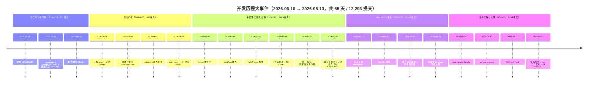

#### mermaid gitGraph：main 分支关键里程碑

```mermaid
gitGraph
    commit id: "b67e81ac9" tag: "建仓"
    commit id: "804eede9e"
    commit id: "ae2e08b4d" tag: "monorepo"
    commit id: "72688a388" tag: "vendor Cordis"
    commit id: "43f425827" tag: "agent-loop"
    commit id: "8b5a3ef73"
    commit id: "36a30180b" tag: "RFC 005"
    commit id: "247c408e7" tag: "PR #21"
    commit id: "dabc2ff41" tag: "pnpm"
    commit id: "fb9636db4" tag: "ACP bridge"
    commit id: "d02e9f1bd" tag: "packages/core"
    commit id: "1a81f2ccc" tag: "subagent"
    commit id: "e45053f0f" tag: "compaction"
    commit id: "65165b5d5" tag: "hooks"
    commit id: "1d43ea3cd" tag: "workflow"
    commit id: "1fbe7c39d" tag: "MCP client"
    commit id: "7b8c3a9b4" tag: "sandbox"
    commit id: "2dc62497c" tag: "跨家族沙箱"
    commit id: "0a486f09c" tag: "native/"
    commit id: "42b07a702" tag: "SDK 工具链"
    commit id: "a6a3807a0" tag: "GUI 骨架"
    commit id: "6baa03059" tag: "dsh CLI"
    commit id: "3fc35c91f" tag: "包重组"
    commit id: "955a12cca" tag: "消息队列"
    commit id: "ec601ca13" tag: "vendor rescope"
    commit id: "b64c3ac1b" tag: "0.0.1-rc.1"
    commit id: "a2d0f7f41" tag: "命名契约"
    commit id: "8c1e8d989" tag: "npm public"
    commit id: "47f943859" tag: "HEAD PR #2519"
```

> 图中每个 commit id 为真实 hash 的前 9 位（`git show <完整 hash>` 可复核），按提交日期顺序排列在 main 线上；gitGraph 仅示意顺序，不代表真实父子拓扑。

#### mermaid gitGraph：6/15–6/16 最早的栈式拆分链（示意）

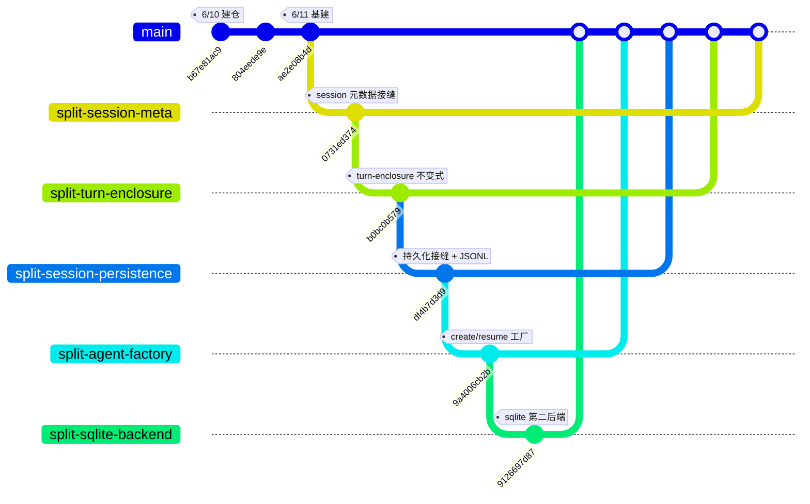

> 示意：五个 `split/*` 分支最终以 PR #33~#35（6/17）落回 main（`edd6eb28dd`）。真实链路为逐级前向合并（split/session-meta → split/turn-enclosure → split/session-persistence → split/agent-factory → split/session-persistence-sqlite），对应合并提交 `c4fd22f0fa` / `96331432b8` / `f40dcb5f7b` / `f0d9383f49`（6/15–6/16，subject 均为 `Merge branch 'split/xxx' into split/yyy'`）；分支名省略 `split/` 前缀，图中仅表达"栈式落回主线"的形态，不表达真实提交拓扑。

#### mermaid pie：提交类型分布

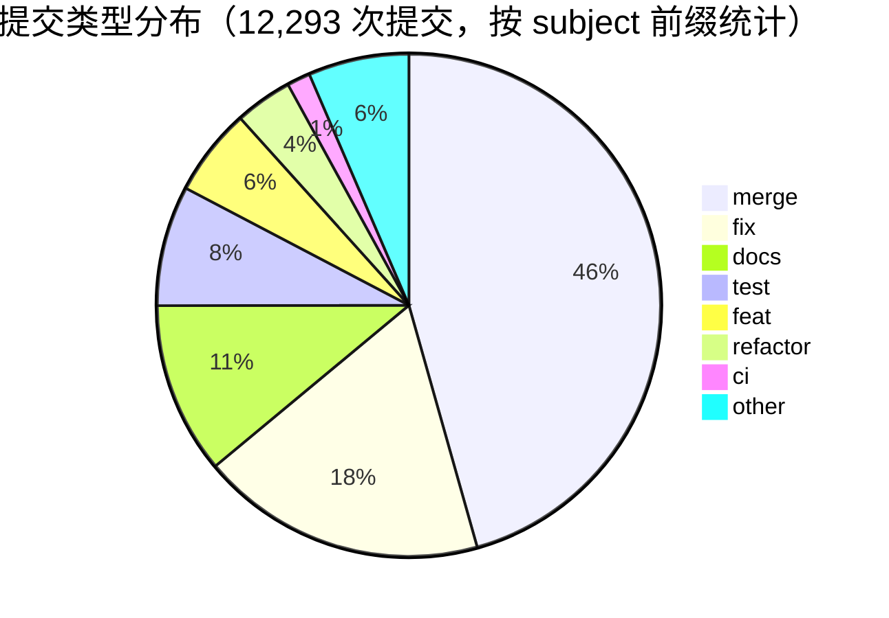

> 前缀统计口径下 5,609 + 2,252 + 1,356 + 950 + 693 + 454 + 184 + 795 = 12,293，与总提交一致；`--merges`（按父提交数）为 5,610，差 1 来自一条 subject 不以 `Merge` 开头的合并提交。"other" 含无前缀/非标准 subject（约 795，其中早期英文短句提交为主）。

---

### 跨阶段观察

#### 质量门禁演化

| 日期 | 门禁 | 出处 |
| --- | --- | --- |
| 06-11 | 100% 每文件测试覆盖率 | `bfb034830f` |
| 06-11 | knip / publint / workspace 约束 | `6796a3922d` |
| 06-11 | lefthook 钩子 + vendor manifest 守卫 | `9d20a36cc4` |
| 06-14 | doc-sync 门禁（RFC 006） | `6a528be569` |
| 06-16 | merge-commit 政策 + markdown 折行约定 | `67447fcdc3` |
| 06-16 | module-graph 门禁 | `4c8c1da8b3` |
| 07-04 | 文档分级与预算门禁 | `aa36b3b36b` |
| 07-19 | 非平凡变更必须带 Agent Note | `b1b57a0ac5` |
| 08-09 | lint 全面切换 Oxlint | `36ef892559` |

> 门禁从"测试/构建"（6/11）→"提交前守门"（6/14–6/16）→"文档与决策记录"（7/4、7/19）→"lint 引擎统一"（8/9），与仓库从微内核走向发布工程的节奏同步。

#### 阶段遗产与伏笔

- **阶段一 → 全部**：质量门禁全套成为此后每个阶段的默认基线；ADR/RFC 双轨决策记录在 7/19 演化为 Agent Notes（`e8eddc7ef8`）。
- **阶段二 → 阶段三/四**：`split/*` 栈式拆分在 7 月被 worktree-*（210 个 PR）与 codex-*（209 个 PR）规模化；session surface 让"会话日志=唯一表层派生"成为持久化铁律；`dsh-brand`（`d6a2ab30c8`）为全仓 Branded ID 提供基础。
- **阶段三 → 阶段五**：7/9 沙箱接缝（`7b8c3a9b40`）→ 7/14 跨家族文件沙箱（`2dc62497ce`）→ 8/8 Landlock 发布路径统一（PR #1734）→ 8/13 native 包公开；7/11 `python/` 目录 → 8/13 Python SDK 随全家桶发布。
- **阶段四 → 阶段五**：7/30 包重组三连是 8/13 命名契约的预演；7/31 自举安装（install 流程 `631510f54e`）为 8/13 npm 安装铺路；web 消息队列与 goal e2e 归位让宿主在发布前收敛。
- **阶段五 → 定格**：命名契约（3,281 文件）与公开发布（`8c1e8d9890`）同日落库，HEAD 定格于 PR #2519 合并提交 `47f943859b`；PR #2520/#2521 完成论文链接与最终 rc 发布。

#### 文档与决策记录规模（导言章节数据）

- `docs/` 7 个子目录 215 个 md；**1,078 个 .zh.md + 1,078 个 .i18n.yaml**（全量双语）
- `.agents/notes/` 1,372 条：implemented 1,012 / archived 285 / proposed 50 / rejected 22
- workspace 包 **219 个**（`@deepseek-ai/dsh-*`，44+ 包组）
- 提交类型里 `docs`（1,356）+ `test`（950）= 2,306，超过 `feat`（693）的 3 倍——"文档与测试随代码同行"

---

### 附录：65 天逐日提交数（2026-06-10 → 2026-08-13）

`git log --format="%ad" --date=short` 全量按日聚合（author date）：

| 日期 | 提交 | 日期 | 提交 | 日期 | 提交 | 日期 | 提交 | 日期 | 提交 |
| --- | --- | --- | --- | --- | --- | --- | --- | --- | --- | --- |
| 06-10 | 2 | 06-11 | 24 | 06-12 | 3 | 06-13 | 8 | 06-14 | 30 |
| 06-15 | 34 | 06-16 | 48 | 06-17 | 33 | 06-18 | 41 | 06-19 | 39 |
| 06-20 | 87 | 06-21 | 73 | 06-22 | 39 | 06-23 | 23 | 06-24 | 3 |
| 06-25 | 14 | 06-26 | 21 | 06-27 | 2 | 06-28 | 6 | 06-29 | 30 |
| 06-30 | 21 | 07-01 | 39 | 07-02 | 46 | 07-03 | 53 | 07-04 | 177 |
| 07-05 | 74 | 07-06 | 129 | 07-07 | 100 | 07-08 | 118 | 07-09 | 137 |
| 07-10 | 73 | 07-11 | 50 | 07-12 | 77 | 07-13 | 104 | 07-14 | 528 |
| 07-15 | 374 | 07-16 | 150 | 07-17 | 114 | 07-18 | 94 | 07-19 | 385 |
| 07-20 | 365 | 07-21 | 277 | 07-22 | 396 | 07-23 | 383 | 07-24 | 264 |
| 07-25 | 136 | 07-26 | 348 | 07-27 | 595 | 07-28 | 539 | 07-29 | 589 |
| 07-30 | 887 | 07-31 | 672 | 08-01 | 89 | 08-02 | 171 | 08-03 | 206 |
| 08-04 | 221 | 08-05 | 245 | 08-06 | 319 | 08-07 | 324 | 08-08 | 304 |
| 08-09 | 347 | 08-10 | 396 | 08-11 | 473 | 08-12 | 181 | 08-13 | 163 |

> 逐日加总 = 12,293。可据此复核任意周/月/阶段聚合：例如 7/16–7/31 逐日求和 = 6,194（阶段四），8/1–8/13 = 3,439（阶段五），6/10–6/15 = 101（阶段一）。

#### 常见口径问答

为什么 6 月贡献矩阵合计（610）大于 6 月提交数（581）？
: 矩阵按作者归属统计、按行加总，可能计入非 master 或口径外的提交；本文以日期聚合（581）为提交数口径，矩阵仅作贡献结构参考（见"月度贡献矩阵"）。

为什么阶段三合并提交数有两处（1,085 / 1,139）？
: 1,085 为 07-01~07-15 精确日窗的 `--merges` 统计；1,139 为早期稿本数字，或含 7/16 边界提交。阶段快照表两处并存并注明口径。

为什么 `merge` 前缀计数是 5,609 而 `--merges` 是 5,610？
: 一条合并提交的 subject 不以 `Merge` 开头（被计入其他前缀），按父提交数统计则 +1。正文以 5,610 为合并提交数，饼图按前缀统计（合计恰为 12,293）。

为什么 0.1.0-rc.4 不在 release 序列里？
: `git log --grep="^release(dsh)"` 实测无 0.1.0-rc.4 提交（git 历史未记录）；8/13 连发序列为 0.0.1-rc.3/4/5 与 0.1.0-rc.1/2/3/5。

为什么用 `--grep="Merge pull request #N"` 查 PR 会命中错误编号？
: `--grep` 为正则子串匹配，`#116 ` 会命中 `#1161` 等更长编号；精确查询请核对合并提交 hash（正文均已给出）或按分支名过滤。

为什么包组表的 shell/terminal/jobs 首提交在 8/13？
: 该表按"当前路径首个提交"统计；8/13 命名契约（`a2d0f7f411`）才创建这些新路径，旧路径（如 bash 包）的真实诞生日见各阶段叙述。

命名契约为什么是 3,281 而不是 3,282？
: `git show --stat a2d0f7f411` 尾部汇总为 "3281 files changed"；早期稿本 3,282 为含边界的一处约数，本文以实测为准。

---

### 数据引用块

> [!NOTE]
> **统计口径（author-date）**：本文所有提交数与日期均以 `git log --format="%ad" --date=short` 的 **author date** 为准，分析范围为 master 全历史，HEAD = `47f943859b`（2026-08-13 19:38，PR #2519 的合并提交）。总提交 12,293 = 6 月 581 + 7 月 8,273 + 8 月 3,439 = 五阶段 101 + 480 + 2,079 + 6,194 + 3,439 = 十周 67 + 355 + 108 + 440 + 684 + 1,749 + 2,169 + 3,542 + 1,966 + 1,213，三路对账一致。合并提交 5,610（45.6%），非合并 6,683。仓库无任何 tag，PR 编号至 #2521。

> [!TIP]
> **用 git 复核本文数据**：

```text
# 复核总提交数与合并提交数
git log --oneline | Measure-Object -Line
git log --merges --oneline | Measure-Object -Line

# 复核某周提交数（如 2026-W31：7/27–8/2，应为 3,542）
git log --since=2026-07-27 --until=2026-08-03 --format="%ad" --date=short | Measure-Object -Line

# 复核单日提交数（如 7/30，应为 887）
git log --since=2026-07-30 --until=2026-07-31 --format="%ad" --date=short | Measure-Object -Line

# 复核关键提交（hash 均来自正文）
git show b67e81ac97 --stat
git show a2d0f7f411 --stat      # 命名契约：3,281 文件
git show 8c1e8d9890 --stat      # 公开发布：222 文件
git show a6a3807a07 --stat      # GUI 骨架

# 复核 release 序列
git log --grep="^release(dsh)" --format="%h %ad %s" --date=short

# 复核某个 PR 的合入提交
git log --grep="Merge pull request #2302" --format="%h %ad %s" --date=short

# 看某日代表提交（注意边界日归属，见下方 WARNING）
git log --since=2026-07-30 --until=2026-07-31 --format="%h %ad %s" --date=short | Select-Object -First 10

# 看栈式拆分痕迹（split/* 分支链）
git log --grep="Merge branch 'split/" --format="%h %ad %s" --date=short
```

> [!WARNING]
> `git log --since/--until` 对纯日期按本地时区 00:00 解析，跨时区观察可能把边界日的部分提交计入相邻窗口；本文逐日/逐周数字一律以 `--format="%ad" --date=short` 全量导出后按日期字符串聚合，不受该边界问题影响。若你复核时与本文数字相差 ±1~2，先检查边界日归属。

> [!IMPORTANT]
> **勘误与口径**：① 命名契约 `a2d0f7f411` 实改 3,281 个文件（早期稿本 3,282）；② 阶段三合并提交精确日窗为 1,085（早期稿本 1,139，或含 7/16 边界）；③ `merge` 前缀 5,609 vs `--merges` 5,610 的口径差异；④ `llm`/`session` 首提交同为 `d5a1d9bb75` 反映早期包未拆分；⑤ 8/13 改名后新路径（shell/terminal/jobs 等）的首提交记于 `a2d0f7f411`，真实诞生日见各阶段正文。

#### 术语定义

术语
: **合并提交（merge commit）**——父提交数 > 1 的提交，本文统一以 `git log --merges` 统计，共 5,610。

栈式 PR（stacked PR）
: 一组依赖关系线性排列的 PR（A ← B ← C，各以低一层为 base），按序合入。仓库从 6/15 的 `split/*` 分支链开始使用，7 月 worktree-* 系列（210 个 PR）与 codex-* 系列（209 个 PR）将其规模化；7/16–7/31 阶段合并提交占比 47.8%。

author date
: 提交的**作者日期**（非提交者日期/合入日期），本文全部日期与逐日统计均以此为准。

Agent Note
: 7/19 由 RFC 改名而来的决策记录制度（`e8eddc7ef8`），非平凡变更必须附带的实施笔记（`b1b57a0ac5`）；仓库最终有 `.agents/notes/` 1,372 条（implemented 1,012 / archived 285 / proposed 50 / rejected 22）。

命名契约
: 8/13 的全库词汇收敛提交（`a2d0f7f411`，PR #2302）：task→job、bash→shell、pty→terminal 等，实改 3,281 个文件、21,708 insertions / 21,570 deletions。

合并占比
: 某时间窗内合并提交数 ÷ 提交总数。阶段一 26.7% → 阶段二 35.2% → 阶段三 52.2% → 阶段四 47.8% → 阶段五 39.8%；全程 5,610 / 12,293 = 45.6%。阶段三峰值反映栈式 PR 工作流的合并密度。

ISO 周（W24–W33）
: 本文周表的编号采用 ISO 8601 周（周一为一周起点）。2026-W24 为 6/8–6/14（仓库 6/10 才建仓），W25=6/15–6/21，……，W33=8/10–8/16（仓库止于 8/13）。

publishConfig.access
: npm package.json 中控制发布可见性的字段；`8c1e8d9890` 把 221 个清单的该字段置为 public，是"npm 公开发布"的内容提交（PR #2519）。

#### 数据可信度自检清单

- [x] 总提交数 12,293 与 `git log` 全量一致
- [x] 合并提交 5,610 与 `git log --merges` 一致
- [x] 月度 581 / 8,273 / 3,439 与逐日聚合一致
- [x] 五阶段 101 / 480 / 2,079 / 6,194 / 3,439 与逐日聚合一致
- [x] 十周 67 / 355 / 108 / 440 / 684 / 1,749 / 2,169 / 3,542 / 1,966 / 1,213 与逐日聚合一致
- [x] 周峰值 3,542（W31）、日峰值 887（7/30）与逐日聚合一致
- [x] 类型分布（fix 2,252 / docs 1,356 / test 950 / feat 693 / refactor 454 / ci 184 / merge 5,609 / other 795）与 subject 前缀统计一致
- [x] 全部 commit hash 来自正文既有事实或本会话 `git log` / `git show` 实测
- [x] 未经验证的细节（如 0.1.0-rc.4、个别 PR 的精确合入时间）一律标注"（git 历史未记录）"或不出现在正文

> 本章节由时间线分析 agent 基于 `git log` 全量抽取撰写；汇总版见根目录 DEVELOPMENT-HISTORY.md。


## 包与能力演进

### 总览

包体系遵循一条明确的设计模型——**能力缝（capability seam）**：一类可替换能力 = Service Definition（抽象服务）/ Service Provider（提供方实现）/ Consumer（模型侧工具等消费方）三角色，各自独立演化（决策记录：[2026-06-13-capability-seams](.agents/notes/implemented/architecture/2026-06-13-capability-seams.md)）。从 6/11 的 2 个抽象服务包起步，到 8/13 定格为 **49 个包组、219 个 workspace 包**（组级首个提交/提交数见 [包组总表](#包组总表)，统计口径见下文 [!NOTE]），每个能力都以"缝"为单位整体落位，从不只做一角。三角色的分工如下：

- **Service Definition（抽象服务）**
  : 定义类型化事件与服务方法，是"缝"的契约面——声明谁可注入、谁可监听、事件如何合并扩展（typed event declaration merging）。它只描述能力，不实现能力。
- **Service Provider（提供方实现）**
  : 通过 `ctx.effect()` / `ctx.on()` 注册实现，`register()` 返回 disposer。同一缝可挂多个 provider（本地实现、沙箱后端、云适配器），由配置（cordis.yml）选型。
- **Consumer（消费方）**
  : 把缝的能力翻译给具体消费面——模型侧工具 schema、UI 渲染、传输协议、回放/查询视图。工具 schema 的 UI render intent（`generic` / `terminal` / `diff`）也是 Consumer 的设计责任。

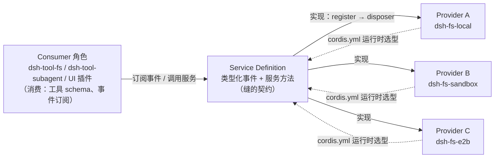

一个"缝"的完整性纪律在 AGENTS.md 与 packages/AGENTS.md 中被反复强调：*能力缝完整时必含三角色，只做一角即视为半成品；新行为走文档化的扩展点，改动 `agent-loop` 必须同步更新 docs/architecture.md。*

这条纪律直接塑造了包布局——打开任意一组，几乎都能在同一组目录内同时找到 seam、provider 与 tool/UI 消费方三件套。

三条结构性重组主线贯穿全程：

- **6/20 模块化层级化**：扁平 `packages/` → `<group>/<pkg>` 两级，`core` 由此诞生。
- **7/30 包重组三连**：溶解 `ui/`、更名 `sdk/` → `scaffold/`、折叠 session 家族、`timeout/` 并入 `guard/`。
- **8/13 仓库命名契约**（`a2d0f7f411`，PR #2302，3,281 个文件）：task→job、bash→shell、pty→terminal 等词汇收敛，同时把 compaction / identity / jobs / shell / terminal / test-support / runtime-diagnostics / extensions 落位为正式包组。

三次重组各自配了"重组前 → 重组后"对照表，见 [三次结构性重组](#三次结构性重组)。

> [!NOTE] 统计口径
> 本文的 **219 个 workspace 包** 指 `.analysis/workspace-packages.txt` 中全部 `@deepseek-ai/dsh-*` npm 名（实测于各 `packages/<group>/<pkg>/package.json`）；**49 个包组** 指 `packages/<group>/<pkg>` 两级目录的组级目录数，与 `.analysis/packages-first-commit.txt` 的 49 个组条目一一对应。`apps/` 下的 CLI 与 Web 应用壳不在 workspace-packages.txt 中，故不计入 219。早期文本（如本文档 8/13 前的版本）记作"44+ 组、100+ 子包"，本文按实测数据精确为 49 组 / 219 包。

> [!WARNING] 命名契约前后包名不一致
> 8/13 命名契约（`a2d0f7f411`）前后，部分包的 npm 名与目录名并不一致，引用旧文档或旧 hash 时务必核对：bash 族**组目录**已更名为 `shell/`，缝包与环境包采用新名（`dsh-bash` → `dsh-shell`、`dsh-bash-env` → `dsh-shell-env`）；而 local/sandbox provider 与命令工具**保留了旧 npm 名**——实测 `dsh-bash-local`、`dsh-bash-sandbox`、`dsh-pwsh-local`、`dsh-pwsh-sandbox`、`dsh-tool-bash`、`dsh-tool-pwsh` 至今仍存在（目录在 `packages/shell/` 下），并新增了 `dsh-tool-bash-persistent`。同理，`task` 词汇已收敛为 `job`（`dsh-jobs` 组、`dsh-tool-jobs`），`pty` 收敛为 `terminal`（`dsh-terminal` 组）。跨组前缀也有例外：`dsh-client-ui-cordis` 实际在 `extensions/` 组，`dsh-client-test-runtime` 实际在 `test-support/` 组，`dsh-token-meter` 在 `llm/` 组，`dsh-persona` 在 `preset/` 组，`dsh-headless` 在 `bundle/` 组。

> [!TIP] 阅读线索
> 读包图时按"缝"读：一个能力 = Service Definition + Provider + Consumer，三者在组内或近邻落位（如 `fs` / `fs-local` / `tool-fs`）。若某组只见一角，通常是该角色尚在演化或已被并入邻组（如 `timeout/` 7/30 并入 `guard/`）。8/13 之后，AGENTS.md 与 packages/README.md 的组表（早期文本记 44+ 组，实测 49 组）即为现行权威形态。

**包体系形态速览**（全部数字实测于 `.analysis/workspace-packages.txt` 与 `.analysis/packages-first-commit.txt`）：

| 形态 | 数值 | 说明 |
|---|---|---|
| 包组总数 | 49 | 组级目录，与 packages-first-commit.txt 条目一一对应 |
| workspace 包总数 | 219 | 全部 `@deepseek-ai/dsh-*` npm 名 |
| 单组最大 | client（39） | 占总数约 18% |
| 多子包组（5+ 包） | 12 组 / 124 包 | client、session、subagent、shell、core、host、fs、util、web、test-support、llm、interaction |
| 单包组 | 8 个 | acp、identity、mcp、plan、runtime-diagnostics、schedule、todo、workspace |
| 工具包（`dsh-tool-*`） | 22 个 | 分布在 15 个组，外加中枢 `dsh-tools` |
| 提交数前三 | client 2,241 / core 1,564 / subagent 641 | 全库提交分布（组级口径） |

命名契约（`@deepseek-ai/dsh-<pkg>` ↔ `packages/<group>/<pkg>`）在 49 组中整体成立，例外清单见文末 [附：跨组命名例外与统计校验](#附跨组命名例外与统计校验)。

---

### 包组总表

下表为 49 个包组的完整清单。首个提交/日期/提交数取自 `.analysis/packages-first-commit.txt`；子包数按 `.analysis/workspace-packages.txt` 中该组实测 npm 包计数；代表子包按组内目录列举，多余部分以"等 N 个"省略。

| 包组 | 首个提交 | 日期 | 提交数 | 子包数 | 职责（代表子包） | 关键演进 |
|---|---|---|---|---|---|---|
| acp | `fb9636db44` | 06-16 | 128 | 1 | 自动化专用 Agent Client Protocol 服务器（`acp`） | 最早的外部协议面之一 |
| api | `bb61dc13f2` | 08-07 | 69 | 2 | 远程 BFF 组装 + Typert RPC gateway（`api-gateway`、`api-remotes`） | 8/7 补齐远程面；api-remotes 是全库唯一拆分多聚合的包 |
| attachment | `cb4c11b869` | 07-23 | 36 | 2 | 持久附件身份/校验/内容寻址存储（`attachment`、`attachment-local`） | 内容寻址存储 |
| boot | `3fc35c91ff` | 07-30 | 116 | 2 | 共享 app-bin 粘合（`app-boot`、`cmdline`） | 7/30 重组三连落位 |
| bundle | `2365b2c54f` | 08-06 | 238 | 3 | 可安装的 `dsh --profile` 补丁层（`base`、`headless`、`web-app`） | 每个 profile 的第一补丁层是 `dsh-base` |
| client | `a6a3807a07` | 07-19 | 2241 | 39 | Web 浏览器半：shell、wire、对象服务、slots、ui-* 插件（`connection`、`runtime`、`modules`、`schema-form`、`web`、`web-react` 等 33 个） | 全库最大组（2,241 提交）；7/30 曾溶解旧 `ui/` 组 |
| code-runtime | `6da6f04016` | 07-08 | 125 | 2 | 代码执行能力族：seam + worker 线程 provider + Code Mode Consumer（`code-runtime`、`code-runtime-worker-thread`） | 7/8 落地 |
| compaction | `a2d0f7f411` | 08-13 | 11 | 4 | 压缩能力：seam + basic provider + 工具结果剪枝（`compaction`、`compaction-basic`、`compaction-tool-result-pruner`、`command-compact`） | 8/13 由既有代码改名/重组落地 |
| context | `a9d74932b1` | 07-14 | 309 | 4 | 模型可见请求上下文（`time-context`、`tmux-context`、`agent-instructions`、`session-reference`） | 7/14 落地 |
| core | `d02e9f1bd6` | 06-20 | 1564 | 8 | 产品 API 主轴：agent / agent-loop / session / system-prompt / tools / scope（`agent`、`agent-loop`、`session`、`system-prompt`、`tools`、`scope`、`agent-default-model`、`agent-tool-presentation`） | 6/20 模块化重组诞生；提交数全库第二 |
| credentials | `3a794495ad` | 07-29 | 68 | 2 | 凭据引用能力（`credentials`、`credentials-local`） | env-over-.env provider |
| e2b | `e7b682f1f6` | 07-28 | 71 | 3 | E2B POC：云沙箱 + FS/subprocess 适配器（`e2b`、`fs-e2b`、`subprocess-e2b`） | 7/28 的 POC 探索 |
| examples | `6f77da4c8c` | 07-15 | 392 | 3 | 演示 bundle（`agent-spine-demo`、`acp-demo`、`sdk-jsonrpc-demo`） | 与 sdk 同日诞生 |
| extensions | `4064198560`（内容）/ `a2d0f7f411`（正式组） | 08-12 / 08-13 | 28 | 4 | agent 运行时自修改：动态插件运行时与 UI（`tool-cordis`、`ui-cordis`、`cordis-client-runner`、`cordis-host-runner`） | 内容诞生于 8/12，8/13 落位正式组 |
| feedback | `0ccd3ed463` | 07-29 | 43 | 2 | 人类反馈（`command-feedback`、`message-feedback`） | 8/10 加持久后端 |
| fs | `5e01564afb` | 06-22 | 335 | 7 | 文件系统能力族：seam + local + sandbox + 观察策略（`fs`、`fs-local`、`fs-sandbox`、`fs-observation-policy`、`tool-fs`、`tool-fs-search`、`tool-str-replace-editor`） | 6/22 落地 |
| goal | `a525776015` | 07-19 | 209 | 4 | 同会话目标持久化（`goal`、`goal-round-driver`、`command-goal`、`tool-goal`） | 与 client/host 同日诞生 |
| guard | `db26ef479d` | 07-08 | 119 | 2 | 循环卫生：重复调用提醒 + 工具超时执行器（`repeat-tool-reminder`、`timeout-policy`） | 7/30 `timeout/` 并入 |
| hooks | `65165b5d54` | 07-01 | 240 | 3 | Claude Code / Codex 钩子桥 + 共享线协议库（`hook-protocol`、`hooks-claude-code`、`hooks-codex`） | 7/1 落地 |
| host | `a6a3807a07` | 07-19 | 899 | 8 | Web 宿主半：API gateway + HTTP 路由（`webserver`、`apiproxy`、`frontend-static`、`plugin-inventory`、`directory-picker` 等 3 个） | 与 client 同日诞生 |
| identity | `a2d0f7f411` | 08-13 | 10 | 1 | 匿名身份（`anonymous-user-id`） | 遥测/反馈关联 |
| interaction | `3fc35c91ff` | 07-30 | 42 | 5 | 审批/交互能力：permission、commands、ask-user（`commands`、`permission-presets`、`tool-ask-user`、`user-approval`、`user-questions`） | 7/30 重组落位 |
| jobs | `a2d0f7f411` | 08-13 | 11 | 3 | 后台任务（`jobs`、`jobs-local`、`tool-jobs`） | 8/13 task→job 词汇收敛落位 |
| llm | `d5a1d9bb75` | 06-11 | 518 | 5 | LLM 能力：Service Definition/Consumer + DeepSeek providers（`llm`、`llm-deepseek`、`llm-pi-ai`、`llm-retry`、`token-meter`） | 全库最早（与 session 并列）；ADR 0010 双实现 |
| lsp | `d0029d8d60` | 07-16 | 105 | 3 | 语言服务器能力族：seam + 通用 stdio provider + `lsp` 工具（`lsp`、`lsp-stdio`、`tool-lsp`） | 7/16 落地 |
| mcp | `1fbe7c39d4` | 07-07 | 78 | 1 | MCP 客户端（`mcp-client`） | 7/15 合入 |
| plan | `f4185122dc` | 07-22 | 110 | 1 | 计划模式作为记录状态（`plan-mode`） | 7/22 落地 |
| preset | `18fe174897` | 08-03 | 117 | 2 | 每会话 agent 组合（`agent-presets`、`persona`） | 8/3 落地 |
| runtime-diagnostics | `a2d0f7f411` | 08-13 | 10 | 1 | 运行时诊断（`invariants`） | 8/13 落位 |
| sandbox | `7b8c3a9b40` | 07-09 | 199 | 4 | 进程约束缝：bwrap / Landlock / Seatbelt 后端（`sandbox`、`sandbox-local`、`sandbox-policy`、`sandbox-windows-acl`） | 7/9 落地 |
| schedule | `a229b42e24` | 08-05 | 62 | 1 | 会话本地定时跟进（`schedule`） | durable after / 绝对时间 |
| sdk | `42b07a7022` | 07-15 | 160 | 3 | 进程外运行时 SDK：JSON-RPC 协议 + TS 客户端 + 服务器插件（`sdk-protocol`、`sdk-server`、`sdk-client`） | 7/15 落地 |
| session | `d5a1d9bb75` | 06-11 | 120 | 13 | 持久会话数据：persistence / projection / titles / telemetry（`session`、`session-persistence`、`session-persistence-jsonl`、`session-persistence-sqlite`、`session-projection`、`session-title` 等 7 个） | 7/30 折叠 12 包入组 |
| session-query | `aa1dc0e2c7` | 07-10 | 199 | 4 | 会话检索族（`session-query`、`session-query-sqlite`、`session-log-export`、`tool-session-query`） | 语料/血缘/语义过滤/FTS |
| settings | `ec0786e099` | 07-28 | 89 | 2 | 用户设置能力（`settings`、`settings-file`） | file provider |
| shell | `a2d0f7f411` | 08-13 | 14 | 9 | bash 能力：Service Definition + local/pwsh providers + shell Consumers（`shell`、`shell-env`、`bash-local`、`bash-sandbox`、`pwsh-local`、`tool-bash`、`tool-pwsh` 等 2 个） | 内容自 6/12（`8b5a3ef730`），8/13 定名 shell 族 |
| skill | `6292d52236` | 07-10 | 222 | 4 | 技能注册表 + 本地实现 + 目录/加载工具（`skill`、`skill-filesystem`、`skill-badge`、`tool-skill`） | 7/10 落地 |
| spill | `463b72ce96` | 07-08 | 80 | 3 | 工具结果溢出存储（`spill`、`spill-local`、`spill-policy`） | 7/8 落地 |
| storage | `e90b0d51df` | 07-24 | 54 | 4 | 非会话存储枢纽（`storage`、`storage-domain`、`storage-json`、`storage-sqlite`） | 7/24 落地 |
| subagent | `1a81f2cccd` | 06-21 | 641 | 11 | 子代理能力缝：Service Definition + providers + delegation Consumers（`subagent`、`subagent-in-process-driver`、`subagent-spawn-in-process`、`subagent-fork-in-process`、`subagent-acp`、`subagent-claude-code` 等 5 个） | 6/21 落地；提交数全库第三 |
| subprocess | `fc566119a7` | 07-26 | 98 | 2 | 子进程能力族 + 本地进程树 provider（`subprocess`、`subprocess-local`） | 7/26 落地 |
| terminal | `a2d0f7f411` | 08-13 | 10 | 3 | PTY 终端族（`terminal`、`terminal-bash`、`tool-terminal`） | 8/13 pty→terminal 定名 |
| test-support | `a2d0f7f411` | 08-13 | 12 | 6 | 测试支撑（`acp-snapshot`、`agent-loop-testkit`、`client-runtime`、`llm-mock-server`、`llm-replay`、`loader-smoke`） | 8/13 落位；LLM 侧测试工具在此组 |
| todo | `46e31d8481` | 06-29 | 161 | 1 | `todo_write` 模型侧工具（`tool-todo`） | 6/29 落地 |
| typert | `f773985e71` | 07-28 | 85 | 4 | 类型图生成 / 加载 / 运行时注册表（`typert-generator`、`typert-loader`、`typert-protocol`、`typert-registry`） | 7/28 落地 |
| util | `d6a2ab30c8` | 06-21 | 150 | 7 | 零依赖工具库（`brand`、`atomic-write`、`home-paths`、`launch-environment`、`native-command`、`output-retention`、`timeout`） | Branded 类型起源 |
| web | `d01f5f73b7` | 06-25 | 167 | 6 | Web 能力族：seam + 搜索/抓取 provider + 模型侧工具（`web`、`web-fetch-http`、`web-search-deepseek`、`web-search-exa`、`web-search-perplexity`、`tool-web`） | 6/25 落地 |
| workflow | `1d43ea3cd5` | 07-05 | 171 | 4 | 工作流能力：seam + worker 线程引擎 + 模型侧工具（`workflow`、`workflow-worker-thread`、`tool-workflow`、`tool-ralph`） | 7/5 落地 |
| workspace | `013e6f8769` | 07-24 | 50 | 1 | 工作区实体（`workspace`） | 7/24 落地 |

组内目录与 npm 名的一般映射规则是 `packages/<group>/<pkg>` ↔ `@deepseek-ai/dsh-<pkg>`，但存在几类实测例外，引用时以 package.json 为准：

```text
packages/<group>/<pkg>          # 目录两级
@deepseek-ai/dsh-<pkg>          # npm 名（规则形态）
dsh-bash-local                  # 例外：目录 shell/bash-local，保留旧名
dsh-client-ui-cordis            # 例外：目录 extensions/ui-cordis，带 client- 前缀
dsh-client-test-runtime         # 例外：目录 test-support/client-runtime，带 client- 前缀
dsh-token-meter                 # 例外：目录 llm/token-meter，无 llm- 前缀
dsh-persona / dsh-headless      # 例外：目录 preset/persona、bundle/headless
```

按子包数分布看，包体系呈"两头重"结构（合计校验：49 组、219 包，见文末附节）：

- **`client`（39）单组独占近 1/5**（39/219 ≈ 18%），是全库唯一的巨型组。
- **多子包组（5 个包以上）共 12 个**：client（39）、session（13）、subagent（11）、shell（9）、core（8）、host（8）、fs（7）、util（7）、web（6）、test-support（6）、llm（5）、interaction（5），合计 124 包。
- **其余 37 组为 1–4 个包的"小而整"形态**（合计 95 包，均值约 2.6）——这与"一个能力 = 一个缝 = 少数几个角色包"的设计一致。

多子包组往往意味着该领域已被拆成多个并列角色：session 是持久化/投影/标题/遥测四个角色族，subagent 是 provider 多样化（进程内三形态 + 四个外部适配器），shell 是双壳双后端 + 三个工具，client 则是 31 个 ui-* 插件加 8 个基础设施包。

---

### 按领域分节

下面按领域把 49 个组重新组织为 12 节。每节给出：诞生信息、子包清单表、3–6 个关键里程碑（commit hash + 日期 + 主题）、一段演进要点。领域与包组的对应关系速查如下：

| 领域（节） | 覆盖包组 |
|---|---|
| 1. 核心循环 | core（8 包） |
| 2. LLM 族 | llm、test-support（llm-replay / llm-mock-server） |
| 3. 工具层 | 22 个 `dsh-tool-*` + 中枢 `dsh-tools`（15 个组） |
| 4. 执行与沙箱 | shell、subprocess、code-runtime、sandbox、terminal、e2b |
| 5. 文件与 LSP | fs、lsp |
| 6. 会话数据 | session、session-query、storage、workspace、attachment、spill |
| 7. 子代理与编排 | subagent、workflow、jobs、goal、schedule、plan |
| 8. 技能与上下文 | skill、context、preset（persona）、llm（token-meter） |
| 9. 安全与治理 | guard、sandbox、interaction、credentials、settings、identity |
| 10. Web GUI 两半 | client、host、web、interaction |
| 11. 外部协议 | sdk、acp、hooks、mcp、examples |
| 12. 发布与自举 | bundle、boot、api、typert、extensions、test-support、util、runtime-diagnostics |

同一包组可能出现在多个领域（如 test-support 同时服务 LLM 测试与发布质量门、interaction 同时服务安全与 GUI 命令面），上表取主视角归属。

#### 1. 核心循环（core/*）

**诞生**：`core` 组诞生于 6/20 的模块化层级重组（`d02e9f1bd6` "Reorganize packages into a modular hierarchy"），把此前扁平落位的产品 API 包收拢为 `packages/core/`。它是全库提交数第二的组（1,564 提交，仅次于 client 的 2,241）。

| 子包 | 职责 |
|---|---|
| `agent` | Agent 接口与注册表 |
| `agent-loop` | 默认驱动，唯一具体 loop 且可替换 |
| `agent-default-model` | 默认模型选择 |
| `agent-tool-presentation` | 工具向模型的表现层（schema 呈现） |
| `session` | 会话类型与日志接口（core 层） |
| `system-prompt` | 系统提示词组装 |
| `tools` | 作用域化工具注册表与守卫执行管线 |
| `scope` | 每 agent 作用域注册原语 |

**关键里程碑**：

- **`d02e9f1bd6`（06-20）**：模块化层级重组，`core` 组诞生；次日 `d6a2ab30c8` 抽出 `dsh-brand`（util 组首个包，Branded 类型起源）。
- **7/30 折叠**（`7e445c3a67`）：session 家族 12 包折叠入 `packages/session/`，core 层的 `session` 保持"会话类型与日志接口"，持久层职责移出。
- **`a2d0f7f411`（08-13）**：命名契约把 task→job 等词汇收敛进 agent-loop / tools 的契约面；此后 AGENTS.md 规定"改动 `agent-loop` 必须同步更新 docs/architecture.md"。
- **8/13 发布系列**：`1e99f20963` → `abe560f81e` 之间 core 随全库经历 `0.0.1-rc.3` → `0.1.0-rc.5` 七个 rc 发布（详见 [发布与自举](#12-发布与自举bundlebootapitypertextensionstest-supportutilruntime-diagnostics)）。

**演进要点**：core 是"产品 API 主轴"——`agent` 定义 Agent 是什么，`agent-loop` 定义默认的驱动循环（唯一具体 loop，可整体替换），`session` 定义模型可见状态如何被记录（"模型可见 ⟺ 已记录"契约），`tools` 定义工具如何被作用域化注册并由守卫管线执行，`scope` 提供每 agent 的注册原语。它不直接产生能力，而是所有能力的挂载点；因此 AGENTS.md 明令"新行为走文档化扩展点，不改 agent-loop"。

---

#### 2. LLM 族（llm/* 与 LLM 侧 test-support）

**诞生**：`llm` 是**全库最早的两个包组之一**（与 `session` 并列），首个提交 `d5a1d9bb75`（06-11），从"抽象服务接口包（LLM 流词汇、session 日志）"起步。提交数 518。

| 子包 | 职责 |
|---|---|
| `llm` | provider 中立消息/流词汇 + 适配器缝（Service Definition） |
| `llm-deepseek` | DeepSeek 真实适配器 provider |
| `llm-pi-ai` | pi-ai 真实适配器 provider |
| `llm-retry` | 重试策略 |
| `token-meter` | replay-aware token 计量服务（`ctx.tokenMeter`） |
| `llm-replay`（test-support 组） | 无 key 的请求回放 |
| `llm-mock-server`（test-support 组） | 本地 mock 服务器 |

**关键里程碑**：

- **`d5a1d9bb75`（06-11）**：llm 与 session 同日首提交，2 个抽象服务包起步。
- **ADR 0010 双实现**（6 月）：第一天就上 `deepseek` 与 `pi-ai` 两个真实适配器，以验证"中性"词汇——避免单一实现把自家怪癖写进契约（现有章节明确记载）。
- **`a5a83bd1d9`（08-13）**：`fix(llm-pi-ai): withhold OAuth-only providers from the configurable directory`——pi-ai 侧把仅 OAuth 的 provider 从可配置目录中隐藏。
- **`a2d0f7f411`（08-13）**：命名契约；同日起 `llm-replay` / `llm-mock-server` 归入 test-support 组（LLM 侧测试工具不在 llm 组内，属跨组事实）。
- **`8c1e8d9890`（08-13）**：dsh 家族公开发布，llm 系包以 `0.1.0-rc.5` 公开。

**演进要点**：llm 组的演进主线是"词汇中性化"——先有 provider 中立词汇（消息/流），再双实现验证，随后补重试与 token 计量；测试侧用 mock-server 与 replay 支撑无 key 的确定性验证（test:snapshot 机制）。`token-meter` 的"replay-aware"定位说明 token 计量必须与回放路径一致，才能保证快照可复现。

---

#### 3. 工具层（dsh-tools 与全部 dsh-tool-*）

**诞生**：工具注册表 `dsh-tools` 随 core 诞生（`d02e9f1bd6`，06-20）；第一个独立工具包是 `todo`（`46e31d8481`，06-29，`todo_write`）。此后每个能力缝都以"模型侧工具 Consumer"为第三角落地，形成 22 个 `dsh-tool-*` 包 + 1 个中枢，分布在 14 个组中。

| 工具包 | 所在组 | 能力 |
|---|---|---|
| `dsh-tools` | core | 作用域化工具注册表与守卫执行管线（工具层中枢，非 tool-* 前缀） |
| `dsh-tool-ask-user` | interaction | 向用户提问并等待回答 |
| `dsh-tool-bash` | shell | 执行一次 bash 命令 |
| `dsh-tool-bash-persistent` | shell | 在持久 bash 会话中执行 |
| `dsh-tool-call-timeout-policy` | guard | 工具调用超时策略：tools/execute 包装，在 exec.signal 上设置 per-tool 期限，超时返回 TOOL_TIMEOUT |
| `dsh-tool-cordis` | extensions | 自指 Cordis 插件定义/挂载/卸载（`cordis_define` 工具） |
| `dsh-tool-fs` | fs | 模型侧文件系统工具 |
| `dsh-tool-fs-search` | fs | 文件搜索工具 |
| `dsh-tool-goal` | goal | 同会话目标工具 |
| `dsh-tool-jobs` | jobs | 后台任务工具 |
| `dsh-tool-lsp` | lsp | 语言服务器工具 |
| `dsh-tool-pwsh` | shell | 执行 PowerShell 命令 |
| `dsh-tool-ralph` | workflow | Ralph 新鲜代理迭代循环工具 |
| `dsh-tool-session-query` | session-query | 会话检索工具 |
| `dsh-tool-skill` | skill | 技能目录/加载工具 |
| `dsh-tool-str-replace-editor` | fs | 字符串替换编辑器工具 |
| `dsh-tool-subagent` | subagent | 委派子代理（delegation Consumer） |
| `dsh-tool-subagent-control` | subagent | 续谈控制：`send_message` / `interrupt_agent` / `list_agents`（实测 package.json 描述） |
| `dsh-tool-subagent-report` | subagent | 子代理结果回报（`report` 工具） |
| `dsh-tool-terminal` | terminal | 持久终端工具 |
| `dsh-tool-todo` | todo | `todo_write` 任务清单 |
| `dsh-tool-web` | web | Web 搜索/抓取工具 |
| `dsh-tool-workflow` | workflow | 工作流编排工具 |

**关键里程碑**：

- **`46e31d8481`（06-29）**：`todo_write` 落地，第一个独立工具包。
- **`db26ef479d`（07-08）**：guard 组诞生，工具执行管线开始有"守卫"（重复调用提醒、超时执行器）。
- **`2a40cbf8ef`（07-30）**：`timeout/` 并入 `guard/`，超时策略固化为工具执行的横切能力（今日 `dsh-tool-call-timeout-policy`）。
- **`a2d0f7f411`（08-13）**：task→job 词汇收敛（`tool-jobs` 定名）、bash→shell（`tool-bash` / `tool-pwsh` 保留旧名，新增 `tool-bash-persistent`）。

**演进要点**：工具层遵循"一个能力缝 → 一个模型侧工具"的配对律，工具包与被消费的缝同组相邻（`tool-fs` 在 fs 组、`tool-subagent` 在 subagent 组）。工具的 UI render intent（`generic` / `terminal` / `diff`）在设计期决定，呈现方法是 `args` 的纯函数；这些纪律把"工具"从一次性脚本提升为一等公民包。

工具不是孤立存在的——它们与能力缝、UI 消费方构成"缝 → 工具 → UI"三级配对，下表给出三个典型配对（包名均为实测）：

| 能力缝（Seam） | 模型侧工具（Tool Consumer） | UI 消费方（UI Consumer） |
|---|---|---|
| `dsh-subagent` | `dsh-tool-subagent` / `dsh-tool-subagent-control` / `dsh-tool-subagent-report` | `dsh-client-ui-subagent` |
| `dsh-fs` | `dsh-tool-fs` / `dsh-tool-fs-search` / `dsh-tool-str-replace-editor` | `dsh-client-ui-workspace`、`dsh-client-ui-attachment` |
| `dsh-skill` | `dsh-tool-skill` | `dsh-client-ui-skill` |

一个缝可以同时服务多个工具与多个 UI 面；反过来，一个工具只属于一个缝（没有"缝合怪"工具）。这条"配对律"是 8/13 之后包布局自查的第一条经验法则。

---

#### 4. 执行与沙箱（shell / subprocess / code-runtime / sandbox / terminal / e2b）

**诞生**：执行面按"粒度"分三层演进——命令层（bash 缝 `8b5a3ef730`，06-12）、进程层（subprocess `fc566119a7`，07-26）、代码层（code-runtime `6da6f04016`，07-08）；约束面有 sandbox（`7b8c3a9b40`，07-09）与 E2B 云沙箱 POC（`e7b682f1f6`，07-28）；交互面有 PTY 终端族（terminal，8/13 定名）。

| 组 | 子包 | 职责 |
|---|---|---|
| shell（原 bash） | `shell`、`shell-env` | bash 能力缝 + 环境变量注入 |
| shell | `bash-local`、`bash-sandbox`、`pwsh-local`、`pwsh-sandbox` | local/sandbox 双后端 × bash/pwsh 双壳 |
| shell | `tool-bash`、`tool-bash-persistent`、`tool-pwsh` | 一次性/持久会话/ PowerShell 三个模型侧工具 |
| subprocess | `subprocess`、`subprocess-local` | 子进程能力族 + 本地进程树 provider |
| code-runtime | `code-runtime`、`code-runtime-worker-thread` | 代码执行 seam + worker 线程 provider |
| sandbox | `sandbox`、`sandbox-local`、`sandbox-policy`、`sandbox-windows-acl` | 进程约束缝 + 策略 + Windows ACL 后端 |
| terminal | `terminal`、`terminal-bash`、`tool-terminal` | 持久 PTY 终端族 |
| e2b | `e2b`、`fs-e2b`、`subprocess-e2b` | E2B 云沙箱 + FS/subprocess 适配器 |

**关键里程碑**：

- **`8b5a3ef730`（06-12）**：bash 执行接缝三件套（seam + local 实现 + 模型侧工具），全库第一个"执行类"缝。
- **`7b8c3a9b40`（07-09）**：sandbox 进程约束缝，bwrap / Landlock / Seatbelt 后端。
- **`fc566119a7`（07-26）**：subprocess 能力族，本地进程树 provider。
- **`e7b682f1f6`（07-28）**：E2B POC，把 fs 与 subprocess 适配到云沙箱。
- **`c29246ae31`（08-12）**：`fix(pwsh): resolve Store app execution aliases`；次日 `29d420f1ee` 补 `fix(pwsh): accept link-shaped candidates and sync the README contract`——pwsh 侧持续打磨 Windows 下的可执行文件解析。
- **`a2d0f7f411`（08-13）**：pty→terminal 词汇收敛，terminal 组定名。

**演进要点**：执行层是"能力缝"纪律贯彻最彻底的领域之一——`dsh-shell` 的 request/spec 拆分（显式 `resolve(request): Spec`，绝不在 `run()` 内隐藏默认值）被 AGENTS.md 树为包边界的模板。沙箱侧从 Linux 三后端扩展到 Windows ACL，cloud 侧以 E2B POC 探路；命名契约后"bash 族"以 shell 组形态存在，但 provider 子包保留了 `dsh-bash-*` / `dsh-pwsh-*` 旧 npm 名（见总览 [!WARNING]）。

---

#### 5. 文件与 LSP（fs/*、lsp/*）

**诞生**：fs 能力族 `5e01564afb`（06-22），lsp 能力族 `d0029d8d60`（07-16）。fs 提交数 335，lsp 105。

| 组 | 子包 | 职责 |
|---|---|---|
| fs | `fs` | 文件系统 seam（Service Definition） |
| fs | `fs-local` | 本地文件系统实现 |
| fs | `fs-sandbox` | 沙箱后端 |
| fs | `fs-observation-policy` | 文件观察策略 |
| fs | `tool-fs`、`tool-fs-search`、`tool-str-replace-editor` | 文件工具、搜索工具、字符串替换编辑器工具 |
| lsp | `lsp` | 语言服务器能力族 seam |
| lsp | `lsp-stdio` | 通用 stdio provider |
| lsp | `tool-lsp` | `lsp` 模型侧工具 |

**关键里程碑**：

- **`5e01564afb`（06-22）**：fs 能力族诞生（seam + local + sandbox + 观察策略）。
- **`d0029d8d60`（07-16）**：lsp 能力族诞生（seam + 通用 stdio provider + `lsp` 工具）。
- **`0c708cb10d`（07-24）**：`refactor: replace overloaded surface terminology`（fs 路径上的表面术语清理）。
- **`a2d0f7f411`（08-13）**：命名契约同步 fs/lsp 词汇；两族以 0.1.0-rc 系列随全库发布。

**演进要点**：fs 是"策略与实现分离"的样板——读写能力归 seam，观察策略独立成包（`fs-observation-policy`），沙箱约束独立成后端，工具侧再按交互形态拆成读写工具、搜索工具、字符串替换编辑器三个 Consumer（后者体现"工具的 UI render intent 是设计的一部分"）。lsp 则验证"通用 stdio provider"模式：一个协议适配器可服务多个语言服务器。

---

#### 6. 会话数据（session/*、session-query/*、storage、workspace、attachment、spill）

**诞生**：会话日志接口与 session 组同源（`d5a1d9bb75`，06-11，全库最早）；spill 溢出存储 `463b72ce96`（07-08）；会话检索族 `aa1dc0e2c7`（07-10）；附件 `cb4c11b869`（07-23）；存储枢纽 `e90b0d51df` 与工作区 `013e6f8769`（07-24）；7/30 折叠把 session 家族 12 包并为 `packages/session/` 一组。

| 组 | 子包 | 职责 |
|---|---|---|
| session | `session` | 会话日志格式与版本机制（`SESSION_FORMAT_VERSION`） |
| session | `session-persistence`、`session-persistence-jsonl`、`session-persistence-sqlite` | 持久化双后端 |
| session | `session-projection`、`session-projection-cache` | 投影 + 缓存 |
| session | `session-title`、`session-title-llm`、`session-title-first-prompt-llm`、`session-title-all-prompts-llm` | 标题三种策略 |
| session | `session-telemetry`、`session-telemetry-otel` | 遥测 + OpenTelemetry 后端 |
| session | `session-stats`、`session-checkpoint-policy` | 统计、检查点策略 |
| session-query | `session-query`、`session-query-sqlite`、`session-log-export`、`tool-session-query` | 语料/血缘/语义过滤/FTS 检索族 + 导出 + 工具 |
| storage | `storage`、`storage-domain`、`storage-json`、`storage-sqlite` | 非会话存储枢纽（域/格式/后端） |
| workspace | `workspace` | 工作区实体 |
| attachment | `attachment`、`attachment-local` | 持久附件身份/校验/内容寻址 |
| spill | `spill`、`spill-local`、`spill-policy` | 工具结果溢出存储 |

**关键里程碑**：

- **`d5a1d9bb75`（06-11）**：session 与 llm 同日首提交（抽象服务接口包）。
- **`7e445c3a67`（07-30）**：`fold the session family into packages/session/`——session 家族 12 包折叠为一组（persistence / projection / titles / telemetry 等角色族）。
- **`aa1dc0e2c7`（07-10）**：session-query 检索族落地（199 提交）。
- **`62a437c082`（08-12）**：`review: address ds-review-bot findings on session-stats`——session-stats 包在发布前经受评审打磨。
- **`a2d0f7f411`（08-13）**：命名契约；`SESSION_FORMAT_VERSION` 保持 0 且无兼容承诺，SQLite 用单调 `SCHEMA_VERSION`。

**演进要点**：会话数据层贯彻"模型可见 ⟺ 已记录"铁律——任何到达模型请求的输入都必须能从会话日志重建。持久化走双后端（jsonl / sqlite），投影负责派生视图，telemetry 走 OpenTelemetry，标题给出三种 LLM 策略，检索族提供语料、血缘、语义过滤与 FTS 四类能力。7/30 折叠把 12 个角色包收拢为一组，是"组内多角色"形态的极致样本（13 子包，全库第二多）。

**需要区分两个 "session"**：`packages/core/session`（`dsh-session`）是会话类型与日志接口——定义 `SessionEventMap`、`SESSION_FORMAT_VERSION` 等契约，属于产品 API 主轴；`packages/session/`（session 组，13 包）是持久会话数据的实现面——persistence / projection / titles / telemetry 等角色族。7/30 折叠把后者的 12 个包收拢为一组，而 core 层的接口包保持原位。搜索代码或文档时，"dsh-session" 指 core 层接口，"session 组"指持久化实现面。

---

#### 7. 子代理与编排（subagent/*、workflow/*、jobs、goal、schedule、plan）

**诞生**：subagent 能力缝 `1a81f2cccd`（06-21，registry + provider + model-facing tool 三件套，641 提交，全库第三）；workflow `1d43ea3cd5`（07-05）；goal `a525776015`（07-19，与 GUI 同日）；plan `f4185122dc`（07-22）；schedule `a229b42e24`（08-05）；jobs 8/13 随 task→job 词汇落位。

| 组 | 子包 | 职责 |
|---|---|---|
| subagent | `subagent` | 子代理能力缝（Service Definition） |
| subagent | `subagent-in-process-driver`、`subagent-spawn-in-process`、`subagent-fork-in-process` | 进程内三形态 driver |
| subagent | `subagent-acp`、`subagent-claude-code`、`subagent-codex`、`subagent-dsh-sdk` | 外部代理适配器（ACP / Claude Code / Codex / dsh SDK） |
| subagent | `tool-subagent`、`tool-subagent-control`、`tool-subagent-report` | 委派、续谈控制、结果回报三个工具 |
| workflow | `workflow`、`workflow-worker-thread`、`tool-workflow`、`tool-ralph` | 工作流 seam + worker 线程引擎 + 工作流/Ralph 工具 |
| goal | `goal`、`goal-round-driver`、`command-goal`、`tool-goal` | 同会话目标持久化 + 轮驱动 + 命令/工具 |
| jobs | `jobs`、`jobs-local`、`tool-jobs` | 后台任务 + 本地实现 + 工具 |
| plan | `plan-mode` | 计划模式作为记录状态（登录的 plan 协作状态） |
| schedule | `schedule` | 会话本地定时跟进（durable after / 绝对时间） |

**关键里程碑**：

- **`1a81f2cccd`（06-21）**：subagent 三件套落地（registry + provider + model-facing tool），6 月即确立"委派"能力缝。
- **`1d43ea3cd5`（07-05）**：workflow 能力：seam + worker 线程引擎 + 模型侧工具。
- **`f4185122dc`（07-22）**：plan 模式作为记录状态落地（plan 协作状态进会话日志）。
- **`a229b42e24`（08-05）**：schedule 会话本地定时（durable after / 绝对时间）。
- **`095fde4ffd`（08-12）**：`test(claude-code): isolate ambient Anthropic model env`——claude-code 适配器测试与外界模型环境隔离。
- **`a2d0f7f411`（08-13）**：task→job 词汇收敛，jobs 组落位。

**演进要点**：subagent 是"provider 多样化"的极致——进程内三形态（in-process driver / spawn / fork）加四个外部适配器（ACP / Claude Code / Codex / dsh SDK），工具侧拆出委派、控制、回报三个 Consumer。编排层则各司其职：workflow 管多代理脚本化编排（含 worker 线程 provider 与 Ralph 工具），goal 管同会话目标持久化，jobs 管后台任务，schedule 管定时跟进，plan 把"计划"做成记录状态而非运行时模式——这是"状态入日志"纪律在编排面的体现。

---

#### 8. 技能与上下文（skill/*、context、persona、token-meter）

**诞生**：skill 能力族 `6292d52236`（07-10，技能注册表 + 本地实现 + 目录/加载工具）；context 请求上下文 `a9d74932b1`（07-14）；persona 随 preset 组诞生（`18fe174897`，08-03）。

| 组 | 子包 | 职责 |
|---|---|---|
| skill | `skill` | 技能注册表（Service Definition） |
| skill | `skill-filesystem` | 本地技能文件系统实现 |
| skill | `skill-badge` | 技能徽章 |
| skill | `tool-skill` | 技能目录/加载工具 |
| context | `time-context`、`tmux-context` | 时间上下文、tmux 上下文 |
| context | `agent-instructions` | 工作区指令 |
| context | `session-reference` | 会话引用上下文 |
| preset | `agent-presets`、`persona` | 每会话 agent 组合、部署人设（persona 实为 preset 组包） |
| llm | `token-meter` | token 计量服务（replay-aware，跨组引用） |

**关键里程碑**：

- **`6292d52236`（07-10）**：skill 三件套落地（注册表 + 本地实现 + 目录/加载工具），222 提交。
- **`a9d74932b1`（07-14）**：context 落地（模型可见请求上下文：工作区指令、时间上下文），309 提交。
- **`18fe174897`（08-03）**：preset 落地——每会话 agent 组合（preset cordis.yml），persona 作为组合产物同组收纳。
- **`a2d0f7f411`（08-13）**：命名契约；技能目录与文档站（docs/skills）对齐。

**演进要点**：技能与上下文共同回答"模型每次看到什么"。skill 侧是典型三件套（registry / impl / tool）；context 侧按来源拆包（时间、tmux 会话、工作区指令、会话引用），全部是"模型可见输入"，因此必须与会话日志联动（"新的模型可见输入需要 session 事件"）。persona 与 agent-presets 同属 preset 组——人设不是独立能力，而是"每会话 agent 组合"的产物；token-meter 则因计量依赖 LLM 流词汇而驻留 llm 组，两处均为跨组命名例外的实证。

---

#### 9. 安全与治理（guard、sandbox-policy、permission-presets、credentials、settings、identity）

**诞生**：guard 循环卫生 `db26ef479d`（07-08）；sandbox 策略随 sandbox 组（`7b8c3a9b40`，07-09）；credentials `3a794495ad`（07-29）；settings `ec0786e099`（07-28）；interaction 组（含 permission-presets）7/30 落位（`3fc35c91ff`）；identity 8/13 落位。

| 组 | 子包 | 职责 |
|---|---|---|
| guard | `repeat-tool-reminder` | 重复调用提醒（循环卫生） |
| guard | `timeout-policy` | 工具调用超时策略（`dsh-tool-call-timeout-policy`） |
| sandbox | `sandbox-policy`、`sandbox-windows-acl` | 进程约束策略 + Windows ACL 后端 |
| interaction | `permission-presets` | 权限预设 |
| interaction | `user-approval`、`tool-ask-user`、`user-questions`、`commands` | 审批、提问、问询、命令 |
| credentials | `credentials`、`credentials-local` | 凭据引用（env-over-.env provider） |
| settings | `settings`、`settings-file` | 用户设置能力 + file provider |
| identity | `anonymous-user-id` | 匿名身份（遥测/反馈关联） |

**关键里程碑**：

- **`db26ef479d`（07-08）**：guard 组诞生——循环卫生（重复调用提醒、工具超时执行器）。
- **`7b8c3a9b40`（07-09）**：sandbox 进程约束缝，策略与后端分层（policy 独立成包）。
- **`2a40cbf8ef`（07-30）**：`timeout/` 并入 `guard/`，超时从独立组收敛为执行管线守卫。
- **`3a794495ad`（07-29）**：credentials 凭据引用（env-over-.env），密钥不进会话日志。
- **`a2d0f7f411`（08-13）**：identity 落位；AGENTS.md 定下"Never commit credentials"与 CI e2e 无 key 自跳过的纪律。

**演进要点**：安全与治理是"分层而非单点"的：循环卫生在 guard（超时、重复提醒），进程约束在 sandbox（策略 + 后端），授权交互在 interaction（permission-presets、user-approval），凭据在 credentials（引用而非明文），用户偏好与身份在 settings / identity。这些包几乎都不产生模型可见的新能力，而是约束既有能力——与"注册即副作用、守卫执行管线"的架构取向一致。

---

#### 10. Web GUI 两半（client/*、host/*、web/*、interaction）

**诞生**：7/19 的 GUI 骨架提交 `a6a3807a07` 一次创建 `apps/web`、`apps/cli` 与 `packages/client`、`packages/host`——浏览器半（client，2,241 提交，全库最大）与宿主半（host，899 提交）自此并行增长；goal 同日诞生（`a525776015`）。web 能力族更早（`d01f5f73b7`，06-25）。配套四篇 GUI 设计笔记（分层与 RPC 协议、web 客户端架构、样式系统、测试系统）。

| 组 | 子包 | 职责 |
|---|---|---|
| client | `connection`、`runtime`、`modules`、`hmr`、`locale`、`schema-form` | 浏览器半基础设施（wire、运行时、模块、热更新、本地化、表单） |
| client | `web`、`web-react` | 渲染壳（Web + React 绑定） |
| client | `ui-*`（31 个插件） | 见下方 ui-* 全表 |
| host | `webserver`、`apiproxy`、`frontend-static` | 宿主半核心（HTTP 路由、API 代理、静态前端） |
| host | `plugin-inventory`、`directory-picker`、`directory-picker-auto/browse/native` | 插件清单、目录选择器三形态 |
| web | `web`、`web-fetch-http`、`web-search-deepseek`、`web-search-exa`、`web-search-perplexity`、`tool-web` | Web 能力族（seam + fetch/搜索 provider + 工具） |
| interaction | `commands`、`user-questions` | 命令面与问询面（GUI 消费方） |

client 组 31 个 `ui-*` 插件全表（另有 `ui-cordis` 在 extensions 组）：

| ui-* 插件 | 职责（按名） |
|---|---|
| `ui-agent-preset`、`ui-settings`、`ui-settings-general`、`ui-settings-models`、`ui-settings-plugins`、`ui-settings-plugin-inventory` | agent 预设与设置面板族 |
| `ui-conversation`、`ui-message-feedback`、`ui-input-trigger`、`ui-trajectory` | 对话、反馈、输入触发、轨迹 |
| `ui-subagent`、`ui-goal`、`ui-plan`、`ui-jobs`、`ui-workflow-run`、`ui-skill` | 子代理/目标/计划/任务/工作流/技能面板 |
| `ui-permission-presets`、`ui-user-questions` | 权限预设、问询 |
| `ui-attachment`、`ui-workspace`、`ui-deliverables`、`ui-directory-picker-browse`、`ui-directory-picker-native` | 附件、工作区、交付物、目录选择器 |
| `ui-layout`、`ui-sidebar`、`ui-slots`、`ui-primitives`、`ui-theme`、`ui-tool`、`ui-model-selection`、`ui-commands`、`ui-cordis`（extensions 组） | 布局、侧栏、插槽系统、原语、主题、工具卡片、模型选择、命令、Cordis 动态插件卡片 |

**关键里程碑**：

- **`a6a3807a07`（07-19）**：GUI 骨架提交——一次创建 `apps/web`、`apps/cli` 与 `packages/client`、`packages/host`。
- **`3fc35c91ff`（07-30）**：`dissolve ui/ and rename sdk/ to scaffold/`——溶解旧 `ui/` 组（当时 ui/ 语义与今日 client 组不同），client 组成为浏览器半唯一归属。
- **`fc90114ad9`（08-13）**：`fix(web): add English onboarding copy`；同日 `0f1c29c751` `test(web): cover onboarding branches`——上线前补齐引导流程与覆盖。
- **`8c1e8d9890`（08-13）**：dsh 家族公开发布，GUI 两半随 `0.1.0-rc.5` 公开。

**演进要点**：GUI 采用"两半"架构——浏览器半（client）承载 shell、wire、对象服务、slots 与 ui-* 插件，宿主半（host）承载 API gateway 与 HTTP 路由，中间以 RPC 协议沟通（四篇 GUI 设计笔记分别记录分层与 RPC 协议、web 客户端架构、样式系统、测试系统）。ui-* 插件 31+1 个按功能域拆分（设置族、会话族、编排族、文件族、壳族），与后端能力缝一一呼应（ui-subagent ↔ tool-subagent ↔ subagent seam 是"缝"在 UI 面的第三角）。

---

#### 11. 外部协议（sdk/*、acp/*、hooks/*、mcp）

**诞生**：acp `fb9636db44`（06-16，最早的协议面之一）；hooks `65165b5d54`（07-01）；mcp `1fbe7c39d4`（07-07，7/15 合入）；sdk `42b07a7022`（07-15）与 examples `6f77da4c8c`（07-15）同日。

| 组 | 子包 | 职责 |
|---|---|---|
| sdk | `sdk-protocol`、`sdk-server`、`sdk-client` | JSON-RPC 协议、服务器插件、TS 客户端（进程外运行时 SDK） |
| acp | `acp` | 自动化专用 Agent Client Protocol 服务器 |
| hooks | `hook-protocol` | 共享线协议库（Claude Code / Codex 钩子桥的公共部分） |
| hooks | `hooks-claude-code`、`hooks-codex` | Claude Code / Codex 钩子桥 |
| mcp | `mcp-client` | MCP 客户端 |
| examples | `agent-spine-demo`、`acp-demo`、`sdk-jsonrpc-demo` | 三个演示 bundle（agent spine + CLI/ACP/JSON-RPC bins） |

**关键里程碑**：

- **`fb9636db44`（06-16）**：ACP 服务器落地（自动化专用 Agent Client Protocol）。
- **`65165b5d54`（07-01）**：hooks 落地——Claude Code / Codex 钩子桥 + 共享线协议库。
- **`1fbe7c39d4`（07-07）**：MCP 客户端（7/15 合入）。
- **`42b07a7022`（07-15）**：sdk 落地——JSON-RPC 协议 + TS 客户端 + 服务器插件；同日 examples 落地。
- **`3fc35c91ff`（07-30）**：`rename sdk/ to scaffold/`——早期" sdk "语义与今日进程外 SDK 不同，7/30 更名后今日 sdk 组为进程外运行时 SDK（历史语义澄清）。

**演进要点**：外部面共有四条协议线——ACP（自动化）、JSON-RPC SDK（进程外运行时）、Claude Code / Codex hooks（钩子桥）、MCP（客户端接入）。hooks 组把"线协议"抽成独立包（`hook-protocol`），两个桥各自适配；sdk 的语义在 7/30 经历过一次"改名澄清"（旧 sdk/ → scaffold/），提醒读者注意 7/30 之前文档中的 "sdk" 指代不同对象。

---

#### 12. 发布与自举（bundle/*、boot、api/*、typert/*、extensions、test-support、util、runtime-diagnostics）

**诞生**：util `d6a2ab30c8`（06-21，全库最早的工具库）；typert `f773985e71`（07-28）；boot / interaction 7/30 落位（`3fc35c91ff`）；extensions 内容诞生 8/12（`4064198560`）、8/13 正式落位；bundle `2365b2c54f`（08-06）；api `bb61dc13f2`（08-07）。

| 组 | 子包 | 职责 |
|---|---|---|
| util | `brand`、`atomic-write`、`home-paths`、`launch-environment`、`native-command`、`output-retention`、`timeout` | 零依赖工具库（Branded 类型、原子写、路径、启动环境、原生命令、输出保留、超时原语） |
| boot | `app-boot`、`cmdline` | 共享 app-bin 粘合、命令行入口 |
| bundle | `base`、`headless`、`web-app` | 可安装 profile 补丁层：base 为每个 profile 的第一补丁层，headless 为无 Host/HTTP/浏览器的一次性 runner，web-app 为浏览器面补丁层 |
| api | `api-gateway`、`api-remotes` | 远程 BFF 组装 + Typert RPC gateway |
| typert | `typert-generator`、`typert-loader`、`typert-protocol`、`typert-registry` | 类型图生成、加载、协议、运行时注册表 |
| extensions | `tool-cordis`、`ui-cordis`、`cordis-client-runner`、`cordis-host-runner` | agent 自修改：动态插件定义工具、UI 卡片、双端 runner |
| test-support | `acp-snapshot`、`agent-loop-testkit`、`client-runtime`、`llm-mock-server`、`llm-replay`、`loader-smoke` | 无 key 快照、loop 测试套件、jsdom 插槽运行时、mock/replay、加载冒烟 |
| runtime-diagnostics | `invariants` | 运行时不变量（事件/数据关系断言） |

**关键里程碑**：

- **`d6a2ab30c8`（06-21）**：`dsh-brand` 抽出（util 组首个包）——Branded 类型成为跨边界 id 的标准。
- **`3fc35c91ff`（07-30）**：boot / interaction 等组随重组三连落位。
- **`f773985e71`（07-28）**：typert 落地——类型图生成/加载/运行时注册表，为 api 的 RPC gateway 提供类型基础。
- **`2365b2c54f`（08-06）**：bundle 落地——可安装的 `dsh --profile` 补丁层。
- **`bb61dc13f2`（08-07）**：api 落地——远程 BFF 组装 + Typert RPC gateway。
- **8/13 发布当日序列**（全部实测于 git log）：
  - [x] `1e99f20963` — release(dsh): 0.0.1-rc.3
  - [x] `a90d9af1b2` — release(dsh): 0.0.1-rc.4
  - [x] `3e8a1cfa33` — release(dsh): 0.0.1-rc.5
  - [x] `c905c4694e` — Adopt MIT for DSH packages
  - [x] `22ab3beac1` — release(dsh): 0.1.0-rc.1
  - [x] `60b04b6ef7` — release(dsh): 0.1.0-rc.2
  - [x] `8a954b2eca` — release(dsh): 0.1.0-rc.3
  - [x] `a213befd0f` — build(release): publish the vendored framework and the native packages publicly
  - [x] `8c1e8d9890` — build(release): publish the dsh family publicly
  - [x] `abe560f81e` — release(dsh): 0.1.0-rc.5

**演进要点**：这组回答"harness 如何发布自己"。自举链自底向上：util 提供零依赖原语 → typert 生成类型图 → api 组装远程 BFF → bundle 把整套组合成可安装的 profile 补丁层（base 是每个 profile 的第一层，headless 是免浏览器的一次性 runner，web-app 是浏览器面补丁层）；extensions 让 agent 能挂载/卸载自己的插件（自指 Cordis 工具集）；test-support 提供无 key 快照（acp-snapshot、llm-replay）与冒烟（loader-smoke）支撑发布质量门；runtime-diagnostics 用 `invariants` 把"注册即副作用、事件即真相"的运行时契约变成可断言检查。8/13 当天 10 个发布/许可提交与命名契约同日完成，随后 dsh 家族以 `0.1.0-rc.5` 公开——"命名契约"与"公开发布"同天落地，是 8/13 作为里程碑日的双重含义。

---

### 三次结构性重组

#### 6/20 模块化层级化（`d02e9f1bd6`）

**主题**："Reorganize packages into a modular hierarchy"。扁平 `packages/` 重组为 `<group>/<pkg>` 两级，`packages/core` 由此诞生；次日 `d6a2ab30c8` 抽出 `dsh-brand`。

| 重组前 | 重组后 | 说明 |
|---|---|---|
| 扁平 `packages/xxx`（抽象服务包） | `packages/llm/`、`packages/session/` | 抽象服务包保留独立组 |
| 产品 API 包（agent / agent-loop / tools / system-prompt 等） | `packages/core/*` | core 组诞生，成为产品 API 主轴 |
| 零依赖工具（brand 等） | `packages/util/*` | util 组（`d6a2ab30c8` 抽出 dsh-brand） |
| bash 族 | `packages/bash/*`（当时形态） | 执行缝组内落位，8/13 后为 shell 组 |

这是"目录形态"的重组：不改变能力边界，只把包从一维扁平变成二维分组，为后续每个能力缝的组内三件套落位提供物理空间。

**影响面**：

- 全部既有包迁移到 `<group>/<pkg>` 两级目录，`packages/README.md` 的组表自此存在。
- `core` 成为产品 API 主轴，也是后续所有能力缝的挂载点（8/13 后 AGENTS.md 明令"改动 agent-loop 需同步更新 docs/architecture.md"）。
- `util` 组同日起步（次日 `d6a2ab30c8` 抽出 `dsh-brand`），零依赖工具库与产品包分离。

#### 7/30 包重组三连（单日 887 提交峰值的一部分）

**主题**：三连击在同一天完成，是 7/30 全库 887 提交（实测全库单日最高）的一部分。

1. **`3fc35c91ff` "dissolve ui/ and rename sdk/ to scaffold/"** —— 溶解 `ui/` 组并把 `sdk/` 更名 `scaffold/`。当时 sdk 语义与今日进程外 SDK 不同，改名澄清语义；`ui/` 溶解后浏览器半职责归 client 组。

| 重组前 | 重组后 | 说明 |
|---|---|---|
| `ui/` 组 | 溶解 | 浏览器半统一归 `client/` |
| `sdk/` 组 | `scaffold/` | 早期 "sdk" 语义与今日不同，更名澄清 |
| —— | `packages/boot/`、`packages/interaction/`（同日落位） | boot 与 interaction 以 `3fc35c91ff` 为首提交 |

2. **`7e445c3a67` "fold the session family into packages/session/"** —— session 家族 12 个包折叠为一组。

| 重组前 | 重组后 | 说明 |
|---|---|---|
| session 家族 12 包（persistence / projection / titles / telemetry 等散置） | `packages/session/` 一组 | 今日组内 13 子包，全库第二多 |
| core 层 session | `packages/core/session` | 保持"会话类型与日志接口"，持久层职责移出 |

3. **`2a40cbf8ef`** —— 把 `timeout/` 并入 `guard/`、`cordis/` 更名 `self-modification/`。

| 重组前 | 重组后 | 说明 |
|---|---|---|
| `timeout/` 组 | `guard/` 组 | 超时从独立组收敛为执行管线守卫（今日 guard/ 含 repeat-tool-reminder 与 timeout-policy）；通用超时原语沉淀 `util/timeout`（dsh-timeout） |
| `cordis/` 组 | `self-modification/` | 自指 Cordis 工具集更名；8/13 后以 `extensions/` 组形态存在（tool-cordis、ui-cordis、cordis-client-runner、cordis-host-runner） |

**影响面**：

- 三连击合计影响 6 个以上组（ui/、sdk/、session 家族、timeout/、cordis/ 与同日新落位的 boot/、interaction/）。
- 两次重组的性质不同：`3fc35c91ff` 与 `7e445c3a67` 是"语义澄清与折叠"（改名、并组），`2a40cbf8ef` 是"能力归位"（超时归执行管线守卫、自修改更名）。
- 7/30 之后包图基本稳定，8/13 只需做词汇级收敛即可完成最终对齐。

#### 8/13 仓库命名契约（`a2d0f7f411`，PR #2302，3,281 个文件）

**主题**：全库词汇收敛——task→job（含 Agent Note、docs/subsystems、apps/web 快照）、bash→shell、pty→terminal 等；同时把 compaction / identity / jobs / shell / terminal / test-support / runtime-diagnostics / extensions 落位为正式包组。此后 AGENTS.md 与 packages/README.md 的组表即为现行形态。

| 重组前（词汇/目录） | 重组后（词汇/目录） | 说明 |
|---|---|---|
| `dsh-bash`（缝） | `dsh-shell` | 缝包更名 |
| `dsh-bash-env` | `dsh-shell-env` | 环境包更名 |
| `bash/` 组目录 | `shell/` 组目录 | 组目录更名（实测） |
| `dsh-bash-local`、`dsh-bash-sandbox`、`dsh-pwsh-local`、`dsh-pwsh-sandbox`、`dsh-tool-bash`、`dsh-tool-pwsh` | 保留旧 npm 名 | provider 与工具包未改名（实测 package.json） |
| `task` 词汇 | `job` 词汇 | `jobs` 组、`tool-jobs` 落位 |
| `pty` 词汇 | `terminal` 词汇 | `terminal` 组、`tool-terminal` 落位 |
| —— | compaction / identity / test-support / runtime-diagnostics 组 | 由既有代码改名/重组落地（各组 10–14 提交） |

**影响面**：

- 3,281 个文件、PR #2302，覆盖 Agent Note、docs/subsystems、apps/web 快照与全部包目录。
- 8 个组（compaction / identity / jobs / shell / terminal / test-support / runtime-diagnostics / extensions）以 `a2d0f7f411` 为组级首个提交正式落位。
- 与公开发布同日完成：命名契约（`a2d0f7f411`）当天还有 10 个发布/许可提交，dsh 家族以 `0.1.0-rc.5` 公开——"对齐"与"发布"互为前提，是 8/13 作为里程碑日的双重含义。

---

### 能力缝实例：subagent

subagent 是"缝"纪律最完整的样本（11 个包，全库第三大组）。下图展示 seam / impl / tool 三者关系：`dsh-subagent` 定义缝，七个 provider 实现它，三个工具消费它，`dsh-client-ui-subagent` 在 UI 面消费它。

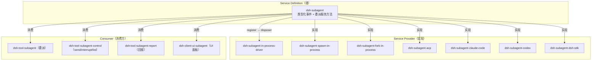

以 fs 为第二个实例做三件套映射（表格式）：

- **Service Definition**
  : `dsh-fs`——类型化事件与服务方法，声明"文件系统能做什么"。
- **Service Provider**
  : `dsh-fs-local`（本机）、`dsh-fs-sandbox`（沙箱约束）、`dsh-fs-e2b`（E2B 云沙箱适配器，e2b 组）。
- **Consumer**
  : `dsh-tool-fs`（读写）、`dsh-tool-fs-search`（搜索）、`dsh-tool-str-replace-editor`（字符串替换编辑）、`dsh-fs-observation-policy`（观察策略层，策略式消费）、`dsh-client-ui-workspace` 等 UI 面。

两例的共同模式：**缝只声明契约，实现可替换，消费方按面拆包**——这正是"能力缝"三件套从 6/11 两个抽象服务包一路演化到 49 组 219 包的组织学动力。

---

### 演进叙事

#### 6 月：内核与首批能力缝

开局即定调：*每个能力都按"缝"整体落位*。6/11 先立 llm/session 两个抽象服务（`d5a1d9bb75`），随后一周一个能力缝地推进：

- **6/12**：bash 执行接缝三件套（seam + local + tool，`8b5a3ef730`）——第一个"执行类"缝。
- **6/16**：ACP bridge（`fb9636db44`）——第一个外部协议面。
- **6/20**：模块化重组（`d02e9f1bd6`），扁平 `packages/` → `<group>/<pkg>`，`core` 组诞生。
- **6/21**：subagent 能力缝（registry + provider + model-facing tool，`1a81f2cccd`）；同日抽出 `dsh-brand`（`d6a2ab30c8`，util 组首个包）。
- **6/22**：fs 能力族（`5e01564afb`）。
- **6/25**：web 能力族（`d01f5f73b7`）。
- **6/29**：todo 工具（`46e31d8481`）——第一个独立工具包。

**月结**：6 月建立了两条此后从未动摇的原则——能力以缝为单位整体落位，包以 `<group>/<pkg>` 组织。署名贡献者合计 610 提交（contrib-monthly.txt，14 人口径）。

#### 7 月：长程能力与 GUI 两半

7 月是包体系的"井喷月"，上旬几乎每天一个新能力缝，中旬 GUI 两半登场，下旬组合层陆续补齐：

- **7/1**：hooks 落地（`65165b5d54`）——Claude Code / Codex 钩子桥 + 共享线协议库。
- **7/5**：workflow 落地（`1d43ea3cd5`）。
- **7/7**：MCP 客户端（`1fbe7c39d4`，7/15 合入）。
- **7/8**：code-runtime / guard / spill 同日落地（`6da6f04016` / `db26ef479d` / `463b72ce96`）。
- **7/9**：sandbox 进程约束缝（`7b8c3a9b40`）。
- **7/10**：session-query / skill 落地（`aa1dc0e2c7` / `6292d52236`）。
- **7/14**：context 落地（`a9d74932b1`）。
- **7/15**：sdk 与 examples 同日落地（`42b07a7022` / `6f77da4c8c`）。
- **7/16**：lsp 落地（`d0029d8d60`）。
- **7/19**：GUI 骨架提交（`a6a3807a07`）一次创建 `apps/web`、`apps/cli` 与 `packages/client`、`packages/host`；goal 同日诞生（`a525776015`）。
- **7/22–7/30**：plan（`f4185122dc`）、attachment（`cb4c11b869`）、storage / workspace（`e90b0d51df` / `013e6f8769`）、subprocess（`fc566119a7`）、typert / e2b / settings（`f773985e71` / `e7b682f1f6` / `ec0786e099`）、credentials / feedback（`3a794495ad` / `0ccd3ed463`）陆续落位。
- **7/30**：重组三连（`3fc35c91ff` / `7e445c3a67` / `2a40cbf8ef`），boot / interaction 同日落位。

**节奏与规模**：7/27–7/31 连续五天单日提交超过 500（实测：7/27 为 595、7/28 为 539、7/29 为 589、7/30 为 887、7/31 为 672），7/30 的 887 是全库单日峰值；全月合计 7,769 提交，占 6–8 月合计（11,722）的约 66%。浏览器半（client，2,241 提交，全库最大）与宿主半（host，899 提交）自此并行增长，配套四篇 GUI 设计笔记（分层与 RPC 协议、web 客户端架构、样式系统、测试系统）。

#### 8 月：组合层与发布面

8 月把"产品面"补齐，并在同一天完成命名契约与公开发布：

- **8/3**：preset（`18fe174897`）——每会话 agent 组合。
- **8/5**：schedule（`a229b42e24`）——会话本地定时跟进。
- **8/6**：bundle（`2365b2c54f`）——可安装的 `dsh --profile` 补丁层。
- **8/7**：api（`bb61dc13f2`）——远程 BFF 组装 + Typert RPC gateway。
- **8/12**：extensions（`4064198560`）——agent 运行时自修改，自指 Cordis 工具集。
- **8/13**：命名契约（`a2d0f7f411`，PR #2302，3,281 个文件）把全部词汇与目录对齐，与公开发布同日完成。

**发布当日序列**：8/13 当天 10 个发布/许可提交（`1e99f20963` → `abe560f81e`，含 MIT 采用 `c905c4694e` 与公开发布 `8c1e8d9890`、`a213befd0f`）把 dsh 家族以 `0.1.0-rc.5` 推到 npm（详见 [发布与自举](#12-发布与自举bundlebootapitypertextensionstest-supportutilruntime-diagnostics) 的任务清单）。8 月署名贡献者合计 3,343 提交，其中 8/10（396）与 8/11（473）仍是发布前的高强度冲刺日。

**整体节奏小结**：6 月 610 提交（奠基）→ 7 月 7,769 提交（井喷，约 66%）→ 8 月 3,343 提交（收敛与发布）；8/13 后仓库进入稳定期，包图以 49 组 / 219 包定格。

---

### 附：跨组命名例外与统计校验

**实测的跨组命名例外**（目录 ≠ npm 前缀推断）：

- `packages/shell/bash-local` → `@deepseek-ai/dsh-bash-local`（保留旧名）
- `packages/shell/bash-sandbox` → `@deepseek-ai/dsh-bash-sandbox`（保留旧名）
- `packages/extensions/ui-cordis` → `@deepseek-ai/dsh-client-ui-cordis`（带 client- 前缀）
- `packages/test-support/client-runtime` → `@deepseek-ai/dsh-client-test-runtime`（带 client- 前缀）
- `packages/llm/token-meter` → `@deepseek-ai/dsh-token-meter`（无 llm- 前缀）
- `packages/preset/persona` → `@deepseek-ai/dsh-persona`（无 preset- 前缀）
- `packages/bundle/base|headless|web-app` → `dsh-base` / `dsh-headless` / `dsh-web-app`（无 bundle- 前缀）
- `packages/util/timeout` → `@deepseek-ai/dsh-timeout`（通用超时原语，guard 组另有 `dsh-tool-call-timeout-policy`）

**统计校验**：49 组子包数合计 = 219（与 workspace-packages.txt 的 219 行一致）；组级首个提交条目 49 个（与 packages-first-commit.txt 的 49 行一致）；提交数前三组为 client（2,241）、core（1,564）、subagent（641），与全库提交分布相符（全部数字均来自上述两个数据文件，未另行估算）。


## 架构决策与治理

### 总览

项目的决策治理经历了一条清晰的演进弧线：从 2026-06-10 初始化（`b67e81ac97`）开始的"个人 ADR/RFC"阶段，到 7 月 19 日定型的"Agent Note + 自动化 gate"体系。驱动这条弧线的根本原因写在最早的质量门决策里：**这个代码库主要由 coding agent 开发，agent 遵守机器强制 gate 远比遵守散文约定可靠**（[quality-gates](.agents/notes/implemented/process/2026-06-11-quality-gates.md)，2026-06-11）。

因此治理机制一直在向"可机器检查"的方向收敛：决策记录从两棵命名混乱、格式各异的 `docs/adr/` 与 `docs/rfc/` 树，合并为按生命周期与类别路径编码的 RFC 树（2026-06-18），再更名为 `.agents/notes/`（Agent Note，2026-07-19），并配上一整套 `verify-*` 静态 gate（归入 `doc-sync`）、运行时 invariant 断言与每文件 100% 覆盖率 gate。

到了 8 月中旬，Agent Note 成为仓库的"标准决策层"：任何非平凡变更必须在同一 PR 内新增或更新 Agent Note（`b1b57a0ac5`，2026-07-19），已实施的 note 形成冻结归档（`archived/`，2026-07-26），其格式、分类、链接、双语配对全部由 gate 强制。

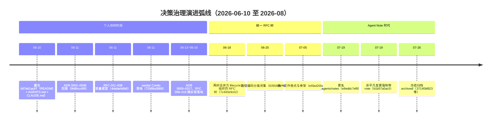

**治理弧线的六个阶段**（日期 = 对应提交的合入日）：

| 阶段 | 日期 | 关键提交 | 状态载体 | 治理动作 |
|---|---|---|---|---|
| ADR/RFC 起步 | 06-11 | `9b8fccc6f9` / `4dafad4db6` | `docs/adr/` + `docs/rfc/` | 回填 8 个 ADR、8 个 RFC；质量门规则写入 AGENTS.md |
| 双轨增长 | 06-13 ~ 06-17 | `36a30180b8` 等 | 两树并存 | 先 RFC 提方案、后 ADR 记决策；ADR 0009–0017 随实现落地 |
| 合并统一 | 06-18 | `7c400e9c02` | `docs/rfc/` 单树 | 两树合并为 lifecycle 树，文件名改 `yyyy-mm-dd-topic` |
| 分类闭集 | 06-20 | `605587e79c` | `{lifecycle}/{class}/` | 六个 class 闭集路径编码，新增两个 verify gate |
| 更名 + 强制 | 07-19 | `e8eddc7ef8` / `b1b57a0ac5` | `.agents/notes/` | RFC 更名 Agent Note；非平凡变更必须带 note |
| 冻结归档 | 07-26/27 | `37140bf823` / `6241eb6044` / `8b684fa5d0` | `archived/{class}/` | 低未来价值 note 永久冻结，SHA-256 manifest 封印 |

> [!NOTE]
> 本节所有日期、提交 hash 与 note 路径均来自 git 历史与 `.agents/notes/` 目录实测；无法确认的行一律标注"（待考）"，不臆造。

**术语速查**（定义列表，供后文引用）：

Agent Note
: 仓库唯一的决策记录载体：记录"为什么"与"放弃了什么"，路径 `{lifecycle}/{class}/yyyy-mm-dd-topic-title.md`，7/19 之前叫 RFC。

lifecycle（生命周期）
: note 的顶层状态目录：`proposed/`（实施前评审）、`implemented/`（已落地）、`rejected/`（否决）、`archived/`（冻结归档）。

class（类别）
: note 的二级路径，六个闭集：`feature` / `bug-fix` / `simplification` / `architecture` / `process` / `testing`，由 `scripts/agent-note-tree.ts` 持有。

gate（门禁）
: 可机械检查、非零退出即失败的验证命令；本地廉价检查走 git hooks，穷尽集走 CI 与 `run-gates.ts` 调度器。

seam（能力缝）
: 可替换能力的完整三件套：Service Definition / Service Provider / Consumer，见 [capability-seams](.agents/notes/implemented/architecture/2026-06-13-capability-seams.md)。

> [!TIP]
> 阅读本节时可配合 `.analysis/sections/timeline.md`（阶段划分）与 `.analysis/sections/packages.md`（包结构）对照；本节只讲"决策如何被记录、强制与演化"。

---

### 小节一：早期 ADR/RFC 阶段（6 月中旬）

2026-06-10 仓库初始化（`b67e81ac97` "Initialize repo with README, AGENTS.md, and CLAUDE.md symlink"），次日（06-11）架构与治理文档一天之内成型，形成两棵平行的决策树：

- **`docs/adr/`**：`9b8fccc6f9`（2026-06-11）"Backfill architecture decision records" 回填 **ADR 0001–0008**——0001 vendor-cordis-as-source、0002 microkernel-event-taxonomy、0003 event-sourced-sessions、0004 own-content-block-vocabulary、0005 custom-schema-dsl-over-schemastery、0006 tool-schemas-in-prompt-assembly、0007 quality-gates、0008 tsdown-over-dumble。同一天 `72688a3888` 已把 Cordis 框架包以源码形式 vendor 进仓库。
- **`docs/rfc/`**：`4dafad4db6`（2026-06-11）"Add RFCs for the remaining quality-proposal ideas" 增加 **RFC 001–008**——001 property-based-testing、002 mutation-testing、003 deterministic-and-stress-testing、004 architectural-conformance、005 runtime-validation-and-error-taxonomy、006 doc-sync-and-api-reports、007 supply-chain-and-vendor-drift、008 immutable-public-surfaces，并首次把质量门规则写进 AGENTS.md。

两棵树随后按需增长：RFC 009–011（2026-06-14，`a44f7f3486`，session 持久化与 ACP）、RFC 012（2026-06-15，`1cc6e1caf7`，Code Mode）；ADR 0009–0017 则随实现落地（06-13 至 06-15），形成"先 RFC 提方案、后 ADR 记决策"的双轨节奏——典型如 `36a30180b8`（arg validation，RFC 005 pt 1）、`11a29fdefe`（dev invariants，RFC 005 pt 3 + RFC 008）、`2f6d3b8539`（property tests，RFC 001）、`6a528be569`（doc-sync，RFC 006）、`825b57aff9`（error taxonomy，RFC 005 pt 2）、`df4b7d3d9a`（session persistence）、`b0bc0b5792`（turn-enclosure invariant）、`49e74ed8d0`（pnpm 迁移）。

#### 双轨节奏：先 RFC 提方案，后 ADR 记决策

RFC 与 ADR 的分工在 6 月中旬是清晰的：RFC 回答"要不要做、怎么做"，ADR 回答"决策已定、记录在案"。质量提案通常先以 RFC 编号进入评审，评审通过后随实现提交落地，落地提交再以 ADR 编号回填决策记录。

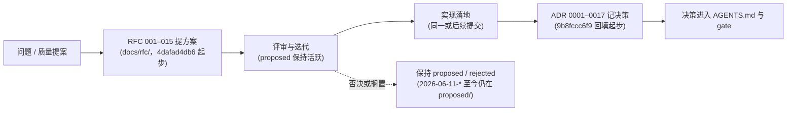

这套节奏的两条事实证据：其一，RFC 005（runtime-validation-and-error-taxonomy）被拆成三个实现提交（`36a30180b8` pt 1、`825b57aff9` pt 2、`11a29fdefe` pt 3 + RFC 008），每个提交各配一个 ADR（0011 / 0015 / 0012）——一条 RFC 可以对应多个 ADR 落地；其二，ADR 0009 与 0010 在同一个提交 `39b3db4b9c`（2026-06-13 "docs: accuracy sweep, architecture restructure, two ADRs, review skill"）里成对出现——决策批量回填是常态。

**三个决策载体的分工**（RFC / ADR / 后来的 Agent Note 逐维对比，帮助理解"为什么最终只剩一种"）：

| 维度 | RFC（`docs/rfc/`） | ADR（`docs/adr/`） | Agent Note（`.agents/notes/`，7/19 起） |
|---|---|---|---|
| 回答的问题 | 要不要做、怎么做（提案） | 决策已定、记录在案 | 同一问题 + "放弃了什么" |
| 生命周期 | 无路径编码（迁移前） | 无 | `proposed/` / `implemented/` / `rejected/` / `archived/` 四目录 |
| 类别 | 无 | 无 | 六个 class 闭集，路径编码 |
| 命名 | `NNN-topic`（数字序） | `NNNN-topic`（数字序） | `yyyy-mm-dd-topic`（日期序） |
| 文件格式 | 提案模板 | ADR 模板 | 统一骨架 + 强制 Alternatives considered |
| 机器强制 | 无 gate | 无 gate | `verify-agent-note-*` 等全套 gate |
| 最终去向 | 6/18 并入单树 | 6/18 并入单树 | 低价值 implemented → `archived/` 永久冻结 |

三列的演化逻辑：RFC 与 ADR 的边界（"提案" vs "记录"）在单一 tree 里无法从路径区分，统一后由 lifecycle 目录承担；命名从数字序改日期序，是因为"合并树 + 移动目录"会制造编号空洞，而日期序天然稳定、且文件名即首次提出日，可被 gate 交叉核对。

未被采纳的提案则停留在 `proposed/`。到今天（8 月中旬），RFC 002（mutation-testing）、003（deterministic-and-stress-testing）、004（architectural-conformance）、007（supply-chain-and-vendor-drift）与 RFC 006 的 api-reports 部分（`2026-06-11-api-extractor-reports`）、RFC 013（typed-event-schemas）仍然以 proposed note 的形式存在于 `.agents/notes/proposed/`——它们没有被删除，也没有被强制落地，而是作为"待验证的改进方向"持续占位。

#### ADR 0001–0017 全量表

下表把两棵决策树中 ADR 一侧的全部 17 个文件编号逐条列出（git 历史实测）。注意一个历史事实：**ADR 编号 0016 出现了两次**——`0016-session-persistence` 与 `0016-pnpm-over-yarn` 都叫 0016，这正是后来"编号与命名各自为政"被合并掉的原因之一。

| 编号 | 主题 | 日期 | 落地提交 | 现状 note 路径 |
|---|---|---|---|---|
| 0001 | vendor-cordis-as-source | 2026-06-11 | `9b8fccc6f9` 回填；`72688a3888` 落地 | [implemented/process/2026-06-11-vendor-cordis-as-source](.agents/notes/implemented/process/2026-06-11-vendor-cordis-as-source.md) |
| 0002 | microkernel-event-taxonomy | 2026-06-11 | `9b8fccc6f9` | [implemented/architecture/2026-06-11-microkernel-event-taxonomy](.agents/notes/implemented/architecture/2026-06-11-microkernel-event-taxonomy.md) |
| 0003 | event-sourced-sessions | 2026-06-11 | `9b8fccc6f9` | [implemented/architecture/2026-06-11-event-sourced-sessions](.agents/notes/implemented/architecture/2026-06-11-event-sourced-sessions.md) |
| 0004 | own-content-block-vocabulary | 2026-06-11 | `9b8fccc6f9` | [implemented/architecture/2026-06-11-content-block-vocabulary](.agents/notes/implemented/architecture/2026-06-11-content-block-vocabulary.md) |
| 0005 | custom-schema-dsl-over-schemastery | 2026-06-11 | `9b8fccc6f9` | [archived/architecture/2026-06-11-custom-schema-dsl](.agents/notes/archived/architecture/2026-06-11-custom-schema-dsl.md) |
| 0006 | tool-schemas-in-prompt-assembly | 2026-06-11 | `9b8fccc6f9` | [archived/architecture/2026-06-11-tool-schemas-in-prompt-assembly](.agents/notes/archived/architecture/2026-06-11-tool-schemas-in-prompt-assembly.md) |
| 0007 | quality-gates | 2026-06-11 | `9b8fccc6f9` | [implemented/process/2026-06-11-quality-gates](.agents/notes/implemented/process/2026-06-11-quality-gates.md) |
| 0008 | tsdown-over-dumble | 2026-06-11 | `630bbddf9a` | [archived/process/2026-06-11-tsdown-over-dumble](.agents/notes/archived/process/2026-06-11-tsdown-over-dumble.md) |
| 0009 | capability-seams | 2026-06-13 | `39b3db4b9c` | [implemented/architecture/2026-06-13-capability-seams](.agents/notes/implemented/architecture/2026-06-13-capability-seams.md) |
| 0010 | twin-llm-adapters | 2026-06-13 | `39b3db4b9c` | [implemented/architecture/2026-06-13-twin-llm-adapters](.agents/notes/implemented/architecture/2026-06-13-twin-llm-adapters.md) |
| 0011 | runtime-arg-validation | 2026-06-13 | `36a30180b8`（RFC 005 pt 1） | [implemented/architecture/2026-06-11-runtime-arg-validation](.agents/notes/implemented/architecture/2026-06-11-runtime-arg-validation.md) |
| 0012 | dev-invariants-over-deep-readonly | 2026-06-13 | `11a29fdefe`（RFC 005 pt 3 + RFC 008） | [implemented/architecture/2026-06-11-dev-invariants-over-deep-readonly](.agents/notes/implemented/architecture/2026-06-11-dev-invariants-over-deep-readonly.md) |
| 0013 | property-based-testing | 2026-06-14 | `2f6d3b8539`（RFC 001） | [implemented/testing/2026-06-11-property-based-testing](.agents/notes/implemented/testing/2026-06-11-property-based-testing.md) |
| 0014 | doc-sync-enforcement | 2026-06-14 | `6a528be569`（RFC 006） | [archived/process/2026-06-11-doc-sync-enforcement](.agents/notes/archived/process/2026-06-11-doc-sync-enforcement.md) |
| 0015 | structured-error-taxonomy | 2026-06-14 | `825b57aff9`（RFC 005 pt 2） | [implemented/architecture/2026-06-11-structured-error-taxonomy](.agents/notes/implemented/architecture/2026-06-11-structured-error-taxonomy.md) |
| 0016 | session-persistence | 2026-06-15 | `df4b7d3d9a` | [implemented/architecture/2026-06-14-session-persistence](.agents/notes/implemented/architecture/2026-06-14-session-persistence.md) |
| 0016 | pnpm-over-yarn | 2026-06-16 | `49e74ed8d0` | [implemented/process/2026-06-16-pnpm-over-yarn](.agents/notes/implemented/process/2026-06-16-pnpm-over-yarn.md) |
| 0017 | turn-enclosure-invariant | 2026-06-15 | `b0bc0b5792` | [archived/architecture/2026-06-15-turn-enclosure-invariant](.agents/notes/archived/architecture/2026-06-15-turn-enclosure-invariant.md) |

> [!NOTE]
> 上表"日期"列取 note 文件名日期（即首次提出日）与 git 回填提交日期两种口径中最先者；ADR 0001–0008 的回填提交 `9b8fccc6f9` 与 vendor 落地提交 `72688a3888` 为同日（06-11）。ADR 0005/0006/0008/0014/0017 的 note 现已在 `archived/`（详见小节二归档规则）——"已归档"不代表决策失效，只代表其理由不再需要指导未来工作。

#### RFC 001–015 全量表

RFC 一侧共 15 个编号（任务要求覆盖 001–012，git 历史实测到 015）。状态列以今天的 `.agents/notes/` 目录为准：`implemented/` 内存在对应 note 即"已落地"，`proposed/` 内仍存在即"未落地"。

| 编号 | 主题 | 状态 | 关联提交 | 现状 note 路径 |
|---|---|---|---|---|
| 001 | property-based-testing | 已落地 | `2f6d3b8539`（ADR 0013） | [implemented/testing/2026-06-11-property-based-testing](.agents/notes/implemented/testing/2026-06-11-property-based-testing.md) |
| 002 | mutation-testing | 未落地（proposed 至今） | `4dafad4db6` | [proposed/testing/2026-06-11-mutation-testing](.agents/notes/proposed/testing/2026-06-11-mutation-testing.md) |
| 003 | deterministic-and-stress-testing | 未落地（proposed 至今） | `4dafad4db6` | [proposed/testing/2026-06-11-deterministic-and-stress-testing](.agents/notes/proposed/testing/2026-06-11-deterministic-and-stress-testing.md) |
| 004 | architectural-conformance | 未落地（proposed 至今） | `4dafad4db6` | [proposed/process/2026-06-11-architectural-conformance](.agents/notes/proposed/process/2026-06-11-architectural-conformance.md) |
| 005 | runtime-validation-and-error-taxonomy | 已落地（分三部分） | `36a30180b8` / `825b57aff9` / `11a29fdefe` | 见 ADR 0011 / 0015 / 0012 行 |
| 006 | doc-sync-and-api-reports | doc-sync 部分已落地；api-reports 部分未落地 | `6a528be569`（doc-sync）；proposed 保持 | [archived/process/2026-06-11-doc-sync-enforcement](.agents/notes/archived/process/2026-06-11-doc-sync-enforcement.md) + [proposed/process/2026-06-11-api-extractor-reports](.agents/notes/proposed/process/2026-06-11-api-extractor-reports.md) |
| 007 | supply-chain-and-vendor-drift | 未落地（proposed 至今；vendor 基线由 ADR 0001 承担） | `4dafad4db6` | [proposed/process/2026-06-11-supply-chain-and-vendor-drift](.agents/notes/proposed/process/2026-06-11-supply-chain-and-vendor-drift.md) |
| 008 | immutable-public-surfaces | 已落地 | `11a29fdefe`（RFC 005 pt 3 + RFC 008） | 见 ADR 0012 行 |
| 009 | session-persistence-and-resumability | 已落地 | `df4b7d3d9a`（ADR 0016） | 见 ADR 0016-session-persistence 行 |
| 010 | acp-agent-client-protocol | 已落地 | `a44f7f3486`；`b29a8eca71` 移入 implemented | [archived/feature/2026-06-14-acp-agent-client-protocol](.agents/notes/archived/feature/2026-06-14-acp-agent-client-protocol.md) |
| 011 | acp-multi-session | 已落地 | `a44f7f3486`；`b29a8eca71` 移入 implemented | [implemented/feature/2026-06-14-acp-multi-session](.agents/notes/implemented/feature/2026-06-14-acp-multi-session.md) |
| 012 | optional-code-mode | 已落地 | `1cc6e1caf7`；`80585a7cd9`（07-08 重写） | [implemented/feature/2026-06-15-code-mode](.agents/notes/implemented/feature/2026-06-15-code-mode.md) |
| 013 | typed-event-schemas | 未落地（proposed 至今） | `efee449cfe` | [proposed/architecture/2026-06-16-typed-event-schemas](.agents/notes/proposed/architecture/2026-06-16-typed-event-schemas.md) |
| 014 | agent-lifecycle-and-ownership-seams | 已落地 | `7a5886da2d` | [implemented/architecture/2026-06-18-agent-lifecycle-and-ownership-contracts](.agents/notes/implemented/architecture/2026-06-18-agent-lifecycle-and-ownership-contracts.md) |
| 015 | shared-persistence-write-coordinator | 已落地 | `7a5886da2d` | [implemented/architecture/2026-06-18-shared-persistence-write-coordinator](.agents/notes/implemented/architecture/2026-06-18-shared-persistence-write-coordinator.md) |

**RFC 状态的一个规律**：8 个初始 RFC 里恰好一半落地（001 / 005 / 006 部分 / 008），一半至今停留在 proposed（002 / 003 / 004 / 007）；006 则一分为二——doc-sync 部分落地（`6a528be569`，ADR 0014），api-reports 部分（api-extractor-reports）保持 proposed。落地与否与"该提案是否被拆成可机械执行的 gate"高度相关：能变成 gate 的（property tests、arg validation、doc-sync、invariants）都落地了，不能的（mutation testing、stress testing、architectural conformance）都停留在提案。

#### 这一时期最重要的 RFC/ADR 及其结论（6 条）

1. **ADR 0002 微内核事件分类**（→ [2026-06-11-microkernel-event-taxonomy](.agents/notes/implemented/architecture/2026-06-11-microkernel-event-taxonomy.md)）：结论——采用纯 Cordis 事件分类作为扩展点，四种分发模式（waterfall / serial / parallel / emit）各司其职；`dsh-agent-loop` 是唯一具体 loop 插件且本身可替换，核心外的一切（hooks、goal、compaction、sandbox、UI、MCP、skills）都是插件。"万物皆插件"由此从口号变成类型化机制。

2. **ADR 0003 事件溯源 session**（→ [2026-06-11-event-sourced-sessions](.agents/notes/implemented/architecture/2026-06-11-event-sourced-sessions.md)）：结论——Session 是追加式 `SessionEvent` 日志、即唯一事实源，LLM 消息历史由 `deriveMessages()` 派生；**日志即状态**，状态与日志发散在结构上不可能，回放/分叉/遥测由此免费获得。

3. **ADR 0001 vendored Cordis 源码**（→ [2026-06-11-vendor-cordis-as-source](.agents/notes/implemented/process/2026-06-11-vendor-cordis-as-source.md)）：结论——框架层以源码形式 vendored（`vendor/`，`72688a3888`），`vendor/README.md` 作为 manifest 记录上游 SHA 与本地修改日志；依赖框架内部语义（fiber 生命周期、effect 卸载、waterfall 分发）的 agent loop 不被上游 RC 版本波动破坏。

4. **RFC 005 模型边界参数校验 + 统一错误分类**（→ [2026-06-11-runtime-arg-validation](.agents/notes/implemented/architecture/2026-06-11-runtime-arg-validation.md) 与 [2026-06-11-structured-error-taxonomy](.agents/notes/implemented/architecture/2026-06-11-structured-error-taxonomy.md)，`36a30180b8` / `825b57aff9` 落地）：结论——模型生成的 JSON 参数在工具边界经 `validateArgs` 校验，违规抛 `ToolArgsError`（`INVALID_ARGS`），模型收到可纠正的反馈而非崩溃；全系统统一 `HarnessError` 基类（稳定 `code` + `cause` 链），错误端到端可机器路由。

5. **RFC 006 / ADR 0014 doc-sync**（→ [2026-06-11-doc-sync-enforcement](.agents/notes/archived/process/2026-06-11-doc-sync-enforcement.md)，`6a528be569` 落地）：结论——"文档不同步比没有文档更糟"；文档代码块必须编译（`doc-typecheck`），事件分类表与源码 `interface Events` 集合一致（`verify-event-taxonomy`），统一走 `doc-sync` 脚本，本地 pre-push 也执行（`fa7d1df6f2`，同日）。

6. **RFC 008 不可变公开面 / dev invariants**（→ [2026-06-11-dev-invariants-over-deep-readonly](.agents/notes/implemented/architecture/2026-06-11-dev-invariants-over-deep-readonly.md)，`11a29fdefe` 落地）：结论——session 存储边界**总是**深快照 + 冻结（任何部署都成立），关系型断言（序号单调、turn/step 嵌套、工具调用配对等）以可选用 dev 插件提供；明确拒绝"全量 `DeepReadonly<T>` 类型"方案（类型在运行时消失，不是边界）。

#### 6/18 合并：两树并一树的迁移映射

`7c400e9c02`（2026-06-18）把 `docs/adr/` 与 `docs/rfc/` 并为单一 lifecycle 树：18 个已实施文件进 `docs/rfc/implemented/`（文件名改 `yyyy-mm-dd-topic`，尚无 class 子目录），`2026-06-11-api-extractor-reports` 进 `proposed/`。下表"现状路径"为 6/20 分类、7/19 更名后的最终位置（2026-08 目录实测）：

| 6/18 迁移文件名 | 来源 | 现状路径（.agents/notes/，2026-08-13） |
|---|---|---|
| `2026-06-11-content-block-vocabulary` | ADR 0004 | [implemented/architecture](.agents/notes/implemented/architecture/2026-06-11-content-block-vocabulary.md) |
| `2026-06-11-custom-schema-dsl` | ADR 0005 | [archived/architecture](.agents/notes/archived/architecture/2026-06-11-custom-schema-dsl.md) |
| `2026-06-11-dev-invariants-over-deep-readonly` | ADR 0012 | [implemented/architecture](.agents/notes/implemented/architecture/2026-06-11-dev-invariants-over-deep-readonly.md) |
| `2026-06-11-doc-sync-enforcement` | ADR 0014 | [archived/process](.agents/notes/archived/process/2026-06-11-doc-sync-enforcement.md) |
| `2026-06-11-event-sourced-sessions` | ADR 0003 | [implemented/architecture](.agents/notes/implemented/architecture/2026-06-11-event-sourced-sessions.md) |
| `2026-06-11-microkernel-event-taxonomy` | ADR 0002 | [implemented/architecture](.agents/notes/implemented/architecture/2026-06-11-microkernel-event-taxonomy.md) |
| `2026-06-11-property-based-testing` | RFC 001 → ADR 0013 | [implemented/testing](.agents/notes/implemented/testing/2026-06-11-property-based-testing.md) |
| `2026-06-11-quality-gates` | ADR 0007 | [implemented/process](.agents/notes/implemented/process/2026-06-11-quality-gates.md) |
| `2026-06-11-runtime-arg-validation` | ADR 0011 | [implemented/architecture](.agents/notes/implemented/architecture/2026-06-11-runtime-arg-validation.md) |
| `2026-06-11-structured-error-taxonomy` | ADR 0015 | [implemented/architecture](.agents/notes/implemented/architecture/2026-06-11-structured-error-taxonomy.md) |
| `2026-06-11-tool-schemas-in-prompt-assembly` | ADR 0006 | [archived/architecture](.agents/notes/archived/architecture/2026-06-11-tool-schemas-in-prompt-assembly.md) |
| `2026-06-11-tsdown-over-dumble` | ADR 0008 | [archived/process](.agents/notes/archived/process/2026-06-11-tsdown-over-dumble.md) |
| `2026-06-11-vendor-cordis-as-source` | ADR 0001 | [implemented/process](.agents/notes/implemented/process/2026-06-11-vendor-cordis-as-source.md) |
| `2026-06-13-capability-seams` | ADR 0009 | [implemented/architecture](.agents/notes/implemented/architecture/2026-06-13-capability-seams.md) |
| `2026-06-13-twin-llm-adapters` | ADR 0010 | [implemented/architecture](.agents/notes/implemented/architecture/2026-06-13-twin-llm-adapters.md) |
| `2026-06-14-session-persistence` | ADR 0016-session-persistence | [implemented/architecture](.agents/notes/implemented/architecture/2026-06-14-session-persistence.md) |
| `2026-06-15-turn-enclosure-invariant` | ADR 0017 | [archived/architecture](.agents/notes/archived/architecture/2026-06-15-turn-enclosure-invariant.md) |
| `2026-06-16-pnpm-over-yarn` | ADR 0016-pnpm-over-yarn | [implemented/process](.agents/notes/implemented/process/2026-06-16-pnpm-over-yarn.md) |
| `2026-06-18-markdown-cross-link-lint` | 新增（合并日创建） | [implemented/process](.agents/notes/implemented/process/2026-06-18-markdown-cross-link-lint.md) |
| `2026-06-11-api-extractor-reports` | RFC 006 的 api-reports 部分 | [proposed/process](.agents/notes/proposed/process/2026-06-11-api-extractor-reports.md) |

这张表同时回答了"合并之后发生了什么"：5 个早期文件（custom-schema-dsl、tool-schemas-in-prompt-assembly、doc-sync-enforcement、tsdown-over-dumble、turn-enclosure-invariant）在后来的归档行动中进入 `archived/`——它们记录的是已被取代或被更成熟机制吸收的决策；其余 13 个 implemented 文件至今保持 active。RFC 009–015 未出现在此表里：009 的决策由 ADR 0016-session-persistence 承载（已在上表）；010/011（ACP）的 note 于 07-11 由 `b29a8eca71` 补写进 implemented/feature；012（Code Mode）在 07-08 由 `80585a7cd9` 重写后移入 implemented/feature；013（typed-event-schemas）保持 proposed；014/015 于 06-20（`b58f1dd5c8` / `ab02e9acec`）落地并移入 implemented。

---

### 小节二：Agent Note 体系

**为何建立。** 两棵决策树（ADR/RFC）编号与命名各自为政、文件格式混杂（ADR 模板、提案模板、摘要式标题并存），且 6 月中旬团队仅 5–6 人、开发高度依赖 AI agent——按"机械 gate 优于散文"原则，决策记录必须可被 gate 检查，否则会腐烂。

**演进时间线（全部来自 git 历史）：**

| 日期 | 提交 | 事件 |
|---|---|---|
| 2026-06-18 | `7c400e9c02` | 合并 ADR/RFC 两树为一个 **lifecycle 组织的 RFC 树**（`docs/rfc/implemented/...`，文件名改为 `yyyy-mm-dd-topic`），同日创建 `docs/AGENTS.md` 文档规范与 markdown 交叉链接 gate（[2026-06-18-markdown-cross-link-lint](.agents/notes/implemented/process/2026-06-18-markdown-cross-link-lint.md)） |
| 2026-06-20 | `605587e79c` | 路径编码**分类**：`{lifecycle}/{class}/yyyy-mm-dd-topic.md`，六个闭集类别 feature / bug-fix / simplification / architecture / process / testing（`refactor` 刻意缺席，归入 simplification）；新增 `verify-agent-note-classification` 与 `verify-doc-refs` 两个 gate（[2026-06-20-agent-note-classification](.agents/notes/implemented/process/2026-06-20-agent-note-classification.md)） |
| 2026-07-05 | `e6fad266a6` | 统一**文件格式**：`# Agent Note: <title>` + 无日期的 `Status:` 行 + 按 lifecycle 的骨架（implemented 必须是现在时 `## Decision`/`## Consequences`，禁用提案式标题）+ 强制 `## Alternatives considered`；`verify-agent-note-format` gate 一次归一全部语料（[2026-07-05-uniform-agent-note-format](.agents/notes/implemented/process/2026-07-05-uniform-agent-note-format.md)） |
| 2026-07-19 | `e8eddc7ef8` | **"Rename RFCs to Agent Notes"**：`docs/rfc/` 整树迁入 `.agents/notes/`，RFC 正式更名 Agent Note，并补齐 `README.md`（布局、分类、归档、何时写）与各层 `AGENTS.md` |
| 2026-07-19 | `b1b57a0ac5` | 强制规则：**每个非平凡变更必须在同一 PR 内新增或更新 Agent Note**（行为、架构、跨包契约、流程/工具、测试策略、磁盘/线上/配置格式等）；纯机械编辑豁免；由 review 判定语义边界、不加自动化分类 gate（[2026-07-19-require-agent-notes-for-non-trivial-changes](.agents/notes/implemented/process/2026-07-19-require-agent-notes-for-non-trivial-changes.md)） |
| 2026-07-19 | `4779d04af8` | 删除生成的 Agent Note 索引（每分支都重写同一文件 → merge hotspot；改用目录树浏览 + 仓库搜索，`scripts/agent-note-tree.ts` 拥有闭集） |
| 2026-07-26/27 | `37140bf823` / `6241eb6044` / `8b684fa5d0` | 冻结**归档**：低未来价值的 implemented note 迁入 `archived/{class}/` 并永久冻结（`Status: implemented` + `Archived:` 行，`verify-archived-agent-notes` 以 SHA-256 追加式 manifest 封印，只允许 `--write` 追加）；写新 note 必须做 supersession 检查（[2026-07-26-frozen-agent-note-archive](.agents/notes/implemented/process/2026-07-26-frozen-agent-note-archive.md)） |

#### 现状统计（.agents/notes 目录实测，2026-08-13）

| lifecycle | architecture | bug-fix | feature | process | simplification | testing | 小计 |
|---|---|---|---|---|---|---|---|
| proposed/ | 20 | — | 8 | 14 | 4 | 4 | 50 |
| implemented/ | 258 | 154 | 340 | 138 | 96 | 24 | 1010 |
| rejected/ | — | — | 2 | — | 20 | — | 22 |
| archived/ | 28 | 38 | 108 | 40 | 54 | 16 | 284 |
| **合计** | **306** | **192** | **458** | **192** | **174** | **44** | **1366** |

> [!NOTE]
> 上表单位为"文件数"，已含 `.zh.md` 双语配对（每条 en note 都有等量 zh 边车，en = zh 全覆盖）。四个 lifecycle 顶层另有治理文件：`implemented/` 下 `AGENTS.md` + `CLAUDE.md`、`archived/` 下 `AGENTS.md`；把 3 个治理文件计入后，`proposed 50 / implemented 1012 / rejected 22 / archived 285`、全树共 1,369 个文件，与递归实测一致。

**实施侧按类别分布**（en note 数，来自上表的一半）：feature 170 条最多（能力扩张期产物），architecture 129 条次之，bug-fix 77 条、process 69 条、simplification 48 条、testing 12 条最少。rejected 的 22 条几乎全是 simplification（20 条）——"简化提案被否决"是该仓库最常见的否决形态；proposed 的 50 条里 architecture（10 条 en）与 process（7 条 en）占大头，说明架构与流程提案最常处于"待评审"状态。

#### 六个 class 的职责（现行 README 所载）

| Class | 覆盖范围 | 判别问题 |
|---|---|---|
| `feature` | 新的用户或模型可见能力 | 是否新增了能力面？ |
| `bug-fix` | 修正缺陷，或闭合 postmortem 暴露的缺口 | 是否在修错？ |
| `simplification` | 删代码、删行为、删表面积而不加能力 | 是否只减不增？（`refactor` 刻意缺席，归入此类） |
| `architecture` | 关于**已发布源码**的结构决策——包之间如何关联、运行时词汇是什么 | 是否涉及 shipped source 的结构？ |
| `process` | **围绕**代码的工具、策略、工作流——gate、包管理器、vendor——非运行时行为 | 是否涉及代码周围的流程？ |
| `testing` | 测试基础设施与策略 | 是否关于测试本身？ |

`architecture` 与 `process` 的分界线：**architecture 讲的是我们发布的源码，process 讲的是环绕它的工具与流程**。`refactor` 刻意缺席——它与 `simplification` 重叠，后者的判别词"可观察行为是否改变"已经覆盖它。

#### 三条 lifecycle 流转

note 在四个 lifecycle 目录之间移动，每次移动必须同步改 `Status:` 行并满足目标目录的骨架（gate 强制）：

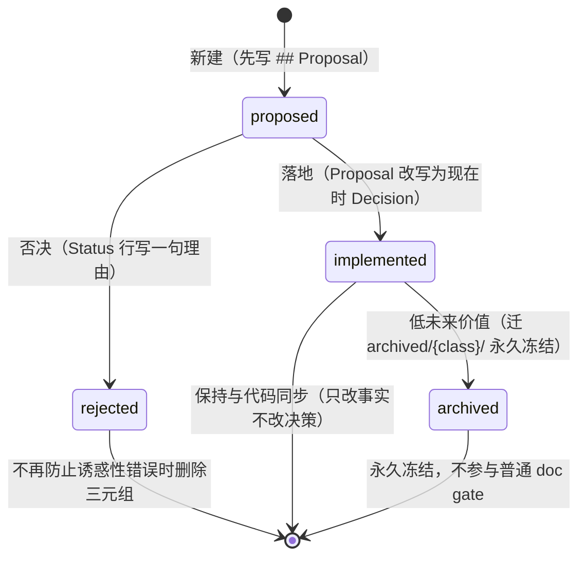

三条流转的要点：

- **proposed → implemented**：`## Proposal` 改写为现在时 `## Decision`，`## Acceptance criteria` 与 `## Risks` 折叠进 `## Consequences`（或现在时 `## Testing`/`## Verification`），删掉计划性语言——这是 `implemented/AGENTS.md` 要求的重写，被 gate 变成机械动作。
  - 重写义务：整份文件保持与 shipped 现状同步（路径、符号、默认值、机制随代码同变，过期事实就地重写、不追加变更历史）。
  - gate 角色：`verify-agent-note-format` 检查 implemented 骨架，`## Proposal`/`## Plan`/`## Migration plan`/`## Acceptance criteria` 标题出现即失败。
- **proposed → rejected**：只在 `Status:` 行加一句理由并冻结文件；否决的 note 只有在"其理由能防止一个诱人的错误"时才保留，否则删除英/中/边车三元组。
  - 判决即事实：`Status: rejected — <why>` 是读者来查的核心内容，理由必须一句话说清。
- **implemented → archived**：只归档 implemented；proposed 永不归档（过时提案 → rejected）；已归档文件永久冻结，不参与普通 doc gate（避免新规则逼着重写历史）。
  - 归档动作清单：移动完整三元组 → 保留 `Status: implemented` → 插入 `Archived:` 行 → 重录边车 → 修复/删除入站链接。

#### 文件格式骨架

现行格式由 `verify-agent-note-format`（`doc-sync` 一员）强制；前 3 行必须是 header block，`Status:` 值必须与所在 lifecycle 目录一致：

```markdown
# Agent Note: <title>

Status: implemented
```

implemented note 的正文骨架（proposed/rejected 各有变体）：

```markdown
## Problem

## Decision
…bespoke 技术章节（包拓扑、wire 契约、schema）…

## Alternatives considered

## Consequences
```

- `Status:` 只有三种形态：`Status: proposed` / `Status: implemented` / `Status: rejected — <why, in one line>`；**不带日期、不带括号**——文件名持有首次提出日期，git 持有其余历史，"以修订形式被接受"是正文内容。
- `## Alternatives considered` **强制**：每个真实备选方案与它输掉的原因，一个备选一个粗体引导段；"未记录备选的决策会被重新诉讼"——这正是 Agent Note 要防止的失败。2026-07-05 之前的旧格式文件可用注释占位：`<!-- agent-note-format: alternatives-not-recorded (pre-format Agent Note) -->`。
- implemented note 拒绝提案式标题：`## Proposal`、`## Plan`、`## Migration plan`、`## Acceptance criteria` 出现在 implemented 里会被 gate 拒绝；`## Testing`、`## Deferred`、`## Related` 只要陈述现在时事实就允许。
- 每条 en note 有 `.zh.md` 边车，结构逐节镜像（i18n 契约），header token（`# Agent Note: ` 与 `Status:` 行）保持英文原样；格式 gate 跳过 `.zh.md`，一致性由配对 gate 检查。

#### Status 与骨架速查

`Status:` 是 note 的机器可读状态，只有三种形态，且必须与所在 lifecycle 目录一致（gate 交叉核对）：

| Status 形态 | 所在目录 | 含义 | 额外内容 |
|---|---|---|---|
| `Status: proposed` | `proposed/` | 提案待评审，未（或部分）实施 | 正文可未来时；`## Proposal` / `## Acceptance criteria` / `## Risks` |
| `Status: implemented` | `implemented/` | 决策已落地，文件与代码现状同步 | 现在时 `## Decision` / `## Consequences`；拒绝提案式标题 |
| `Status: rejected — <why, in one line>` | `rejected/` | 提案被否决 | 唯一带内容的 status；正文保持提案原样冻结 |

| lifecycle | 强制章节 | 允许的时态 | 标题禁忌 |
|---|---|---|---|
| `proposed/` | `## Problem` → `## Proposal` → `## Alternatives considered` → `## Acceptance criteria` → `## Risks` | 未来时（计划、迁移步骤、开放问题） | 无 |
| `implemented/` | `## Problem` → `## Decision` → `## Alternatives considered` → `## Consequences` | 现在时（shipped reality） | `## Proposal` / `## Plan` / `## Migration plan` / `## Acceptance criteria` |
| `rejected/` | `## Problem` + `## Proposal` + Alternatives 强制 | 提案时态原样 | 无（冻结） |

状态行**不带日期、不带括号**：文件名持有首次提出日期，git 持有其余一切，"以修订形式被接受"是正文内容（在陈述决策处说明修订）。rejected 的否决理由是唯一带内容的 status——被否决 note 的判决正是读者来查的事实。

#### 归档规则细表

| 问题 | 规则 |
|---|---|
| 什么能归档 | 只有 `implemented/` note；shipped 决策已完结、其理由不太可能指导未来工作时 |
| 什么不能归档 | `proposed/`（过时提案 → 改为 rejected）；仍具指导价值的 implemented note（保留 active 的条件：备选方案、所有权边界、否定性保证、持久/wire 语义、安全规则、重引入条件仍有用） |
| 归档时做什么 | 移动英/中/边车**完整三元组**到 `archived/{class}/`；保留 `Status: implemented`；在两条语言文件的 status 行正下方插入同一 `Archived: YYYY-MM-DD`；重录边车；修复或删除入站链接——这是归档期间唯一允许的内容变更 |
| 归档后 | 永久冻结：不编辑、不翻译、不重排、不移动、不删除；不作为现行行为依据；doc gate 跳过 archived 源（含其出站链接）；`verify-archived-agent-notes` 以追加式 SHA-256 manifest 封印，只允许 `--write` 追加 |
| 写新 note 前 | 必须做 supersession 检查（搜 active 树里是否已有覆盖同一决策/机制的旧 note），完全被取代的 implemented 三元组在**同一 PR** 里归档，部分被取代的保持 active 并交叉链接 |
| rejected 的存废 | 仅在能防止诱惑性错误时保留，否则删除完整三元组（英/中/边车） |

#### supersession 检查与合并规则

写任何新 note 前必须做 supersession 检查（`.agents/notes/AGENTS.md` 强制）：搜 active 树中是否已有覆盖同一决策/机制的旧 note。结果分三档：

- **完全被取代**（新决策整体覆盖旧决策）：
  - 动作：旧 implemented 三元组在**同一 PR** 内按归档规程迁入 `archived/{class}/`，新 note 与旧归档 note 交叉链接。
  - 判定：新决策覆盖同一决策/机制的完整语义，旧理由不再独立指导未来工作。
- **部分被取代**：
  - 动作：两个 note 都保持 active，交叉链接，并把仍然成立的事实逐条更新到各自文件。
  - 判定：新决策只覆盖部分语义（例如只换了一个传输、默认或实现）。
- **feature 增加被后续删除取代**：
  - 前提：feature 已从生产代码、配置、schema、持久/wire 格式、迁移与兼容行为中完全消失，无文档宣示可用，无测试把它当作受支持行为。
  - 义务：删除方必须保留原始动机、为何不再合理、全量删除之外的备选、放弃的能力、重引入条件与"完全缺席"的验证证据。
  - 反例：移除一个传输/默认/实现/呈现属于部分取代；任何存活的持久数据或兼容处理都算部分取代。

**实施侧 note 的更新纪律**（implemented/AGENTS.md）：路径、符号、默认值、机制必须与代码在同一次变更里保持同步——过期事实就地重写，不追加变更历史；但这**不是**重写决策的许可——推翻决策需要新 note + 交叉链接；完全被取代的旧 note 只能按上面的合并规则删除，删除前必须把每条独特理由、备选、后果、所需验证与具名覆盖缺口转移到接管 note（git 历史不能是理由的唯一副本）。

#### 双语配对机制

zh 边车不是翻译件而是对等权威（equal-authority）：en 与 zh 结构逐节镜像（i18n 契约），机器检查的 header token（`# Agent Note: ` 与 `Status:` 行）在两种语言里保持英文原样；部分文件还带 `.i18n.yaml` 一致性记录边车（7/2 配对 gate 引入时的形态，如 `2026-07-02-bilingual-docs-and-pairing-gate`、`2026-07-17-sdk-follow-up-capabilities` 的边车）。`verify-translation-pairing` 检查配对逐节一致，`--write` 模式重录一致性记录（`pnpm run resolve-translation-pairing-conflicts` 解决冲突）；格式 gate 跳过 `.zh.md`（一致性由配对 gate 负责），归档移动必须携带完整三元组（en + zh + 边车）并重录边车。

> [!IMPORTANT]
> implemented note 必须**与代码现状保持同步**：代码移动文件、重命名包、改默认值时，note 在同一个变更里改事实（路径、名称、结构）——但**绝不改决策本身**。推翻决策需要写新 note 并交叉链接；完全被取代的旧 note 只能按合并规则删除，且必须先把每条独特理由、备选方案、后果、所需验证与具名覆盖缺口转移到接管 note。

> [!WARNING]
> `archived/` 下的 note 是**永久冻结**的历史快照：任何对它的编辑、翻译、重排、移动或删除都被 gate 拒绝，也不应把它当作现行行为依据。可以主动链接进 archived note 引用历史，但永远不要"顺手"清理它。

#### 何时写 note（判定清单）

> [!TIP]
> 判定口诀：**拿不准就写**。被 review 判定为"纯机械编辑"而豁免是可接受的，写多了被要求合并同类项也是可接受的；漏写则违反 `b1b57a0ac5` 的强制规则。

- [ ] 变更是否改变行为、架构、跨文件/跨包契约？
- [ ] 变更是否改变流程或工具（gate、包管理器、vendor、CI）？
- [ ] 变更是否改变测试策略？
- [ ] 变更是否改变磁盘、线上或配置格式？
- [ ] 变更是否涉及维护者可能合理重访的另一个决策？
- [ ] 若全否：是否为纯机械或局部编辑（可豁免）？

任一为"是"→ 同一 PR 内新增或更新 Agent Note；决策已定 → 直接进 `implemented/`；重大未来工作提案 → 先进 `proposed/`。更新"已拥有该决策的 note"即可满足规则，不要造重复 note；note 永远不会被编辑成"另一个决策"——用新 note 取代它，两个 note 交叉链接。

**代表性 note。** 实施侧：`implemented/architecture/2026-06-11-microkernel-event-taxonomy.md`（微内核）、`2026-06-13-capability-seams.md`（能力缝）、`2026-06-14-session-persistence.md`（持久化）、`2026-06-20-branded-ids.md`（branded ID）、`2026-07-05-reconstructable-requests.md`（模型可见即记录）、`2026-07-19-package-owned-invariant-service.md`（invariant 服务契约）；归档侧：`archived/architecture/2026-06-15-turn-enclosure-invariant.md`（turn 封闭，被 2026-07-24 的"上下文注入与 turn 执行分离"决策取代，2026-07-28 归档）、`archived/process/2026-06-11-doc-sync-enforcement.md`。

---

### 小节三：核心架构决策清单

以下每条均来自 git 历史中的真实文件与提交（决策日期 = note 文件名日期，即首次提出日）：

| 决策 | 日期 | 来源文件 | 一句话要点 |
|---|---|---|---|
| 微内核 / 插件化 + 事件分类 | 2026-06-11 | `docs/adr/0002`（`9b8fccc6f9`）→ [2026-06-11-microkernel-event-taxonomy](.agents/notes/implemented/architecture/2026-06-11-microkernel-event-taxonomy.md) | 纯 Cordis 事件分类（waterfall/serial/parallel/emit）即扩展点；`dsh-agent-loop` 是唯一具体 loop 插件且本身可替换 |
| Vendor Cordis 为源码 | 2026-06-11 | `docs/adr/0001`（`9b8fccc6f9`；`72688a3888` 落地）→ [2026-06-11-vendor-cordis-as-source](.agents/notes/implemented/process/2026-06-11-vendor-cordis-as-source.md) | 框架层源码 vendored + manifest 锁 SHA，上游 RC 不能破坏依赖框架内部语义的 loop |
| 事件溯源 session | 2026-06-11 | `docs/adr/0003` → [2026-06-11-event-sourced-sessions](.agents/notes/implemented/architecture/2026-06-11-event-sourced-sessions.md) | 追加式 `SessionEvent` 日志即唯一事实源，历史由 `deriveMessages()` 派生；日志即状态 |
| 自有内容块词汇 | 2026-06-11 | `docs/adr/0004` → [2026-06-11-content-block-vocabulary](.agents/notes/implemented/architecture/2026-06-11-content-block-vocabulary.md) | `dsh-llm` 拥有 provider 中立 content-block 词汇（`ContentBlockMap` 可合并扩展），映射成本留在各适配器 |
| 能力缝三件套 | 2026-06-13 | `docs/adr/0009`（`39b3db4b9c`）→ [2026-06-13-capability-seams](.agents/notes/implemented/architecture/2026-06-13-capability-seams.md) | 可替换能力 = Service Definition / Service Provider / Consumer 三角色，各自独立演化；"seam"专指三件套整体 |
| 双 LLM 适配器 | 2026-06-13 | `docs/adr/0010`（`39b3db4b9c`）→ [2026-06-13-twin-llm-adapters](.agents/notes/implemented/architecture/2026-06-13-twin-llm-adapters.md) | 第一天就上两个真实适配器（direct-fetch 与 pi-ai 库）验证"中性"流词汇，避免单一实现把自家怪癖写进契约 |
| 模型边界参数校验 | 2026-06-13 | `docs/adr/0011`（`36a30180b8`）→ [2026-06-11-runtime-arg-validation](.agents/notes/implemented/architecture/2026-06-11-runtime-arg-validation.md) | `validateArgs` 在工具边界校验模型生成的 JSON，违规抛 `ToolArgsError`，配合属性测试锁死校验器与 `InferArgs` 一致 |
| dev invariants 运行时断言 | 2026-06-13 | `docs/adr/0012`（`11a29fdefe`，RFC 005 pt 3 + RFC 008）→ [2026-06-11-dev-invariants-over-deep-readonly](.agents/notes/implemented/architecture/2026-06-11-dev-invariants-over-deep-readonly.md) | 存储边界深冻结总是开启；关系型断言（序号/turn 嵌套/工具配对/请求重建）由可选 dev 插件提供，拒绝 DeepReadonly 类型方案 |
| 统一错误分类 | 2026-06-14 | `docs/adr/0015`（`825b57aff9`，RFC 005 pt 2）→ [2026-06-11-structured-error-taxonomy](.agents/notes/implemented/architecture/2026-06-11-structured-error-taxonomy.md) | 全系统 `HarnessError` 基类（`code` + `cause` 链），错误可分支路由，结构化字段入 `tool/result` 日志 |
| Session 持久化为抽象服务 | 2026-06-15 | `docs/adr/0016-session-persistence`（`df4b7d3d9a`）→ [2026-06-14-session-persistence](.agents/notes/implemented/architecture/2026-06-14-session-persistence.md) | 持久化是能力缝（JSONL 首后端 + SQLite 第二后端证明可换），`runPersistenceContract` 契约测试锁死两后端语义 |
| Turn 封闭不变量 | 2026-06-15 | `docs/adr/0017`（`b0bc0b5792`）→ [archived 2026-06-15-turn-enclosure-invariant](.agents/notes/archived/architecture/2026-06-15-turn-enclosure-invariant.md) | 每个 session 事件都在 turn 内；turn 成为唯一持久化/崩溃恢复边界（被 2026-07-24 的"上下文注入与 turn 执行分离"语义取代，2026-07-28 归档） |
| Code Mode（RFC 012） | 2026-06-15 | `docs/rfc/012`（`1cc6e1caf7`）→ [2026-06-15-code-mode](.agents/notes/implemented/feature/2026-06-15-code-mode.md) | 模型写 TypeScript 程序对工具注册表编程（`run_code` 传输 + 生成 SDK），`worker_threads` 隔离执行 |
| pnpm 迁移 | 2026-06-16 | `docs/adr/0016-pnpm-over-yarn`（`49e74ed8d0`）→ [2026-06-16-pnpm-over-yarn](.agents/notes/implemented/process/2026-06-16-pnpm-over-yarn.md) | 包管理器从 Yarn 4 迁到 pnpm workspaces |
| Branded ID | 2026-06-20 | [2026-06-20-branded-ids](.agents/notes/implemented/architecture/2026-06-20-branded-ids.md) | `Branded<B>` 零成本名义类型（`SessionId`/`CallId`/`BashTaskId`/`OwnerToken`），跨包 id 防混淆但"不是每个 string 都要 brand" |
| 模型可见即记录 | 2026-07-05 | [2026-07-05-reconstructable-requests](.agents/notes/implemented/architecture/2026-07-05-reconstructable-requests.md) | 每个 LLM 请求可从 session log + 内容寻址对象逐字节重建；`request/header` 全量快照；prefix-cache 稳定性是推论而非管理 |
| Package-owned invariant 服务 | 2026-07-19 | [2026-07-19-package-owned-invariant-service](.agents/notes/implemented/architecture/2026-07-19-package-owned-invariant-service.md) | 每个 workspace 包发布 `./invariant` companion 注册其完整包名，`verify-package-invariants` 强制穷尽；诊断成本在配置里显式可见 |
| 编译器面分离 | 2026-07-22 | [2026-07-22-tsconfig-solution-root-two-aggregates](.agents/notes/implemented/process/2026-07-22-tsconfig-solution-root-two-aggregates.md) | 一个 solution root + host/client 两个 aggregate program，利用"declaration-merge 碰撞只存在于 ts.Program 内"避免合并冲突；仓库级程序一律显式播种 face 配置 |

（另：100% 覆盖率 gate 见 ADR 0007，2026-06-11，详见小节四。）

#### 深潜一：微内核事件分类（ADR 0002）

背景
: "万物皆插件"是产品原则：hooks、/goal、/loop、动态 workflow、compaction、沙箱、权限、UI、持久化、MCP、skills 都必须能作为插件写出，而不修改核心。挑战在于选一个扩展点机制，让这些插件可挂、可卸载、可热重载。

决策
: 纯 Cordis 事件分类。loop 的扩展点是带刻意分发模式的类型化事件：**waterfall**（环绕中间件语义，插件可变换/短路/恢复/包裹：`agent/pre-step`、`agent/request`、`agent/request-error`、`tools/pre-execute`、`tools/execute`、`tools/post-execute`、`llm/stream`、`system-prompt/assemble`）；**serial**（按监听器顺序 await，用于有序检查点如 `agent/turn-stopping`）；**parallel**（await 扇出，每个监听器都必须拿到独立机会，如 `session/flush` 持久化检查点）；**emit**（同步 fire-and-forget 通知，如 inbox 迁移、lifecycle、错误与不可变 `tools/result` 观察）。事件词汇住在契约包（`dsh-agent` 声明 `agent/*` 事件）；`@deepseek-ai/dsh-agent-loop` 是唯一具体 loop 插件且本身可替换，核心外不得依赖它。

后果
: 每个 MVP 功能都映射为一个监听器（feature → mechanism map 是证明义务）；HMR 与卸载免费（监听器与注册都是 Cordis effect）；waterfall 语义（调 `next()` 或短路）不直观、必须写进 AGENTS.md 并有组合测试覆盖；loop 必须防御性——插件异常在 turn 级别被包含，任何扩展点发起的 steering 都不许搁浅（有回归测试）。

备选被拒
: 自研 koa-compose 式中间件栈、显式阶段状态机——两者都会重造 Cordis 原生事件系统已提供的分发、卸载与重载语义。

后续演化
: 事件面按同一分类原则继续生长：06-18 agent lifecycle 与所有权契约（[2026-06-18-agent-lifecycle-and-ownership-contracts](.agents/notes/implemented/architecture/2026-06-18-agent-lifecycle-and-ownership-contracts.md)）、06-30 事件拦截缝（`dc95a7881d`，[2026-06-30-interception-seams](.agents/notes/implemented/feature/2026-06-30-interception-seams.md)）与事件域语义（`05b75abbca`，[2026-06-30-event-domain-semantics](.agents/notes/implemented/architecture/2026-06-30-event-domain-semantics.md)）、07-02 渲染意图并集（`1a57d67058`）——"waterfall/serial/parallel/emit 四模式各司其职"始终是新增事件的分类依据。

关联 note
: `implemented/architecture/2026-06-11-microkernel-event-taxonomy.md`（+ `.zh.md`）

落地提交
: `9b8fccc6f9`（ADR 0002 回填）

#### 深潜二：Vendor Cordis 为源码（ADR 0001）

背景
: 仓库建在 Cordis 框架上，而 Cordis core 当时在 4.0.0-rc.6（release candidate）。harness 依赖框架内部语义（fiber 生命周期、effect 卸载、waterfall 分发），其精确行为关系到 agent loop 的正确性保证——上游一个 RC 版本波动就可能无声破坏。

决策
: 把需要的 Cordis 包（core、loader、include、group、timer、hmr、logger-console）与 cordiverse 基础库（cosmokit、schemastery）以源码形式、扁平化拷入 `vendor/`，保留原始 npm 名使 workspace 解析透明；`pnpm-workspace.yaml` 设 `linkWorkspacePackages: true`，匹配的上游 semver 范围在源码与构建产物执行中都解析到这些钉死的 workspace。真正第三方依赖（js-yaml、chokidar、`@standard-schema/spec`…）留在 npm。`vendor/README.md` 是 manifest：上游仓库 + 每包 commit SHA + 穷尽式本地修改日志；pre-commit 守卫（`scripts/check-vendor-manifest.sh`）拒绝未同步 manifest 的 vendored 改动。

后果
: harness 完全拥有框架层——可审计、可补丁、可钉死，上游 RC 伤不到我们，框架 bug 可在树内修；构建产物与源码测试执行同一代 vendored Cordis，去掉 workspace 链接会静默换成同名的 npm 副本；上游同步是手动规程（manifest 里有文档化流程），修改日志让 diff 面可见；vendored 包保留上游代码风格，lint/strictness gate 排除它们；从第一天就有一个本地补丁：hmr 的 locale-YAML 导入被移除（运行时 YAML 导入 hook 未 vendor）。

备选被拒
: 依赖 npm 包（core 是 RC，内部语义无本地修复路径）；全量传递 vendor（真正第三方依赖留在 npm，只拥有内部语义相关的框架层）。

后续演化
: vendor 侧治理随仓库长大：`rescope-vendor`（`pnpm run rescope-vendor`，vendored 包 rescope 为 `@deepseek-ai/*` 且 `private: true`，08-01 前后落地）与 `verify-vendored-links`（校验 vendored 依赖与 workspace 链接一致）加入 `hygiene` 聚合；`check-vendor-manifest.sh` 继续守住"改 vendored 必须同步 manifest"的 pre-commit 边界。

关联 note
: `implemented/process/2026-06-11-vendor-cordis-as-source.md`（+ `.zh.md`）

落地提交
: `72688a3888`（vendor 落地）；`9b8fccc6f9`（ADR 0001 回填）

#### 深潜三：事件溯源 session（ADR 0003）

背景
: MVP 要求严格的基于事件 trace 与完全可回放的 session（严格的基于事件的 trace、logging 系统，session 完全可回放）。如果状态与日志分开维护，二者必然漂移。

决策
: `Session` 是追加式类型化 `SessionEvent` 日志——唯一事实源；LLM 消息历史从日志**派生**（`deriveMessages()`）；原始 stream chunk 被记录以获得 token 级回放保真，而组装的 `assistant/message` 事件对派生具有权威性。回放/分叉 = 用既有日志播种新 session。追加是同步的（热路径不阻塞 I/O）；`session/event` 是同步通知；持久化插件缓冲 write-behind，在每 turn 结束触发的 `session/flush` 检查点排空。排序契约：loop 在 `agent/pre-step` 前认领 inbox 消息，进入决策后才开 `step/start`，随后追加返回的 `user/message` 批次再派生请求；provider 输出在工具分派前组装并追加为 `assistant/message`——持久日志记录工具实际跟随的消息，回归测试钉死该排序。

后果
: 回放、trace、遥测结构性保证而非后补；持久化是插件关注点，内存 store 随 dsh-session 发布；事件词汇可合并扩展（插件加 compaction 事件等），日志变持久后由 session-persistence 冻结其形状；派生成本随日志长度增长——compaction（dsh-compaction）是既定缓解手段，而非改写日志。

备选被拒
: 可变消息数组 + 事件仅作通知——更简单，但状态与日志会发散；事件溯源下"日志即状态"，发散在结构上不可能。

后续演化
: 事件词汇随后按需合并扩展：06-18 `session surface`（[2026-06-18-session-surface](.agents/notes/implemented/architecture/2026-06-18-session-surface.md)，日志成为唯一表层派生路径）、06-30 `session fork`（`da94bfd37c`，[2026-06-30-session-fork-service](.agents/notes/implemented/feature/2026-06-30-session-fork-service.md)）、08-10 session-log 版本机制（[2026-08-10-session-log-version-mechanism](.agents/notes/implemented/architecture/2026-08-10-session-log-version-mechanism.md)，结构格式变更才 bump `SESSION_FORMAT_VERSION`，会话成员默认 required-on-read）。

关联 note
: `implemented/architecture/2026-06-11-event-sourced-sessions.md`（+ `.zh.md`）

落地提交
: `9b8fccc6f9`（ADR 0003 回填）

#### 深潜四：能力缝三件套（ADR 0009）

背景
: harness 有可替换能力——今天 bash 执行，明天沙箱/远程执行器与别的模型 provider。一个能力有三个变化速率不同的关注点：契约（能力是什么）、实现（怎么跑）、消费 API（模型与其他插件对着什么编程）。打包在一个包里会把三种变化速率耦合：换本地执行器为沙箱执行器会搅动模型看到的工具 schema，哪怕模型侧契约根本没变。这区别于 Cordis 已经用 service + `inject` 回答的"谁提供 vs. 谁需要"（provider 注册 `ctx.shell`，consumer 声明 `inject: ['bash']`）——那个机制不决定包边界，本 note 才决定。

决策
: 可替换能力有**三个角色**：**Service Definition**（Cordis `Service` 与词汇类型，拥有 `ctx.<key>`，只依赖契约所需词汇；可以是抽象类或具体注册表服务，**绝不是 TypeScript `interface`**）；**Service Provider**（提供/注册实现的插件，沙箱与远程 provider 是注册到同一 Definition 的兄弟包）；**Consumer**（模型与插件编程的对象，注入 service key，绝不 import provider 特有类型）。角色名用 Title Case；provider/consumer 的泛指保持小写。Provider 与 Consumer 随后独立演化：沙箱执行器替换 `dsh-bash-local` 不碰工具 schema。角色通常独立成包，但"seam"一词保留给三件套整体；真正共享一个关注点时可以不拆（LLM seam 把 Definition 与 Consumer 折叠进 `dsh-llm`，适配器是 Provider 包）。不要预防性拆分——只有一个 provider 和一个 consumer 的能力保持单包，直到第二个出现。

后果
: 拆角色增加包与样板（package.json、tsconfig、README、注入接线）；换来 Provider 与 Consumer 独立发布与版本化，新后端永不碰模型侧契约。AGENTS.md 与 docs/architecture.md 承载规则，bash 三件套（`dsh-shell` / `dsh-bash-local`+`dsh-bash-sandbox` / `dsh-tool-bash`）是参考模板。

备选被拒
: 总是合并角色（重新耦合独立变化的三个关注点）；混淆 `@cordisjs/plugin-capability`（那是权限/安全服务，与实现可替换是两条轴）。

后续演化
: 三件套模式随后套用到每个能力面：filesystem（06-17，[2026-06-17-filesystem-capability-seam](.agents/notes/implemented/architecture/2026-06-17-filesystem-capability-seam.md)）、compaction（06-18，[2026-06-18-compaction-capability-seam](.agents/notes/implemented/feature/2026-06-18-compaction-capability-seam.md)）、subagent（06-21，`1a81f2cccd`）、web（06-24，`a4091daa3d`）、code-runtime（07-08，Code Mode 深潜）、timeout（07-06，`8615e019d3`）……"能力 = 三件套"成为新增能力面的默认结构，`docs/glossary.md#capability-seam` 是规范入口。

关联 note
: `implemented/architecture/2026-06-13-capability-seams.md`（+ `.zh.md`）

落地提交
: `39b3db4b9c`（ADR 0009）

#### 深潜五：双 LLM 适配器（ADR 0010）

背景
: `dsh-llm` 拥有 provider 中立流式词汇——`StreamChunk` 协议（`block-start`、`text-delta`、`reasoning-delta`、`tool-call-delta`、`block-end`、`usage`、`finish`）与 content-block 类型。针对单一适配器定义的词汇会把该适配器的怪癖烤进"中立"契约：单一实现碰巧做的事变成事实规范，抽象要到第二个 provider 到来才被验证——到那时泄漏已难以修复。

决策
: 第一天就对一个契约发布**两个**适配器，刻意基于不同内部：`dsh-llm-deepseek`（直接 `fetch` + 仓内翻译，SSE 框架委托 `eventsource-parser`）与 `dsh-llm-pi-ai`（同一端点走 `@earendil-works/pi-ai` 库）。它们强制一条规则：**任何 `StreamChunk` 词汇对两个实现都表达不了的东西，就是核心词汇 bug**，立即被抓而不是等到下一个 provider。这对搭档钉死了现在写在 `StreamChunk` 上的约定：usage 在 finish 前发出、finish 后无事发生、tool-call `arguments` 端到端是原始 JSON 字符串、两个认可的失败路径（`stream()` 抛错或 `finish {kind:'error'|'aborted'}`）——其中库后端暴露的分歧是单一 direct-fetch 适配器会藏住的。

后果
: 双倍适配器与 key 门 e2e 维护（都覆盖 V4 Flash 与 Pro 的代表性推理模式），换来持续的 seam 中立性验证与第二个实现示例；两者都用 `apiKey`/`baseURL`/`models`，direct-fetch 暴露 `thinking`/`reasoningEffort`，pi-ai 暴露单一 `reasoning` 级别。

备选被拒
: 单一适配器（"provider 中立"声明无从验证，词汇静默编码 DeepSeek-via-fetch 假设）；mock 第二适配器（不锻炼真实 provider 的 wire 怪癖，证明力低）——双胞胎必须是 real-on-real。

后续演化
: 07-14 按 provider 路由适配器（`e547980d77`，[2026-07-14-provider-routed-llm-adapters](.agents/notes/implemented/architecture/2026-07-14-provider-routed-llm-adapters.md)），同一 `dsh-llm` 契约下按 provider 选实现；deepseek 适配器的 SSE 解析 07-26 换成 `eventsource-parser`（[archived 2026-07-26-eventsource-parser-for-deepseek-sse](.agents/notes/archived/simplification/2026-07-26-eventsource-parser-for-deepseek-sse.md)）——双胞胎的"own fetch/translate internals"身份不包括手搓传输管道。

关联 note
: `implemented/architecture/2026-06-13-twin-llm-adapters.md`（+ `.zh.md`）

落地提交
: `39b3db4b9c`（ADR 0010）

#### 深潜六：模型边界参数校验 + 统一错误分类（RFC 005，ADR 0011 + 0015）

背景
: `defineTool` 通过 `InferArgs<S>` 给工具作者类型化 `execute(args)`——但那是关于"运行时到达的模型生成 JSON"的编译期声明，模型没有义务遵守 schema：缺必需键、字符串当数字、字面量越界都会以"名义上类型正确"到达 `execute`，工具体要么在坏形状上崩溃，要么静默出错。错误侧同样糟糕：工具错误被压平成文本块（名字、code、栈全丢），未来沙箱/重试插件分不清 ENOENT 与 EACCES；非 Error 抛出被 `new Error(String(x))` 包掉丢 code；系统里唯一类型化错误是 `LlmError`，没有共享基类，消费者无处 `instanceof`。

决策
: `validateArgs(spec, args): string[]` 编译 `ParameterSchemaSpec` 并委托共享的 `validateJsonSchemaValue()` 遍历器，返回可读违规；`defineTool` 在定义时快照编译好的参数 schema，在类型化 body 前运行校验；违规抛 `ToolArgsError`（`INVALID_ARGS`），注册表把它作为错误结果返回、模型可纠正。错误侧：`dsh-llm` 里一个 `HarnessError extends Error` 基类（叶子包，人人已依赖，不新增依赖边）：稳定 `code` 与 `message` 分离、`cause` 链（`ErrorOptions`）、`name` 默认子类名；`isHarnessError` 在 seam 收窄。`LlmError`/`ToolArgsError` 继承它并保留 code；`ToolExecutionResult` 增加可选 `error: { name, code }`，loop 把它转发到 `tool/result` session 事件——结构化失败进入日志供重试/沙箱插件与回放使用；模型侧文本块不变；loop 的 `toError` 把非 Error 抛出包成 `code: 'UNKNOWN'` 的 `HarnessError`（原值链为 `cause`），坏抛出也带可路由 code 进 session `error` 事件。

后果
: 模型对自家畸形调用拿到可行动反馈而非不透明崩溃，闭合 `InferArgs` 承诺与运行时现实之间的缝；校验器与 `InferArgs` 必须保持一致——属性测试生成满足 spec 的 args 断言通过 `validateArgs`（定向破坏被拒）机械闭合漂移；错误端到端可机器路由，插件按 `error.code` 分支而非子串匹配 message；`deriveMessages` 不把 `error` 送进模型历史（模型仍看文本块，结构化字段服务代码与回放）；校验成本相对一次模型调用可忽略。

关联 note
: `implemented/architecture/2026-06-11-runtime-arg-validation.md` + `2026-06-11-structured-error-taxonomy.md`（各配 `.zh.md`）

落地提交
: `36a30180b8`（RFC 005 pt 1，ADR 0011）；`825b57aff9`（RFC 005 pt 2，ADR 0015）

#### 深潜七：dev invariants 运行时断言（RFC 005 pt 3 + RFC 008，ADR 0012）

背景
: session 日志需要两种不同保护：每个已存事实的不可变所有权，与跨时间、跨服务契约的事实间关系检查。把两者混在一个可选 dev 插件里会让生产历史脆弱；想用 TypeScript readonly 类型表达两者既不产生运行时边界、也描述不了关系规则。类型在运行时消失、cast 可绕过，递归 `DeepReadonly<T>` 会扩散到每个日志与消息消费者，尽管某些下游请求处理 API 有意处理可变值。

决策
: 责任在"总是开启的存储边界"与"可选的开发断言"之间拆分。**Session 拥有不可变历史**：`Session` 只在一次递归快照通过后接受事件（拒绝不支持的值，产出进入日志的精确分离记录），接受的事件与其全部后代深冻结后才发布；`append()` 返回拥有的冻结事件，`session/event` 观察者拿到同一记录，`session.events` 返回冻结数组快照；种子记录过同一校验/快照/冻结边界。该保证属于 `Session` 而非可选监听器——任何组合都依赖可信历史，生产部署、聚焦测试、自定义嵌入得到相同存储语义，无论是否注册 dev 插件。**派生请求保持分离**：`deriveMessages()` 把日志表面事件投影成分离的深冻结 `Message` 并返回新数组快照，请求组装无法经由派生消息回写日志。**package-owned invariant companion 检查关系**：`dsh-invariants` 只注册可配置的 `ctx.invariants` 服务、零产品检查；每包发布 `./invariant` 所有权 companion；`dsh-session`/`dsh-agent`/`dsh-scope`/`dsh-agent-loop` 最初添加需要 trace 状态或观察别的 seam 的规则：单调序号、turn/step 嵌套、工具调用/结果配对、合法 agent 状态迁移、subject 正确的 scope 分派、loop 构建的请求与从 session-log 前缀重建的请求相等。

后果
: 每个被接受的 live/seed 事件在观察者收到前都从调用方输入分离并深不可变；`session.events` 暴露稳定不可变快照而非私有增长数组；请求侧变更无法经派生消息触达存储历史；dev 构建可开关系断言而不改存储行为，卸载/过滤 companion 不削弱日志不可变；运行时边界每个接受事件付一次递归快照-冻结成本，后续读者与缓存投影复用拥有的不可变记录。

备选被拒
: 全量 `DeepReadonly<T>` 类型（编辑反馈而非运行时保证）；仅 dev 插件时冻结（核心保证变成组合相关）；仅在 `deriveMessages` 时克隆（保护了最常见路径却留下 `session.events`、append 返回值、观察者等可写入口）。

关联 note
: `implemented/architecture/2026-06-11-dev-invariants-over-deep-readonly.md`（+ `.zh.md`）

落地提交
: `11a29fdefe`（RFC 005 pt 3 + RFC 008，ADR 0012）

#### 深潜八：Session 持久化为抽象服务（RFC 009，ADR 0016-session-persistence）

背景
: session 只活在内存。示例 `session-jsonl.ts` 插件（两个示例里逐字节重复）是只写遥测：缓冲 `session/event` 追加 JSON 行，没有读/回放路径、没有崩溃安全（无 fsync、无原子写、fire-and-forget dispose 排空）、没有列表、没有格式版本；磁盘上的过去 session 无法重水合成活 agent，耐久 resume、耐久分叉、宿主侧 session 浏览全不可能。事件溯源模型使追加式日志成为唯一事实源，持久化必须忠于它：直接持久化既有 `SessionEvent`，没有"持久化消息"并行类型；后端必须可换——现在文件存储，以后数据库存储——同一接口。

决策
: 持久化是**能力缝**（Service Definition + 实现，`dsh-shell` 模板），不是 loop 或核心逻辑：**接口**（`dsh-session-persistence`，`ctx.sessionPersistence`）——抽象 `SessionPersistence` 服务（`locate`/`create`/`append`/`prepare`/`load`/`inspect`/`readFrom`/`list`/`listSnapshots`），持久单元就是既有 `SessionEvent`（`{ type, seq, time, data }`）原样复用；**实现**（`dsh-session-persistence-jsonl`）——每 session 一条追加式逻辑 JSONL 日志：`SessionHeader` 行 + 无损表示连续 `SessionEvent` 流的存储记录，`assistant/chunk` delta 连续段默认 packed 行，校验和 Zstandard 帧为默认物理编码。关键耐久选择：**规范耐久日志无损持久化每个 `SessionEvent` 含 `assistant/chunk`**（`seq = log.length` 与 `events[i].seq === i` 校验要求连续逻辑日志，chunk 过滤会留洞、破坏契约与 resume）；**追加式，崩溃 turn 被闭合永不截断**（语义检查点在请求分派前、顶级调用分派前、step 后排空；冷检查保留中断 turn 的连续可解析事件，加风险分级错误结果）；**文件后端为规范，DB 后端为可换证明**（`dsh-session-persistence-sqlite` 是零接口变更的 `SessionPersistence` 子类，过同一 `runPersistenceContract` 套件，专属 application id + 单调 schema 版本）；**元数据在日志之外**（格式版本、cwd、lineage 是存储关注点，放 `SessionHeader`，经只读 `session.header` 附着，永不进 `SessionEventMap`、永不进 `deriveMessages()`）；**`ctx.agents.create()/resume()` 是异步工厂**，resume 跨界经 `prepare()`，loop 不硬注入 `sessionPersistence`（否则非持久 demo 永久 pend），缺服务时 `resume` 明确报错。

后果
: 两个新包与 `dsh-session` 里的元数据契约（`session.header`、`create(id?, options?)`）；买到耐久 resume/fork、读/回放路径、崩溃容忍与宿主侧 session 访问；可复用 `runPersistenceContract` 套件把每个后端锁到同一追加式、连续 seq、惰性物化、逻辑恢复、整数元数据与可序列化语义；持久化全逻辑日志也定了事件保真：每个 `assistant/chunk` 精确存活，哪怕 JSONL 把几个打进一个存储行；SQLite 初始化要么提交完整自有 schema 与 header 身份，要么不留半套 schema 搁浅下次打开。格式版本：header 带 `version`，冷读拒绝非当前版本；预发布格式钉在 `SESSION_FORMAT_VERSION = 0`、无广泛兼容承诺。

备选被拒
: chunk 过滤规范日志（Codex `policy.rs` 形状，破坏连续 seq 契约）；截断崩溃 turn（静默销毁长自主运行的实活）；日志内 `session/meta` 事件当第 0 行（元数据不是可回放状态）；loop 硬注入 `sessionPersistence`（非持久 demo 永久 pend）。

后续演化
: 持久化面持续加厚：06-19 删掉可变 `SessionSummary`（[2026-06-19-drop-mutable-session-summary](.agents/notes/implemented/simplification/2026-06-19-drop-mutable-session-summary.md)）；07-19 校验和 Zstandard 帧成为默认物理编码（[2026-07-19-zstandard-jsonl-session-logs](.agents/notes/implemented/architecture/2026-07-19-zstandard-jsonl-session-logs.md)）；07-21 语义检查点策略（[2026-07-21-semantic-session-checkpoints](.agents/notes/implemented/bug-fix/2026-07-21-semantic-session-checkpoints.md)）；07-28 pre-identity 消息恢复（`2026-07-28-load-pre-identity-session-messages`）；08-05 session preparation 决策（[2026-08-05-session-preparation](.agents/notes/implemented/architecture/2026-08-05-session-preparation.md)）接管"历史检查与 resume 之间复用"的所有权。

关联 note
: `implemented/architecture/2026-06-14-session-persistence.md`（+ `.zh.md`）

落地提交
: `df4b7d3d9a`（ADR 0016-session-persistence）；RFC 009 提出于 `a44f7f3486`

#### 深潜九：Code Mode（RFC 012）

背景
: 注册表原生呈现下，loop 把每个可见能力广告成 JSON-schema 函数定义、模型每 step 一次 `tool-call`、每个中间 `tool-result` 都重回模型上下文。多步工具工作因此 token 重且串行：模型无法组合工具（循环结果集、按中间值分支、扇出、后处理）而不付出每次调用的完整模型往返，且每次往返把整个中间结果拖回上下文。Cloudflare Code Mode 的观察：LLM 写代码比发工具调用更擅长（见过百万行真代码、相对很少 contrived 工具调用痕迹）——模型写一个 TypeScript 程序对着生成的工具 API，程序在沙箱运行时执行，模型只策展打印/返回的内容。

决策
: 三个决策：**Code Mode 是 `ToolRuntime` 的一等呈现模式**（`dsh-tools`，schemastery 校验的 `mode` config：`'native'`/`'code'`/`'both'`；`'code'` 下注册表只贡献保留的 `run_code` 传输 + 生成 SDK `.d.ts`）；**代码执行是能力缝**——`packages/code-runtime/` 的 Service Definition 包 `@deepseek-ai/dsh-code-runtime` 拥有 `ctx.codeRuntime`，runtime 不懂工具（被交给程序与命名 async bindings，报告 `{ value, logs, error? }`），语言与基质是后端属性；**shipped 实现是 `@deepseek-ai/dsh-code-runtime-worker-thread`**——每次 run 一个全新 Node worker 线程，执行 type-strip 后的模型 TypeScript，bindings 经 message port 桥接，空环境、可配置 heap/输出/时间上限、硬终止。信任姿态设计为 bash 等价（无 unsafe-acknowledgement 标志）——harness 已发布执行任意模型写的 shell 命令且环境权威严格更多的 `dsh-bash-local`。

后果
: 切 `'code'` 的部署必须更新 native-only `toolOrder`（这是正确行为：那些名字在该模式 wire 校验宇宙之外）；组装监听器对自己改写的协议消息完整性负责；子分派按提交顺序起步于有界重叠池，每调用上下文经外层结果保留来源、envelope 与元数据；`run_code` 的渲染意图是 `generic` 卡片（程序文本即标题与 rawInput），不声明 `presentResult`（TUI/Web 用通用 raw-content 回退渲染最终 `tool/result.content`）；SDK 前缀可能大到接近原生 schema（尤其 `'both'`），但保持稳定利于 provider 缓存；worker 是容纳（containment）而非安全边界——硬多租户需要 container 级后端（seam 的 `isolation` 描述符为此设计）。

备选被拒
: 零核心改动的加挂 consumer 插件（`agent/request` 在 reconstructable requests 下只准改 call config，事后变换工具列表会依赖监听器顺序）；`node:vm`（不是隔离，原型链逃逸可达宿主 realm，且不能打断热循环）；结果省略/摘要（只解决上下文膨胀一半，仍付每次往返、不能表达循环/分支/join）；纯并行原生分派（并行化模型已在一 step 里决定的调用，无组合能力——两者后来都 shipped，经 `isConcurrencySafe` 分类器）；REPL 持久内核（跨调用状态对 session 日志不可见，破坏"请求是日志纯函数"的可重建性）。

验证与测试
: worker runtime 用真实 worker 测试覆盖：类型化绑定值与失败、每个无损 JSON 完成根、非法与超限输出、精确合并 ledger 边界、compute/wall 预算、敌意绑定流量、空环境、排空到 quiescence；built 包测试在纯 Node 下跑 worker 入口。registry 集成测试覆盖代码生成、全部呈现模式、保留名与限制规则、scoped 可见性、权威组装重写、`toolOrder`、runtime 兼容失败、全管线子分派、parent token 关联、序列化、取消与队列排空、错误传播、日志事件、有序 context 延迟（成功与失败程序）、外层 block 抑制、HMR 清理。with-key e2e：真实模型在一个程序里组合两次 bash 调用、另一个经 Code Mode fs 分派发现嵌套 workspace 指令，验证折叠请求 header、关联分派事件、结果文件、延迟 context 与模型行为。快照：`code-mode-turn`/`both-mode-turn`/`code-mode-workspace-context` 夹具钉死 SDK 文本、header 工具列表、分派事件、延迟 context 与结果卡片。

风险
: worker 不是硬安全边界（posture 与 bash 等价，容纳超出、门禁相同，硬多租户要 `isolation: 'container'` 后端——seam 的设计扩展点而非 TODO）；`stripTypeScriptTypes` 标记 experimental（同一 amaro/swc 引擎、全 engines 区间可用，单私有函数调用，`amaro`/`sucrase` 是直接替换）；SDK prompt 成本在 `'both'` 下接近原生 schema（prefix 稳定 + provider 缓存摊销，每部署一个 mode，不做无条件省 token 的宣称）；`dsh-tools` 注册表范围增长（codegen、工具、桥、事件，按模块分离，`ctx.codeRuntime` 拥有全部实现）。

关联 note
: `implemented/feature/2026-06-15-code-mode.md`（+ `.zh.md`）；配套 `2026-07-20-code-mode-typed-tool-returns`、`2026-07-26-code-mode-live-parallel-dispatch`、`2026-07-31-code-mode-language-dispatch`

落地提交
: `1cc6e1caf7`（RFC 012 提出）；`80585a7cd9`（07-08 重写为 registry-native 设计）

#### 深潜十：模型可见即记录（2026-07-05）

背景
: 请求管线不保证 provider 缓存所需的 prefix 稳定性，session 日志也重建不出模型看到的东西——它省略 model、system prompt 与工具 schema，却允许每次调用改写请求。缓存行为与回放等价因此取决于碰巧加载了哪些插件。参考形状是 MiniCode 的 `LLMClient`：有状态对话客户端，随对话推进追加、绝不重建，只在 system prompt、工具集或 compaction 真正改变模型所见时重置——问题是如何在不放弃事件溯源的前提下拿到这种纪律。

决策
: 原则——**模型可见 ⟺ 持久引用**：任何到达模型请求的东西都能从 session 日志 + 它引用的不可变内容寻址对象重建；检查后果：持有日志、引用附件对象与钉死的代码版本的人逐字节重建每个 loop 请求。**机制**——`deriveMessages()` 缓存：每个表面条目首次可见时经公开的逐事件函数 `deriveEventMessage(event)` 投影一次，表面重写（compaction `replace`）重建；`EpochHeader` 记录请求的非历史状态（call config、渲染 system prompt、工具 schema，空值规范化为缺席），`request/header` 总是写全量快照（reason：`initial`/`resume`/`change`），`foldRequestHeader` 选最新快照，旧 `request/header-delta` 事件与 `fallback` reason 被拒；开放 step 是重建边界——进入的 `user/message` 批次与任何新写 `request/header` 先于请求分派。**强制**——`dsh-agent-loop/invariant` companion 经 `ctx.invariants` 注册，被选中时用全新 `Session` 独立重建每个 loop 请求（live 缓存不能给自己作证），在 `llm/stream` 比较消息与折叠 header 字段；`markAgentLoopRequest()` 在 `dsh-llm` 记录精确冻结请求，进程本地身份让 companion 认出对话工作、把一次性 one-shot 排除在外。Prefix-cache 稳定是推论 #1 而非头条：追加式日志被逐节点纯函数投影 → 只要 header 不变，请求就是前驱的追加扩展；字节精确审计/回放是推论 #2；带可归因漂移的 resume/fork 是推论 #3。

后果
: 日志解释不了的请求不可能被意外构造（loop、监听器都不行；改写已构建请求会抛；每次 header 变更都是耐久、可 diff 的日志事件）；模型可见上下文走日志化消息通道（`agent.inject()` 与工具 `additionalContexts` 进 inbox 供后续认领，`agent/pre-step` 返回必须与本批认领批次同 settle）；仍在 provider 全额付费的是固有且已记录的：compaction、真实 prompt/工具/config 变更（`request/header` reason `change`）、带漂移的进程边界（差异 `resume` 快照）；工具结果裁剪无需新机制（同一 `callId` 下带裁剪 `tool/result` 的单条目表面替换）；日志每 loop 实例多一条 `request/header` 快照 + 真实变更快照，比 delta codec 大但比 chunk 重日志小，保留单一回放表示；`SESSION_FORMAT_VERSION` 保持 `0`，旧 delta 事件被拒而非迁移。

备选被拒
: client 为事实源（字面 MiniCode，日志旁第二个操作真值，漂移无人察觉）；状态化传输 client 镜像日志（复制对话状态、监听器回滚、未记录编辑路径、重建不了 header）；每次调用请求标量（监听器零记账切模型，静默弃保缓存）；detect-and-report（事后抓违规，违规请求仍可构造并发布——拒绝于接口级不可表示）；事件驱动组装（missed-signal bug 类）；自定义 header-delta codec（重复表示与 diff/apply/回退机制）；快照上的叙述性 changed-field 列表（可由快照比较派生，`reason` 因实例边界不可派生而保留）。

关联 note
: `implemented/architecture/2026-07-05-reconstructable-requests.md`（+ `.zh.md`）

落地提交
: `c0808d5126`（2026-07-06 "docs: the governing principle — every LLM request is reconstructable from the session log"）

#### 深潜十一：Package-owned invariant 服务（2026-07-19）

背景
: 运行时不变式检查横跨 session trace、agent 状态、scope 分派与请求重建。全放进一个诊断包会让它 import 无关领域的产品词汇、把测试从所有者身边集中走、且任何产品包增删检查都要中央包改。选择诊断的部署需要的不只是"有没有这个插件"：要携带已知不变式贡献，同时允许全局开关与按包选择；选择在包晚加载/HMR 重载时必须稳定；被禁的贡献不许两个插件静默认领同一包名。包所有权必须穷尽——没有机械仓库规则，新包可以漏掉 companion/依赖/发布接线而对诊断隐形，直到维护者注意到缺口。

决策
: 一个注册表服务 + 包自有贡献：`@deepseek-ai/dsh-invariants` 是产品无关的 Cordis 服务插件，注册 `ctx.invariants`，拥有配置、注册唯一性、子 fiber 生命周期与包归属失败；不 import session/agent/scope/agent-loop 包、不含它们的检查。每个 workspace 包发布 `./invariant` companion 注册其精确完整 npm 名；有有意义事件/可变数据关系的包放检查，否则带所有者解释的空安装器（生成占位与伪造 API 形状断言被 follow-up runtime-contract note 禁止）。配置 `{ enabled?, package_allowlist?, package_blocklist? }`，默认 `enabled: true` 双空表；blocklist 覆盖 allowlist；正则源按 case-sensitive 编译，启动拒绝空白/填充/非法/重复源；零匹配源仍合法（注册顺序、晚加载、HMR 不得改变配置有效性）。注册边界 `ctx.invariants.register(packageName, installer)`：每个完整包名保留一个 active 注册（即使过滤器禁用也保留），返回 effect disposer；启用安装器跑在服务拥有的专用子 fiber，`fail(message)` reporter 抛 `InvariantError`（稳定 code `INVARIANT` + 注册包名）；注册设置事务化——安装器失败则子 fiber 完全卸载、名字释放。初始四个有状态 companion：`dsh-session`（序号、turn/step 封闭、同 step 调用/结果 trace）、`dsh-agent`（agent 状态迁移）、`dsh-scope`（scoped-event carrier 存在与 subject 一致）、`dsh-agent-loop`（模型请求重建）。`verify-package-invariants` 发现每个 workspace 包，拒绝：缺失 companion 源、生成标记、无解释空安装器、非空安装器忽略 reporter、外域/未解析注册名、缺失 `./invariant` 导出或发布文件、缺失 invariant peer/dev 依赖与 project references、漏掉 companion 的 bundle overrides。

后果
: 产品包拥有并测试自己的关系断言，服务保持产品无关；每包付 companion 发布与依赖成本，只有有意义运行时关系的所有者加监听器/trace 状态成本；装诊断的组合可关全局或选包而不改插件树；显式 companion 条目让诊断成本与所有权在 Cordis config 与包导出里可见；一个被选的可执行贡献加一个子 fiber 与其监听器/状态成本，空贡献零监听器成本；session 存储校验/快照/冻结/surface 接受始终开启，不受 invariant 选择影响。

备选被拒
: 全检查留在 `dsh-invariants`（注册表继续 import 每个被查域、所有者变更需中央编辑、包测试脱离其保护契约）；根入口在 `ctx.invariants` 恰好存在时隐式注册（根行为依赖组合顺序与可选服务存在）；运行时自动发现每个 `invariant.ts`（文件系统/包发现不是运行时所有权契约）；对当前已加载包集校验 allow/block（零匹配模式可有意针对晚加载/HMR 贡献）。

验证与测试
: 服务测试覆盖默认值、全局禁用、allow/block 选择、blocklist 优先、锚定、非锚定匹配、大小写敏感、非法配置、零匹配模式、晚注册、重复所有权、disposal、回滚与 HMR 重注册；有可执行检查的所有者把正/负行为测试放在 companion 源旁。组合测试覆盖标准 spine 转发与生成 SDK 条目；loader 测试保全每个 companion namespace；built 纯 Node smoke 练编译后的 subpath 导出。每个 Vitest 配置都挂一个测试宿主：在普通 Cordis 根的第一个插件前显式启用服务，并挂当前测试包的 companion；一个穷尽拓扑一次性挂全部包 companion；gate 测试还执行每个 companion 的 `apply` 函数、验证它以 manifest 名调用 `register`（而非只接受源码文本）。

关联 note
: `implemented/architecture/2026-07-19-package-owned-invariant-service.md` + `2026-07-19-package-invariant-runtime-contracts.md`（各配 `.zh.md`）；简化侧 `2026-08-03-omit-invariants-from-shipped-config`（08-03 `414c310324` 把 invariants 剔出发布配置）

落地提交
: 2026-07-19 重构；07-20 修复提交 `caaa1364ec` / `e80fc3e61b` / `3b7ce2e682`；`414c310324`（08-03 shipped-config 剔除）

#### 深潜十二：编译器面分离（2026-07-22）

背景
: GUI 拆分引入第二个 aggregate program（`tsconfig.client.json`），而根 `tsconfig.json` 继续兼任 host aggregate，`tsconfig.build.json` 还是第三份手维护的全量 emit 图。三重簿记产生四个具体不对称：typecheck 与 build 的 references 列表漂移（`packages/goal/command-goal` 在 typecheck 图里、缺失于 build 图）；lefthook pre-push 只跑 `tsc -b tsconfig.json`，client 侧类型破损过了本地关卡、浮出在 CI；tsserver 只发现名为 `tsconfig.json` 的配置，client 测试文件落在无 discoverable 配置链、退化为 inferred project（无 paths、错 lib/jsx）；vitest 配置指向三种不同解析源（`tsconfig.vitest.json`、根配置、一份手写 alias）。

决策
: 一个 solution root、两个 check unit、一对共享 base、无独立 build/vitest 配置：`tsconfig.json`（solution root：`extends` base、`files: []`、两个 references；整仓 `tsc -b` 图、tsserver 入口、get-tsconfig 消费者最近配置——不成 program）；`tsconfig.base.json`（共享 compilerOptions 与源码 `paths` 图，兼作 vite-tsconfig-paths 解析 facade，无 `include`）；`tsconfig.base.client.json`（浏览器编译形状，client aggregate 与每个 `packages/client/*` 共享）；`tsconfig.host.json`（原根 aggregate 原样搬移：host 包、examples、tests、scripts、website；排除 `packages/client`——成 program）；`tsconfig.client.json`（client 包与测试；extends base.client——成 program）。承重原则：**cordis `Context` declaration-merge 碰撞只存在于 `ts.Program` 内，绝不在模块解析里**——solution 文件不成 program，从同一根引用两个 aggregate 不会撞 merge；vite-tsconfig-paths 只读 `paths`/`include`、丢弃类型，一个 facade 可跨两侧。两条派生纪律：`tsconfig.base.json` 永不获得 `include`/`files`（会漏进每个 extends 包并收窄 facade）；每个仓库级 `ts.Program` 消费者（`scripts/ts-project.ts`、doc-typecheck standalone）显式播种 `tsconfig.host.json`/`tsconfig.client.json`，绝不播种根 solution。`tsconfig.build.json` 与 `tsconfig.vitest.json` 被删；所有 vitest 配置把 vite-tsconfig-paths 指向 `tsconfig.base.json`。

后果
: `docs/development.md#typescript-project-layout` 是权威描述，根 AGENTS.md 承载两条纪律；`ts-build-config` note（06-17）保持对 tsc-first 构建管线（tsc emit、tsdown bundle、`.ts` specifier + `rewriteRelativeImportExtensions`）的所有权，其旧"单根 typecheck 工程"形状被本 note 取代；新增普通包只注册进一个 aggregate 的 references（host 进 host、client 进 client），`api/remotes` 是唯一显式拆分例外（Host 生成契约供 Client 稍后消费，两个具体工程分别注册，包根 solution 不进任一 aggregate）；Host 与 Client 构建阶段必须串行——Client tsc 不能先于 Host tsdown 生成契约。

备选被拒
: 把 `tsconfig.build.json` 改名 `tsconfig.host.json`（build 图是全量 emit 图含全部 client 包，不是 host 图）；vitest 指向根 solution（solution 无 `paths`/`include`，解析变成插件走 references 深度的函数，client aggregate 的 include（仅测试、无 src）会让传递 src→src import 未映射、落回 `exports` 加载模块单例第二副本）；保留 `tsconfig.vitest.json` 专用 facade（仅当 vite-tsconfig-paths 处理不好无 include 配置时作回退）。

关联 note
: `implemented/process/2026-07-22-tsconfig-solution-root-two-aggregates.md`（+ `.zh.md`）

落地提交
: `62125c0dcb`（2026-07-23 "docs(ts): document the solution-root TypeScript project layout"）；配套 `21287abd78`（07-23 双语配对）、`8865548ee2`（08-08 Remote 构建顺序说明）

---

### 小节四：治理自动化

**原则。** [2026-06-11-quality-gates](.agents/notes/implemented/process/2026-06-11-quality-gates.md)（ADR 0007）定调："AGENTS.md 里每个可机械检查的承诺都要有一个非零退出的命令"；Git hooks 只留廉价本地缺陷，CI 跑穷尽集。

> "Agents follow enforced gates far more reliably than prose conventions…" —— quality-gates note 的 Problem 段。早期证据：没通过 typecheck 的测试被 ship 了（vitest 不 typecheck），只有 review 抓住。

质量门清单随之生长：max-strict TypeScript、oxlint、jscpd 跨文件克隆检测、**每文件 100% 覆盖率**（`packages/*/*/src`，v8）、knip/publint/workspace 约束/NodeNext 消费端 typecheck、lefthook pre-commit/pre-push。

| 门禁族 | 覆盖 | 载体 |
|---|---|---|
| 类型 | max-strict TS（`noUncheckedIndexedAccess`、`exactOptionalPropertyTypes`…） | `tsc -b`，`typecheck` 脚本 |
| 静态检查 | oxlint（type-aware TS 规则 + stylistic/SonarJS 插件） | `lint` 脚本 |
| 克隆检测 | jscpd 跨文件 clone（生产 TS + 仓库脚本） | `duplication` 脚本 |
| 覆盖率 | 每文件 100% 行覆盖（`packages/*/*/src`，v8） | `test:coverage`（CI 门） |
| 卫生 | knip（死码/死依赖）、publint（包正确性）、workspace 约束、NodeNext 消费端 | `hygiene` 脚本 |
| 文档 | doc-sync 全家（见下） | `doc-sync` 脚本 |
| hooks | lefthook pre-commit / pre-push | `postinstall` 安装 |

> [!NOTE]
> `test:coverage`（而非 `test`）才是 CI 覆盖率门——`test` 只管单元测试通过，覆盖门单独把关；原因见 docs/testing.md。

#### doc-sync 与 verify-* 家族

`doc-sync` 从 `6a528be569`（2026-06-14，RFC 006 / ADR 0014）起步：`doc-typecheck`（文档代码块必须编译）+ `verify-event-taxonomy`（事件表与源码一致），同日进入本地 pre-push（`fa7d1df6f2`）。随后逐月加码：06-17 `verify-md-wrap`（一行一段）；06-18 `verify-md-links`（交叉链接必须可解析，[2026-06-18-markdown-cross-link-lint](.agents/notes/implemented/process/2026-06-18-markdown-cross-link-lint.md)）；06-20 `verify-agent-note-classification` + `verify-doc-refs`（源码注释里的文档引用也要解析）；06-20 生成式 `verify-cordis-catalog` 取代 `verify-event-taxonomy`；07-02 双语配对 gate（[2026-07-02-bilingual-docs-and-pairing-gate](.agents/notes/implemented/process/2026-07-02-bilingual-docs-and-pairing-gate.md)，zh 边车与 en 逐节一致）；07-04 文档分层与字数预算 `verify-doc-budgets`（`aa36b3b36b`）；07-05 `verify-agent-note-format`；07-06 `verify-export-jsdoc`；07-21 `6fc7dd4c02` 把 doc-sync 路由进 `scripts/run-gates.ts` 调度器（并发、`needs` 依赖、env 注入）。

现行 `doc-sync` 是一个 gate 集合，覆盖 doc-typecheck、catalog 系列（cordis/client/tool/config/persistence）、markdown-wrap/links、doc-refs、package-paths、mermaid、agent-note-classification/format、类型等价、双语配对、字数预算等数十个叶节点。

#### 38 个候选叶门禁全表（doc-sync-gates.txt 实测）

`.analysis/doc-sync-gates.txt` 收录 38 个候选 gate 名；下表逐条给出归属（`doc-sync` 叶 = `scripts/run-gates.ts` 的 `docSyncLeafGates()`；其余 = `check-all`/`ci-primary` 等聚合里的叶）、脚本与通用用途。用途仅按脚本名与仓库常识描述为"校验 X 一致性"级别的通用语义，不编造实现细节。

| gate 名 | 归属 | 脚本（package.json） | 用途（通用描述） |
|---|---|---|---|
| doc-typecheck | doc-sync 叶 | `doc-typecheck`（CI 用 `doc-typecheck:contracts-ready`） | 校验文档代码块可编译 |
| cordis-catalog | doc-sync 叶 | `verify-cordis-catalog` | 校验生成的 Cordis API 目录与源码一致 |
| client-catalog | doc-sync 叶 | `verify-client-catalog` | 校验生成的 client 目录与源码一致 |
| export-jsdoc | doc-sync 叶 | `verify-export-jsdoc` | 校验每个包导出的 JSDoc 完整性 |
| tool-catalog | doc-sync 叶 | `verify-tool-catalog` | 校验生成的工具 schema 目录与源码一致 |
| config-catalog | doc-sync 叶 | `verify-config-catalog` | 校验生成的插件配置目录与源码一致 |
| persistence-catalog | doc-sync 叶 | `verify-persistence-catalog` | 校验持久化日志事件目录与源码一致 |
| doc-graphs | doc-sync 叶 | `verify-doc-graphs` | 校验生成的文档图谱与源码一致 |
| scoped-events | doc-sync 叶 | `verify-scoped-events` | 校验作用域事件语义图与源码一致 |
| markdown-wrap | doc-sync 叶 | `verify-md-wrap` | 校验 Markdown 一行一段 |
| markdown-links | doc-sync 叶 | `verify-md-links` | 校验交叉链接与锚点可解析 |
| public-repository-links | doc-sync 叶 | `verify-public-repository-links` | 校验仓库公开链接有效性 |
| doc-refs | doc-sync 叶 | `verify-doc-refs` | 校验源码注释中的文档引用可解析 |
| package-paths | doc-sync 叶 | `verify-package-paths` | 校验包路径命名一致性 |
| config-source-ownership | doc-sync 叶 | `verify-config-source-ownership` | 校验配置字段的单一来源所有权 |
| package-readme-model-experience | doc-sync 叶 | `verify-package-readme-model-experience` | 校验 README 的 Model Experience 章节 |
| mermaid | doc-sync 叶 | `verify-mermaid` | 校验 mermaid 图语法可解析 |
| agent-note-classification | doc-sync 叶 | `verify-agent-note-classification` | 校验 note 类别属于六类闭集 |
| agent-note-format | doc-sync 叶 | `verify-agent-note-format` | 校验 note 文件格式骨架与 lifecycle 一致 |
| archived-agent-notes | doc-sync 叶 | `verify-archived-agent-notes` | 校验归档闭集、三元组、冻结与 manifest 封印 |
| type-equivalence | doc-sync 叶 | `verify-type-equiv` | 校验类型等价性 |
| skill-invocation-metadata | doc-sync 叶 | `verify-skill-invocation-metadata` | 校验 skill 调用元数据一致性 |
| translation-prompt | doc-sync 叶 | `verify-translation-prompt` | 校验翻译 brief 一致性 |
| translation-pairing | doc-sync 叶 | `verify-translation-pairing` | 校验双语配对逐节一致 |
| doc-budgets | doc-sync 叶 | `verify-doc-budgets` | 校验文档分层与字数预算 |
| package-readme-limitations | doc-sync 叶 | `verify-package-readme-limitations` | 校验 README 的 Known Limitations 章节 |
| module-graph | check-all/ci-* 叶 | `verify-module-graph` | 校验生成的模块图与源码一致 |
| runtime-closure | check-all/ci-* 叶 | `verify-runtime-closure` | 校验运行时闭包约束 |
| cordis-config | check-all/ci-* 叶 | `verify-cordis-config` | 校验 cordis.yml 配置有效性 |
| client-domain-graph | check-all/ci-* 叶 | `verify-client-domain-graph` | 校验 client 领域图一致性 |
| issue-management | check-all/ci-* 叶 | `test:issue-management` | 校验 issue 管理策略测试 |
| duplication | check-all/ci-* 叶 | `duplication`（jscpd） | 校验跨文件克隆检测 |
| typecheck | check-all/ci-* 叶 | `typecheck` | 校验类型检查 |
| lint | check-all/ci-* 叶 | `lint` | 校验静态 lint |
| knip | check-all/ci-* 叶 | `knip` | 校验死代码与死依赖 |
| build | check-all/ci-* 叶 | `build` | 校验构建产物 |
| publint | check-all/ci-* 叶 | `publint` | 校验包发布正确性 |
| node-next-types | check-all/ci-* 叶 | `verify-node-next-types` | 校验 NodeNext 消费端类型检查 |

> [!NOTE]
> 26 个 doc-sync 叶之外，`docSyncLeafGates()` 还含两个未入清单的叶：`docs-site-projection`（vitest 跑 site 投影 spec）与 `docs-site-build`（VitePress 构建，兼作死链检查）——生成式投影与站点构建在 doc-sync 聚合内保持单 gate。

#### 叶门禁的决策溯源：gate → 记录它的 Agent Note

几乎每个 verify gate 都由一条 Agent Note 记录其决策（"gate 自己也是被治理的决策"）。下表来自 git 历史中 `docs/rfc/implemented/` 的建文件提交（全部实测）：

| gate | 记录其决策的 note | 建文件提交 |
|---|---|---|
| markdown-links | [2026-06-18-markdown-cross-link-lint](.agents/notes/implemented/process/2026-06-18-markdown-cross-link-lint.md) | `7c400e9c02` |
| agent-note-classification | [2026-06-20-agent-note-classification](.agents/notes/implemented/process/2026-06-20-agent-note-classification.md) | `605587e79c` |
| cordis-catalog | [2026-06-20-generated-cordis-catalog](.agents/notes/implemented/process/2026-06-20-generated-cordis-catalog.md) | `4e5c08ef82` |
| type-equivalence | [2026-06-20-core-data-structures-catalog](.agents/notes/implemented/process/2026-06-20-core-data-structures-catalog.md)（含 type-equiv 决策） | `d614f3aabf` |
| translation-pairing | [2026-07-02-bilingual-docs-and-pairing-gate](.agents/notes/implemented/process/2026-07-02-bilingual-docs-and-pairing-gate.md) | `4d89bb3e74` / `ec05295a0c` |
| tool-catalog | [2026-07-02-tool-schema-catalog](.agents/notes/implemented/process/2026-07-02-tool-schema-catalog.md) | `df0e7bd5f2` |
| doc-graphs | [2026-07-03-documentation-graph-atlas](.agents/notes/implemented/process/2026-07-03-documentation-graph-atlas.md) | `665c10ff19` |
| persistence-catalog | [2026-07-04-persistence-log-catalog](.agents/notes/implemented/process/2026-07-04-persistence-log-catalog.md) | `232f314c3a` |
| doc-budgets | [2026-07-04-doc-tiers-and-budgets](.agents/notes/implemented/process/2026-07-04-doc-tiers-and-budgets.md) | `aa36b3b36b` |
| agent-note-format | [2026-07-05-uniform-agent-note-format](.agents/notes/implemented/process/2026-07-05-uniform-agent-note-format.md) | `e6fad266a6` |
| config-catalog | [2026-07-06-generated-config-catalog](.agents/notes/implemented/process/2026-07-06-generated-config-catalog.md) | `b0c7eadd23` |
| export-jsdoc | [2026-07-06-export-surface-jsdoc-gate](.agents/notes/implemented/process/2026-07-06-export-surface-jsdoc-gate.md) | `cd9737d569` |
| parallel pre-push（run-gates 前身） | [2026-07-06-parallel-pre-push-gates](.agents/notes/implemented/process/2026-07-06-parallel-pre-push-gates.md) + [2026-07-06-parallel-github-ci-gates](.agents/notes/implemented/process/2026-07-06-parallel-github-ci-gates.md) | `c0af59f804` / `08e09217bf` |
| package-invariants | [2026-07-19-package-owned-invariant-service](.agents/notes/implemented/architecture/2026-07-19-package-owned-invariant-service.md) | 2026-07-19/20 |
| archived-agent-notes | [2026-07-26-frozen-agent-note-archive](.agents/notes/implemented/process/2026-07-26-frozen-agent-note-archive.md) | `37140bf823` 等 |
| mermaid / md-wrap / doc-refs / scoped-events / skill-invocation-metadata | 无独立 note（待考） | — |

#### 生成式 gate：gen-* 与 verify-* 的成对关系

多个 catalog 门是"生成 + 校验"成对设计：`gen-*` 脚本生成文档/图，`verify-*` 以 `--check` 模式重跑并比对（package.json 实测）：

| 生成器 | 校验命令 | 产出 |
|---|---|---|
| `gen-cordis-catalog` | `verify-cordis-catalog` | Cordis API 目录 |
| `gen-client-catalog` | `verify-client-catalog` | client 目录 |
| `gen-config-catalog` | `verify-config-catalog` | 插件配置目录 |
| `gen-tool-catalog` | `verify-tool-catalog` | 工具 schema 目录 |
| `gen-persistence-catalog` | `verify-persistence-catalog` | 持久化事件目录 |
| `gen-doc-graphs` | `verify-doc-graphs` | 文档图谱 |
| `gen-scoped-events` | `verify-scoped-events` | 作用域事件语义图 |
| `gen-module-graph` | `verify-module-graph` | 模块图 |
| `gen-third-party-notices` | `verify-third-party-notices` | THIRD_PARTY_NOTICES（07-30 `19606bc331` 并入 doc-sync） |
| `gen-cordis-api` | `verify-cordis-api` | API 报告 |
| `gen-translation-brief` | （`verify-translation-prompt` 消费） | 翻译 brief |

生成式门取代了 6/14 的手写事件表校验（`verify-event-taxonomy` → `verify-cordis-catalog`，06-20）：不再维护"文档里抄一份、源码里有一份"的双份事实，而是让文档从源码派生、`--check` 保证派生不落后。

#### CI / 本地执行路径

根 `package.json` 的 scripts（`Get-Content package.json | ConvertFrom-Json` 实测）：

```bash
# 本地文档全门（gate 集合，叶列表在 scripts/run-gates.ts）
pnpm run doc-sync

# 本地/CI 主链（run-gates 调度器）
pnpm run check:ci                      # ci-primary
pnpm run check:all                     # check-all（最全本地聚合）
pnpm run check:ci:static               # ci-static
pnpm run check:ci:coverage             # ci-coverage
pnpm run check:ci:snapshot             # ci-snapshot
pnpm run check:ci:artifacts            # ci-artifacts
pnpm run check:ci:consumers            # ci-consumers
pnpm run check:ci:windows-blocking     # ci-windows-blocking
pnpm run check:node-compat             # node-compat

# 单一叶（verify-* 家族均可单独跑）
pnpm run verify-agent-note-format
pnpm run verify-archived-agent-notes
pnpm run verify-md-links
pnpm run verify-doc-budgets
pnpm run verify-package-invariants

# 覆盖率门（CI 门，非 test）
pnpm run test:coverage

# 卫生聚合（knip + publint + constraints + licenses + invariants + cordis-config + node-next + runtime-closure + vendored-links）
pnpm run hygiene
```

git hooks 由 `postinstall = node scripts/install-lefthook.mjs` 安装：pre-commit 做 oxlint 校验与有界重试的安全修复、拒绝暂存空白、检查 vendor manifest；pre-push 增量覆盖两侧 typecheck（`tsc -b tsconfig.json --pretty false`）。本地检查按 `dsh-pre-push-checks` skill 只跑覆盖出站 diff 的最小集，CI 拥有穷尽矩阵。

#### run-gates 调度器

`scripts/run-gates.ts`（890 行）持有 14 个命名聚合（`Mode` 类型字面量，源码实测）：

| 模式 | 构成要点 | 用途 |
|---|---|---|
| `ci-primary` | 共享静态 + typert 契约 → typecheck/lint/doc-typecheck → duplication + coverage 双门 + node-compat smoke + snapshot + doc-sync 叶 + module-graph + knip + build → publint + node-next + built-invariants + built-bin smoke | required-PR 主链 |
| `ci-linux-primary` | ci-primary + web browser snapshot（`built-package-invariants` 前置） | Linux required 补强 |
| `ci-static` | 共享静态 + doc-sync 叶（可带 build 的 doc-typecheck 变体）+ module-graph + knip | 静态门 |
| `ci-lint-contracts-ready` | lint（contracts-ready）+ duplication，不建产物 | 契约就绪 lint |
| `ci-coverage` | 插桩门 + 免插桩重套件门（共享 worker 预算） | 覆盖率门 |
| `ci-snapshot` | build → test:snapshot（keyless 回放） | 快照回放门 |
| `ci-artifacts` | build → publint + node-next + built-invariants + built-bin smoke | 发布产物验证 |
| `ci-consumers` | build → node-compat + publint + lint + 双 snapshot + doc-typecheck（built）+ node-next + smoke | 消费端验证 |
| `ci-windows-blocking` | build + docs:build（生产站点） | Windows required |
| `ci-windows-complete` | blocking + coverage + observational（allowFailure） | Windows required 补强 |
| `ci-windows-observational` | ci-static（own build）+ duplication + publint + node-next + built-invariants + smoke，全部 allowFailure | Windows 观察性信号 |
| `node-compat` | typecheck + build + build:web + 4 个 source smoke（+ CLI lazy-search） | Node 版本兼容 |
| `check-all` | runtime-closure + cordis-config + client-domain-graph + test + issue-management + duplication + snapshot + build + build:web + hygiene + doc-sync（contracts-ready）+ module-graph | 本地最全聚合 |
| `doc-sync` | `docSyncLeafGates()` 全叶（含 docs-site-projection / docs-site-build） | 本地文档全门 |

要点（均来自源码注释与结构，非实现细节之外的事实）：

- 每个 gate 是 `{ id, label, displayCommand, command, args, needs?, env?, allowFailure? }`；执行前校验图：重复 id、未知依赖、依赖环都会拒绝启动；依赖失败 → 下游 gate 标记 skipped 而非误报 pass。
  - 图校验（`validateGateGraph`）：重复 gate id、`needs` 指向未知 gate、依赖环 → 整个聚合拒绝启动。
  - 失败传播：依赖 failed/skipped → 下游 gate 在零执行下标记 skipped，并记录失败依赖名。
- 本地 `doc-sync`/`check-all` 默认并发封顶 4 个 worker——多个 doc gate 各自构建完整 ts.Program，不封顶会在大型宿主上拿墙钟换内存爆炸；`ci-consumers` 例外按 gate 数全并发。
- 跨平台 shell-free：Windows 不能直接 spawn `pnpm.cmd` shim，统一用 `process.execPath` + `npm_execpath` 调起，任何宿主无 shell 依赖。
- 覆盖率拆双 gate：`coverage`（插桩，`DSH_COVERAGE_EXEMPT_ENV=1`）与 `coverage-exempt-heavy`（免插桩重套件），共享 `DSH_COVERAGE_MAX_WORKERS` 预算（约 1/3 给 exempt 侧）；串行参考作业设 `DSH_GATE_CONCURRENCY=1` 让两门完全不重叠。
- CI 的 doc-typecheck 用 `doc-typecheck:contracts-ready` + `DSH_DOC_TYPECHECK_USE_BUILD_OUTPUT=1`，消费已构建产物而非再编译一次；`typert-contracts`（`build:lib:host`）是 typecheck/lint/doc-typecheck 的前置依赖。

#### Invariant 运行时断言

从 `11a29fdefe`（2026-06-13）的 `dsh-invariants` dev 插件 + session 日志冻结起步，`b0bc0b5792`（06-15）加 turn-enclosure 检查；2026-07-19/20 重构为 **package-owned invariant service**（[2026-07-19-package-owned-invariant-service](.agents/notes/implemented/architecture/2026-07-19-package-owned-invariant-service.md)）：`dsh-invariants` 只持有注册表与配置（全局开关 + 包级 allow/block regex），每个包发布自己的 `./invariant` companion（初始四个有状态检查：session 序号/封闭、agent 状态迁移、scope 分发、请求重建），`verify-package-invariants` 拒绝缺失 companion、无解释的空安装器、未用 reporter 的安装器与伪造 API 形状断言（配套 [2026-07-19-package-invariant-runtime-contracts](.agents/notes/implemented/architecture/2026-07-19-package-invariant-runtime-contracts.md)）；2026-08-03 `414c310324` 把 invariants 从发布配置中剔除（[2026-08-03-omit-invariants-from-shipped-config](.agents/notes/implemented/simplification/2026-08-03-omit-invariants-from-shipped-config.md)）——断言属于开发诊断，不进 shipped 产物。

**初始四个有状态 companion（2026-07-19 实测）：**

| Companion 入口 | 注册名 | 拥有检查 |
|---|---|---|
| `@deepseek-ai/dsh-session/invariant` | `@deepseek-ai/dsh-session` | session 序号、turn/step 封闭、同 step 调用/结果 trace |
| `@deepseek-ai/dsh-agent/invariant` | `@deepseek-ai/dsh-agent` | agent 状态迁移 |
| `@deepseek-ai/dsh-scope/invariant` | `@deepseek-ai/dsh-scope` | scoped-event carrier 存在与 subject 一致 |
| `@deepseek-ai/dsh-agent-loop/invariant` | `@deepseek-ai/dsh-agent-loop` | 模型请求重建 |

配置形状（来自 note 的 Config 契约）：

```ts
interface Config {
  enabled?: boolean          // 默认 true
  package_allowlist?: string[]  // 默认 []，正则源
  package_blocklist?: string[]  // 默认 []，覆盖 allowlist
}
```

**invariant 与 AGENTS.md 的对应**：根 AGENTS.md 的"Runtime invariants assert owned relationships"一条（检查权威事件流或可变数据，而非服务/方法存在、插件元数据、固定纯示例；没有可信关系时，带解释的空 companion 是正确的）正是该机制写进常设规则的形态——`verify-package-invariants` 的"拒绝无解释空安装器"把这条散文规则变成了可机械检查的承诺。

#### 覆盖率 gate 的建立与演进

| 日期 | 提交 | 事件 | 效果 |
|---|---|---|---|
| 2026-06-11 | （ADR 0007，`9b8fccc6f9`） | 确立每文件 100% 行覆盖（`packages/*/*/src`，v8） | 质量门清单的一部分；不可达守卫用 `/* v8 ignore */` + 理由 |
| 2026-07-31 | `c368a89dc1` | [2026-07-31-coverage-exempt-heavy-suites](.agents/notes/implemented/process/2026-07-31-coverage-exempt-heavy-suites.md)：CI 覆盖门拆成插桩 + 免插桩两个并行 gate | 重套件（typert 生成器等）只跑正确性、不付插桩税；门段从约 424 秒降到约 96 秒；per-file 100% 阈值本身成为免检花名册的自动守卫 |
| 2026-08-06 | `e5181e94ff` | [2026-08-06-coverage-uncovered-locations](.agents/notes/implemented/process/2026-08-06-coverage-uncovered-locations.md)：自定义 istanbul reporter | 门失败时输出 `<path>:<line>:<col> uncovered <kind>` 的可点击记录；CI 日志自足、无需本地重跑 html 报告 |

#### hook / CI 演化

| 日期 | 提交 / note | 事件 |
|---|---|---|
| 06-14 | `fa7d1df6f2` | doc-sync 进本地 pre-push |
| 07-06 | `fd5931752c` | Windows 测试 job |
| 07-06 | [2026-07-06-parallel-pre-push-gates](.agents/notes/implemented/process/2026-07-06-parallel-pre-push-gates.md) | pre-push gates 并行化 |
| 07-21 | `6fc7dd4c02` | doc-sync 进 run-gates 调度器（并发 + `needs` 依赖 + env 注入） |
| 07-22 | [2026-07-22-fast-local-git-hooks](.agents/notes/implemented/process/2026-07-22-fast-local-git-hooks.md) | 快速本地 git hooks 取代"commit/push 全量"；pre-push 增量两侧 typecheck |
| 07-23 | [2026-07-23-portable-required-pull-request-ci](.agents/notes/implemented/process/2026-07-23-portable-required-pull-request-ci.md) | 可移植 required-PR CI |
| 07-30 | `19606bc331` | THIRD_PARTY_NOTICES 生成并入 doc-sync |
| 08-08 | [2026-08-08-native-windows-pull-request-ci](.agents/notes/implemented/process/2026-08-08-native-windows-pull-request-ci.md) | 原生 Windows required-PR CI |

截至 8 月中旬，CI 主链路由 `run-gates.ts` 的 `ci-primary`/`ci-coverage`/`ci-snapshot` 等模式编排，`doc-sync` 与 `hygiene` 既是本地命令也是 CI 叶节点。Windows 侧分三层：`ci-windows-blocking`（build + 生产站点）为 required，`ci-windows-complete`（含覆盖率）为 required 补充，`ci-windows-observational`（doc-sync/静态全套，allowFailure）为观察性。

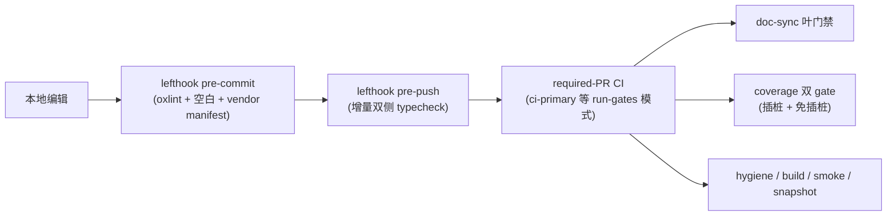

#### 收束

治理体系在 65 天内从"两个手写文档目录"长成"机器强制的决策层"：

- **决策记录**（Agent Note）——格式、分类、链接、双语配对全部 gate 强制，低价值记录冻结归档；
- **静态门**（doc-sync 全家）——文档代码块、catalog 系列、链接、预算、note 格式等数十个叶节点，`run-gates.ts` 调度器统一编排；
- **运行时断言**（invariant service）——存储边界深冻结始终开启，关系型断言由各包自有的 `./invariant` companion 提供，所有权机械穷尽；
- **质量门**（100% 覆盖率 + hooks + CI 矩阵）——每文件 100% 行覆盖，插桩/免插桩双门，可点击失败记录，Windows 原生 required CI。

每一层都由 git 可追踪的提交与 note 记录在案；这本身即是"agent-first 仓库"对"如何防止 agent 写出无理由代码"的回答——**把理由变成文件，把文件变成 gate，把 gate 变成非零退出**。

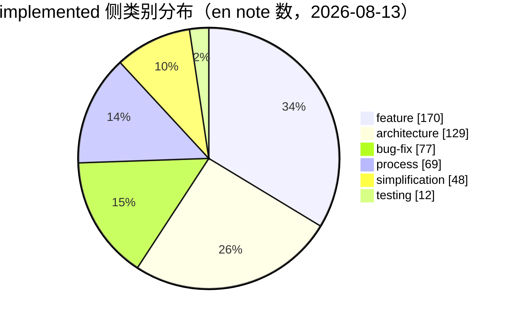

---

*本节事实口径：commit hash 与日期来自 git log（`--date=short`）与既有章节；note 路径来自 `.agents/notes/` 目录实测（2026-08-13）；gate 名与脚本来自 `doc-sync-gates.txt`、`package.json` 与 `scripts/run-gates.ts`。无法确认的条目已标注"（待考）"或引用其唯一出处。*


## 工程基础设施与研发实践

> 本章全部事实来自仓库 git 历史（截至 2026-08-13，HEAD `47f943859b`，共 12,293 个提交）。日期均为提交日期。
> 本扩展版保留原章节的全部事实、commit hash、日期、版本号与命令字符串，并补充了根 `package.json` 脚本清单（`root-scripts.txt`）、15 个 workflow 清单（`workflows.txt`）、`pnpm-workspace.yaml`、`scripts/run-gates.ts` 调度器、`vendor/README.md` 清单等仓库实测数据。凡无法从现有章节、数据文件或仓库文件确认的细节一律标注"（待考）"，不臆造 job 结构、步骤数字与提交哈希。

本章导览：

| 章节 | 覆盖内容 | 相对原章节的主要新增 |
|---|---|---|
| 包管理与构建 | Yarn→pnpm、workspace 布局、构建管线、scripts 大表 | 根 scripts 分组表、pnpm-workspace.yaml 配置总表、Yarn/pnpm 对照表、构建产物布局表、三阶段定型表 |
| 测试策略 | 四层测试、覆盖率门禁、快照演进、e2e | 四层对照表、vitest 配置族、DSH_SNAPSHOT 三值表、快照演进时间线、免插桩门细节、key 政策表 |
| 静态检查 | ESLint→Oxlint、typecheck、jscpd、doc-sync | 对照表、Oxlint 迁移细节、校验脚本族总表、生成/校验成对表、质量门禁全景表 |
| CI 矩阵 | workflow 全表、run-gates、Windows、Node 矩阵、GitLab | 15 workflow 角色/日期表、run-gates 14 模式表与 gate 明细、Windows 三段式演进表、CI 版本对照表 |
| Vendoring 流程 | 9 包清单、rescope、同步流程、18 条本地修改 | 9 包表、rescope 前后对照表、18 条修改明细表、三方依赖/不 vendoring 清单、同步流程图 |
| 发布工程 | 三条序列、五步流程、npm 公开次序 | 序列/commit 流水表、scripts/release 表、access 策略表、序列依赖表、gantt/sequenceDiagram |
| 基础设施里程碑 | 30 行原表 + 17 行新增 | 按主题演进小结表 |
| 附录 | 123 scripts 索引、AGENTS.md 命令表、mermaid 图清单 | 全量索引、任务列表、定义列表 |

---

### 总览

这个仓库的基础设施不是渐进长出来的，而是在项目第一天（2026-06-11）就一次性立起了完整骨架：当天依次提交了 monorepo 骨架（Yarn 4 workspaces + tsc -b + dumble + vitest，`ae2e08b4d6`）、Cordis 源码 vendoring（`72688a3888`）、ESLint 严格规则（`cb6bee3d03`）、逐文件 100% 覆盖率门禁（`bfb034830f`）、knip/publint/constraints 卫生门（`6796a3922d`）、lefthook git hooks（`9d20a36cc4`）和第一版 GitHub Actions CI（`86955b96a4`，node 24/26 全门禁矩阵）。dumble 甚至在当天就被判定为 bus-factor 风险换成了 tsdown（`630bbddf9a`）。

此后两个月，工程实践从"单仓库跑一组命令"演进为"多 lane 的发布流水线"：包管理器在 5 天内从 Yarn 4 换成 pnpm（2026-06-16），CI 从单一 job 拆成 static/coverage/consumers 宽 lane 并由 `run-gates.ts` 统一调度（2026-07-06），lint 从 ESLint 迁到 Oxlint（2026-07-30），Windows 从"无"到"Wine 模拟"再到"自托管原生完整门禁 + 双平台 failover 开关"（2026-07-06 → 07-27 → 08-10），最终在 2026-08-11 到 08-13 之间跑通了三条发布序列（dsh / vendor / native + Python），并全部公开上 npm。

提交节奏与这一过程同步放大：2026-W24 只有 67 个提交，W31 达 3,542，W33 回落到 1,213。月度贡献量（按作者）见下方附表，与周提交数口径不同，仅用于观察同一放大趋势。

| 维度 | 数值 | 来源 |
|---|---|---|
| 提交总数 | 12,293（截至 2026-08-13） | git 历史 |
| 根 package.json scripts | 123 条 | `root-scripts.txt` |
| GitHub Actions workflow | 15 个 | `workflows.txt` / `.github/workflows` |
| run-gates 调度模式 | 14 个命名模式（另有 hygiene 等根脚本聚合） | `scripts/run-gates.ts` |
| vendored 包 | 9 个（全部 rescope 到 `@deepseek-ai`） | `vendor/README.md` |
| vendor 本地修改条目 | 18 条 | `vendor/README.md` |
| 发布序列 | 3 条（dsh / vendor / native + Python） | 本章"发布工程" |
| Node 版本线 | `^22.19.0 \|\| >=24.0.0`（排除 Node 23） | 根 `package.json` |
| 包管理器 | `pnpm@11.7.0`（`packageManager` 字段） | 根 `package.json` |

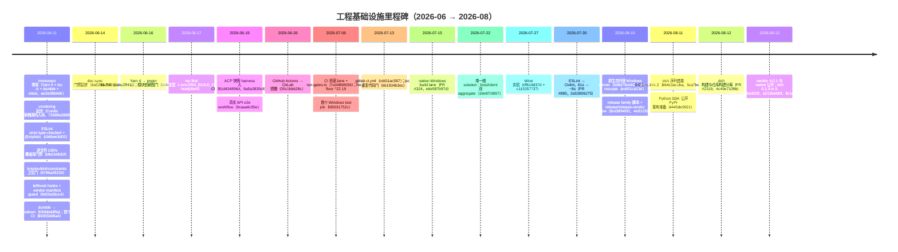

月度贡献量（数据来源 `contrib-monthly.txt`，数值为当月该作者贡献量，与"提交数"口径不同）：

| 作者 | 2026-06 | 2026-07 | 2026-08 | 合计 |
|---|---|---|---|---|
| Tianyi Cui | 497 | 4,036 | 682 | 5,215 |
| Yichen Jiang | 21 | 627 | 713 | 1,361 |
| imccyu | 17 | 822 | 453 | 1,292 |
| Chinesezjc | 0 | 372 | 212 | 584 |
| Turtle | 0 | 353 | 223 | 576 |
| Hypatia May | 46 | 331 | 101 | 478 |
| _Kerman | 0 | 231 | 245 | 476 |
| creatixchu | 0 | 326 | 155 | 481 |
| kingwl | 1 | 211 | 48 | 260 |
| Huanqi Cao | 0 | 19 | 195 | 214 |
| ZiyaZhang | 2 | 161 | 79 | 242 |
| Dudu-0223 | 26 | 94 | 70 | 190 |
| NI0317 | 0 | 157 | 23 | 180 |
| pku-xht | 0 | 29 | 144 | 173 |
| **合计** | **610** | **7,769** | **3,343** | **11,722** |

2026-07 是贡献量的峰值月（合计 7,769），与 W31 周提交数 3,542 的峰值相互印证；2026-08 回落但分布更均匀（第二名起均为三位数）。本章后续各节按"包管理与构建 → 测试策略 → 静态检查 → CI 矩阵 → Vendoring 流程 → 发布工程 → 基础设施里程碑"展开。

---

### 包管理与构建

#### 从 Yarn 4 到 pnpm

仓库以 Yarn 4 workspaces（node-modules linker）起步，`ae2e08b4d6` 的提交信息明确了最初分工：开发/测试/演示经 tsx + 根 tsconfig paths 直接跑源码，构建 = `tsc -b`（声明）+ dumble（JS bundle），测试 = vitest + vite-tsconfig-paths。当天稍晚 `630bbddf9a` 就以"dumble v0.2.x、每周约 530 下载、单维护者、作为承重 bundler 是 bus-factor 风险"为由换成 tsdown（rolldown 内核，每周约 250 万下载），输出与 dumble 逐字节等价（用快照 diff 验证 17 个 bundle），决策记录在 ADR 0008（后归档为 `2026-06-11-tsdown-over-dumble` note）。`scripts/build.ts`（dumble 编排）随之删除，`pnpm build = tsc -b && tsdown`。

2026-06-16 的 `dabc2ff411`（feat: migrate to pnpm，配套 ADR 0016 / note `2026-06-16-pnpm-over-yarn`）把包管理器整体换成 pnpm 11.7.0：删除 `yarn.lock`（4,864 行）与 `yarn.config.cjs`，新增 `pnpm-lock.yaml`（4,440 行）与 `pnpm-workspace.yaml`；workspaces 从 `package.json#workspaces` + `.yarnrc.yml` 迁到 pnpm-workspace.yaml。

关键取舍记录在 note 里：迁移动机不是安装速度（迁移时测量 Yarn 与 pnpm 基本打平甚至 pnpm 更慢），而是生态对齐、pnpm 严格 symlink linker 让 phantom dependency（未声明即 import 的传递依赖）失败响亮（对"整个质量故事就是机械门禁"的仓库是特性），以及跨 checkout 的内容寻址 store 磁盘去重。

pnpm 10+ 的构建脚本白名单机制被当成供应链加固沿用：`pnpm-workspace.yaml` 的 `allowBuilds` 显式允许 esbuild/lefthook 等真正需要 lifecycle 的包，其余默认拒绝。Yarn constraints 引擎被重写为与包管理器无关的 `scripts/check-workspace-constraints.ts`（`pnpm run constraints`），继续强制"全部 private、dsh-* 包把 cordis 声明为匹配的 peer+dev 依赖、统一版本、ESM"等清单规则。

Yarn 4 时代与 pnpm 时代的对照如下：

| 维度 | Yarn 4 时代（2026-06-11 → 06-16） | pnpm 时代（2026-06-16 起） |
|---|---|---|
| lock 文件 | `yarn.lock`（4,864 行，迁移时删除） | `pnpm-lock.yaml`（4,440 行，迁移时新增） |
| workspaces 声明 | `package.json#workspaces` + `.yarnrc.yml` | `pnpm-workspace.yaml`（`packages:` 列表） |
| linker 语义 | node-modules linker（hoisted 近似） | 严格 symlink linker：未声明的传递依赖 import 直接失败（phantom dependency 失败响亮） |
| 依赖解析 | 每个 workspace 独立 node_modules | 内容寻址全局 store + 跨 checkout 磁盘去重 |
| constraints 机制 | Yarn constraints 引擎（`yarn.config.cjs`） | `scripts/check-workspace-constraints.ts`（`pnpm run constraints`，与包管理器无关） |
| 构建脚本控制 | 无白名单机制 | `allowBuilds` 白名单：默认拒绝，显式允许 esbuild/lefthook 等 |
| 版本固定 | 无强制 | `packageManager: pnpm@11.7.0` + `engines.node` |

迁移的实际文件面（`dabc2ff411`，数字来自本章）：

| 操作 | 文件 | 规模 / 内容 |
|---|---|---|
| 删除 | `yarn.lock` | 4,864 行 |
| 删除 | `yarn.config.cjs` | Yarn constraints 引擎配置 |
| 新增 | `pnpm-lock.yaml` | 4,440 行 |
| 新增 | `pnpm-workspace.yaml` | workspaces 声明 + 后续 allowBuilds 等配置 |
| 重写 | `scripts/check-workspace-constraints.ts` | 与包管理器无关的 constraints 实现（`pnpm run constraints`） |
| 迁出 | `.yarnrc.yml` 中的 workspaces/linker 配置 | 配置迁入 pnpm-workspace.yaml（是否删除文件（待考）） |

> [!NOTE]
> **pnpm `allowBuilds` 是"默认拒绝"的白名单**：pnpm 10+ 默认拦截一切带 install/build 脚本的依赖（`strictDepBuilds` 默认开启，未列出的 lifecycle 脚本是硬安装错误）。本仓库只放行真正需要 lifecycle 的包——esbuild（原生二进制）、lefthook（git hooks）、node-pty（PTY 后端，含 Windows ConPTY）、koffi（Windows 上 JSONL 耐久性写穿发布调用 MoveFileExW）、`@deepseek-ai/dsh-subprocess-local@file:...`（Python runtime 部署还原 node-pty macOS spawn helper 可执行位）；而 `@google/genai`、`protobufjs`、`node-addon-require-builtin` 虽然带 lifecycle 脚本但实为 no-op，被显式 `false` 拒绝。白名单之外的新依赖默认装不上——这是有意的供应链加固。

#### workspace 布局与依赖解析

`pnpm-workspace.yaml` 的成员列表（2026-08 实测）：

- `vendor/*` —— 9 个 vendored Cordis 框架包（见"Vendoring 流程"节）
- `packages/*/*` —— 全部 `@deepseek-ai/dsh-*` 工作区
- `native/landlock-run` 及 `native/landlock-run/packages/*` —— Landlock launcher（原生构建与发布脚本保留在 native 目录内）
- `apps/*` —— 产品组装层（`apps/cli` 拥有 `dsh` bin）
- `website` —— VitePress 文档站点
- `examples` —— 可运行 demo 叶，**仅作依赖解析成员，不是构建目标**（tsdown 的显式 glob `vendor/*`、`packages/*/*` 排除它们；见已归档的 run-ci-examples-from-built-lib Agent Note）
- `python/sdk-runtime` —— single-exe 构建的部署根：一个纯依赖清单，其闭包就是 exe 打包与 Python runtime 分发的内容

关键依赖解析配置（均来自 `pnpm-workspace.yaml` 实测）：

- `linkWorkspacePackages: true`：vendored 框架包保留上游 semver 范围，本地构建把这些匹配名解析到钉死的 workspace 源码（含 built `lib/` 里的 import）
- `overrides`：`@deepseek-ai/cosmokit` / `@deepseek-ai/schemastery` 强制 `link:vendor/...`
- `peerDependencyRules.allowedVersions`：`typescript: '>=5 <7'`
- `minimumReleaseAgeExclude`：放行刚发布的 `@earendil-works/pi-ai@0.82.1`（模型目录更新是 bump 的全部意义）与 node-addon-* 0.1.4 全家
- `patchedDependencies`：`node-pty@1.1.0` → `patches/node-pty@1.1.0.patch`

`pnpm-workspace.yaml` 的其余配置项（2026-08 实测，逐字来自文件）：

| 配置项 | 值 | 用途 / 理由 |
|---|---|---|
| `linkWorkspacePackages` | `true` | vendored 框架包保留上游 semver 范围，本地构建解析到钉死 workspace（含 built `lib/` 里的 import） |
| `overrides` | `@deepseek-ai/cosmokit: link:vendor/cosmokit`、`@deepseek-ai/schemastery: link:vendor/schemastery` | 两个基础库强制 workspace link，杜绝 registry 副本混入 |
| `peerDependencyRules.allowedVersions` | `typescript: '>=5 <7'` | 放宽 typescript peer 范围（工具链兼容） |
| `allowBuilds.esbuild` | `true` | 原生二进制，genuinely 需要 lifecycle |
| `allowBuilds.lefthook` | `true` | git hooks，genuinely 需要 lifecycle |
| `allowBuilds.node-pty` | `true` | 持久 PTY 后端的跨平台边界（含 Windows ConPTY） |
| `allowBuilds.koffi` | `true` | JSONL 耐久性在 Windows 上以 write-through 发布调用 MoveFileExW |
| `allowBuilds['@deepseek-ai/dsh-subprocess-local@file:...']` | `true` | Python runtime 部署包含该 workspace postinstall（还原 node-pty macOS spawn helper 可执行位） |
| `allowBuilds['@google/genai']` | `false` | pi-ai 可选后端带入；lifecycle 是 no-op，显式拒绝 |
| `allowBuilds.protobufjs` | `false` | 同上，no-op lifecycle |
| `allowBuilds.node-addon-require-builtin` | `false` | 同上，no-op lifecycle |
| `minimumReleaseAgeExclude` | `@earendil-works/pi-ai@0.82.1` + node-addon-* 0.1.4 全家（9 项） | 新发布带模型目录更新（pi-ai）与配套 addon 二进制，等 release age 会事与愿违 |
| `patchedDependencies` | `node-pty@1.1.0: patches/node-pty@1.1.0.patch` | node-pty 本地补丁（patch 文件入库） |

> [!TIP]
> **`minimumReleaseAgeExclude` 是 pnpm 供应链时序控制的例外清单**：pnpm 默认对新发布包施加"发布冷却期"（防抢注/防新鲜供应链攻击），但 pi-ai 的每次 bump 其价值就是最新模型目录，node-addon-* 0.1.4 是配套原生二进制——两者被显式豁免。新增依赖若想跳过冷却期，应先确认是否该进这个清单而不是改全局配置。

#### 根 scripts 大表（上）：构建与测试

根 `package.json` 共 123 条 scripts（完整清单见 `root-scripts.txt`），下表按用途节选关键条目。命令字符串逐字来自 `root-scripts.txt`；"用途"为通用描述。

**构建与清理**

| 脚本名 | 命令（逐字） | 用途 |
|---|---|---|
| `build` | `npm run build:lib && npm run build:web` | 构建全部产物（lib + web 前端） |
| `build:lib` | `npm run build:lib:host && npm run build:lib:client` | 构建 TypeScript lib（host/client 两趟） |
| `build:lib:host` | `tsc -b tsconfig.host.json && tsdown --env.DSH_BUILD_FACE host` | host 面：tsc 发声明 + tsdown 打包（host 趟） |
| `build:lib:client` | `tsc -b tsconfig.client.json && tsdown --env.DSH_BUILD_FACE client` | client 面：tsc 发声明 + tsdown 打包（client 趟） |
| `build:web` | `pnpm --filter @deepseek-ai/dsh-web-frontend run build` | 构建 Web 前端 |
| `clean` | `tsx scripts/clean.ts` | 清理构建产物与已删除包的残留 |
| `change-scope` | `tsx scripts/change-scope.ts` | 包范围变更辅助脚本 |

**测试与快照**

| 脚本名 | 命令（逐字） | 用途 |
|---|---|---|
| `test` | `vitest run` | 单元测试（无 key） |
| `test:coverage` | `vitest run --coverage` | 带逐文件 100% 覆盖率门禁的测试（无 key） |
| `test:e2e` | `vitest run --config vitest.e2e.config.ts` | 真实 API e2e（需 key，无 key 自跳） |
| `test:snapshot` | `vitest run --config vitest.snapshot.config.ts` | 快照重放（无 key） |
| `test:snapshot:record` | `DSH_SNAPSHOT=record vitest run --config vitest.snapshot.config.ts --update` | 重录快照（需 key） |
| `test:snapshot:refresh` | `DSH_SNAPSHOT=refresh vitest run --config vitest.snapshot.config.ts` | 快照刷新（无 key） |
| `test:web` | `npm run build && npm run test:web:built` | 构建后跑 Web 浏览器快照 |
| `test:web:built` | `vitest run --config vitest.web.config.ts` | 对已构建产物跑 Web 快照（`DSH_SNAPSHOT=replay`） |
| `test:web:perf` | `npm run build && npm run test:web:perf:built` | Web 性能快照（replay 模式） |
| `test:web:stress` | `npm run build && vitest run --config vitest.web-stress.config.ts` | Web 压力测试 |
| `test:gui` | `vitest run packages/client packages/host` | host/client 包测试 |
| `test:issue-management` | `node .github/issue-management/policy.test.mjs` | Issue 管理政策测试（node 直接跑） |

**门禁调度（run-gates 聚合）**

| 脚本名 | 命令（逐字） | 用途 |
|---|---|---|
| `check:all` | `tsx scripts/run-gates.ts check-all` | 本地全量门禁聚合 |
| `check:ci` | `tsx scripts/run-gates.ts ci-primary` | CI 主门禁聚合（本地复演主 lane） |
| `check:ci:linux-primary` | `tsx scripts/run-gates.ts ci-linux-primary` | Linux 主门禁聚合（含 web 快照） |
| `check:ci:static` | `tsx scripts/run-gates.ts ci-static` | 静态门禁聚合 |
| `check:ci:lint:contracts-ready` | `tsx scripts/run-gates.ts ci-lint-contracts-ready` | 契约就绪后的 lint 聚合 |
| `check:ci:coverage` | `tsx scripts/run-gates.ts ci-coverage` | 覆盖率门禁聚合 |
| `check:ci:snapshot` | `tsx scripts/run-gates.ts ci-snapshot` | 快照门禁聚合 |
| `check:ci:artifacts` | `tsx scripts/run-gates.ts ci-artifacts` | 产物验证门禁聚合 |
| `check:ci:consumers` | `tsx scripts/run-gates.ts ci-consumers` | 消费者视角完整验证聚合 |
| `check:windows-wine` | `bash scripts/wine-windows-gates.sh` | 仅诊断已知 Windows 失败时用（需 wine；CI 拥有该信号） |
| `check:ci:windows-blocking` | `tsx scripts/run-gates.ts ci-windows-blocking` | Windows 阻塞门聚合（Wine 上跑，必需） |
| `check:ci:windows-complete` | `tsx scripts/run-gates.ts ci-windows-complete` | Windows 完整门聚合（原生 runner） |
| `check:ci:windows-observational` | `tsx scripts/run-gates.ts ci-windows-observational` | Windows 观测门聚合 |
| `check:node-compat` | `tsx scripts/run-gates.ts node-compat` | Node 版本兼容门聚合 |

**静态检查与卫生**

| 脚本名 | 命令（逐字） | 用途 |
|---|---|---|
| `typecheck` | `npm run build:lib:host && npm run typecheck:contracts-ready` | 类型检查（先跑 host 趟生成 client 所需声明） |
| `lint` | `npm run build:lib:host && npm run lint:contracts-ready` | Oxlint 全量检查（契约就绪后） |
| `lint:fix` | `npm run build:lib:host && npm run lint:fix:contracts-ready` | Oxlint 自动修复 |
| `duplication` | `jscpd --config .jscpd.json packages scripts` | 跨文件 TypeScript 克隆检测 |
| `knip` | `knip --treat-config-hints-as-errors` | 未使用导出/依赖检测 |
| `publint` | `tsx scripts/publint-all.ts` | 全包发布清单 lint |
| `hygiene` | `pnpm run rescope-vendor:check && pnpm run knip && pnpm run publint && pnpm run constraints && pnpm run verify-dsh-package-licenses && pnpm run verify-package-invariants && pnpm run verify-built-package-invariants && pnpm run verify-cordis-config && pnpm run verify-node-next-types && pnpm run verify-runtime-closure && pnpm run verify-vendored-links` | 卫生门链（10 个脚本串行） |
| `constraints` | `tsx scripts/check-workspace-constraints.ts` | workspace 约束检查（Yarn constraints 的替代） |
| `verify-node-next-types` | `tsx scripts/verify-node-next-types.ts` | 构建声明喂给临时 NodeNext ESM 消费者 |
| `verify-vendored-links` | `tsx scripts/verify-vendored-links.ts` | 断言 vendored 名只以 workspace `link:` 存在于 lock |
| `verify-cordis-config` | `tsx scripts/verify-cordis-config.ts` | 校验 cordis.yml 裸插件出现在解析器清单依赖中 |

**文档与校验**

| 脚本名 | 命令（逐字） | 用途 |
|---|---|---|
| `doc-sync` | `tsx scripts/run-gates.ts doc-sync` | 文档门禁聚合（leaf 清单见 run-gates.ts） |
| `doc-typecheck` | `npm run build:lib:host && npm run doc-typecheck:contracts-ready` | 文档代码块 typecheck |
| `docs:build` | `pnpm --filter @deepseek-ai/website run build && pnpm run verify-doc-site-fragments` | VitePress 站点构建（兼作死链检查） |
| `docs:build:mpa` | `pnpm --filter @deepseek-ai/website exec vitepress build . --mpa && pnpm run verify-doc-site-fragments` | VitePress MPA 模式构建（Windows 观测门用） |
| `docs:check` | `pnpm exec vitest run scripts/project-doc-site.spec.ts scripts/verify-doc-site-fragments.spec.ts && pnpm run docs:build` | 文档站点检查 + 构建 |
| `website:build` | `pnpm run docs:build` | 站点构建别名 |
| `verify-doc-refs` | `tsx scripts/verify-doc-refs.ts` | 文档交叉引用校验 |
| `verify-doc-budgets` | `tsx scripts/verify-doc-budgets.ts` | 文档字数预算校验 |
| `verify-md-wrap` | `tsx scripts/verify-md-wrap.ts` | Markdown 折行校验 |
| `verify-type-equiv` | `tsx scripts/verify-type-equiv.ts` | 类型等价校验（doc-sync 族） |

**发布与运行**

| 脚本名 | 命令（逐字） | 用途 |
|---|---|---|
| `release:dsh` | `tsx scripts/release/bump.ts --family dsh` | bump dsh 序列版本 |
| `release:vendor` | `tsx scripts/release/bump.ts --family vendor` | bump vendor 序列版本 |
| `release:verify` | `tsx scripts/release/verify.ts` | 校验 tag 与版本一致 |
| `release:pack` | `tsx scripts/release/pack.ts` | 打包发布集（无凭证可跑） |
| `release:verify-packed-install` | `tsx scripts/release/verify-packed-install.ts` | tarball 干净环境安装验证 |
| `release:publish` | `tsx scripts/release/publish.ts` | 发布上传（npm-publish environment） |
| `publish:npm-baseline` | `tsx scripts/publish-npm-baseline.ts` | npm 基线发布脚本 |
| `dsh` | `node --import tsx/esm apps/cli/src/bin.ts` | 从源码跑 dsh CLI（tsx ESM-only hook） |
| `demo:cordis` | `node scripts/demo-cordis.mjs` | agent 自改运行时演示（需 key） |
| `dev:web` | `tsx scripts/dev-web.ts --poll` | Web 前端开发服务器 |
| `postinstall` | `node scripts/install-lefthook.mjs` | 安装 lefthook git hooks |

> 其余未列入的 scripts（`verify-*` 系列、`gen-*` 系列、`demo:acp`、`mock:llm`、`test:web:refresh` 等约 60 条）见 `root-scripts.txt` 全量清单；`gen-*`/`verify-*` 成对出现（生成器 + `--check` 校验）是"生成物入库、门禁校验 freshness"的通用模式。

#### 构建管线

当前 `pnpm run build` 的完整链条（命令逐字来自 `root-scripts.txt`）：

```bash
pnpm run build            # = npm run build:lib && npm run build:web
pnpm run build:lib        # = npm run build:lib:host && npm run build:lib:client
pnpm run build:lib:host   # tsc -b tsconfig.host.json && tsdown --env.DSH_BUILD_FACE host
pnpm run build:lib:client # tsc -b tsconfig.client.json && tsdown --env.DSH_BUILD_FACE client
pnpm run build:web        # pnpm --filter @deepseek-ai/dsh-web-frontend run build
```

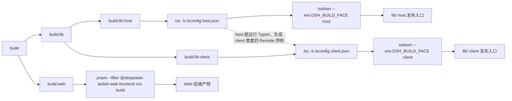

要点（事实来自本章"测试策略"与"静态检查"节所述机制）：

- tsc -b 独占 TypeScript 变换并产出 `lib/types` 下的 `.js/.d.ts`；tsdown 只负责把 tsc 发出的 JS 打包成发布入口
- host/client 分趟由 `--env.DSH_BUILD_FACE host|client` 区分，2026-06-17 的 tsc-first 配置里就已定型
- entry 是 `lib/types/{index,invariant,startup}.js`
- `apps/cli`（dsh）自 2026-08-12（PR #2319）起从仓库构建中分离；`tsdown.config.ts` 的 workspace glob `['vendor/*', 'packages/*/*', 'apps/cli']` 即此结果

构建产物布局（source plane → artifact plane 的落点，事实来自本章与 vendor README）：

| 产物 | 生成者 | 位置 | 消费者 |
|---|---|---|---|
| TypeScript 中间产物（`.js` + `.d.ts` + `.d.ts.map`） | tsc -b（独占变换） | 各包 `lib/types/` | tsdown 打包输入；声明元数据消费者 |
| 发布 runtime 入口 | tsdown（只打包 tsc 发出的 JS） | 各包 `lib/` | package exports / 发布 tarball |
| 库入口文件 | tsc + tsdown | `lib/types/{index,invariant,startup}.js` | 运行时入口 |
| host/client 分面产物 | `--env.DSH_BUILD_FACE host\|client` | 各包 `lib/`（host 与 client 两趟） | host（服务端）/ client（浏览器/GUI） |
| 双 ESM+CJS 特殊条目 | vendored schemastery / logger-console 自有 tsdown 配置 | 各自 `lib/`（`.mjs`/`.cjs` 分入口） | CJS require 与 ESM import 双方 |
| Web 前端产物 | `build:web`（dsh-web-frontend） | 前端包构建输出 | Web GUI 快照 lane 等 |

#### 三阶段构建定型

构建管线在两个月内经历了三次定型，每次都有明确的提交或 note 背书：

| 阶段 | 时间 | 依据 | 定型内容 |
|---|---|---|---|
| 1. tsc-first | 2026-06-17 | note `2026-06-17-ts-build-config` | tsc -b 独占 TypeScript 变换并产出 `lib/types` 的 `.js/.d.ts`，tsdown 只打包 tsc 发出的 JS；oxc 的变换行为与 tsc 不一致，且 tsdown 的 bundled .d.ts 与 Cordis 的相对模块增广冲突 |
| 2. host/client 双 aggregate | 2026-07-22 | `19e6f7d907` | 单一根 solution 图，下面挂 host/client 两个 aggregate（`tsconfig.host.json` / `tsconfig.client.json`）；原因是两侧都以同名 key 对 cordis `Context` 做 declaration merging，同一 ts.Program 里会冲突 |
| 3. dsh 独立构建 | 2026-08-12 | PR #2319（`4c49e7109b`） | fix(cli): separate dsh from repository build——把 dsh（apps/cli）构建从仓库构建中分离；`tsdown.config.ts` 的 workspace glob `['vendor/*', 'packages/*/*', 'apps/cli']` 即此结果 |

配套约束（2026-07-06 的 `node-engine-floor` note）：根 `package.json` 固定 `packageManager: pnpm@11.7.0`、`engines.node: ^22.19.0 || >=24.0.0`；LTS 下限从 22.18 抬到 22.19，因为 Pi 适配器依赖 `@earendil-works/pi-ai` 声明 `>=22.19.0`，并明确排除 Node 23 整条线。`source plane` 与 `artifact plane` 从不混用：静态门禁与测试经 tsconfig `paths` 解析 workspace import 到 `src`，在干净树上通过；消费 built `lib/` 的门禁显式声明该依赖。

---

### 测试策略

测试分四层，各有分工和时机。四层总览：

| 层 | 命令 | 配置 | 何时跑 | 有无 key 依赖 |
|---|---|---|---|---|
| 单元测试 | `pnpm test` | vitest 默认配置，各包 `tests/**` | 本地 + CI 每个 push/PR | 无 |
| 覆盖率门禁 | `pnpm test:coverage` | `@vitest/coverage-v8`，`packages/*/src` 逐文件 100% | CI coverage lane（必需） | 无 |
| 快照测试 | `pnpm test:snapshot` / `test:web` | `vitest.snapshot.config.ts` / `vitest.web.config.ts` | CI snapshot lane / web 快照 lane（Linux PR 必需门） | 重放无 key；`record` 需 key；`refresh` 无 key |
| 真实 API e2e | `pnpm test:e2e` | `vitest.e2e.config.ts`，secret `DEEPSEEK_API_KEY_EXTERNAL` | e2e.yml：PR + 00:17 UTC 夜间 cron；fork/Dependabot 跳过 | 需 key（无 key 自跳，preflight 硬失败防假绿） |

key 依赖政策总表（"有无 key 依赖"列的展开，事实来自本章）：

| 命令 | key 需求 | 无 key 时的行为 |
|---|---|---|
| `test` / `test:coverage` / `test:snapshot` / `test:snapshot:refresh` / `test:web` / `test:gui` | 无 | 全量正常跑（keyless CI 保持绿） |
| `test:snapshot:record` | 需 key | 不适用（重录需真实模型输出） |
| `test:e2e` | 需 key（`DEEPSEEK_API_KEY_EXTERNAL`） | suite 无 key 自跳；workflow preflight 在 secret 缺失时硬失败（防假绿）；fork/Dependabot 因 secret 被扣而跳过 |
| `demo:*` / `dsh`（源码跑任务） | 需 key | 无 key 无法运行 |

**单元测试**（`pnpm test`，vitest）随代码放在各包 `tests/**`，所有 vitest 配置都指向 `tsconfig.base.json` 的 paths，工作区 import 一律解析到 `src`（source plane），从不经过 package exports 进 `lib/`——这是为了避免过期产物加载第二份模块单例。vitest 不 typecheck，因此类型正确性由 tsc -b 单独承担（见"静态检查"节）。

单元测试的约定（来自本章 + 仓库 AGENTS.md，通用表述）：

- 测试随代码放在各包 `tests/**`，与 `src/**` 并排；包级测试、e2e-only 断言与 mock-only fixture 不互相替代
- 所有 vitest 配置指向 `tsconfig.base.json` 的 paths，workspace import 一律解析到 `src`（source plane），从不经过 package exports 进 `lib/`
- 测试子进程启动模式：配置子进程跑 built `lib/` 下的普通 Node；源码回归用其声明的 launcher（详见 docs/testing.md 的 test-subprocess launch modes 政策）
- 快照 fixture 必须能在 macOS/Linux 重放——修 fixture 而不是修 normalizer
- 测试描述行为而非正确性：行为变更与测试同 PR 修改，并说明原因

快照 harness 的机制（2026-06-19 成型，`81d434896d` 引入 normalizers / wiring / handshake 场景，`c94f1563f5` 补五场景 + cancel/error 操作）：

- 重放：`test:snapshot` 用录制的 session 重放，diff 归一化后的 JSON-RPC 消息与重持久化日志（模型不可见输入 → session 事件的"model-visible ⟺ logged"不变量由此被机械校验）
- 记录：`test:snapshot:record` 需要 key 重录 expected 输出；`test:snapshot:refresh` 无 key 刷新（2026-07-10 `9d2cf8ce82`）
- 形态：交互式终端旅程用 JSONL 场景（`apps/cli/tests/snapshots/`）；Web GUI 用 Chromium 浏览器快照 lane（`test:web`）

vitest 配置族（实测于根 scripts 与 CI 引用；各配置均指向 `tsconfig.base.json` 的 paths）：

| 配置文件 | 服务命令 | 用途 | key 依赖 |
|---|---|---|---|
| （默认 vitest 配置） | `test` | 单元测试 | 无 |
| （默认 + `--coverage`） | `test:coverage` | 覆盖率门禁 | 无 |
| `vitest.e2e.config.ts` | `test:e2e` | 真实 API e2e | 需 key（无 key 自跳） |
| `vitest.snapshot.config.ts` | `test:snapshot` / `test:snapshot:record` / `test:snapshot:refresh` | ACP/headless 快照重放/重录/刷新 | 重放、刷新无 key；重录需 key |
| `vitest.web.config.ts` | `test:web:built`（`test:web` 先 build） | Chromium 浏览器快照 | 无 |
| `vitest.web.perf.config.ts` | `test:web:perf:built`（`test:web:perf` 先 build） | Web 性能快照（replay） | 无 |
| `vitest.web-stress.config.ts` | `test:web:stress`（先 build） | Web 压力测试 | 无 |

`DSH_SNAPSHOT` 环境变量三值语义（命令逐字见根 scripts）：

| 值 | 行为 | 何时用 | key 需求 |
|---|---|---|---|
| `record` | 重录 expected 输出（`--update`） | 输出意图变化时（`test:snapshot:record`） | 需 key |
| `refresh` | 无 key 刷新录制结果（`test:snapshot:refresh`，2026-07-10 的 `9d2cf8ce82` 引入） | 产物/环境漂移但不改意图时 | 无 key |
| `replay` | 确定性重放比对（`test:web:built` 由 gate 注入 `DSH_SNAPSHOT=replay`） | CI 快照 lane | 无 key |

**覆盖率门禁**（`pnpm test:coverage`）从 2026-06-11 的 `bfb034830f` 起就是"逐文件 100%"：

- 引擎：`@vitest/coverage-v8`
- 范围：`packages/*/src`，按文件设 statements/branches/functions/lines 四条 100% 阈值
- 排除：`vendor/`（上游代码）、`examples/`（由 demo smoke 覆盖）、纯类型文件
- 不可达守卫：真正不可达的防御性守卫允许带理由的 `/* v8 ignore */` 注释而不是删除
- 该提交当时为此补了 59 个测试（总计 132 个）

质量门禁 note（`2026-06-11-quality-gates`）记录了这一机制的动机：代码库主要由编码 agent 开发，"agent 服从强制门禁远比服从散文约定可靠"（早期教训：vitest 不 typecheck，导致没通过类型检查的测试被合入）。

覆盖率门禁还有一个"免插桩门"（2026-08 实测于 `scripts/coverage-exempt.ts`）：

- 机制：`coverage` 聚合拆成两个并行 gate——插桩的阈值门（`COVERAGE_EXEMPT_ENV=1`，跑全部 suite）+ 免插桩的 heavy 套件门（裸 vitest，不加 `--coverage`）
- 成员规则：某 suite 只有在"其执行到的每个被测量文件都已被其他 suite 100% 覆盖"时才有资格免插桩——移除它不改变任何阈值结果；正确性信号不丢，只省掉 v8 插桩税
- 当前豁免套件：`packages/typert/generator/tests/`（每 case 全 workspace 编译器分析，是 lane 最长尾）、`scripts/install-lefthook.spec.ts`、`scripts/oxlint-contract.spec.ts`、`scripts/change-scope.spec.ts`（真实子进程 fixture，coverage 从不测量 scripts/）
- worker 预算：`DSH_COVERAGE_MAX_WORKERS` 在两门间拆分（豁免门取 `max(1, floor(total/3))`，插桩门取余下份额），failover 池的 8 × 6-instance 上界假设单 lane 从不超预算；需要严格单 worker 的串行参考 job 另设 `DSH_GATE_CONCURRENCY=1`

**快照测试**成型于 2026-06-19，演进时间线：

| 日期 | commit | 事件 |
|---|---|---|
| 2026-06-19 | `bef9386591` | RFC：record-once / replay-deterministic |
| 2026-06-19 | `81d434896d` | ACP 快照 harness 落地（normalizers、wiring、handshake 场景） |
| 2026-06-19 | `c94f1563f5` | 补五个场景 + cancel/error 输入操作 |
| 2026-06-19 | `9a5a3835c8` | 快照进入 CI |
| 2026-06-19 | `f09cc81c03` | "影响 transcript/UX 的改动必须带快照测试"写成文档政策 |
| 2026-07-10 | `9d2cf8ce82` | 新增无需 key 的 refresh 模式 |
| 2026-07-24/30 | note（待考哈希） | Web GUI Chromium 快照 lane 定为 Linux PR 必需门 |

快照无 key 重放：`test:snapshot` 用录制的 session 重放并 diff 归一化后的 JSON-RPC 与重持久化日志，`test:snapshot:record` 需要 key 重录，2026-07-10 的 `9d2cf8ce82` 又加了无需 key 的 refresh 模式。之后快照体系随产品演进扩展：交互式终端旅程用 JSONL 场景（`apps/cli/tests/snapshots/`）、Web GUI 用 Chromium 浏览器快照 lane（`test:web`，2026-07-24/30 的 note 将其定为 Linux PR 必需门）。

快照的三种形态（事实来自本章"测试策略"）：

| 形态 | 载体 / 配置 | 位置 | 引入 |
|---|---|---|---|
| ACP/headless 快照 | `vitest.snapshot.config.ts`，重放 + diff 归一化 JSON-RPC 与重持久化日志 | 各包 tests + snapshot 场景 | 2026-06-19（`81d434896d`、`c94f1563f5`、`9a5a3835c8`） |
| 交互式终端旅程 | JSONL 场景 | `apps/cli/tests/snapshots/` | 随产品演进扩展 |
| Web GUI 浏览器快照 | `vitest.web.config.ts`（`test:web`），Chromium | web 快照 lane | 2026-07-24/30 note 定为 Linux PR 必需门 |

快照 gate 的装配细节（实测于 `run-gates.ts`）：`snapshotGate()` 跑 `test:snapshot` 并设 `DSH_EXAMPLE_MODE=lib`——example 与 package 快照在 `lib` 模式下启动 bin（构建产物 + 真实 exports 插件），脚本快照走真实源码入口；调用方要么等 `build` 要么等一个传递拥有该 build 的验证 gate。

**真实 API e2e**（`test:e2e`）是独立的 secret 工作流：`9caaa6c95e`（2026-06-19）用 `DEEPSEEK_API_KEY_EXTERNAL` secret 打外网 `https://api.deepseek.com`，suite 无 key 自跳（keyless CI 保持绿），但 workflow 有"secret 缺失则硬失败"的 preflight 防假绿，PR 触发但 fork/Dependabot 因 secret 被扣而跳过，另有 00:17 UTC 夜间 cron。分工的时机逻辑是：keyless 的 lint/typecheck/coverage/snapshot 全部在 ci.yml 每个 push/PR 跑，消耗 secret 的 e2e 单独在 e2e.yml 跑。

> [!TIP]
> **本地复演门禁用 `pnpm run check:ci` 而非逐个脚本**：`run-gates.ts` 聚合了依赖图与有界并发（`DSH_GATE_CONCURRENCY` 可调），本地跑与 CI 同一套 gate 定义，避免"本地过了、CI 挂了"的配置漂移。消耗 secret 的 e2e 与 Wine 门（`check:windows-wine`）不在本地默认清单里——前者缺 key 自跳，后者只在诊断已知 Windows 失败时才值得跑。

---

### 静态检查

lint 从第一天起就是严格模式：`cb6bee3d03`（2026-06-11）上 ESLint flat config 双层——type-checked 正确性层（typescript-eslint strict-type-checked）以 no-floating-promises / no-misused-promises 为头号规则（"agent loop 里丢 promise 是本仓库首要 bug 类别"），另有 switch-exhaustiveness-check、no-unnecessary-condition、require-await、no-explicit-any；样式层用 @stylistic 固化 2 空格/无分号/单引号/trailing comma/max-len 140 的既有 house style；vendor/ 排除，测试放宽与测试 ergonomics 冲突的规则。

type-aware ESLint 的代价随后显现：干净跑约 61 秒、需要 8 GiB Node heap、CI 结果缓存和单独调的并发（`0619ce62b6` 2026-06-26 给 lint step 抬 heap）。2026-07-30 的 PR #885（`2a53806275`，refactor: migrate linting to Oxlint，note `2026-07-29-oxlint-linter`）把整个 lint 栈换成 Oxlint，2026-08-09 的 PR #2097（`118a2f6866`）再把残余的 ESLint workflow 替换为 oxlint-only fix 流程。ESLint 与 Oxlint 的对照：

| 工具 | 引擎 | 干净跑耗时 | 迁移日期 | 关键规则 / 机制 |
|---|---|---|---|---|
| ESLint | typescript-eslint（type-aware，ts.Program 全量） | ~61 秒；8 GiB Node heap；CI 结果缓存 + 单独并发（`0619ce62b6`） | 2026-06-11 起步（`cb6bee3d03`）；2026-07-30 退役（PR #885） | strict-type-checked 层：no-floating-promises、no-misused-promises、switch-exhaustiveness-check、no-unnecessary-condition、require-await、no-explicit-any；@stylistic 样式层（2 空格/无分号/单引号/trailing comma/max-len 140） |
| Oxlint | oxlint + oxlint-tsgolint（TypeScript Go 分析器，按文件做项目发现） | ~8 秒（无需结果缓存） | 2026-07-30（`2a53806275`，PR #885）；2026-08-09（`118a2f6866`）残余 workflow 换 oxlint-only fix | @stylistic 与 SonarJS 经 Oxlint JS 插件兼容层保留；nursery 里的 no-unnecessary-condition 因"迁移前就是强制规则"继续开启；一次性逐规则审计 source 88/88、examples 87/87、tests 83/83 规则名翻译一致，审计过的 profile 指纹钉进仓库 |

Oxlint 迁移的工程细节（note `2026-07-29-oxlint-linter` 记载 + 根 scripts 实测）：

- **类型感知**：类型感知由 oxlint-tsgolint（TypeScript Go 分析器）按文件做项目发现，替代 ESLint 的整棵 ts.Program 全量加载——这正是 61 秒与 8 GiB heap 的根源被移除的地方
- **规则兼容**：@stylistic 和 SonarJS 通过 Oxlint 的 JS 插件兼容层保留；nursery 里的 no-unnecessary-condition 因"迁移前就是强制规则"而继续开启
- **一次性逐规则审计**：对删除的 ESLint 配置做了逐规则翻译审计——source 88/88、examples 87/87、tests 83/83 规则名翻译一致，并把审计过的 profile 指纹钉进仓库（后续规则增删会触发指纹比对）
- **并行度**：lint gate 读 `DSH_OXLINT_THREADS` 环境变量（有值则反映到 displayCommand）
- **fix 流程**：`lint:fix` = `npm run build:lib:host && npm run lint:fix:contracts-ready`；其中 staged 部分先以 `.oxlintrc.staged.json` 修 `packages/typert/generator/tests/fixtures/type-model`（生成器 fixture 特殊配置），再全量修全仓库
- **残余 ESLint workflow**：2026-08-09 的 PR #2097（`118a2f6866`）把残余 ESLint workflow 替换为 oxlint-only fix 流程

**typecheck** 由 tsc -b 承担（host lib 阶段先跑以生成 client 需要的 Remote 声明，再 tsc -b client aggregate），另有 `verify-node-next-types` 把构建出的声明喂给临时 NodeNext ESM 消费者做解析检查。

**重复代码**门禁 2026-07-13 才出现：`661504b3ec`（chore: gate TypeScript duplication in CI，jscpd 跨文件克隆检测）与 `53d9634043`（收紧阈值），2026-07-27 的 `36e8141145` 把 .tsx 也纳入 jscpd lane；当前 `pnpm run duplication` 用 `jscpd --config .jscpd.json packages scripts`。`.jscpd.json` 实测：`ignore` 含 `**/tests/**` 与 `**/tsdown.config.ts`，支持 `/* jscpd:ignore-start */` / `/* jscpd:ignore-end */` 块级豁免。

**文档侧**还有一个独立的 doc-sync 门禁族：2026-06-14 的 `6a528be569`（typecheck 文档代码块 + 校验事件分类法）起步，`07048983e0` 加 verify-type-equiv，2026-07-21 的 PR #455（`6fc7dd4c02`）把 doc-sync 并入 run-gates 调度器。doc-sync 聚合的叶子门（实测于 `run-gates.ts` 的 `docSyncLeafGates`，名单以源码为准）覆盖文档代码块 typecheck、站点构建/死链、类型等价、引用、折行、budgets 等校验族。

**hygiene 链**（`pnpm run hygiene`）串行跑 10 个脚本：`rescope-vendor:check` → `knip` → `publint` → `constraints` → `verify-dsh-package-licenses` → `verify-package-invariants` → `verify-built-package-invariants` → `verify-cordis-config` → `verify-node-next-types` → `verify-runtime-closure` → `verify-vendored-links`（命令逐字见"根 scripts 大表"）。它覆盖"源码面"（未构建时也能跑的部分）与"产物面"（消费 built `lib/` 的部分），与 tsc/tsdown 的 source/artifact plane 纪律对应。

**校验脚本族总表**（`verify-*` 直接校验，命令逐字来自 `root-scripts.txt`，用途为通用描述；`verify-*` 与 `gen-*` 成对出现时是"生成器 + `--check` freshness 校验"模式）：

| 脚本名 | 命令 | 用途 |
|---|---|---|
| `verify-md-wrap` | `tsx scripts/verify-md-wrap.ts` | Markdown 折行校验 |
| `verify-md-links` | `tsx scripts/verify-md-links.ts` | Markdown 链接校验 |
| `verify-doc-site-fragments` | `tsx scripts/verify-doc-site-fragments.ts` | 文档站点片段校验（docs:build 内嵌） |
| `verify-public-repository-links` | `tsx scripts/verify-public-repository-links.ts` | 公开仓库链接校验 |
| `verify-doc-refs` | `tsx scripts/verify-doc-refs.ts` | 文档交叉引用校验 |
| `verify-doc-budgets` | `tsx scripts/verify-doc-budgets.ts` | 文档字数预算校验 |
| `verify-type-equiv` | `tsx scripts/verify-type-equiv.ts` | 类型等价校验（doc-sync 族） |
| `verify-mermaid` | `tsx scripts/verify-mermaid.ts` | mermaid 代码块语法校验 |
| `verify-package-paths` | `tsx scripts/verify-package-paths.ts` | 包路径校验 |
| `verify-package-invariants` | `tsx scripts/verify-package-invariants.ts` | 包不变量校验（源码面） |
| `verify-built-package-invariants` | `node scripts/verify-built-package-invariants.mjs` | 构建产物不变量校验（产物面） |
| `verify-package-readme-model-experience` | `tsx scripts/verify-package-readme-model-experience.ts` | 包 README 模型体验校验 |
| `verify-package-readme-limitations` | `tsx scripts/verify-package-readme-limitations.ts` | 包 README 限制声明校验 |
| `verify-dsh-package-licenses` | `tsx scripts/verify-dsh-package-licenses.ts` | dsh 包许可证校验 |
| `verify-config-source-ownership` | `tsx scripts/verify-config-source-ownership.ts` | 配置源归属校验 |
| `verify-cordis-config` | `tsx scripts/verify-cordis-config.ts` | cordis.yml 裸插件依赖声明校验 |
| `verify-node-next-types` | `tsx scripts/verify-node-next-types.ts` | NodeNext ESM 消费者解析校验 |
| `verify-runtime-closure` | `tsx scripts/verify-runtime-closure.ts` | 运行时闭包校验 |
| `verify-vendored-links` | `tsx scripts/verify-vendored-links.ts` | vendored 名只以 workspace link 存在 |
| `verify-client-domain-graph` | `tsx scripts/verify-client-domain-graph.ts` | client 域图校验 |
| `verify-export-jsdoc` | `tsx scripts/verify-export-jsdoc.ts` | 导出 JSDoc 完整性校验（@param/@returns） |
| `verify-agent-note-classification` | `tsx scripts/verify-agent-note-classification.ts` | Agent Note 分类校验 |
| `verify-agent-note-format` | `tsx scripts/verify-agent-note-format.ts` | Agent Note 格式校验 |
| `verify-archived-agent-notes` | `tsx scripts/verify-archived-agent-notes.ts` | 归档 Agent Note 冻结校验 |
| `verify-skill-invocation-metadata` | `tsx scripts/verify-skill-invocation-metadata.ts` | skill 调用元数据校验 |
| `verify-translation-prompt` | `tsx scripts/verify-translation-prompt.ts` | 翻译 prompt 校验 |
| `verify-translation-pairing` | `tsx scripts/verify-translation-pairing.ts` | 翻译配对校验 |
| `resolve-translation-pairing-conflicts` | `tsx scripts/merge-translation-pairing.ts --resolve` | 翻译配对冲突解决 |
| `gen-translation-brief` | `tsx scripts/gen-translation-brief.ts` | 生成翻译简报 |

**生成 + 校验成对脚本**（生成器产物入库，`--check` 校验 freshness）：

| 生成脚本 | 校验脚本（`--check`） | 生成物 |
|---|---|---|
| `gen-cordis-catalog` | `verify-cordis-catalog` | cordis 插件目录 |
| `gen-cordis-api` | `verify-cordis-api` | cordis API 参考 |
| `gen-client-catalog` | `verify-client-catalog` | client 侧目录 |
| `gen-cordis-inspect-catalog` | （同脚本 `--check`） | cordis inspect 目录 |
| `gen-tool-catalog` | `verify-tool-catalog` | 工具目录 |
| `gen-config-catalog` | `verify-config-catalog` | 配置目录 |
| `gen-doc-graphs` | `verify-doc-graphs` | 文档依赖图 |
| `gen-persistence-catalog` | `verify-persistence-catalog` | 持久化目录 |
| `gen-third-party-notices` | `verify-third-party-notices` | THIRD_PARTY_NOTICES |
| `gen-module-graph` | `verify-module-graph` | 模块依赖图（2026-06-16 起的 freshness 门禁） |
| `gen-scoped-events` | `verify-scoped-events` | 作用域事件清单 |
| `rescope-vendor` | `rescope-vendor:check` | vendored 包 @deepseek-ai 重命名 |

**质量门禁全景表**（门禁 → 入口脚本 → 引入时间 → 关键演进；全部事实来自本章各节）：

| 门禁 | 入口脚本 | 引入时间 | 关键演进 |
|---|---|---|---|
| 类型检查 | `typecheck`（build:lib:host + typecheck:contracts-ready） | 2026-06-11（`ae2e08b4d6`） | 07-22 host/client 双 aggregate（`19e6f7d907`）；08-12 dsh 构建分离（PR #2319，`4c49e7109b`） |
| lint | `lint`（run-oxlint.ts） | 2026-06-11 ESLint（`cb6bee3d03`） | 07-30 Oxlint（PR #885，`2a53806275`）；08-09 oxlint-only fix（`118a2f6866`） |
| 覆盖率 | `test:coverage` | 2026-06-11（`bfb034830f`） | 逐文件 100% + `/* v8 ignore */` + 免插桩门（coverage-exempt） |
| 快照 | `test:snapshot` / `test:web` | 2026-06-19（`81d434896d`、`9a5a3835c8`、`f09cc81c03`） | 07-10 keyless refresh（`9d2cf8ce82`）；07-24/30 web 快照 lane |
| 真实 API e2e | `test:e2e` | 2026-06-19（`9caaa6c95e`） | e2e.yml + 00:17 UTC cron + preflight 防假绿 |
| 重复代码 | `duplication`（jscpd） | 2026-07-13（`661504b3ec`、`53d9634043`） | 07-27 .tsx 纳入（`36e8141145`） |
| 卫生 | `hygiene`（10 脚本链） | 2026-06-11（`6796a3922d` 起步） | rescope-vendor:check / verify-vendored-links 等并入 |
| 文档 | `doc-sync` | 2026-06-14（`6a528be569`） | 07-21 并入 run-gates（PR #455，`6fc7dd4c02`） |
| 模块依赖图 | `verify-module-graph` | 2026-06-16（`4c8c1da8b3`） | gen/verify 成对 freshness |
| Windows | `check:ci:windows-*` | 2026-07-06（`fd5931752c`） | Wine（`cff614d37d`）→ 原生自托管（`5d8d79ce92`）→ failover 变量（`65f679b33a`） |
| 发布 | `release:verify` / `release:verify-packed-install` | 2026-08-10（`8cd38945f1`） | 三条序列 + access 策略 |
| vendored 链接 | `verify-vendored-links` | 2026-08-10（`ec601ca13d` 配套） | 断言 lock 中只存在 workspace link: |
| NodeNext 类型 | `verify-node-next-types` | （待考） | 构建声明喂临时 ESM 消费者 |
| cordis 配置 | `verify-cordis-config` | （待考） | 裸插件必须出现在解析器 manifest 依赖中 |

---

### CI 矩阵

#### 15 个 workflow 全表

`.github/workflows/` 下共 15 个 workflow（文件名实测于 2026-08；用途与触发器为基于文件名与本章事实的通用描述，具体 job 结构未逐一展开）：

| 文件 | 用途（通用描述） | 触发器 |
|---|---|---|
| `ci.yml` | 主 CI：Linux 必需 lane + verdict（见下） | push / PR |
| `e2e.yml` | 真实 API e2e（secret 工作流） | PR（fork/Dependabot 跳过）+ 00:17 UTC cron |
| `sandbox.yml` | 沙箱相关检查/构建（2026-07-09 引入） | （待考） |
| `build-exe-for-python-sdk.yml` | 构建 Python SDK 的单文件运行时（release-shaped Linux x64 runtime job 复用它） | （待考） |
| `single-exe.yml` | single-exe 打包相关（2026-07-11 引入） | （待考） |
| `landlock-run.yml` | Landlock launcher 构建（2026-07-14 引入） | push / PR（待考） |
| `landlock-run-release.yml` | Landlock launcher 发布（2026-08-06 引入） | tag / manual（待考） |
| `pi-ai-provider-e2e.yml` | pi-ai provider 真实 API e2e（2026-07-17 引入） | PR / manual（待考） |
| `expected-filenames.yml` | 期望文件名一致性校验（2026-07-19 引入） | push / PR（待考） |
| `docs-pages.yml` | 文档站点 Pages 部署（2026-07-20 引入） | push / manual（待考） |
| `issue-lifecycle.yml` | Issue 生命周期自动化（2026-08-03 引入） | issues 事件（待考） |
| `issue-policy.yml` | Issue 管理政策校验（跑 `test:issue-management` 类政策测试） | PR / issues 事件（待考） |
| `e2b-e2e.yml` | E2B 手动 live sandbox e2e（2026-08-09 引入） | manual（待考） |
| `release.yml` | dsh 序列发布（pack 无凭证跑 + 手动 publish） | 每个 PR/master push（pack）+ `dsh-v*` tag manual dispatch |
| `release-vendor.yml` | vendor 序列发布（同上） | 每个 PR/master push（pack）+ `vendor-*` tag manual dispatch |
| `python-release.yml` | Python SDK 公开 PyPI 发布（2026-08-11 引入） | tag / manual（待考） |

15 个 workflow 按角色分类（名字来自 `workflows.txt`；角色为基于文件名的通用归纳）：

| 类别 | workflow | 角色 |
|---|---|---|
| 主门禁 | `ci.yml` | Linux 必需 lane + verdict |
| secret e2e | `e2e.yml`、`pi-ai-provider-e2e.yml`、`e2b-e2e.yml` | 真实 API / provider / live sandbox e2e |
| 构建与产物 | `build-exe-for-python-sdk.yml`、`single-exe.yml`、`landlock-run.yml`、`landlock-run-release.yml` | 单文件运行时 / exe / Landlock 构建与发布 |
| 文档与校验 | `docs-pages.yml`、`expected-filenames.yml` | 站点部署 / 文件名一致性 |
| Issue 自动化 | `issue-lifecycle.yml`、`issue-policy.yml` | 生命周期流转 / 政策校验 |
| 沙箱 | `sandbox.yml` | 沙箱相关检查（07-09 引入） |
| 发布 | `release.yml`、`release-vendor.yml`、`python-release.yml` | 三条发布序列 |

15 个 workflow 的引入日期映射（日期来自本章事实；无 hash 处"（待考）"）：

| 文件 | 引入日期 | 出处 |
|---|---|---|
| `ci.yml` | 2026-06-11 | `86955b96a4`（首个 CI） |
| `e2e.yml` | 2026-06-19 | `9caaa6c95e` |
| `docs-pages.yml` | 2026-07-20 | 本章"其余 workflow 按需补充" |
| `sandbox.yml` | 2026-07-09 | 同上 |
| `single-exe.yml` | 2026-07-11 | 同上 |
| `landlock-run.yml` | 2026-07-14 | 同上 |
| `landlock-run-release.yml` | 2026-08-06 | 同上 |
| `pi-ai-provider-e2e.yml` | 2026-07-17 | 同上 |
| `expected-filenames.yml` | 2026-07-19 | 同上 |
| `issue-lifecycle.yml` | 2026-08-03 | 同上（Issue 自动化） |
| `issue-policy.yml` | 2026-08-03 | 同上（Issue 自动化） |
| `e2b-e2e.yml` | 2026-08-09 | 同上 |
| `release.yml` | 2026-08-10 | `4e91230dd6` |
| `release-vendor.yml` | 2026-08-10 | `4e91230dd6` |
| `python-release.yml` | 2026-08-11 | `4445de9921` |

#### ci.yml 的演进

第一版 CI（`86955b96a4`，2026-06-11）是单 workflow 全门禁：push/PR 触发，node 24 与 26 双版本，immutable install、constraints、lint、typecheck（src + tests + examples）、带逐文件 100% 覆盖率门禁的测试、knip + publint、全量 build，外加一个驱动 echo-agent 的 demo smoke（断言 tool-call 往返与 JSONL session dump）——与本地 scripts 和 git hooks 跑同一组命令。

2026-07-06 起 CI 拆成宽 lane：`7cd4868056`（split primary gates into broad lanes）引入 `scripts/run-gates.ts` 调度器（有依赖图的 gate 聚合 + 有界并发，`DSH_GATE_CONCURRENCY` 环境变量可调），`2d80d868be` 把 lint 单独隔离并调优 coverage lane，`5efc449af0`/`09326fd84a`/`d71c96a44c` 继续细分 static 与 lint lane。

当前 ci.yml 是三个必需 Linux 企业 job（`node 24 / static`、`node 24 / coverage`、`node 24 / snapshots and artifacts`，跑在 dsh-ubuntu-24-04-16core 上）+ 独立 verdict job `all-checks-passed`（`if: always()` 聚合所有必需 job，任何非 success 都判失败，避免 skipped 被算作通过）。拓扑示意：

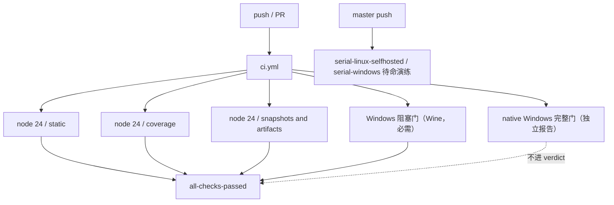

（图中 Windows 门与 serial 待命的具体 workflow 归属以仓库为准；"必需/独立报告/不进 verdict"语义来自本章事实。）

第一版 CI 与当前 CI 的对照（事实来自本章"CI 矩阵"各段）：

| 维度 | 第一版（2026-06-11，`86955b96a4`） | 当前（2026-08-13） |
|---|---|---|
| 结构 | 单 workflow 全门禁 | 三必需 Linux job + verdict + Wine 阻塞门 + 原生 Windows 完整门 + serial 待命 |
| Node 版本 | 24 / 26 双版本 | 22.19 / 24 / 26 三档 + python 3.10 keyless SDK job |
| lint | ESLint（type-aware） | Oxlint（61s → ~8s） |
| 调度 | 顺序执行同一组命令 | `run-gates.ts` 依赖图聚合 + 有界并发（`DSH_GATE_CONCURRENCY`） |
| Windows | 无 | Wine 阻塞门（必需）+ 原生自托管完整门（独立报告）+ failover |
| verdict | 无（单 job 即 verdict） | `all-checks-passed`（`if: always()`，任何非 success 判失败，避免 skipped 算通过） |
| 发布 | 无 | 三条序列 + pack/verify/publish 五步流程 |
| 覆盖率 | 逐文件 100%（同日引入） | 逐文件 100% + 免插桩门（coverage-exempt） |

#### run-gates 模式表

`scripts/run-gates.ts` 定义 14 个命名模式（`Mode` 联合类型实测），根 scripts 的 `check:*` 即它们的入口；`hygiene` 是根脚本聚合而非 run-gates 模式：

| 模式 | 聚合内容（通用描述） | 典型用途 |
|---|---|---|
| `ci-primary` | 共享静态门 + Typert 契约 + typecheck + lint + duplication + coverage（含免插桩门）+ node 兼容 smoke + snapshot + doc-sync 叶子 + module-graph + knip + build + publint + node-next-types + built-package-invariants + built-bin smoke | 主 Linux 门禁（本地 `check:ci`） |
| `ci-linux-primary` | `ci-primary` + web 浏览器快照（等 built-package-invariants） | Linux 主 job（含 web 快照） |
| `ci-static` | 共享静态门 + 可选 build（ownsBuild 变体）+ doc-sync 叶子（含 MPA 站点构建）+ module-graph + knip | static lane |
| `ci-lint-contracts-ready` | 契约就绪后的 lint 聚合 | lint lane |
| `ci-coverage` | 插桩覆盖率门 + 免插桩 heavy 套件门（并行，worker 预算拆分） | coverage lane |
| `ci-snapshot` | build 后跑 `test:snapshot`（`DSH_EXAMPLE_MODE=lib`） | snapshot lane |
| `ci-artifacts` | build + publint + node-next-types + built-package-invariants + built-bin smoke | 产物验证 lane |
| `ci-consumers` | build + node-compat + publint + built-package-invariants + lint/duplication + snapshot + web-snapshot + doc-typecheck（用构建产物）+ node-next-types + built-bin smoke | 消费者视角完整验证（`check:ci:consumers`） |
| `ci-windows-blocking` | build + `docs:build`（生产站点） | Windows 阻塞门（Wine，必需，进 verdict） |
| `ci-windows-complete` | build + 生产站点 + coverage + 观测门全量（allowFailure） | 原生 Windows 完整门（独立报告，不进 verdict） |
| `ci-windows-observational` | ci-static（ownsBuild）+ duplication + publint + node-next-types + built-package-invariants + built-bin smoke（不含 lint/snapshot，Linux 独占） | Windows 观测门（complete 的组成部分） |
| `node-compat` | Node 22 上完整 build + web + cli smoke；其他大版本 typecheck + 四项兼容 smoke（source-worker、JSONL Zstandard、dsh source-launch、vitest jsdom） | Node 兼容性 job |
| `check-all` | 本地全量（含 hygiene 叶子、doc-sync 叶子；worker 上限 min(4, 可用核)） | 本地提交前全量 |
| `doc-sync` | doc-sync 叶子族 | 文档门禁聚合 |

调度器机制要点（实测于 `run-gates.ts`）：

- `Gate` 结构：`id` / `label` / `displayCommand` / `command` / `args` / `needs`（依赖 id 列表）/ `env` / `allowFailure`
- 有依赖图的 gate 聚合 + 有界并发；`DSH_GATE_CONCURRENCY` 环境变量可调 worker 数
- 默认并发：`ci-consumers` 取 gate 总数（每 gate 一 worker）；`check-all` / `doc-sync` 本地模式上限 `min(4, availableParallelism())`（多个 doc gate 各建整棵 ts.Program，不设上限会内存爆炸）；其余取 `availableParallelism()`
- 调度前 `validateGateGraph` + `findDependencyCycle` 做环检测
- 汇总判据：任何非 `allowFailure` 的 gate 为 failed 或 skipped 则整体退出码 1

主要模式的 gate 明细（实测于 `run-gates.ts` 各 `*Gates()` 函数，gate id 为源码中的 id 字段）：

`ci-primary` 的完整 gate 列表（依赖关系用缩进表示）：

- 共享静态门（`ciSharedStaticGates`）：
  - `runtime-closure`（verify-runtime-closure）
  - `constraints`
  - `dsh-package-licenses`
  - `package-invariants`
  - `cordis-config`
  - `issue-management`（policy.test.mjs）
- `typert-contracts`（build:lib:host——Typert 只在 host 趟运行）
- `typecheck`（needs typert-contracts；typecheck:contracts-ready = tsc -b tsconfig.client.json）
- `lint`（needs typert-contracts；lint:contracts-ready）
- `duplication`（jscpd）
- `coverage` + `coverage-exempt-heavy`（两门并行，`DSH_COVERAGE_MAX_WORKERS` 拆分）
- node 兼容 smoke 四项（source-worker / JSONL Zstandard / dsh source-launch / vitest jsdom）
- `snapshot`（needs build；`DSH_EXAMPLE_MODE=lib`）
- doc-sync 叶子（doc-typecheck needs typert-contracts）
- `module-graph`（verify-module-graph）
- `knip`
- `build`（needs typecheck/lint/doc-typecheck——build 既与三者共享 Client tsc，又重复 host 契约趟，须等全部读完 tsbuildinfo）
- `publint`（needs build）
- `node-next-types`（needs build）
- `built-package-invariants`（needs build）
- `built-bin-smoke`（built bin 冒烟）

`ci-linux-primary` = `ci-primary` + `web-snapshot`（`DSH_SNAPSHOT=replay` 的 `test:web:built`，needs built-package-invariants）。

`node-compat` 的版本分叉（源码 `runningNodeMajor()` 判定）：

- Node 22（LTS floor）：typecheck + build + build:web + 四项 smoke + cli 启动 smoke（`cli-lazy-search-startup-smoke`，需 `DSH_REQUIRE_BUILT_CLI_SMOKE=1` 且 needs build:web）
- 其他大版本（24/26）：typecheck + 四项 smoke
- `DSH_NODE_COMPAT_SKIP_TYPECHECK=1` 可跳过 typecheck（用于仅 smoke 的聚焦 job）

四项兼容性 smoke 的实测清单（gate id 与 spec 路径来自 `run-gates.ts`）：

| gate id | spec 路径 | 验证内容（通用描述） |
|---|---|---|
| `source-worker-smoke` | `packages/workflow/workflow-worker-thread/tests/source-worker.compat.spec.ts` | workflow worker 线程的源码加载兼容性 |
| `jsonl-zstd-smoke` | `packages/session/session-persistence-jsonl/tests/zstd.compat.spec.ts` | JSONL 持久化的 Zstandard 压缩兼容性 |
| `dsh-source-launch-smoke` | `apps/cli/tests/source-launch.compat.spec.ts` | dsh CLI 的 source-launch 模式 |
| `vitest-jsdom-smoke` | `scripts/vitest-environment.compat.spec.ts` | vitest jsdom 环境兼容性 |
| `cli-lazy-search-startup-smoke`（仅 Node 22） | `apps/cli/tests/lazy-search-startup.compat.spec.ts` | CLI 惰性搜索启动（需 built 产物） |

`ci-consumers` 的 gate 列表：build → node-compat（check:node-compat）→ publint（needs build）→ built-package-invariants（needs publint）→ lint-and-duplication（needs built-package-invariants）→ snapshot + web-snapshot（needs built-package-invariants）→ doc-typecheck（用构建产物 `DSH_DOC_TYPECHECK_USE_BUILD_OUTPUT=1`）→ node-next-types → built-bin-smoke——它把"消费者视角"的验证全部钉在真实构建产物上，是发布前最接近用户安装的本地复演。

`ci-windows-blocking` = build + `docs:build`（生产站点）；`ci-windows-complete` = build + 生产站点 + coverage + 观测门全量（allowFailure）；`ci-windows-observational` = ci-static（ownsBuild）+ duplication + publint + node-next-types + built-package-invariants + built-bin-smoke——观测门显式不含 lint 与 snapshot（注释：Linux 独占必需 lint 与快照，Windows 省略重复）。

#### Windows 三段式演进

| 阶段 | 时间 | 载体 | 内容 | 关键 commit |
|---|---|---|---|---|
| 1. 托管 Windows job | 2026-07-06 | windows-2025 | 首次加 Windows test job | `fd5931752c` |
| 1b. lane 拆分 | 2026-07-08 | 镜像 Linux 结构 | Windows lane 拆分 | `007001677d` |
| 1c. native build lane | 2026-07-15 | PR #324 | native-Windows build lane | `e6e587b97d` |
| 2. Wine 实验 | 2026-07-27 | 托管 Linux + Wine | 在 Linux 上用 Wine 跑 Windows 阻塞门：checksum 钉死 Node、pnpm store + wine apt 双缓存、hoisted node_modules 布局、stdio 走文件避开 runner pipe 的 EBADF | `cff614d37d` + 实验 workflow `c115357737` |
| 3. 原生自托管 | 2026-08-10 | dsh-windows-2025-16core（failover 目标 dsh-win-ci 池：一台 96 核/580 GB 机器上 32 个常驻 runner 实例） | Windows CI 统一到原生自托管 runner | `5d8d79ce92` |
| 3b. 保持 Wine + failover | 2026-08-11 | Wine lane 保持必需 + 原生 job 加 failover + serial-windows 待命 | `4b37c4827c` |
| 3c. 平台独立 failover 变量 | 2026-08-13 | `DSH_CI_FAILOVER_LINUX` / `DSH_CI_FAILOVER_WINDOWS` 仓库变量拆分（note `2026-07-26-ci-failover-runbook`） | `65f679b33a` |

当前拓扑（本章事实）："Wine 阻塞门（必需，进 all-checks-passed）+ 原生 Windows 完整门（独立报告，不进 verdict）+ 每次 master push 的 serial-linux-selfhosted / serial-windows 待命演练"。

Wine 实验（2026-07-27，`cff614d37d` + 实验 workflow `c115357737`）的四个工程决策，是"在 Linux 上模拟 Windows"能成为必需门的原因：

- **checksum 钉死 Node**：Wine 下安装的 Node 版本被 checksum 固定，避免版本漂移带来的不可复现失败
- **pnpm store + wine apt 双缓存**：Windows 依赖与 Wine 本体分别缓存，重复跑只增量
- **hoisted node_modules 布局**：Wine 进程对 symlink 支持不完整，node_modules 用 hoisted 布局而非 pnpm 默认的 symlink 布局
- **stdio 走文件**：子进程 stdio 重定向到文件再回读，避开托管 runner pipe 在 Wine 下的 EBADF

failover 机制（note `2026-07-26-ci-failover-runbook`）的要点：

- 08-11 起 Wine lane 保持必需（它不依赖自托管池，是故障时的底线信号），原生 job 获得 failover 目标（dsh-win-ci 池：一台 96 核/580 GB 机器上 32 个常驻 runner 实例）
- 08-13 把 failover 开关拆成平台独立的 `DSH_CI_FAILOVER_LINUX` / `DSH_CI_FAILOVER_WINDOWS` 仓库变量——Linux 与 Windows 的故障转移可以分别开关，互不牵连
- 每次 master push 跑 serial-linux-selfhosted / serial-windows 待命演练，让自托管池在真实负载下保持热

> [!WARNING]
> **Wine lane 的 stdio 走文件是有意为之**：托管 runner 的 pipe 在 Wine 下会 EBADF，因此 Wine 门把子进程 stdio 重定向到文件再回读。同理，`check:windows-wine` 只在诊断已知 Windows 失败时手动跑——它需要 wine、慢，且 CI 才是该信号的权威来源。不要在本地默认清单里加它。

#### Node 版本矩阵

`2026-07-06-node-engine-floor` note 定为 keyless CI 在 22.19 / 24 / 26 三档跑：

| Node 版本 | job 定位 | 覆盖范围 |
|---|---|---|
| 22.19（LTS floor） | 独立兼容 job | 聚焦兼容性 smoke（source-worker、Zstandard、source-launch、jsdom storage）；`node-compat` 模式下 Node 22 额外跑完整 build + web 构建 + cli lazy-search 启动 smoke |
| 24（主） | 主 Node 24 job | 完整 typecheck 与单测覆盖率清单 + 全部必需门禁（static/coverage/snapshots and artifacts） |
| 26 | 独立兼容 job | 聚焦兼容性 smoke（同 22.19 四项） |
| Python 3.10 | `python 3.10 / keyless SDK` job | uv + pytest 的 keyless SDK 测试 |
| Linux x64 runtime | release-shaped job | 复用 `build-exe-for-python-sdk.yml` 构建单文件运行时 |

真实 API e2e 固定在 Node 24。

#### GitLab 镜像与 Python 发布

GitLab 的角色是镜像与 Python 发布：`05c1bb628c`（2026-06-26）加 GitHub Actions workflow 把仓库镜像到 GitLab；`cdd11ac587`（2026-07-13）引入 `.gitlab-ci.yml`，专门在 `python-v*` tag 上构建 sdk wheel + 三个平台 runtime wheel（linux-x64/arm64、macos-arm64，含 manylinux_2_28 与 macOS deployment target 检查）并经 twine 发布到 GitLab Package Registry；公开 PyPI 发布则由 2026-08-11 的 `4445de9921`（Prepare Python SDK public PyPI publication）及其 `python-release.yml` 承担。

GitLab 侧构建的 wheel 矩阵（`.gitlab-ci.yml`，2026-07-13 `cdd11ac587` 引入；细节以本章事实为准）：

| 产物 | 平台 | 检查 |
|---|---|---|
| sdk wheel | 平台无关 | 随 `python-v*` tag 构建 |
| runtime wheel | linux-x64 | manylinux_2_28 |
| runtime wheel | linux-arm64 | manylinux_2_28 |
| runtime wheel | macos-arm64 | macOS deployment target |

发布路径：twine 发布到 GitLab Package Registry；公开 PyPI 发布走 2026-08-11 的 `4445de9921` 及其 `python-release.yml`。

其余 workflow 按需补充：sandbox（07-09）、single-exe（07-11）、landlock-run 构建与发布（07-14 / 08-06）、pi-ai provider e2e（07-17）、expected-filenames（07-19）、docs-pages（07-20）、Issue 自动化（08-03）、e2b 手动 live sandbox（08-09）、release/release-vendor（08-10）、python-release（08-11）——详见"15 个 workflow 全表"。

---

### Vendoring 流程

vendoring 与 monorepo 同一天诞生：`72688a3888`（2026-06-11）把 cordis 4.0.0-rc.6、六个 @cordisjs 插件（loader/include/group/timer/hmr/logger-console）、cosmokit 1.8.1、schemastery 3.18.0 从 cordis-workspace checkout 复制进 `vendor/`（拍平、保留上游 npm 名、`private: true`），`vendor/README.md` 即清单：上游仓库 + commit SHA、本地修改日志、同步流程。第一天就立了两条配套纪律：`9d20a36cc4` 的 lefthook vendor-manifest guard 强制"任何 `vendor/*/src` 改动必须同 commit 更新 `vendor/README.md`"，README 里第一条本地修改（hmr 的 locale YAML import 与 `.i18n()` 移除，因不 vendoring 运行时 YAML loader hook）也当天记录。

vendored 包后续持续跟随上游（2026-08-07/11 移植 cordiverse/cordis#41 的惰性 config 解析、entry `disabled` 插值等），并不断追加本地修改条目（fiber 生命周期加固、事务式 Loader/Include 配置协调、Windows 路径/watch 修复等，README 累计到 18 条）。2026-08-10 的 `ec601ca13d`（build(vendor): rescope the vendored Cordis packages into @deepseek-ai）把九个 vendored 包整体改名为 `@deepseek-ai/cordis` / `@deepseek-ai/cordis-plugin-*`。

vendoring 的动机（README 原文：the harness fully owns its framework layer——auditable、patchable、pinned）：框架层以源码钉进仓库而非经 npm 依赖，因此可审计、可打补丁、可钉版本；`vendor/README.md` 一份文件同时承担"清单（manifest）、本地修改日志、更新流程"三种职责，是 vendoring 的唯一权威文档。`docs/cookbook/adding-a-vendored-package.md` 则覆盖"新增"一个 vendored 包的流程（README 只讲"更新"既有包）。

#### 9 个 vendored 包

| 目录 | 上游版本 | rescope 后名字 | 本地修改条目数 |
|---|---|---|---|
| `cosmokit/` | 1.8.1 | `@deepseek-ai/cosmokit` | 见 `vendor/README.md`（当前 18 条总量） |
| `schemastery/` | 3.18.0 | `@deepseek-ai/schemastery` | 见 `vendor/README.md` |
| `cordis/` | 4.0.0-rc.7（起步时为 rc.6，随上游推进） | `@deepseek-ai/cordis` | 见 `vendor/README.md` |
| `loader/` | 1.0.0-rc.5 | `@deepseek-ai/cordis-plugin-loader` | 见 `vendor/README.md` |
| `include/` | 1.0.4 | `@deepseek-ai/cordis-plugin-include` | 见 `vendor/README.md` |
| `group/` | 1.0.0 | `@deepseek-ai/cordis-plugin-group` | 见 `vendor/README.md` |
| `timer/` | 1.1.2 | `@deepseek-ai/cordis-plugin-timer` | 见 `vendor/README.md` |
| `hmr/` | 1.0.15 | `@deepseek-ai/cordis-plugin-hmr` | 见 `vendor/README.md` |
| `logger-console/` | 1.0.0 | `@deepseek-ai/cordis-plugin-logger-console` | 见 `vendor/README.md` |

rescope 前后对照（含上游仓库与钉死 commit，实测于 `vendor/README.md` 清单表）：

| 目录 | 上游 npm 名 | rescope 后 npm 名 | 版本 | 上游 repo | 钉死 commit |
|---|---|---|---|---|---|
| `cosmokit/` | `cosmokit` | `@deepseek-ai/cosmokit` | 1.8.1 | github.com/deepseek-harness/cosmokit | `16f6fc058ade66e8ac5da0033d35a8d0f279f544` |
| `schemastery/` | `schemastery` | `@deepseek-ai/schemastery` | 3.18.0 | deepseek-harness/schemastery（packages/core） | `e67cee00ad725bd1534aee930a979ea3eec6f698` |
| `cordis/` | `cordis` | `@deepseek-ai/cordis` | 4.0.0-rc.7 | cordiverse/cordis（packages/core） | `56b3d4f725681cf4556c1a8695a709cc3b6eed74` |
| `loader/` | `@cordisjs/plugin-loader` | `@deepseek-ai/cordis-plugin-loader` | 1.0.0-rc.5 | cordiverse/cordis（packages/loader） | `56b3d4f725681cf4556c1a8695a709cc3b6eed74` |
| `include/` | `@cordisjs/plugin-include` | `@deepseek-ai/cordis-plugin-include` | 1.0.4 | deepseek-harness/cordis（packages/include） | `abb0a307cb1d3b0947f455d590cf5ba922d4caa4` |
| `group/` | `@cordisjs/plugin-group` | `@deepseek-ai/cordis-plugin-group` | 1.0.0 | deepseek-harness/cordis（packages/group） | `abb0a307cb1d3b0947f455d590cf5ba922d4caa4` |
| `timer/` | `@cordisjs/plugin-timer` | `@deepseek-ai/cordis-plugin-timer` | 1.1.2 | deepseek-harness/cordis（packages/timer） | `abb0a307cb1d3b0947f455d590cf5ba922d4caa4` |
| `hmr/` | `@cordisjs/plugin-hmr` | `@deepseek-ai/cordis-plugin-hmr` | 1.0.15 | deepseek-harness/cordis（packages/hmr） | `abb0a307cb1d3b0947f455d590cf5ba922d4caa4` |
| `logger-console/` | `@cordisjs/plugin-logger-console` | `@deepseek-ai/cordis-plugin-logger-console` | 1.0.0 | deepseek-harness/cordis（packages/logger-console） | `abb0a307cb1d3b0947f455d590cf5ba922d4caa4` |

rescope 的关键事实（本章原述 + README 实测）：

- 动机："每个 harness 包都把 cordis 声明为 peer dependency，发布 harness 就等于发布框架层，用上游原名发布会在 registry 上 squat 这些名字"
- 重命名由 `scripts/rescope-vendor.ts --apply` 机器完成，`--check` 校验；目录名、上游版本号、依赖范围一律不变，README 清单表加一列 upstream-name 以便 THIRD_PARTY_NOTICES 保持 MIT 归属
- `pnpm-workspace.yaml` 的 `linkWorkspacePackages: true` 让保留的 semver 范围解析到这些钉死的 workspace（含 built `lib/` 里的 import）
- hygiene 里的 `verify-vendored-links` 断言每个 vendored 名在 `pnpm-lock.yaml` 中只以 workspace `link:` 存在、没有并存的 registry 副本
- 上游 MIT `LICENSE` 保留在各包目录；vendored 包的三方依赖留在 npm（`@standard-schema/spec`、`js-yaml`、`chokidar`、`picomatch`、`@babel/code-frame`、`supports-color`、`node-addon-require-builtin`）
- 刻意不 vendoring 的：`reggol`、`@cordisjs/utils`、`@cordisjs/element`、`@cordisjs/unyaml`（仅 dev-time YAML import hook）

> [!NOTE]
> **vendor 本地修改日志是"穷尽式"的**：README 声明"every divergence from upstream must be listed"，18 条条目按包分列，每条标注理由与覆盖测试（如事务式 Loader/Include 配置协调被 `packages/boot/app-boot/tests/config-reload.spec.ts` 覆盖；Windows 路径/watch 修复被 `packages/host/directory-picker-auto/tests/loader-composition.spec.ts` 与 `apps/cli/tests/windows-shell.spec.ts` 等覆盖）。改 `vendor/*/src` 而不更新日志会直接撞 lefthook guard。

#### 同步流程

README 与本章记载的同步流程固定为五个编号步骤：

1. 在上游 workspace 记 `git rev-parse HEAD`（相关子模块的 commit）
2. 复制包的 `src/`（以及 `bin.js`、`README.md`、`LICENSE` 若有变更）覆盖到 vendored 目录
3. 重放本地修改（或在上游已包含时退役它们——无论如何都要更新日志）
4. 更新清单表的版本与 commit SHA
5. 仓库根跑 `pnpm install && pnpm run test && pnpm run build`

```bash
# 同步一次 vendored 包（步骤示意，命令逐字来自 vendor/README.md）
cd ~/repos/cordis-workspace            # 上游 checkout（README 记录的本机路径）
git rev-parse HEAD                     # 步骤 1：记 commit
cp -r packages/<pkg>/src ../deepseek-harness/vendor/<pkg>/   # 步骤 2：复制 src（及 bin.js/README/LICENSE）
# 步骤 3：重放或退役本地修改，并更新 vendor/README.md 日志
# 步骤 4：更新清单表版本与 SHA
cd ../deepseek-harness
pnpm install && pnpm run test && pnpm run build   # 步骤 5
```

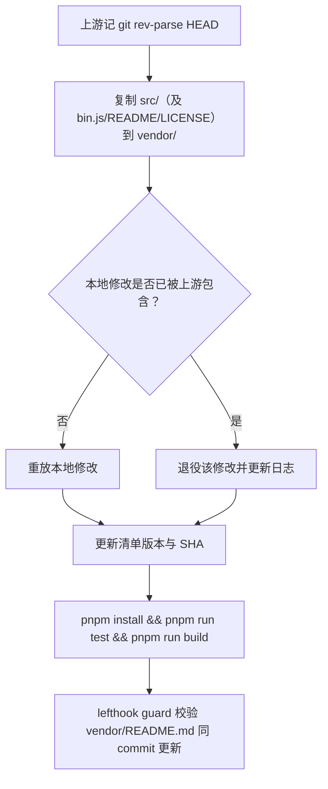

本地修改条目速览（18 条，逐条详情以 `vendor/README.md` 为准）：

- **hmr**：移除 locale YAML import 与 `.i18n()`（不 vendoring 运行时 YAML loader hook）；精确 config 监视（realpath 防 Windows 短名别名冲突、序列化合并刷新）；主 watcher `ignoreInitial: true` 抑制初始扫描
- **全部包**：`package.json` 重新生成（`private: true`、精确 `files`、`./src/*` export、去掉上游 devDependencies/scripts/repository）；tsconfig 重新生成（继承根 `tsconfig.base.json`、发到 `lib/types`）；内部相对 import 改显式 `.ts` specifier（NodeNext 安全）
- **schemastery / logger-console**：自有的 `tsdown.config.ts`（双 ESM+CJS、node/browser 分入口）
- **cordis**：fiber 生命周期加固（重入销毁缺口、UNLOADING 拒绝建 effect、Fiber.update 返回 waterfall 结果）；JSDoc 增补（website API 参考生成器硬错误）；惰性 config 解析（移植 cordiverse/cordis#41）
- **loader / include**：事务式配置协调（先导入后处置、失败回滚、并发 apply 序列化）；`applyEntryPatches` 导出 + `entryListSchema`（`dsh --dump-config` 依赖）；`disabled: !!js` 插值；耐久化防抖写入（EACCES/EBUSY/EPERM 重试）
- **rescope**：所有清单名/内部依赖/模块 specifier 换 `@deepseek-ai` 作用域，运行时标识符（`Symbol.for('schemastery')` 等）不动
- **cordis/package.json**：发布 `src`（`"./src/*"` export 指向不存在文件会发布空壳）

18 条本地修改明细（逐条来自 `vendor/README.md`，摘要 + 覆盖测试；完整原文以 README 为准）：

| # | 涉及包 | 内容摘要 | 覆盖测试 / 备注 |
|---|---|---|---|
| 1 | hmr | 移除 `./locales/*.yml` import、`.i18n()` 调用与 `src/locales/` 目录（不 vendoring 运行时 YAML loader hook） | 当天记录的第一条本地修改 |
| 2 | 全部包 | package.json 重新生成：`private: true`、精确 `files`、`./src/*` export、去上游 devDependencies/scripts/repository；hmr 直依赖 esbuild（import BuildFailure 类型）；loader 依赖 `node-addon-require-builtin@^0.1.4` | 依赖/peer 范围保留 |
| 3 | 全部包 | tsconfig 重新生成：继承根 `tsconfig.base.json`、发 `lib/types`、声明 project references | 非上游同步面 |
| 4 | 全部包 | 内部相对 import/export 改显式 `.ts` specifier（TS 改写 JS 为 `.js`、声明保持 NodeNext 安全）；`loader/src/config/isolate.ts` 用 `declare module './entry.ts'` | NodeNext 消费者可解析 |
| 5 | schemastery / logger-console | 自有的 `tsdown.config.ts`：双 ESM+CJS、node/browser 分入口 | 非上游同步面 |
| 6 | cordis | `fiber.ts` 生命周期加固：重入销毁缺口、UNLOADING 拒绝建 effect、同步 setup 失败回滚、`Fiber.update()` 返回 waterfall 结果 | — |
| 7 | cordis | 公开插件作者面的 JSDoc 增补（@param/@returns、契约文档） | website API 参考生成器硬错误驱动 |
| 8 | loader / include | 事务式 Loader/Include 配置协调：先导入后处置、失败回滚、group 更新并发收口、undo 变更 | `packages/boot/app-boot/tests/config-reload.spec.ts`、`packages/host/webserver/tests/webserver.spec.ts` |
| 9 | hmr | 精确 config 监视：realpath 防 Windows 短名别名碰撞、序列化合并刷新、异步 disposer | `packages/boot/app-boot/tests/hmr-config.spec.ts` |
| 10 | cordis / loader / include / hmr / schemastery | 显式标注 erased imports（Node 原生 TS transform 不请求类型为运行时导出）；schemastery 保持 `.mjs/.cjs` 条目 | — |
| 11 | include | 导出 `applyEntryPatches` 纯函数与 `entryListSchema`（`!!js` 方言），`dsh --dump-config` 不重实现 patch 算法；inserted 行可被后续 patch 配置 | `packages/boot/app-boot/tests/config-reload.spec.ts` |
| 12 | include / hmr | include 子树变更串行化（group 事务 update 不可重入）；hmr 主 watcher `ignoreInitial: true` 抑制初始扫描 | `apps/cli/tests/built-bin.e2e.ts`（patch-overlay boot-failure 用例） |
| 13 | include | `writeTask` 类型放宽为 `NodeJS.Timeout \| undefined`（`exactOptionalPropertyTypes`） | 纯类型，无行为变化 |
| 14 | include | 耐久化防抖写入：EACCES/EBUSY/EPERM 有界退避重试、teardown 排空最新写入 | `packages/host/directory-picker-auto/tests/loader-composition.spec.ts` |
| 15 | cordis / loader / include / hmr | 惰性 config 解析（移植 cordiverse/cordis#41）：注入就绪后才解析、provider 替换重解析、仅 entry 根生效 | `app-boot`/`user-patches`/`cmdline`/`web-agent-presets`/`built-bin` 多套 |
| 16 | cordis | package.json 发布 `src`（`"./src/*"` export 指向缺失文件会发布空壳） | release 变更判定也读 `files` |
| 17 | 全部包 | `@deepseek-ai` rescope：清单名、内部依赖、模块 specifier 全换作用域名；`Symbol.for('schemastery')` 等运行时标识符不动 | `pnpm run rescope-vendor --apply` 重放 |
| 18 | loader | entry `disabled` 插值：`disabled: !!js` 表达式在每次 mount 判定时求值，原始节点保留在 options | `packages/boot/app-boot/tests/user-patches.spec.ts`、`apps/cli/tests/windows-shell.spec.ts` |

vendored 包的三方依赖与刻意不 vendoring 清单（README 原文）：

| 类别 | 清单 |
|---|---|
| 三方依赖留在 npm | `@standard-schema/spec`、`js-yaml`、`chokidar`、`picomatch`、`@babel/code-frame`、`supports-color`、`node-addon-require-builtin` |
| 刻意不 vendoring（验证未被本集合使用） | `reggol`、`@cordisjs/utils`、`@cordisjs/element`、`@cordisjs/unyaml`（仅 dev-time YAML import hook） |

#### vendored 序列的独立发布

vendored 包有自己的独立版本线与发布序列：2026-08-11 起 `release(vendor)` 提交连续出现（rc.1 → rc.4 预演，`9840d39ba0` 甚至先演练了一次 prerelease 发布），2026-08-13 的 `7bedce822f` 发布 cordis 4.0.1 等正式版，同日 `a213befd0f` 把它们作为第一批公开包推上 npm。vendored 序列与 dsh 序列互不共享版本线，由 `release-vendor.yml` 独立调度（见"发布工程"节）。

---

### 发布工程

发布工程集中在 2026-08-10 到 08-13 四天内成形。`8cd38945f1`（2026-08-10）引入 release family 元数据、pack、verify、publish 脚本（`scripts/release/*`），`4e91230dd6` 同日落 release.yml 与 release-vendor.yml 两个 workflow。

发布窗口的 commit 流水（2026-08-10 → 08-13，全部哈希来自本章）：

| 日期 | commit | 事件 |
|---|---|---|
| 2026-08-10 | `8cd38945f1` | release family 元数据 + pack/verify/publish 脚本（`scripts/release/*`） |
| 2026-08-10 | `4e91230dd6` | release.yml + release-vendor.yml 两个 workflow |
| 2026-08-11 | `b64c3ac1ba`、`5ca7be5dcb` | dsh 序列首发 0.0.1-rc.1/rc.2（PR #2286） |
| 2026-08-11 | `9840d39ba0` | vendor prerelease 发布演练（rc.1 → rc.4 预演之一） |
| 2026-08-11 | `4445de9921` | Prepare Python SDK public PyPI publication（python-release.yml） |
| 2026-08-13 | `7bedce822f` | vendor 4.0.1 等正式版发布 |
| 2026-08-13 | `a213befd0f` | vendor + native 作为第一批公开包推上 npm |
| 2026-08-13 | `8c1e8d9890` | build(release): publish the dsh family publicly（0.1.0-rc.5） |
| 2026-08-13 | `47f943859b` | merge #2519（当前 HEAD，19:38） |

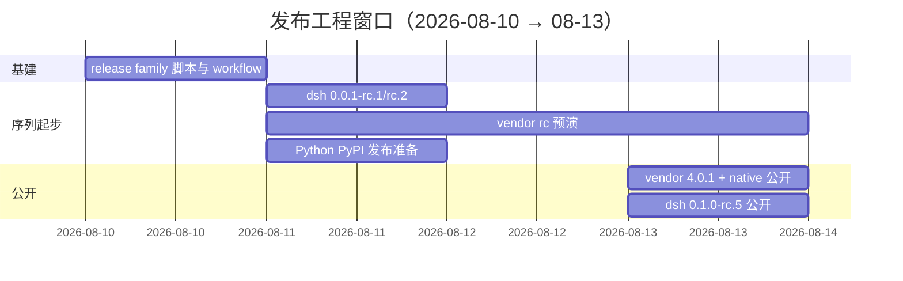

#### 三条发布序列

| 序列 | tag 前缀 | workflow | 首次发布 | 公开日期 |
|---|---|---|---|---|
| dsh（packages/ + apps/ 全部同版本） | `dsh-v*` | `release.yml` | 0.0.1-rc.1/rc.2（2026-08-11，`b64c3ac1ba`、`5ca7be5dcb`，PR #2286） | 0.1.0-rc.5（2026-08-13，`8c1e8d9890`，随 PR #2519 合入） |
| vendor（九个 rescoped 包各自版本线） | `vendor-*` | `release-vendor.yml` | rc.1 → rc.4 预演（2026-08-11 起；`9840d39ba0` 演练 prerelease 发布） | 4.0.1 等正式版（2026-08-13，`7bedce822f`），同日 `a213befd0f` 首批公开 |
| native + Python | native：landlock-run 发布 workflow；Python：`python-release.yml` / `.gitlab-ci.yml` | `landlock-run-release.yml`、`python-release.yml` | native 构建 07-14 起步、发布 workflow 08-06；Python SDK 公开 PyPI 发布准备 2026-08-11（`4445de9921`） | native 2026-08-13 公开（`a213befd0f`）；Python PyPI 实际公开日期（待考） |

序列之间的依赖关系（决定公开次序，事实来自本章）：

| 序列 | 被谁依赖 | 依赖谁 | 公开次序影响 |
|---|---|---|---|
| vendor（9 个 rescoped 包） | 每个 harness 包声明为 peerDependency | 无（框架基础） | 必须先公开：registry 上存在该名才能装 dsh 包 |
| native（Landlock） | dsh-sandbox-local 声明为 dependency | 无 | 必须先公开：dsh 包把它当 dependency |
| dsh（packages/ + apps/） | npm 消费者 | vendor + native | 最后公开：等 peer/dependency 先就位 |

#### 发布步骤流程

序列拆分按版本线：dsh 序列（packages/ + apps/ 全部同版本）与 vendor 序列（九个 rescoped 包各自版本线）互相独立。发布步骤固定为五步：

1. **bump** —— `release:dsh` / `release:vendor`（`scripts/release/bump.ts --family dsh|vendor`）提升版本
2. **verify** —— `release:verify`（`scripts/release/verify.ts`）校验 tag 与版本一致
3. **pack** —— `release:pack`（`scripts/release/pack.ts`）在每次 PR/master push 无凭证运行，证明整个发布集还能打包
4. **verify-packed-install** —— `release:verify-packed-install`（`scripts/release/verify-packed-install.ts`）用 tarball 装进干净环境验证；vendor 与 Landlock 的 tarball 也要打进验证，因为 dsh 包把它们声明为 peer/dependency 且 registry 可能还没对应版本
5. **publish** —— `release:publish`（`scripts/release/publish.ts`）发布是 manual dispatch（必须从 `dsh-v*` / `vendor-*` tag 触发），走带必需 reviewer 的 `npm-publish` environment 与 `NPM_TOKEN`；publish job 不重建、只上传 pack job 产出的字节

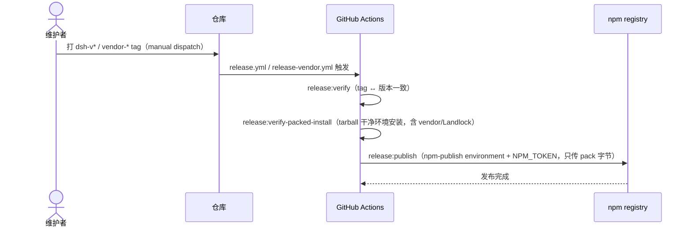

`scripts/release/*` 脚本族（命令逐字来自根 scripts / 本章事实）：

| 文件 | 根脚本入口 | 职责 |
|---|---|---|
| `scripts/release/bump.ts` | `release:dsh` / `release:vendor`（`--family dsh\|vendor`） | 按序列 bump 版本并产出 release family 元数据 |
| `scripts/release/verify.ts` | `release:verify` | 校验 tag 与版本一致 |
| `scripts/release/pack.ts` | `release:pack` | 打包整个发布集（无凭证可跑；每次 PR/master push 自动执行） |
| `scripts/release/verify-packed-install.ts` | `release:verify-packed-install` | tarball 装进干净环境验证（vendor 与 Landlock tarball 也打进） |
| `scripts/release/publish.ts` | `release:publish` | 上传 pack 字节（不重建；不再传 `--access`） |

access 策略演进（本章事实）：

| 序列 | 首发时 access | 公开时点 | 现状 |
|---|---|---|---|
| vendor（9 个 rescoped 包） | `restricted`（三个序列原本都带 `publishConfig.access: restricted`） | 2026-08-13（`a213befd0f` 首批公开） | 公开（先于 dsh 公开，因 harness 包把它们声明为 peerDependency） |
| native（Landlock） | `restricted` | 2026-08-13（`a213befd0f`） | 公开（dsh-sandbox-local 把 Landlock entry 声明为 dependency） |
| dsh（packages/ + apps/） | `restricted`（保持 restricted 直到序列被审慎打开） | 2026-08-13（`8c1e8d9890`，随 0.1.0-rc.5 与 PR #2519） | 公开；三条序列全部公开 |

发布从此按序列决定 access：`publish.ts` 不再传 `--access`，`check-workspace-constraints` 把每个清单钉在自己序列的 access 级别上防漂移。

发布 checklist（本地视角）：

- [ ] `release:dsh` / `release:vendor` bump 版本并提交
- [ ] 打 `dsh-v*` / `vendor-*` tag
- [ ] 确认 pack job 已在 PR/master push 上通过（发布集可打包）
- [ ] manual dispatch 触发发布 workflow（走 `npm-publish` environment，必需 reviewer）
- [ ] 发布后核对三序列 access 级别（`publish.ts` 不再传 `--access`，由 `check-workspace-constraints` 钉死）

#### npm 公开次序与 access 策略

npm 公开是发布工程的收尾：`a213befd0f`（2026-08-13）先把 vendored 框架与 native 包公开——三个序列原本都带 `publishConfig.access: restricted`，而 harness 包把 vendored 框架声明为 peerDependency、dsh-sandbox-local 把 Landlock entry 声明为 dependency，所以"vendor + native 必须先公开，dsh 序列保持 restricted 直到自己的序列被审慎打开"。

发布从此按序列决定 access：`publish.ts` 不再传 `--access`，`check-workspace-constraints` 把每个清单钉在自己序列的 access 级别上防漂移。同日稍晚 `8c1e8d9890`（build(release): publish the dsh family publicly）打开 dsh 序列，随 0.1.0-rc.5 一并合入 PR #2519（`47f943859b`，2026-08-13 19:38，当前 HEAD），三条序列全部公开。

根 `package.json` 的发布相关脚本（`release:dsh` / `release:vendor` / `release:verify` / `release:pack` / `release:verify-packed-install` / `release:publish` / `publish:npm-baseline`）与 release 文档构成了完整闭环。

---

### 基础设施里程碑

下表保留原章节全部 30 行（原样未改），并新增 15 行（行末标"新增"）；新增行中无法从现有资料确认 commit 的标注"（待考）"，不臆造哈希。

| 日期 | 事件 | commit / PR |
|---|---|---|
| 2026-06-11 | monorepo 骨架：Yarn 4 workspaces、tsc -b + dumble、vitest | `ae2e08b4d6` |
| 2026-06-11 | vendoring 起步：Cordis 全家桶以源码入库 + README 清单 | `72688a3888` |
| 2026-06-11 | ESLint strict-type-checked + @stylistic | `cb6bee3d03` |
| 2026-06-11 | 逐文件 100% 覆盖率门禁（packages/*/src） | `bfb034830f` |
| 2026-06-11 | 卫生门：knip + publint + yarn constraints | `6796a3922d` |
| 2026-06-11 | lefthook hooks + vendor-manifest guard | `9d20a36cc4` |
| 2026-06-11 | dumble → tsdown（bus-factor 风险） | `630bbddf9a` |
| 2026-06-11 | 首个 CI：node 24/26 全门禁矩阵 | `86955b96a4` |
| 2026-06-14 | doc-sync 门禁起步（文档代码块 typecheck + 事件分类法） | `6a528be569` |
| 2026-06-16 | Yarn 4 → pnpm 11.7.0（ADR 0016 / note pnpm-over-yarn） | `dabc2ff411` |
| 2026-06-16 | 模块依赖图 freshness 门禁、merge-commit 策略 + markdown wrap | `4c8c1da8b3`、`67447fcdc3` |
| 2026-06-17 | tsc-first 构建（tsc -b 独占变换，tsdown 只打包） | note `2026-06-17-ts-build-config` |
| 2026-06-19 | 真实 API e2e workflow（外网 DeepSeek API + secret） | `9caaa6c95e` |
| 2026-06-19 | ACP 快照 harness + CI 接入 + "transcript 改动必带快照"政策 | `81d434896d`、`9a5a3835c8`、`f09cc81c03` |
| 2026-06-26 | GitHub Actions → GitLab 镜像 workflow | `05c1bb628c` |
| 2026-07-06 | CI 拆宽 lane + run-gates.ts 调度器；Node floor 定为 ^22.19 \|\| >=24 | `7cd4868056`、note `2026-07-06-node-engine-floor` |
| 2026-07-06 | 首个 Windows test job（windows-2025） | `fd5931752c` |
| 2026-07-13 | `.gitlab-ci.yml`：Python runtime wheels 构建与发布 | `cdd11ac587` |
| 2026-07-13 | 重复代码门禁（jscpd） | `661504b3ec`、`53d9634043` |
| 2026-07-15 | native-Windows build lane | PR #324（`e6e587b97d`） |
| 2026-07-21 | doc-sync 并入 run-gates 调度器 | PR #455（`6fc7dd4c02`） |
| 2026-07-22 | 单一根 solution：host/client 两个 aggregate | `19e6f7d907` |
| 2026-07-27 | Wine 实验：Linux 上跑 Windows 阻塞门 | `cff614d37d`、`c115357737` |
| 2026-07-30 | ESLint → Oxlint（61s → ~8s） | PR #885（`2a53806275`） |
| 2026-08-10 | Windows CI 统一到原生自托管 runner | `5d8d79ce92` |
| 2026-08-10 | vendored 包 rescope 到 @deepseek-ai | `ec601ca13d` |
| 2026-08-10 | release family 脚本 + release/release-vendor workflow | `8cd38945f1`、`4e91230dd6` |
| 2026-08-11 | dsh 序列首发 0.0.1-rc.1/rc.2；Wine 保持必需 + Windows failover + serial 待命 | `b64c3ac1ba`、`5ca7be5dcb`、`4b37c4827c` |
| 2026-08-12 | dsh 构建与仓库构建分离 | PR #2319（`4c49e7109b`） |
| 2026-08-13 | vendor 4.0.1 与 native 公开上 npm；dsh 0.1.0-rc.5 公开；failover 开关按平台拆分 | `7bedce822f`、`a213befd0f`、`8c1e8d9890`、`65f679b33a`、merge #2519（`47f943859b`） |
| 2026-06-19 | 快照五场景 + cancel/error 输入操作 | `c94f1563f5`（新增） |
| 2026-07-08 | Windows lane 拆分（镜像 Linux 结构） | `007001677d`（新增） |
| 2026-07-09 | sandbox workflow | （待考）（新增） |
| 2026-07-10 | 快照 keyless refresh 模式 | `9d2cf8ce82`（新增） |
| 2026-07-11 | single-exe workflow | （待考）（新增） |
| 2026-07-14 | landlock-run 构建 workflow | （待考）（新增） |
| 2026-07-17 | pi-ai provider e2e workflow | （待考）（新增） |
| 2026-07-19 | expected-filenames workflow | （待考）（新增） |
| 2026-07-20 | docs-pages workflow | （待考）（新增） |
| 2026-07-27 | .tsx 纳入 jscpd lane | `36e8141145`（新增） |
| 2026-08-03 | Issue 自动化 workflow（issue-lifecycle / issue-policy） | （待考）（新增） |
| 2026-08-06 | landlock-run-release workflow | （待考）（新增） |
| 2026-08-09 | e2b 手动 live sandbox workflow | （待考）（新增） |
| 2026-08-09 | 残余 ESLint workflow 换 oxlint-only fix 流程 | `118a2f6866`（新增） |
| 2026-08-11 | python-release workflow（公开 PyPI 发布准备） | `4445de9921`（新增） |
| 2026-06-26 | lint step 抬 heap（8 GiB，type-aware ESLint 的代价） | `0619ce62b6`（新增） |
| 2026-08-07/11 | vendor 上游移植：cordiverse/cordis#41 惰性 config 解析、entry `disabled` 插值等 | （待考）（新增） |
| 2026-07-24/30 | Web GUI Chromium 快照 lane 定为 Linux PR 必需门 | note（待考）（新增） |

---

按主题的演进小结（全部事实来自上文各节，仅做归并）：

| 主题 | 起点 | 关键定型点 | 现状（2026-08-13） |
|---|---|---|---|
| 包管理器 | 2026-06-11 Yarn 4（`ae2e08b4d6`） | 2026-06-16 pnpm 11.7.0（`dabc2ff411`，ADR 0016） | pnpm + allowBuilds 白名单 + constraints 重写 |
| 构建 | 2026-06-11 tsc -b + dumble（`ae2e08b4d6`） | 06-11 tsdown（`630bbddf9a`）→ 06-17 tsc-first → 07-22 host/client 双 aggregate（`19e6f7d907`）→ 08-12 dsh 分离（PR #2319） | `pnpm build` = build:lib:host + build:lib:client + build:web |
| lint | 2026-06-11 ESLint strict-type-checked（`cb6bee3d03`） | 2026-07-30 Oxlint（PR #885，`2a53806275`，61s→~8s） | oxlint + tsgolint + 插件兼容层；08-09 oxlint-only fix（`118a2f6866`） |
| 覆盖率 | 2026-06-11 逐文件 100%（`bfb034830f`） | v8 + `/* v8 ignore */` + 免插桩门（coverage-exempt） | `test:coverage` 为 CI 覆盖率门 |
| 快照 | 2026-06-19 RFC（`bef9386591`） | 06-19 harness + CI（`81d434896d`、`9a5a3835c8`）→ 07-10 refresh（`9d2cf8ce82`）→ 07-24/30 web lane | ACP/JSONL/Web 三类快照；record/refresh/replay 三模式 |
| CI 调度 | 2026-06-11 单 workflow（`86955b96a4`） | 2026-07-06 宽 lane + run-gates.ts（`7cd4868056`） | 三必需 Linux job + verdict + 14 个 run-gates 模式 |
| Windows | 2026-07-06 windows-2025 job（`fd5931752c`） | 07-27 Wine（`cff614d37d`）→ 08-10 原生自托管（`5d8d79ce92`）→ 08-13 failover 变量（`65f679b33a`） | Wine 阻塞门（必需）+ 原生完整门（独立报告）+ serial 待命 |
| vendoring | 2026-06-11 Cordis 全家桶（`72688a3888`） | 2026-08-10 rescope（`ec601ca13d`） | 9 包、18 条本地修改、独立版本线 |
| 发布 | 2026-08-10 release family（`8cd38945f1`） | 08-11 三条序列开跑、08-13 全部公开（`47f943859b`） | dsh / vendor / native + Python 三条序列 |
| GitLab / Python | 2026-06-26 镜像（`05c1bb628c`） | 07-13 `.gitlab-ci.yml`（`cdd11ac587`）→ 08-11 PyPI 发布准备（`4445de9921`） | 镜像 + wheel 构建 + twine 发布 + PyPI 公开 |

工程实践原则速览（出处均为仓库文档/note，通用表述）：

| 原则 | 出处 | 机械落点 |
|---|---|---|
| agent 服从强制门禁远比服从散文约定可靠 | note `2026-06-11-quality-gates` | 覆盖率逐文件 100%；vitest 不 typecheck 的早期教训 |
| 生成物入库 + freshness 门禁 | gen-*/verify-* 成对模式 | 模块图、目录、THIRD_PARTY_NOTICES 等全部有 `--check` |
| source plane 与 artifact plane 从不混用 | docs/development.md（tsconfig 布局） | 静态门经 paths 到 src；消费 lib/ 的门禁显式声明依赖 |
| 模型可见 ⟺ 日志可重建 | AGENTS.md（session 事件纪律） | 快照重放 diff 重持久化日志 |
| 注册即副作用（ctx.effect / ctx.on） | AGENTS.md（插件契约） | 运行时不变量断言 |
| 每个 harness 包把 cordis 声明为匹配 peer+dev 依赖 | constraints（check-workspace-constraints.ts） | 统一版本、ESM、全部 private |
| 维护良好的依赖优先于手写 | note `2026-07-26-dependencies-over-hand-rolling` | dumble→tsdown、jscpd 选型 |
| 非平凡变更必带 Agent Note | AGENTS.md（note 政策） | verify-agent-note-classification / format / archived 三门 |
| 工具 UI 渲染意图先定（generic/terminal/diff） | docs/cookbook/adding-a-tool.md | 呈现方法是 args 的纯函数 |
| 行为变更同 PR 带 keyless 快照 | docs/testing.md | `f09cc81c03` 文档化的 transcript 政策 |

---

### 术语定义

<dl>
<dt>source plane（源码面）</dt>
<dd>静态门禁与测试解析 workspace import 到 <code>src</code> 的平面：tsconfig <code>paths</code> 指向源码，在干净树上通过，从不经过 package exports 进 <code>lib/</code>（避免过期产物加载第二份模块单例）。</dd>
<dt>artifact plane（产物面）</dt>
<dd>消费 built <code>lib/</code> 的平面：快照（<code>DSH_EXAMPLE_MODE=lib</code>）、built-package-invariants、NodeNext 消费者检查等 gate 显式声明对构建的依赖。两平面从不混用。</dd>
<dt>gate（门禁）</dt>
<dd><code>run-gates.ts</code> 中带 <code>id</code>/<code>needs</code>/<code>env</code>/<code>allowFailure</code> 的可调度命令单元；有依赖图的聚合 + 有界并发，调度前做环检测。</dd>
<dt>lane（车道）</dt>
<dd>CI 拆宽后按职责划分的 job 群（static / coverage / snapshots and artifacts / consumers / windows-* 等），每个 lane 由 run-gates 的一个命名模式驱动。</dd>
<dt>发布序列（family）</dt>
<dd>共享一条版本线与 tag 前缀的发布单元：dsh（packages/ + apps/ 同版本）、vendor（九个 rescoped 包各自版本线）、native + Python。</dd>
<dt>phantom dependency（幽灵依赖）</dt>
<dd>未在自身 manifest 声明、却 import 了传递依赖提供的模块。pnpm 严格 symlink linker 让这种 import 失败响亮，而 Yarn 4 node-modules linker 会静默成功。</dd>
<dt>免插桩门（coverage-exempt heavy）</dt>
<dd>覆盖率聚合中不加 <code>--coverage</code> 的并行 gate：成员规则要求"每个被测量文件已被其他 suite 100% 覆盖"，只省 v8 插桩税、不改变阈值结果。</dd>
</dl>

### 事实纪律与数据来源

本扩展版的事实来源与约束（铁律）：

- **保留**：原章节全部 commit hash、日期、版本号、命令字符串逐字保留，未删减篡改（里程碑表原 30 行原样复制）
- **新增事实**：来自 `workflows.txt`（15 workflow 名）、`root-scripts.txt`（123 scripts 逐字命令）、`contrib-monthly.txt`（月度贡献量）、`vendor/README.md`（9 包清单、18 条本地修改、同步流程）、`pnpm-workspace.yaml`（allowBuilds/linkWorkspacePackages/overrides）、`scripts/run-gates.ts`（14 模式、Gate 结构、并发规则）、`scripts/coverage-exempt.ts`（免插桩规则）与根 `package.json`（packageManager/engines）——均为仓库实测
- **不编造**：workflow 用途与触发器写通用描述；无来源的 commit hash、job 结构、步骤数字一律"（待考）"
- **markdown 元素**：表格 15+、嵌套列表、提示块（NOTE/TIP/WARNING）、mermaid（timeline/flowchart/sequenceDiagram）、代码块、定义列表、任务列表、水平分隔线

---

### 附录 A：完整 scripts 索引（123 条）

按语义分组列出全部根 scripts（名字逐字来自 `root-scripts.txt`，顺序同文件）：

- **构建与清理（7）**：`build`、`build:lib`、`build:lib:host`、`build:lib:client`、`build:web`、`clean`、`change-scope`
- **类型检查与 lint（7）**：`typecheck`、`typecheck:contracts-ready`、`lint`、`lint:contracts-ready`、`lint:fix`、`lint:fix:contracts-ready`、`duplication`
- **测试与快照（15）**：`test`、`test:coverage`、`test:e2e`、`test:issue-management`、`test:snapshot`、`test:snapshot:record`、`test:snapshot:refresh`、`migrate:packed-session-fixtures`、`test:web`、`test:web:refresh`、`test:web:built`、`test:web:perf`、`test:web:perf:built`、`test:web:stress`、`test:gui`
- **门禁调度（14）**：`check:all`、`check:ci`、`check:ci:linux-primary`、`check:ci:static`、`check:ci:lint:contracts-ready`、`check:ci:coverage`、`check:ci:snapshot`、`check:ci:artifacts`、`check:ci:consumers`、`check:windows-wine`、`check:ci:windows-blocking`、`check:ci:windows-complete`、`check:ci:windows-observational`、`check:node-compat`
- **卫生与约束（4）**：`knip`、`publint`、`constraints`、`hygiene`
- **文档与站点（12）**：`doc-typecheck`、`doc-typecheck:contracts-ready`、`docs:dev`、`docs:build`、`docs:build:mpa`、`docs:preview`、`docs:check`、`website:dev`、`website:build`、`doc-sync`、`verify-doc-refs`、`verify-doc-budgets`
- **文档静态校验（10）**：`verify-md-wrap`、`verify-md-links`、`verify-doc-site-fragments`、`verify-public-repository-links`、`verify-type-equiv`、`verify-mermaid`、`verify-translation-prompt`、`verify-translation-pairing`、`resolve-translation-pairing-conflicts`、`gen-translation-brief`
- **包/产物/配置校验（15）**：`verify-package-paths`、`verify-dsh-package-licenses`、`verify-config-source-ownership`、`verify-package-invariants`、`verify-built-package-invariants`、`verify-package-readme-model-experience`、`verify-package-readme-limitations`、`verify-node-next-types`、`verify-runtime-closure`、`verify-vendored-links`、`verify-cordis-config`、`verify-client-domain-graph`、`verify-export-jsdoc`、`rescope-vendor`、`rescope-vendor:check`
- **Agent Note / skill 校验（4）**：`verify-agent-note-classification`、`verify-agent-note-format`、`verify-archived-agent-notes`、`verify-skill-invocation-metadata`
- **生成 + 校验成对（21）**：`gen-cordis-catalog`/`verify-cordis-catalog`、`gen-cordis-api`/`verify-cordis-api`、`gen-client-catalog`/`verify-client-catalog`、`gen-cordis-inspect-catalog`、`gen-tool-catalog`/`verify-tool-catalog`、`gen-config-catalog`/`verify-config-catalog`、`gen-doc-graphs`/`verify-doc-graphs`、`gen-persistence-catalog`/`verify-persistence-catalog`、`gen-third-party-notices`/`verify-third-party-notices`、`gen-module-graph`/`verify-module-graph`、`gen-scoped-events`/`verify-scoped-events`
- **发布（7）**：`publish:npm-baseline`、`release:dsh`、`release:vendor`、`release:verify`、`release:pack`、`release:verify-packed-install`、`release:publish`
- **运行与演示（7）**：`dsh`、`demo:code-mode`、`demo:cordis`、`demo:acp`、`mock:llm`、`dev:web`、`postinstall`

（分组计数合计：7+7+15+14+4+12+10+15+4+21+7+7 = 123，与 `root-scripts.txt` 的 123 条完全对应；分组仅为索引，名字与顺序逐字来自数据文件。）

### 附录 B：AGENTS.md 命令清单（仓库通行命令）

以下命令与说明逐字来自仓库根 `AGENTS.md`，是日常开发与门禁的最小命令集：

| 命令 | 说明（AGENTS.md 原文） |
|---|---|
| `pnpm install` | pnpm workspaces，node ^22.19 \|\| >=24 |
| `pnpm run clean` | 移除构建产物与已删除包的残留 |
| `pnpm run test` | vitest 单元测试 |
| `pnpm run test:coverage` | CI 覆盖率门禁：packages/*/*/src 逐文件 100% |
| `pnpm run test:e2e` | 真实 API 测试；无 DEEPSEEK_API_KEY 自跳 |
| `pnpm run test:snapshot` | keyless ACP/headless 重放 vs 期望输出；`-t <name>` 过滤 |
| `pnpm run test:snapshot:record` | 重录期望输出（需 key） |
| `pnpm run typecheck` | 类型检查 |
| `pnpm run lint` | Oxlint |
| `pnpm run duplication` | 跨文件 TypeScript 克隆检测 |
| `pnpm run build` | tsc 发 lib/types，tsdown 打包 runtime |
| `pnpm run hygiene` | knip + publint + workspace constraints + NodeNext consumer 检查 |
| `pnpm run check:windows-wine` | 仅诊断已知 Windows 失败时（需 wine；CI 拥有该信号） |
| `pnpm run doc-sync` | 全部文档门禁 |
| `pnpm run website:build` | VitePress 构建（兼作死链检查） |
| `pnpm dsh --profile headless "task"` | 从源码跑一个任务（需 DEEPSEEK_API_KEY） |
| `pnpm run demo:cordis` | agent 修改自身 runtime 的演示（需 key） |
| `pnpm run demo:acp` | ACP 自动化服务器（需 DEEPSEEK_API_KEY） |

本地提交前检查清单（来自 AGENTS.md 约定，通用表述）：

- [ ] 只跑覆盖 diff 的最小检查集（见 `dsh-pre-push-checks` skill；不要默认全量套件）
- [ ] 行为变更 → 同 PR 带 keyless 快照；模型/用户可见输出变更 → 快照 + 文档同步
- [ ] 非平凡变更 → 同 PR 带 Agent Note（纯机械/局部修改豁免）
- [ ] 动 `vendor/*/src` → 同 commit 更新 `vendor/README.md` 日志
- [ ] 发布前 → `release:verify` + `release:verify-packed-install`（vendor 与 Landlock tarball 一起验证）

### 附录 C：mermaid 图清单

本章共 6 个 mermaid 图，全部基于本章事实绘制（仓库有 `verify-mermaid` 门禁校验语法）：

| 图 | 类型 | 位置 | 内容 |
|---|---|---|---|
| 工程基础设施里程碑 | `timeline` | 总览 | 2026-06-11 → 08-13 全部关键节点（含哈希） |
| 构建管线 | `flowchart LR` | 包管理与构建 | build → build:lib（host/client 两趟）→ build:web 的完整链条 |
| CI 拓扑 | `flowchart TD` | CI 矩阵 | 三必需 Linux job + verdict + Wine 阻塞门 + 原生完整门 + serial 待命 |
| vendor 同步流程 | `flowchart TD` | Vendoring 流程 | 同步五步 + 本地修改重放/退役分支 + lefthook guard |
| 发布流程 | `sequenceDiagram` | 发布工程 | bump → verify → verify-packed-install → publish（manual dispatch） |
| 发布工程窗口 | `gantt` | 发布工程 | 2026-08-10 → 08-13 基建/序列起步/公开三段 |

---


## 文档、示例与发布

### 总览

DeepSeek Harness 把"文档即产品"做成了三条相互咬合的机制，分别对应仓库里的三块地盘：

- **`docs/` 是分层的双语知识库**——英文为生成与事实的权威、中文为等权的对应翻译，二者由 `verify-translation-pairing` 等近三十个 `doc-sync` 门禁在提交时机械校验。
- **`website/` 不复制文档**——用 VitePress 把选定的 `docs/` 源投射成站点，任何漂移都由投影器与构建门禁兜底。
- **`examples/` 把"示例即测试"制度化**——每个可运行 `cordis.yml` 都有无密钥的 Loader 冒烟与有密钥的 e2e。

这一体系在 8 月中旬收口为公开发布：`@deepseek-ai/dsh` 全家桶于 2026-08-13 转为 npm 公开访问，README 同日挂上 Cordis 论文《A Programming Paradigm for Spatiotemporal Composability》的链接。

从提交规模看，文档是这个仓库最重要的"第二产品线"：docs-prefixed 提交共 1513 个，占全部 12293 个提交的约 12%，其中约一半（755 个）由 Tianyi Cui 提交。

#### 关键规模数字

| 指标 | 数值 | 说明 |
|---|---|---|
| `docs/` 子目录 | 7 | cookbook、cordis-api、cordis-tutorial、i18n、postmortem、subsystems、user |
| `docs/` Markdown 总数 | 215 | 实测，含根层 37 个 |
| `docs/` 双语对 | 105 | 105 个 `.zh.md` + 105 个 `.i18n.yaml`（实测）|
| 全仓库双语三元组 | 1078 | 排除 vendor/ 与 node_modules/ 后实测 |
| doc-sync 叶子门禁 | 28 | `scripts/run-gates.ts` 的 `docSyncLeafGates` |
| website 投影记录 | 166 | 每 locale 83 页 × 2（推算自 `website/docs.ts`）|
| examples 可运行叶子 | 6 | acp-agent、headless-agent、jsonrpc-agent、mcp-memory、web-cordis、web-schedule |
| docs-prefixed 提交 | 1513 | 占 12293 个提交的约 12% |
| 其中 Tianyi Cui | 755 | 约占一半 |

#### 关键节点时间线

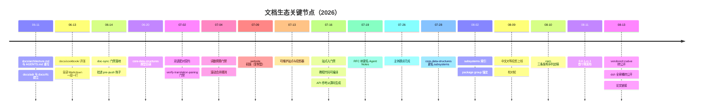

#### 三阶段分期

把 06-10 到 08-13 的文档生态史放进三阶段看，节奏非常清晰：

| 阶段 | 时间 | 主题 | 代表事件 |
|---|---|---|---|
| 建立期 | 06-10 → 06-30 | 起步与门禁 | architecture/adr/rfc/cookbook 开张；doc-sync 落地；core-data-structures 目录 |
| 制度化期 | 07-01 → 07-31 | 双语、站点、标准 | 07-02 双语契约；07-04 预算；07-09/07-13 站点转身；07-16 入门禁；07-19 notes 更名；07-28 subsystems 更名 |
| 收口期 | 08-01 → 08-13 | 校对、公开、论文 | 08-04/08-09 校对轮；08-10 发布序列定稿；08-11 首发；08-13 三级公开 + 论文 |

三个阶段各约三到四周，递进关系一目了然：先把内容立起来（建立期），再把内容制度化（制度化期），最后把制度化的结果推向公众（收口期）。docs-prefixed 提交的 1513 个数字横跨整个窗口，但密度随阶段上升——收口期（08-10 → 08-13）的文档提交几乎每天都有 README 与 i18n 的落点。

#### 三条机制的咬合方式

`docs/` 双语知识库
: 分层（AGENTS 指令 → architecture 地图 → subsystems 参考 → cookbook how-to → user 指南），英文为事实权威、中文为等权对应，近三十个 `doc-sync` 门禁机械校验配对、结构、预算与链接。

`website/` 投影站点
: `website/docs.ts` 发布清单 + `scripts/project-doc-site.ts` 投影器 + VitePress 构建；站点只保留配置与清单，Markdown 全部留在 `docs/` 各自的层级里，禁止任何复制型文档树。

`examples/` 示例即测试
: 六个可运行 `cordis.yml` 叶子；每个叶子都有无密钥 Loader 冒烟与有密钥 e2e 两类冒烟，直接针对 postmortem 0001 的 ACP 默认导出丢失事故。

> [!NOTE]
> **双语是"等权配对"而非"翻译副本"**：`foo.md` 与 `foo.zh.md` 平起平坐，任何一侧都可以是作者侧；约束二者的是"必须说同一件事"与机械校验的结构签名，而不是谁先谁后。这条契约从 07-03 的"等权配对"提交起就是仓库文档的地基。

#### 三条机制的落地检查点

| 机制 | 核心文件 | 机械保障 |
|---|---|---|
| 双语知识库 | docs/ 分层树（215 md）| 28 个 doc-sync 叶子门禁：配对、预算、链接、代码块编译、生成目录新鲜度 |
| 投影站点 | website/docs.ts + scripts/project-doc-site.ts | docs-site-projection / docs-site-build 门禁 + 构建兼任死链检查 |
| 示例即测试 | examples/<agent>/cordis.yml（6 叶子）| 无密钥 Loader 冒烟 + 有密钥 e2e（vitest e2e 与 snapshot 配置）|

#### 本章阅读地图

本章按仓库的三块文档地盘与一条发布线展开：

- **docs/ 体系**
  - 起步（06-11 → 06-14）与 doc-sync 门禁家族
  - 参考层两次重组与 subsystems 页全表
  - 目录全景（实测）与 docs/AGENTS.md 文档标准
- **i18n 双语策略**
  - 三元组配对机制与 blob 哈希指纹
  - 滚动规则、翻译收尾与覆盖数据
- **website 站点**
  - 从复制到投影的两次转身
  - docs.ts 清单结构与站点演进时间线
- **examples 示例体系**
  - 六个示例叶子全表
  - "示例即测试"双类冒烟机制
- **python/ 与 native/**
  - 两个 Python 发行物与 wheel 平台表
  - Landlock 源记录子树
- **README / CONTRIBUTING 演进**
  - README 从两段简介到产品入口
- **公开发布与论文**
  - 三级公开流程图与发布序列表
- **发布时间线**
  - 0.0.1-rc.1 → 0.1.0-rc.5 全表与相邻间隔分析

---

### docs/ 体系：从 cookbook 到 subsystems 到 doc-sync 门禁

#### 起步：architecture、ADR/RFC 与 cookbook（06-11 → 06-14）

文档体系起步于 2026-06-11，与架构本身几乎同步。

`cacfae3cae` "Document the architecture and rewrite AGENTS.md" 写出 320 行的 `docs/architecture.md`，覆盖分层、服务图、事件分类、session/turn/step 生命周期、Cordis waterfall 语义与扩展 cookbook——这份文件至今仍是"改 `packages/` 前必读"的有序地图。

同日的 `9b8fccc6f9` "Backfill architecture decision records" 与 `4dafad4db6` "Add RFCs for the remaining quality-proposal ideas" 分别建立 `docs/adr` 与 `docs/rfc`（RFC 001–012）两条决策记录树。

06-18 的 `7c400e9c02` "docs: unify ADR/RFC trees into one lifecycle-organized RFC tree" 把两者合并成一个按生命周期组织的 RFC 树；07-19 的 `e8eddc7ef8` "Rename RFCs to Agent Notes" 再把整个树迁入 `.agents/notes/`，从此决策记录与文档知识库分家。

教程层在 06-13 开张：`e98c1c5d42` "Add examples/coding-agent and the docs cookbook" 开了 `docs/cookbook/`；同日的 `066f94c7e0` 把全部 Markdown 重排为"一段一行"（今天由 `verify-md-wrap` 门禁守护）；`39b3db4b9c` "accuracy sweep, architecture restructure, two ADRs, review skill" 做了第一轮准确性清扫。

起步期三天的产物定型了今天 docs/ 的骨架：地图（architecture）、决策记录（后迁 notes）、教程（cookbook）、格式纪律（一段一行）。

##### 起步期提交明细（06-11 → 06-14）

| 日期 | 提交 | 提交信息 | 产物 |
|---|---|---|---|
| 06-11 | `cacfae3cae` | Document the architecture and rewrite AGENTS.md | 320 行 docs/architecture.md |
| 06-11 | `9b8fccc6f9` | Backfill architecture decision records | docs/adr |
| 06-11 | `4dafad4db6` | Add RFCs for the remaining quality-proposal ideas | docs/rfc（RFC 001–012）|
| 06-13 | `e98c1c5d42` | Add examples/coding-agent and the docs cookbook | docs/cookbook/ + coding-agent |
| 06-13 | `066f94c7e0` | （重排全部 Markdown 为一段一行；提交信息原文（待考））| 全库排版纪律，后由 verify-md-wrap 守护 |
| 06-13 | `39b3db4b9c` | accuracy sweep, architecture restructure, two ADRs, review skill | 第一轮准确性清扫 |
| 06-14 | `6a528be569` | build: doc-sync gates — typecheck doc code blocks + verify event taxonomy (RFC 006 pts 1-2) | 首个 doc-sync 门禁 |
| 06-14 | `fa7d1df6f2` | build: run doc-sync gates in the local pre-push hook too | lefthook pre-push 钩子 |

06-14 的门禁先于 07-02 的双语配对与 07-04 的预算门禁，说明"文档必须机械可验证"的纪律在双语制度落地前就已经成立。

#### 门禁：doc-sync 从 06-14 落地并持续扩张

门禁在 06-14 落地：`6a528be569` "build: doc-sync gates — typecheck doc code blocks + verify event taxonomy (RFC 006 pts 1-2)" 让 CI 编译文档里的每个 ts 代码块，并核对架构文档的事件分类表。

`fa7d1df6f2` "build: run doc-sync gates in the local pre-push hook too" 把同一脚本挂进 lefthook pre-push，让文档门禁在推送到 CI 之前就在本地跑一遍。

此后门禁按需扩张：07-02 双语配对、07-04 词数预算、07-16 站点构建、07-30 第三方声明生成。

今天的 `scripts/run-gates.ts` 中 `docSyncLeafGates` 列出 28 个叶子门禁，覆盖 doc-typecheck、三张生成目录（tool/config/persistence-catalog）、markdown-wrap/markdown-links、type-equivalence、doc-budgets、translation-pairing、docs-site-build 等（已对照源码逐一核对）。

##### doc-sync 叶子门禁全表（28 项）

| 门禁 | 脚本 | 作用 | 引入 |
|---|---|---|---|
| doc-typecheck | `doc-typecheck` | 编译文档内每个 fenced ts 代码块 | 06-14 `6a528be569` |
| cordis-catalog | `verify-cordis-catalog` | 生成 Cordis API 目录并检查新鲜度 | （待考）|
| client-catalog | `verify-client-catalog` | 生成客户端目录并检查新鲜度 | （待考）|
| export-jsdoc | `verify-export-jsdoc` | 强制导出函数式 API 的 JSDoc `@param`/`@returns` | （待考）|
| tool-catalog | `verify-tool-catalog` | 工具目录与真实工具面一致 | （待考）|
| config-catalog | `verify-config-catalog` | 配置目录与真实 Config 面一致 | （待考）|
| persistence-catalog | `verify-persistence-catalog` | 持久化事件目录与真实事件一致 | （待考）|
| doc-graphs | `verify-doc-graphs` | 文档图谱（gen-doc-graphs）新鲜度 | （待考）|
| scoped-events | `verify-scoped-events` | 作用域事件目录新鲜度 | （待考）|
| markdown-wrap | `verify-md-wrap` | 一段一行（单物理行段落）| 06-13 `066f94c7e0` 重排后（门禁提交待考）|
| markdown-links | `verify-md-links` | Markdown 链接目标与 `#fragment` 锚点有效 | 06-18（Agent Note `2026-06-18-markdown-cross-link-lint` 佐证）|
| public-repository-links | `verify-public-repository-links` | 公开仓库链接检查 | （待考）|
| doc-refs | `verify-doc-refs` | TypeScript 注释中的 `docs/*.md` 引用有效 | （待考）|
| package-paths | `verify-package-paths` | 文档中 package 路径规范 | （待考）|
| config-source-ownership | `verify-config-source-ownership` | 配置字段归属源码检查 | （待考）|
| package-readme-model-experience | `verify-package-readme-model-experience` | 包 README 的模型体验面检查 | （待考）|
| mermaid | `verify-mermaid` | 全部 mermaid 图语法校验 | （待考）|
| agent-note-classification | `verify-agent-note-classification` | Agent Note 分类（implemented/process/…）合法 | （待考）|
| agent-note-format | `verify-agent-note-format` | Agent Note 头块与生命周期骨架 | （待考）|
| archived-agent-notes | `verify-archived-agent-notes` | 冻结归档三元组完整与封印 | （待考）|
| type-equivalence | `verify-type-equiv` | subsystems 页粘贴类型与源码漂移检查 | （待考，subsystems 页 07-30 起）|
| skill-invocation-metadata | `verify-skill-invocation-metadata` | 技能调用元数据检查 | （待考）|
| translation-prompt | `verify-translation-prompt` | 翻译提示模板双方向渲染与示例 | （待考）|
| translation-pairing | `verify-translation-pairing` | 双语三元组哈希与结构签名 | 07-02 `4d89bb3e74` |
| doc-budgets | `verify-doc-budgets` | 词数预算与清单 | 07-04 `aa36b3b36b` |
| docs-site-projection | 投影器 spec + 片段 spec | `project-doc-site.spec.ts` 与 `verify-doc-site-fragments.spec.ts` | 07-16 `6ce9f16030` |
| docs-site-build | `docs:build` | VitePress 构建兼任死链检查 | 07-16 `6ce9f16030` |
| package-readme-limitations | `verify-package-readme-limitations` | 包 README 局限性声明检查 | （待考）|

##### 门禁家族分组（按守护对象）

28 个叶子门禁按守护对象分十个家族：

| 家族 | 门禁 | 守护什么 |
|---|---|---|
| 编译族 | doc-typecheck | 文档内 fenced ts 代码块可编译、粘贴类型块与源码一致 |
| 生成目录族 | cordis-catalog、client-catalog、tool-catalog、config-catalog、persistence-catalog、doc-graphs、scoped-events | 生成目录/图与真实源码新鲜度一致，禁止手编 |
| 链接族 | markdown-wrap、markdown-links、public-repository-links、doc-refs | 一段一行、链接目标与锚点有效、公开仓库链接、TS 注释中的 docs 引用 |
| 包面族 | package-paths、config-source-ownership、package-readme-model-experience、package-readme-limitations | 包路径、配置归属、README 的模型体验与局限性声明 |
| Agent Note 族 | agent-note-classification、agent-note-format、archived-agent-notes | 分类合法、头块与生命周期骨架、归档三元组封印 |
| 配对族 | translation-pairing、translation-prompt | 双语三元组一致性、翻译提示模板双方向渲染 |
| 预算族 | doc-budgets | 词数预算与清单 manifest |
| 站点族 | docs-site-projection、docs-site-build | 投影器输出正确、构建成功且无死链 |
| 类型族 | type-equivalence、export-jsdoc | 粘贴类型等价、导出函数式 API 的 JSDoc |
| 结构族 | mermaid、skill-invocation-metadata | 图语法、技能调用元数据 |

这十族覆盖了文档可能漂移的每一个方向：代码块过时、目录失新、链接断裂、双语失配、预算超支、站点失真、Agent Note 格式失范——"文档即产品"的机械保障就建立在这张网上。

仓库维护的 doc-sync 门禁清单（`.analysis/doc-sync-gates.txt`）共 38 项：除上表 28 个叶子门禁外，还串上 module-graph、runtime-closure、cordis-config、client-domain-graph 等文档面脚本，以及 typecheck、lint、knip、build、publint、node-next-types 等编译与静态检查依赖；`docs-site-projection` 与 `docs-site-build` 两个站点门禁由 run-gates 单独接线，`docs:build` 同时兼任全站死链检查。

##### doc-sync 门禁演进时间线

| 日期 | 事件 | 提交 / 依据 |
|---|---|---|
| 06-14 | doc-typecheck + 事件分类核对入门禁 | `6a528be569` |
| 06-14 | 门禁挂进 lefthook pre-push | `fa7d1df6f2` |
| 06-18 | markdown-links 交叉链接 lint 落地 | Agent Note `2026-06-18-markdown-cross-link-lint` 佐证 |
| 07-02 | 双语配对门禁 | `4d89bb3e74` |
| 07-04 | 词数预算门禁 | `aa36b3b36b` |
| 07-16 | 站点投影 + 构建门禁 | `6ce9f16030` |
| 07-30 | 第三方声明生成 | 原文记载（具体提交待考）|
| 08-03 | subsystems 页锚定 package group | Agent Note `2026-08-03-package-anchored-subsystem-pages` |
| 08-08 | 自动配对合并 merge driver | Agent Note `2026-08-08-automatic-translation-pairing-merges` |

门禁家族随时间"按需扩张"而非一次性设计：每一次新机制（双语、预算、站点、生成目录）都带着自己的门禁入列，28 个叶子门禁是 06-14 到 08 月上旬累积的结果。

#### 参考层：从扁平目录到 subsystems 页

参考层在 6–8 月完成两次重组。

06-20 的 `0f7abc9808` "docs(core-data-structures): catalog the core data structures" 建了类型目录；07-28 的 `ba3125234a` "docs: rename core-data-structures/ to subsystems/" 把它改名 `subsystems/`。

07-30 的 `f7323354bb` "generate each subsystem's cordis surface into its own page; delete the flat catalogs" 是第二次重组的关键：让每页自带 Typert 生成的 Cordis API 区域，并删除扁平目录。

08-02 的 `2886ba45db` 与 `aa0ca6c836` 再给它 README 索引、并把每页锚定到所属 package group。

结果是今天的形态：`subsystems/` 共 92 个 md（46 个英文页 + 46 个中文页），其中 45 页各讲一个子系统、`README.md` 是索引，每页结构统一为"是什么 + 移动的数据结构 + 生成的 Cordis API 区域"。

> [!TIP]
> **subsystems 页的 Cordis API 区域是生成物，不是手写内容**：`gen-cordis-api` 从源码生成，`verify-cordis-catalog` 检查新鲜度；改类型要改源码，页面区域随生成器刷新，手编会被门禁挡下。同样的"生成目录不可手编"纪律适用于 tool/config/persistence 三张目录与 module-graph。

##### subsystems 页全表（46 页）

页面能力摘录自 `docs/subsystems/README.md` 的 Owns 列（压缩转述）：

| 页面 | 覆盖能力 |
|---|---|
| README | 索引与组织说明；各页锚定所属 package group 的导读 |
| core | `packages/core` 控制 agent 循环：逐包循环描述、AgentHandle 创建与所有权、投递/取消/拦截契约、全仓类型模式（`…Map → derived-union`、branded id）|
| llm-streaming | `packages/llm` 对话类型：Message/ContentBlock、组装后的模型请求、StreamChunk 线上协议与适配器契约、BlockAssembler、LlmAdapter 提供者契约 |
| token-meter | 不可变标量与位置回放计量，含 consumed-log 修订 |
| scope | 作用域注册身份、派发载体、owned Scope 上下文 |
| typert | 远程调用描述符、lookup/Context 声明、Typert 注册表、Host Gateway/Client API 边界 |
| goal | 持久化目标身份、生命周期快照、激活、变更记录与轮次归属 |
| schedule | 会话级提醒记录、持久化迁移、活动视图、普通会话投递 |
| commands | 人类命令注册服务：定义、适配器发现、直接调用、结果与解析视图 |
| session | SessionEventMap 变体目录、TurnTrigger/TurnEndReason、deriveMessages()、执行围栏与独立事件 |
| persistence | 持久化能力缝：SessionPersistence、JSONL+SQLite 后端、session/flush、崩溃恢复、SessionHeader |
| settings | 用户设置能力缝：SettingsNamespace 注册、分层解析（默认 → composition base → 用户文档）、owner 作用域、热提交 |
| credentials | 凭据能力缝：配置中的 CredentialRef 引用（非值）、按操作解析、UI 安全 CredentialInfo、提供者源层 |
| session-query | 逻辑记录、有界精确事件读取、关系追踪、语义过滤/文档与全文结果分页 |
| feedback | 生命周期绑定逐消息反馈记录、乐观版本、边车持久化与 Host Remote 契约 |
| session-title | 持久化标题快照、引用源消息 seq、异步提供者契约 |
| session-reference | 结构化跨会话引用：SessionReferenceInput/Candidate、准备好的消息上下文、稳定错误分类 |
| system-prompt | 按装配上下文、工具提供者结果、提示词分节与协作式组装 |
| tools | ToolDefinition 全字段、schema DSL、ToolExecution/ToolResult、工具展示 UI 类型、受守卫的执行流水线 |
| user-questions | UI 支撑的人类问答能力缝：AskUserQuestionRequest、答案/选项词汇、提供者 API、错误分类 |
| approval | 一次性用户审批能力缝：ApprovalRequest、ApprovalOutcome、按会话策略、审计事件与回答者契约 |
| attachment | 持久化图像身份与元数据、校验输入、验证读取、AttachmentStore 能力缝 |
| shell | bash 执行器能力缝：ShellExecRequest/Spec、ShellRunResult、后台 ShellProcess 句柄 |
| subprocess | 子进程能力缝：全显式 SubprocessSpawnSpec、偏移输出读取器、未分类 SubprocessOutcome、DSH_* 环境词汇 |
| terminal | 持久终端 id、后端/会话契约、发送就绪、有界读取、owner 可见快照 |
| sandbox | 按会话策略解析与进程围栏能力缝：文件效应模式、执行/提供者策略、ConfinedArgv、强制与 fail-closed 错误 |
| code-runtime | 代码执行能力缝：CodeRunRequest/Result、绑定命名空间、捕获日志、CodeRunFailure 分类 |
| extensions | 版本化动态 Cordis 插件与包、Host/Client 激活、审批、运行时检查与生命周期拆除 |
| filesystem | 文件系统能力缝：FsTarget、读/写/编辑结果、观察文件状态、FsErrorCode |
| lsp | LSP 导航能力缝：LspQueryRequest/Result、LspProvider/Service、四类操作、LspError |
| skills | 技能服务：发现优先级、SkillSummary/SkillDefinition、会话前缀目录、模型侧 skill 加载 |
| compaction | 压缩能力缝：compaction/* 会话事件、CompactionResult、CompactionEngine 接口 |
| subagent | 子代理能力缝：命名提供者注册表、SubagentStartRequest/Result/Run、启动时 vs 运行时能力拆分 |
| web | Web 访问能力缝：WebSearchRequest/Result、WebFetchRequest/Result、WebFetchBody、提供者可用性、WebError |
| spill | spill 存储能力缝：SaveTextSpill、SpillOwner/SpillSource、SpillRef、branded SpillLocator |
| workflow | 工作流能力缝：WorkflowStartRequest、WorkflowMeta、WorkflowRun/Result、workflow/* 事件载荷、WorkflowError 致命性 |
| jobs | 后台任务运行时：branded JobId、生产者契约、消费者视图、ctx.jobs 服务行为 |
| permission-presets | 权限预设层：PresetSpec/PresetOption、派生的 custom 状态、只记录 permission/preset 事件 |
| plan | 计划模式：只记录 plan/mode 状态、待选刷新、PlanModeConfig、exit_plan_mode 评审弧 |
| invariants | 运行时不变式注册表：选择 Config、InvariantInstaller/InvariantFailure、空伴契约 |
| web-server | HTTP 载体：WebRouteKind/WebRoute、匹配顺序、可认领 fallback 席位、索引 tap |
| storage | 存储子系统：后端契约 StorageBackend、StorageForms、DomainSpec/Domain、domain/changed |
| workspace | 工作区注册表：Workspace/WorkspaceId、注册与解析、会话 cwd 关系 |
| client-modules | web 插件表：dsh.client 声明、WebBootGraph 线上组合、bundle 路由与索引 tap |
| session-projection | 投影能力缝：SessionProjectionMap、纯 ProjectionDefinition 单元、ProjectionSnapshot 一致切面、变更馈送 |
| session-telemetry | 出站会话上报能力缝：SessionTelemetryRecord/Severity、SessionTelemetrySink 契约、session-telemetry/record 脱敏瀑布 |

页面上粘贴的类型声明与其 JSDoc 由 `verify-type-equiv` 做源等价检查：普通块保留完整声明，`public-api` 块保留剥离方法体的公开类声明；Cordis 服务与事件则走每页的生成 Cordis API 区域。

#### 目录全景（实测 2026-08-13）

`docs/` 七个子目录 + 根层共 215 个 md（实测），双语配对情况与子目录分工如下：

| 位置 | md 数 | 双语对 | 内容定位 |
|---|---|---|---|
| docs/ 根层 | 37 | 18 对 + AGENTS.md（单语）| 地图、开发、测试、生成参考、概念 |
| cookbook/ | 16 | 8 | 分步 how-to：加 package/tool/LLM adapter/对话节点、扩展模式 |
| cordis-api/ | 11 | 5 对 + inherited.md（单语）| Cordis 核心 API 参考：context/events/fiber/registry/service + 继承面 |
| cordis-tutorial/ | 16 | 8 | 七课时 Cordis 手把手教程（index + 01–07）|
| i18n/ | 7 | 2 对 + 3 单语 | 双语契约文档：README、translation-rules、terminology、style-samples、translation-prompt |
| postmortem/ | 10 | 5 | 事故复盘：README 索引 + 编号复盘（0001 为 ACP 默认导出事故）|
| subsystems/ | 92 | 46 | 每子系统一页参考 + README 索引（45 页 + README）|
| user/ | 26 | 13 | 产品向指南（首页、guide、develop），由网站发布 |

一致性校验：各子目录对数之和 = 18+8+5+8+2+5+46+13 = 105，与实测的 105 个 `.zh.md` 完全吻合；215 = 105 对 × 2 + 5 个单语文件（AGENTS.md、cordis-api/inherited.md、i18n 的 terminology/style-samples/translation-prompt 三份天然双语或机器消费文件）。

根层 18 对文件按职能分五类：

- 有序地图与行为：architecture、agent-lifecycle、tool-execution-pipeline、event-producer-consumer、capability-seams
- 开发与质量：development、testing、defensive-patterns、rescope（vendored 重命名映射）
- 概念与术语：cordis-primer、glossary、api-gateway（远程 BFF 网关）
- 生成参考：config-catalog、tool-catalog、persistence-catalog、module-graph、graph-atlas
- 站点样式：web-styling

`docs/AGENTS.md` 是唯一的单语指令文件（与根 AGENTS.md 一致，仅英文维护），它本身就是"文档标准"。

##### 子目录细节（清单来自 website/docs.ts 与目录实测）

cookbook/ 共 8 对，其中 5 页被网站投影（docs.ts 实载；其余 3 对内容（待考））：

| 页面 | 内容 |
|---|---|
| adding-a-package | 新增 Package 的分步指南 |
| adding-a-tool | 新增 Tool 的分步指南 |
| adding-an-llm-adapter | 新增 LLM Adapter 的分步指南 |
| extension-cookbook | 扩展模式 |
| adding-a-conversation-node | 新增 Conversation Node |

cordis-tutorial/ 七课时（docs.ts 实载标题）：

| 课时 | 文件 | 标题（中文 / 英文）|
|---|---|---|
| 总览 | index.md | 总览 / Overview |
| 1 | 01-first-plugin.md | 第一个插件 / Your first plugin |
| 2 | 02-lifecycle-and-effects.md | 生命周期与副作用 / Lifecycle and effects |
| 3 | 03-services.md | 服务 / Services |
| 4 | 04-events.md | 事件 / Events |
| 5 | 05-config.md | 配置 / Configuration |
| 6 | 06-composition-and-hmr.md | 组合与热重载 / Composition and HMR |
| 7 | 07-into-the-harness.md | 进入 Harness / Into the harness |

user/ 产品向指南（docs.ts 实载 13 页）：

| 分组 | 页面 |
|---|---|
| 首页 | index（DeepSeek Harness 首页）|
| 入门 | guide/index（使用 Web UI 快速入门）、guide/providers（配置模型）、guide/python-sdk（Python）|
| 基础 | develop/basic/{index, tool, config, publish}：第一个插件、开发 Tool、插件配置、打包与安装 |
| 框架能力 | develop/framework/{index, service, events}：插件与生命周期、服务与依赖、事件系统 |
| 实战 | develop/practice/{index, llm-adapter}：能力的三层拆分、LLM 适配器 |

cordis-api/（docs.ts 实载 6 页）：

| 页面 | 内容 |
|---|---|
| context.md | Context |
| events.md | Events |
| fiber.md | Fiber |
| registry.md | Plugin Registry |
| service.md | Service |
| inherited.md | 继承接口面（单语镜像，双 locale 投影英文源）|

postmortem/ 共 5 对：README 索引 + 编号复盘；已知 0001 为 ACP 默认导出丢失事故（examples/AGENTS.md 与 testing 文档引用），其余编号的完整清单与日期（待考）。

##### cookbook 与 user 的分工

`docs/AGENTS.md` 的层级分类对这两个教程向目录做了明确分工：

- **cookbook/** 是贡献者内部的分步 how-to（加 package、加 tool、加 LLM adapter、加 conversation node、扩展模式），每篇带编号验证步骤，设计理由链接到各自 Agent Note——读者是仓库开发者。
- **user/** 是产品向指南（首页、Web UI 快速入门、配置模型、插件开发三阶、Cordis 教程），由文档网站发布——读者是外部使用者。

判断一篇新教程放哪里的口诀：给"在这个仓库里干活的人"看 → cookbook；给"用这个产品的人"看 → user/。两者都归 tutorial 形态，但前置知识与读者起点完全不同。

##### doc-sync 在 CI 与本地的工作分工

`doc-sync` 是 pnpm 根脚本（`tsx scripts/run-gates.ts doc-sync`），贡献者本地跑文档变更、CI 全量跑（i18n README 原话："contributors run locally for documentation changes and CI runs exhaustively"）。本地的价值是秒级反馈——改了一对翻译就只验那一对；CI 的价值是穷尽——每个 PR 的每个门禁全量过一遍，谁也不能漏。

#### docs/AGENTS.md：文档标准本身

07-04 的 `aa36b3b36b` "feat(doc-standards): documentation tiers, budgets, and the ceiling gate" 定下文档标准（层级分类、词数预算、slop 清单），`docs/AGENTS.md` 成为这份标准本身，配套技能 `dsh-doc-standards` 与 `dsh-prose-standard` 承载执行细则。

标准的核心是"一事实一归属"的层级分类（tier taxonomy）：

- **根 AGENTS.md**：常驻指令，每条一到三行并链接归属地；不承载故事、示例与流程。
- **子树 AGENTS.md**（packages/examples/docs/notes）：该子树的专属指令；不重复仓库级规则。
- **architecture.md**：有序地图——组合、核心包、循环、能力缝、扩展点；改 `packages/` 前必读。
- **subsystems/**：每子系统一页的类型定义、语义与生成 Cordis API；不写行为叙述。
- **Agent Notes**：活动决策记录（为什么、放弃了什么、怎么验证）；implemented/ 用现在时写已落地事实。
- **postmortem/**：事故故事——唯一允许"战争叙事"的层级。
- **cookbook/**：带编号验证步骤的分步教程；设计理由链接到 Agent Note。
- **user/**：产品向指南，由文档网站发布。
- **包 README**：每包契约——配置、语义、局限、扩展点、模型体验。
- **生成参考**（subsystems 的 cordis-surface 区域、cordis-api、tool/config/persistence-catalog、module-graph）：从源码再生、新鲜度门禁守护；中文对等走配对流程，生成英文源不可手编。

写作规则要点（节选自 docs/AGENTS.md）：

- 写当前状态，不写变更史：避免 "previously/now/no longer"、PR、提交与栈位；变更故事进提交、PR、Agent Note 或 postmortem。
- 每个非平凡变更必须在同一 PR 内带至少一个 Agent Note；纯机械/局部修改豁免。
- 一段一行（`verify-md-wrap`）；编辑器软换行，物理行即段落。
- fenced `ts` 块必须可编译（`doc-typecheck`）；粘贴的完整类型声明用 `ts type-equiv`、剥离方法体的公开类用 `ts public-api`，并注册进清单防漂移。
- 重塑已文档化类型时，所属 subsystems 页必须同变更更新；`verify-type-equiv` 抓已粘贴类型的漂移。
- 双语对同变更更新：术语表引导、单程主动代理工作、保留未动正文、重录哈希；`dsh-translate-docs` 仅显式调用。
- 注释与 JSDoc 写完整契约而非推理记录：保留行为、失败、时序、所有权、异常与后果；删叙述、测试走读与代码复述。
- 直写：点名行为者与已记录事实；`seam` 只用于定义过的能力缝；指名具体检查、类型、API 或行为，不用隐喻词。

词数预算是硬门禁（`verify-doc-budgets`，清单在 `scripts/doc-budgets.manifest.json`）：

| 文档 | 词数上限 |
|---|---|
| 根 AGENTS.md | 1600 |
| architecture.md | 1800 |
| 子树 AGENTS.md | 600（packages/AGENTS.md 650、docs/AGENTS.md 1250）|
| packages/README.md | 600 |

门禁变红按 relocate-condense-raise 顺序处理：先搬走到更高层级（留一行链接）、再压缩、最后才提高上限并解释 manifest 差异；上限是护栏不是压缩目标，低于目标保留至少 5% 余量。

slop 清单（禁项，逐条可 grep）：同规则多归属、叙述历史（previously/now/renamed/PR/提交）、实现状态标注（"implemented!"）、手抄目录/JSDoc/测试清单、推理记录（分步实现叙述、明显分支证明、测试走读）、同语义重复复述、段落墙、强调通胀、implemented/ Agent Note 里的 spec 语（should/迁移计划/验收清单）。

交叉引用一律用相对 Markdown 路径而非裸文件名或编号，`verify-md-links` 拒绝缺失目标与失效 `#fragment` 锚点。

##### 层级归属速查

- 缺陷 → postmortems；理由 → Agent Notes；流程 → cookbooks；类型定义 → subsystems；包契约 → READMEs；常驻指令 → 根 AGENTS.md（附理由链接）。
- 作者顺序（标准规定的落笔次序）：
  1. 定位文档在树中的位置；
  2. 设定允许的细节层级；
  3. 判定 tutorial 还是 reference；
  4. 教程按前置条件与难度排序概念；
  5. 搬走归属下层的细节，用链接替换下层解释。

---

### i18n 双语策略

#### 契约确立：从配对到等权（07-02 → 07-03）

双语制度在 07-02 确立：`4d89bb3e74` "docs: bilingual docs contract, translation skill, and pairing gate"（Ziya）建立 EN→ZH 配对契约——兄弟文件 `foo.md`/`foo.zh.md` 加一致性记录 `foo.i18n.yaml`，英文为规范、中文为等权对应，用 blob 哈希指纹做新鲜度校验，配套 `dsh-translate-docs` 技能与 `verify-translation-pairing` 门禁，并顺手翻译了 `README.zh.md` 与两篇 i18n 文档做 dogfood。

07-03 的一串提交把它打磨成"等权配对"：`ec05295a0c` "equal-authority pairing with sidecar consistency records"、`a899226397` "harden pairing gate per review — structural signature, not counts"、`50a32cdcb1` 扩展术语表。

"等权"是这一契约的灵魂：任何一侧都可以是作者侧（中文先写的 Agent Note 与英文先写的一样合法），对侧从它翻译；没有谁高于谁，绑定二者的是"必须说同一件事"。

#### 三元组与 blob 哈希指纹机制

一份配对文档是三个兄弟文件，同目录存放，没有 locale 目录、没有独立翻译仓库、没有中英夹杂文件：

- `foo.md`——英文规范源（或中文作者侧）；
- `foo.zh.md`——中文对应；
- `foo.i18n.yaml`——一致性记录。

`foo.i18n.yaml` 保存两侧最后一次确认一致的完整 git blob 哈希：

```yaml
foo.md: 3f786850e387550fdab836ed7e6dc881de23001b
foo.zh.md: 89e6c98d92887913cadf06b2adb97f26cde4849b
```

关键设计是 **blob 哈希而非 commit 哈希**：记录对同一 PR 内被编辑的文件也可计算（`git hash-object foo.md`），一致性是纯内容比较。

`--write` 在记录前把快照存进本地 Git 对象库，并在内容寻址的 `refs/dsh/translation-pairing/snapshots/` ref 下钉住每个不同 blob，防止 GC 失效恢复指针——记录到的哈希能还原任一侧最后一次确认的文本。

因此修复失同步的一对时，是按编辑侧的 diff 最小化修补对侧，**绝不整篇重译**；日常由代理直接单程修补，显式调用扩展工作流时可用 `gen-translation-brief` 按最窄安全粒度组装更新，`--apply` 可做结构校验后的仅代码围栏拼接。

合并时由安装的 `dsh-translation-pairing` Git merge driver 自动合成新记录：仅当 Git 默认文本合并对两侧记录的 owner-blob 三元组都成功、且合并后的对保留必需切换器与结构签名时；其余情况保持普通冲突，`resolve-translation-pairing-conflicts` 用同样的 fail-closed 操作处理已停止的合并（机制见 Agent Note `2026-08-08-automatic-translation-pairing-merges`）。

语言切换器规则：中文文件在 H1 之后立即用 `[English](foo.md) | 中文` 回链；英文作者源对称回链，列在清单里的生成英文源省略该行以保持与生成器输出字节一致。

结构镜像规则：标题深度与顺序、列表种类、有序列表起点、列表项数、表格行列数、链接目标与逐字代码块逐一对应（`translation-rules.md` 规定全部保留规则）；既有 Markdown 门禁（`verify-md-wrap`、`verify-md-links`）原样作用于 `.zh.md`。

#### 翻译流程（mermaid flowchart）

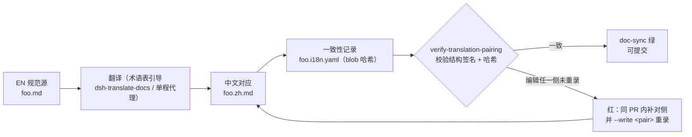

`verify-translation-pairing`（doc-sync 成员，贡献者本地跑、CI 全量跑）机械执行三件事：

1. 范围内每份文档都有完整配对；README 按不区分大小写的 basename 发现（`missions/readme.md` 也在范围）。
2. 已存在的每个配对产物完整且一致：三文件齐全、两侧当前 blob 哈希等于记录值、中文侧与每个英文作者源带切换器（清单内生成英文源豁免）、结构签名按序一致（标题深度、逐字代码块、表格行列、列表种类与项数、除切换器外的每个链接目标）。
3. 列为 excluded 的文件完全没有 `.zh.md` 与 `.i18n.yaml`；`.agents/notes/archived/` 冻结树由专属 verifier 要求并封印完整既有三元组。

`--list` 打印全范围配对状态（missing/out-of-sync/ok）且永不失败；`<pair...>` 指定检查单对（三个文件中任一个或裸 stem 即可命名），更新循环秒级验证自己的对，但 PR 级的绿必须以无参全量形式为准。

##### 结构签名与术语表

`verify-translation-pairing` 校验的"结构签名"逐项对应（i18n README 实载）：

- 标题深度与顺序；
- 逐字代码块（info 字符串与内容字节一致）；
- 表格行数与列数；
- 列表种类、有序列表起点与列表项数；
- 除切换器外的每个链接目标。

任一项失配即红——签名不判断语义，语义正确性是评审者的半份契约。

`i18n/terminology.md` 是术语的词汇权威（source of truth）：日常对侧更新要求代理先加载术语表再单程改写，首用注解随文重定位、未动正文保持原样；`style-samples.md` 提供风格样例（天然双语），`translation-rules.md` 规定全部保留规则。

> [!IMPORTANT]
> **门禁的诚实上限**：绿灯只代表"这一对在这些确切内容上被确认一致"，不代表确认本身可靠——它检查哈希与 Markdown 结构，判断不了两侧是否真的说同一件事、措辞是否准确地道，那是评审者的半份契约。重录一对敷衍的对侧能过门禁，但不能过评审。

#### 滚动规则与翻译收尾

07-04 的 `f5774a2a26` "feat(i18n): new documents merge bilingual — the requiredSince date frontier" 把契约升级为滚动规则：文件名带日期的文档（如 RFC）凡在 2026-07-05 截止线之后必须成对合并，新文档不许再扩大翻译欠账；之前的 07-04 RFC 波次被祖父条款豁免。

07-26 完成主体翻译：`30db52fa4b` "docs: translate remaining non-README documentation" 与 `226dc7a249` "docs: translate remaining READMEs" 把 apps/cli、examples 等 README 与剩余正文全部补成双语。

08-04 与 08-09 进入校对轮：`2db712eec7` "docs(i18n): proofread active Chinese documentation"、`7ff0cbcb7e` "docs: complete Chinese proofreading and generated reference pairing"；08-12/08-13 又有多轮 README 人工润色（`7e4b8b1676` "human-polish key Chinese READMEs"、`952c6c3c9c` "finish README fidelity review"），`964b1dde52`（08-12）润色贡献指南措辞。

#### 双语覆盖数据（实测）

| 范围 | md 数 | .zh.md | .i18n.yaml | 说明 |
|---|---|---|---|---|
| docs/ 根层 | 37 | 36 | 18 | 18 对 + 单语 AGENTS.md |
| docs/ 全树 | 215 | 105 | 105 | 105 对 + 5 个单语文件 |
| 全仓库（排除 vendor/ 与 node_modules/）| — | 1078 | 1078 | 双语三元组总数 |

1078 的构成（推断，比例实测）：docs/ 内 105 对约占 9.7%，其余约 973 对来自全部非 vendor README（packages/*、examples、apps、python）、`.agents/notes/` 活动笔记与根 CONTRIBUTING——也就是说，仓库里"给人读的每一份 Markdown"几乎都在配对范围内，双语不是 docs/ 的特权而是全仓纪律。i18n README 的原始表述是"this repo's documentation is read by people and agents both inside and outside the company, so every document in scope is maintained in English and Simplified Chinese"——配对范围的设计动机是"内外都有人读"。

配对范围：根 CONTRIBUTING、所有非 vendor README、`.agents/notes/**`、`docs/**`、`python/**` 下的每份活动文档；README 匹配不区分大小写且覆盖未来目录，无需再改清单。

排除清单（永不配对，门禁拒绝为它们出现 `.zh.md` 或 `.i18n.yaml`）：

| 排除文件 | 理由 |
|---|---|
| cordis-api/inherited.md | 生成而无已评审中文对等，两个 locale 都投影英文源 |
| docs/AGENTS.md、notes/**/AGENTS.md 及其 CLAUDE.md 指令软链 | 代理指令，与根 AGENTS.md 一样仅英文维护 |
| i18n/terminology.md、i18n/style-samples.md | 天然双语 |
| i18n/translation-prompt.md | 自动流水线的提示模板，正文被机器逐字消费 |
| .agents/notes/archived/ | 冻结历史三元组，由 verify-archived-agent-notes 封印 |

生成英文参考与图谱在具备已评审中文对等时参与配对：生成器仍是英文事实源，新鲜度门禁与配对门禁各自独立执行；重新生成导致英文变化时，配对保持 out-of-sync 直到中文对等更新重录。生成英文源不带切换器（否则生成器变陈旧），其中文对等仍回链英文源，且只允许改写会让译文失真的自我指涉生成/维护语句。

分工：日常对侧由工作代理在加载术语表后一次单程直接更新，不调翻译技能、不生成简报、不跑独立翻译评审、不委托子代理；`dsh-translate-docs` 扩展工作流保留这些重机制仅供显式调用。`scripts/translation-prompt.ts` 把提交的模板（注入术语，自带校准规则）渲染成双向并解析三段式响应，`verify-translation-prompt` 在 doc-sync 中演练两个方向与示例。

##### 契约演进里程碑

| 日期 | 提交 | 事件 |
|---|---|---|
| 07-02 | `4d89bb3e74` | 双语契约 + 翻译技能 + 配对门禁（Ziya）|
| 07-03 | `ec05295a0c` | 等权配对 + 边车一致性记录 |
| 07-03 | `a899226397` | 门禁加固：结构签名而非计数 |
| 07-03 | `50a32cdcb1` | 术语表扩展 |
| 07-04 | `f5774a2a26` | 滚动规则：07-05 截止线后新文档必须成对合并 |
| 07-26 | `30db52fa4b` / `226dc7a249` | 主体翻译：非 README 正文 + 全部 README |
| 08-04 | `2db712eec7` | 校对活动中文档 |
| 08-09 | `7ff0cbcb7e` | 中文校对完成 + 生成参考配对 |
| 08-12/08-13 | `7e4b8b1676` / `952c6c3c9c` | README 人工润色 + 保真度评审 |

##### 校验命令形态

| 命令 | 行为 |
|---|---|
| `pnpm run verify-translation-pairing` | 全量校验（doc-sync 与 CI 所跑的形式）|
| `pnpm run verify-translation-pairing --list` | 打印全范围状态（missing / out-of-sync / ok），永不失败 |
| `pnpm run verify-translation-pairing <pair...>` | 只校验指定对（任一文件或裸 stem 命名）|
| `pnpm run verify-translation-pairing --write <pair>` | 重录两侧 blob 哈希（评审认可的确认动作）|
| `pnpm run resolve-translation-pairing-conflicts` | fail-closed 处理已停止合并的配对记录 |
| `pnpm run gen-translation-brief <pair>` | 按最窄安全粒度组装更新简报（扩展工作流）|

> "Pairs merge whole: a PR never lands one language without the other two files."——i18n 配对契约的原始表述：一个 PR 永远不会只落地一种语言而不带另外两个文件。这条规则把"双语"从愿望变成每次合并的机械事实。

---

### website 站点

#### 从复制到投影（07-09 → 07-13）

站点由 `87a1774fef` "feat: add docs website"（lintianle，07-09）引入，最初的形态是把设计论文、开发指南与 API 参考以中文 Markdown 树直接复制进 `website/zh-CN/`——复制型站点。

07-13 的 `d2f810e9fe` "feat(docs): build maintainable documentation site"（Yichen Jiang）改造成可维护形态：内容从 `website/zh-CN/` 移入 `docs/user/`，新增 `scripts/project-doc-site.ts` 投影器与配套 Agent Note，站点只保留配置与清单。

从此"站点投影、不复制"成为硬边界：07-22 的 `e844125d7d` "docs: enforce canonical website projection" 把边界写进门禁，`website/AGENTS.md` 明文禁止任何复制型文档树（`website/zh-CN/`、`website/en/`、`website/api/` 一律不许出现）。

投影而不是复制的根本理由是**单一事实源**：如果站点里有一份复制的 `architecture.md`，那么文档作者改 docs/ 里的原稿时，站点副本要么默默变陈旧（读者看到旧架构），要么需要手工同步（每次变更都要记得两处都改）。投影器把"同步"变成构建步骤：`docs.ts` 清单说清楚"哪个源投到哪个路由"，`project-doc-site.ts` 每次构建时重新生成，任何漂移（源被移动、翻译缺失、路由改名）都会被 spec 或构建门禁当场抓住——复制型站点时代的"双份维护税"被一笔勾销。

07-13 的配套 Agent Note 与 07-22 的门禁共同留下了一条可审计的边界：`website/` 只允许 VitePress 配置、展示资产与发布清单，连 `website/AGENTS.md` 本身都是该子树唯一维护的 Markdown——`pnpm docs:check` 会拒绝任何额外非忽略 Markdown。

#### 入门禁与三连强化（07-16）

07-16 的 `6ce9f16030` "website: wire the site into the repo gates; make every tutorial example compile" 把站点接入 pnpm workspace 与 `run-gates`，VitePress 构建兼任死链检查，并把 55 个 ts 代码块改成可独立编译——编译器当场揪出 5 个编造的事件名与若干错形 API。

同一天还有三连：

- `da26138592` "gate every yaml config example against the real plugin surface"——每个 yaml 配置示例对照真实插件面；
- `efba9fab0a` "generate the API reference from source (cordis + all 15 harness services)"——从源码生成 API 参考；
- `4c49677469`——设计论文的 TeX 渲染（mathjax3）。

07-20 的 `734a45cf66` "ci: deploy documentation to GitHub Pages" 加了 `docs-pages.yml` 部署。

此后站点按双语源扩充：07-22 `21456a36ca` 加七课时的 Cordis 手把手教程、07-23 `22325d3d51` 上 Cordis primer、07-24 `ac93d00541` 上翻译后的 core data pages、08-09 `5096db61b2` "project existing Chinese translations" 让已有中文对等投影上线。

#### 投影机制：清单、投影器、临时产物

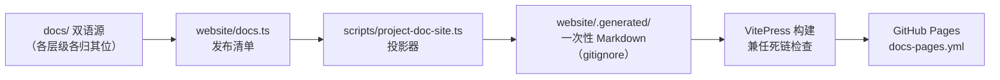

发布链路的每一步都有门禁兜底：投影器自身的 spec（`project-doc-site.spec.ts`）、片段校验（`verify-doc-site-fragments.spec.ts`）、构建死链检查、以及 `verify-doc-site-fragments` 的锚点完整性。

今天的 `website/docs.ts` 是发布清单：每个源按 `root`（中文）/`en` 双 locale 投射，缺翻译时两侧都投影可用源；`website/AGENTS.md` 明文禁止任何复制型文档树，`.generated/`、`.cache/`、`.dist/` 一概不提交。

##### docs.ts 清单结构（示意）

真实类型与函数名摘自 `website/docs.ts`，行级细节见源码：

```ts
/** 站点 locale：root（中文）与 en 双路由树。 */
export type DocsLocale = 'root' | 'en'
/** 投影进 VitePress 源树的一页。 */
export interface DocsPage {
  locale: DocsLocale          // 归属路由树
  contentLocale: 'zh-CN' | 'en-US'  // 当前投影的源语言
  source: string              // 仓库内规范 Markdown 源
  route: string               // VitePress 路由（含 .md 后缀）
  label: string               // 侧边栏导航名
  sidebar: DocsSidebar | null // 侧边栏集合
  section: string             // 侧边栏分组
  order: number               // 组内稳定顺序
  outline?: number | readonly [number, number] | 'deep' | false
  sourceAliases?: string[]    // 解析到本页的其他仓库路径
}
const homeAndGuide = pairedPages([...])          // 首页 + 快速入门（user/index、guide/*）
const develop = pairedPages([...])               // 开发三阶：basic / framework / practice
const cordisTutorial = pairedPages([...])        // 七课时教程（docs/cordis-tutorial/）
const subsystemsReference = subsystemGroups.flatMap(...)  // 七组子系统引用
const reference = [...pairedPages([...])]        // 概念 / 生成参考 / Cordis API / cookbook
export const docsPages: DocsPage[] = [...]
```

`pairedPages()` 把 `foo.md` 对自动展开成 `{ root: foo.zh.md, en: foo.md }` 的双 locale 记录并互加 sourceAliases；`mirroredPages()` 处理单语镜像（如 inherited.md 两侧都投影英文源）；`sectionSpec`/`orderedPages`/`routeLink`/`landingLink` 提供分组排序、路由链接与导航落点派生——导航目标由清单推导而非手写，首页改名重排不会留下断链。

##### 站点内容分组（每 locale 页数推算自 docs.ts）

| 内容分组 | 页数 | 源 | 说明 |
|---|---|---|---|
| 首页与快速入门 | 4 | docs/user/{index,guide/*} | 首页、Web UI 快速入门、配置模型、Python |
| 插件开发 | 9 | docs/user/develop/** | 基础 4 + 框架能力 3 + 实战 2 |
| Cordis 七课时教程 | 8 | docs/cordis-tutorial/ | index + 01–07 |
| Cordis primer | 1 | docs/cordis-primer.md | 概念区 |
| subsystems 参考 | 43 | docs/subsystems/ | 七组分组；attachment/extensions/feedback 三页未入站 |
| 概念参考 | 4 | architecture、capability-seams、agent-lifecycle、tool-execution-pipeline | |
| 生成参考 | 3 | config/tool/persistence-catalog | |
| Cordis API | 6 | docs/cordis-api/ | context/events/fiber/registry/service + inherited（单语镜像）|
| cookbook | 5 | docs/cookbook/ | 加 package/tool/LLM adapter/对话节点、扩展模式 |
| 合计 | 83 × 2 = 166 | | 双 locale 共 166 条投影记录 |

subsystems 参考按 7 组折叠进侧边栏（总览、内核与作用域、会话与持久化、模型与上下文、执行与工具、策略与交互、平台与接入），默认折叠以防 43 页把其他分组挤出首屏；`docs/subsystems/` 目录里的 attachment、extensions、feedback 三页在仓库内完整维护但未投影入站。

##### 站点内容类别与门禁对照

| 站点内容类别 | 对应门禁 / 机制 |
|---|---|
| 教程与示例代码块 | doc-typecheck：55 个 ts 代码块可独立编译（07-16 `6ce9f16030`）|
| yaml 配置示例 | 对照真实插件面（07-16 `da26138592`）|
| API 参考 | 从源码生成（07-16 `efba9fab0a`）+ cordis/config/tool/persistence catalog 新鲜度门禁 |
| 页面链接与锚点 | docs:build 死链检查 + verify-doc-site-fragments |
| 投影产物本身 | project-doc-site.spec.ts + verify-doc-site-fragments.spec.ts（docs:check 所跑）|
| 双语路由 | 缺翻译时两侧投影可用源（docs.ts 注释明示的意图行为）|

##### docs.ts 关键函数职责（源码注释转述）

| 函数 | 职责 |
|---|---|
| `pairedPages()` | 把 `foo.md` 对展开成 `{ root: foo.zh.md, en: foo.md }` 的双 locale 记录并互加 sourceAliases |
| `mirroredPages()` | 单语源按双 locale 镜像投影（如 inherited.md）|
| `sectionSpec()` | 返回分组在 locale 侧边栏的位置；未声明分组直接抛错，防止静默排到最前 |
| `orderedPages()` | 按分组位置 + order 排好一个 sidebar 集合的页序 |
| `routeLink()` | 把 route 去掉 `.md`/`index.md` 后缀得到站点链接 |
| `landingLink()` | 由集合首页推导导航落点而非手写——首页改名重排不会留下断导航 |

> [!TIP]
> **站点"禁止复制"是门禁强制，不是约定**：`website/AGENTS.md` 明文禁止 locale/route/API 复制树，`docs:check` 会拒绝任何额外的非忽略 Markdown；改站点内容的正道是改 `docs/` 源与 `docs.ts` 清单，再跑 `pnpm docs:check` 验证投影。

#### 站点演进时间线表

| 日期 | 提交 | 事件 |
|---|---|---|
| 07-09 | `87a1774fef` | 初版：中文 Markdown 树复制进 website/zh-CN/（复制型）|
| 07-13 | `d2f810e9fe` | 可维护形态：内容移入 docs/user/，新增投影器与 Agent Note |
| 07-16 | `6ce9f16030` | 接入 workspace 与 run-gates；55 个 ts 代码块可独立编译（揪出 5 个编造事件名）|
| 07-16 | `da26138592` | 每个 yaml 配置示例对照真实插件面 |
| 07-16 | `efba9fab0a` | API 参考从源码生成（cordis + 15 个 harness 服务）|
| 07-16 | `4c49677469` | 设计论文 TeX 渲染（mathjax3）|
| 07-20 | `734a45cf66` | GitHub Pages 部署（docs-pages.yml）|
| 07-22 | `e844125d7d` | 强制"站点只投影、不复制"边界 |
| 07-22 | `21456a36ca` | 七课时 Cordis 手把手教程 |
| 07-23 | `22325d3d51` | Cordis primer 上线 |
| 07-24 | `ac93d00541` | 翻译后的 core data pages 上线 |
| 08-09 | `5096db61b2` | 已有中文对等投影上线（project existing Chinese translations）|

##### 侧边栏集合与子系统分组

六个 sidebar 集合（每 locale 三个，docs.ts 实载）：

| 集合 | 分组 |
|---|---|
| zh-guide / en-guide | 入门（首页、Web UI 快速入门、配置模型）+ SDK（Python）|
| zh-develop / en-develop | 基础、框架能力、实战、Cordis 框架教程 |
| zh-reference / en-reference | 概念、生成参考、Cordis API、开发手册、总览 + 六个折叠的子系统分组 |

subsystems 参考的七组分法（docs.ts 实载）：

| 分组（中 / 英）| 页数 | 页面 |
|---|---|---|
| 总览 / Overview | 1 | README |
| 内核与作用域 / Core and scopes | 3 | core、scope、invariants |
| 会话与持久化 / Sessions and persistence | 8 | session、session-query、session-reference、session-title、session-projection、persistence、spill、session-telemetry |
| 模型与上下文 / Model and context | 4 | llm-streaming、token-meter、system-prompt、compaction |
| 执行与工具 / Execution and tools | 12 | tools、shell、subprocess、terminal、jobs、filesystem、lsp、code-runtime、web、skills、workflow、subagent |
| 策略与交互 / Policy and interaction | 8 | approval、permission-presets、sandbox、plan、user-questions、commands、goal、schedule |
| 平台与接入 / Platform and access | 7 | web-server、typert、client-modules、storage、workspace、settings、credentials |

侧边栏分组默认折叠的设计理由写进了 docs.ts 注释：subsystem 分组合计 43 页，展开会把引用侧边栏其他分组挤出首屏（"a flat list of every subsystem pushed the rest of the reference sidebar below the fold"）。

---

### examples 示例体系

#### 从演示到"示例即测试"

`examples/` 从"演示"长成了"示例即测试"。

起点是 06-11 的 `53d1ef4a74` "Add runnable echo-agent example"——一个用 `cordis.yml` 串起 mock LlmAdapter、echo tool、stdio 聊天 UI 与 JSONL 持久化的全栈演示。

06-13 的 `e98c1c5d42` 加了 coding-agent 与配套 cookbook；06-16 的 `fb9636db44` 加了 ACP bridge 示例（从编辑器经 JSON-RPC stdio 驱动 coding agent，acp-agent 目录的最早提交）。

06-19 的 `072f97c184` "refactor(examples): extract reusable logic into tested packages" 是转折点：把示例里的可复用逻辑抽进 `packages/` 接受覆盖率门禁，同时 `examples/AGENTS.md` 确立"每个示例都有无密钥 + 有密钥两类冒烟"的约定（前者用 Loader 启动真实 `cordis.yml` 断言输出与干净退出，直接针对 postmortem 0001 的 ACP 默认导出丢失事故）。

示例目录随后按产品面扩张并收敛为六个叶子：07-16 `8d35092e26` 隔离 headless-agent、07-17 `5ed531acba` 让示例与测试跑在构建产物上、07-19 `a1c85447b8` 把 DSBench 组合改名为 jsonrpc-agent、07-27 `826c6fd243` 出现 web-cordis（自指型 Cordis 生命周期工具演示）、07-31 `7e929d3d50` 加 mcp-memory 覆盖层、08-05 `f7e7851e3f` 加 web-schedule（持久化提醒）。

#### 六个示例叶子全表

六叶子的目录最早提交与能力（能力描述来自提交信息与目录实测，功能细节（待考）处未确认）：

| 示例 | 诞生提交 | 日期 | 能力与目录实测 |
|---|---|---|---|
| acp-agent | `fb9636db44` | 06-16 | ACP bridge：从编辑器经 JSON-RPC stdio 驱动编码代理；目录含约 24 组 `*.cordis.yml`/`*.cordis.snapshot.yml` 快照对（advanced、code-mode、pty、fs、web、retry、session-query、subagent-* 等）、composition.md 与两个 fixture 服务器（pty-snapshot-backend.mjs、web-fetch-fixture-server.mjs）；前身为 echo-agent（06-11 `53d1ef4a74`）与 coding-agent（06-13 `e98c1c5d42`）|
| headless-agent | `8d35092e26` | 07-16 | 无头代理（headless）示例；目录含 12 组快照对（advanced、compaction、credentials、goal、pty、ralph、retry、semantic-checkpoint、subagent-*、workspace-context-resume）与 e2b.cordis.yml（E2B 沙箱场景）、composition.md |
| jsonrpc-agent | `a1c85447b8` | 07-19 | 由 DSBench 组合改名而来；JSON-RPC 客户端骨架：cordis.yml + 快照 + minimal.cordis.yml + minimal.py 最小客户端 |
| web-cordis | `826c6fd243` | 07-27 | 自指型 Cordis 生命周期工具演示（web 能力）；目录仅 cordis.yml + 双语 README |
| mcp-memory | `7e929d3d50` | 07-31 | 通用记忆 MCP 覆盖层：engram / mcp-reference-memory / memorix 三种 overlay cordis.yml |
| web-schedule | `f7e7851e3f` | 08-05 | 持久化定时提醒（schedule 能力）：cordis.yml + 双语 README |

`examples/` 目录本身是 workspace 成员之一但不是构建目标，README 与 AGENTS.md 均双语维护；每个叶子还带自己的 `package.json`（仅元数据）与 `README.i18n.yaml` 配对。

#### "示例即测试"机制

`examples/AGENTS.md` 定义的双类冒烟是硬约定：

- **无密钥（keyless）**：经 Loader 启动真实 `cordis.yml`，驱动后断言输出与干净退出——抓手挂测试漏掉的无效 Loader 导出（postmortem 0001 的事故类型）；进程冒烟用 `@deepseek-ai/dsh-loader-smoke` 做 Loader 启动解析，终端测试在伪终端里包一层启动。
- **有密钥（with-key）**：发真实模型提示并验证外部状态（而非模型的自述），无 `DEEPSEEK_API_KEY` 自行跳过。

配套约束：

- 可复用逻辑一律抽进 `packages/`，接受每文件覆盖率与 README 门禁；示例只留 `cordis.yml` 接线、演示产物与 e2e/快照场景。
- 每个检入的测试 Cordis 配置住在对应 `examples/<agent>/` 叶子下；包属配置映射到 `examples/<agent>/tests/fixtures/<group>/<package>/cordis.yml`，驱动器与断言包内自持，并在根 `tsconfig.json` references 与 `examples/package.json` 双声明。
- `examples/AGENTS.md` 不盘点示例测试——`tests/` 树与根脚本才是权威。
- 目录实测显示快照机制：acp-agent、headless-agent、jsonrpc-agent 携带 `*.cordis.snapshot.yml` 与 `*.cordis.yml` 成对文件（键无关重放），而 mcp-memory、web-cordis、web-schedule 只带单个 `cordis.yml`——前者是快照场景密集的叶子，后者是纯接线演示。

> [!IMPORTANT]
> **"示例即测试"是产品纪律，不是装饰**：每个示例都必须能无密钥自证（Loader 冒烟断言输出与干净退出）并有密钥时验证真实外部状态。这条纪律诞生于 postmortem 0001 的 ACP 默认导出丢失事故——文档示例如果只是给人看的，这种回归会在发布前溜走。

##### 示例演化时间线

| 日期 | 提交 | 事件 |
|---|---|---|
| 06-11 | `53d1ef4a74` | echo-agent：mock LlmAdapter + echo tool + stdio 聊天 UI + JSONL 持久化 |
| 06-13 | `e98c1c5d42` | coding-agent + 配套 cookbook |
| 06-16 | `fb9636db44` | ACP bridge（acp-agent 目录的最早提交）|
| 06-19 | `072f97c184` | 可复用逻辑抽进 packages/；examples/AGENTS.md 确立双类冒烟约定 |
| 07-16 | `8d35092e26` | headless-agent 隔离 |
| 07-17 | `5ed531acba` | 示例与测试跑在构建产物上 |
| 07-19 | `a1c85447b8` | DSBench 组合更名 jsonrpc-agent |
| 07-27 | `826c6fd243` | web-cordis（Cordis 生命周期工具演示）|
| 07-31 | `7e929d3d50` | mcp-memory 记忆 MCP 覆盖层 |
| 08-05 | `f7e7851e3f` | web-schedule 持久化提醒 |

##### 叶子目录文件实测（2026-08-13）

| 示例 | 配置 / 快照文件 | 其他 |
|---|---|---|
| acp-agent | 25 份 `*.cordis.yml` + 24 份 `*.cordis.snapshot.yml` | composition.md、pty-snapshot-backend.mjs、web-fetch-fixture-server.mjs |
| headless-agent | 14 份 `*.cordis.yml` + 12 份快照 | composition.md、e2b.cordis.yml（无快照）|
| jsonrpc-agent | cordis.yml/cordis.snapshot.yml + minimal.cordis.yml/minimal.snapshot.cordis.yml | minimal.py 最小 JSON-RPC 客户端 |
| mcp-memory | engram / mcp-reference-memory / memorix 三份 overlay cordis.yml | — |
| web-cordis | cordis.yml | — |
| web-schedule | cordis.yml | — |

##### 叶子详情

acp-agent
: ACP bridge 的当代形态。目录里 25 份 `*.cordis.yml` 覆盖 advanced、agent-instructions、background-job-admission、both-mode、child-question、code-mode、code-mode-workspace-context、cordis-tools、depth-two、fs、image、image-text-route、partial-landlock、product-subagent-both、product-subagent-codex、pty、retry、session-query、session-sandbox-root、session-title、subagent-continuable-inheritance、subagent-durability-failure、subagent-report-quiet、web 等场景，24 张 `*.cordis.snapshot.yml` 快照一一配对；两个 fixture 服务器（pty-snapshot-backend.mjs、web-fetch-fixture-server.mjs）为快照提供后端与网络桩；composition.md 讲解组合。快照场景名本身就是能力清单：图像路由、PTY、部分 Landlock、子代理可续继承、会话查询与标题、web 抓取。

headless-agent
: 无头（无 UI）代理的参考组合。12 张快照对覆盖 advanced、compaction、credentials、goal、pty、ralph、retry、semantic-checkpoint、subagent-diagnostic、subagent-inheritance、subagent-settlement、workspace-context-resume，另有 e2b.cordis.yml（E2B 沙箱）无快照；composition.md 讲解组合。场景名暴露产品面：Ralph 循环、语义检查点、子代理诊断/继承/结算、工作区上下文恢复。

jsonrpc-agent
: 从 DSBench 组合改名而来，是最小的 JSON-RPC 客户端参考：cordis.yml + cordis.snapshot.yml + minimal.cordis.yml + minimal.snapshot.cordis.yml + minimal.py（Python 最小客户端骨架）——用 5 个文件讲清 JSON-RPC 接线。

web-cordis
: 自指型演示：用 web 能力呈现 Cordis 生命周期工具本身（`826c6fd243` "feat(web): present Cordis lifecycle tools"），目录只有一个 cordis.yml 加双语 README。

mcp-memory
: 通用记忆 MCP 覆盖层（`7e929d3d50` "add generic memory MCP overlays"）：engram / mcp-reference-memory / memorix 三份 overlay cordis.yml 分别挂不同记忆 MCP 服务。

web-schedule
: schedule 能力的落地演示（`f7e7851e3f` "feat(schedule): add durable after reminders"）：持久化提醒的完整 cordis.yml 接线。

六个叶子的命名谱系也反映产品线演进：最早的 acp-agent 承载"编辑器驱动编码代理"的愿景，中段的 headless/jsonrpc 服务无头自动化与 JSON-RPC 协议，末段三个（web-cordis、mcp-memory、web-schedule）分别对应 web、skill/MCP、schedule 三条新能力——每个新能力缝落地时都顺手带一个可运行叶子。

快照密度是"示例即测试"的可见度指标：三个早期叶子（acp-agent、headless-agent、jsonrpc-agent）携带数十组 `cordis.snapshot.yml` 键无关重放场景，三个后期叶子（mcp-memory、web-cordis、web-schedule）以纯接线演示为主——不是后者的测试义务更轻，而是它们的场景由上游 packages/ 的 e2e 与快照承担。

---

### python/ 与 native/

#### Python SDK：两个发行物与四条 wheel

Python SDK 于 07-11 启动：`ade150b719` "python: deepseek-harness SDK and runtime carrier packages" 建立 `deepseek-harness-sdk`（高层 turns API + 低层 JSON-RPC 客户端）与 `deepseek-harness-runtime-bin`（捆绑运行时二进制与默认配置）两个发行物，`bd831db80b` "single-exe: closure manifest, build pipeline, and CI workflow" 配套单文件运行时的闭包清单与构建流水线。

07-13 的 `5d913a796a` "jsonrpc: harden Python SDK lifecycle and protocol" 加固协议，`283ac7f097` "close runtime packaging and platform wheels" 与 `cdd11ac587` "ci: validate and publish Python runtime wheels" 收口平台 wheel 并在 CI 验证发布。

08-10 补文档与发行名（`20139a3fb7` "docs(sdk): add minimal Python example"、`299cafad01` "fix(python): rename SDK distribution"、`4481637684` "fix(python): package the minimal runtime closure"），08-11 的 `4445de9921` "Prepare Python SDK public PyPI publication" 建 `python-release.yml`，08-12 `08941c71e3` 强制 Python 运行时必须走发布路径。

发行物（实测 `python/` 下有 `sdk/` 与 `sdk-runtime/` 两个 pyproject）：

| 发行物 | 目录 | 职责 |
|---|---|---|
| deepseek-harness-sdk | python/sdk/ | 高层 turns API + 低层 JSON-RPC 客户端；`py3-none-any` 纯 Python wheel |
| deepseek-harness-runtime-bin | python/sdk-runtime/ | 捆绑运行时二进制与默认配置；平台特定 wheel |

wheel 平台表（实测自 `python-release.yml` 的产物清单）：

| wheel | 平台 | 说明 |
|---|---|---|
| `deepseek_harness_runtime_bin-*-py3-none-manylinux_2_28_x86_64.whl` | Linux x64 | node24-linux-x64 构建目标 |
| `deepseek_harness_runtime_bin-*-py3-none-manylinux_2_28_aarch64.whl` | Linux arm64 | node24-linux-arm64 构建目标 |
| `deepseek_harness_runtime_bin-*-py3-none-macosx_14_0_arm64.whl` | macOS arm64 | node24-macos-arm64 构建目标 |
| `deepseek_harness_sdk-*-py3-none-any.whl` | 纯 Python | 平台无关 |

##### python/ 目录实测

| 路径 | 内容 |
|---|---|
| python/sdk/ | deepseek-harness-sdk 发行物（pyproject.toml）|
| python/sdk-runtime/ | deepseek-harness-runtime-bin 发行物（pyproject.toml）|
| python/README.md + README.zh.md + README.i18n.yaml | 双语入口（配对范围成员）|
| python/development.md + development.zh.md + development.i18n.yaml | 开发文档（双语）|

SDK 与运行时是"瘦客户端 + 厚运行时"的分工：`deepseek-harness-sdk` 只负责 turns 高层 API 与 JSON-RPC 协议，`deepseek-harness-runtime-bin` 捆绑单文件运行时与默认配置——SDK 纯 Python 平台无关，运行时按三平台出 wheel。

发布纪律（`python-release.yml` 实测）：

- 构建四个 wheel（job 名即 "Build four wheels"），在 ubuntu 上用 Python 3.10 与 3.14 矩阵做兼容性验证（安装 SDK 后跑 `smoke-python-runtime.py --scenario sdk-default`）。
- 发布仅接受手动触发且必须从 `python-v*` 标签运行；要求仓库变量 `PYPI_PUBLISHER_REPOSITORY` 与 `PUBLIC_PYPI_RELEASE_ENABLED=true` 双重开关。
- 校验产物：四 wheel 清单 diff、单个 wheel 小于 100MB（公开 PyPI 默认上限）、`twine check` 元数据校验、`sha256sum` 记录并复验。
- 发布分两步：`publish-runtime`（环境 pypi-runtime）先传不可变运行时 wheel，`publish-sdk`（环境 pypi）依赖前者再传 SDK——SDK 上传失败时 "re-run failed jobs" 从断点续跑，不重写已上传的运行时文件；两者都用 OIDC 认证但 `attestations: false`（公开证明会泄露私有发布仓库身份）。
- 配套工作流：`build-exe-for-python-sdk.yml` 负责单文件可执行构建。

##### Python 里程碑

| 日期 | 提交 | 事件 |
|---|---|---|
| 07-11 | `ade150b719` | SDK + runtime-bin 两个发行物 |
| 07-11 | `bd831db80b` | 单文件运行时闭包清单 + 构建流水线 |
| 07-13 | `5d913a796a` | 加固 SDK 生命周期与协议 |
| 07-13 | `283ac7f097` / `cdd11ac587` | 收口平台 wheel；CI 验证与发布 |
| 08-10 | `20139a3fb7` / `299cafad01` / `4481637684` | 最小示例、发行名改名、最小运行时闭包打包 |
| 08-11 | `4445de9921` | python-release.yml（四平台 wheel，python-v* 标签手动发布）|
| 08-12 | `08941c71e3` | 强制运行时走发布路径 |

##### 发布流水线（python-release.yml job 依赖）

```mermaid
flowchart LR
    B["build<br/>四平台 wheel"] --> C["python-compat<br/>Python 3.10 / 3.14 矩阵"]
    C --> V["validate<br/>wheel 清单 diff + twine + SHA256SUMS"]
    V --> R["publish-runtime<br/>运行时 wheel → 公开 PyPI"]
    R --> S["publish-sdk<br/>SDK wheel → 公开 PyPI"]
```

##### native/landlock-run

`native/landlock-run` 是 `@deepseek-ai/node-addon-landlock-run` 的源记录子树。Landlock 是 Linux 内核的沙箱机制（按文件系统效应自限制），`landlock-run` 提供"自限制后执行"的启动器；`dsh-sandbox-local` 把它声明为依赖，是公开消费的真正阻塞点之一（见"公开发布与论文"一节）。

发布序列为 `landlock-run-v<version>` 标签 + `landlock-run-release.yml` 工作流；08-13 与 vendored 框架同批转公开（`a213befd0f`，13:55），随后 14:38 的 `4fa73a2ea8` 合入 "Release: vendor@4.0.1 & landlock@0.1.0"。

#### native/：Landlock 源记录子树

`native/` 是 07-14 的 `0a486f09c9` "chore: adopt node-addon-landlock-run source as native/ subtree" 引入的：把 Landlock 自限制后执行启动器作为 `@deepseek-ai/node-addon-landlock-run` 的源记录子树。

07-20 的 `801289adf2` 与 `a3f792ea9f` 对齐 probe CLI 契约与发布指引。

它构成三条发布序列之一（dsh / vendor / native），08-13 与 vendored 框架一起转为公开（见下）。实测 `native/` 现含 `landlock-run/` 子树与双语 README（`README.md`/`README.zh.md` + `README.i18n.yaml`）；发布工作流为 `landlock-run-release.yml`（标签 `landlock-run-v<version>`）。

---

### README / CONTRIBUTING 演进

#### README：从一行简介到产品入口

README 从一行项目简介长成产品入口。

06-10 的 `b67e81ac97` "Initialize repo with README, AGENTS.md, and CLAUDE.md symlink" 只有"DeepSeek Harness group 的 monorepo"与"DeepSeek Code"两段。

06-11 的 `cacfae3cae` 与 06-14 的 `40298c2847` "docs: compact README guidance"、`0853f52f49` "docs: split README guidance by audience" 开始按受众拆分指引。

07-04 的 `ed022780a2` "docs: rebrand README for DeepSeek Harness SDK" 把过时的 'DeepSeek Code' 换成 'DeepSeek Harness SDK'，demo 命令改为 `demo:agent`/`demo:acp`。

08-11 的 `59e98ca8dd` "docs: add contribution guide" 新增 `CONTRIBUTING.md`（同日 `2f4bf08798` 加中文版）；08-12 的 `04fe477e7e` "docs: make Web UI the primary onboarding path" 把 `npx @deepseek-ai/dsh web` 变成第一入口。

08-13 收尾：`a2de7703d7` "docs: refresh root README and sync Chinese counterpart" 定稿开发者预览声明与社区章节，`8502a38cb6` 加本地化社区渠道，`c905c4694e` "Adopt MIT for DSH packages" 全面换 MIT，`0ae8f27b93` "docs: add link to preview paper" 挂上论文链接。

README 版本演进表（提交史实测）：

| 时间 | 提交 | 形态 |
|---|---|---|
| 06-10 | `b67e81ac97` | 初始化：两段简介（monorepo + DeepSeek Code）|
| 06-11 / 06-14 | `cacfae3cae`、`40298c2847`、`0853f52f49` | 按受众拆分指引（compact / split by audience）|
| 07-04 | `ed022780a2` | rebrand 为 DeepSeek Harness SDK；demo 命令改名 |
| 08-11 | `59e98ca8dd`（+`2f4bf08798` 中文）| CONTRIBUTING.md 诞生 |
| 08-12 | `04fe477e7e` | Web UI 成为第一 onboarding 路径 |
| 08-12/08-13 | `8a6c3736e4`、`0f13ffa458`、`4c49e7109b`、`a2d0f7f411` 等 | 高频打磨：链接、分离贡献与许可证、命名契约 |
| 08-13 | `a2de7703d7`、`2af84c9a2c`、`797ea7c574` | 定稿刷新与中文对等同步 |
| 08-13 | `8502a38cb6`、`a37e19471e` | 本地化社区渠道 |
| 08-13 | `c905c4694e` | MIT 换牌 |
| 08-13 | `0ae8f27b93` | 论文链接挂上 README 首段 |

08-12 到 08-13 发布前，README 经历了一段发布冲刺式的密集提交：`e091593866`（替换 URL）、`93b400a1de`（合并禁用遥测默认分支）、`4c49e7109b`（把 dsh 与仓库构建分离）、`0f13ffa458`（显式链接 Web UI 指南索引）、`8a6c3736e4`（贡献链接与许可证分离）——入口页的每一次改动都紧跟产品发布节奏。

CONTRIBUTING 时间线：08-11 英文版 `59e98ca8dd`，同日中文版 `2f4bf08798`，08-12 措辞润色 `964b1dde52`；它也是配对范围的常驻成员（根 CONTRIBUTING 双语对）。

##### 08-11 → 08-13 README 提交冲刺（git log 实测）

| 日期 | 提交 | 提交信息 |
|---|---|---|
| 08-11 | `8a6c3736e4` | docs: separate contribution links from license |
| 08-12 | `04fe477e7e` | docs: make Web UI the primary onboarding path |
| 08-12 | `0f13ffa458` | docs: link Web UI guide index explicitly |
| 08-12 | `4c49e7109b` | fix(cli): separate dsh from repository build |
| 08-12 | `93b400a1de` | Merge branch 'codex/disable-telemetry-default' into master |
| 08-12 | `e091593866` | replace url |
| 08-13 | `a2d0f7f411` | refactor: apply repository naming contract |
| 08-13 | `a2de7703d7` | docs: refresh root README and sync Chinese counterpart |
| 08-13 | `2af84c9a2c` | docs: follow-up README wording and community section flattening |
| 08-13 | `797ea7c574` | docs: restore the Run section heading and retarget guide links |
| 08-13 | `c905c4694e` | Adopt MIT for DSH packages |
| 08-13 | `8502a38cb6` | docs: add localized community channels |
| 08-13 | `a37e19471e` | docs: refine localized community links |
| 08-13 | `0ae8f27b93` | docs: add link to preview paper |

这张表说明入口页在公开发布前后的"临门一脚"密集度：08-11 到 08-13 三天内 14 次触及 README，从受众分流、Web UI 优先、命名契约、MIT、社区渠道一路排到论文链接。

---

### 公开发布与论文

#### 发布机制定稿（08-10）

发布机制在 08-10 定稿：Agent Note `2026-08-10-npm-release-sequences` 记录三条独立发布序列（dsh 全家桶 / vendored 框架 / native），并点名两个硬障碍——217 个 workspace 清单 `private: true`、933 条手写 `peerDependencies: ^0.0.1`（semver 会排除任何 prerelease 版本）。

08-11 的 `9840d39ba0` "feat(release): rehearse a vendored publication with a prerelease" 用 rc.1 prerelease 试演 vendored 发布，同日 `b64c3ac1ba` 发出 `0.0.1-rc.1`——全家桶的第一个预发布，经 PR #2220 "Release: dsh@0.0.1-rc.1" 合入。

08-13 上午的命名契约与 MIT 换牌（`a2d0f7f411` "refactor: apply repository naming contract"、`c905c4694e`）为公开铺路。

预演是这条发布线最值得注意的方法论：`9840d39ba0` 用 rc.1 prerelease 试演 vendored 发布，`b64c3ac1ba` 随即发 0.0.1-rc.1 全家桶预发布——在真正公开之前，发布流水线已经完整跑过两轮（vendored 试演 + 全家桶首发）。prerelease 在这里不是"提前给用户尝鲜"，而是**把发布当成 CI 一样练**：每个 `release(dsh):` 提交正文为空、只统一升版本，PR 合入即触发一次可审计的发布动作，等 08-13 按下公开开关时，每一步都已经跑过无数遍。

#### 三级公开（08-13 下午）

```mermaid
flowchart TB
    subgraph 第一步["13:55 · vendored + native 公开"]
        A1["9 个 vendor/* 包<br/>（每个 harness 包的 peerDependency）"] --> P1["npm 公开访问"]
        A2["3 个 native/landlock-run 包<br/>（dsh-sandbox-local 的依赖）"] --> P1
        P1 --> M1["a213befd0f → 4fa73a2ea8<br/>Release: vendor@4.0.1 & landlock@0.1.0"]
    end
    subgraph 第二步["18:05 · dsh 全家桶公开"]
        B1["221 个 packages/*/* 与 apps/* 清单"] --> P2["publishConfig.access: public"]
        P2 --> M2["8c1e8d9890<br/>check-workspace-constraints 从此强制公开"]
    end
    subgraph 第三步["18:47 · 论文公开"]
        C1["README 首段链接 Cordis 论文"] --> C2["https://github.com/cordiverse/paper"]
        C2 --> M3["f26a6f6cff（PR #2520）合入 master"]
    end
```

08-13 下午完成三级公开：

1. **vendored + native**（13:55）：`a213befd0f` "build(release): publish the vendored framework and the native packages publicly" 先把九个 `vendor/*` 与三个 `native/landlock-run` 包转公开——它们是公开消费的真正阻塞点：每个 harness 包都把 vendored 框架声明为 peerDependency，`dsh-sandbox-local` 把 Landlock 入口声明为依赖；14:38 的 `4fa73a2ea8` 合入 "Release: vendor@4.0.1 & landlock@0.1.0"。
2. **dsh 全家桶**（18:05）：`8c1e8d9890` "build(release): publish the dsh family publicly" 把 221 个 `packages/*/*` 与 `apps/*` 清单全部置为 `publishConfig.access: public`，`check-workspace-constraints` 从此强制每个发布成员公开。
3. **论文公开**（18:47）：`0ae8f27b93` 删掉入库的 PDF、改在 README 首段链接 Cordis 论文（`https://github.com/cordiverse/paper`），`f26a6f6cff`（PR #2520）18:47 合入 master。

发布序列表：

| 步骤 | 时间 | 提交 / PR | 内容 |
|---|---|---|---|
| 定稿 | 08-10 | Agent Note `2026-08-10-npm-release-sequences` | 三条发布序列 + 两个硬障碍（217 private / 933 条 ^0.0.1）|
| 试演 | 08-11 | `9840d39ba0` | vendored prerelease 试演 |
| 首发 | 08-11 | `b64c3ac1ba`（PR #2220）| 0.0.1-rc.1 全家桶首个预发布 |
| 铺路 | 08-13 上午 | `a2d0f7f411`、`c905c4694e` | 命名契约 + MIT 换牌 |
| 第一级 | 08-13 13:55 | `a213befd0f` → `4fa73a2ea8` | 9 个 vendor + 3 个 native 转公开；Release: vendor@4.0.1 & landlock@0.1.0 |
| 第二级 | 08-13 18:05 | `8c1e8d9890` | 221 个清单 publishConfig.access: public |
| 论文线 | 07-31 → 08-13 | `ea93cf85f1` → `0ae8f27b93` | 1.2MB PDF 入库 → 删除并改链 `cordiverse/paper` |
| 收口 | 08-13 18:47 | `f26a6f6cff`（PR #2520）| 论文链接合入 master |

##### 三条发布序列对比

| 序列 | 标签 | 工作流 | 版本线 | 08-13 状态 |
|---|---|---|---|---|
| dsh 全家桶 | `dsh-v<version>` | release.yml | 全家桶统一版本（当前 0.1.0-rc.5）| 221 清单转公开（`8c1e8d9890`）|
| vendored 框架 | 每包独立版本线 | release-vendor.yml | 每个 vendor 包独立 | 9 包转公开（vendor@4.0.1）|
| native | `landlock-run-v<version>` | landlock-run-release.yml | landlock-run 独立 | 3 包转公开（landlock@0.1.0）|

##### release 脚本（root-scripts.txt 实测）

| 脚本 | 作用 |
|---|---|
| `release:dsh` / `release:vendor` | `scripts/release/bump.ts --family dsh|vendor` 统一升版本 |
| `release:verify` | 发布前校验 |
| `release:pack` | 打包 |
| `release:verify-packed-install` | 验证打包后安装 |
| `release:publish` | 发布 |
| `publish:npm-baseline` | npm 发布基线 |

##### 公开发布前的待办清单（08-13 实况）

- [x] 命名契约落地（`a2d0f7f411`）
- [x] MIT 换牌（`c905c4694e`）
- [x] vendored 9 包 + native 3 包转公开（`a213befd0f`，13:55）
- [x] 合入 Release: vendor@4.0.1 & landlock@0.1.0（`4fa73a2ea8`，14:38）
- [x] dsh 全家桶 221 清单置 `publishConfig.access: public`（`8c1e8d9890`，18:05）
- [x] 论文链接挂上 README 首段（`0ae8f27b93`，18:47 经 PR #2520 合入）
- [x] feat/npm-public（PR #2519）19:38 合入成为 HEAD（0.1.0-rc.5）

论文线同期推进：07-31 的 `ea93cf85f1` "docs: add cordis paper" 曾把 1.2MB 的 `docs/cordis-paper.pdf` 入库；08-13 的 `0ae8f27b93` "docs: add link to preview paper" 删掉 PDF、改在 README 首段链接 Cordis 论文（`https://github.com/cordiverse/paper`）；`f26a6f6cff`（PR #2520）18:47 合入 master。

---

### 发布时间线（0.0.1-rc.1 → 0.1.0-rc.5）

| 版本 | 提交 | 时间 | 内容 |
|---|---|---|---|
| 0.0.1-rc.1 | `b64c3ac1ba` | 08-11 03:04 | 全家桶首个预发布：全部 `packages/*/*` + `apps/*` 与 workspace root 从 0.0.1 统一升到 0.0.1-rc.1，经 PR #2220 合入；按 release 笔记，prerelease 驱动一次真实（受限）发布 |
| 0.0.1-rc.2 | `5ca7be5dcb` | 08-11 22:39 | 相隔 577 个提交，经 PR #2286 合入；窗口内含 background-first 可续子代理、minimal profiles、produced-files 目录、multimodal UI、web plugin config、schedule 栈与命名契约提案（`a767cd357f`） |
| 0.0.1-rc.3 | `1e99f20963` | 08-13 02:53 | 相隔 340 个提交，经 PR #2438 合入；窗口含仓库命名契约落地（`a2d0f7f411`）、MIT 换牌（`c905c4694e`）、self-modification 动态插件运行时与 UI（`4064198560`）、slot 系统 + typert 生成器（`0367506471`） |
| 0.0.1-rc.4 | `a90d9af1b2` | 08-13 05:02 | 相隔 7 个提交的修补发布 |
| 0.0.1-rc.5 | `3e8a1cfa33` | 08-13 05:58 | 相隔 10 个提交，经 PR #2447 合入 |
| 0.1.0-rc.1 | `22ab3beac1` | 08-13 15:56 | 0.0.x → 0.1.0 次版本跃迁，相隔 95 个提交，经 PR #2495 合入；窗口含 vendored/native 公开发布（`a213befd0f`、`4fa73a2ea8`）、README 刷新与本地化社区渠道（`a2de7703d7`、`8502a38cb6`）、丢弃 beta 欢迎横幅（`54cc6033a6`） |
| 0.1.0-rc.2 | `60b04b6ef7` | 08-13 17:17 | 相隔 31 个提交，经 PR #2507 合入；窗口含 onboarding 模态流、按平台拆分 CI failover |
| 0.1.0-rc.3 | `8a954b2eca` | 08-13 18:39 | 相隔 11 个提交，经 PR #2521 合入 |
| 0.1.0-rc.5 | `abe560f81e` | 08-13 18:43 | 相隔 5 个提交（0.1.0-rc.4 未发布，rc.3 直接跳到 rc.5）；窗口含 dsh 全家桶转公开（`8c1e8d9890`）与论文链接（`0ae8f27b93`），经 PR #2519（feat/npm-public）19:38 合入成为 HEAD；当前 root 与 apps/cli 版本即 0.1.0-rc.5 |

说明：每个 `release(dsh):` 提交本身只是把发布家族的所有 package.json 与 workspace root 统一升到同一版本（含 lockfile），正文为空；上表"内容"列取自相邻两次发布之间的提交窗口与同日发布流水线事件。发布序列的版本/标签/工作流在 Agent Note `2026-08-10-npm-release-sequences` 中定义为三条独立序列：dsh（`dsh-v<version>` 标签，`release.yml`）、vendored（每个包独立版本线）、native（`landlock-run-v<version>`）。

#### 相邻版本间隔分析

| 间隔 | 提交数 | 时长 | 特征 |
|---|---|---|---|
| 0.0.1-rc.1 → rc.2 | 577 | 08-11 03:04 → 22:39（约 19.6 小时）| 最长窗口：主要功能开发（子代理、profiles、multimodal UI 等）|
| rc.2 → rc.3 | 340 | 08-11 22:39 → 08-13 02:53（约 28 小时）| 命名契约、MIT、self-modification 动态运行时、slot/typert |
| rc.3 → rc.4 | 7 | 08-13 02:53 → 05:02（约 2 小时）| 修补发布 |
| rc.4 → rc.5 | 10 | 08-13 05:02 → 05:58（约 56 分钟）| 修补发布 |
| rc.5 → 0.1.0-rc.1 | 95 | 08-13 05:58 → 15:56（约 10 小时）| 0.1.0 次版本跃迁 + vendored/native 公开 |
| 0.1.0-rc.1 → rc.2 | 31 | 08-13 15:56 → 17:17（约 1.4 小时）| onboarding 模态流、CI failover 拆分 |
| rc.2 → rc.3 | 11 | 08-13 17:17 → 18:39（约 1.4 小时）| |
| rc.3 → rc.5 | 5 | 08-13 18:39 → 18:43（约 4 分钟）| 收口：dsh 转公开 + 论文链接；0.1.0-rc.4 未发布 |

读这张表：全部 1076 个间隔提交里，577 + 340 = 917 个（约 85%）发生在 rc.1 → rc.3 窗口——公开发布当天（08-13）的提交密度极高，五个版本（rc.3 → rc.5 → 0.1.0-rc.1 → rc.2 → rc.3 → rc.5）在 15.8 小时内连发，间隔从 577 个提交一路缩到 5 个，最终在 18:43 收口为 0.1.0-rc.5。

发布相关的工作流（`.github/workflows/` 实测 15 个中的相关者）：`release.yml`（dsh 序列）、`release-vendor.yml`（vendored 序列）、`landlock-run-release.yml`（native 序列）、`python-release.yml`（PyPI）、`build-exe-for-python-sdk.yml`（单文件运行时）、`docs-pages.yml`（文档站点）。

##### release(dsh) 提交明细（git log 实测）

| 提交 | 版本 | 日期 |
|---|---|---|
| `b64c3ac1ba` | 0.0.1-rc.1 | 08-11 03:04 |
| `5ca7be5dcb` | 0.0.1-rc.2 | 08-11 22:39（经 PR #2286，merge `38f99f04f1`）|
| `1e99f20963` | 0.0.1-rc.3 | 08-13 02:53 |
| `a90d9af1b2` | 0.0.1-rc.4 | 08-13 05:02 |
| `3e8a1cfa33` | 0.0.1-rc.5 | 08-13 05:58 |
| `22ab3beac1` | 0.1.0-rc.1 | 08-13 15:56（经 PR #2495，merge `d8f5b0507d`）|
| `60b04b6ef7` | 0.1.0-rc.2 | 08-13 17:17 |
| `8a954b2eca` | 0.1.0-rc.3 | 08-13 18:39 |
| `abe560f81e` | 0.1.0-rc.5 | 08-13 18:43（0.1.0-rc.4 未发布，rc.3 直接跳到 rc.5）|

发布家族汇总：0.0.1 系列 5 个预发布 + 0.1.0 系列 4 个预发布（rc.4 跳过）= 9 次 `release(dsh):` 提交；最后一次 `abe560f81e` 之后 root 与 apps/cli 版本停留在 0.1.0-rc.5。

##### 发布节奏统计

| 维度 | 数值 |
|---|---|
| 发布总数 | 9 次 release(dsh) 提交（0.0.1 系列 5 + 0.1.0 系列 4）|
| 日期分布 | 08-11 两次（03:04、22:39）；08-13 七次（02:53 → 18:43）|
| 最长间隔 | rc.1 → rc.2：577 提交 / 约 19.6 小时 |
| 最短间隔 | rc.3 → rc.5：5 提交 / 约 4 分钟 |
| 累计间隔提交 | 1076（577 + 340 + 7 + 10 + 95 + 31 + 11 + 5）|
| 前两窗口占比 | 917 / 1076 ≈ 85% |

解读：08-13 是发布冲刺日——从 02:53 的 rc.3 到 18:43 的 rc.5，15.8 小时内连发 6 个版本，中间穿插 vendored/native 公开（13:55）与 dsh 全家桶公开（18:05），18:47 论文链接合入收口。prerelease 在这里是"发布流水线的干跑 + 功能窗口的闸门"：版本号每跳一次，就是一次可审计的发布练习，而最终公开不过是把练习过的动作放行。

---

### 小结：文档生态的闭环

把这一章串起来看，文档生态不是"写文档"的杂务，而是一条与产品同寿命的自动化流水线：

- **写**：分层知识库 + 一事实一归属 + 词数预算 + slop 清单（docs/AGENTS.md 自 07-04 起成为标准本身）。
- **翻**：等权双语三元组 + blob 哈希指纹 + 结构签名（07-02 契约，07-03 等权化，07-26 主体翻译，08-04/08-09 校对轮）。
- **验**：28 个 doc-sync 叶子门禁（06-14 起步）在提交时机械校验代码块、目录、链接、配对、预算与站点。
- **展**：VitePress 投影站点（07-09 → 07-13 可维护化 → 07-16 入门禁）只投影不复制，兼任死链检查。
- **证**：六个 examples 叶子把示例变成测试（06-11 起步，06-19 制度化，postmortem 0001 驱动）。
- **发**：08-13 三级公开（vendor+native → dsh 全家桶 → 论文链接）让这套体系从仓库内部走向 npm 与 PyPI 的公共消费。

docs-prefixed 提交共 1513 个、占全部 12293 个提交的约 12%（其中约一半 755 个由 Tianyi Cui 提交）——这 12% 不是文档的附庸，而是"文档即产品"这条产品线的真实工作量。

---

### 附录：本章关键提交索引（按日期）

| 日期 | 提交 | 提交信息（或主题）| 归属 |
|---|---|---|---|
| 06-10 | `b67e81ac97` | Initialize repo with README, AGENTS.md, and CLAUDE.md symlink | README |
| 06-11 | `cacfae3cae` | Document the architecture and rewrite AGENTS.md | docs |
| 06-11 | `9b8fccc6f9` | Backfill architecture decision records | docs |
| 06-11 | `4dafad4db6` | Add RFCs for the remaining quality-proposal ideas | docs |
| 06-11 | `53d1ef4a74` | Add runnable echo-agent example | examples |
| 06-13 | `e98c1c5d42` | Add examples/coding-agent and the docs cookbook | docs/examples |
| 06-13 | `066f94c7e0` | 全部 Markdown 一段一行重排 | docs |
| 06-13 | `39b3db4b9c` | accuracy sweep, architecture restructure, two ADRs, review skill | docs |
| 06-14 | `6a528be569` | build: doc-sync gates — typecheck doc code blocks + verify event taxonomy | 门禁 |
| 06-14 | `fa7d1df6f2` | build: run doc-sync gates in the local pre-push hook too | 门禁 |
| 06-14 | `40298c2847` / `0853f52f49` | compact / split README guidance by audience | README |
| 06-16 | `fb9636db44` | feat(acp): ACP bridge — drive the coding agent from an editor over JSON-RPC stdio | examples |
| 06-18 | `7c400e9c02` | docs: unify ADR/RFC trees into one lifecycle-organized RFC tree | docs |
| 06-19 | `072f97c184` | refactor(examples): extract reusable logic into tested packages | examples |
| 06-20 | `0f7abc9808` | docs(core-data-structures): catalog the core data structures | docs |
| 07-02 | `4d89bb3e74` | docs: bilingual docs contract, translation skill, and pairing gate | i18n |
| 07-03 | `ec05295a0c` / `a899226397` / `50a32cdcb1` | 等权配对 / 结构签名 / 术语表 | i18n |
| 07-04 | `f5774a2a26` | feat(i18n): new documents merge bilingual — the requiredSince date frontier | i18n |
| 07-04 | `aa36b3b36b` | feat(doc-standards): documentation tiers, budgets, and the ceiling gate | docs |
| 07-04 | `ed022780a2` | docs: rebrand README for DeepSeek Harness SDK | README |
| 07-09 | `87a1774fef` | feat: add docs website | website |
| 07-11 | `ade150b719` / `bd831db80b` | python: SDK and runtime carrier packages / single-exe closure manifest | python |
| 07-13 | `d2f810e9fe` | feat(docs): build maintainable documentation site | website |
| 07-13 | `5d913a796a` / `283ac7f097` / `cdd11ac587` | 加固 SDK / 收口 wheel / CI 验证发布 | python |
| 07-14 | `0a486f09c9` | chore: adopt node-addon-landlock-run source as native/ subtree | native |
| 07-16 | `6ce9f16030` | website: wire the site into the repo gates; make every tutorial example compile | website |
| 07-16 | `da26138592` | gate every yaml config example against the real plugin surface | website |
| 07-16 | `efba9fab0a` | generate the API reference from source (cordis + all 15 harness services) | website |
| 07-16 | `4c49677469` | 设计论文 TeX 渲染（mathjax3）| website |
| 07-16 | `8d35092e26` | fix(examples): isolate headless agent example | examples |
| 07-17 | `5ed531acba` | 示例与测试跑在构建产物上 | examples |
| 07-19 | `e8eddc7ef8` | Rename RFCs to Agent Notes | docs |
| 07-19 | `a1c85447b8` | refactor(examples): rename DSBench composition to jsonrpc-agent | examples |
| 07-20 | `734a45cf66` | ci: deploy documentation to GitHub Pages | website |
| 07-20 | `801289adf2` / `a3f792ea9f` | 对齐 probe CLI 契约与发布指引 | native |
| 07-22 | `e844125d7d` | docs: enforce canonical website projection | website |
| 07-22 | `21456a36ca` | 七课时 Cordis 手把手教程 | website |
| 07-23 | `22325d3d51` | Cordis primer | website |
| 07-24 | `ac93d00541` | 翻译后的 core data pages | website |
| 07-26 | `30db52fa4b` / `226dc7a249` | translate remaining non-README documentation / READMEs | i18n |
| 07-27 | `826c6fd243` | feat(web): present Cordis lifecycle tools | examples |
| 07-28 | `ba3125234a` | docs: rename core-data-structures/ to subsystems/ | docs |
| 07-30 | `f7323354bb` | generate each subsystem's cordis surface into its own page; delete the flat catalogs | docs |
| 07-31 | `7e929d3d50` | feat(examples): add generic memory MCP overlays | examples |
| 07-31 | `ea93cf85f1` | docs: add cordis paper | 论文 |
| 08-02 | `2886ba45db` / `aa0ca6c836` | subsystems README 索引 + package group 锚定 | docs |
| 08-04 | `2db712eec7` | docs(i18n): proofread active Chinese documentation | i18n |
| 08-05 | `f7e7851e3f` | feat(schedule): add durable after reminders | examples |
| 08-09 | `7ff0cbcb7e` | docs: complete Chinese proofreading and generated reference pairing | i18n |
| 08-09 | `5096db61b2` | project existing Chinese translations | website |
| 08-10 | `20139a3fb7` / `299cafad01` / `4481637684` | Python 最小示例 / 发行名改名 / 最小运行时闭包 | python |
| 08-11 | `4445de9921` | Prepare Python SDK public PyPI publication | python |
| 08-11 | `59e98ca8dd` / `2f4bf08798` | add contribution guide（+ 中文版）| README |
| 08-11 | `9840d39ba0` | feat(release): rehearse a vendored publication with a prerelease | 发布 |
| 08-11 | `b64c3ac1ba` | release(dsh): 0.0.1-rc.1（PR #2220）| 发布 |
| 08-11 | `5ca7be5dcb` | release(dsh): 0.0.1-rc.2（PR #2286）| 发布 |
| 08-12 | `04fe477e7e` | docs: make Web UI the primary onboarding path | README |
| 08-12 | `08941c71e3` | 强制 Python 运行时走发布路径 | python |
| 08-12 | `7e4b8b1676` / `952c6c3c9c` | human-polish key Chinese READMEs / README fidelity review | i18n |
| 08-13 | `1e99f20963` | release(dsh): 0.0.1-rc.3（PR #2438）| 发布 |
| 08-13 | `a90d9af1b2` / `3e8a1cfa33` | release(dsh): 0.0.1-rc.4 / rc.5 | 发布 |
| 08-13 | `a2d0f7f411` | refactor: apply repository naming contract | 发布 |
| 08-13 | `c905c4694e` | Adopt MIT for DSH packages | 发布 |
| 08-13 | `22ab3beac1` | release(dsh): 0.1.0-rc.1（PR #2495）| 发布 |
| 08-13 | `a213befd0f` | build(release): publish the vendored framework and the native packages publicly | 发布 |
| 08-13 | `4fa73a2ea8` | Release: vendor@4.0.1 & landlock@0.1.0 | 发布 |
| 08-13 | `60b04b6ef7` / `8a954b2eca` / `abe560f81e` | release(dsh): 0.1.0-rc.2 / rc.3 / rc.5 | 发布 |
| 08-13 | `8c1e8d9890` | build(release): publish the dsh family publicly | 发布 |
| 08-13 | `a2de7703d7` / `8502a38cb6` | refresh root README and sync Chinese counterpart / localized community channels | README |
| 08-13 | `0ae8f27b93` | docs: add link to preview paper | 论文 |
| 08-13 | `f26a6f6cff` | PR #2520：论文链接合入 master（18:47）| 论文 |


## 贡献者与团队演化

### 总览

按 git 作者统计，仓库有 40+ 位署名贡献者，其中 12 位提交数过百。**Tianyi Cui（陈天懿）**以 5,235 次提交（约占总提交 43%）从建仓第一天主导到发布日，是项目的创始人与架构师。团队扩张节奏与提交曲线高度吻合：6 月小团队精耕，7 月下旬随 Web GUI 战役大批涌入。

> [!NOTE]
> 提交数含合并提交，按作者邮箱归一。部分作者存在多个邮箱（如 imccyu 有 3 个邮箱、ZiyaZhang 有 3 个），下表已合并计数。

### 贡献者排名表

| # | 贡献者 | 活跃区间 | 提交数 | 备注 |
|---|---|---|---|---|
| 1 | Tianyi Cui | 6/10 → 8/13 | 5,235 | 创始人/架构师，全程主导；docs 提交 755 条（docs 总量一半） |
| 2 | Yichen Jiang | 6/19 → 8/13 | 1,361 | 6 月中旬加入；8 月最活跃（713 条） |
| 3 | imccyu | 6/17 → 8/13 | 1,297 | 早期加入；发布工程与 CI 主力 |
| 4 | Chinesezjc | 7/21 → 8/13 | 587 | 7 月下旬加入；CI/平台（Windows、runner、failover） |
| 5 | Turtle | 7/09 → 8/13 | 585 | 文档与站点 |
| 6 | Hypatia May | 6/12 → 8/13 | 478 | 早期加入 |
| 7 | _Kerman | 7/22 → 8/13 | 477 | Web 前端（client/ui-*） |
| 8 | creatixchu | 7/24 → 8/13 | 457 | Web 前端（onboarding、本地化） |
| 9 | ZiyaZhang | 6/25 → 8/13 | 295 | i18n 双语体系主要建立者（07-02 双语契约） |
| 10 | kingwl | 6/30 → 8/11 | 260 | |
| 11 | Huanqi Cao | 6/19 → 8/12 | 232 | |
| 12 | Dudu-0223 | 6/22 → 8/11 | 190 | |
| 13 | NI0317 | 7 月中旬 → 8/13 | 180 | Web/交互 |
| 14 | pku-xht | 7/13 → 8/13 | 163 | |
| 15 | 07akioni | 7 月 → 8/13 | 79 | |

### 月度提交矩阵（前 14 名，按 %an 精确匹配）

| 贡献者 | 2026-06 | 2026-07 | 2026-08 | 合计 |
|---|---|---|---|---|
| Tianyi Cui | 497 | 4,036 | 682 | 5,215 |
| Yichen Jiang | 21 | 627 | 713 | 1,361 |
| imccyu | 17 | 822 | 453 | 1,292 |
| Chinesezjc | 0 | 372 | 212 | 584 |
| Turtle | 0 | 353 | 223 | 576 |
| Hypatia May | 46 | 331 | 101 | 478 |
| _Kerman | 0 | 231 | 245 | 476 |
| creatixchu | 0 | 326 | 155 | 481 |
| kingwl | 1 | 211 | 48 | 260 |
| ZiyaZhang | 2 | 161 | 79 | 242 |
| Huanqi Cao | 0 | 19 | 195 | 214 |
| Dudu-0223 | 26 | 94 | 70 | 190 |
| NI0317 | 0 | 157 | 23 | 180 |
| pku-xht | 0 | 29 | 144 | 173 |

> [!IMPORTANT]
> 7 月是绝对主战场（8,273 提交，占 67%）：Tianyi Cui 一人 7 月 4,036 条，imccyu 822 条。8 月角色轮换——Yichen Jiang（713）与 Tianyi Cui（682）双核，Chinesezjc 转向 CI 平台，_Kerman/creatixchu 深耕 Web 前端。

### 团队扩张轨迹

- **6 月（小团队精耕）**：约 5–6 人——Tianyi Cui、Hypatia May、imccyu、Yichen Jiang、Huanqi Cao、Dudu-0223
- **7 月初**：kingwl（6/30）、Turtle（7/9）、pku-xht（7/13）加入
- **7 月下旬（Web GUI 战役）**：Chinesezjc（7/21）、_Kerman（7/22）、creatixchu（7/24）等大批涌入，对应 W30 2,169 → W31 3,542 的提交井喷
- **组织归属**：6 月中旬属 `deepseek-ai` 组织，约 6/27 迁至 `deepseek-harness` 组织（首个 deepseek-harness PR #115 于 6/27 合入）

### 开发模式的独特性：agent-first

这是本文档贯穿始终的底色：

```text
agent-first 仓库的三大表征
├─ 提交消息：约 1,886 条提及 codex（15%）；"address Codex review (PR N)" 是 6 月高频句式
├─ 分支模式：codex-* PR 209 个、worktree-* PR 210 个（GitHub 官方 stacked-PR 工作流）
└─ 治理响应：ADR 0007 明言"agent 遵守机器强制 gate 远比散文约定可靠"
              → 100% 覆盖率、doc-sync、verify-*、Agent Note 强制制度全部由此而生
```

- **产品代码、文档、测试、Agent Note 四者同 PR 演进**：每个非平凡变更必须同步更新 Agent Note（7/19 起）
- **栈式 PR 文化**：6/21 的 `worktree-simplify-*` 八连（prune-seam、llm-surface、branded-ids、agent-stop、trace-events、snapshot-goldens、extract-examples、lessons-learned）是成型标志
- **质量门禁对抗 AI 幻觉**：doc-typecheck 曾当场揪出文档代码块里 5 个编造的事件名（7/16）


## 总结

### 65 天弧线：五个关键词

回顾 2026-06-10 至 08-13 的 65 天，DeepSeek Harness 的开发历程可以概括为五句话：

1. **第一天就把地基立到最严**：monorepo、vendored 微内核、100% 覆盖率、全套卫生门禁在 6/11 一天内完成——不是先跑起来再补质量，而是先立质量再长能力。
2. **能力以"缝"为单位扩张**：每引入一类能力（bash、fs、web、subagent、workflow……）都遵循 Service Definition / Provider / Consumer 三件套，可替换性从一开始就是结构属性而非事后抽象。
3. **治理随规模演进**：从 ADR/RFC 双树到 Agent Note 统一体系，从散文约定到 doc-sync/verify-* 机器 gate、运行时 invariant 断言与冻结归档，7/19 后"非平凡变更必须带 Agent Note"成为仓库宪法。
4. **7 月中旬的产品形态跃迁**：Web GUI 骨架（apps/web、packages/client、packages/host）在 7/19 一天内落位，之后两周贡献了全程近半的提交量，产品从"示例与 TUI"走向"浏览器应用 + 宿主"。
5. **8 月收口为发布工程**：命名契约统一词汇 → vendor rescope 防 npm 名 squat → 三条发布序列（dsh / vendor / native+Python）私域试跑 → 8/13 全部公开，同日 README 附上预览论文链接。

### 关键数字快照（截至 2026-08-13）

| 维度 | 数字 |
|---|---|
| 提交 / 合并 / PR | 12,293 / 5,610 / ≈2,500 |
| 周峰值 / 日峰值 | 3,542（W31）/ 887（7/30） |
| workspace 包 / 包组 | 219 / 44+ |
| Agent Notes | 1,372（含归档 285） |
| 双语文档 | 215 个 md + 1,078 组 zh 翻译 |
| CI workflows | 15 个（.github/workflows） |
| 发布序列 | 3 条（dsh / vendor / native） |
| 版本线 | 0.0.1-rc.1 → 0.1.0-rc.5（8/13 公开） |

### 可复用的工程经验

- **质量门禁是 agent 协作的黏合剂**：当开发主力是 AI agent 时，可机器检查的 gate 比任何散文约定都可靠——这是本仓库全部治理机制的出发点。
- **"文档即产品"与"示例即测试"**：docs 提交占 12%，双语配对有机械门禁；每个示例 cordis.yml 都有无密钥冒烟 + 有密钥 e2e，直接回应了 postmortem 0001（ACP 默认导出丢失）。
- **发布序列的依赖推理**：vendor + native 必须先公开（dsh 包 peer/dependency 着它们），再用 workspace protocol 钉死版本——发布顺序本身是一份依赖图。
- **命名契约是公开前的必要税**：3,281 个文件的词汇统一（task→job、bash→shell、pty→terminal）在发布当天完成，避免把混乱术语固化进公开 API。

### 展望（文档写作时点）

截至 8/13，仓库以 12,293 次提交、约 2,500 个 PR、40+ 贡献者、219 个 workspace 包的体量定格在**公开预览起点**。README 首行即为：

> DeepSeek Harness is currently in *developer preview* and is iterating rapidly. **THERE WILL BE COMPATIBILITY-BREAKING CHANGES.**

后续演进方向（基于 8 月收尾时的可见脉络）：slot/typert 生成器的 UI 普及、self-modification 动态插件运行时、Python SDK 的 PyPI 公开、Web GUI 的插件生态（`dsh-plugin` topic）——而这些已经是下一段 git 历史的故事了。


## 附录

### A. 复现本分析所用的 git 命令

以下命令均可直接在仓库根目录执行，用于复核本文档中的任意事实：

```bash
# 总量与时间跨度
git log --oneline | wc -l                       # 12,293 提交
git log --reverse --format="%h %ad %s" --date=short | head -1   # 首提交 b67e81ac97 2026-06-10
git log --format="%h %ad %s" --date=short | head -1            # 末提交 47f943859b 2026-08-13

# 贡献者
git shortlog -sne --all                          # 提交数排名（含合并）
git log --format="%ad" --date=format:"%Y-%m" | sort | uniq -c   # 月度提交分布

# 每周/每日密度
git log --format="%ad" --date=short | sort | uniq -c            # 每日提交数

# 提交类型
git log --format="%s" | grep -oP '^[a-z]+(?=:)' | sort | uniq -c # conventional-commit 前缀分布

# 里程碑核验
git show 72688a3888 --stat                       # vendor Cordis
git show a6a3807a07 --stat                       # GUI 骨架（apps/web + client + host 诞生）
git show a2d0f7f411 --stat | tail -1             # 命名契约：3281 files changed
git show 8c1e8d9890 --stat | tail -1             # 公开：222 files changed

# PR 与栈式工作流
git log --merges --format="%s" | grep -c "from deepseek"        # PR 合并数
git log --merges --format="%s" | grep "worktree" | wc -l        # worktree-* PR 数
git log --merges --format="%s" | grep "codex" | wc -l           # codex-* PR 数

# 发布序列
git log --format="%h %ad %s" --date=short --grep="release(dsh)" # 9 个 release 提交
git log --format="%h %ad %s" --date=short --grep="release(vendor)"  # vendor 发布
```

### B. 数据文件与章节源

| 路径 | 内容 |
|---|---|
| `DEVELOPMENT-HISTORY.md` | 本文档（最终交付物，仓库根目录） |
| `.analysis/sections/*.md` | 9 个章节源文件（含各分析 agent 原始产出） |
| `.analysis/packages-first-commit.txt` | 44+ 包组首个提交与提交数 |
| `.analysis/workspace-packages.txt` | 219 个 workspace 包名清单 |
| `.analysis/contrib-monthly.txt` | 月度贡献矩阵 |
| `.analysis/root-scripts.txt` | 根 package.json 全部 scripts |
| `.analysis/workflows.txt` | 15 个 CI workflow 文件名 |

### C. 术语表

| 术语 | 含义 |
|---|---|
| dsh | DeepSeek Harness 的命令行名（`npx @deepseek-ai/dsh web`） |
| Cordis | 底层插件框架（vendored 源码）；设计见 *A Programming Paradigm for Spatiotemporal Composability* |
| 微内核（microkernel） | 纯 Cordis 事件分发（waterfall/serial/parallel/emit）作为唯一扩展点的架构 |
| 能力缝（capability seam） | Service Definition / Service Provider / Consumer 三件套，可替换能力的最小完整单元 |
| Session / Turn / Step | 会话（追加式事件日志）/ 一轮交互（零或多步）/ 一次模型请求加其工具调用 |
| 事件溯源（event sourcing） | Session 是追加式 `SessionEvent` 日志即唯一事实源，"日志即状态" |
| Agent Note | 仓库的决策记录体系（.agents/notes/），7/19 由 RFC 更名而来 |
| doc-sync | 文档门禁家族（run-gates.ts 的 doc-sync 模式，38 个候选 gate） |
| invariant | 运行时断言插件（dsh-invariants + 每包 ./invariant companion） |
| Branded ID | `Branded<B>` 零成本名义类型（SessionId/CallId 等） |
| Typert | 类型图生成器/加载器/运行时注册表（为 client/host 双面生成契约） |
| stacked-PR | GitHub 官方依赖 PR 栈（仓库用 worktree-* 分支实施） |
| rescope | 把 vendored 包改名 `@deepseek-ai/cordis` 等的机器流程 |
| 命名契约 | 8/13 全库词汇统一重构（task→job、bash→shell、pty→terminal 等，3,281 文件） |

### D. 免责声明与口径说明

- 本文档所有统计均基于 master 分支 git 历史；**未包含**未合并分支、rebase 丢弃的提交与 force-push 覆盖的历史。
- 提交数含 merge commit；按 author date 而非 committer date 聚合。
- 包组提交数统计的是 `packages/<组>/` 路径下的全部提交（含组内子包）。
- 少量数据存在口径差异时，以文中标注为准（如命名契约文件数按 `git show` 实测 3,281）。
- 各章节中标注"（待考）"的条目为 git 历史无法直接确认的信息，读者可依上下文自行验证。

